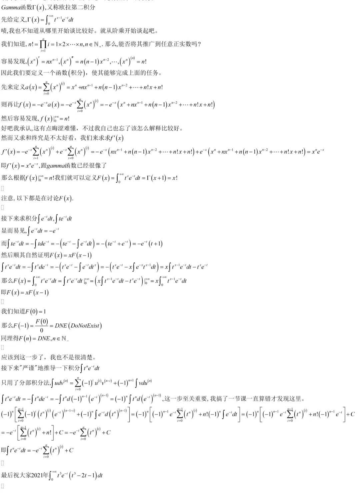

好，终于把坑填完了。总算跟上进度了。

## 不定积分

### 原函数

!!! info ""
    若 $f(x)$ 在区间 $I$ 有定义，且存在 $F(x)$ 使

    $$
    F'(x) = f(x)
    $$

    则称 $F(x)$ 为 $f(x)$ 在区间 $I$ 上的一个原函数。

显然若 $F(x)$ 是 $f(x)$ 的一个原函数，则 $F(x) + C$ 也是 $f(x)$ 的一个原函数。也就是说，原函数不唯一。

### 不定积分

!!! info ""
    设 $f(x)$ 在区间 $I$ 有定义，则 $f(x)$ 的全体原函数称为 **$f(x)$ 的不定积分**，记作
    $$
    \int f(x) \d x
    $$

由此，若 $F(x)$ 是 $f(x)$ 的一个原函数，则

$$
\int f(x) \d x = F(x) + C
$$

根据课本，$\displaystyle\int$ 为*积分符号*，$C$ 为任意常数，称为*积分常数*，$f(x)\d x$ 称为*被积表达式*，$f(x)$ 称为*被积函数*，$x$ 称为*积分变量*。

### 基本积分公式表

$\displaystyle\int \cosh x \d x = {{c1::\sinh x+C}}$
| 不定积分 | 结果 | 注意 |
| :------: | :--: | :--: |
| $\displaystyle\int 0\d x$ | $C$ | - |
| $\displaystyle\int x^\mu \d x$ | $\displaystyle\frac{x^{\mu+1}}{\mu+1}+C$ | $\mu\neq-1$ |
| $\displaystyle\int \frac{1}{x}\d x$ | $\ln\left\lvert x \right\rvert+C$[^1][^2][^3] | - |
| $\displaystyle\int a^x \d x$ | $\displaystyle\frac{a^x}{\ln a}+C$ | $a>0$ 且 $a\neq1$ |
| $\displaystyle\int \sin x \d x$ | $-\cos x+C$ | - |
| $\displaystyle\int \cos x \d x$ | $\sin x+C$ | - |
| $\displaystyle\int \sec^2 x\d x$ | $\tan x+C$ | - |
| $\displaystyle\int \csc^2 x\d x$ | $-\cot x+C$ | 不熟 |
| $\displaystyle\int \dfrac{\d x}{\sqrt{1 - x^2}}$ | $\arcsin x+C$ 或 $- \arccos x + C$  | - |
| $\displaystyle\int \dfrac{\d x}{1 + x^2}$ | $\arctan x+C$ 或 $-\arccot x+C$ | - |
| $\displaystyle\int \dfrac{\d x}{\sqrt{x^2 \pm a^2}}$ | $\ln\left\lvert x + \sqrt{x^2 \pm a^2} \right\rvert+C$ | 不熟 |
| $\displaystyle\int \dfrac{\d x}{x^2 + a^2}$ | $\displaystyle\frac{1}{a}\arctan\frac{x}{a}+C$ | 不熟 |
| $\displaystyle\int \dfrac{\d x}{\sqrt{a^2 - x^2}}$ | $\displaystyle\arcsin\frac{x}{a}+C$ | $a > 0$ |
| $\displaystyle\int \sinh x \d x$ | $\cosh x+C$ | - |
| $\displaystyle\int \cosh x \d x$ | $\sinh x+C$ | - |

[^1]: $x < 0$ 时 $\displaystyle \int \dfrac{1}{x} \d x = \ln(-x) + C$
[^2]: 我记得高一的时候，在那本书上，也是像这样一个脚注，给了 $\displaystyle\int\dfrac{1}{x}\d x$ 的另一个原函数，即 $\ln \left\lvert x \right\rvert + \operatorname{sign}x$，$\operatorname{sign}x$ 为符号函数。显然这个函数也是 $\dfrac{1}{x}$ 的一个原函数。因此 $\ln \left\lvert x \right\rvert + C$ 的结果并不完全？
[^3]: 表格里 $\LaTeX$ 不支持用 `|`，不过 MPE 的预览可以用 `\| x \|` 作为 `| x |` 的代替。但是呢在博文则是原意显示为 $\| x \|$，但如果不用呢，又会出错。好在 $\LaTeX$ 为这些 delimiters 提供了专门的命令，算迂回解决了。

### 基本积分方法

#### 换元积分法

!!! info ""
    设 $u = g(x)$ 是区间 $I$ 上的可导函数，$f(u)$ 在 $g(I)$ 上有定义，则
    $$
    \int f(g(x))g'(x)\d x = \int f(u)\d u
    $$

!!! memo ""
    Copilot 给的定义，因为我觉得没啥好说的。

#### 分部积分法

我们知道导数的乘积法则 $\d (uv) = u \d v + v \d u$，两边同时积分，得到

$$
\begin{aligned}
    \int \d (uv) &= \int u \d v + \int v \d u\\
    uv &= \int u \d v + \int v \d u\\
    \int u \d v &= uv - \int v \d u
\end{aligned}
$$

好，我们已经学会了分部积分法，那么试试看求积分

$$
\int t^{n} \e^{-t} \d t
$$

尘封的记忆，让我找找以前的记录。

下图来自 2020 年 12 月 31 日 22:20 的空间说说。



$\mathrm{Gamma}$ 函数，又称「欧拉第二积分」，是阶乘函数的推广，定义为

$$
\Gamma(x) = \int_0^{+\infty} t^{x-1} \e^{-t} \d t
$$

也就是说，我们只需求出积分 $\displaystyle \int t^x \e^{-t}\d t$ 即可。

让我仿照当时的方法，用 $\LaTeX$ 重写一遍（当时用的是 MathType，样子惨不忍睹）。

分部积分有

$$
\int u \d v^{(n)} = \sum_{k=0}^{n} (-1)^k u^{(k)} v^{(n-k)} + (-1)^{n+1} \int v \d u^{(n)}
$$

!!! note ""
    照抄时我误以为 $u, v$ 是变量，其实 $u, v$ 是函数。不妨把它们看作是关于 $x$ 的函数，从而有

    $$
    \begin{aligned}
        \int u \d v^{(n)} &= u v^{(n)} - \int v^{(n)} \d u\\
        &= u v^{(n)} - \int \dfrac{\d v^{(n - 1)}}{\d x} \d u\\
        &= u v^{(n)} - \int \dfrac{\d u}{\d x} \d v^{(n - 1)}\\
        &= u v^{(n)} - \int u^{(1)} \d v^{(n - 1)}\\
    \end{aligned}
    $$

    以此类推，则有上式成立。确实只用到了分部积分。

从而

$$
\begin{aligned}
    \int t^n \e^{-t} \d t &= - \int t^n \d \e^{-t}\\
    &= - \int t^n \d \left((-1)^{n-1} \dfrac{\d ^{(n-1)}\e^{-t}}{\d t^{(n-1)}}\right)\\
    &= (-1)^{n} \int t^n \d \left(\dfrac{\d ^{(n-1)}\e^{-t}}{\d t^{(n-1)}}\right)\\
    &= (-1)^{n} \left[ \sum_{k=0}^{n - 1}(-1)^k \left(\dfrac{\d^k t^n}{\d t ^k}\right)\left(\dfrac{\d^{(n - 1 - k)}\e^{-t} }{\d t^{(n - 1 - k)}}\right) + (-1)^n \int \e^{-t} \d \left( \dfrac{\d^{(n-1)} t^n}{\d t^{(n-1)}} \right)  \right]\\
    &= (-1)^n\left[ (-1)^{n-1}\e^{-t} \sum_{k=0}^{n - 1}\dfrac{\d^k t^n}{\d t ^k} + (-1)^n n! \int \e^{-t}\d t\right]\\
    &= (-1)^n\left[ (-1)^{n-1}\e^{-t} \sum_{k=0}^{n - 1} \dfrac{n!}{(n-k)!}t^{n-k} + (-1)^{n-1} n! \e^{-t}\right] + C\\
    &= -\e^{-t}\left[ \sum_{k=0}^{n - 1} \dfrac{n!}{(n-k)!}t^{n-k} + n!\right] + C\\
    &= -\e^{-t} \sum_{k=0}^{n} \dfrac{n!}{(n-k)!}t^{n-k} + C\\
    &= -\e^{-t} \sum_{k=0}^{n} \dfrac{n!}{k!}t^{k} + C
\end{aligned}
$$

!!! memo ""
    看不懂？我也看不懂，毕竟是我三年前写的东西了。待我有时间重新参悟一下，顺便看看有没有错。

    参悟完了，其实很简单，没发现有错，同时把过程和结果改进了一下。

    ~~我高一还是蛮厉害的嘛~~（自恋）。

    另外其实还可以改进一下过程，由于我高一知识有限而没能意识到，只不过为了和图片保持一致，还是使用高一的方法。口述一下更简单的方法：上面的方法实际上将 $\e^{-t}$ 变成 $n-1$ 阶的导数，从而使用分部积分进行积分，最后只需要求一个简单的 $\displaystyle \int \e^{-t}\d t$ 即可。可见其实我还是思维比较狭隘，完全可以直接变成 $\displaystyle \int \e^{-t}\d C = C$，即视为 $n$ 阶导数，从而只有前面的求和 $\displaystyle \sum_{k=0}^{n}(-1)^k \left(\dfrac{\d^k t^n}{\d t ^k}\right)\left(\dfrac{\d^{(n - k)}\e^{-t} }{\d t^{(n - k)}}\right)$ ，直接得到结果。


### 有理函数的积分

有理函数积分可以划归为 $\dfrac{1}{(x-a)^k}$ 与 $\dfrac{Mx + N}{(x^2 + px + q)^k}$ 的积分。

#### $\dfrac{1}{(x-a)^k}$ 的积分

显然有

$$
\int \dfrac{1}{(x-a)^k} \d x = \begin{cases}
    \dfrac{1}{(1-k)}(x-a)^{1-k} + C, & k \neq 1\\
    \ln \left\lvert x - a \right\rvert + C, & k = 1
\end{cases}
$$

#### $\dfrac{Mx + N}{(x^2 + px + q)^k}$ 的积分

记 $I_k^1 = \displaystyle \int \dfrac{\d \left(x^2 + px + q\right)}{\left(x^2 + px + q\right)^k}$，$I_k^2 = \displaystyle \int \dfrac{1}{\left(x^2 + px + q\right)^k} \d x$，则

$$
\begin{aligned}
    \int \dfrac{Mx + N}{(x^2 + px + q)^k} \d x &= \int \dfrac{\frac{M}{2}\left(2x + p\right) + \left(N - \frac{M}{2}p\right)}{\left(x^2 + px + q\right)^k} \d x\\
    &= \dfrac{M}{2}\int \dfrac{\d \left(x^2 + px + q\right)}{\left(x^2 + px + q\right)^k} + \left(N - \frac{M}{2}p\right)\int \dfrac{1}{\left(x^2 + px + q\right)^k} \d x\\
    &= \dfrac{M}{2}I_k^1 + \left(N - \frac{M}{2}p\right)I_k^2
\end{aligned}
$$

对 $I_k^1$，有

$$
I_k^1 = \int \dfrac{\d \left(x^2 + px + q\right)}{\left(x^2 + px + q\right)^k} = \begin{cases}
    \ln \left( x^2 + px + q \right) + C, & k = 1\\
    \dfrac{1}{(1-k)}\left(x^2 + px + q\right)^{1-k} + C, & k > 1
\end{cases}
$$

对 $I_k^2$，有

令 $t = x + \dfrac{p}{2},\, a^2 = q - \dfrac{p^2}{4}$，则 $\d x = \d t,\, x^2 + px + q = t^2 + a^2$，从而

$$
I_k^2 = \int \dfrac{1}{\left(x^2 + px + q\right)^k} \d x = \int \dfrac{1}{\left(t^2 + a^2\right)^k} \d t
$$

而

$$
I_1^2 = \int \dfrac{1}{\left(t^2 + a^2\right)} \d t = \dfrac{1}{a}\arctan \dfrac{t}{a} + C
$$

注意到

$$
\dfrac{\d }{\d x} \dfrac{t}{(t^2 + a^2)^k} = \dfrac{(1-2k)t^2 + a^2}{(t^2 + a^2)^{k+1}}
$$

即

$$
\dfrac{t}{(t^2 + a^2)^k} = \int \dfrac{(1-2k)t^2 + a^2}{(t^2 + a^2)^{k+1}} \d x + C
$$

从而有

$$
\begin{aligned}
    I_k^2 &= \int \dfrac{1}{\left(t^2 + a^2\right)^k} \d x\\
    &= \int \dfrac{(1-2k)(t^2 + a^2)}{(1-2k)\left(t^2 + a^2\right)^{k+1}} \d t\\
    &= \int \dfrac{(1-2k)t^2 + a^2 -2ka^2}{(1-2k)(t^2 + a^2)^{k+1}} \d x\\
    &= \dfrac{1}{1- 2k}\int \dfrac{(1-2k)t^2 + a^2}{(t^2 + a^2)^{k+1}} \d x - \dfrac{2ka^2}{1-2k}\int \dfrac{1}{(t^2 + a^2)^{k+1}} \d x\\
    &= \dfrac{1}{1-2k}\left( \dfrac{t}{(t^2 + a^2)^k} -2ka^2 I_{k+1}^2 \right)
\end{aligned}
$$

从而有递推

$$
I_{k+1}^2 = \dfrac{1}{2ka^2} \left[ \dfrac{t}{(t^2 + a^2)^k} + (2k-1) I_k^2 \right]
$$

这也正是课本上递推公式的由来。

由此说明了有理函数积分的可解性，但由于 $I_k^2$ 递推通项不知，因此实际求解相当复杂。

以下是 Mathematica 求解 $I_k^2 $ 的结果

```mathematica
Integrate[1/(x^2+px+q)^k,x]//FullSimplify
```

$$
x \left(x^2 + px+q\right)^{-k} \left(\frac{x^2}{px+q}+1\right)^k \phantom{\,}_2F_1\left(\frac{1}{2},k;\frac{3}{2};-\frac{x^2}{px+q}\right)
$$

### 三角函数有理式的积分

借助万能代换，令 $t = \tan \dfrac{x}{2}$，则

$$
\left\lbrace\begin{aligned}
    \sin x &= \dfrac{2t}{1+t^2}\\
    \cos x &= \dfrac{1-t^2}{1+t^2}\\
    \tan x &= \dfrac{2t}{1-t^2}
\end{aligned}\right.
$$

再由上面的结论知可解。

## 定积分

### 定义

设 $f(x)$ 在区间 $[a, b]$ 上有定义，将区间 $[a, b]$ 分成 $n$ 个小区间，其中第 $i$ 个小区间为 $[x_{i-1}, x_i]$，$x_{i-1}$ 为第 $i$ 个小区间的左端点，$x_i$ 为第 $i$ 个小区间的右端点，记 $x_0 = a$，$x_n = b$，记 $\Delta x_i = x_i - x_{i-1}$，记 $\lambda_i = \displaystyle \inf_{x \in [x_{i-1}, x_i]} f(x)$，$\mu_i = \displaystyle \sup_{x \in [x_{i-1}, x_i]} f(x)$，则

$$
\begin{aligned}
    \sum_{i=1}^{n} \lambda_i \Delta x_i &\leqslant \sum_{i=1}^{n} f(x) \Delta x_i \leqslant \sum_{i=1}^{n} \mu_i \Delta x_i\\
    \lim_{\max \{\Delta x_i\} \to 0} \sum_{i=1}^{n} \lambda_i \Delta x_i &\leqslant \lim_{\max \{\Delta x_i\} \to 0} \sum_{i=1}^{n} f(x) \Delta x_i \leqslant \lim_{\max \{\Delta x_i\} \to 0} \sum_{i=1}^{n} \mu_i \Delta x_i\\
\end{aligned}
$$

若左右两个极限存在且 $\displaystyle \lim_{\max \{\Delta x_i\} \to 0} \sum_{i=1}^{n} \lambda_i \Delta x_i = \displaystyle \lim_{\max \{\Delta x_i\} \to 0} \sum_{i=1}^{n} \mu_i \Delta x_i$，则称 $f(x)$ 在 $[a, b]$ 上可积，记为 $\displaystyle \int_a^b f(x) \d x$。

!!! memo ""
    跟课本定义稍有不同，是 Copilot 给的定义，我觉得比课本的好一点。

同样地有

$$
\begin{align}
    \int_a^b f(x) \d x = \lim_{\max \{\Delta x_i\} \to 0} \sum_{i=1}^{n} f(\xi_i) \Delta x_i
\end{align}
$$

其中 $\xi_i \in [x_{i-1}, x_i]$。这就是课本的定义。

$(1)$ 称为**黎曼和**，$\displaystyle \int_{a}^{b}f(x)\d x$ 称为**黎曼积分**，简称**定积分**。

### 定积分的性质

!!! info ""
    若 $f(x)$ 在 $[a, b]$ 上可积，则 $f(x)$ 在 $[a, b]$ 上有界。

!!! memo ""
    这里我想到个例子 $\displaystyle \int_{0}^{1} \dfrac{1}{\sqrt{x}}\d x$，$f(x)$ 在 $[0, 1]$ 上无界，但是 $\displaystyle \int_{0}^{1} \dfrac{1}{\sqrt{x}}\d x = 2 \sqrt{x}\as_0^1=2$，这是为什么呢？

    查了一下，原来是因为 $\displaystyle \int_{0}^{1} \dfrac{1}{\sqrt{x}}\d x$ 是所谓的**瑕积分**，是用<u>定积分的极限</u>来表示的，因此这与「定积分可积必有界」不矛盾。

!!! info 积分中值定理
    设 $f(x)$ 在 $[a, b]$ 上连续，$g(x)$ 在 $[a, b]$ 不变号，则存在 $\xi \in [a, b]$ 使

    $$
    \int_a^b f(x)g(x) \d x = f(\xi) \int_a^b g(x) \d x
    $$

    证明：

    由于 $g(x)$ 在 $[a, b]$ 不变号，不妨设 $g(x) \ge 0$，则

    $$
    \left(\inf_{x \in [a, b]} f(x)\right) g(x) \leqslant f(x)g(x) \leqslant \left(\sup_{x \in [a, b]} f(x)\right) g(x)
    $$

    从而

    $$
    \inf_{x \in [a, b]} f(x) \int_a^b g(x) \d x \leqslant \int_a^b f(x)g(x) \d x \leqslant \sup_{x \in [a, b]} f(x) \int_a^b g(x) \d x
    $$

    若 $\displaystyle \int_{a}^{b}g(x)\d x = 0$，则 $\displaystyle \int_{a}^{b}f(x)g(x)\d x = 0$，此时 $\xi$ 可取任意值。

    否则，由于 $f(x)$ 在 $[a, b]$ 上连续，因此存在 $\xi \in [a, b]$ 使 $f(\xi) = \displaystyle \frac{\displaystyle \int_a^b f(x)g(x) \d x}{\displaystyle \int_a^b g(x) \d x} \in \left[\inf_{x \in [a, b]} f(x), \sup_{x \in [a, b]} f(x)\right]$，从而

    $$
    \int_a^b f(x)g(x) \d x = f(\xi) \int_a^b g(x) \d x
    $$

!!! info ""
    若取 $g(x) \equiv 1$，则有

    $$
    \int_a^b f(x) \d x = f(\xi) (b - a)
    $$

    从而定义**广义平均值** $\displaystyle \bar{y} = \frac{1}{b - a} \int_a^b f(x) \d x$。

### 微积分基本定理

#### 微积分学第一基本定理

!!! info ""
    设 $f(x)$ 在 $[a, b]$ 上连续，则 $f(x)$ 在 $[a, b]$ 上可积。

    即连续函数的原函数或不定积分必存在。

#### 微积分学第二基本定理（牛顿-莱布尼茨公式）

!!! info ""
    设 $f(x)$ 在 $[a, b]$ 上连续，$F(x)$ 是 $f(x)$ 在 $[a, b]$ 上的一个原函数，则

    $$
    \int_a^b f(x) \d x = F(b) - F(a)
    $$

## 数值积分

设 $f(x)$ 在 $[a, b]$ 连续。

### 矩形法

将 $[a, b]$ *均分*成 $n$ 个小区间，其中第 $i$ 个小区间为 $[x_{i-1}, x_i]$，$x_{i-1}$ 为第 $i$ 个小区间的左端点，$x_i$ 为第 $i$ 个小区间的右端点，记 $x_0 = a$，$x_n = b$，记 $\Delta x_i = x_i - x_{i-1}$，则

$$
\begin{aligned}
    \int_{a}^{b}f(x)\d x &\approx \sum_{i=1}^{n} f(x_i) \Delta x_i\\
    &= \dfrac{b - a}{n} \sum_{i=1}^{n} f\left(x_i\right)
\end{aligned}
$$

也可以取 $f(x_{i-1})$，此时

$$
\begin{aligned}
    \int_{a}^{b}f(x)\d x &\approx \dfrac{b - a}{n} \sum_{i=1}^{n} f\left(x_{i-1}\right)
\end{aligned}
$$

设 $f'(x)$ 在 $[a, b]$ 连续，记余项

$$
R_n = \int_{a}^{b}f(x)\d x - \dfrac{b - a}{n} \sum_{i=1}^{n} f\left(x_i\right)
$$

则有

$$
\left\lvert R_n \right\rvert \leqslant \dfrac{(b - a)^2}{2n}M_1
$$

其中 $M_1 = \displaystyle \max_{x \in [a, b]} \left\lvert f'(x) \right\rvert$。

### 梯形法

使用梯形面积近似曲边梯形面积，即使用 $f(x_{i-1})$ 与 $f(x_i)$ 的平均值 $\dfrac{f(x_{i-1}) + f(x_i)}{2}$ 代替 $f(x_i)$，则

$$
\begin{aligned}
    \int_{a}^{b}f(x)\d x &\approx \sum_{i=1}^{n} \dfrac{f(x_{i-1}) + f(x_i)}{2} \Delta x_i\\
    &= \dfrac{b - a}{2n} \sum_{i=1}^{n} \left[ f\left(x_{i-1}\right) + f\left(x_i\right) \right]\\
    &= \dfrac{b - a}{n} \left[ \dfrac{f\left(x_0\right) + f(x_n)}{2} + \sum_{i=1}^{n-1} f\left(x_i\right) \right]\\
\end{aligned}
$$

设 $f''(x)$ 在 $[a, b]$ 连续，记余项

$$
R_n = \int_{a}^{b}f(x)\d x - \dfrac{b - a}{n} \left[ \dfrac{f\left(x_0\right) + f(x_n)}{2} + \sum_{i=1}^{n-1} f\left(x_i\right) \right]
$$

则有

$$
\left\lvert R_n \right\rvert \leqslant \dfrac{(b - a)^3}{12n^2}M_2
$$

其中 $M_2 = \displaystyle \max_{x \in [a, b]} \left\lvert f''(x) \right\rvert$。

### （抛物线法）辛普森法

使用抛物线面积近似曲边梯形面积。不妨设 $y = ax^2 + bx + c$ 通过 $(x_0, y_0),\, \left(\dfrac{x_0 + x_2}{2}, y_1\right),\, (x_2, y_2)$，则

$$
\int_{x_0}^{x_2}y\d x = \dfrac{x_2 - x_0}{6}\left(y_0 + 4y_1 + y_2\right)
$$

将 $[a, b]$ 均分成 $2n$ 个小区间，其中第 $i$ 个小区间为 $[x_{2i-2}, x_{2i}]$，记 $x_0 = a$，$x_{2n} = b$，则 $\Delta x = \dfrac{b-a}{2n}$，则 $\left[ x_{2i - 2}, x_{2i} \right] $ 上两个曲边梯形的近似值可以看作是 $[x_{2i - 2}, x_{2i}]$ 上一个抛物线的近似值，从而有

$$
\dfrac{\Delta x}{3}\left[ f\left(x_{2i - 2}\right) + 4f\left(x_{2i - 1}\right) + f\left(x_{2i}\right) \right] = \dfrac{b-a}{6n}\left[ f\left(x_{2i - 2}\right) + 4f\left(x_{2i - 1}\right) + f\left(x_{2i}\right) \right]
$$

累加有

$$
\begin{aligned}
    \int_{a}^{b}f(x)\d x &\approx \sum_{i=1}^{n} \dfrac{b-a}{6n}\left[ f\left(x_{2i - 2}\right) + 4f\left(x_{2i - 1}\right) + f\left(x_{2i}\right) \right]\\
    &= \dfrac{b-a}{6n}\left[ f\left(x_0\right) + f\left( x_{2n} \right) + 4\sum_{i=1}^{n} f\left(x_{2i - 1}\right) + 2\sum_{i=1}^{n-1} f\left(x_{2i}\right)\right]
\end{aligned}
$$

设 $f^{(4)}(x)$ 在 $[a, b]$ 连续，记余项

$$
R_n = \int_{a}^{b}f(x)\d x - \dfrac{b-a}{6n}\left[ f\left(x_0\right) + f\left( x_{2n} \right) + 4\sum_{i=1}^{n} f\left(x_{2i - 1}\right) + 2\sum_{i=1}^{n-1} f\left(x_{2i}\right)\right]
$$

则有

$$
\left\lvert R_n \right\rvert \leqslant \dfrac{(b-a)^5}{2880n^4}M_4
$$

其中 $M_4 = \displaystyle \max_{x \in [a, b]} \left\lvert f^{(4)}(x) \right\rvert$。

## 定积分的应用

### 笛卡尔坐标系平面图形面积

只需记住 $f(x),\, g(x),\, x = a,\, x = b$ 围成的平面图形面积为

$$
\int_{a}^{b} \left( f(x) - g(x) \right) \d x
$$

同时不一定要拘束在 $x$，若是从 $x$ 轴角度上看不是个函数，从 $y$ 轴角度上看是个函数，可以从 $y$ 轴的角度进行积分以简化运算（否则要将 $x$ 轴角度的图形分成多个部分进行积分）。

### 极坐标系平面图形面积

取角度微元 $\d \theta$，有

$$
\d A = \dfrac{1}{2} \rho^2(\theta) \d \theta
$$

从而

$$
A = \dfrac{1}{2} \int_{\alpha}^{\beta} \rho^2(\theta) \d \theta
$$

### 旋转体体积

!!! info ""
    设 $f(x)$ 在 $[a, b]$ 上连续，将 $[a, b]$ 绕 $x$ 轴旋转一周，得到旋转体，其体积为

    $$
    V = \pi \int_{a}^{b} f^2(x) \d x
    $$

    ---

    即取以 $x$ 轴为法向量的圆盘微元，体积

    $$
    \d V = S \d x = \pi f^2(x) \d x
    $$

!!! info ""
    设 $f(x)$ 在 $[a, b]$ 上连续，将 $[a, b]$ 绕 $y$ 轴旋转一周，得到旋转体，其体积为

    $$
    V = 2\pi \int_{a}^{b} xf(x) \d x
    $$

    ---

    即取法向量为 $y$ 轴的圆筒微元，体积

    $$
    \d V = C h \d x = 2\pi x f(x) \d x
    $$

### 平面曲线弧长

!!! info ""
    设 $y = f(x)$ 在 $[a, b]$ 上连续可导，则其弧长为

    $$
    L = \int_{a}^{b} \sqrt{1 + \left( f'(x) \right)^2} \d x
    $$

    ---

    化曲为直，弧长微元长度

    $$
    \d L = \sqrt{1 + \left( f'(x) \right)^2} \d x
    $$

!!! info ""
    设曲线由参数方程

    $$
    \left\lbrace\begin{aligned}
        x &= \varphi(t)\\
        y &= \psi(t)
    \end{aligned}\right.,\quad \alpha \le t \le \beta
    $$

    确定，则换元积分有弧长

    $$
    L = \int_{\alpha}^{\beta} \sqrt{\left( \varphi'(t) \right)^2 + \left( \psi'(t) \right)^2} \d t
    $$

!!! info ""
    若曲线由极坐标方程

    $$
    \rho = \rho(\theta),\quad \alpha \le \theta \le \beta
    $$

    确定，且 $\rho(\theta)$ 在 $[\alpha, \beta]$ 上连续可导，则其弧长为

    $$
    L = \int_{\alpha}^{\beta} \sqrt{\left( \rho(\theta) \right)^2 + \left( \rho'(\theta) \right)^2} \d \theta
    $$

    ---

    写成以极角 $\theta$ 为参数的参数方程

    $$
    \left\lbrace\begin{aligned}
        x &= \rho(\theta) \cos \theta\\
        y &= \rho(\theta) \sin \theta
    \end{aligned}\right.,\quad \alpha \le \theta \le \beta
    $$

    有

    $$
    \begin{aligned}
        x'^2 + y'^2 ={} & \left[ \rho'(\theta) \cos \theta - \rho(\theta) \sin \theta \right]^2\\
         +{} & \left[ \rho'(\theta) \sin \theta + \rho(\theta) \cos \theta \right]^2\\
        ={} & \left( \rho'(\theta) \right)^2 + \left( \rho(\theta) \right)^2
    \end{aligned}
    $$

从而有**弧微分**

$$
\begin{aligned}
    \d s &= \sqrt{1 + \left(f'(x)\right)^2}\d x\\
    \d s &= \sqrt{\left( \varphi'(t) \right)^2 + \left( \psi'(t) \right)^2} \d t\\
    \d s &= \sqrt{\left( \rho(\theta) \right)^2 + \left( \rho'(\theta) \right)^2} \d \theta
\end{aligned}
$$

### 椭圆积分

对于 $k \in (0, 1),\, h \in \C$，有三类椭圆积分

!!! info 第一类椭圆积分
    $$
    F(k, \theta) = \int_{0}^{\theta} \frac{\d \varphi}{\sqrt{1 - k^2 \sin^2 \varphi}}
    $$

!!! info 第二类椭圆积分
    $$
    F(k, \theta) = \int_{0}^{\theta} \sqrt{1 - k^2 \sin^2 \varphi} \d \varphi
    $$

!!! info 第三类椭圆积分
    $$
    G(k, \theta, h) = \int_{0}^{\theta} \frac{\d \theta}{\left( 1 + h \sin^2 \theta \right) \sqrt{1 - k^2 \sin^2 \theta}}
    $$

椭圆积分没有*初等函数有限的表示形式的原函数*，只能用数值积分进行计算。

!!! note ""
    之所以叫椭圆积分，是因为在计算椭圆周长时会出现这样的积分。椭圆面积可以比较容易地计算，但周长则需要求复杂的椭圆积分，没有初等函数有限的表示形式的原函数，只能用数值积分进行计算。

    也就是说积分时看到如上形式就可以死心了，不要死磕。

### 旋转曲面面积

!!! info ""
    设 $y = f(x)$ 在 $[a, b]$ 上连续可导，将 $f(x)$ 绕 $x$ 轴旋转一周，得到旋转曲面，其面积为

    $$
    S_x = 2\pi \int_{a}^{b} f(x) \sqrt{1 + \left( f'(x) \right)^2} \d x
    $$

    ---

    由微元面积

    $$
    \begin{aligned}
        \d S &= C \d x\\
        &= 2\pi f(x) \sqrt{1 + \left( f'(x) \right)^2} \d x
    \end{aligned}
    $$

!!! info ""
    设 $y = f(x)$ 在 $[a, b]$ 上连续可导，将 $f(x)$ 绕 $y$ 轴旋转一周，得到旋转曲面，其面积为

    $$
    S_y = 2\pi \int_{a}^{b} x \sqrt{1 + \left( f'(x) \right)^2} \d x
    $$

    ---

    由微元面积

    $$
    \begin{aligned}
        \d S &= C \d x\\
        &= 2\pi x \sqrt{1 + \left( f'(x) \right)^2} \d x
    \end{aligned}
    $$

!!! info ""
    设曲线由参数方程

    $$
    \left\lbrace\begin{aligned}
        x &= \varphi(t)\\
        y &= \psi(t)
    \end{aligned}\right.,\quad \alpha \le t \le \beta
    $$

    确定，则

    $$
    \begin{aligned}
        S_x &= 2\pi \int_{\alpha}^{\beta} \psi(t) \sqrt{\left( \varphi'(t) \right)^2 + \left( \psi'(t) \right)^2} \d t\\
        S_y &= 2\pi \int_{\alpha}^{\beta} \varphi(t) \sqrt{\left( \varphi'(t) \right)^2 + \left( \psi'(t) \right)^2} \d t
    \end{aligned}
    $$

!!! info ""
    若曲线由极坐标方程

    $$
    \rho = \rho(\theta),\quad \alpha \le \theta \le \beta
    $$

    确定，且 $\rho(\theta)$ 在 $[\alpha, \beta]$ 上连续可导，则其面积为

    $$
    \begin{aligned}
        S_x &= 2\pi \int_{\alpha}^{\beta} \rho(\theta) \sin \theta \sqrt{\left( \rho(\theta) \right)^2 + \left( \rho'(\theta) \right)^2} \d \theta\\
        S_y &= 2\pi \int_{\alpha}^{\beta} \rho(\theta) \cos \theta \sqrt{\left( \rho(\theta) \right)^2 + \left( \rho'(\theta) \right)^2} \d \theta
    \end{aligned}
    $$

### 曲率

曲率在[我之前的博文](/2022/10/national-day-notes#曲率半径)就已经提及了，并给出了公式的推导过程。

当时的思路是用一个「曲率圆」去近似曲线，所得到的曲率圆的半径就是曲率半径，而曲率就是曲率圆的半径的倒数。

课本上给出了曲率的另一种阐述。

在函数 $f(x)$ 某处（$x_0$）切线倾斜角 $\alpha$ 满足

$$
\tan \alpha = f'(x_0)
$$

给 $x_0$ 以增量 $\Delta x$，从而有倾斜角 $\alpha$ 有增量

$$
\Delta \alpha = \arctan f'(x_0 + \Delta x) - \arctan f'(x_0)
$$

在 $\Delta x$ 的增量中，有弧长的增量 $\Delta s$。

注意到对于相同的弧长增量，若 $\Delta \alpha$ 越大，则曲线越弯曲，因此定义平均曲率

$$
\bar{\kappa} = \dfrac{\Delta \alpha}{\Delta s}
$$

并定义曲率

$$
\kappa = \left\lvert \lim_{\Delta s \to 0} \dfrac{\Delta \alpha}{\Delta s} \right\rvert
$$

并记曲率半径

$$
R = \dfrac{1}{\kappa}
$$

而

$$
\left\lvert \Delta s \right\rvert = \left\lvert \int_{x_0}^{x_0 + \Delta x}\sqrt{1 + \left( f'(t) \right) ^2}\d t \right\rvert
$$

有

$$
\lim\limits_{\Delta x \to 0} \dfrac{\Delta s}{\Delta x} = \sqrt{1 + \left( f'(x_0) \right)^2}
$$

而

$$
\begin{aligned}
    \lim\limits_{\Delta x \to 0} \dfrac{\Delta \alpha}{\Delta x} &= \alpha'(x_0)\\
    &= \dfrac{f''(x_0)}{1 + \left( f'(x_0) \right)^2}
\end{aligned}
$$

从而有

$$
\kappa = \dfrac{\left\lvert f''(x_0) \right\rvert}{\left( 1 + \left( f'(x_0) \right)^2 \right)^{3 / 2}}
$$

若曲线由参数方程

$$
\left\lbrace\begin{aligned}
    x &= \varphi(t)\\
    y &= \psi(t)
\end{aligned}\right.
$$

确定，则

$$
\kappa = \dfrac{\left\lvert \varphi'(t) \psi''(t) - \varphi''(t) \psi'(t) \right\rvert}{\left[ \left( \varphi'(t) \right)^2 + \left( \psi'(t) \right)^2 \right]^{3 / 2}}
$$

!!! memo ""
    完全没有记忆的欲望。。。

对 $A\left(x_0, f(x_0)\right)$ 与 $B \left(x_0 + \Delta x, f(x_0 + \Delta x)\right)$ 处切线作垂线，交于一点 $P$。

若 $\Delta x \to 0$，可近似认为弧长微元为圆的一部分，从而有

$$
\left\lbrace\begin{aligned}
    PA = PB = R\\
    \angle APB = \Delta \alpha
\end{aligned}\right.
$$

从而有

$$
\Delta s = R \Delta \alpha
$$

也就是我一开始的思路。

!!! memo ""
    $\kappa$（kappa）是 Copilot 给的提示，课本上用的是 $K$，我之前用的是 $\rho$，但由于 ~~Copilot 是我大爹~~ $\kappa$ 更好看，我就用 $\kappa$ 了。

## 广义积分

至目前为止探讨的定积分都是在有限的区间 $[a, b]$ 上进行的，同时函数在这个区间上还有界。但我也提到过了对于 $\displaystyle \int_{0}^{1} \dfrac{1}{\sqrt{x}}\d x$ 这样的积分，似乎可以使用牛顿-莱布尼茨公式得到一个有限的结果。因此，对于无限区间以及无界函数的积分的研究就很有必要。

### 定义

以下两类积分统称为**广义积分**（**瑕积分**、**反常积分**）：
1. 无穷区间的积分
2. 无界函数的积分

!!! info 无穷区间上的积分
    设 $f(x)$ 在区间 $[a, +\infty)$ 上有定义，且 $\forall_{b \in (a, +\infty )}, f(x)$ 在 $[a, b]$ 上可积。则定义无穷区间上的广义积分

    $$
    \int_{a}^{+\infty} f(x) \d x = \lim_{b \to +\infty} \int_{a}^{b} f(x) \d x
    $$

    若该极限存在，则称该广义积分**收敛**，否则称其**发散**。称 $+\infty $ 为该广义积分的**瑕点**。

    同理，可定义 $(-\infty, a]$ 上的广义积分 $\displaystyle \int_{-\infty}^{a} f(x) \d x$，及 $(-\infty, +\infty)$ 上的广义积分 $\displaystyle \int_{-\infty}^{+\infty} f(x) \d x$：

    $$
    \int_{-\infty}^{+\infty} f(x) \d x = \int_{-\infty}^{c} f(x) \d x + \int_{c}^{+\infty} f(x) \d x
    $$

    其中 $c$ 为任意常数。

    因此，只有当 $\displaystyle \int_{-\infty}^{c} f(x) \d x$ 和 $\displaystyle \int_{c}^{+\infty} f(x) \d x$ 均收敛时，$\displaystyle \int_{-\infty}^{+\infty} f(x) \d x$ 才收敛。

$c$ 的选取并不影响广义积分的收敛性，因为

$$
\begin{aligned}
    \int_{-\infty }^{c}f(x)\d x + \int_{c}^{+\infty }f(x)\d x &= \int_{-\infty }^{c}f(x)\d x + \left(\int_{c}^{d}f(x)\d x + \int_{d}^{+\infty }f(x)\d x\right) \\
    &= \left(\int_{-\infty }^{c}f(x)\d x + \int_{c}^{d}f(x)\d x\right) + \int_{d}^{+\infty }f(x)\d x \\
    &= \int_{-\infty }^{d}f(x)\d x + \int_{d}^{+\infty }f(x)\d x
\end{aligned}
$$

于是有一个[很著名的问题](https://www.zhihu.com/question/508340228)。

!!! example ""
    求广义积分

    $$
    \int_{-\infty }^{+\infty }\arctan x\d x
    $$

    很容易这样想，$\arctan x$ 是奇函数，而且 $\forall_{m \in \R}, \displaystyle \int_{-m}^{m}\arctan x\d x = 0$，从而

    $$
    \begin{aligned}
        \int_{-\infty }^{+\infty }\arctan x\d x &= \lim_{m \to +\infty }\int_{-m}^{m}\arctan x\d x \\
        &= 0
    \end{aligned}
    $$

    这样做是错误的，根据广义积分的定义可知，$\displaystyle \int_{-\infty }^{+\infty }\arctan x\d x$ 的收敛性取决于 $\displaystyle \int_{-\infty }^{c}\arctan x\d x$ 和 $\displaystyle \int_{c}^{+\infty }\arctan x\d x$ 的收敛性，显然这两个极限不存在，因此 $\displaystyle \int_{-\infty }^{+\infty }\arctan x\d x$ 发散。

    这样的做法的错误在于，上下限的两个 $\infty $ 并不是一个无穷大，而错误做法假定了这两个无穷大是一样的。而例如 $\lim\limits_{x \to 0^{+}} \dfrac{1}{x} = +\infty,\, \lim\limits_{x \to 0} \dfrac{1}{x^2} = +\infty $，这两个都是正无穷大，但显然后者的增长速度要比前者快得多。

    不过这个假定无穷大收敛速率相同的值有个名字，叫做[**柯西主值**](https://en.wikipedia.org/wiki/Cauchy_principal_value)，记作 $\displaystyle \mathcal{P} \int_{-\infty }^{+\infty }f(x) \d x$ 或 $\displaystyle \mathrm{PV} \int_{-\infty }^{+\infty }f(x) \d x$，那么有

    $$
    \begin{aligned}
        \mathcal{P} \int_{-\infty }^{+\infty }\arctan x\d x &= \lim_{m \to +\infty }\int_{-m}^{m}\arctan x\d x\\
        &= 0
    \end{aligned}
    $$

!!! info 无界函数的积分
    设 $f(x)$ 在区间 $[a, b]$ 上有定义，且 $\forall_{x \in [a, b]}, f(x)$ 在 $x$ 处的邻域内可积。若 $f(x)$ 在 $a$ 的右邻域内无界，则定义无界函数的广义积分

    $$
    \int_{a}^{b} f(x) \d x = \lim_{\varepsilon \to 0^{+}} \int_{a + \varepsilon}^{b} f(x) \d x
    $$

    若该极限存在，则称该广义积分**收敛**，否则称其**发散**。称 $a$ 为该广义积分的**瑕点**（**奇点**）。

    同理，可定义 $b$ 为奇点时无界函数的广义积分

    $$
    \int_{a}^{b} f(x) \d x = \lim_{\varepsilon \to 0^{+}} \int_{a}^{b - \varepsilon} f(x) \d x
    $$

    若 $a,\, b$ 均为奇点，则定义

    $$
    \int_{a}^{b} f(x) \d x = \lim\limits_{\varepsilon \to 0^{+}} \int_{a + \varepsilon}^{c} f(x) \d x + \lim\limits_{\eta \to 0^{+}} \int_{c}^{b - \eta} f(x) \d x
    $$

    其中 $c$ 为任意常数。

    因此，只有当 $\displaystyle \int_{a}^{c} f(x) \d x$ 和 $\displaystyle \int_{c}^{b} f(x) \d x$ 均收敛时，$\displaystyle \int_{a}^{b} f(x) \d x$ 才收敛。

广义牛顿-莱布尼茨公式、广义换元积分公式及广义分部积分公式就不再赘述了。
