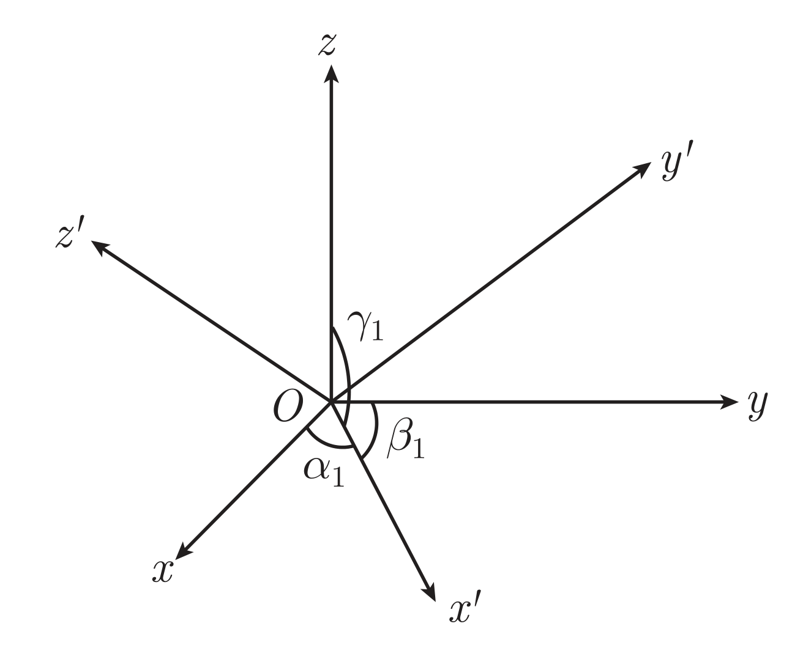
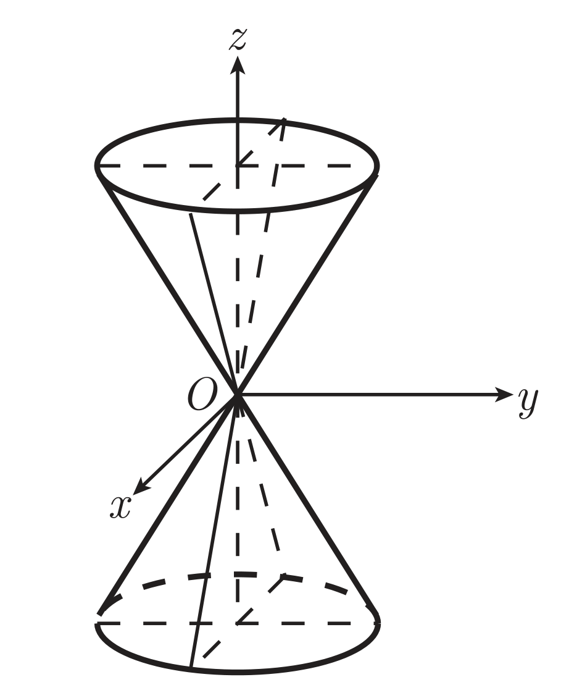
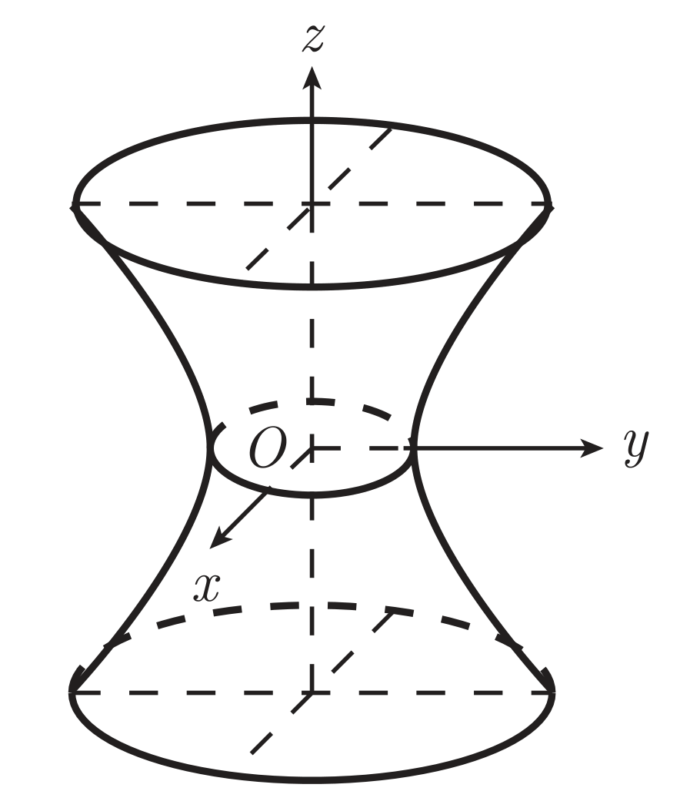
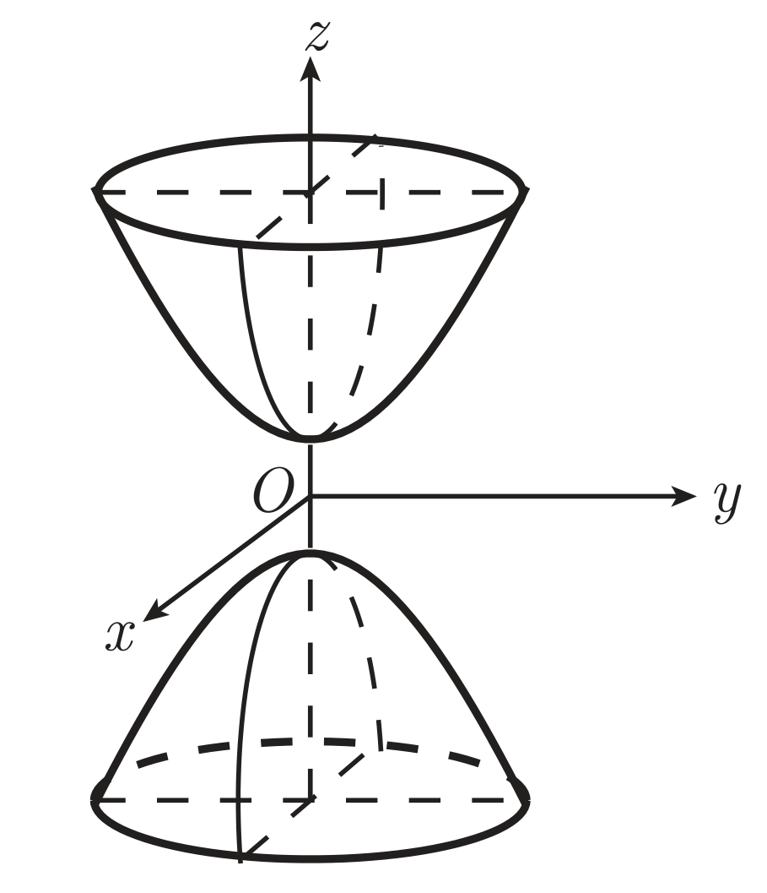
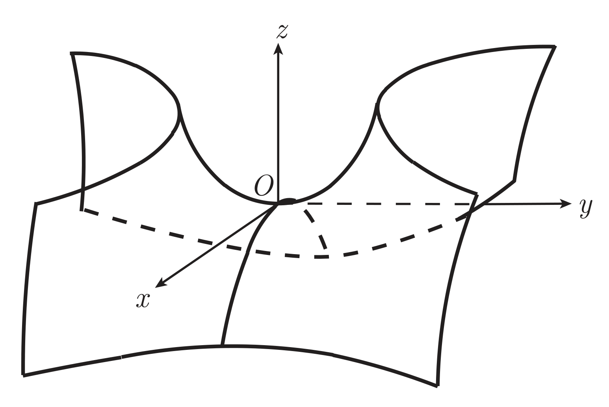

## 向量代数

### 概念

|                          卦限                          | $x$ | $y$ | $z$ |
|                          :--:                          | :-: | :-: | :-: |
|                      $\mathrm{I}$                      | $+$ | $+$ | $+$ |
|               $\mathrm{I\kern{-0.1em}I}$               | $-$ | $+$ | $+$ |
|        $\mathrm{I\kern{-0.1em}I\kern{-0.1em}I}$        | $-$ | $-$ | $+$ |
|               $\mathrm{I\kern{-0.1em}V}$               | $+$ | $-$ | $+$ |
|                      $\mathrm{V}$                      | $+$ | $+$ | $-$ |
|               $\mathrm{V\kern{-0.1em}I}$               | $-$ | $+$ | $-$ |
|        $\mathrm{V\kern{-0.1em}I\kern{-0.1em}I}$        | $-$ | $-$ | $-$ |
| $\mathrm{V\kern{-0.1em}I\kern{-0.1em}I\kern{-0.1em}I}$ | $+$ | $-$ | $-$ |

空间向量 $\vec{a}$ 与三个坐标轴 $x,\, y,\, z$ 正方向的夹角分别记作 $\alpha,\, \beta,\, \gamma$，称为向量 $\vec{a}$ 的**方向角**，方向角的余弦分别称为向量 $\vec{a}$ 的**方向余弦**，记作 $\cos\alpha,\, \cos\beta,\, \cos\gamma$。

与非零向量 $\vec{a}$ 同方向的单位向量记作 $\vec{a}^{\circ}$，从而

$$
\vec{a}^{\circ}=\dfrac{\vec{a}}{|\vec{a}|}=\left( \dfrac{a_1}{|\vec{a}|},\, \dfrac{a_2}{|\vec{a}|},\, \dfrac{a_3}{|\vec{a}|} \right) = \left( \cos\alpha,\, \cos\beta,\, \cos\gamma \right)
$$

向量 $\vec{a},\, \vec{b}$ 夹角记作 $\langle\vec{a},\vec{b}\rangle$，即 $\cos\langle\vec{a},\vec{b}\rangle=\dfrac{\vec{a}\boldsymbol{\cdot}\vec{b}}{|\vec{a}||\vec{b}|}$。

向量 $\vec{b}$ 在向量 $\vec{a}$ 上的**投影**（Projection），记作 $\operatorname{Prj}_{\vec{a}}\vec{b}$。投影是个数值，带有正负，其值 $\operatorname{Prj}_{\vec{a}}\vec{b}=|\vec{b}|\cos\langle\vec{a},\vec{b}\rangle$。

1. $\operatorname{Prj}_{\vec{u}}(\lambda \vec{a}) = \lambda \operatorname{Prj}_{\vec{u}}\vec{a}$
2. $\operatorname{Prj}_{\vec{u}}(\vec{a}+\vec{b}) = \operatorname{Prj}_{\vec{u}}\vec{a}+\operatorname{Prj}_{\vec{u}}\vec{b}$

对空间中一点 $M$，$\overrightarrow{OM}$ 称为**向径**（**矢径**）。

向量 $\vec{c}$ 若满足
1. $|\vec{c}| = |\vec{a}|\cdot |\vec{b}| \cdot  \sin\langle\vec{a},\vec{b}\rangle$
2. $\vec{c} \perp \vec{a},\, \vec{c} \perp \vec{b}$
3. $\vec{a},\, \vec{b},\, \vec{c}$ 构成右手系[^1]

则称 $\vec{c}$ 为向量 $\vec{a},\, \vec{b}$ 的**向量积**（**叉积**、**叉乘**、**外积**），记作 $\vec{c} = \vec{a}\boldsymbol{\times}\vec{b}$，若记 $\vec{a} = a_1\vec{\imath}+a_2\vec{\jmath}+a_3\vec{k}$，$\vec{b} = b_1\vec{\imath}+b_2\vec{\jmath}+b_3\vec{k}$，则

$$
\begin{aligned}
    \vec{a} \boldsymbol{\times} \vec{b} &= \left(
    \begin{vmatrix}
        a_2 & a_3 \\
        b_2 & b_3
    \end{vmatrix} \vec{\imath},\, -
    \begin{vmatrix}
        a_1 & a_3 \\
        b_1 & b_3
    \end{vmatrix} \vec{\jmath},\,
    \begin{vmatrix}
        a_1 & a_2 \\
        b_1 & b_2
    \end{vmatrix} \vec{k} \right) \\
    &= \begin{vmatrix}
        \vec{\imath} & \vec{\jmath} & \vec{k} \\
        a_1 & a_2 & a_3 \\
        b_1 & b_2 & b_3
    \end{vmatrix}
\end{aligned}
$$

[^1]: 数学物理的右手系经常用的是什么四指旋转什么的。我一般不用那种，我采用的是：大拇指指向 $\vec{a}$，食指指向 $\vec{b}$，中指自然伸出指向的方向即为 $\vec{c}$ 的方向。这样有一种每根手指都是向量的感觉。

$\vec{a} \boldsymbol{\times} \vec{b} \boldsymbol{\cdot} \vec{c}$ 称为**混合积**（**标量三重积**），记作 $(\vec{a},\vec{b},\vec{c})$，其值为 $\vec{a},\, \vec{b},\, \vec{c}$ 构成的<u>平行六面体的有向体积</u>，若记 $\vec{a} = a_1\vec{\imath}+a_2\vec{\jmath}+a_3\vec{k}$，$\vec{b} = b_1\vec{\imath}+b_2\vec{\jmath}+b_3\vec{k}$，$\vec{c} = c_1\vec{\imath}+c_2\vec{\jmath}+c_3\vec{k}$，则

$$
(\vec{a},\vec{b},\vec{c}) =
\begin{vmatrix}
    a_1 & a_2 & a_3 \\
    b_1 & b_2 & b_3 \\
    c_1 & c_2 & c_3
\end{vmatrix}
$$

1. $(\vec{a},\vec{b},\vec{c}) = (\vec{b},\vec{c},\vec{a}) = (\vec{c},\vec{a},\vec{b})$
2. $(\vec{a},\vec{b},\vec{c}) = -(\vec{b},\vec{a},\vec{c}) = -(\vec{c},\vec{b},\vec{a})$
3. $(\vec{a},\vec{b}, \lambda \vec{c}_1 + \mu \vec{c}_2) = \lambda (\vec{a},\vec{b},\vec{c}_1) + \mu (\vec{a},\vec{b},\vec{c}_2)$
4. $(\vec{a},\vec{b},\vec{c}) = 0 \iff \vec{a},\, \vec{b},\, \vec{c}$ 共面

(1) (2) 可以看作三个乱序向量的混合积等于其以某种顺序为基序的标识序数（我瞎扯的名字）乘以基序的混合积。标识序数可以借用线性代数里逆序数的定义，标识序数则是 $-1$ 的以基序为基的逆序数次幂。

然而混合积是个三元运算符，扯这么复杂的含义没有必要，其实就是<u>可以平移向量顺序与基序重合的序混合积不变，否则取反</u>。这里的平移是「环形的」「整体的」。基序可以向左平移意味着 $\vec{a}$ 平移到 $\vec{b},\, \vec{c}$ 右侧（因为是环形的），同时 $\vec{b},\, \vec{c}$ 依次向左平移，变成 $\vec{b},\, \vec{c},\, \vec{a}$；同理向右平移意味着 $\vec{c}$ 平移到 $\vec{a},\, \vec{b}$ 左侧，同时 $\vec{a},\, \vec{b}$ 依次向右平移，变成 $\vec{c},\, \vec{a},\, \vec{b}$。

## 平面与直线

### 平面

#### 平面的点法式方程

设平面 $\Pi$ 过点 $M_0(x_0,\, y_0,\, z_0)$，且法向量为 $\vec{n}=(A,\, B,\, C)$，则平面 $\Pi$ 上任意一点 $M(x,\, y,\, z)$ 满足

$$
A(x-x_0)+B(y-y_0)+C(z-z_0)=0
$$

即

$$
\vec{n} \boldsymbol{\cdot} \overrightarrow{M_0M} = 0
$$

称为平面 $\Pi$ 的**点法式方程**。

#### 平面的一般方程

令 $D = -Ax_0-By_0-Cz_0$，则平面 $\Pi$ 上任意一点 $M(x,\, y,\, z)$ 满足

$$
Ax+By+Cz+D=0
$$

称为平面 $\Pi$ 的**一般方程**。

#### 平面的三点式方程

设平面 $\Pi$ 过三点 $M_1(x_1,\, y_1,\, z_1),\, M_2(x_2,\, y_2,\, z_2),\, M_3(x_3,\, y_3,\, z_3)$，则平面 $\Pi$ 上任意一点 $M(x,\, y,\, z)$ 满足

$$
\begin{vmatrix}
    x-x_1 & y-y_1 & z-z_1 \\
    x_2-x_1 & y_2-y_1 & z_2-z_1 \\
    x_3-x_1 & y_3-y_1 & z_3-z_1
\end{vmatrix} = 0
$$

即 $\overrightarrow{MM}_1,\, \overrightarrow{MM}_2,\, \overrightarrow{MM}_3$ 共面，混合积为 $0$。

称为平面 $\Pi$ 的**三点式方程**。

#### 平面的截距式方程

设平面 $\Pi$ 与三个坐标轴的交点分别为 $A(a,\, 0,\, 0),\, B(0,\, b,\, 0),\, C(0,\, 0,\, c)$，且 $a,\, b,\, c \neq 0$，则平面 $\Pi$ 上任意一点 $M(x,\, y,\, z)$ 满足

$$
\dfrac{x}{a}+\dfrac{y}{b}+\dfrac{z}{c}=1
$$

称为平面 $\Pi$ 的**截距式方程**。

#### 特殊平面方程

!!! info 过原点的平面
    $$
    Ax+By+Cz=0
    $$

!!! info 平行于某坐标轴的平面
    不妨设为 $x$ 轴，则平面方程为

    $$
    By+Cz+D=0
    $$

    因其法向量垂直于 $x$ 轴基向量 $\vec{\imath}$。

!!! info 过某坐标轴
    不妨设为 $x$ 轴，则平面方程为

    $$
    By+Cz=0
    $$

    因其过原点，故 $D=0$。

!!! info 平行于坐标平面的平面
    不妨设为 $xOy$ 平面，则平面方程为

    $$
    Cz+D=0\quad(C\ne 0)
    $$

    因其法向量平行于 $z$ 轴基向量 $\vec{k}$。

#### 平面关系

点 $M(x,\, y,\, z)$ 到平面 $\Pi\colon Ax+By+Cz+D=0$ 的距离为

$$
\dfrac{|Ax+By+Cz+D|}{\sqrt{A^2+B^2+C^2}}
$$

平面 $\Pi_1\colon A_1x+B_1y+C_1z+D_1=0$ 与平面 $\Pi_2\colon A_2x+B_2y+C_2z+D_2=0$ 的夹角满足

$$
\begin{aligned}
    \cos\langle\vec{n}_1,\vec{n}_2\rangle &= \dfrac{\left\lvert \vec{n}_1 \boldsymbol{\cdot} \vec{n}_2 \right\rvert}{\lvert\vec{n}_1\rvert \cdot \lvert\vec{n}_2\rvert} \\
    &=\dfrac{A_1A_2+B_1B_2+C_1C_2}{\sqrt{A_1^2+B_1^2+C_1^2}\sqrt{A_2^2+B_2^2+C_2^2}}
\end{aligned}
$$

### 直线

与直线 $\ell$ 平行的向量称为直线 $\ell$ 的**方向向量**，记为 $\vec{s}$。若 $\vec{s} = \left( l, m, n \right) $，则称 $l,\, m,\, n$ 为直线 $\ell$ 的**方向数**。

#### 直线的点向式方程

设直线 $\ell$ 过点 $M_0(x_0,\, y_0,\, z_0)$，且方向向量为 $\vec{s}=(l,\, m,\, n)$，则直线 $\ell$ 上任意一点 $M(x,\, y,\, z)$ 满足

$$
\dfrac{x-x_0}{l}=\dfrac{y-y_0}{m}=\dfrac{z-z_0}{n}
$$

称为直线 $\ell$ 的**点向式方程**（**标准式方程**、**对称式方程**）。

#### 直线的参数式方程

令 $t = \dfrac{x-x_0}{l} = \dfrac{y-y_0}{m} = \dfrac{z-z_0}{n}$，则直线 $\ell$ 上任意一点 $M(x,\, y,\, z)$ 满足

$$
\left\lbrace\begin{aligned}
    x &= x_0 + lt \\
    y &= y_0 + mt \\
    z &= z_0 + nt
\end{aligned}\right.
$$

称为直线 $\ell$ 的**参数式方程**。

#### 直线的两点式方程

特别地，若直线 $\ell$ 通过点 $M_1(x_1,\, y_1,\, z_1),\, M_2(x_2,\, y_2,\, z_2)$，则直线 $\ell$ 上任意一点 $M(x,\, y,\, z)$ 满足

$$
\dfrac{x-x_1}{x_2-x_1}=\dfrac{y-y_1}{y_2-y_1}=\dfrac{z-z_1}{z_2-z_1}
$$

称为直线 $\ell$ 的**两点式方程**。

#### 直线的一般式方程

空间直线可以看作是两个平面的交线，因此直线 $\ell$ 的一般式方程为

$$
\left\lbrace\begin{aligned}
    A_1x+B_1y+C_1z+D_1&=0 \\
    A_2x+B_2y+C_2z+D_2&=0
\end{aligned}\right.
$$

其中 $\vec{n}_1,\, \vec{n}_2$ 不共线。

称为直线 $\ell$ 的**一般式方程**。

#### 直线外一点到直线的距离

设点 $M_1 (x_1, y_1, z_1)$ 不在直线 $\ell \colon \dfrac{x - x_0}{l} = \dfrac{y - y_0}{m} = \dfrac{z - z_0}{n}$ 上，则点 $M_1$ 到直线 $\ell$ 的距离

$$
d = \dfrac{\left\lvert \overrightarrow{M_0M}_1 \boldsymbol{\times} \vec{s} \right\rvert}{\left\lvert \vec{s} \right\rvert}
$$

其中 $\vec{s} = (l, m, n)$ 为直线 $\ell$ 方向向量，$M_0$ 为直线 $\ell$ 上一点。

#### 两条直线的关系

给定两条直线

$$
\begin{aligned}
    \ell_1 &\colon \dfrac{x - x_1}{l_1} = \dfrac{y - y_1}{m_1} = \dfrac{z - z_1}{n_1} \\
    \ell_2 &\colon \dfrac{x - x_2}{l_2} = \dfrac{y - y_2}{m_2} = \dfrac{z - z_2}{n_2}
\end{aligned}
$$

其方向向量分别为 $\vec{s}_1 = (l_1, m_1, n_1)$ 和 $\vec{s}_2 = (l_2, m_2, n_2)$，则两直线的夹角定义为

$$
\varphi = \begin{cases}
    \theta, & 0 \le \theta \le \dfrac{\pi}{2} \\
    \pi - \theta, & \dfrac{\pi}{2} < \theta \le \pi
\end{cases}
$$

其中 $\theta = \langle \vec{s}_1, \vec{s}_2\rangle$。

两异面直线公垂线的线段长度称为两直线的**距离**，公垂线方向向量 $\vec{s} = \vec{s}_1 \boldsymbol{\times} \vec{s}_2$，则两直线的距离

$$
\begin{aligned}
    d &= \left\lvert \operatorname{Prj}_{\vec{s}} \overrightarrow{M_1M}_2 \right\rvert\\
    &= \dfrac{\left\lvert \overrightarrow{M_1M}_2 \boldsymbol{\cdot} \vec{s} \right\rvert}{\left\lvert \vec{s} \right\rvert}\\
    &= \dfrac{\left\lvert \overrightarrow{M_1M}_2 \boldsymbol{\cdot} \left(\vec{s}_1 \boldsymbol{\times} \vec{s}_2\right) \right\rvert}{\left\lvert \vec{s}_1 \boldsymbol{\times} \vec{s}_2 \right\rvert}\\
\end{aligned}
$$

其中 $M_1$ 和 $M_2$ 分别为直线 $\ell_1$ 和 $\ell_2$ 上的一点。

#### 直线与平面的关系

给定直线 $\ell \colon \dfrac{x - x_0}{l} = \dfrac{y - y_0}{m} = \dfrac{z - z_0}{n}$ 和平面 $\Pi \colon Ax + By + Cz + D = 0$，则直线 $\ell$ 与平面 $\Pi$ 的夹角定义为

$$
\varphi = \begin{cases}
    \dfrac{\pi}{2} - \theta, & 0 \le \theta \le \dfrac{\pi}{2} \\
    \theta - \dfrac{\pi}{2}, & \dfrac{\pi}{2} < \theta \le \pi
\end{cases}
$$

其中 $\theta = \langle \vec{s}, \vec{n} \rangle$，$\vec{s} = (l, m, n)$ 为直线 $\ell$ 方向向量，$\vec{n} = (A, B, C)$ 为平面 $\Pi$ 法向量。

!!! note ""
    $$
    \begin{aligned}
        \ell \par \Pi &\iff \vec{s} \perp \vec{n} \\
        &\iff lA + mB + nC = 0
    \end{aligned}
    $$

!!! note ""
    $$
    \begin{aligned}
        \ell \subset \Pi \iff &lA + mB + nC = 0,\, \\
        &Ax_0 + By_0 + Cz_0 + D = 0
    \end{aligned}
    $$

#### 平面束

通过一条定直线 $\ell$ 的所有平面的集合称为**平面束**，记为 $\mathscr{P}$。

设直线方程

$$
\ell \colon \left\lbrace\begin{aligned}
    \Pi_1\colon A_1x + B_1y + C_1z + D_1 &= 0 \\
    \Pi_2\colon A_2x + B_2y + C_2z + D_2 &= 0
\end{aligned}\right.
$$

则 $\mathscr{P}$ 的方程为

$$
\mathscr{P}_{\lambda} \colon A_1x + B_1y + C_1z + \lambda\left(A_2x + B_2y + C_2z + D_2\right) = 0
$$

则 $\mathscr{P}_0$ 为平面 $\Pi_1$。

同时，规定 $\mathscr{P}_{\infty }\colon A_2 x + B_2 y + C_2 z + D_2 = 0$，即 $\mathscr{P}_{\infty }$ 为平面 $\Pi_2$。

## 空间曲面与空间直线

!!! info ""
    空间直角坐标系中，如果曲面 $\Sigma$ 与三元方程 $F(x, y, z) = 0$ 有关系
    1. 曲面 $S$ 上任一点都满足方程 $F(x, y, z) = 0$
    2. 不在曲面 $S$ 上的点都不满足方程 $F(x, y, z) = 0$

    则称 $F(x, y, z) = 0$ 为曲面 $\Sigma$ 的**方程**，曲面 $\Sigma$ 称为方程 $F(x, y, z) = 0$ 的**图像**。

!!! info ""
    空间曲线可以看作是两个空间曲面的交线，从而有空间曲线的一般方程

    $$
    \left\lbrace\begin{aligned}
        F(x, y, z) &= 0 \\
        G(x, y, z) &= 0
    \end{aligned}\right.
    $$

### 柱面

!!! info ""
    一条动直线 $\ell$ 保持与一条定直线 $l$ 平行，沿给定的一条空间曲线 $C$ 平行移动所得的曲面称为**柱面**，其中 $\ell$ 称为**母线**，$C$ 称为**准线**。

!!! memo ""
    空间解析几何等到那部分时候再写吧。

!!! info ""
    若从空间曲线方程式 $C\colon\left\lbrace\begin{aligned} F(x, y, z) &= 0\\ G(x, y, z) &= 0 \end{aligned}\right.$ 可消去 $z$ 得到方程 $h(x, y) = 0$，则 $C$ 上的点都在柱面 $S\colon h(x, y) = 0$ 上。称这个柱面为曲线 $C$ 到 $xOy$ 平面的**投影柱面**，投影柱面与 $xOy$ 平面的交线 $\left\lbrace\begin{aligned} h(x, y) &= 0\\ z &= 0 \end{aligned}\right.$ 称为曲线 $C$ 在 $xOy$ 平面上的**投影曲线**（**投影**）。

    类似可定义曲线 $C$ 在 $xOz$ 平面上的投影曲线、曲线 $C$ 在 $yOz$ 平面上的投影曲线，不再赘述。

!!! info ""
    以曲线

    $$
    C\colon \left\lbrace\begin{aligned}
        F(x, y, z) &= 0\\
        G(x, y, z) &= 0
    \end{aligned}\right.
    $$

    为准线，母线方向向量为 $\vec{\ell} = (l, m, n)$ 的柱面方程为

    $$
    \left\lbrace\begin{aligned}
        F(x - lt, y - mt, z - nt) &= 0\\
        G(x - lt, y - mt, z - nt) &= 0
    \end{aligned}\right.
    $$

    其中 $t$ 为参数。此式为**柱面方程的参数方程**。

    ---

    证明：

    在所求柱面上任取一点 $M(x, y, z)$，过该点以 $\vec{\ell}$ 为方向向量的直线方程为

    $$
    x - x_0 = lt,\quad y - y_0 = mt,\quad z - z_0 = nt
    $$

    交准线 $C$ 于点 $M_0(x_0, y_0, z_0)$，则

    $$
    \left\lbrace\begin{aligned}
        F(x_0, y_0, z_0) &= 0\\
        G(x_0, y_0, z_0) &= 0
    \end{aligned}\right.
    $$

    代入直线方程得

    $$
    \left\lbrace\begin{aligned}
        F(x - lt, y - mt, z - nt) &= 0\\
        G(x - lt, y - mt, z - nt) &= 0
    \end{aligned}\right.
    $$

    特别地，以 $xOy$ 平面上的曲线 $C\colon \left\lbrace\begin{aligned} f(x, y) &= 0\\ z &= 0 \end{aligned}\right.$ 为准线，母线方向向量为 $\vec{\ell} = (l, m, n),\, (n \ne 0)$ 的柱面方程为

    $$
    \boxed{
            f\left(x - \dfrac{l}{n}z, y - \dfrac{m}{n}z\right) = 0
        }
    $$

### 旋转曲面

!!! info ""
    以一条定直线 $\ell$ 为轴，将平面上一条连续曲线 $C$ 绕其旋转一周所得的曲面称为**旋转曲面**，其中 $\ell$ 称为**旋转轴**，$C$ 称为旋转曲面的**生成曲线**。

!!! note ""
    $xOy$ 平面上的曲线 $C\colon \left\lbrace\begin{aligned} f(x, y) &= 0\\ z &= 0 \end{aligned}\right.$ 绕 $x$ 轴旋转一周生成的旋转曲面方程为

    $$
    \boxed{
            f(x, \pm \sqrt{y^2 + z^2}) = 0
        }
    $$

    ---

    证明：

    如图所示

    

    旋转曲面上任取一点 $M(x, y, z)$，过该点作一个平面垂直于 $x$ 轴，与 $x$ 轴交于 $P(x, 0, 0)$，与曲线 $C$ 交于 $Q(x, y_0, 0)$ ，则有 $\left\lvert PM \right\rvert = \left\lvert PQ \right\rvert$，即 $\left\lvert y_0 \right\rvert = \sqrt{y^2 + z^2}$，将 $Q$ 代入 $C$ 的方程得

    $$
    f(x, \pm \sqrt{y^2 + z^2}) = 0
    $$

!!! note ""
    将 $xOy$ 平面上抛物线 $C\colon \left\lbrace\begin{aligned} y^2 &= 2px\\ z &= 0 \end{aligned}\right.$ 绕 $x$ 轴旋转一周得**旋转抛物面**，方程为

    $$
    y^2 + z^2 = 2px
    $$

    ---

    将 $xOy$ 平面上椭圆 $C\colon \left\lbrace\begin{aligned} \dfrac{x^2}{a^2} + \dfrac{y^2}{b^2} &= 1\\ z &= 0 \end{aligned}\right.$ 绕 $y$ 轴旋转一周得**旋转椭球面**，方程为

    $$
    \dfrac{x^2 + z^2}{a^2} + \dfrac{y^2}{b^2} = 1
    $$

    ---

    将 $xOy$ 平面上双曲线 $C\colon \left\lbrace\begin{aligned} \dfrac{x^2}{a^2} - \dfrac{y^2}{b^2} &= 1\\ z &= 0 \end{aligned}\right.$ 绕 $y$ 轴旋转一周得**旋转单叶双曲面**，方程为

    $$
    \dfrac{x^2 + z^2}{a^2} - \dfrac{y^2}{b^2} = 1
    $$

    ---

    将 $xOy$ 平面上双曲线 $C\colon \left\lbrace\begin{aligned} \dfrac{x^2}{a^2} - \dfrac{y^2}{b^2} &= 1\\ z &= 0 \end{aligned}\right.$ 绕 $x$ 轴旋转一周得**旋转双叶双曲面**，方程为

    $$
    \dfrac{x^2}{a^2} - \dfrac{y^2 + z^2}{b^2} = 1
    $$

书上

原书上用的方程是：$yOz$ 平面上双曲线 $C\colon \left\lbrace\begin{aligned} \dfrac{y^2}{b^2} - \dfrac{z^2}{c^2} &= 1\\ x &= 0 \end{aligned}\right.$ 分别绕 $z,\, y$ 轴旋转一周得双叶双曲面和单叶双曲面，方程为

$$
\dfrac{x^2 + y^2}{b^2} - \dfrac{z^2}{c^2} = 1
$$

和

$$
\dfrac{y^2}{b^2} - \dfrac{x^2 + z^2}{c^2} = 1
$$

但由于
1. 用的是 $b,\, c$，跟我的习惯不一致
2. 前面用的是 $xOy$ 平面上的曲线，这里用的是 $yOz$ 平面上的曲线

因此我自己改动了一下。

### 锥面

!!! info ""
    由定点 $M_0(x_0, y_0, z_0)$ 和一条与其不共面的空间曲线 $C$ 上所有点连线 $\ell$ 生成的曲面称为**锥面**，其中 $M_0$ 称为**顶点**，$C$ 称为**准线**，$\ell$ 称为**母线**。

!!! note ""
    **锥面参数方程**为

    $$
    \left\lbrace\begin{aligned}
        F\left(x_0 + t(x - x_0), y_0 + t(y - y_0), z_0 + t(z - z_0)\right) &= 0\\
        G\left(x_0 + t(x - x_0), y_0 + t(y - y_0), z_0 + t(z - z_0)\right) &= 0
    \end{aligned}\right.
    $$

    其中 $t$ 为参数。

    ---

    证明：

    设 $M(x, y, z)$ 为锥面上任意一点，则 $M_0M$ 与 $C$ 交于一点 $Q(x_1, y_1, z_1)$，从而 $\overrightarrow{M_0Q} \par \overrightarrow{M_0M}$，因此有

    $$
    \dfrac{x_1 - x_0}{x - x_0} = \dfrac{y_1 - y_0}{y - y_0} = \dfrac{z_1 - z_0}{z - z_0} = t
    $$

    将 $Q$ 代入 $C$ 的方程得

    $$
    \left\lbrace\begin{aligned}
        F\left(x_0 + t(x - x_0), y_0 + t(y - y_0), z_0 + t(z - z_0)\right) &= 0\\
        G\left(x_0 + t(x - x_0), y_0 + t(y - y_0), z_0 + t(z - z_0)\right) &= 0
    \end{aligned}\right.
    $$

    特别地，当 $M_0$ 为坐标原点时，锥面方程为

    $$
    \left\lbrace\begin{aligned}
        F(tx, ty, tz) &= 0\\
        G(tx, ty, tz) &= 0
    \end{aligned}\right.
    $$

### 空间曲线

!!! info ""
    类似平面曲线的参数方程，可定义*空间曲线*的**参数式方程**。

    $$
    \left\lbrace\begin{aligned}
        x &= \varphi(t)\\
        y &= \psi(t)\\
        z &= \omega(t)
    \end{aligned}\right.\qquad \left(t \in [a, b]\right)
    $$

    其中 $\varphi(t),\, \psi(t),\, \omega(t)$ 在 $[a, b]$ 上连续，$t$ 为参数。

!!! example ""
    参数方程

    $$
    \left\lbrace\begin{aligned}
        x &= a \cos t\\
        y &= b \sin t\\
        z &= ct
    \end{aligned}\right.
    $$

    表示一条**螺旋线**。

### 空间曲面

!!! info ""
    如果曲面 $S$ 上点的坐标表示为两个参数 $u,\, v$ 的函数，即

    $$
    \left\lbrace\begin{aligned}
        x &= x(u, v)\\
        y &= y(u, v)\\
        z &= z(u, v)
    \end{aligned}\right.\qquad \left((u, v) \in D\right)
    $$

    其中 $D$ 表示 $uv$ 平面上的区域，则上面的方程组称为**曲面 $S$ 的参数方程**。

!!! example ""
    参数方程

    $$
    \left\lbrace\begin{aligned}
        x &= a \sin \varphi \cos \theta\\
        y &= b \sin \varphi \sin \theta\\
        z &= c \cos \varphi
    \end{aligned}\right.\qquad \left(\varphi \in \left[0, \pi\right],\, \theta \in \left[0, 2\pi\right]\right)
    $$

    表示一个**椭球面**。

### 二次曲面

#### 空间变换

!!! info ""
    将三元二次方程

    $$
    \begin{aligned}
    &a_{11} x^2 + a_{22} y^2 + a_{33} z^2 + \\
    &2a_{12} xy + 2a_{13} xz + 2a_{23} yz + \\
    &2b_1 x + 2b_2 y + 2b_3 z + c = 0
    \end{aligned}
    $$

    表示的曲面称为**二次曲面**。其中 $a_{11},\, a_{22},\, a_{33},\, a_{12},\, a_{13},\, a_{23},\, b_1,\, b_2,\, b_3,\, c \in \R$。

    学了线代的二次型（当然这个不是二次型），把这个方程化为矩阵形式就是

    $$
    \begin{bmatrix}
        x & y & z & 1
    \end{bmatrix}
    \begin{bmatrix}
        a_{11} & a_{12} & a_{13} & b_1\\
        a_{12} & a_{22} & a_{23} & b_2\\
        a_{13} & a_{23} & a_{33} & b_3\\
        b_1 & b_2 & b_3 & c
    \end{bmatrix}
    \begin{bmatrix}
        x\\
        y\\
        z\\
        1
    \end{bmatrix}
    $$

!!! note 平移变换
    将空间直角坐标系 $O$-$xyz$ 坐标原点 $O$ 平移到 $O'$，若 $O'$ 的坐标为 $(a, b, c)$，设空间中任意一点 $M(x, y, z)$，其在 $O'$-$x'y'z'$ 坐标系坐标为 $(x', y', z')$，则有**平移变换公式**

    $$
    \left\lbrace\begin{aligned}
        x &= x' + a\\
        y &= y' + b\\
        z &= z' + c
    \end{aligned}\right.
    $$

!!! note 旋转变换
    保持坐标原点 $O$ 不动，将空间直角坐标系 $O$-$xyz$ 转动到新空间直角坐标系 $O$-$x'y'z'$，若新旧坐标轴夹角有

    |       |    $Ox$    |   $Oy$    |    $Oz$    |
    |  :-:  |    :-:     |    :-:    |    :-:     |
    | $Ox'$ | $\alpha_1$ | $\beta_1$ | $\gamma_1$ |
    | $Oy'$ | $\alpha_2$ | $\beta_2$ | $\gamma_2$ |
    | $Oz'$ | $\alpha_3$ | $\beta_3$ | $\gamma_3$ |

    

    设 $O$-$xyz$ 基向量为 $\vec{\imath},\, \vec{\jmath},\, \vec{k}$，$O$-$x'y'z'$ 基向量为 $\vec{\imath}',\, \vec{\jmath}',\, \vec{k}'$，则有

    $$
    \left\lbrace\begin{aligned}
        \vec{\imath}' &= \cos \alpha_1 \vec{\imath} + \cos \beta_1 \vec{\jmath} + \cos \gamma_1 \vec{k}\\
        \vec{\jmath}' &= \cos \alpha_2 \vec{\imath} + \cos \beta_2 \vec{\jmath} + \cos \gamma_2 \vec{k}\\
        \vec{k}' &= \cos \alpha_3 \vec{\imath} + \cos \beta_3 \vec{\jmath} + \cos \gamma_3 \vec{k}
    \end{aligned}\right.
    $$

    由此可得**坐标旋转变换公式**

    $$
    \begin{bmatrix}
        x \\
        y \\
        z
    \end{bmatrix}=
    \begin{bmatrix}
        \cos \alpha_1 & \cos \alpha_2 & \cos \alpha_3\\
        \cos \beta_1 & \cos \beta_2 & \cos \beta_3\\
        \cos \gamma_1 & \cos \gamma_2 & \cos \gamma_3
    \end{bmatrix}
    \begin{bmatrix}
        x' \\
        y' \\
        z'
    \end{bmatrix}
    $$

    或

    $$
    \begin{bmatrix}
        x' \\
        y' \\
        z'
    \end{bmatrix}=
    \begin{bmatrix}
        \cos \alpha_1 & \cos \beta_1 & \cos \gamma_1\\
        \cos \alpha_2 & \cos \beta_2 & \cos \gamma_2\\
        \cos \alpha_3 & \cos \beta_3 & \cos \gamma_3
    \end{bmatrix}
    \begin{bmatrix}
        x \\
        y \\
        z
    \end{bmatrix}
    $$

!!! example ""
    最简单的旋转变换即是绕某一坐标轴（如 $z$ 轴）旋转（$\theta$ 为旋转角度），此时有

    $$
    \begin{bmatrix}
        x \\
        y \\
        z
    \end{bmatrix}=
    \begin{bmatrix}
        \cos \theta & -\sin \theta & 0\\
        \sin \theta & \cos \theta & 0\\
        0 & 0 & 1
    \end{bmatrix}
    \begin{bmatrix}
        x' \\
        y' \\
        z'
    \end{bmatrix}
    $$

#### 实二次曲面

经过合适的旋转变换将一般二次曲面方程变化为

$$
a_{11} x^2 + a_{22} y^2 + a_{33} z^2 + 2 b_1 x + 2 b_2 y + 2 b_3 z + c = 0
$$

或

$$
\begin{bmatrix}
    x & y & z & 1
\end{bmatrix}
\begin{bmatrix}
    a_{11} & 0 & 0 & b_1 \\
    0 & a_{22} & 0 & b_2 \\
    0 & 0 & a_{33} & b_3 \\
    b_1 & b_2 & b_3 & c
\end{bmatrix}
\begin{bmatrix}
    x \\
    y \\
    z \\
    1
\end{bmatrix}
$$

其中 $a_{11},\, a_{22},\, a_{33},\, b_1,\, b_2,\, b_3,\, c \in \R$。

!!! info ""
    $a_{11},\, a_{22},\, a_{33}$ 均不为零。可通过平移变换变为

    $$
    A x^2 + B y^2 + C z^2 = D\tag{1}
    $$

    其中 $A,\, B,\, C,\, D \in \R$。

!!! note 二次锥面
    当 $D = 0$ 且 $A,\, B,\, C$ 不同号，方程 $(1)$ 是一个二次齐次方程，曲面为**二次锥面**，标准方程为

    $$
    \dfrac{x^2}{a^2} + \dfrac{y^2}{b^2} - \dfrac{z^2}{c^2} = 0
    $$

    其中 $a,\, b,\, c \in \R$。

    形状如图所示

    

!!! note 椭球面
    当 $D \neq 0$ 且 $A,\, B,\, C$ 同号，曲面为**椭球面**，标准方程为

    $$
    \dfrac{x^2}{a^2} + \dfrac{y^2}{b^2} + \dfrac{z^2}{c^2} = 1
    $$

    其中 $a,\, b,\, c \in \R$。当 $a = b = c$ 时，曲面变为半径为 $a$ 的球面。

    形状如图所示

    

!!! note 单叶双曲面
    当 $D \neq 0$，$A,\, B,\, C$ 符号有一个与 $D$ 不同，两个与 $D$ 相同，曲面为**单叶双曲面**，标准方程为

    $$
    \dfrac{x^2}{a^2} + \dfrac{y^2}{b^2} - \dfrac{z^2}{c^2} = 1
    $$

    其中 $a,\, b,\, c \in \R$。

    形状如图所示

    

!!! note 双叶双曲面
    当 $D \neq 0$，$A,\, B,\, C$ 符号有两个与 $D$ 不同，一个与 $D$ 相同，曲面为**双叶双曲面**，标准方程为

    $$
    \dfrac{x^2}{a^2} + \dfrac{y^2}{b^2} - \dfrac{z^2}{c^2} = -1
    $$

    其中 $a,\, b,\, c \in \R$。

    形状如图所示

    

!!! info ""
    若 $a_{11},\, a_{22},\, a_{33}$ 中两个不为零，一个为零。不妨设 $a_{33} = 0$，平移变换有

    $$
    A x^2 + B y^2 = 2 p z + q\tag{2}
    $$

    其中 $A,\, B,\, p,\, q \in \R$。

!!! note 柱面
    当 $p = 0$，若 $q \ne 0$，则曲面是母线平行于 $z$ 轴的柱面。若 $A,\, B$ 与 $q$ 同号，为**椭圆柱面**，若 $A,\, B$ 异号（下面的方程假设了 $A$ 与 $q$ 同号），为**双曲柱面**。方程分别为

    $$
    \dfrac{x^2}{a^2} + \dfrac{y^2}{b^2} = 1,\qquad \dfrac{x^2}{a^2} - \dfrac{y^2}{b^2} = 1
    $$

    若 $q = 0$ 且 $A,\, B$ 异号，曲面退化为两张平面

    $$
    \dfrac{x^2}{a^2} - \dfrac{y^2}{b^2} = 0
    $$

    即

    $$
    \left( \dfrac{x}{a} - \dfrac{y}{b} \right) \left( \dfrac{x}{a} + \dfrac{y}{b} \right) = 0
    $$

    若 $q = 0$ 且 $A,\, B$ 同号，曲面退化为一条直线，即 $z$ 轴。

!!! note 抛物面
    当 $p \ne 0$ 时，曲面 $A x^2 + B y^2 = 2 p \left( z + \dfrac{q}{2p} \right) $ 称为*抛物面*。

    若 $A,\, B$ 同号，则称为**椭圆抛物面**，标准方程为

    $$
    \dfrac{x^2}{a^2} + \dfrac{y^2}{b^2} = 2z
    $$

    其中 $a,\, b \in \R$。形状如图所示

    

    若 $A,\, B$ 异号，则称为**双曲抛物面**（**马鞍面**），标准方程为

    $$
    \dfrac{y^2}{b^2} - \dfrac{x^2}{a^2} = 2z
    $$

    其中 $a,\, b \in \R$。形状如图所示

    

!!! info ""
    $a_{11},\, a_{22},\, a_{33}$ 两个等于零，不妨设 $a_{11} = a_{22} = 0$，则有

    $$
    c z^2 = px + qy + r
    $$

    其中 $c,\, p,\, q,\, r \in \R$。

    曲面是母线平行于 $xOy$ 平面的<u>抛物柱面</u>，或平行于 $z$ 轴的<u>平面</u>。

<u>任何平面与二次曲面的交线</u>都是该平面上的一条**二次曲线**。

由于平面上直线与二次曲线至多有两个交点，因此<u>当直线不全落在二次曲面上</u>时，直线与二次曲面至多有*两个交点*。
