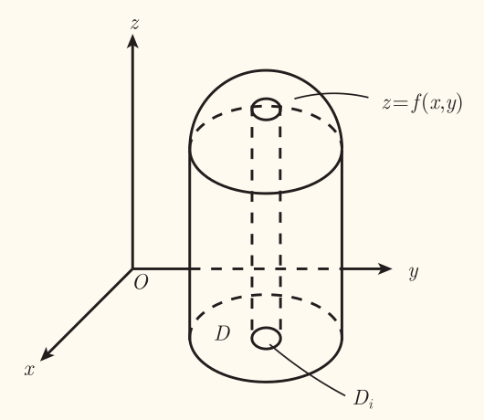
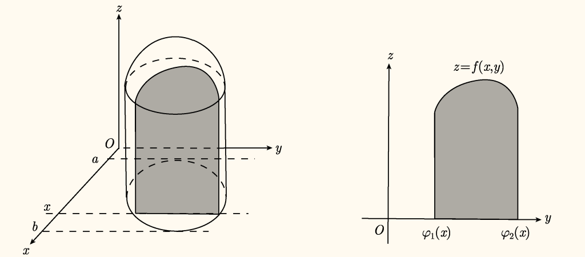
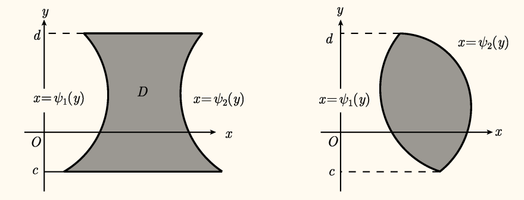
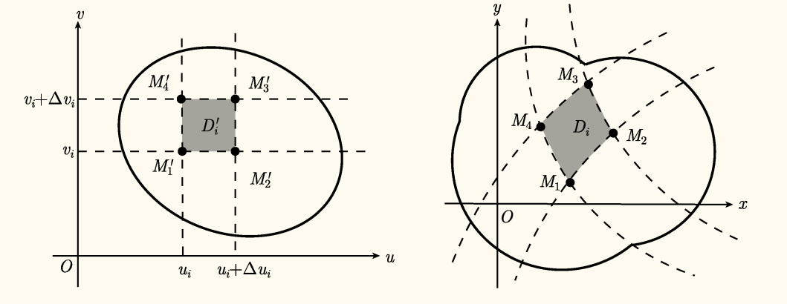

## 二重积分

### 定义

类似曲边梯形的概念，将区域 $D$ 任意分割成 $n$ 个子区域 $D_i$（$\bigcup\limits_{i = 1}^n D_i = D$），$D_i$ 面积记作 $\Delta \sigma_i$（$\Delta \sigma_i = \sigma(D_i)$），$\lambda$ 记作 $D_i$ 直径的最大值（$\lambda = \max\left\lbrace d(D_i) \right\rbrace$），称为<u>分割的模</u>，有曲顶柱体体积公式

$$
V = \lim_{\lambda \to 0} \sum_{i=1}^n f(\xi_i, \eta_i) \Delta \sigma_i,\quad (\xi_i, \eta_i) \in D_i
$$

从而有二重积分的定义（假设极限存在）：设二元函数 $z = f(x, y)$ 在平面有界区域 $D$ 上有定义，则记黎曼和的极限

$$
\iint_{D} f(x, y) \d \sigma = \lim_{\lambda \to 0} \sum_{i=1}^n f(\xi_i, \eta_i) \Delta \sigma_i
$$

若极限存在，称 $f(x, y)$ 在区域 $D$ 上**黎曼可积**，称此极限为 $f(x, y)$ 在 $D$ 上的**二重积分**，记作 $\displaystyle \iint_{D} f(x, y) \d \sigma$。其中 $f(x, y)$ 称为**被积函数**，$D$ 称为**积分区域**，$\d \sigma$ 称为**面积微元**。

类似地，设有一质量不均的平面薄片 $D$，各点 $(x, y)$ 的*质量面密度*为 $\mu(x, y)$，则平面薄片的质量为

$$
m = \iint_{D} \mu(x, y) \d \sigma
$$

### 性质

!!! info ""
    设函数 $f(x, y)$ 在有界闭区域 $D$ 上连续，则函数 $f(x, y)$ 在 $D$ 上可积。

!!! info ""
    设函数 $f(x, y)$ 在有界闭区域 $D$ 上有界，$f(x, y)$ 的间断点分布在 $D$ 内有限条光滑曲线上，则函数 $f(x, y)$ 在 $D$ 上可积。

!!! note 勒贝格定理（Lebesgue 定理）
    设函数 $f(x, y)$ 在有界闭区域 $D$ 上有界，则 $f$ 可积当且仅当 $f$ 的间断点集为零测集。

设 $D \subset \R^2$ 为有界闭区域，下面各式被积函数在 $D$ 上均可积，则有：
1. $\displaystyle \iint_{D} \d \sigma = \sigma(D)$（$D$ 的面积）
2. $\displaystyle \iint_{D} k \d \sigma = k \iint_{D} \d \sigma$（$k \in \R$）
3. $\displaystyle \iint_{D} \bigl(f(x, y) \pm g(x, y)\bigr) \d \sigma = \iint_{D} f(x, y) \d \sigma \pm \iint_{D} g(x, y) \d \sigma$
4. 对积分区域 $D$ 的分割不变性：若讲 $D$ 分割为 $n$ 个子区域 $D_i$，且 $\bigcup\limits_{i=1}^n D_i = D$（且 $D_i$ 为闭区域），则 $\displaystyle \iint_{D} f(x, y) \d \sigma = \sum_{i=1}^n \iint_{D_i} f(x, y) \d \sigma$
5. 保向性：若 $f(x, y) \le g(x, y),\, \forall (x, y) \in D$，则 $\displaystyle \iint_{D} f(x, y) \d \sigma \le \iint_{D} g(x, y) \d \sigma$
6. 均值性质：$\displaystyle \min\limits_{(x, y) \in D} f(x, y) \le \frac{1}{\sigma(D)} \iint_{D} f(x, y) \d \sigma \le \max\limits_{(x, y) \in D} f(x, y)$
7. 绝对值性质：$\displaystyle \left| \iint_{D} f(x, y) \d \sigma \right| \le \iint_{D} |f(x, y)| \d \sigma$
8. 对称性质：设 $D$ 关于 $x = 0$ 对称，若 $f(x, y)$ 关于 $x$ 为奇函数，则 $\displaystyle \iint_{D} f(x, y) \d \sigma = 0$；若 $f(x, y)$ 关于 $x$ 为偶函数，则 $\displaystyle \iint_{D} f(x, y) \d \sigma = 2 \iint_{D_+} f(x, y) \d \sigma$（$D_+$ 为 $D$ 的上半部分，即 $D$ 中 $x \ge 0$ 的部分）
9. 轮换对称性：将被积函数的变量与积分区域中相应变量替换，积分值不变（$\alpha$-变换？串台了）

!!! info 中值定理 1
    设 $D \subset \R^2$ 为有界闭区域，函数 $f(x, y),\, g(x, y)$ 在 $D$ 上连续，且 $\forall (x, y) \in D, g(x, y) \ge 0$（或 $\le 0$），则存在 $(\xi, \eta) \in D$ 使得

    $$
    \iint_{D} f(x, y)g(x, y) \d \sigma = f(\xi, \eta) \iint_{D} g(x, y) \d \sigma
    $$

特别地，取 $g(x, y) \equiv 1$，则有

!!! info 中值定理 2
    设 $D \subset \R^2$ 为有界闭区域，函数 $f(x, y)$ 在 $D$ 上连续，则存在 $(\xi, \eta) \in D$ 使得

    $$
    \iint_{D} f(x, y) \d \sigma = f(\xi, \eta) \cdot \sigma(D)
    $$

### 计算

鉴于二重积分定义中结果与分割方式无关，通常可取通常可取平行于 $x$ 轴和 $y$ 轴的直线将 $D$ 分割为 $n$ 个小闭区域，从而有 $\Delta \sigma_i = \Delta x_i \Delta y_i$，面积微元常记为 $\d \sigma = \d x \d y$，称为<u>直角坐标下的面积微元</u>，$f(x, y)$ 在区域 $D$ 上的二重积分可表示为

$$
\iint_{D} f(x, y) \d x \d y
$$

考虑含参变量的定积分

$$
\begin{aligned}
    \sigma_1(x) &= \int_{c}^{d}f(x, y)\d y\\
    \sigma_2(x) &= \int_{\varphi_1(x)}^{\varphi_2(x)}f(x, y)\d y
\end{aligned}
$$

!!! info ""
    设函数 $f(x, y)$ 在闭区域

    $$
    D = \left\lbrace (x, y) \mid a \le x \le b,\, c \le y \le d \right\rbrace
    $$

    上连续，则含参定积分

    $$
    \sigma_1(x) = \int_{c}^{d}f(x, y)\d y\tag{1}
    $$

    在区间 $[a, b]$ 上连续。

!!! info ""
    设函数 $\varphi_1(x),\, \varphi_2(x)$ 在区间 $[a, b]$ 上连续，函数 $f(x, y)$ 在闭区域

    $$
    D = \left\lbrace (x, y) \mid a \le x \le b,\, \varphi_1(x) \le y \le \varphi_2(x) \right\rbrace
    $$

    上连续，则含参定积分

    $$
    \sigma_2(x) = \int_{\varphi_1(x)}^{\varphi_2(x)}f(x, y)\d y\tag{2}
    $$

    在区间 $[a, b]$ 上连续。

然后是从几何意义推导二重积分的计算公式。

#### 第一种情况

设闭区域 $D$ 可表示为

$$
D = \left\lbrace (x, y) \mid a \le x \le b,\, \varphi_1(x) \le y \le \varphi_2(x)\right\rbrace
$$

这里 $\varphi_1(x),\, \varphi_2(x)$ 在 $[a, b]$ 上连续，如下图：

任取 $x \in [a, b]$，过 $(x, 0, 0)$ 作平面 $\Pi$ 垂直于 $x$ 轴，该平面截曲顶柱面 $\Omega$ 的截面是平面 $\Pi$ 上的曲边梯形，如下图

曲边梯形可表示为

$$
0 \le z \le f(x, y),\quad \varphi_1(x) \le y \le \varphi_2(x)
$$

从而该曲边梯形面积为含参积分

$$
A(x) = \int_{\varphi_1(x)}^{\varphi_2(x)}f(x, y)\d y
$$

由上面的式 $(2)$ 所在的定理知 $A(x)$ 在 $[a, b]$ 连续，于是曲顶柱体体积为

$$
\begin{aligned}
    V(\Omega) &= \int_{a}^{b}A(x)\d x\\
    &= \int_{a}^{b}\left(\int_{\varphi_1(x)}^{\varphi_2(x)}f(x, y)\d y\right)\d x
\end{aligned}
$$

也就是说

$$
\begin{aligned}
    \iint_D f(x, y)\d x\d y &= \int_{a}^{b}\left(\int_{\varphi_1(x)}^{\varphi_2(x)}f(x, y)\d y\right)\d x\\
    &= \boxed{\int_{a}^{b} \d x \left(\int_{\varphi_1(x)}^{\varphi_2(x)}f(x, y)\d y\right)}
\end{aligned}
$$

!!! memo ""
    这种记号吧，虽然说写起来比较方便（同一层级一下子能写完），但是容易混淆，可能会误解为两个定积分的积（即 $\displaystyle \left(\int_{a}^{b}\d x\right)\left(\int_{\varphi_1(x)}^{\varphi_2(x)}f(x, y)\d y\right)$），只能注意一下了。

    也可以考虑优先级，认为乘法优先级高于积分，那么就有实际上是 $\displaystyle \int_{a}^{b} \bigl(\d x\bigr)\left(\int_{\varphi_1(x)}^{\varphi_2(x)}f(x, y)\d y\right)$。

即二重积分可以化为先对 $y$，后对 $x$ 的两次定积分（**累次积分**，**二次积分**）。

#### 第二种情况

设闭区域 $D$ 可表示为

$$
D = \left\lbrace (x, y) \mid \psi_1(y) \le x \le \psi_2(y),\, c \le y \le d\right\rbrace
$$

这里 $\psi_1(y),\, \psi_2(y)$ 在 $[c, d]$ 上连续，如下图：

同理，使用平面 $\Pi$ 垂直于 $y$ 轴，该平面截曲顶柱面 $\Omega$ 的截面是平面 $\Pi$ 上的曲边梯形，面积为含参定积分

$$
B(y) = \int_{\psi_1(y)}^{\psi_2(y)}f(x, y)\d x
$$

可知 $B(y)$ 在 $[c, d]$ 上连续，于是曲顶柱体体积为

$$
\begin{aligned}
    V(\Omega) &= \int_{c}^{d}B(y)\d y\\
    &= \int_{c}^{d}\left(\int_{\psi_1(y)}^{\psi_2(y)}f(x, y)\d x\right)\d y
\end{aligned}
$$

从而得到二重积分另一个计算公式

$$
\begin{aligned}
    \iint_D f(x, y)\d x\d y &= \int_{c}^{d}\left(\int_{\psi_1(y)}^{\psi_2(y)}f(x, y)\d x\right)\d y\\
    &= \boxed{\int_{c}^{d} \d y \left(\int_{\psi_1(y)}^{\psi_2(y)}f(x, y)\d x\right)}
\end{aligned}
$$

即二重积分可以化为先对 $x$，后对 $y$ 的累次积分。

!!! note ""
    对不满足上面默认的假设非负的 $f(x, y)$，方框的两个公式也是成立的。

    若是两个 $D$ 的表示条件都不满足，可以分割成多个子闭区域，分别积分后再进行累加。

!!! note ""
    一般而言，对于 $n$ 元函数 $f(x_1, \dots, x_n)$ 的 $n$ 重积分，有

    $$
    \int \! \cdots \! \int_D f(x_1, \dots, x_n) \d x_1 \cdots \d x_n = \\
    \int_{\varphi_{1}}^{\psi_{1}} \d x_{1} \cdots \int_{\varphi_{n}\left(x_{1}, \dots, x_{n-1}\right)}^{\psi_{n}\left(x_{1}, \dots, x_{n-1}\right)} f\left(x_{1}, \dots, x_{n}\right) \d x_{n}
    $$

    其中积分区域 $D$ 为

    $$
    D=\left\{\left(x_{1}, \dots, x_{n}\right) \mid \varphi_{1} \leq x_{1} \leq \psi_{1},\, \cdots,\, \varphi_{n}\left(x_{1}, \dots, x_{n-1}\right) \leq x_{n} \leq \psi_{n}\left(x_{1}, \dots, x_{n-1}\right)\right\}
    $$

    > 为了节省空间，我删掉了一部分内容，有可能会引起误解，具体而言，累次积分省略的部分为 $\displaystyle \int_{\varphi_2(x_1)}^{\psi_2(x_1)} \d x_2$，积分区域省略的部分为 $ \varphi_2(x_1) \le x_2 \le \psi_2(x_1)$。这样就可以看出规律了。

### 换元积分

!!! info ""
    设 $D$ 为平面有界闭区域，函数 $f(x, y)$ 在 $D$ 上连续，函数组

    $$
    \left\lbrace\begin{aligned}
        x &= x(u, v)\\
        y &= y(u, v)
    \end{aligned}\right.
    $$

    在 $u$-$v$ 平面的有界闭区域 $D'$ 上连续可微，使得 $D'$ 与 $D$ 上的点一一对应，且雅可比行列式

    $$
    J(u, v) = \dfrac{D(x, y)}{D(u, v)} \ne 0,\quad (u, v) \in D'
    $$

    则有换元积分公式

    $$
    \boxed{
        \iint_{D} f(x, y) \d x \d y = \iint_{D'} f\bigl(x(u, v), y(u, v)\bigr) \left| J(u, v) \right| \d u \d v
    }
    $$

    其中 $\d \sigma = \left| J(u, v) \right| \d u \d v$ 称为**曲线坐标下的面积微元**。

    如果 $J(u, v)$ 只在 $D^{\prime}$ 的个别点上或一条曲线上为零，而在其他点上不为零，仍有换元公式成立。

    ---

    证明：

    好长，~~我懒得抄~~有时间再抄，现在就放一张图。

    

    不用长长的推导，联想前面写过的雅可比矩阵的意义，雅可比矩阵反映的正是多元函数的变换。联想方阵线性变换的几何含义，其行列式正是面积缩放的系数，因此可以大胆地推测，雅可比行列式正是换元后面积微元的比例系数。

#### 极坐标变换

!!! info ""
    直角坐标和极坐标之间的转换关系如下：

    $$
    \left\lbrace\begin{aligned}
        x &= \rho \cos \theta \\
        y &= \rho \sin \theta
    \end{aligned}\right.
    $$

    此时雅可比矩阵

    $$
    \begin{aligned}
        J(\rho, \theta) &= \dfrac{D(x, y)}{D(\rho, \theta)}\\
        &= \begin{vmatrix}
            \cos \theta & - \rho \sin \theta \\
            \sin \theta & \rho \cos \theta
        \end{vmatrix}\\
        &= \rho
    \end{aligned}
    $$

    从而有二重积分极坐标变换公式：

    $$
    \iint_D f(x, y) \d \sigma = \iint_{D'} f(\rho \cos \theta, \rho \sin \theta) \rho \d \rho \d \theta
    $$

    其中 $D'$ 是 $D$ 在极坐标系下原积分区域 $D$ 所对应的区域，$\d \sigma = \rho \d \rho \d \theta$ 是*极坐标系下的面积微元*。

## 三重积分

一样有三重积分换元公式

$$
\iiint_{\Omega} f(x, y, z) \d V = \iiint_{\Omega'} f\bigl(x(u, v, w), y(u, v, w), z(u, v, w)\bigr) |J| \d u \d v \d w
$$

其中

$$
J = \dfrac{D(x, y, z)}{D(u, v, w)} = \begin{vmatrix}
\dfrac{\partial x}{\partial u} & \dfrac{\partial x}{\partial v} & \dfrac{\partial x}{\partial w} \\
\dfrac{\partial y}{\partial u} & \dfrac{\partial y}{\partial v} & \dfrac{\partial y}{\partial w} \\
\dfrac{\partial z}{\partial u} & \dfrac{\partial z}{\partial v} & \dfrac{\partial z}{\partial w}
\end{vmatrix} \ne 0\quad (u, v, w) \in \Omega'
$$

### 柱坐标变换

取空间直角坐标系 $O$-$x y z$，设点 $M$ 的直角坐标为 $(x, y, z)$，**柱坐标系**是将点 $M$ 的位置用三个有序的实数 $(\rho, \theta, z)$ 表示，其中 $(\rho, \theta)$ 是点 $M$ 在 $x O y$ 平面上的投影 $P$ 的*极坐标*，$z$ 是点 $M$ 的直角坐标的第三个分量。在柱坐标系中，有

$$
0 \le \rho < +\infty ,\\
0 \le \theta < 2\pi\quad (\text{或 } - \pi \le \theta < \pi),\\
-\infty < z < +\infty
$$

则有

$$
\left\lbrace\begin{aligned}
    x &= \rho \cos \theta,\\
    y &= \rho \sin \theta,\\
    z &= z
\end{aligned}\right.
$$

雅可比行列式

$$
J = J(\rho, \theta, z) = \begin{vmatrix}
\cos \theta & -\rho \sin \theta & 0\\
\sin \theta & \rho \cos \theta & 0\\
0 & 0 & 1
\end{vmatrix} = \rho
$$

从而得到 $\d V = \rho \d \rho \d \theta \d z$ 为柱坐标下的体积微元。

### 球坐标变换

取空间直角坐标系 $O$-$x y z$，设点 $M$ 的坐标为 $(x, y, z)$，**球坐标系**是将点 $M$ 的位置用三个有序的实数 $(r, \varphi, \theta)$ 表示，其中 $r$ 是向量 $\overrightarrow{O M}$ 的模，$\varphi$ 是向量 $\overrightarrow{O M}$与 $z$ 轴正向的夹角，$\theta$ 是点 $M$ 在 $x O y$ 平面上的投影 $P$ 的极角。在球坐标系中，有

$$
0 \le r < +\infty,\\
0 \le \varphi \le \pi,\\
0 \le \theta < 2\pi\quad (\text{或 } -\pi \le \theta < \pi)
$$

球坐标系如图所示，$r$ 称为**径向距离**，$\varphi$ 称为**极角**，$\theta$ 称为**方位角**。

则有

$$
\left\lbrace\begin{aligned}
    x &= r \sin \varphi \cos \theta,\\
    y &= r \sin \varphi \sin \theta,\\
    z &= r \cos \varphi
\end{aligned}\right.
$$

雅可比行列式

$$
J = J(r, \varphi, \theta) = \begin{vmatrix}
\sin \varphi \cos \theta & r \cos \varphi \cos \theta & -r \sin \varphi \sin \theta\\
\sin \varphi \sin \theta & r \cos \varphi \sin \theta & r \sin \varphi \cos \theta\\
\cos \varphi & -r \sin \varphi & 0
\end{vmatrix} = r^2 \sin \varphi
$$

从而得到 $\d V = r^2 \sin \varphi \d r \d \varphi \d \theta$ 为球坐标下的体积微元。

同样有广义球坐标变换

$$
\left\lbrace\begin{aligned}
    x &= a r \sin \varphi \cos \theta,\\
    y &= b r \sin \varphi \sin \theta,\\
    z &= c r \cos \varphi
\end{aligned}\right.
$$

此时

$$
J = a b c r^2 \sin \varphi
$$

## 重积分的应用

### 立体体积

关键是求

$$
\iiint_{\Omega} \d V = \iiint_{\Omega} \d x \d y \d z
$$

也就是其实是要把 $\Omega$ 表示出来。

### 曲面面积

!!! info ""
    设 $S$ 为光滑曲面，其参数方程为

    $$
    \left\lbrace\begin{aligned}
        x &= x(u, v),\\
        y &= y(u, v),\\
        z &= z(u, v)
    \end{aligned}\right.\quad (u, v) \in D'
    $$

    $D'$ 为 $uv$ 平面上的有界闭区域，函数 $x(u, v), y(u, v), z(u, v)$ 在 $D'$ 上连续可微。记

    $$
    \left\lbrace\begin{aligned}
        A &= \dfrac{D(y, z)}{D(u, v)},\\
        B &= \dfrac{D(z, x)}{D(u, v)},\\
        C &= \dfrac{D(x, y)}{D(u, v)}
    \end{aligned}\right.
    $$

    则曲面 $S$ 的面积为

    $$
    S = \boxed{
            \iint_{D'} \sqrt{A^2 + B^2 + C^2} \d u \d v
        }
    $$

    这里 $\d S = \sqrt{A^2 + B^2 + C^2} \d u \d v$ 称为**曲线坐标下的曲面面积微元**，简称**曲面微元**。

    ---

    直接考虑曲面上一点，该点的（关于此曲面的切平面的）法向量就为 $(A, B, C)$，考虑该点发出的一个小平行四边形（即以其为一个顶点），当边长趋于 $0$ 时，有平行四边形面积与曲面面积相同。而平行四边形面积为边长之叉乘的模，也即法向量的模。从这个角度记忆公式。

!!! info ""
    设 $S$ 为光滑曲面，其参数方程为

    $$
    \left\lbrace\begin{aligned}
        x &= x(u, v),\\
        y &= y(u, v),\\
        z &= z(u, v)
    \end{aligned}\right.\quad (u, v) \in D'
    $$

    $D'$ 为 $uv$ 平面上的有界闭区域，函数 $x(u, v), y(u, v), z(u, v)$ 在 $D'$ 上连续可微。记

    $$
    \left\lbrace\begin{aligned}
        \bm{r} &= \bigl(x(u, v), y(u, v), z(u, v)\bigr),\\
        E &= \bm{r}_u' \boldsymbol{\cdot} \bm{r}_u',\\
        F &= \bm{r}_u' \boldsymbol{\cdot} \bm{r}_v',\\
        G &= \bm{r}_v' \boldsymbol{\cdot} \bm{r}_v'
    \end{aligned}\right.
    $$

    则曲面 $S$ 的面积为

    $$
    S = \boxed{
            \iint_{D'} \sqrt{EG - F^2} \d u \d v
        }
    $$

!!! info ""
    设光滑曲面 $S$ 的方程为

    $$
    z = f(x, y)\quad (x, y) \in D
    $$

    $D$ 为 $xOy$ 平面上的有界闭区域，函数 $f$ 在 $D$ 上连续可微。则曲面 $S$ 的面积为

    $$
    S = \boxed{
            \iint_{D} \sqrt{1 + (f_x')^2 + (f_y')^2} \d x \d y
        }
    $$

    这里 $\d S = \sqrt{1 + (f_x')^2 + (f_y')^2} \d x \d y$ 称为**直角坐标下的曲面面积微元**。

    ---

    类似弧长积分公式 $\displaystyle \int_a^b \sqrt{1 + (f'(x))^2} \d x$。
