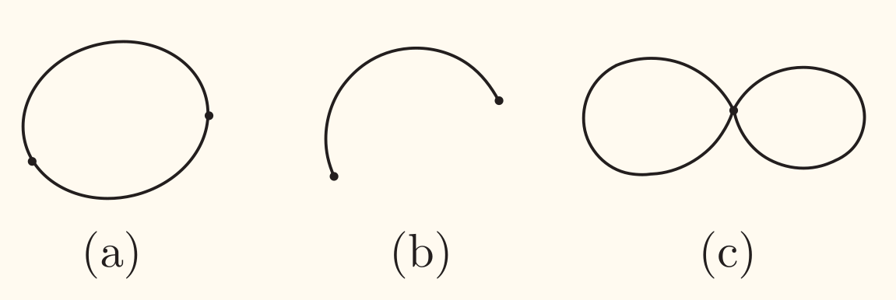
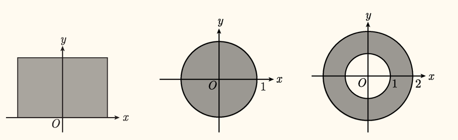

## 第一类曲线积分

### 定义

在光滑平面曲线 $C$ 上有定义的函数 $f(x, y)$ 沿 $C$ 的**第一类曲线积分**（<u>对弧长的积分</u>）为

$$
\int_C f(x, y) \d s = \lim\limits_{\lambda \to 0} \sum_{i=1}^n f(\xi_i, \eta_i) \Delta s_i
$$

其中 $\Delta s_i$ 是曲线 $C$ 上第 $i$ 段的长度，$(\xi_i, \eta_i)$ 是该段上任意一点，$\lambda$ 是曲线 $C$ 上取点的最大间距。

其中 $f(x, y)$ 称为*被积函数*，$C$ 称为*积分曲线*，$\d s$ 称为*弧微分*（$\d s > 0$）。

类似的有空间曲线上的第一类曲线积分：

$$
\int_C f(x, y, z) \d s = \lim\limits_{\lambda \to 0} \sum_{i=1}^n f(\xi_i, \eta_i, \zeta_i) \Delta s_i
$$

积分性质与定积分类似。特别地，有

$$
\begin{aligned}
    \int_{\widehat{AB}} f(x, y) \d s &= \int_{\widehat{BA}} f(x, y) \d s\\
    \int_C f(x, y) \d s &= \int_{-C} f(x, y) \d s
\end{aligned}
$$

其中 $-C$ 表示 $C$ 的反向曲线。

理解成线质量即可。

### 计算

!!! info ""
    设 $f(x, y)$ 为定义在曲线段 $C$ 的连续函数，设 $C$ 可参数化为 $\bm{r}(t) = \bigl(\varphi(t), \psi(t)\bigr)$，即

    $$
    \left\lbrace\begin{aligned}
        x &= \varphi(t) \\
        y &= \psi(t) \\
    \end{aligned}\right. \quad (a \le t \le b)
    $$

    其中 $\varphi(t)$ 和 $\psi(t)$ 在 $[a, b]$ 上连续可导，且 $[\varphi'(t)]^2 + [\psi'(t)]^2 \neq 0$，则<u>第一类曲线积分 $\displaystyle\int_C f(x, y) \d s$ 存在</u>，且

    $$
    \begin{aligned}
        \int_C f(x, y) \d s &= \int_a^b f\bigl(\varphi(t), \psi(t)\bigr) | \bm{r}'(t) | \d t \\
        &= \boxed{\int_a^b f\bigl(\varphi(t), \psi(t)\bigr) \sqrt{[\varphi'(t)]^2 + [\psi'(t)]^2} \d t}
    \end{aligned}
    $$

## 第二类曲线积分

考虑平面光滑曲线 $C$ 上的向量场 $\bm{F}(x, y)$，有

$$
\bm{F}(x, y) = P(x, y) \bm{i} + Q(x, y) \bm{j}
$$

则向量场 $\bm{F}(x, y)$ 沿有向曲线 $C$ 的**第二类曲线积分**（<u>对坐标的曲线积分</u>）为

$$
\int_C \bm{F}(x, y) \boldsymbol{\cdot} \d \bm{r} = \int_C P(x, y) \d x + Q(x, y) \d y
$$

其中 $\d \bm{r} = \bm{i} \d x + \bm{j} \d y$ 称为*位矢微分*。曲线 $C$ 称为*积分路径*。

特别地，

$$
\int_C P(x, y) \d x = \lim\limits_{\lambda \to 0} \sum_{i=1}^n P(\xi_i, \eta_i) \Delta x_i
$$

称为<u>函数 $P(x, y)$ 沿有向曲线 $C$ 对坐标 $x$ 的曲线积分</u>。

类似的有空间曲线上的第二类曲线积分：

$$
\int_C \bm{F}(x, y, z) \boldsymbol{\cdot} \d \bm{r} = \int_C P(x, y, z) \d x + Q(x, y, z) \d y + R(x, y, z) \d z
$$

其中 $\d \bm{r} = \bm{i} \d x + \bm{j} \d y + \bm{k} \d z$。

积分性质与定积分类似。特别地，有

$$
\begin{aligned}
    \int_{\widehat{AB}} \bm{F}(x, y) \boldsymbol{\cdot} \d \bm{r} &= -\int_{\widehat{BA}} \bm{F}(x, y) \boldsymbol{\cdot} \d \bm{r} \\
    \int_C \bm{F}(x, y) \boldsymbol{\cdot} \d \bm{r} &= -\int_{-C} \bm{F}(x, y) \boldsymbol{\cdot} \d \bm{r}
\end{aligned}
$$

其中 $-C$ 表示 $C$ 的反向曲线。

理解成做功即可。

### 计算

!!! info ""
    设 $\bm{F}(x, y) = P(x, y) \bm{i} + Q(x, y) \bm{j}$ 为定义在曲线段 $C$ 的连续向量场。

    设 $C$ 可参数化为 $\bm{r}(t) = \bigl(\varphi(t), \psi(t)\bigr)$，且当 $t$ 单调由 $a$ 变到 $b$ 时，点 $M(x, y)$ 从 $C$ 的起点 $A$ 沿 $C$ 运动到终点 $B$，$\varphi(t),\, \psi(t)$ 在 $[a, b]$ 上连续可导，且 $[\varphi'(t)]^2 + [\psi'(t)]^2 \neq 0$，则<u>第二类曲线积分 $\displaystyle\int_C P(x, y) \d x + Q(x, y) \d y$ 存在</u>，且

    $$
    \int_C P(x, y) \d x + Q(x, y) \d y = \boxed{\int_a^b \Bigl[P\bigl(\varphi(t), \psi(t)\bigr) \varphi'(t) + Q\bigl(\varphi(t), \psi(t)\bigr) \psi'(t)\Bigr] \d t}
    $$

## 两类曲线积分的联系

设有向曲线 $C$ 起点为 $A$，终点为 $B$，曲线 $C$ 可参数化为 $\bm{r}(t) = \bigl(\varphi(t), \psi(t)\bigr)$，$a \le t \le b$，即

$$
\left\lbrace\begin{aligned}
    x &= \varphi(t) \\
    y &= \psi(t) \\
\end{aligned}\right. \quad (a \le t \le b)
$$

从而有 $\bigl(\varphi'(t), \psi'(t)\bigr)$ 是曲线的切向量，因而

$$
\begin{aligned}
    \d \bm{r} &= (\d x, \d y)\\
    &= \bigl(\varphi'(t) \d t, \psi'(t) \d t\bigr)\\
    &= \bigl(\varphi'(t), \psi'(t)\bigr) \d t\\
\end{aligned}
$$

也是 $C$ 的切向量，且方向与积分路径方向保持一致。又

$$
\left\lvert \d \bm{r} \right\rvert = \sqrt{(\d x)^2 + (\d y)^2} = \d s
$$

设 $\d \bm{r}$ 方向余弦为 $\cos \alpha, \cos \beta$，则有

$$
(\cos \alpha, \cos \beta) = \dfrac{\d \bm{r}}{\left\lvert \d \bm{r} \right\rvert} = \left(\dfrac{\d x}{\d s}, \dfrac{\d y}{\d s}\right)
$$

则

$$
\left\lbrace\begin{aligned}
    \d x &= \cos \alpha \d s\\
    \d y &= \cos \beta \d s
\end{aligned}\right.
$$

因此

$$
\boxed{
    \int_C P \d x + Q \d y = \int_C (P \cos \alpha + Q \cos \beta) \d s
    }
$$

其中 $(\cos \alpha, \cos \beta)$ 为曲线 $C$ 上点 $(x, y)$ 处的单位切向量，且方向与积分路径方向保持一致。

类似地，空间曲线上的两类曲线积分也有类似的联系：

$$
\boxed{
    \int_C P \d x + Q \d y + R \d z = \int_C (P \cos \alpha + Q \cos \beta + R \cos \gamma) \d s
    }
$$

反过来，有

$$
\begin{aligned}
    \int_C f(x, y) \d s &= \int_C f(x, y) \cdot \left\lvert\d \bm{r}  \right\rvert \\
    &= \int_C f(x, y) \dfrac{\d \bm{r}}{\left\lvert \d \bm{r} \right\rvert} \boldsymbol{\cdot} \d \bm{r}\\
    &= \int_C f(x, y) (\cos \alpha, \cos \beta) \boldsymbol{\cdot} \d \bm{r}\\
    &= \int_C f(x, y) \cos \alpha \d x + f(x, y) \cos \beta \d y\\
\end{aligned}
$$

对于特殊的第一类曲线积分 $\displaystyle \int_C \dfrac{\partial f}{\partial \bm{n}} \d s$，可以进行如下转换变成第二类曲线积分。

$$
\begin{aligned}
    \int_C \dfrac{\partial f}{\partial \bm{n}} \d s &= \int_C \grad f \boldsymbol{\cdot} \bm{n} \d s\\
    &= \int_C \left( \dfrac{\partial f}{\partial x}, \dfrac{\partial f}{\partial y} \right) \boldsymbol{\cdot} \left( - \cos \beta, \cos \alpha \right) \d s\\
    &= \int_C \left( \dfrac{\partial f}{\partial y} \cos \alpha - \dfrac{\partial f}{\partial x} \cos \beta \right) \d s\\
    &= \int_C \left( \dfrac{\partial f}{\partial y}, - \dfrac{\partial f}{\partial x} \right) \boldsymbol{\cdot} \d \bm{r}
\end{aligned}
$$

<!-- {{{抄错笔记 -->

抄错笔记

!!! memo ""
    上面的公式一开始我写的是下面的内容，但是复习时第二个等号那里我却实在是看不明白，盯了很长时间也搞不懂，也没查到相关资料，有点怀疑是自己抄错了。于是发邮件请教助教、老师，证实了是抄错了，估计是跟上面离得比较近，而我当时神智比较不清晰，当成连起来的就合并到一个 `align` 环境了，事后也没及时重温笔记。

$(\cos \alpha, \cos \beta)$ 为 $C$ 上一点单位切向量，记 $\bm{n}$ 为法向量，则有

$$
\begin{aligned}
    \int_C f(x, y) \d s &= \int_C f(x, y) \cos \alpha \d x + f(x, y) \cos \beta \d y\\
    &= \int_C \dfrac{\partial f}{\partial \bm{n}} \d s\\
    &= \int_C \grad f \boldsymbol{\cdot} \bm{n} \d s\\
    &= \int_C \left(\dfrac{\partial f}{\partial x}, \dfrac{\partial f}{\partial y}\right) \boldsymbol{\cdot} (- \cos \beta, \cos \alpha) \d s\\
    &= \int_C \cos \alpha \dfrac{\partial f}{\partial y} - \cos \beta \dfrac{\partial f}{\partial x} \d s
\end{aligned}
$$

<!-- }}} -->

## 格林公式

设曲线 $C$ 的参数方程为

$$
\left\lbrace\begin{aligned}
    x &= \varphi(t)\\
    y &= \psi(t)
\end{aligned}\right. \quad (a \le t \le b)
$$

若 $\varphi, \psi$ 连续，且对不同参数 $t_1, t_2 \in [a, b]$（不妨设 $t_1 < t_2$），有 $\bigl(\varphi(t_1), \psi(t_1)\bigr) = \bigl(\varphi(t_2), \psi(t_2)\bigr)$ 当且仅当 $t_1 = a, t_2 = b$，则称曲线 $C$ 为**简单闭曲线**。

如下图，$\text{(a)}$ 是简单闭曲线，$\text{(b), (c)}$ 不是简单闭曲线。

设 $D$ 为一平面区域，如果 $D$ 内的任一条简单闭曲线所围的部分都属于 $D$，则称 $D$ 为**单连通区域**，否则称为**多连通区域**。

如下图，第一、二个区域是单连通区域，第三个区域是多连通区域。

对于平面区域 $D$ 的边界曲线 $C$，规定 $C$ 的正向：当观察者沿 $C$ 的正向行走时（人头与 $D$ 方向一致），区域 $D$ 总在观察者的<u>左侧</u>。

!!! info 格林公式（Green Formula）
    设*有界闭区域* $D$ 由逐段光滑曲线 $\partial D$ 围成，函数 $P(x, y)$ 及 $Q(x, y)$ 在 $D$ 上具有一阶连续偏导数，则有

    $$
    \oint_{\partial D} P \d x + Q \d y = \iint_D \left(\dfrac{\partial Q}{\partial x} - \dfrac{\partial P}{\partial y}\right) \d x \d y
    $$

    其中 $\partial D$ 的方向按 $D$ 的正向边界曲线的方向。

    <!-- {{{证明 -->
    

    
证明

    先证 $\displaystyle \oint_{\partial D} P \d x = - \iint_D \dfrac{\partial P}{\partial y}\d x \d y$。

    记 $D$ 可写为 $\left\lbrace a \le x \le b, \varphi(x) \le y \le \psi(x) \right\rbrace$，则

    $$
    \begin{aligned}
        \iint_D \left(- \dfrac{\partial P}{\partial y}\right)\d x \d y &= \int_a^b \d x \int_{\varphi(x)}^{\psi(x)} \left(- \dfrac{\partial P}{\partial y}\right) \d y\\
        &= \int_a^b -\left[P\bigl(x, \psi(x)\bigr) - P\bigl(x, \varphi(x)\bigr)\right] \d x\\
        &= \int_a^b P(x, \varphi(x)) \d x + \int_b^a P(x, \psi(x)) \d x\\
        &= \oint_{\partial D} P \d x
    \end{aligned}
    $$

    单连通、多连通区域可通过引入辅助线（辅助线上曲线积分方向相反，曲线积分抵消）将其化为上面的情形，可推知对所有情况成立。

    同理可证 $\displaystyle \oint_{\partial D} Q \d y = \iint_D \dfrac{\partial Q}{\partial x}\d x \d y$（下面推导方向与上面相反）：

    记 $D$ 可写为 $\left\lbrace c \le y \le d, \alpha(y) \le x \le \beta(y) \right\rbrace$，则

    $$
    \begin{aligned}
        \oint_{\partial D} Q \d y &= \int_c^d Q\bigl(\beta(y), y\bigr) \d y + \int_d^c Q\bigl(\alpha(y), y\bigr) \d y\\
        &= \int_c^d \Bigl(Q\bigl(\beta(y), y\bigr) - Q(\alpha(y), y)\Bigr) \d y\\
        &= \int_c^d \d y \int_{\alpha(y)}^{\beta(y)} \dfrac{\partial Q}{\partial x} \d x\\
        &= \iint_D \dfrac{\partial Q}{\partial x}\d x \d y
    \end{aligned}
    $$

    

    <!-- }}} -->

    <!-- {{{记忆（也可以当成是不太严谨的证明）： -->
    

    
记忆（也可以当成是不太严谨的证明）：

    $$
    \begin{aligned}
        \d \left( P \d x + Q \d y \right) &= \left( \dfrac{\partial P}{\partial x}\d x + \dfrac{\partial P}{\partial y}\d y \right) \d x + P \dfrac{\d }{\d x}\d x + \left( \dfrac{\partial Q}{\partial x}\d x + \dfrac{\partial Q}{\partial y}\d y \right) \d y + Q \dfrac{\d }{\d y}\d y\\
        &= \dfrac{\partial P}{\partial x}\d x^2 + \dfrac{\partial P}{\partial y}\d y \d x + \dfrac{\partial Q}{\partial x}\d x \d y + \dfrac{\partial Q}{\partial y}\d y^2\\
        &= - \dfrac{\partial P}{\partial y}\d x \d y + \dfrac{\partial Q}{\partial x}\d x \d y\\
        &= \left( \dfrac{\partial Q}{\partial x} - \dfrac{\partial P}{\partial y} \right) \d x \d y
    \end{aligned}
    $$

    $\d x$ 与 $x$ 无关，故 $\dfrac{\d }{\d x}\d x = 0$。

    $\d x^2 = \d x \boldsymbol{\times} \d x = 0,\, \d y \d x = \d y \boldsymbol{\times} \d x = - \d x \boldsymbol{\times} \d y = - \d x \d y$（即其实是当成了叉乘）。

    

    <!-- }}} -->

特别地，取 $P = -y, Q = x$，则有格林公式的一个特例

$$
\oint_{\partial D} x \d y - y \d x = 2\iint_D \d x \d y
$$

即（后面两个，例如第一个是取 $Q = x$，并令 $\dfrac{\partial P}{\partial y} = 0$ 如 $P = c$ 得到的）

$$
\begin{aligned}
    \sigma(D) &= \dfrac{1}{2} \oint_{\partial D} x \d y - y \d x\\
    &= \oint_{\partial D} x \d y\\
    &= \oint_{\partial D} -y \d x
\end{aligned}
$$

根据上面的「记法」，还可写为

$$
\int_{\partial \Omega} \alpha = \int_{\Omega} \d \alpha
$$

!!! note ""
    求曲线积分

    $$
    \oint_C \dfrac{-(x + y)\d x + (x - y)\d y}{x^2 + y^2}
    $$

    其中 $C$ 是不通过坐标原点的简单正向闭曲线。

    ---

    $P = \dfrac{-(x + y)}{x^2 + y^2},\, Q = \dfrac{x - y}{x^2 + y^2}$ 均在坐标原点无定义，$(x, y) \ne (0, 0)$ 时，有

    $$
    \dfrac{\partial Q}{\partial x} = \dfrac{\partial P}{\partial y} = \dfrac{-x^2 + 2xy + y^2}{(x^2 + y^2)^2}
    $$

    因此对于 $C$ 围成的区域 $D$ 需要分类讨论：

    若 $D$ 不含坐标原点，格林公式有

    $$
    \begin{aligned}
        \oint_C P \d x + Q \d y &= \iint_D \left(\dfrac{\partial Q}{\partial x} - \dfrac{\partial P}{\partial y}\right) \d x \d y\\
        &= \iint_D 0 \d x \d y\\
        &= 0
    \end{aligned}
    $$

    若 $D$ 含坐标原点，取 $r > 0$ 充分小使得正向圆周 $l\colon x^2 + y^2 = r^2$ 完全位于区域 $D$ 内，记 $C$ 与 $l$ 围成的区域为 $D_1$（可以判断出 $\partial D_1 = C + l^{-}$），对 $D_1$ 运用格林公式，跟上面一样，有

    $$
    \begin{aligned}
        \oint_{C + l^{-}} P \d x + Q \d y &= \iint_{D_1} 0 \d x \d y\\
        &= 0
    \end{aligned}
    $$

    因此

    $$
    \begin{aligned}
        \oint_C P \d x + Q \d y &= \oint_{C + l^{-}} (P \d x + Q \d y) + \oint_{l} (P \d x + Q \d y)\\
        &= 0 + \oint_{l} P \d x + Q \d y\\
        &= \int_0^{2 \pi} \dfrac{-(r \cos \theta + r \sin \theta)(-r \sin \theta) + (r \cos \theta - r \sin \theta)(r \cos \theta)}{r^2} \d \theta\\
        &= \int_0^{2 \pi} \d \theta\\
        &= 2 \pi
    \end{aligned}
    $$

    这题旨在说明奇点可能会影响格林公式对曲线积分的应用，因此需要分类讨论。

!!! note ""
    设曲线 $\Gamma$ 为区域 $D\colon \left\lbrace (x, y)  \mid 0 \le x \le \pi, 0 \le y \le \sin x\right\rbrace$ 的正向边界，$\bm{n}$ 为 $\Gamma$ 的外法向量，求

    $$
    \int_{\Gamma} \dfrac{\partial f}{\partial \bm{n}}\d s
    $$

    ---

    设切向量 $\bm{t} = \left(\cos \alpha, \cos \beta\right)$，则 $\bm{n} = \left(\cos \beta, -\cos \alpha\right)$（顺时针旋转 $\dfrac{\pi}{2}$），则

    $$
    \begin{aligned}
        \int_{\Gamma}\dfrac{\partial f}{\partial \bm{n}}\d s &= \int_{\Gamma} \grad f \boldsymbol{\cdot} \bm{n} \d s\\
        &= \int_{\Gamma} \left( \dfrac{\partial f}{\partial x}\cos \beta - \dfrac{\partial f}{\partial y} \cos \alpha \right) \d s\\
        &= \int_{\Gamma} -\dfrac{\partial f}{\partial y}\d x + \dfrac{\partial f}{\partial x} \d y\\
        &= \iint_D \left( \dfrac{\partial^2 f}{\partial x^2} + \dfrac{\partial^2 f}{\partial y^2} \right) \d x \d y\\
        &= \iint \Delta f \d x \d y\\
    \end{aligned}
    $$

    其中 $\Delta = \dfrac{\partial^2}{\partial x^2} + \dfrac{\partial^2}{\partial y^2}$ 为**拉普拉斯算子**[^1]。即 $\Delta = \grad^2 = \grad \boldsymbol{\cdot} \grad = \grad^\intercal \grad$。

    另外可以注意到，$\grad \grad^\intercal = \bm{H}$ 为黑塞矩阵。

    虽然常记 $\grad = \left( \dfrac{\partial }{\partial x}, \dfrac{\partial }{\partial y} \right) $，但其实我的意思是 $\grad = \begin{bmatrix} \dfrac{\partial }{\partial x} \\ \dfrac{\partial }{\partial y} \end{bmatrix}$。即其实是 $2 \times 1$ 的列向量而非 $1 \times 2$ 的行向量。

    [^1]: 没发现专门表示 Laplace 算子的符号，因此用 `\Delta` 表示。

## 平面上第二类曲线积分与路径无关的条件

设 $G$ 为平面上的一个区域，$P(x, y), Q(x, y)$ 在区域 $G$ 内具有一阶连续偏导数，如果对于 $G$ 内的任意指定的两点 $A, B$，以及 $G$ 内从 $A$ 点到 $B$ 点的任意两条曲线 $L_{1}, L_{2}$ 恒有

$$
\int_{L_{1}} P \d x + Q \d y = \int_{L_{2}} P \d x + Q \d y
$$

则称曲线积分 $\displaystyle \int_{L} P \d x + Q \d y$ 在 $G$ 内**与路径无关**。否则就称**与路径有关**。

其等价于 $G$ 内任何简单闭曲线 $L$ 有

$$
\oint_{L} P \d x + Q \d y = 0
$$

因为有[^2]

$$
\oint_{L_1 - L_2} P \d x + Q \d y = 0
$$

[^2]: $L_1 - L_2 = L_1 + L_2^{-}$

则由格林公式有

!!! info ""
    设 $D$ 是一<u>单连通区域</u>，函数 $P(x, y), Q(x, y)$ 在 $D$ 内<u>有一阶*连续*偏导数</u>，则曲线积分 $\displaystyle \int_{C} P \d x+Q \d y$ 在 $D$ 内与路径无关的*充分必要条件*是

    $$
    \dfrac{\partial Q}{\partial x} = \dfrac{\partial P}{\partial y}
    $$

    在 $D$ 内恒成立。

    ---

    充分性由格林公式显然证得。

    必要性采用反证法，不妨设 $\exists (x_0, y_0)$ 使得 $\dfrac{\partial Q}{\partial x} - \dfrac{\partial P}{\partial y} \as_{(x_0, y_0)} = \eta > 0$。

    由连续性知，存在 $\delta > 0$ 使得 $(x_0, y_0)$ 的 $\delta$ 邻域内有 $\dfrac{\partial Q}{\partial x} - \dfrac{\partial P}{\partial y} \ge \dfrac{1}{2} \eta > 0$ 成立。

    设 $\gamma$ 为以 $(x_0, y_0)$ 为圆心，$\delta$ 为半径的圆闭区域，格林公式有

    $$
    \begin{aligned}
        \oint_{\partial \gamma} P \d x + Q \d y &= \iint_{\gamma} \left( \dfrac{\partial Q}{\partial x} - \dfrac{\partial P}{\partial y} \right) \d x \d y\\
        &\ge \iint_{\gamma} \dfrac{1}{2} \eta \d x \d y\\
        &= \dfrac{1}{2} \eta \pi \delta^2 > 0
    \end{aligned}
    $$

    与沿 $D$ 内任意闭曲线的曲线积分为零的假设相矛盾。

需要强调的是，「单连通区域」与「一阶连续偏导数」是必要的条件，否则上面的定理不可用。

假如非单连通区域，例如上面的 $P = \dfrac{-(x + y)}{x^2 + y^2},\, Q = \dfrac{x - y}{x^2 + y^2}$ 在闭圆环 $D=\left\{(x, y) \mid 1 \le x^{2}+y^{2} \le 2\right\}$ 上有一阶连续的偏导数，且 $\dfrac{\partial Q}{\partial x} = \dfrac{\partial P}{\partial y}$ 在 $D$ 内恒成立，但对于绕坐标原点的简单闭曲线 $C$ 有曲线积分 $\displaystyle \oint_{C} P \d x + Q \d y = 2 \pi \ne 0$，因此不满足「与路径无关」。

曲线积分与路径无关时，常将从起点 $A$ 到终点 $B$ 的曲线积分记为

$$
\int_{A}^{B} P \d x + Q \d y
$$

!!! info ""
    设 $D$ 是一<u>单连通区域</u>，函数 $P(x, y), Q(x, y)$ 在 $D$ 内<u>具有一阶*连续*偏导数</u>，则 $P(x, y) \d x+Q(x, y) \d y$ 在 $D$ 内恰是某一函数 $u(x, y)$ 的全微分的*充分必要条件*是

    $$
    \dfrac{\partial Q}{\partial x} = \dfrac{\partial P}{\partial y}
    $$

    在 $D$ 内恒成立。

    ---

    必要性。设 $P \d x + Q \d y$ 是某一函数 $u$ 的全微分，即

    $$
    P \d x + Q \d y = \d u
    $$

    从而

    $$
    \left\lbrace\begin{aligned}
        P &= \dfrac{\partial u}{\partial x}\\
        Q &= \dfrac{\partial u}{\partial y}
    \end{aligned}\right.
    $$

    则

    $$
    \left\lbrace\begin{aligned}
        \dfrac{\partial P}{\partial y} &= \dfrac{\partial^2 u}{\partial y \partial x}\\
        \dfrac{\partial Q}{\partial x} &= \dfrac{\partial^2 u}{\partial x \partial y}
    \end{aligned}\right.
    $$

    因为 $P, Q$ 一阶连续可偏导，则 $u$ 二阶连续可偏导，即 $\dfrac{\partial^2 u}{\partial x \partial y} = \dfrac{\partial^2 u}{\partial y \partial x}$，从而

    $$
    \dfrac{\partial Q}{\partial x} = \dfrac{\partial P}{\partial y}
    $$

    充分性。由上面的定理知曲线积分

    $$
    \int_{A}^{B} P \d x + Q \d y
    $$

    与路径无关，固定起点 $A(x_0, y_0)$，终点 $B(x, y)$ 在 $D$ 内移动时，上述曲线积分就是关于终点 $(x, y)$ 的函数，记为 $u(x, y)$，即

    $$
    u(x, y) = \int_{(x_0, y_0)}^{(x, y)} P \d x + Q \d y
    $$

    下证 $P \d x + Q \d y$ 是 $u(x, y)$ 的全微分。

    只需证

    $$
    \left\lbrace\begin{aligned}
        \dfrac{\partial u}{\partial x} &= P\\
        \dfrac{\partial u}{\partial y} &= Q
    \end{aligned}\right.
    $$

    对于任意的定点 $B(x, y)$，取 $|\Delta x|$ 充分小使得点 $B^{\prime}(x+\Delta x, y)$ 及线段 $B B^{\prime}$ 都完全位于 $D$ 内

    有

    $$
    \begin{aligned}
        \dfrac{\partial u}{\partial x} &= \lim\limits_{\Delta x \to 0} \dfrac{u(x + \Delta x, y) - u(x, y)}{\Delta x}\\
        &= \lim\limits_{\Delta x \to 0} \dfrac{\displaystyle \int_{(x_0, y_0)}^{(x + \Delta x, y)} P \d x + Q \d y - \int_{(x_0, y_0)}^{(x, y)} P \d x + Q \d y}{\Delta x}\\
        &= \lim\limits_{\Delta x \to 0} \dfrac{\displaystyle \int_{(x, y)}^{(x + \Delta x, y)} P \d x + Q \d y}{\Delta x}\\
        &= \lim\limits_{\Delta x \to 0} \dfrac{\displaystyle \int_{(x, y)}^{(x + \Delta x, y)} P \d x}{\Delta x}\\
        &= P
    \end{aligned}
    $$

    同理可证 $\dfrac{\partial u}{\partial y} = Q$，充分性得证。

!!! info ""
    设区域 $D$ 是一个<u>单连通区域</u>，函数 $P(x, y), Q(x, y)$ 在 $D$ 内<u>具有一阶*连续*偏导数</u>，对于 $D$ 内的任意两点 $A, B$，曲线积分 $\displaystyle \int_{\widehat{A B}} P\d  x+Q\d  y$ 与路径无关的*充分必要条件*是：

    > $P\d  x+Q\d  y$ 恰是某个函数 $u(x, y)$ 的全微分，即 $\d u=P\d  x+Q\d  y$ （这时我们称 $P\d  x+Q \d y$为**恰当微分**）。此时有
    >
    > $$
    \int_{\widehat{A B}} P \mathrm{~d} x+Q \mathrm{~d} y=\int_{A}^{B} \mathrm{~d} u=u(B)-u(A)
    $$

    其中 $u(A), u(B)$ 分别表示函数 $u(x, y)$ 在 $A, B$ 点的函数值。

    ---

    很像啊，很像牛顿-莱布尼茨公式，因此称为**曲线积分的基本公式**。

    对于满足

    $$
    \d u = P \d x + Q \d y
    $$

    的函数 $u$ 称为 $P \d x + Q \d y$ 的原函数。

    由于路径无关，为了计算的简便，可以选取一些简单的曲线进行计算，如直线或平行于坐标轴的折线等。
