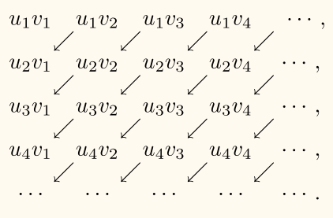
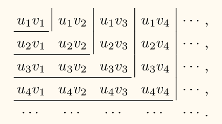
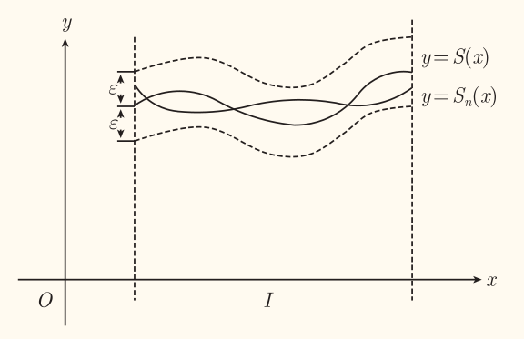
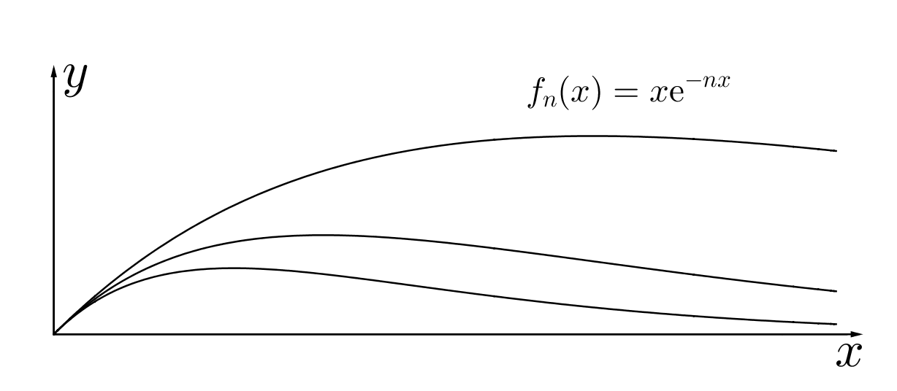
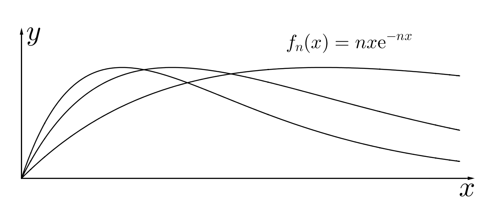
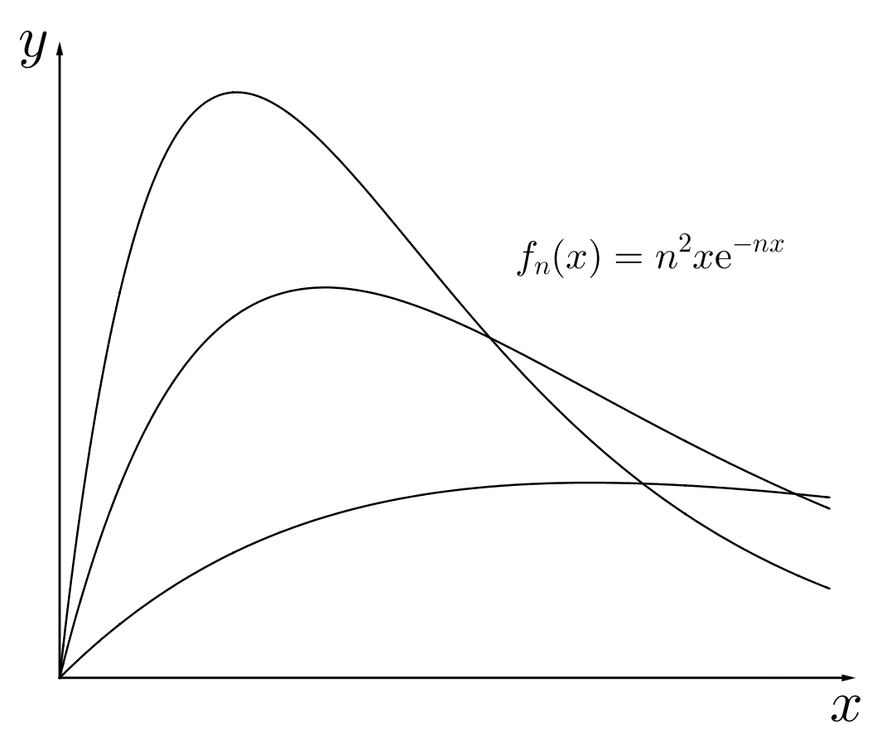

## 常数项级数

### 概念

!!! info ""
    给定数列

    $$
    u_1, u_2, \cdots, u_n, \cdots
    $$

    形如

    $$
    u_1 + \cdots + u_n + \cdots
    $$

    的和式称为 **（常数项）无穷级数**，简称 **（常数项）级数**，记作

    $$
    \sum_{n=1}^{\infty} u_n
    $$

    $u_n$ 称为级数的**通项**。

作级数前 $n$ 项和的函数 $S_n$ 称为级数的**部分和**，即

$$
S_n = u_1 + u_2 + \cdots + u_n = \sum_{k=1}^{n} u_k
$$

!!! info ""
    如果级数 $\displaystyle \sum_{n=1}^{\infty}u_n$ 部分和数列 $\{S_n\}$ 有极限 $S$，即 $\displaystyle \lim_{n \to \infty} S_n = S$，则称级数 $\displaystyle \sum_{n=1}^{\infty} u_n$ **收敛**，并称 $S$ 为级数的**和**。

    如果数列 $\{S_n\}$ 无极限，则称级数 $\displaystyle \sum_{n=1}^{\infty} u_n$ **发散**。

当级数 $\displaystyle \sum_{n=1}^{\infty} u_n$ 收敛时，其部分和与和 $S$ 的差 $r_n = S - S_n$ 称为级数的**余项**。

$|r_n|$ 是用部分和 $S_n$ 代替级数的和 $S$ 所产生的误差。

### 性质

!!! note ""
    若级数 $\displaystyle \sum_{n=1}^{\infty} u_n$ 收敛，$k$ 为常数，则 $\displaystyle \sum_{n=1}^{\infty} ku_n$ 也收敛，且

    $$
    \sum_{n=1}^{\infty} ku_n = k \sum_{n=1}^{\infty} u_n
    $$

!!! note ""
    若级数 $\displaystyle \sum_{n=1}^{\infty} u_n$ 和 $\displaystyle \sum_{n=1}^{\infty} v_n$ 都收敛，则 $\displaystyle \sum_{n=1}^{\infty} (u_n \pm  v_n)$ 也收敛，且

    $$
    \sum_{n=1}^{\infty} (u_n \pm v_n) = \sum_{n=1}^{\infty} u_n \pm \sum_{n=1}^{\infty} v_n
    $$

!!! note ""
    若级数 $\displaystyle \sum_{n=1}^{\infty} u_n$ 收敛，则对这级数的项任意加括号所成的级数

    $$
    (u_1 + \cdots + u_{1_i}) + \cdots + (u_{i_{n-1}+1} + \cdots + u_{i_n}) + \cdots
    $$

    仍收敛，且和不变。

    ---

    加括号后收敛，未必收敛。如

    $$
    \begin{aligned}
        (1 - 1) + (1 - 1) + \cdots = 0\\
        1 - (1 - 1) - (1 - 1) - \cdots = 1
    \end{aligned}
    $$

!!! note 级数收敛的必要条件
    级数 $\displaystyle \sum_{n=1}^{\infty} u_n$ 收敛的*必要条件*是 $\displaystyle \lim_{n \to \infty} u_n = 0$。

!!! note ""
    级数中去掉、加上或改变有限项，级数的敛散性不变。

!!! info 柯西收敛原理
    级数 $\displaystyle \sum_{n=1}^{\infty} u_n$ 收敛的*充分必要条件*是：对任意 $\varepsilon > 0$，存在 $N \in \N$，使得 $n > m > N$ 时，有

    $$
    |u_{m+1} + \cdots + u_n| < \varepsilon
    $$

    即级数的部分和 $S_n$ 与 $S_m$ 之差 $|S_n - S_m| < \varepsilon$。

## 正项级数

!!! info 正项级数
    如果级数 $\displaystyle \sum_{n=1}^{\infty} u_n$ 的每一项 $u_n \ge 0$，则称 $\displaystyle \sum_{n=1}^{\infty} u_n$ 为**正项级数**。

!!! note ""
    正项级数 $\displaystyle \sum_{n=1}^{\infty}u_n$ 收敛的*充分必要条件*是：它的部分和数列 $\{S_n\}$ 有上界。

**比较判别法**：若两个正项级数 $\displaystyle \sum_{n=1}^{\infty} u_n$ 和 $\displaystyle \sum_{n=1}^{\infty} v_n$ 对任意 $n$ 都有 $u_n \le v_n$，则
1. 若 $\displaystyle \sum_{n=1}^{\infty} v_n$ 收敛时，则 $\displaystyle \sum_{n=1}^{\infty} u_n$ 也收敛；
2. 若 $\displaystyle \sum_{n=1}^{\infty} u_n$ 发散时，则 $\displaystyle \sum_{n=1}^{\infty} v_n$ 也发散。

!!! note ""
    若存在正整数 $N$ 及常数 $C > 0$ 使得

    $$
    0 \le u_n \le C v_n, \quad (n > N)
    $$

    成立，则
    1. 若 $\displaystyle \sum_{n=1}^{\infty} v_n$ 收敛，则 $\displaystyle \sum_{n=1}^{\infty} u_n$ 也收敛；
    2. 若 $\displaystyle \sum_{n=1}^{\infty} u_n$ 发散，则 $\displaystyle \sum_{n=1}^{\infty} v_n$ 也发散。

!!! example p-级数
    讨论 $p$-级数

    $$
    \sum_{n=1}^{\infty} \frac{1}{n^p} = 1 + \frac{1}{2^p} + \cdots
    $$

    的敛散性。其中 $p$ 为常数。

    ---

    $p \le 1$ 时，$\dfrac{1}{n^p} \ge \dfrac{1}{n}$，而调和级数 $\displaystyle \sum_{n=1}^{\infty} \dfrac{1}{n}$ 发散，比较判别法知 $p \le 1$ 时 $p$-级数发散。

    当 $p > 1$ 时，有

    $$
    \int_n^{n+1} \dfrac{1}{x^p} \d x \le \dfrac{1}{n^p} \le \int_{n-1}^n \dfrac{1}{x^p} \d x
    $$

    从而 $p$-级数的部分和有

    $$
    \begin{aligned}
    1 + \int_2^{n+1} \dfrac{1}{x^p} \d x \le 1 + \sum_{i=2}^{n}\dfrac{1}{n^p} &\le 1 + \int_1^n \dfrac{1}{x^p} \d x\\
        &= 1 + \dfrac{1}{1-p} x^{1-p} \as_1^{n}\\
        &= 1 + \dfrac{1}{p-1} \left( 1 - n^{1-p} \right)\\
        &< 1 + \dfrac{1}{p-1}
    \end{aligned}
    $$

    因此 $p$-级数部分和有上界，故 $p$-级数收敛。

!!! note 比较判别法的极限形式
    设级数 $\displaystyle \sum_{n=1}^{\infty} u_n$ 和 $\displaystyle \sum_{n=1}^{\infty} v_n$ 都是正项级数，且 $\lim\limits_{n \to \infty} \dfrac{u_n}{v_n} = l$，则
    1. 若 $0 \le l < +\infty $，且级数 $\displaystyle \sum_{n=1}^{\infty} v_n$ 收敛，则 $\displaystyle \sum_{n=1}^{\infty} u_n$ 也收敛；
    2. 若 $0 < l \le +\infty$[^not_precise]，且级数 $\displaystyle \sum_{n=1}^{\infty} v_n$ 发散，则 $\displaystyle \sum_{n=1}^{\infty} u_n$ 也发散。

    [^not_precise]: 不严谨的写法，仅作为简记。

!!! note 比较判别法的推论
    对正项级数 $\displaystyle\sum_{n=1}^{\infty} u_n$ 和 $\displaystyle\sum_{n=1}^{\infty} v_n$，若有 $\dfrac{u_{n+1}}{u_n} \le  \dfrac{v_{n+1}}{v_n}$，则
    1. 若 $\displaystyle\sum_{n=1}^{\infty} v_n$ 收敛，则 $\displaystyle\sum_{n=1}^{\infty} u_n$ 收敛
    2. 若 $\displaystyle\sum_{n=1}^{\infty} u_n$ 发散，则 $\displaystyle\sum_{n=1}^{\infty} v_n$ 发散

    <!-- {{{证明 -->
    

    
证明

    由题意有 $\dfrac{u_{n+1}}{v_{n+1}} \le  \dfrac{u_n}{v_n}$，设

    $$
    \lim_{n \to \infty} \dfrac{u_{n}}{v_{n}} = \rho
    $$

    则 $\dfrac{u_n}{v_n} \ge \rho$，即 $u_n \ge \rho v_n$，从而由比较判别法知结论成立。

    

    <!-- }}} -->

!!! info 达朗贝尔判别法（比值判别法）
    设级数 $\displaystyle \sum_{n=1}^{\infty} u_n$ 是正项级数，且 $\lim\limits_{n \to \infty} \dfrac{u_{n+1}}{u_n} = \rho$，则
    1. 若 $\rho < 1$，则 $\displaystyle \sum_{n=1}^{\infty} u_n$ 收敛；
    2. 若 $\rho > 1$，则 $\displaystyle \sum_{n=1}^{\infty} u_n$ 发散；
    3. 若 $\rho = 1$，则级数可能收敛，可能发散。

    ---

    <!-- {{{达朗贝尔判别法证明 -->
    

    
达朗贝尔判别法证明

    仅证明 $\rho < 1$ 时级数收敛。

    由 $\displaystyle \lim_{n \to \infty} \dfrac{u_{n+1}}{u_n} = \rho < 1$，存在 $N$ 与 $\xi$，使得任意 $n > N$ 时有 $\dfrac{u_{n+1}}{u_n} < \xi < 1$。

    则 $u_{n+1} < \xi u_n < \cdots < \xi^{n-N} u_{N+1}$。

    而

    $$
    \begin{aligned}
        \xi^{n-N} u_{N+1} &= \overbrace{\left(\dfrac{u_{N+1}}{\xi^{N+1}}\right)}^{\text{与 } n \text{ 无关，为常数}} \xi^{n+1}\\
        &= C \xi^{n+1}
    \end{aligned}
    $$

    即

    $$
    u_{n+1} < C \xi^{n+1}
    $$

    进而 $\displaystyle \sum_{n=1}^{\infty} u_n = \sum_{n=1}^{N}u_n + \sum_{n=N+1}^{\infty}u_n$ 收敛。

    

    <!-- }}} -->

!!! info 柯西判别法（根值判别法）
    设级数 $\displaystyle \sum_{n=1}^{\infty} u_n$ 是正项级数，且 $\lim\limits_{n \to \infty} \sqrt[n]{u_n} = \rho$，则
    1. 若 $\rho < 1$，则 $\displaystyle \sum_{n=1}^{\infty} u_n$ 收敛；
    2. 若 $\rho > 1$，则 $\displaystyle \sum_{n=1}^{\infty} u_n$ 发散；
    3. 若 $\rho = 1$，则级数可能收敛，可能发散。

    ---

    <!-- {{{柯西判别法证明 -->
    

    
柯西判别法证明

    仅证明 $\rho < 1$ 时级数收敛。

    由 $\displaystyle \lim_{n \to \infty} \sqrt[n]{u_n} = \rho < 1$，存在 $N$ 与 $\xi$，使得任意 $n > N$ 时有 $\sqrt[n]{u_n} < \xi < 1$。

    则 $u_n < \xi^n$。

    进而 $\displaystyle \sum_{n=1}^{\infty} u_n$ 收敛。

    

    <!-- }}} -->

!!! info 柯西积分判别法
    设级数 $\displaystyle \sum_{n=1}^{\infty} u_n$ 是正项级数，若存在一个连续的单调减少的正值函数 $f(x)$，使得

    $$
    u_n = f(n), \quad n = 1, 2, \cdots
    $$

    则 $\displaystyle \sum_{n=1}^{\infty} u_n$ 与 $\displaystyle \int_1^{+\infty} f(x) \d x$ 具有相同的敛散性。

    ---

    <!-- {{{柯西积分判别法证明 -->
    

    
柯西积分判别法证明

    $$
    \begin{aligned}
        u_{k-1} &= \int^{k}_{k-1} u_{k-1} \d x\\
        &\ge \int^{k}_{k-1} f(x) \d x\\
        &\ge \int^{k}_{k-1} u_k \d x\\
        &= u_k
    \end{aligned}
    $$

    则

    $$
    \begin{aligned}
        \sum_{k=2}^{n}u_{k-1} &\ge \sum_{k=2}^{n}\int_{k-1}^{k}f(x) \d x = \int_{1}^{n}f(x) \d x\\
        &\ge \sum_{k=2}^{n}u_k
    \end{aligned}
    $$

    从而 $\displaystyle \sum_{n=1}^{\infty} u_n$ 与 $\displaystyle \int_1^{+\infty} f(x) \d x$ 具有相同的敛散性。

    

    <!-- }}} -->

!!! note 拉阿贝（拉比，Raabe）判别法
    对正项级数 $\displaystyle\sum_{n=1}^{\infty} u_n$，且 $\lim\limits_{n \to \infty} n\left(\dfrac{u_n}{u_{n+1}} - 1\right) = p$，则
    1. 若 $p > 1$，则 $\displaystyle\sum_{n=1}^{\infty} u_n$ 收敛；
    2. 若 $p < 1$，则 $\displaystyle\sum_{n=1}^{\infty} u_n$ 发散。
    3. 若 $p = 1$，则级数可能收敛，可能发散。

    <!-- {{{证明 -->
    

    
证明

    仅证明 $p > 1$ 时级数收敛。则存在 $1 < r < p$，使得

    $$
    \begin{aligned}
        \lim_{n\to \infty }n \left( \left(1 + \dfrac{1}{n}\right)^r - 1 \right) &= \lim\limits_{t \to 0^{+}} \dfrac{(1 + t)^r - 1}{t}\\
        &= \lim\limits_{t \to 0^{+}} \dfrac{r(1 + t)^{r-1}}{1}\\
        &= r
    \end{aligned}
    $$

    从而有

    $$
    \lim\limits_{n \to \infty} n\left(\dfrac{u_n}{u_{n+1}} - 1\right) = p > r = \lim\limits_{n\to \infty }n \left( \left(1 + \dfrac{1}{n}\right)^r - 1 \right)
    $$

    因此当 $n$ 充分大时，有 $\dfrac{u_n}{u_{n+1}} > \dfrac{(n+1)^{r}}{n^r}$，即 $\dfrac{u_{n+1}}{u_n} < \dfrac{\frac{1}{(n+1)^r}}{\frac{1}{n^r}}$，因为 $r > 1$，比较判别法知 $\displaystyle\sum_{n=1}^{\infty} u_n$ 收敛。

    

    <!-- }}} -->

!!! example ""
    判断正项级数

    $$
    \sum_{n=1}^{\infty} \dfrac{n! \e^n}{n^{n+p}}
    $$

    的敛散性。

    ---

    <!-- {{{解答 -->
    

    
解答

    $$
    \begin{aligned}
        \dfrac{a_n}{a_{n+1}} &= \dfrac{n! \e^{n+1}}{n^{n+p}}\cdot \dfrac{(n+1)^{n+p+1}}{(n+1)! \e^{n+1}}\\
        &= \dfrac{\left(1+\frac{1}{n}\right)^{n+p}}{\e}\\
        &= \exp \left( (n+p)\ln \left(1 + \dfrac{1}{n}\right) - 1 \right)
    \end{aligned}
    $$

    则

    $$
    \begin{aligned}
        n\left( \dfrac{a_n}{a_{n+1}} - 1 \right) &= n\left[ \exp \left( (n+p)\ln \left(1 + \dfrac{1}{n}\right) - 1 \right) - 1 \right]\\
        &\to n\left[ \exp \left((n + p)\left( \dfrac{1}{n} - \dfrac{1}{2n^2} + \dfrac{1}{3n^3} + O\left(\dfrac{1}{n^3}\right)\right) - 1 \right) - 1  \right]\\
        &\to n\left[ \exp \left(\dfrac{p - \frac{1}{2}}{n} + \dfrac{\frac{1}{3}-\frac{p}{2}}{n^2} + O\left(\dfrac{1}{n^2}\right)\right) - 1  \right]\\
        &\to p - \dfrac{1}{2} + \dfrac{\frac{1}{3}-\frac{p}{2}}{n} + O\left(\dfrac{1}{n}\right)\\
        &\to p - \dfrac{1}{2}
    \end{aligned}
    $$

    拉阿贝判别法知 $p > \dfrac{3}{2}$ 时收敛，$p < \dfrac{3}{2}$ 时发散。

    ---

    斯特林（Stirling）公式为

    $$
    n! \sim \sqrt{2\pi n}\left(\dfrac{n}{\e}\right)^n
    $$

    即

    $$
    \lim_{n \to \infty} \dfrac{n! \e^n}{n^{n+\frac{1}{2} }} = \sqrt{2 \pi}
    $$

    实际上为

    $$
    n! = \sqrt{2 \pi n}\left(\frac{n}{\e}\right)^{n}\left(1+\frac{1}{12 n}+\frac{1}{288 n^{2}}-\frac{139}{51840 n^{3}}-\frac{571}{2488320 n^{4}}+\cdots\right)
    $$

    的截断形式。

    

    <!-- }}} -->

## 任意项级数

### 交错级数

!!! info ""
    正负相间的级数，即形如

    $$
    \sum_{n=1}^{\infty}(-1)^{n+1}u_n
    $$

    的级数，其中 $u_n > 0$，称为**交错级数**。

!!! note 莱布尼茨定理
    若交错级数 $\displaystyle \sum_{n=1}^{\infty}(-1)^{n+1} u_n$（$u_n > 0$）满足
    1. $u_{n+1} \le u_n$；
    2. $\lim\limits_{n \to \infty} u_n = 0$。

    则交错级数 $\displaystyle \sum_{n=1}^{\infty}(-1)^{n+1} u_n$ 收敛。余项 $r_n$ 符号与余项第一项 $(-1)^{n+2}u_{n+1}$ 符号相同，且 $|r_n| \le u_{n+1}$。

    ---

    <!-- {{{莱布尼茨定理证明 -->
    

    
莱布尼茨定理证明

    考察偶数项部分和 $\left\lbrace S_{2m} \right\rbrace$ 与奇数项部分和 $\left\lbrace S_{2m+1} \right\rbrace$。即

    $$
    \begin{aligned}
        S_{2m} &= (u_1 - u_2) + \cdots + (u_{2m-1} - u_{2m})\\
        S_{2m+1} &= (u_1 - u_2) + \cdots + (u_{2m-1} - u_{2m}) + u_{2m+1}
    \end{aligned}
    $$

    由 1. 知 $\left\lbrace S_{2m} \right\rbrace$ 单调递增，而

    $$
    0 \le S_{2m} = u_1 - (u_2 - u_3) - \cdots - (u_{2m-1} - u_{2m}) \le u_1
    $$

    由单调有界定理知 $\left\lbrace S_{2m} \right\rbrace$ 收敛，故 $\left\lbrace S_{2m} \right\rbrace$ 极限存在，设

    $$
    \lim_{m \to \infty} S_{2m} = S
    $$

    而

    $$
    S_{2m+1} = S_{2m} + u_{2m+1}
    $$

    由 2. 知 $\lim\limits_{m \to \infty} u_{2m+1} = 0$，故

    $$
    \begin{aligned}
        \lim_{m \to \infty} S_{2m+1} &= \lim_{m \to \infty} S_{2m} + \lim_{m \to \infty} u_{2m+1}\\
        &= S
    \end{aligned}
    $$

    因此

    $$
    \lim_{n \to \infty} S_{2m} = \lim_{n \to \infty} S_{2m+1} = S
    $$

    则 $\displaystyle \sum_{n=1}^{\infty}(-1)^{n+1} u_n$ 收敛，且 $0\le S \le u_1$。

    余项 $r_n$ 可写作

    $$
    r_n = (-1)^{n+2}(u_{n+1} - u_{n+2} + \cdots)
    $$

    则

    $$
    |r_n| = u_{n+1} - u_{n+2} + \cdots
    $$

    也为交错级数，从而 $|r_n| \le u_{n+1}$。

    

    <!-- }}} -->

### 绝对收敛与条件收敛

!!! info ""
    若级数 $\displaystyle \sum_{n=1}^{\infty} u_n$ 的各项绝对值级数 $\displaystyle \sum_{n=1}^{\infty} |u_n|$ 收敛，则称 $\displaystyle \sum_{n=1}^{\infty} u_n$ **绝对收敛**。

    若级数 $\displaystyle \sum_{n=1}^{\infty} u_n$ 收敛，而 $\displaystyle \sum_{n=1}^{\infty} |u_n|$ 发散，则称 $\displaystyle \sum_{n=1}^{\infty} u_n$ **条件收敛**。

!!! note ""
    绝对收敛级数必定收敛。

    <!-- {{{证明 -->
    

    
证明

    设 $\displaystyle \sum_{n=1}^{\infty} u_n$ 绝对收敛，即 $\displaystyle \sum_{n=1}^{\infty} |u_n|$ 收敛。

    令

    $$
    v_n = \dfrac{1}{2}(|u_n| + u_n)
    $$

    则 $0 \le v_n \le |u_n|$，比较判别法有 $\displaystyle \sum_{n=1}^{\infty} v_n$ 收敛。从而 $\displaystyle \sum_{n=1}^{\infty} 2 v_n$ 收敛。

    而 $u_n = 2v_n - |u_n|$，收敛级数的基本性质有

    $$
    \sum_{n=1}^{\infty} u_n = \sum_{n=1}^{\infty} 2v_n - \sum_{n=1}^{\infty} |u_n|
    $$

    从而 $\displaystyle \sum_{n=1}^{\infty} u_n$ 收敛。

    类似地令

    $$
    w_n = \dfrac{1}{2}(|u_n| - u_n)
    $$

    - 若级数 $\displaystyle \sum_{n=1}^{\infty} u_n$ 绝对收敛，则 $\displaystyle \sum_{n=1}^{\infty}v_n$ 与 $\displaystyle \sum_{n=1}^{\infty}w_n$ 均收敛，且 $\displaystyle \sum_{n=1}^{\infty}u_n = \sum_{n=1}^{\infty}v_n - \sum_{n=1}^{\infty}w_n$。
    - 若级数 $\displaystyle \sum_{n=1}^{\infty} u_n$ 条件收敛，则 $\displaystyle \sum_{n=1}^{\infty}v_n$ 与 $\displaystyle \sum_{n=1}^{\infty}w_n$ 均发散。

    

    <!-- }}} -->

因此绝对值级数 $\displaystyle \sum_{n=1}^{\infty}|u_n|$ 发散不能断定级数 $\displaystyle \sum_{n=1}^{\infty}u_n$ 发散。

但若应用达朗贝尔判别法和柯西判别法时，绝对值级数发散，则原级数必发散。

!!! note ""
    绝对收敛级数 $\displaystyle\sum_{n=1}^{\infty} u_n$ 的**更序级数**（即将级数项重新排列）$\displaystyle\sum_{n=1}^{\infty} u'_n$ 仍为绝对收敛级数，且 $\displaystyle\sum_{n=1}^{\infty} u'_n = \displaystyle\sum_{n=1}^{\infty} u_n$。

    <!-- {{{证明 -->
    

    
证明

    先证明 $\displaystyle\sum_{n=1}^{\infty} u_n$ 为收敛的正项级数。

    考虑更序级数 $\displaystyle\sum_{n=1}^{\infty} u'_n$ 部分和 $S_k'$，因为

    $$
    u_1' = u_{n_1},\, \cdots,\, u_k' = u_{n_k}
    $$

    取 $n \ge \max \left\lbrace n_1, \cdots, n_{k} \right\rbrace$，则有

    $$
    \begin{aligned}
        S_{k}' &= u_1' + \cdots + u_k'\\
        &= u_{n_1} + \cdots + u_{n_k}\\
        &\le u_1 + \cdots + u_n\\
        &= S_n
    \end{aligned}
    $$

    对于正项级数 $\displaystyle\sum_{n=1}^{\infty} u_n$ 的和 $S$，有 $S_n \le S$，于是对一切 $k$ 有 $S_k' \le S$，从而 $\displaystyle\sum_{n=1}^{\infty} u'_n$ 收敛。

    设其和为 $S'$，则 $S' \le S$。

    而 $\displaystyle\sum_{n=1}^{\infty} u_n$ 也可以看作是 $\displaystyle\sum_{n=1}^{\infty} u'_n$ 的更序级数，故 $S \le S'$。从而 $S = S'$。

    再证明 $\displaystyle\sum_{n=1}^{\infty} u_n$ 为任意绝对收敛级数的情形。

    令

    $$
    \left\lbrace\begin{aligned}
        v_n &= \dfrac{1}{2} (|u_n| + u_n)\\
        w_n &= \dfrac{1}{2} (|u_n| - u_n)
    \end{aligned}\right.
    $$

    显然有 $0 \le v_n, w_n \le |u_n|$。

    因为 $\displaystyle\sum_{n=1}^{\infty} |u_n|$ 收敛，则级数 $\displaystyle\sum_{n=1}^{\infty} v_n$ 和级数 $\displaystyle\sum_{n=1}^{\infty} w_n$ 收敛。不妨设 $\displaystyle\sum_{n=1}^{\infty} v_n = V, \displaystyle\sum_{n=1}^{\infty} w_n = W$。

    因为 $u_n = v_n - w_n, |u_n| = v_n + w_n$，则

    $$
    \displaystyle\sum_{n=1}^{\infty} u_n = V - W,\quad \displaystyle\sum_{n=1}^{\infty} |u_n| = V + W
    $$

    由上面证明过的情形有，$\displaystyle\sum_{n=1}^{\infty} |u_n|$ 的更序级数 $\displaystyle\sum_{n=1}^{\infty} |u'_n|$ 成立

    $$
    \displaystyle\sum_{n=1}^{\infty} |u'_n| = V + W
    $$

    即更序级数 $\displaystyle\sum_{n=1}^{\infty} u'_n$ 绝对收敛。

    再设 $\displaystyle\sum_{n=1}^{\infty} v'_n$ 和 $\displaystyle\sum_{n=1}^{\infty} w'_n$ 分别为 $\displaystyle\sum_{n=1}^{\infty} v_n$ 和 $\displaystyle\sum_{n=1}^{\infty} w_n$ 的更序级数，则同理有

    $$
    \displaystyle\sum_{n=1}^{\infty} v'_n = V,\quad \displaystyle\sum_{n=1}^{\infty} w'_n = W
    $$

    而 $u_n' = v_n' - w_n'$，所以

    $$
    \begin{aligned}
        \displaystyle\sum_{n=1}^{\infty} u'_n &= \displaystyle\sum_{n=1}^{\infty} (v'_n-w'_n)\\
        &= V - W\\
        &= \displaystyle\sum_{n=1}^{\infty} u_n
    \end{aligned}
    $$

    得证。

    

    <!-- }}} -->

!!! note 黎曼重排定理
    对于条件收敛级数 $\displaystyle\sum_{n=1}^{\infty} u_n$，可以重新排列其顺序，使得新的级数 $\displaystyle\sum_{n=1}^{\infty} u'_n$ 收敛到任意给定的值，或者发散。

!!! info 阿贝尔（Abel）变换
    记 $B_n = \displaystyle \sum_{k=1}^{n}b_k$，则

    $$
    \begin{aligned}
        \sum_{k=n}^{m}a_{k}b_{k} &= \sum_{k=n}^{m}a_{k}(B_{k} - B_{k-1})\\
        &= \sum_{k=n}^{m}a_{k}B_{k} - \sum_{k=n}^{m}a_{k}B_{k-1}\\
        &= \sum_{k=n}^{m}a_{k}B_{k} - \sum_{k=n-1}^{m-1}a_{k+1}B_{k}\\
        &= \sum_{k=n}^{m}(a_{k}-a_{k+1})B_{k} + a_{m+1}B_{m} - a_{n}B_{n-1}
    \end{aligned}
    $$

    ---

    记前向差分算子 $\Delta$ 为 $\Delta a_{n} = a_{n+1} - a_{n}$，则有阿贝尔变换

    $$
    \begin{aligned}
        \sum_{k=n}^{m}a_{k}\Delta b_{k} = a_{m+1}b_{m+1} - a_n b_n - \sum_{k=n}^{m} b_{k+1} \Delta a_{k}
    \end{aligned}
    $$

!!! info 阿贝尔判别法
    若
    1. 级数 $\displaystyle\sum_{n=1}^{\infty} b_n$ 收敛
    2. 数列 $\left\lbrace a_n \right\rbrace$ 单调有界

    则级数 $\displaystyle\sum_{n=1}^{\infty} a_n b_n$ 收敛。

    <!-- {{{证明 -->
    

    
证明

    级数 $\displaystyle\sum_{n=1}^{\infty} b_n$ 收敛得，存在 $M$ 使得 $|B_n| \le M$。同时 $\left\lbrace a_n \right\rbrace$ 单调得，$a_{k} - a_{k+1}$ 同号。

    $$
    \begin{aligned}
        \left\lvert \sum_{k=n}^{m}a_{k}b_{k} \right\rvert &= \left\lvert \sum_{k=n}^{m}(a_{k}-a_{k+1})B_{k} + a_{m+1}B_{m} - a_{n}B_{n-1} \right\rvert\\
        &\le \sum_{k=n}^{m}\left\lvert a_{k}-a_{k+1} \right\rvert \left\lvert B_{k} \right\rvert + \left\lvert a_{m+1}B_{m} \right\rvert + \left\lvert a_{n}B_{n-1} \right\rvert\\
        &\le M \left(\sum_{k=n}^{m}\left\lvert a_{k}-a_{k+1} \right\rvert + \left\lvert a_{m+1} \right\rvert + \left\lvert a_n \right\rvert\right)\\
        &= M\left(\left\lvert a_{n} - a_{m+1} \right\rvert + \left\lvert a_{m+1} \right\rvert + \left\lvert a_n \right\rvert\right)
    \end{aligned}
    $$

    又 $\left\lbrace a_n\right\rbrace$ 有界，故 $\displaystyle\sum_{n=1}^{\infty} a_nb_n$ 任意部分和有界，从而 $\displaystyle\sum_{n=1}^{\infty} a_n b_n$ 收敛。

    

    <!-- }}} -->

!!! info 狄利克雷判别法
    若
    1. 级数 $\displaystyle\sum_{n=1}^{\infty} b_n$ 部分和数列有界
    2. 数列 $\left\lbrace a_n \right\rbrace$ 单调趋于零

    则级数 $\displaystyle\sum_{n=1}^{\infty} a_n b_n$ 收敛。

!!! info 柯西乘积
    若级数 $\displaystyle\sum_{n=1}^{\infty} a_n$ 和 $\displaystyle\sum_{n=1}^{\infty} b_n$ 收敛，则称 $\displaystyle\sum_{n=1}^{\infty} c_n$ 为级数 $\displaystyle\sum_{n=1}^{\infty} a_n$ 和 $\displaystyle\sum_{n=1}^{\infty} b_n$ 的**柯西乘积**，其中

    $$
    \begin{aligned}
        c_n = \sum_{k=1}^{n}a_{k}b_{n-k+1}
    \end{aligned}
    $$

    即按对角线求和。

    

!!! info 柯西定理
    若级数 $\displaystyle\sum_{n=1}^{\infty} u_n$ 和 $\displaystyle\sum_{n=1}^{\infty} v_n$ 绝对收敛，和分别为 $s, \sigma$，则它们各项之积 $u_iv_j$ 按任何方式排列所构成的级数绝对收敛，且和为 $s\sigma$。

    <!-- {{{证明 -->
    

    
证明

    用 $w_1, \cdots, w_n, \cdots$ 表示按某一种次序排列 $u_i v_j$ 所构成的一个数列，考虑级数

    $$
    |w_1| + \cdots |w_n| + \cdots
    $$

    设 $s_n^{*}$ 是它的部分和

    $$
    s_n^{*} = \sum_{k=1}^{n}|w_k| = \sum_{k=1}^{n} |u_{n_k}v_{m_k}|
    $$

    记

    $$
    \mu = \max \left\lbrace n_1, \cdots, n_n, m_1, \cdots, m_n \right\rbrace
    $$

    又记

    $$
    U_{\mu}^{*} = \sum_{k=1}^{\mu}|u_{k}|\\
    V_{\mu}^{*} = \sum_{k=1}^{\mu}|v_{k}|
    $$

    由 $\displaystyle\sum_{n=1}^{\infty} u_n$ 和 $\displaystyle\sum_{n=1}^{\infty} v_n$ 绝对收敛，设 $U^{*} = \displaystyle\sum_{n=1}^{\infty} |u_n|, V^{*} = \displaystyle\sum_{n=1}^{\infty} |v_n|$，则有 $U_{\mu}^{*} \le U^{*}, V_{\mu}^{*} \le V^{*}_{\mu}$，从而有

    $$
    \begin{aligned}
        s_n^{*} &= \sum_{k=1}^{n} |u_{n_k}v_{m_k}|\\
        &\le \sum_{k=1}^{n} |u_{n_k}||v_{m_k}|\\
        &\le \sum_{k=1}^{n} |u_{n_k}| \sum_{k=1}^{n} |v_{m_k}|\\
        &\le \sum_{k=1}^{\mu} |u_{k}| \sum_{k=1}^{\mu} |v_{k}|\\
        &\le U_{\mu}^{*}V_{\mu}^{*}\\
        &\le U^{*}V^{*}
    \end{aligned}
    $$

    由整项级数收敛基本定理，$\displaystyle\sum_{n=1}^{\infty} |w_n|$ 收敛，即 $\displaystyle\sum_{n=1}^{\infty} w_n$ 绝对收敛，因此其更序级数绝对收敛。

    为方便计算，按正方形法排列所构成的级数进行求和，即

    

    $$
    \begin{aligned}
        \displaystyle\sum_{n=1}^{\infty} w'_n &= u_1 v_1 + (u_1 v_2 + u_2 v_2 + u_2 v_1) + \cdots
    \end{aligned}
    $$

    设 $\displaystyle\sum_{n=1}^{\infty} w'_n$ 部分和为 $W_n$，则 $W_n = s_n \sigma_n$，于是

    $$
    \begin{aligned}
        \displaystyle\sum_{n=1}^{\infty} w'_n &= \lim\limits_{n \to \infty} W_n\\
        &= \lim\limits_{n \to \infty} s_n \sigma_n\\
        &= s\sigma
    \end{aligned}
    $$

    从而得证。

    

    <!-- }}} -->

## 函数项级数

!!! info ""
    给定定义在区间 $I$ 的函数列

    $$
    u_1(x), \cdots, u_n(x), \cdots
    $$

    则形式和

    $$
    \displaystyle\sum_{n=1}^{\infty} u_n(x)
    $$

    称为定义在区间 $I$ 上的**函数项级数**。

    对每一个确定的值 $x_0 \in I$，函数项级数成为常数项级数，若常数项级数

    $$
    \displaystyle\sum_{n=1}^{\infty} u_n(x_0)
    $$

    收敛，则称函数项级数**在 $x_0$ 处收敛**，点 $x_0$ 称为函数项级数的**收敛点**。否则称函数项级数在 $x_0$ 处发散，点 $x_0$ 称为函数项级数的**发散点**。

    收敛点的全体称为函数项级数的**收敛域**，发散点的全体称为函数项级数的**发散域**。

对于收敛域内任一点 $x$，函数项级数成为一收敛的常数项级数，故可定义函数项级数的和函数 $S(x)$，即

$$
S(x) = \displaystyle\sum_{n=1}^{\infty} u_n(x)
$$

及函数项级数前 $n$ 项的部分和为 $S_n(x)$，收敛域上有

$$
\lim\limits_{n \to \infty}S_n(x) = S(x)
$$

此时称

$$
r_n(x) = S(x) - S_n(x) = \displaystyle\sum_{k=n+1}^{\infty} u_k(x)
$$

为函数项级数的**余项**。并有 $\lim\limits_{n \to \infty} r_n(x) = 0$。

对函数项级数 $S(x) = \displaystyle\sum_{n=1}^{\infty} u_n(x)$，且任意 $u_n(x)$ 连续，*不一定有下面的结论成立*：
- $S(x)$ 连续（如 $u_n(x) = x^n - x^{n-1}$ 在 $(-1, 1]$ 上不成立）
- $S'(x) = \displaystyle\sum_{n=1}^{\infty} u'_n(x)$
- $\displaystyle \int S(x) \d x = \sum_{n=1}^{\infty} \int u_n(x) \d x$

上面的问题在于两个及以上极限过程的顺序问题，即两个极限何时可以交换。

### 一致收敛

设函数项级数

$$
u_{1}(x)+\cdots+u_{n}(x)+\cdots
$$

在区间 $I$ 上收敛于和函数 $S(x)$。

即对于区间 $I$ 上的每一个值 $x_{0}$，数项级数 $\displaystyle \sum_{n=1}^{\infty} u_{n}\left(x_{0}\right)$ 收敛于 $S\left(x_{0}\right)$，即部分和数列 $S_{n}\left(x_{0}\right)=\displaystyle \sum_{i=1}^{n} u_{i}\left(x_{0}\right)$ 收敛于 $S\left(x_{0}\right)(n \to \infty)$。

则对于任意给定的 $\varepsilon>0$ 以及区间 $I$ 上的每一个固定点 $x_{0}$，都存在一个正整数 $N$，使得当 $n>N$ 时，有

$$
\left|S\left(x_{0}\right)-S_{n}\left(x_{0}\right)\right|<\varepsilon
$$

即

$$
\left|r_{n}\left(x_{0}\right)\right|=\left|\sum_{i=n+1}^{\infty} u_{i}\left(x_{0}\right)\right|<\varepsilon
$$

这里的 $N$ 一般不仅依赖于 $\varepsilon$，而且还依赖于 $x_{0}$，记为 $N(x_0, \varepsilon)$。这种收敛即为*逐点收敛*。

若对某一函数项级数，都能有一个这样的正整数 $N$，使得其仅依赖于 $\varepsilon$ 而不依赖于 $x_0$，即对于 $I$ 上任意一点 $x_0$ 都有 $N = N(\varepsilon)$，则称该函数项级数在区间 $I$ 上一致收敛。

!!! info 柯西一致收敛准则
    设函数项级数 $\displaystyle\sum_{n=1}^{\infty} u_n(x)$，若对任意给定的 $\varepsilon > 0$，都存在一个正整数 $N$，使得当 $n > N$ 时，对于区间 $I$ 上的任意一点 $x$ 都有

    $$
    \left|r_n(x)\right| = \left|S(x) - S_n(x)\right| < \varepsilon
    $$

    则称函数项级数 $\displaystyle\sum_{n=1}^{\infty} u_n(x)$ 在区间 $I$ 上**一致收敛**于 $S(n)$，也称 $\left\lbrace S_n(x) \right\rbrace$ 在区间 $I$ 上一致收敛于 $S(x)$。记作 $\displaystyle\sum_{n=1}^{\infty} u_n(x) \rightrightarrows S(x)$。

    ---

    几何意义：$n > N(\varepsilon)$ 时，区间 $I$ 上所有曲线 $y = S_n(x)$ 都将位于曲线

    $$
    y_1 = S(x) + \varepsilon\\
    y_2 = S(x) - \varepsilon
    $$

    

GGB 重出江湖。

下面三个函数项级数均逐点收敛到 $0$。

$f_n(x) = x \e^{-nx}$ 一致收敛（峰值往左，高度下降）。

$f_n(x) = nx \e^{-nx}$ 不一致收敛，但一致有界（峰值往左，但高度不变）。

$f_n(x) = n^2 x \e^{nx}$ 不一致收敛，也不一致有界（峰值往左，高度也上升）。

!!! info 绝对一致收敛
    若 $\displaystyle\sum_{n=1}^{\infty} |u_n(x)|$ 在区间 $I$ 上一致收敛，则称函数项级数 $\displaystyle\sum_{n=1}^{\infty} u_n(x)$ 在区间 $I$ 上**绝对一致收敛**。

    绝对一致收敛的函数项级数一定是一致收敛的，但反之不一定成立。

!!! info 魏尔斯特拉斯判别法（强级数判别法）
    设函数项级数 $\displaystyle\sum_{n=1}^{\infty} u_n(x)$ 在区间 $I$ 上，对于任意 $x \in I$，都有 $\left|u_n(x)\right| \le a_n$，且 $\displaystyle\sum_{n=1}^{\infty} a_n$ 收敛，则函数项级数 $\displaystyle\sum_{n=1}^{\infty} u_n(x)$ 在区间 $I$ 上一致收敛。

    其中的 $\displaystyle\sum_{n=1}^{\infty} a_n$ 称为函数项级数 $\displaystyle\sum_{n=1}^{\infty} u_n(x)$ 的**强级数**。

    <!-- {{{证明 -->
    

    
证明

    $\displaystyle\sum_{n=1}^{\infty} a_n$ 收敛即 $\displaystyle\sum_{n=1}^{\infty} a_n$ 任意部分和有界。即 $\forall \varepsilon > 0$，都有 $N$ 使得 $\left\lvert \displaystyle \sum_{k=n+1}^{m}a_{k} \right\rvert$ 对任意 $m > n > N$ 成立。

    又 $\left\lvert u_{k}(x) \right\rvert \le a_{k}$ 对任意 $x \in I$ 成立，所以

    $$
    \begin{aligned}
        \left\lvert \sum_{k=n+1}^{m} u_{k}(x) \right\rvert &\le \sum_{k=n+1}^{m} \left\lvert u_{k}(x) \right\rvert\\
        &\le \sum_{k=n+1}^{m} a_{k}\\
        &< \varepsilon
    \end{aligned}
    $$

    进而 $\left\lvert \displaystyle \sum_{k=n+1}^{\infty}u_{k}(x) \right\rvert < \varepsilon$ 对任意 $x \in I, n \in \N^{+}$ 成立，即

    $$
    \begin{aligned}
        \left\lvert r_n(x) \right\rvert &= \left\lvert S(x) - S_n(x) \right\rvert\\
        &= \left\lvert \sum_{k=n+1}^{\infty} u_{k}(x) \right\rvert\\
        &< \varepsilon
    \end{aligned}
    $$

    所以函数项级数 $\displaystyle\sum_{n=1}^{\infty} u_n(x)$ 在区间 $I$ 上一致收敛。

    

    <!-- }}} -->

!!! info ""
    若函数项级数 $\displaystyle\sum_{n=1}^{\infty} u_n(x)$ 在 $[a, b]$ 上一致连续，且每一项 $u_n(x)$ 在 $[a, b]$ 上连续，则其和函数 $S(x) = \displaystyle\sum_{n=1}^{\infty} u_n(x)$ 在 $[a, b]$ 上也连续。

    <!-- {{{证明 -->
    

    
证明

    $\displaystyle\sum_{n=1}^{\infty} u_n(x) \rightrightarrows S(x)$，对任意 $\varepsilon > 0$，存在 $N = N(\varepsilon)$ 使得 $n > N$ 时，对任意 $x \in [a, b]$ 有

    $$
    \left\lvert S(x) - S_n(x) \right\rvert < r_n(x) < \dfrac{\varepsilon}{3}
    $$

    故对 $[a, b]$ 上一个固定点 $x_0$，也有 $r_n(x_0) < \dfrac{\varepsilon}{3}$。

    对选定的 $N$，$S_{N+1}(x)$ 也为在 $x_0$ 连续的函数，故对上面的 $\varepsilon > 0$，存在 $\delta > 0$ 使得当 $\left\lvert x - x_0 \right\rvert < \delta$ 时，有

    $$
    \left\lvert S_{N+1}(x) - S_{N+1}(x_0) \right\rvert < \dfrac{\varepsilon}{3}
    $$

    因此当 $\left\lvert x - x_0 \right\rvert < \delta$ 时，有

    $$
    \begin{aligned}
        \left\lvert S(x) - S(x_0) \right\rvert &\le \left\lvert S(x) - S_{N+1}(x) \right\rvert + \left\lvert S_{N+1}(x) - S_{N+1}(x_0) \right\rvert + \left\lvert S_{N+1}(x_0) - S(x_0) \right\rvert\\
        &< \dfrac{\varepsilon}{3} + \dfrac{\varepsilon}{3} + \dfrac{\varepsilon}{3}\\
        &= \varepsilon
    \end{aligned}
    $$

    

    <!-- }}} -->

!!! info 逐项积分
    如果级数 $\displaystyle\sum_{n=1}^{\infty} u_n(x)$ 的各项 $u_n(x)$ 在区间 $[a, b]$ 连续，且 $\displaystyle\sum_{n=1}^{\infty} u_n(x)$ 在 $[a, b]$ 上一致收敛于 $S(x)$，则级数 $\displaystyle\sum_{n=1}^{\infty} u_n(x)$ 在 $[a, b]$ 上可以逐项积分，即

    $$
    \int_a^b S(x) \d x = \sum_{n=1}^{\infty} \int_a^b u_n(x) \d x
    $$

    <!-- {{{证明 -->
    

    
证明

    $S_n(x) \rightrightarrows S(x)$ 得任意 $\varepsilon > 0$，存在 $N$ 使得 $n > N$ 时，对任意 $x \in [a, b]$ 有 $\left\lvert S(x) - S_n(x) \right\rvert < \dfrac{\varepsilon}{b - a}$。

    $$
    \begin{aligned}
        \left\lvert \int_a^b S(x) \d x - \sum_{k=1}^{n}u_{k}(x) \d x \right\rvert &= \left\lvert \int_a^b \left(S(x) - \sum_{k=1}^{n}u_k(x)\right) \d x \right\rvert\\
        &= \left\lvert \int_a^b \left(S(x) - S_n(x)\right) \d x \right\rvert\\
        &\le \int_a^b \left\lvert S(x) - S_n(x)\right\rvert \d x \\
        &\le \int_a^b \dfrac{\varepsilon}{b - a} \d x\\
        &= \varepsilon
    \end{aligned}
    $$

    

    <!-- }}} -->

!!! info 逐项求导
    如果级数 $\displaystyle\sum_{n=1}^{\infty} u_n(x)$ 在区间 $[a, b]$ 上一致收敛于 $S(x)$，$u_n(x)$ 的导函数 $u'_n(x)$ 在 $[a, b]$ 上连续，并且级数 $\displaystyle\sum_{n=1}^{\infty} u'_n(x)$ 在 $[a, b]$ 上一致连续，则和函数 $S(x)$ 在区间 $[a, b]$ 上可导，且可逐项求导，即

    $$
    S'(x) = \sum_{n=1}^{\infty} u'_n(x)
    $$

    并且 $S'(x)$ 也在 $[a, b]$ 上连续。

    <!-- {{{证明 -->
    

    
证明

    记 $\displaystyle\sum_{n=1}^{\infty} u'_n(x) \rightrightarrows \varphi(x)$，即

    $$
    \varphi(x) = \sum_{n=1}^{\infty} u'_n(x)
    $$

    由逐项积分，取 $x \in [a, b]$，有

    $$
    \begin{aligned}
        \int_a^x \varphi(t) \d t &= \int_a^x \sum_{n=1}^{\infty} u'_n(t) \d t\\
        &= \sum_{n=1}^{\infty} \int_a^x u'_n(t) \d t\\
        &= \sum_{n=1}^{\infty} \left(u_n(x) - u_n(a)\right)\\
        &= \sum_{n=1}^{\infty} u_n(x) - \sum_{n=1}^{\infty} u_n(a)\\
        &= S(x) - S(a)
    \end{aligned}
    $$

    再由 $u'_n(x)$ 的一致连续性有 $\varphi(x)$ 在 $[a, b]$ 上连续，所以

    $$
    S(x) = S(a) + \int_a^x \varphi(t) \d t
    $$

    可导，且 $S'(x) = \varphi(x) = \displaystyle\sum_{n=1}^{\infty} u'_n(x)$。

    

    <!-- }}} -->

## 幂级数

!!! memo ""
    本节幂级数下标基本从 $n=0$ 开始，与上面有所区别。

!!! info 幂级数
    形如

    $$
    \displaystyle\sum_{n=0}^{\infty} a_n(x - x_0)^n = a_0 + a_1(x - x_0) + a_2(x - x_0)^2 + \cdots
    $$

    的函数项级数称为**幂级数**。

为简单起见，讨论幂级数时，一般取 $x_0 = 0$，即

$$
\displaystyle\sum_{n=0}^{\infty} a_n x^n = a_0 + a_1 x + a_2 x^2 + \cdots
$$

!!! info 阿贝尔定理
    对于幂级数 $\displaystyle\sum_{n=0}^{\infty} a_nx^n$，有
    1. 若此级数在 $x_1 \ne 0$ 处收敛，则对任意满足 $|x| < |x_1|$ 的 $x$，都有 $\displaystyle\sum_{n=0}^{\infty} a_nx^n$ 在 $x$ 处绝对收敛。
    2. 若此级数在 $x_2 \ne 0$ 处发散，则对任意满足 $|x| > |x_2|$ 的 $x$，都有 $\displaystyle\sum_{n=0}^{\infty} a_nx^n$ 在 $x$ 处发散。

    即幂级数收敛域除端点外是关于 $x = 0$ 对称的。

    <!-- {{{证明 -->
    

    
证明

    既然 $\displaystyle\sum_{n=0}^{\infty} a_nx_1^n$ 收敛，所以 $\lim\limits_{n \to \infty} a_nx_1^n = 0$，从而数列 $\left\lbrace a_nx_1^n \right\rbrace$ 有界，即存在 $M > 0$ 使

    $$
    \left\lvert a_n x_1^n \right\rvert \le M
    $$

    于是对任意一个满足 $|x| < |x_1|$ 的 $x$，有

    $$
    \begin{aligned}
        \left\lvert a_n x^n \right\rvert &= \left\lvert a_n x_1^n \right\rvert \left\lvert \dfrac{x}{x_1} \right\rvert^n\\
        &\le M \left\lvert \dfrac{x}{x_1} \right\rvert^n
    \end{aligned}
    $$

    又 $\left\lvert \dfrac{x}{x_1} \right\rvert < 1$，因此等比数列 $\displaystyle\sum_{n=0}^{\infty} \left\lvert \dfrac{x}{x_1} \right\rvert^n$ 收敛。

    比较判别法知 $\displaystyle\sum_{n=0}^{\infty} \left\lvert a_nx^n \right\rvert$ 收敛，即 $\displaystyle\sum_{n=0}^{\infty} a_nx^n$ 绝对收敛。

    第二个结论可由第一个结论推出：反证法，设 $|x| > |x_2|$ 时级数收敛，由第一个结论知 $|x_2| < |x|$，级数在 $x_2$ 处收敛，矛盾。

    

    <!-- }}} -->

!!! info 柯西-阿达马定理/阿贝尔第一定理（Cauchy-Hadamard/Abel）
    对幂级数 $\displaystyle\sum_{n=0}^{\infty} a_nx^n$，存在 $0 \le R \le +\infty $，使得
    1. 当 $|x| < R$ 时，级数绝对收敛；
    2. 当 $|x| > R$ 时，级数发散；
    3. 当 $|x| = R$ 时，级数可能收敛，可能发散。

    $R$ 称为幂级数的**收敛半径**，开区间 $(-R, R)$ 称为幂级数的**收敛区间**，所有收敛点的集合称为幂级数的**收敛域**。

    也就是说收敛区间与收敛域未必相同。

!!! info 达朗贝尔判别法（D'Alembert）
    对于幂级数 $\displaystyle\sum_{n=0}^{\infty} a_n x^n$，若

    $$
    \lim\limits_{n \to \infty} \left\lvert \dfrac{a_{n+1}}{a_n} \right\rvert = l
    $$

    则级数的收敛半径

    $$
    R = \begin{cases}
        \dfrac{1}{l} & 0 < l < + \infty\\
        0 & l = +\infty\\
        +\infty & l = 0
    \end{cases}
    $$

    <!-- {{{证明 -->
    

    
证明

    $x = 0$ 时显然，不妨设 $x \ne 0$，则有

    $$
    \lim_{n\to \infty }\left\lvert \dfrac{a_{n+1}x^{n+1}}{a_nx^n} \right\rvert = \lim_{n\to \infty }\left\lvert \dfrac{a_{n+1}}{a_n} \right\rvert |x| = \begin{cases}
        l|x| & 0 < l < +\infty\\
        0 & l = 0\\
        +\infty & l = +\infty
    \end{cases}
    $$

    若 $0 < l < + \infty $，当 $|x| < \dfrac{1}{l}$ 时，级数 $\displaystyle\sum_{n=0}^{\infty} a_n x^n$ 绝对收敛，当 $|x| > \dfrac{1}{l}$ 时，级数发散。故 $R = \dfrac{1}{l}$。

    若 $l = 0$，则级数 $\displaystyle\sum_{n=0}^{\infty} a_n x^n$ 对任意 $x$ 都绝对收敛，故 $R = +\infty$。

    若 $l = +\infty$，则级数 $\displaystyle\sum_{n=0}^{\infty} a_n x^n$ 对任意 $x$ 都发散，故 $R = 0$。

    

    <!-- }}} -->

!!! info 柯西判别法
    对于幂级数 $\displaystyle\sum_{n=0}^{\infty} a_n x^n$，若

    $$
    \lim\limits_{n \to \infty} \sqrt[n]{\left\lvert a_n \right\rvert} = l
    $$

    则级数的收敛半径

    $$
    R = \begin{cases}
        \dfrac{1}{l} & 0 < l < + \infty\\
        0 & l = +\infty\\
        +\infty & l = 0
    \end{cases}
    $$

设幂级数 $\displaystyle\sum_{n=0}^{\infty} a_nx^n$ 与 $\displaystyle\sum_{n=0}^{\infty} b_nx^n$ 收敛半径分别为 $R_1, R_2$，令 $R = \min\left\lbrace R_1, R_2 \right\rbrace$，则对于 $|x| < R$，有
1. $\displaystyle\sum_{n=0}^{\infty} (a_n \pm b_n)x^n = \displaystyle\sum_{n=0}^{\infty} a_nx^n \pm \displaystyle\sum_{n=0}^{\infty} b_nx^n$；
2. $\displaystyle\sum_{n=0}^{\infty} c_nx^n = \left(\displaystyle\sum_{n=0}^{\infty} a_nx^n\right) \cdot \left(\displaystyle\sum_{n=0}^{\infty} b_nx^n\right)$。
    - 其中 $c_n = a_0b_n + a_1b_{n-1} + \cdots + a_nb_0$；
3. $b_0 \ne 0$ 时，在 $x = 0$ 的适当邻域内，两幂级数可以相除，即 $\displaystyle\sum_{n=0}^{\infty} c_nx^n = \dfrac{\displaystyle\sum_{n=0}^{\infty} a_nx^n}{\displaystyle\sum_{n=0}^{\infty} b_nx^n}$。
    - 系数可由 $\displaystyle\sum_{n=0}^{\infty} a_nx^n = \left(\displaystyle\sum_{n=0}^{\infty} b_nx^n\right) \cdot \left(\displaystyle\sum_{n=0}^{\infty} c_nx^n\right)$ 依次确定。
    - 收敛区间可能比原来两级数的收敛半径*小*

!!! note 内闭一致收敛性（阿贝尔第二定理）
    设幂级数 $\displaystyle\sum_{n=0}^{\infty} a_nx^n$ 收敛半径 $R > 0$，收敛域为 $X$，任取闭区间 $[a, b] \subseteq X$，则有该幂级数在 $[a, b]$ 上一致收敛。

!!! note ""
    幂级数 $\displaystyle\sum_{n=0}^{\infty} a_nx^n$ 的和函数 $S(x)$ 在其收敛域 $I$ 上连续。

    特别地，若 $\displaystyle\sum_{n=0}^{\infty} a_nx^n$ 在 $R$ 处收敛，则 $S(x)$ 在 $R$ 处左连续，若其在 $-R$ 处收敛，则 $S(x)$ 在 $-R$ 处右连续。

!!! note ""
    幂级数 $\displaystyle\sum_{n=0}^{\infty} a_nx^n$ 的和函数 $S(x)$ 在其收敛域 $I$ 上可逐项积分，且有逐项积分公式

    $$
    \begin{aligned}
        \int_0^x S(t) \d t &= \int_0^x \left( \displaystyle\sum_{n=0}^{\infty} a_nt^n \right) \\
        &= \displaystyle\sum_{n=0}^{\infty} \int_0^x a_nt^n \d t\\
        &= \displaystyle\sum_{n=0}^{\infty} \dfrac{a_n}{n+1} x^{n+1}
    \end{aligned}
    $$

!!! note ""
    幂级数 $\displaystyle\sum_{n=0}^{\infty} a_nx^n$ 的和函数 $S(x)$ 在其收敛域 $I$ 上可逐项求导，且有逐项求导公式

    $$
    \begin{aligned}
        S'(x) &= \left( \displaystyle\sum_{n=0}^{\infty} a_nx^n \right)'\\
        &= \displaystyle\sum_{n=0}^{\infty} \left( a_nx^n \right)'\\
        &= \displaystyle\sum_{n=1}^{\infty} na_nx^{n-1}
    \end{aligned}
    $$

!!! memo ""
    求幂级数 $\displaystyle\sum_{n=1}^{\infty} \dfrac{1}{n} x^n$，并计算 $\displaystyle\sum_{n=1}^{\infty} \dfrac{(-1)^{n-1}}{n}$。

    ---

    考虑具体一个例子，来看看过程。

    <!-- {{{过程 -->
    

    
过程

    $$
    \begin{aligned}
        l &= \lim\limits_{n \to \infty} \left| \dfrac{a_{n+1}}{a_n} \right| \\
        &= \lim\limits_{n \to \infty} \left| \dfrac{1}{n+1} \cdot \dfrac{n}{1} \right| \\
        &= 1
    \end{aligned}
    $$

    从而收敛半径 $R = \dfrac{1}{l} = 1$。

    $x = 1$ 时，幂级数为调和级数，发散；$x = -1$ 时，莱布尼茨判别法知收敛，故收敛域为 $[-1, 1)$。

    内闭一致收敛性有，对 $x \in [-1, 1)$ 有

    $$
    \begin{aligned}
        S(x) &= \sum_{n=1}^{\infty} \dfrac{1}{n} x^n \\
        S'(x) &= \sum_{n=1}^{\infty} x^{n-1} \\
        &= \sum_{n=0}^{\infty} x^{n}
    \end{aligned}
    $$

    随即对 $x \in (-1, 1)$，有 $S'(x) = \dfrac{1}{1 - x}$，从而有

    $$
    \begin{aligned}
        S(x) &= S(x) - S(0)\\
        &= \int_0^x S'(t) \d t\\
        &= -\ln(1 - x) + C
    \end{aligned}
    $$

    代入 $x = 0$，得 $C = 0$，从而有 $S(x) = -\ln(1 - x)$。

    内闭一致收敛性有 $S(x)$ 在 $-1$ 处右连续，从而

    $$
    \begin{aligned}
        \displaystyle\sum_{n=1}^{\infty} (-1)^{n-1} \dfrac{1}{n} &= - S(-1)\\
        &= -\lim\limits_{x \to -1^{+}} S(x) \\
        &= \ln 2
    \end{aligned}
    $$

    

    <!-- }}} -->

## 泰勒级数

既然幂级数可以收敛到一个和函数，能否将一个函数展开成幂级数呢？

!!! info ""
    假设 $f(x)$ 在点 $x_0$ 的某邻域 $N_{\delta}(x_0)$ 内能展成幂级数，即有

    $$
    f(x) = \sum_{n=0}^{\infty} a_n (x - x_0)^n\qquad x \in N_{\delta}(x_0)
    $$
    
    显然 $f(x)$ 在 $N_{\delta}(x_0)$ 内有无穷阶导数，且有

    $$
    f^{(n)}(x_0) = n! a_n
    $$
    
    亦即展开式必为

    $$
    \sum_{n=0}^{\infty} \dfrac{f^{(n)}(x_0)}{n!} (x - x_0)^n
    $$
    
    该幂级数称为 $f(x)$ 在 $x_0$ 处的**泰勒级数**。

    $$
    f(x) = \sum_{n=0}^{\infty} \dfrac{f^{(n)}(x_0)}{n!} (x - x_0)^n
    $$
    
    称为 $f(x)$ 在 $x_0$ 处的**泰勒展开式**。

从而 $f(x)$ 在 $N_{\delta}(x_0)$ 内可展成幂级数的充要条件是 $f(x)$ 在 $N_{\delta}(x_0)$ 内有无穷阶导数，且级数在 $N_{\delta}(x_0)$ 内收敛到 $f(x)$。

!!! note ""
    设 $f(x)$ 在点 $x_0$ 的某个邻域 $N_{\delta}$ 内有任意阶导数，则 $f(x)$ 在该邻域内能展成泰勒级数的充要条件为

    $$
    \lim\limits_{n \to \infty}R_n(x) = 0\qquad x \in N_{\delta}(x_0)
    $$
    
    这里 $R_n(x)$ 为泰勒级数的余项。

将 $f(x)$ 展开为泰勒级数步骤：
1. 求出 $f^{(n)}(x_0)$，若存在 $n$ 使得 $f^{(n)}(x_0)$ 不存在，则 $f(x)$ 在 $x_0$ 处不能展成泰勒级数。
2. 写出幂级数 $\displaystyle \sum_{n=0}^{\infty} \dfrac{f^{(n)}(x_0)}{n!} (x - x_0)^n$，并求出收敛半径 $R$。
3. 利用余项 $R_n(x)$ 表达式，考察 $x \in N_{R}(x_0)$ 时，余项 $R_n(x)$ 极限是否为零。若为零，则展开式为泰勒级数。
    - $R_n(x) = \dfrac{f^{(n+1)}(\xi)}{(n + 1)!}(x - x_0)^{n+1}$，其中 $\xi$ 在 $x_0$ 和 $x$ 之间。

各种余项：
- 皮亚诺余项：$R_n(x) = o\left((x - x_0)^n\right)$。
- 拉格朗日余项：$R_n(x) = \dfrac{f^{(n+1)}(\xi)}{(n + 1)!}(x - x_0)^{n+1}$，其中 $\xi$ 在 $x_0$ 和 $x$ 之间。
- 柯西余项：$R_n(x) = \dfrac{f^{(n+1)}(\theta x)}{n!}(1 - \theta)^nx^{n+1}$，其中 $\theta \in (0, 1)$。

!!! note ""
    二项式级数（$m \notin \N$）：

    $$
    \begin{aligned}
        (1 + x)^m &= \sum_{n=0}^{\infty} \binom{m}{n}x^n\\
        &= 1 + \sum_{n=1}^{\infty} \frac{m(m-1)\cdots(m-n+1)}{n!}x^n\\
        &= 1 + \sum_{n=1}^{\infty} \dfrac{x^n}{n !} \displaystyle \prod_{i=0}^{n-1}(m - i)
    \end{aligned}
    $$

    收敛域需分类讨论：
    1. $m > 0$：$[-1, 1]$
    2. $-1 < m < 0$：$(-1, 1]$
    3. $m \le -1$：$(-1, 1)$

    ---

    <!-- {{{讨论 -->
    

    
讨论

    1. $m > 0$：

    2. $-1 < m < 0$：

    $x = -1$ 时，$n > 0$ 时有

    $$
    \begin{aligned}
        (-1)^n \dbinom{m}{n} &= \prod_{i=0}^{n-1}\dfrac{|m| + i}{i + 1}\\
        &= \dfrac{|m|}{1} \dfrac{|m| + 1}{2} \cdots \dfrac{|m| + n - 1}{n}\\
        &= \dfrac{|m|}{n} \dfrac{|m| + 1}{1} \cdots \dfrac{|m| + n - 1}{n - 1}\\
        &\ge  \dfrac{|m|}{n}
    \end{aligned}
    $$

    即 $\left\lvert \dbinom{m}{n} \right\rvert \ge \dfrac{|m|}{n}$，故级数发散。

    $x = 1$ 时，$\displaystyle \sum_{n=1}^{\infty}\displaystyle \dbinom{m}{n} = \sum_{n=1}^{\infty} \dfrac{1}{n!} \prod_{i=0}^{n-1}(m-i)$ 为交错级数。而

    $$
    \begin{aligned}
        \dbinom{m}{n} &= \dfrac{1}{n!}\left\lvert \prod_{i=0}^{n-1}(m-i) \right\rvert \\ 
        &> \dfrac{1}{n!}\left\lvert \prod_{i=0}^{n-1}(m-i) \right\rvert \left\lvert \dfrac{m - n}{n + 1} \right\rvert\\ 
        &= \dfrac{1}{(n+1)!} \left\lvert \prod_{i=0}^{n}(m - i) \right\rvert\\ 
        &= \left\lvert \dbinom{m}{n + 1} \right\rvert
    \end{aligned}
    $$

    即 $\left\lbrace \left\lvert \dbinom{m}{n} \right\rvert \right\rbrace$ 是递减数列，莱布尼茨判别法知 $\displaystyle \sum_{n=1}^{\infty} \dfrac{1}{n !} \displaystyle \prod_{i=0}^{n-1}(m - i)$，故级数收敛。

    3. $m \le -1$：

    $x = \pm 1$ 时，$n > 0$ 时有

    $$
    \begin{aligned}
        \left\lvert \dbinom{m}{n} \right\rvert &= \left\lvert \prod_{i=0}^{n-1} \dfrac{m - i}{i + 1} \right\rvert\\
        &= \prod_{i=0}^{n-1} \dfrac{i - m}{i + 1}\\
        &\ge 1
    \end{aligned}
    $$

    即 $\left\lvert \dbinom{m}{n} \ge 1 \right\rvert$，故级数发散。

    

    <!-- }}} -->

## 广义积分的敛散性

!!! info 柯西收敛原理
    广义积分 $\displaystyle\int_{a}^{\infty}f(x)\d x$ 收敛的充要条件是：对任意 $\varepsilon > 0$，存在 $R > a$，使得当 $A_1, A_2 > R$ 时，恒有

    $$
    \left\lvert \int_{A_1}^{A_2}f(x)\d x \right\rvert < \varepsilon
    $$

若广义积分 $\displaystyle\int_{a}^{\infty}|f(x)|\d x$ 收敛，则称广义积分 $\displaystyle\int_{a}^{\infty}f(x)\d x$ **绝对收敛**；若 $\displaystyle\int_{a}^{\infty}f(x)\d x$ 收敛而 $\displaystyle\int_{a}^{\infty}|f(x)|\d x$ 发散，则称 $\displaystyle\int_{a}^{\infty}f(x)\d x$ **条件收敛**。

!!! info ""
    若 $f(x)$ 是 $[a, \infty )$ 上的非负可积函数，则 $\displaystyle\int_{a}^{\infty}f(x)\d x$ 收敛的充要条件是：函数 $F(x) = \displaystyle \int_a^x f(t) \d t$ 在 $[a, \infty)$ 上有上界。

!!! info 比较判别法
    设函数 $f(x), g(x)$ 在区间 $[a, \infty )$ 上有定义，且

    $$
    0 \le f(x) \le g(x) \quad (x \ge a)
    $$

    并设 $b \ge a$ 时，$f(x), g(x)$ 在任意区间 $[a, b]$ 上可积，则有：
    1. $\displaystyle\int_{a}^{\infty} g(x) \d x$ 收敛时，$\displaystyle\int_{a}^{\infty} f(x) \d x$ 收敛；
    2. $\displaystyle\int_{a}^{\infty} f(x) \d x$ 发散时，$\displaystyle\int_{a}^{\infty} g(x) \d x$ 发散。

!!! info 比较判别法极限形式
    设函数 $f(x), g(x)$ 在区间 $[a, \infty )$ 上有定义，$f(x) \ge 0, g(x) > 0$，

    并设 $b \ge a$ 时，$f(x), g(x)$ 在任意区间 $[a, b]$ 上可积，且

    $$
    \lim_{x \to \infty} \dfrac{f(x)}{g(x)} = \lambda
    $$

    则：
    1. $0 \le  \lambda < \infty $：$\displaystyle\int_{a}^{\infty} g(x) \d x$ 收敛时，$\displaystyle\int_{a}^{\infty} f(x) \d x$ 收敛；
    2. $0 < \lambda \le \infty $：$\displaystyle\int_{a}^{\infty} g(x) \d x$ 发散时，$\displaystyle\int_{a}^{\infty} f(x) \d x$ 发散。

    特别地，$0 < \lambda < \infty $ 时，两个广义积分同敛散。

!!! note 柯西判别法
    设 $f(x) \ge 0$，$x \in [a, \infty )$，若

    $$
    \lim\limits_{x \to \infty} x^p f(x) = \lambda
    $$

    则：
    1. $0 \le \lambda < \infty $：$p > 1$ 时，$\displaystyle\int_{a}^{\infty} f(x) \d x$ 收敛；
    2. $0 < \lambda \le \infty $：$p \le 1$ 时，$\displaystyle\int_{a}^{\infty} f(x) \d x$ 发散。

!!! note 狄利克雷判别法
    设 $f(x), g(x)$ 在区间 $[a, \infty )$ 上有定义，且
    1. 对任意 $b \ge a$，积分 $\displaystyle\int_{a}^{b} f(x) \d x$ 有界；
    2. 函数 $g(x)$ 在 $[a, \infty )$ 上单调递减且趋于零。

    则广义积分 $\displaystyle\int_{a}^{\infty} f(x)g(x) \d x$ 收敛。

!!! note 阿贝尔判别法
    设 $f(x), g(x)$ 在区间 $[a, \infty )$ 上有定义，且
    1. 广义积分 $\displaystyle\int_{a}^{\infty} f(x)\d x$ 收敛；
    2. 函数 $g(x)$ 在 $[a, \infty )$ 上单调有界。

    则广义积分 $\displaystyle\int_{a}^{\infty} f(x)g(x) \d x$ 收敛。

无界积分有类似判别法与定理等，不再赘述。

### 特殊函数

#### $\Gamma$ 函数

!!! info 欧拉积分
    含参 $s$ 的广义积分

    $$
    \int_{0}^{\infty} t^{s-1}\e^{-t} \d t
    $$

    称为**第二类欧拉积分**。这也是 Gamma 函数 $\Gamma$ 的定义

    $$
    \Gamma(s) = \int_{0}^{\infty} t^{s-1}\e^{-t} \d t
    $$

!!! note ""
    $\Gamma$ 函数有性质

    $$
    \Gamma(s+1) = s\Gamma(s)
    $$

    ---

    $$
    \begin{aligned}
        \Gamma(s+1) &= \int_{0}^{\infty} t^{s}\e^{-t} \d t\\
        &= -t^s \e^{-t} \as_{0}^{\infty} + s\int_{0}^{\infty} t^{s-1}\e^{-t} \d t\\
        &= s\Gamma(s)
    \end{aligned}
    $$

    因此 $\Gamma$ 函数可以看作是阶乘的推广，即

    $$
    \Gamma(n) = (n-1)!
    $$

!!! note ""
    $\Gamma$ 函数及其任意阶导数在 $(0, \infty )$ 连续，且

    $$
    \Gamma^{(n)}(s) = \int_{0}^{\infty} t^{s-1}\e^{-t}(\ln t)^n \d t
    $$

!!! note 余元公式
    对 $s \in (0, 1)$ 有

    $$
    \Gamma(s)\Gamma(1-s) = \dfrac{\pi}{\sin \pi s}
    $$

从而得到

$$
\Gamma\left(\dfrac{1}{2}\right) = \sqrt{\pi}
$$

#### $\Beta$ 函数

!!! info ""
    含参 $x, y$ 的积分

    $$
    \int_0^1 t^{x-1}(1-t)^{y-1} \d t
    $$

    - 当 $x \ge 1, y \ge 1$ 时，为定积分
    - $x < 1$ 时，$t = 0$ 为奇点
    - $y < 1$ 时，$t = 1$ 为奇点

    并记

    $$
    \Beta(x, y) = \int_0^1 t^{x-1}(1-t)^{y-1} \d t
    $$

    为 Beta 函数 $\Beta$。

!!! note ""
    $\Beta$ 函数及其任意阶导数在 $(0, \infty )^2$ 连续，且

!!! note ""
    $$
    \Beta(x, y) = \dfrac{\Gamma(x)\Gamma(y)}{\Gamma(x+y)}
    $$

!!! note ""
    $$
    \Beta(p, q + 1) = \dfrac{q}{p + q}\Beta(p, q)\\
    \Beta(p + 1, q) = \dfrac{p}{p + q}\Beta(p, q)
    $$

则 $m, n$ 为自然数时有

$$
\begin{aligned}
    \Beta(m, n) &= \dfrac{\Gamma(m)\Gamma(n)}{\Gamma(m + n)}\\
    &= \dfrac{(m-1)!(n-1)!}{(m+n-1)!}
\end{aligned}
$$

!!! example ""
    计算

    $$
    I = \int_0^{\frac{\pi}{2}} \sin^n x \d x
    $$

    ---

    <!-- {{{过程 -->
    

    
过程

    记

    $$
    \left\lbrace\begin{aligned}
        x &= \dfrac{n + 1}{2}\\
        y &= \dfrac{1}{2}
    \end{aligned}\right.
    $$

    $$
    \begin{aligned}
        I &= \dfrac{1}{2} \Beta\left(\dfrac{n + 1}{2}, \dfrac{1}{2}\right)\\
        &= \dfrac{1}{2} \dfrac{\Gamma\left(\dfrac{n + 1}{2}\right)\Gamma\left(\dfrac{1}{2}\right)}{\Gamma\left(\dfrac{n + 1}{2} + \dfrac{1}{2}\right)}\\
        &= \begin{cases}
            \dfrac{(n-1)!!}{n!!} \dfrac{\pi}{2}, & n \text{ 为偶数}\\
            \dfrac{(n-1)!!}{n!!}, & n \text{ 为奇数}
        \end{cases}
    \end{aligned}
    $$

    

    <!-- }}} -->

## 傅里叶级数

### 三角级数与三角函数系的正交性

$$
1, \cos x, \sin x, \cdots, \cos nx, \sin nx, \cdots
$$

称为**基本三角函数系**。有如下关系[^proof]

[^proof]: 证明见[线代笔记](../B-linear-algebra/8-linear-transformation#实战)。难怪线代课会讲积分，太愚钝了当时没能注意到这一层联系。

$$
\begin{aligned}
    \int_{- \pi}^{\pi} \sin nx \d x &= 0\\ 
    \int_{- \pi}^{\pi} \cos nx \d x &= 0\\
    \int_{- \pi}^{\pi} \sin mx \cos nx \d x &= 0\\ 
    \int_{- \pi}^{\pi} \sin mx \sin nx \d x &= 0\quad (m \ne n)\\
    \int_{- \pi}^{\pi} \cos mx \cos nx \d x &= 0\quad (m \ne n)
\end{aligned}
$$

即三角函数系在区间 $[-\pi, \pi]$ 上，在「某种含义上」是*正交*的。

区间 $[-\pi, \pi]$ 上全体有界可积函数组成的集合 $A$ 在函数的加法及实数的乘法运算下，构成一个线性空间。

!!! info 内积
    对该线性空间中任意两个函数 $f, g$，定义**内积**为

    $$
    (f, g) = \dfrac{1}{\pi} \int_{-\pi}^{\pi} f(x) g(x) \d x
    $$

并定义

!!! info 范数
    $$
    \|f\| = \sqrt{(f, f)} = \sqrt{\dfrac{1}{\pi} \int_{-\pi}^{\pi} f^{2}(x) \d x}
    $$

    为函数 $f$ 的**范数**。

$A$ 称为**赋范线性空间**。

两向量 $f, g$ 正交，指它们的内积为 $0$，函数系正交，即函数系中任意两个不同元素的内积为 $0$。

而注意到

$$
\begin{aligned}
    \int_{- \pi}^{\pi} \d x &= 2 \pi\\ 
    \int_{- \pi}^{\pi} \sin^{2} nx \d x &= \pi\\
    \int_{- \pi}^{\pi} \cos^{2} nx \d x &= \pi
\end{aligned}
$$

因此函数系

$$
\dfrac{1}{\sqrt{2}}, \cos x, \sin x, \cdots, \cos nx, \sin nx, \cdots
$$

不仅正交，而且每个元素范数为 $1$。因此这个函数系称为**单位正交系**。

### 展开成傅里叶级数

以 $A_{k} \sin(k x + \varphi_{k})$ 为项作成的无穷级数

$$
\sum_{k=0}^{\infty} A_{k} \sin(k x + \varphi_{k})
$$

称为**三角级数**。显然级数在长度为 $2 \pi$ 的闭区间收敛，和函数 $f(x)$ 是一个周期函数。

$A_n \sin(n x + \varphi_n)$ 可以展开为

$$
A_n \sin(n x + \varphi_n) = A_n \sin \varphi_n \cos nx + A_n \cos \varphi_n \sin nx
$$

令

$$
\left\lbrace\begin{aligned}
    \dfrac{a_0}{2} &= A_0 \sin \varphi_0\\ 
    a_n &= A_n \sin \varphi_n\\ 
    b_n &= A_n \cos \varphi_n
\end{aligned}\right.
$$

则 $n$ 阶三角多项式可写为

$$
\dfrac{a_0}{2} + \sum_{k=1}^{\infty} (a_k \cos kx + b_k \sin kx)
$$

设函数 $f(x)$ 可展开为三角级数

$$
f(x) = \dfrac{a_0}{2} + \sum_{k=1}^{\infty} (a_k \cos kx + b_k \sin kx)
$$

则期望求得系数 $a_0, a_1, b_1, \cdots$ 与函数 $f(x)$ 的关系。设级数一致收敛于 $f(x)$，则

$$
\int_{- \pi}^{\pi} f(x) \d x = \dfrac{a_0}{2} \cdot 2 \pi = a_0 \pi
$$

即

$$
a_0 = \dfrac{1}{\pi} \int_{- \pi}^{\pi} f(x) \d x
$$

类似线代中的「选择」方法：对某个向量 $\bm{v}$，为选取其第 $i$ 个分量，将其与对应的基向量 $\bm{e}_i$ 进行内积 $\bm{v} \boldsymbol{\cdot} \bm{e}_i$，从而得到系数。

因此套用这个方法，有

$$
\begin{aligned}
    a_n &= \left(f(x), \cos nx\right)\\ 
    &= \dfrac{1}{\pi} \int_{- \pi}^{\pi} f(x) \cos nx \d x
\end{aligned}
$$

$$
\begin{aligned}
    b_n &= \left(f(x), \sin nx\right)\\
    &= \dfrac{1}{\pi} \int_{- \pi}^{\pi} f(x) \sin nx \d x
\end{aligned}
$$

取 $\dfrac{a_0}{2} = A_0 \sin \varphi_0$ 也有简化系数表示的意义所在。

从而有

!!! note 欧拉-傅里叶公式
    $$
    \left\lbrace\begin{aligned}
        a_n &= \dfrac{1}{\pi} \displaystyle \int_{-\pi}^{\pi} f(x) \cos nx \d x,\quad (n = 0, 1, 2, \cdots)\\
        b_n &= \dfrac{1}{\pi} \displaystyle \int_{-\pi}^{\pi} f(x) \sin nx \d x,\quad (n = 1, 2, \cdots)
    \end{aligned}\right.
    $$

$a_0, a_1, b_1, \cdots$ 称为函数 $f(x)$ 的**傅里叶系数**（Fourier），三角级数

$$
\dfrac{a_0}{2} + \sum_{k=1}^{\infty} (a_k \cos kx + b_k \sin kx)
$$

称为 $f(x)$ 的**傅里叶级数**，记为

$$
f(x) \sim \dfrac{a_0}{2} + \sum_{k=1}^{\infty} (a_k \cos kx + b_k \sin kx)
$$

不用 $=$，而用 $\sim$ 的原因是因为傅里叶级数不一定收敛于原函数。

!!! info 狄利克雷收敛定理
    设 $f(x)$ 是周期为 $2 \pi$ 的周期函数，若
    1. $f(x)$ 在 $[-\pi, \pi]$ 上连续或只有有限个第一类间断点
    2. $f(x)$ 在 $[-\pi, \pi]$ 上至多只有有限个严格极值点，即 $f(x)$ 在 $[-\pi, \pi]$ 上分段单调

    则 $f(x)$ 的傅里叶级数收敛，且傅里叶级数 $S(x)$ 有

    $$
    S(x) = \begin{cases}
        f(x), & x \text{ 为 } f(x) \text{ 的连续点}\\
        \dfrac{f(x^{+})+f(x^{-})}{2}, & x \text{ 为 } f(x) \text{ 的间断点}
    \end{cases}
    $$

若 $f(x)$ 是偶函数，则

$$
\begin{aligned}
    b_n &= \dfrac{1}{\pi} \int_{- \pi}^{\pi} f(x) \sin nx \d x\\ 
    &= 0
\end{aligned}
$$

此时 $f(x)$ 的傅里叶级数仅含余弦函数，即

$$
f(x) \sim \dfrac{a_0}{2} + \sum_{k=1}^{\infty} a_k \cos kx
$$

称为**余弦级数**。

若 $f(x)$ 是奇函数，则

$$
\begin{aligned}
    a_n &= \dfrac{1}{\pi} \int_{- \pi}^{\pi} f(x) \cos nx \d x\\ 
    &= 0
\end{aligned}
$$

此时 $f(x)$ 的傅里叶级数仅含正弦函数，即

$$
f(x) \sim \sum_{k=1}^{\infty} b_k \sin kx
$$

称为**正弦级数**。

!!! example ""
    设定义域为 $\R$ 的周期函数 $f(x)$ 在 $x \in [-\pi, \pi]$ 时有 $f(x) = x^2$，求 $\displaystyle \sum_{n=1}^{\infty}\dfrac{1}{n^2}$ 与 $\displaystyle \sum_{n=1}^{\infty}(-1)^{n-1} \dfrac{1}{n^2}$。

    ---

    <!-- {{{过程 -->
    

    
过程

    
    由于 $f(x)$ 是偶函数，因此只含余弦级数。由傅里叶级数的定义，有

    $$
    \begin{aligned}
        a_0 &= \dfrac{1}{\pi} \int_{-\pi}^{\pi} f(x) \d x\\
        &= \dfrac{2}{\pi} \int_{0}^{\pi} x^2 \d x\\
        &= \dfrac{2}{3} \pi^2
    \end{aligned}
    $$
    
    $$
    \begin{aligned}
        a_n &= \dfrac{1}{\pi} \int_{-\pi}^{\pi} f(x) \cos nx \d x\\
        &= \dfrac{2}{\pi} \int_{0}^{\pi} x^2 \cos nx \d x\\
        &= \dfrac{2}{\pi} \int_0^{\pi} \dfrac{x^2}{n} \d \sin nx\\
        &= \dfrac{2}{n\pi} \left(x^2 \sin nx \as_0^{\pi} - \int_0^{\pi} 2x \sin nx \d x\right)\\
        &= \dfrac{4}{n^2 \pi} \int_0^{\pi} x \d \cos nx\\ 
        &= \dfrac{4}{n^2 \pi} \left(x \cos nx \as_0^{\pi} - \int_0^{\pi} \cos nx \d x\right)\\
        &= \dfrac{4}{n^2 \pi} \cdot (-1)^n \pi\\ 
        &= \dfrac{4}{n^2}(-1)^n
    \end{aligned}
    $$

    狄利克雷收敛定理有

    $$
    x^2 = \dfrac{\pi^2}{3} + \sum_{n=1}^{\infty} \dfrac{4}{n^2}(-1)^n \cos nx
    $$

    因此取 $x = \pi$ 有

    $$
    \pi^2 = \dfrac{\pi^2}{3} + \sum_{n=1}^{\infty} \dfrac{4}{n^2}
    $$
    
    即

    $$
    \sum_{n=1}^{\infty} \dfrac{1}{n^2} = \dfrac{\pi^2}{6}
    $$
    
    这也是巴塞尔问题的解。
    
    取 $x = 0$ 有

    $$
    0 = \dfrac{\pi^2}{3} + \sum_{n=1}^{\infty} (-1)^n \dfrac{4}{n^2}
    $$
    
    即

    $$
    \sum_{n=1}^{\infty} (-1)^{n-1}\dfrac{1}{n^2} = \dfrac{\pi^2}{12}
    $$

    

    <!-- }}} -->
    

### 任意周期的周期函数的傅里叶级数

!!! info ""
    设周期为 $2l$ 的周期函数 $f(x)$ 满足狄利克雷收敛定理的条件，则 $f(x)$ 的傅里叶级数

    $$
    \dfrac{a_0}{2} + \sum_{n=1}^{\infty} \left(a_n \cos \dfrac{n \pi x}{l} + b_n \sin \dfrac{n \pi x}{l}\right)
    $$
    
    收敛，且

    $$
    S(x) = \begin{cases}
        f(x), & x \text{ 为 } f(x) \text{ 的连续点}\\
        \dfrac{f(x^{+})+f(x^{-})}{2}, & x \text{ 为 } f(x) \text{ 的间断点}
    \end{cases}
    $$
    
    其中

    $$
    \left\lbrace\begin{aligned}
        a_n &= \dfrac{1}{l} \displaystyle \int_{-l}^{l} f(x) \cos \dfrac{n \pi x}{l} \d x,\quad (n = 0, 1, 2, \cdots)\\
        b_n &= \dfrac{1}{l} \displaystyle \int_{-l}^{l} f(x) \sin \dfrac{n \pi x}{l} \d x,\quad (n = 1, 2, \cdots)
    \end{aligned}\right.
    $$
