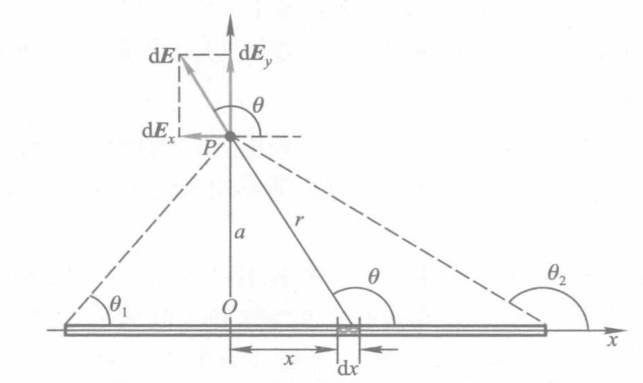
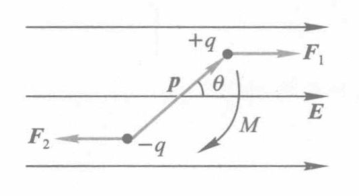
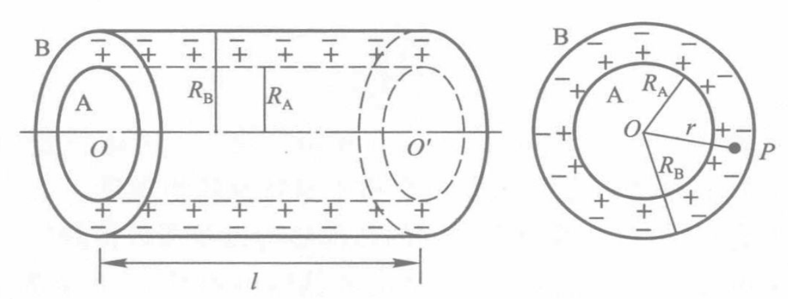

瞎写的玩意，隐藏了

!!! info 库仑定律
    $$
    \bm{F} = \frac{1}{4\pi\varepsilon_0}\frac{q_1q_2}{r^2_{12}}\bm{e}_{12}
    $$

    $\varepsilon_0$ 为**真空介电常数**。

!!! info 静电力叠加原理
    $$
    \bm{F} = \sum_{i=1}^n\bm{F}_i = \frac{1}{4\pi\varepsilon_0}\sum_{i=1}^n\frac{qq_i}{r^2_{i}}\bm{e}_{i}
    $$

!!! info 电场强度
    $$
    \bm{E} = \frac{\bm{F}}{q_0} = \frac{1}{4\pi\varepsilon_0}\sum_{i=1}^n\frac{q_i}{r^2_{i}}\bm{e}_{i}
    $$

**电偶极子**：大小相等、符号相反并有一微小间距的两个点电荷构成的复合体。

**电偶极矩**（**电距**）：$\vec{p} = q \vec{l}$。其中 $q$ 为电荷量，$\vec{l}$ 为电偶极子的方向矢量（<u>负电荷指向正电荷</u>）。

!!! info 电偶极子的电场强度
    $\bm{E}_A$ 为在轴上的场强；$\bm{E}_P$ 为在中垂线上的场强。

    $$
    \bm{E}_A = \frac{1}{4\pi\varepsilon_0}\dfrac{2 \vec{p}}{x^3}
    $$

    $$
    \bm{E}_B = - \dfrac{1}{4 \pi \varepsilon_0} \dfrac{\vec{p}}{y^3}
    $$

$$
\bm{E} = \dfrac{\d N}{\d \bm{S}_{\perp}}
$$

$N$ 为通过 $\bm{S}_{\perp}$ 的电通量，数值上等于 $\bm{S}_{\perp}$ 的电场线条数。

!!! info 电通量
    $$
    \Psi_E = \vec{E} \cdot \vec{S}
    $$

    **面积矢量** $\vec{S}$ 方向为平面正法线的方向，大小为平面的面积。

    $$
    \d \Psi_E = \vec{E} \cdot \d \vec{S}\\
    \Psi_E = \int_S \vec{E} \cdot \d \vec{S}
    $$

    $S$ 为闭合曲线时

    $$
    \Psi_E = \oint_S \vec{E} \cdot \d \vec{S}
    $$

闭合球面 $\vec{E} = \dfrac{q}{4 \pi \varepsilon_0 r^2} \vec{e}_r$，

$$
\Psi_E = \oint_S \vec{E} \cdot \d \vec{S} = \dfrac{q}{\varepsilon_0}
$$

!!! info 静电场的高斯定理
    $$
    \oint_S \vec{E} \cdot \d \vec{S} = \dfrac{1}{\varepsilon_0} \sum q_i
    $$

    $S$ 为闭合曲面，$q_i$ 为闭合曲面内的电荷量。

!!! info 静电场环路定理
    $$
    \oint_L \vec{E} \cdot \d \vec{l} = 0
    $$

    $L$ 为闭合曲线。

!!! info 电势
    $$
    V_a = \dfrac{W_a}{q_0} = \int_{0}^{\infty}\vec{E}\d \vec{l}
    $$

    点电荷 $q$ 产生的电势

    $$
    V_p = \dfrac{q}{4 \pi \varepsilon_0 r}
    $$

!!! info 电势差
    $$
    \Delta V_{ab} = V_b - V_a = \int_{a}^{b}\vec{E}\d \vec{l}
    $$

Nabla 算符 $\nabla $ 可作为*向量*，定义为：

$$
\nabla = \left(\dfrac{\partial}{\partial x}, \dfrac{\partial}{\partial y}, \dfrac{\partial}{\partial z}\right)
$$

$$
\nabla V = \left(\dfrac{\partial V}{\partial x}, \dfrac{\partial V}{\partial y}, \dfrac{\partial V}{\partial z}\right)
$$

$$
\nabla \cdot \vec{E} = \dfrac{\partial E_x}{\partial x} + \dfrac{\partial E_y}{\partial y} + \dfrac{\partial E_z}{\partial z}
$$

**静电平衡**状态：导体中没有电荷作任何定向运动的状态。

!!! note 静电平衡导体电荷分布
    $\vec{E} = \vec{0}$，由 $\displaystyle\oint_S \vec{E}\d \vec{S} = \dfrac{1}{\varepsilon_0}\sum_{i} q_i$ 可知，$\displaystyle\sum_{i} q_i = 0$。

$$
\oint_S \vec{E} \d \vec{S} = \vec{E} \Delta S = \dfrac{\sigma \Delta S}{\varepsilon_0}
$$

得

$$
\vec{E} = \dfrac{\sigma}{\varepsilon_0}
$$

$\sigma$ 为导体表面 P 点的电荷面密度。

!!! info 电容
    $$
    C = \dfrac{q}{V}
    $$

    $q$ 为电荷量，$V$ 为电势。$C$ 为孤立导体的电容。

    电容器的电容

    $$
    C = \dfrac{q}{\Delta V}
    $$

    $$
    C = \varepsilon_{\mathrm{r}} C_0
    $$

    其中 $\varepsilon_{\mathrm{r}}$ 为**相对介电常数**（*相对电容率*），$C_0$ 为极板间介质为真空时的电容。

- **有极分子**：正负电荷中心不重合的分子。如水分子 $\ce{H2O}$ 、氯化氢分子 $\ce{HCl}$ 等。
- **无极分子**：正负电荷中心重合的分子。如氧分子 $\ce{O2}$ 、氮分子 $\ce{N2}$ 等。

!!! info 电极化强度
    $$
    \vec{P} = \dfrac{\displaystyle\sum \vec{p}}{\Delta V}
    $$

    $\vec{p}$ 为分子电偶极矩，$\Delta V$ 为体积。

!!! info 电极化强度与电场强度的关系
    $$
    \vec{P} = \raisebox{0.35ex}{$\chi$}_e\varepsilon_0  \vec{E}
    $$

    $\raisebox{0.35ex}{\(\chi\)}_e$ 为**电极化率**。

!!! info 电极化率
    $$
    \varepsilon_{\mathrm{r}} = 1 + \raisebox{0.35ex}{$\chi$}_e
    $$

    $\varepsilon_{\mathrm{r}}$ 为**相对介电常数**（*相对电容率*）。

!!! info 电容率（介电常数）
    电容率 $\varepsilon$ 与电极化率 $\raisebox{0.35ex}{\(\chi\)}_e$ 的关系

    $$
    \varepsilon = \varepsilon_{\mathrm{r}} \varepsilon_0 = \varepsilon_0 (1 + \raisebox{0.35ex}{$\chi$}_e)
    $$

!!! memo ""
    课上~~抄书的~~记的，等周末补充修改。

电流

$$
I = \dfrac{\d q}{\d t}
$$

电流是*标量*。

电流密度

$$
\vec{\jmath} = \dfrac{\d I}{\d S}
$$

电流密度是*矢量*，其方向与该点正电荷的运动方向相同。

$$
I = \int_S \vec{\jmath} \cdot \d \vec{S}
$$

电动势

$$
\varepsilon = \dfrac{\d W}{\d q}
$$

欧姆定律微分形式

$$
\vec{\jmath} = \sigma \vec{E}
$$

$\sigma$ 为电导率，$\vec{E}$ 为电场强度。

$$
\sigma = \dfrac{1}{\rho}
$$

$\rho$ 为电阻率。

磁感应强度

$$
\vec{B} = \dfrac{\vec{F}}{q v}
$$

磁感应强度是*矢量*。

通过有限曲面 $S$ 的磁通量

$$
\Phi = \int_S \vec{B} \cdot \d \vec{S}
$$

!!! info 毕奥-萨伐尔定律
    $$
    \d \vec{B} = \dfrac{\mu_0}{4 \pi} \dfrac{I \d \vec{l} \times \vec{r}}{r^3}
    $$

    其中 $\vec{r}$ 为 $I$ 所在点到场点的位矢，$\mu_0$ 为真空磁导率。

    $$
    \mu_0 = 4 \pi \times 10^{-7} \pu{T . m / A}
    $$

从而任意线电流所激发的磁感应强度

$$
\vec{B} = \dfrac{\mu_0}{4 \pi} \int_L \dfrac{I \d \vec{l} \times \vec{r}}{r^3}
$$

载流长直导线的磁场

$$
\vec{B} = \dfrac{\mu_0 I}{4 \pi a}\left( \sin \beta_1 - \sin \beta_2 \right)
$$

对于无限长直导线

$$
\vec{B} = \dfrac{\mu_0 I}{2 \pi a}
$$

载流圆线圈轴线上的磁场

$$
\vec{B} = \dfrac{\mu_0}{2 \pi} \dfrac{I S}{\left( R^2 + x^2 \right)^{3/2}}
$$

其中 $S = \pi R^2$ 为原线圈的面积。

圆心处 $x=0$ 时 $B = \dfrac{\mu_0 I}{2R}$；无穷远处，$x \gg R$ 时 $B = \dfrac{\mu_0 I S}{2 \pi x^3}$。

引入载流线圈的**磁矩**

$$
\vec{m} = N I \vec{S}
$$

其中 $N$ 为线圈匝数，$\vec{S}$ 为线圈面积矢量。

则

$$
\vec{B} = \dfrac{\mu_0 \vec{m}}{2 \pi x^3}
$$

载流直螺线管内部的磁场

$$
B = \dfrac{\mu_0 }{2} n I \left( \cos \beta_1 - \cos \beta_2 \right)
$$

若螺线管为无限长，则

$$
B = \mu_0 n I
$$

对于长螺线管的端点

$$
B = \dfrac{1}{2} \mu_0 n I
$$

设电流元 $I \d \vec{l}$，横截面积 $S$，载流子数密度 $n$，载流子电荷量 $q$，载流子速度 $\vec{v}$，则

$$
I = n q v S
$$

电流元 $I \d \vec{l}$ 所激发的磁场

$$
\begin{aligned}
    \vec{B}_q &= \dfrac{\d \vec{B}}{\d N}\\
    &= \dfrac{\mu_0}{4 \pi} \dfrac{q \vec{v} \times \vec{r}}{r^3}\\
\end{aligned}
$$

其中 $\d N = n S \d l$。

!!! info 恒定磁场的高斯定理
    $$
    \oint_S \vec{B} \cdot \d \vec{S} = 0
    $$

    即通过任意闭合曲面的总磁通量为零。

!!! info 安培环路定理
    $$
    \oint_L \vec{B} \cdot \d \vec{l} = \mu_0 \sum I
    $$

    即在磁场中，沿任何闭合曲线 $\vec{B}$ 矢量的线积分（环流）等于 $\mu_0$ 乘以穿过以该闭合曲线为边界所张成的任意曲面的各恒定电流的代数和。

洛伦兹力

$$
\vec{F} = q \vec{v} \times \vec{B}
$$

洛伦兹关系式

$$
\vec{F} = q \vec{E} + q \vec{v} \times \vec{B}
$$

## 静止电荷的电场

### 电荷 库仑定律

!!! info 真空中库仑定律
    $$
    \bm{F}_{12} = \dfrac{1}{4 \pi \varepsilon_0} \dfrac{q_1 q_2}{r_{12}^2} \bm{e}_{r_{12}}
    $$

    其中，$\varepsilon_0$ 为**真空电容率**（真空介电常数），$\bm{e}_{r_{12}}$ 为 $q_1$ 到 $q_2$ 的单位矢量。

!!! note 静电力叠加原理
    $$
    \bm{F} = \sum_{i=1}^n \bm{F}_i = \dfrac{1}{4 \pi \varepsilon_0} \sum_{i=1}^n \dfrac{q_i q}{r_i^2} \bm{e}_{r_i}
    $$

### 静电场 电场强度

!!! info 电场强度
    $$
    \bm{E} = \dfrac{\bm{F}}{q_0} = \dfrac{1}{4 \pi \varepsilon_0} \sum_{i=1}^n \dfrac{q_i}{r_i^2} \bm{e}_{r_i}
    $$

    为**电场强度**，单位为 $\pu{N/C}$ 或 $\pu{V/m}$。

!!! note 点电荷的电场强度
    $$
    \bm{E} = \dfrac{1}{4 \pi \varepsilon_0} \dfrac{q}{r^2} \bm{e}_r
    $$

    点电荷系的电场强度根据叠加原理为

    $$
    \bm{E} = \sum_{i=1}^n \bm{E}_i = \dfrac{1}{4 \pi \varepsilon_0} \sum_{i=1}^n \dfrac{q_i}{r_i^2} \bm{e}_{r_i}
    $$

!!! info 电偶极子
    考虑两个电荷量相等，<u>符号相反</u>的点电荷 $+q,\, -q$，它们之间的距离为 $l$。当 $l$ 比所考虑的场点到它们的距离小得多时，这两个点电荷组成的系统称为**电偶极子**。

    联结两电荷的直线称为电偶极子的*轴线*，取从*负电荷*指向*正电荷*的矢量 $\bm{l}$ 的方向作为轴线正方向。则电偶极子的**电偶极矩**（电矩）

    $$
    \bm{p} = q \bm{l}
    $$

    ---

    1. 电偶极子在轴线上的电场强度。设轴线上的场点到电偶极子的中心 $O$ 距离为 $x$，则

    $$
    \begin{aligned}
        \bm{E}_{+} &= \dfrac{q}{4 \pi \varepsilon_0\left(x - \dfrac{l}{2}\right)^2} \bm{e}_x \\
        \bm{E}_{-} &= \dfrac{-q}{4 \pi \varepsilon_0\left(x + \dfrac{l}{2}\right)^2} \bm{e}_x
    \end{aligned}
    $$

    则

    $$
    \begin{aligned}
        \bm{E} &= \bm{E}_{+} + \bm{E}_{-} \\
        &= \dfrac{2qxl}{4 \pi \varepsilon_0\left(x^2 - \dfrac{l^2}{4}\right)^2} \bm{e}_x\\
        &= \dfrac{1}{4 \pi \varepsilon_0} \dfrac{2 \bm{p}}{x^3}\qquad (x \gg l \implies x^2 - \dfrac{l^2}{4} \approx x^2)
    \end{aligned}
    $$

    2. 电偶极子在中垂线上的电场强度。设中垂线上的场点到电偶极子的中心 $O$ 距离为 $y$，电荷与场点连线和轴线的夹角为 $\theta$，则

    $$
    \begin{aligned}
        \bm{E} &= 2 \bm{E}_{+} \cos \theta \\
        &= - \dfrac{2q}{4 \pi \varepsilon_0 \left( y^2 + \dfrac{l^2}{4} \right) } \cos \theta \bm{e}_x \\
        &= - \dfrac{1}{4 \pi \varepsilon_0} \dfrac{\bm{p}}{\left( y^2 + \dfrac{l^2}{4} \right)^{\frac{3}{2}}}\qquad \left( \cos\theta= \dfrac{\frac{l}{2}}{\sqrt{y^2 + \frac{l^2}{4}}} \right)\\
        &= - \dfrac{1}{4 \pi \varepsilon_0} \dfrac{\bm{p}}{y^3}\qquad (y \gg l \implies y^2 + \dfrac{l^2}{4} \approx y^2)
    \end{aligned}
    $$

!!! note 连续分布电荷的电场强度
    对电荷元 $\d q$ 有

    $$
    \d \bm{E} = \dfrac{1}{4 \pi \varepsilon_0} \dfrac{\d q}{r^2} \bm{e}_r
    $$

    从而

    $$
    \bm{E} = \dfrac{1}{4 \pi \varepsilon_0} \int \dfrac{\d q}{r^2} \bm{e}_r
    $$

    需要注意的是，应当分析不同电荷元在所求场点的电场方向是否相同，若不同则应当分别计算再合成。

    ---

    1. 均匀带电直棒的电场。设有一均匀带电直棒，长度为 $L$，总电荷量为 $q$，线外一点 $P$ 离开直棒的垂直距离为 $a, P$ 点和直棒两端的连线与直棒之间的夹角分别为 $\theta_{1}$ 和 $\theta_{2}$。
    

    取如图所示坐标系，设电荷线密度 $\lambda = \dfrac{q}{L}$，在距离原点 $x$ 处取长度为 $\d x$ 的电荷元 $\d q = \lambda \d x$，则

    $$
    \d \bm{E} = \dfrac{1}{4 \pi \varepsilon_0} \dfrac{\lambda \d x}{r^2} \bm{e}_r
    $$

    其中 $r = \sqrt{x^2 + a^2}$，$\bm{e}_r$ 为 $\d x$ 点指向 $P$ 的单位矢量。由图有

    $$
    \left\lbrace\begin{aligned}
        x &= -a \cot \theta\\
        \d x &= a \csc^2 \theta \d \theta\qquad \text{（对上式求微分得）}\\
        r^2 &= x^2 + a^2 = a^2 \csc^2 \theta
    \end{aligned}\right.
    $$

    则

    $$
    \begin{aligned}
        \d E_x &= \dfrac{1}{4 \pi \varepsilon_0} \dfrac{\lambda}{a}\cos \theta \d \theta \\
        \d E_y &= \dfrac{1}{4 \pi \varepsilon_0} \dfrac{\lambda}{a}\sin \theta \d \theta
    \end{aligned}
    $$

    故

    $$
    \begin{aligned}
        E_x &= \dfrac{1}{4 \pi \varepsilon_0} \dfrac{\lambda}{a} \int_{\theta_1}^{\theta_2} \cos \theta \d \theta &= \dfrac{1}{4 \pi \varepsilon_0} \dfrac{\lambda}{a} \left( \sin \theta_2 - \sin \theta_1 \right) \\
        E_y &= \dfrac{1}{4 \pi \varepsilon_0} \dfrac{\lambda}{a} \int_{\theta_1}^{\theta_2} \sin \theta \d \theta &= \dfrac{1}{4 \pi \varepsilon_0} \dfrac{\lambda}{a} \left( \cos \theta_1 - \cos \theta_2 \right)
    \end{aligned}
    $$

    则

    $$
    \begin{aligned}
        E &= \sqrt{E_x^2 + E_y^2}\\
        &= \dfrac{1}{4 \pi \varepsilon_0} \dfrac{\lambda}{a} \left\lvert 2\sin \left(\frac{\theta_2 - \theta_1}{2}\right) \right\rvert \\
    \end{aligned}
    $$

    方向用与 $Ox$ 轴的夹角 $\alpha$ 表示，有

    $$
    \begin{aligned}
        \alpha &= \arctan \dfrac{E_y}{E_x} \\
        &= \arctan \dfrac{\cos \theta_1 - \cos \theta_2}{\sin \theta_2 - \sin \theta_1}
    \end{aligned}
    $$

    若直棒无限长，即 $\theta_1 = 0,\, \theta_2 = \pi$，则

    $$
    \boxed{
        E = \dfrac{\lambda}{2 \pi \varepsilon_0 a}
    }
    $$

    2. 均匀带电圆环轴线的电场。这个高中推导过，懒得写过程了，直接给结论：
    $$
    \boxed{
        E = \dfrac{qx}{4 \pi \varepsilon_0 (x^2 + R^2)^{\frac{3}{2}}}
    }
    $$

    3. 均匀带电圆盘轴线的电场。这个高中也推导过，同上直接给结论：

    $$
    \boxed{
        E = \dfrac{\sigma}{2 \varepsilon_0} \left( 1 - \dfrac{x}{\sqrt{x^2 + R^2}} \right)
    }
    $$

    其中 $\sigma = \dfrac{q}{\pi R^2}$ 为*电荷面密度*。

    对无限大均匀带电平面，有 $R \gg x$，从而

    $$
    \boxed{
        E = \dfrac{\sigma}{2 \varepsilon_0}
    }
    $$

    即无限大均匀带电平面的电场强度与距离无关，只与电荷面密度有关。

    若 $x \gg R$，二项式定理展开有

    $$
    \begin{aligned}
        \left( 1 + \dfrac{R^2}{x^2} \right)^{-\frac{1}{2}} &= 1 - \dfrac{1}{2} \dfrac{R^2}{x^2} + \dfrac{3}{8} \left(\dfrac{R^2}{x^2}\right)^2 + \cdots \\
        &\approx 1 - \dfrac{1}{2} \dfrac{R^2}{x^2}
    \end{aligned}
    $$

    从而

    $$
    \begin{aligned}
        E &= \dfrac{\sigma R^2}{4 \varepsilon_0 x^2}\\
        &= \dfrac{q}{4 \pi \varepsilon_0 x^2}
    \end{aligned}
    $$

    即当场点与圆盘距离比圆盘半径大得多时，圆盘对场点的电场仿佛是电荷集中在圆盘中心产生的电场。

!!! note 电偶极子在均匀外电场所受作用
    如图所示，设均匀外电场中，电矩 $\bm{p}$ 与电场强度 $\bm{E}$ 的夹角为 $\theta$。
    

    有库伦力

    $$
    F_1 = F_2 = q E
    $$

    由于 $F_1$ 与 $F_2$ 的方向相反，故合力为 $0$。电偶极子没有平动运动。

    但是，由于 $F_1$ 与 $F_2$ 的作用线不同，故会产生一个力矩

    $$
    \begin{aligned}
        M &= F l \sin \theta \\
        &= q E l \sin \theta \\
        &= p E \sin \theta
    \end{aligned}
    $$

    即

    $$
    \boxed{
        \bm{M} = \bm{p} \boldsymbol{\times} \bm{E}
    }
    $$

    在力矩作用下，电偶极子将绕电场强度 $\bm{E}$ 的方向转动，直到 $\bm{p}$ 与 $\bm{E}$ 共线才平衡。

    不均匀电场中，电偶极子一方面受力矩作用使 $\bm{p}$ 与 $\bm{E}$ 共线。同时还受合力作用，促使其向电场较强的方向运动。

!!! info 电场强度通量
    与磁通量类似，**电场强度通量**（$\bm{E}$ 通量）定义为

    $$
    \Psi_E = \bm{E} \boldsymbol{\cdot} \bm{S}
    $$

    面积矢量 $\bm{S}$ 大小为平面面积，方向为平面正法线方向。

    为计算曲面的 $\bm{E}$ 通量，可将曲面分割为许多面积微元 $\d \bm{S}$，则

    $$
    \d \Psi_E = \bm{E} \boldsymbol{\cdot} \d \bm{S}
    $$

    从而

    $$
    \boxed{
        \Psi_E = \iint_S \bm{E} \boldsymbol{\cdot} \d \bm{S}
    }
    $$

    为什么是二重积分？看看 Copilot 怎么说：因为 $\bm{E}$ 通量是一个面积，而面积是一个二维量，故需要二重积分。

    对闭合曲面，可写为

    $$
    \boxed{
        \Psi_E = \oiint_S \bm{E} \boldsymbol{\cdot} \d \bm{S}
    }
    $$

    对闭合曲面，通常取<u>自内向外</u>为面积元法线的正方向。

    从而在电场线由内向外穿出时，$\bm{E}$ 通量为正；在电场线由外向内穿入时，$\bm{E}$ 通量为负。

### 静电场的高斯定理

点电荷 $q$ 激发的电场中，以其为球心，以 $r$ 为半径的球面上的 $\bm{E}$ 通量为（单位矢量 $\bm{e}_r$ 与面积矢量 $\bm{S}$ 方向相同，故 $\bm{E} \boldsymbol{\cdot} \d \bm{S} = E\d S$）

$$
\begin{aligned}
    \Psi_E &= \oiint_S \bm{E} \boldsymbol{\cdot} \d \bm{S} \\
    &= \oiint_S \dfrac{1}{4 \pi \varepsilon_0} \dfrac{q}{r^2} \d S \\
    &= \dfrac{1}{4 \pi \varepsilon_0} \dfrac{q}{r^2} \oiint_S \d S \\
    &= \dfrac{1}{4 \pi \varepsilon_0} \dfrac{q}{r^2} \cdot 4 \pi r^2 \\
    &= \dfrac{q}{\varepsilon_0}
\end{aligned}
$$

即通过闭合球面的 $\bm{E}$ 通量和球面内的电荷量成正比，与球面半径无关。

若有 $n$ 个电荷，则

$$
\bm{E} = \sum_{i=1}^n \bm{E}_i
$$

若 $n$ 个电荷均在闭合曲面内，则

$$
\begin{aligned}
    \Psi_E &= \oiint_S \bm{E} \boldsymbol{\cdot} \d \bm{S} \\
    &= \sum_{i=1}^n \oiint_S \bm{E}_i \boldsymbol{\cdot} \d \bm{S} \\
    &= \sum_{i=1}^n \dfrac{q_i}{\varepsilon_0} \\
\end{aligned}
$$

同样地，若 $n$ 个电荷均在闭合曲面外，则

$$
\oiint_S \bm{E} \boldsymbol{\cdot} \d \bm{S} = 0
$$

由此有

!!! info 静电场的高斯定理
    静电场中，通过任意闭合曲面的 $\bm{E}$ 通量，等于该曲面内电荷量的代数和除以 $\varepsilon_0$，即

    $$
    \boxed{
        \oiint_S \bm{E} \boldsymbol{\cdot} \d \bm{S} = \dfrac{1}{\varepsilon_0} \sum_{i} q_i
    }
    $$

运用高斯定理，可以容易地算出均匀带电球体和均匀带电球壳的电场强度。不再赘述，直接给出答案：

1. 球体

$$
\bm{E} = \begin{cases}
    \dfrac{qr}{4 \pi \varepsilon_0 R^3} \bm{e}_r, & (r < R)\\
    \dfrac{q}{4 \pi \varepsilon_0 r^2} \bm{e}_r, & (r \ge R)
\end{cases}
$$

2. 球壳

$$
\bm{E} = \begin{cases}
    \bm{0}, & (r < R)\\
    \dfrac{q}{4 \pi \varepsilon_0 r^2} \bm{e}_r, & (r \ge R)
\end{cases}
$$

!!! example 柱对称的电场
    求均匀带电无限长圆柱体激发的电场强度。设该圆柱的半径为 $R$，单位长度所带的电荷量为 $\lambda$。

    为了求任一点 $P$ 处的电场强度，过场点 $P$ 作一个与带电圆柱共轴的圆柱形闭合高斯面 $S$，柱高为 $h$，底面半径为 $r$。

    因为在圆柱面的曲面上各点电场强度大小相等，方向处处与曲面正交，则通过曲面的 $\bm{E}$ 通量为 $2 \pi r h E$。而上下底面与 $\bm{E}$ 平行，故 $\bm{E}$ 通量为 $0$。则通过整个曲面 $S$ 的 $\bm{E}$ 通量

    $$
    \Psi_E = 2 \pi r h E
    $$

    若 $r>R$，则包围的电荷量为 $\lambda h$，由高斯定理有

    $$
    2 \pi r h E = \dfrac{\lambda h}{\varepsilon_0}
    $$

    从而

    $$
    E = \dfrac{\lambda}{2 \pi \varepsilon_0 r}
    $$

    $$
    \boxed{
        \bm{E} = \dfrac{\lambda}{2 \pi \varepsilon_0 r} \bm{e}_r
        }
    $$

    若 $r<R$，则包围的电荷量为 $\lambda h \dfrac{\pi r^2}{\pi R^2} = \lambda h \dfrac{r^2}{R^2}$，则

    $$
    E = \dfrac{\lambda r}{2 \pi \varepsilon_0 R^2}
    $$

    $$
    \boxed{
        \bm{E} = \dfrac{\lambda r}{2 \pi \varepsilon_0 R^2} \bm{e}_r
        }
    $$

!!! example 平面对称的电场
    求均匀带电无限大平面激发的电场强度。设该平面的电荷面密度为 $\sigma$

    为了求任一点 $P$ 处的电场强度，过场点 $P$ 和其关于平面对称点 $P'$ 作一个圆柱形的高斯面，其轴线与平面垂直，两底面与平面平行，面积为 $S$。

    圆柱侧面电场线与侧面平行，故 $\bm{E}$ 通量为 $0$。圆柱上下底面的 $\bm{E}$ 通量大小相等，方向相反，分别垂直穿过左右两底面，故 $\bm{E}$ 通量为 $2 E S$。则通过整个曲面 $S$ 的 $\bm{E}$ 通量

    $$
    \Psi_E = 2 E S
    $$

    高斯定理有

    $$
    2 E S = \sigma S
    $$

    从而

    $$
    E = \dfrac{\sigma}{2 \varepsilon_0}
    $$

    $$
    \boxed{
            \bm{E} = \dfrac{\sigma}{2 \varepsilon_0} \bm{e}_n
        }
    $$

    运用电场叠加原理，可知一对电荷面密度等值异号的平行无限大平面间的电场强度为

    $$
    E = \dfrac{\sigma}{\varepsilon_0}
    $$

!!! memo ""
    1.5h 只写了三小节，我要上吊了。差了两章多，今天上完课就是三章了。

### 静电场的环路定理

由保守力的性质有

$$
q_0 \oint_L \bm{E} \boldsymbol{\cdot} \d\bm{l} = 0
$$

而 $q_0 \ne 0$，故

$$
\boxed{
    \oint_L \bm{E} \boldsymbol{\cdot} \d\bm{l} = 0
}
$$

左边是电场强度沿闭合路径的线积分，也称为**电场强度 $\bm{E}$ 的环流**。

也就是说，<u>静电场的环流为零</u>。

类似地，具备场强环流为零性质的场称为**保守力场**（**势场**）。

综合静电场高斯定理和环路定理可知，静电场是*有源的保守力场*。同时电场线不闭合，即<u>形不成漩涡</u>，所以静电场是*无旋场*。

### 电势

$$
\begin{aligned}
    W_a - W_b &= A_{ab}
    &= q_0\int_a^b \bm{E} \boldsymbol{\cdot} \d\bm{l}
\end{aligned}
$$

令 $W_{\infty } = 0$，则

$$
W_a = q_0\int_a^\infty \bm{E} \boldsymbol{\cdot} \d\bm{l}
$$

即电荷 $q_0$ 在电场某点 $a$ 的电势能数值上等于电荷 $q_0$ 从 $a$ 点移动到无穷远点时电场力所做的功 $A_{a \infty }$。

因此定义**电势**

$$
\boxed{
        V_a = \int_a^\infty \bm{E} \boldsymbol{\cdot} \d\bm{l}
    }
$$

电荷 $q_0$ 在电场中从 $a$ 点经过任意路径移动到 $b$ 点时，电场力所做的功

$$
\boxed{
        A_{ab} = q_0(V_a - V_b)
    }
$$

!!! note 点电荷电场中的电势
    距离点电荷 $q$ 为 $r$ 的点的电势

    $$
    \boxed{
            V = \frac{1}{4\pi \varepsilon_0} \frac{q}{r}
        }
    $$

!!! note 连续分布电荷电场中的电势
    $$
    V = \int \dfrac{1}{4\pi \varepsilon_0} \dfrac{\d q}{r}
    $$

!!! note 电偶极子电势
    $$
    V = \frac{1}{4\pi \varepsilon_0} \frac{\bm{p} \boldsymbol{\cdot} \bm{r}}{r^3}
    $$

!!! note 均匀带电圆环电势
    $$
    V = \frac{1}{4\pi \varepsilon_0} \frac{q}{\sqrt{x^2 + R^2}}
    $$

!!! note 均匀带电球壳电势
    $$
    V = \begin{cases}
        \dfrac{1}{4 \pi \varepsilon_0} \dfrac{q}{R}, & r \le R \\
        \dfrac{1}{4 \pi \varepsilon_0} \dfrac{q}{r}, & r > R
    \end{cases}
    $$

    即均匀带电球面及其内部是一个等势的区域。

!!! note 无限长带电直线电势
    $$
    V_P - V_{P_1} = \frac{\lambda}{2\pi \varepsilon_0} \ln \frac{r_1}{r}
    $$

    其中 $\lambda$ 为电荷线密度，$r_1$ 为 $P_1$ 点到直线的距离，$r$ 为 $P$ 点到直线的距离。

### 电场强度与电势的微分关系

取电势分别为 $V,\, V + \d V$ 的等势面 1, 2，等势面 1 在 $P$ 点的法线为 $\bm{e}_{\mathrm{n}}$，则将沿法线 $\bm{e}_{\mathrm{n}}$ 方向的电势变化率定义为 $P$ 点处的**电势梯度矢量**，记作 $\operatorname{grad} V$（gradient，读作「$V$ 的梯度」），即

$$
\boxed{
    \operatorname{grad} V = \frac{\d V}{\d n} \bm{e}_{\mathrm{n}}
    }
$$

即，电场中某点的电势梯度矢量，在方向上与电势在该点处空间变化率为最大的方向相同，量值上等于电势在该点处空间变化率的最大值（也即在该方向上电势空间变化率）。

由此有

$$
\bm{E} = - \dfrac{\d V}{\d n} \bm{e}_{\mathrm{n}} = - \operatorname{grad} V
$$

即静电场各点电场强度等于该点电势梯度的负值。

而

$$
E_x = - \frac{\partial V}{\partial x}, \quad E_y = - \frac{\partial V}{\partial y}, \quad E_z = - \frac{\partial V}{\partial z}
$$

从而

$$
\bm{E} = - \left( \frac{\partial V}{\partial x} \bm{i} + \frac{\partial V}{\partial y} \bm{j} + \frac{\partial V}{\partial z} \bm{k} \right)\\
$$

从而有

$$
\boxed{
        \operatorname{grad} V = \frac{\partial V}{\partial x} \bm{i} + \frac{\partial V}{\partial y} \bm{j} + \frac{\partial V}{\partial z} \bm{k}
    }
$$

而 Nabla 算符 $\nabla$ 定义为

$$
\begin{aligned}
    \nabla &= \left( \frac{\partial}{\partial x}, \frac{\partial}{\partial y}, \frac{\partial}{\partial z} \right)\\
    &= \left( \frac{\partial}{\partial x} \bm{i} + \frac{\partial}{\partial y} \bm{j} + \frac{\partial}{\partial z} \bm{k} \right)
\end{aligned}
$$

从而有

$$
\boxed{
        \operatorname{grad} V = - \nabla V
    }
$$

### 静电场中的导体

!!! info ""
    导体中没有电荷作任何定向运动的状态称为**静电平衡状态**。

    导体静电平衡的必要条件是<u>导体内部任意一点电场强度为零</u>。

!!! note ""
    1. 导体是等势体，导体表面是等势面。
    2. 导体表面电场强度垂直于导体表面。
    3. 对于孤立的带电导体来说，电荷在其表面上的分布由导体表面的*曲率*决定（即在导体表面凸出而尖锐的地方曲率较大，电荷面密度较大；在表面平坦的地方曲率较小，电荷面密度较小；在表面凹进去的地方曲率为负，电荷面密度更小）

!!! note ""
    当带电导体处于静电平衡状态时，导体内部处处没有净电荷存在，<u>电荷只能分布于导体的**外表面**上</u>

!!! note ""
    带电导体表面附近的电场强度与该表面的电荷面密度成正比，电场强度方向垂直于表面，即

    $$
    \bm{E} = \frac{\sigma}{\varepsilon_0} \bm{e}_{\mathrm{n}}
    $$

    其中 $\sigma$ 为导体表面某一点的电荷面密度，$\bm{e}_{\mathrm{n}}$ 为导体表面该点的法单位向量。

    该结论对**孤立导体**（指远离其他物体的导体）或**处在外电场中的任意导体**都成立。

!!! info 静电屏蔽
    在静电平衡状态下，*空腔导体*外面的带电体不会影响空腔内部的电场分布；一个接地的空腔导体，空腔内的带电体对腔外的物体不会产生影响。

    这种使导体空腔内的电场不受外界的影响，或利用接地的空腔导体将腔内带电体对外界的影响隔绝的现象，称为**静电屏蔽**。

### 电容器的电容

!!! info 孤立导体的电容
    $$
    C = \frac{q}{V}
    $$

    即一个孤立导体的电势 $V$ 与它所带的电荷量 $q$ 呈线性关系，比例系数 $C$ 称为该孤立导体的**电容**。

    电容是表征*导体储电能力*的物理量，其物理意义是：<u>使导体升高单位电势所需的电荷量</u>。

!!! info 电容器
    根据静电屏蔽的原理，用封闭导体壳 $B$ 将导体 $A$ 包围起来，导体系电势差 $V_A - V_B$ 不受外界影响。一般使 $A,\, B$ 两导体（极板）相对面上带等量异号电荷 $\pm q$，将比值

    $$
    C = \frac{q}{V_A - V_B}
    $$

    称为电容器的**电容**。

    实验验证，充有电介质的电容器电容 $C$ 为两极板间为真空时的电容 $C_{0}$ 的 $\varepsilon_{\mathrm{r}}$ 倍，即

    $$
    \varepsilon_{\mathrm{r}} = \frac{C}{C_0}
    $$

    $\varepsilon_{\mathrm{r}}$ 称为为介质的相对电容率，或**相对介电常数**。

!!! note 平行板电容器电容
    $$
    C = \frac{\varepsilon_0 S}{d}
    $$

    其中 $S$ 为极板面积，$d$ 为极板间距离。

!!! note 圆柱形电容器电容
    

    如图所示，设两圆柱面的长度为 $l$，半径分别为 $R_{\mathrm{A}}$ 和 $R_{\mathrm{B}}$，且 $l \gg R_{\mathrm{B}} - R_{\mathrm{A}}$，则

    $$
    C = \dfrac{2\pi \varepsilon_0 l}{\ln \frac{R_{\mathrm{B}}}{R_{\mathrm{A}}}}
    $$

!!! note 球形电容器电容
    设两球的半径分别为 $R_{\mathrm{A}}$ 和 $R_{\mathrm{B}}$，且 $R_{\mathrm{A}} < R_{\mathrm{B}}$，则

    $$
    C = 4\pi \varepsilon_0 \frac{R_{\mathrm{A}} R_{\mathrm{B}}}{R_{\mathrm{B}} - R_{\mathrm{A}}}
    $$

    $R_{\mathrm{B}} \gg R_{\mathrm{A}}$ 时，$C \approx 4\pi \varepsilon_0 R_{\mathrm{A}}$，即孤立导体球的电容。

若极板间充满相对介电常数为 $\varepsilon_{\mathrm{r}}$ 的电介质，则电容分别变为

$$
C = \frac{\varepsilon_{\mathrm{r}} \varepsilon_0 S}{d}
$$

$$
C = \frac{2\pi \varepsilon_{\mathrm{r}} \varepsilon_0 l}{\ln \frac{R_{\mathrm{B}}}{R_{\mathrm{A}}}}
$$

$$
C = 4\pi \varepsilon_{\mathrm{r}} \varepsilon_0 \frac{R_{\mathrm{A}} R_{\mathrm{B}}}{R_{\mathrm{B}} - R_{\mathrm{A}}}
$$

!!! note 串联电容器
    $$
    \dfrac{1}{C} = \sum\dfrac{1}{C_i}
    $$

!!! note 并联电容器
    $$
    C = \sum C_i
    $$

### 静电场中的电介质

!!! info 电介质的极化
    当电介质处在电场中时，在电介质中，~~不论是原子中的电子、还是分子中的离子或是晶体点阵上的带电粒子~~，在电场的作用下都会在原子大小的范围内移动，当达到静电平衡时，在电介质表面层或在体内会出现*极化电荷*（束缚电荷），这个现象称作电介质的**极化**。

    与极化电荷相对应的是*自由电荷*，即在电场作用下能移动一宏观距离的电荷。

!!! info 电极化强度
    在电介质内任取一物理无限小的体积元 $\Delta V$ （但其中仍有大量的分子），当没有外电场时，这体积元中所有分子的电偶极矩的矢量和 $\sum \bm{p}$ 等于零。

    但是，在外电场的影响下，由于电介质的极化，$\sum \bm{p}$ 将不等于零。

    外电场愈强，被极化的程度愈大，$\sum \bm{p}$ 的值也愈大。

    因此我们取单位体积内分子电偶极矩的矢量和，即

    $$
    \bm{P} = \dfrac{\sum \bm{p}}{\Delta V}
    $$

    作为量度电介质极化程度的基本物理量，称为该点（$\Delta V$ 所包围的一点）的**电极化强度**或 *$P$ 矢量*。

!!! note ""
    $$
    \boxed{\sigma' = \bm{P} \boldsymbol{\cdot} \bm{e}_{\mathrm{n}}}
    $$

    即介质极化所产生的*极化电荷面密度*，等于*电极化强度*<u>沿介质表面外法线的分量</u>。

如前所述，如果把激发外电场的原有电荷系称为自由电荷，并用 $\bm{E}_{0}$ 表示它们所激发的电场强度，而用 $\bm{E}^{\prime}$ 表示极化过程完成之后极化电荷所激发的电场强度. 那么，空间任一点最终的合电场强度 $\bm{E}$ 应是上述两类电荷所激发电场强度的矢量和，即

$$
\bm{E} = \bm{E}_{0} + \bm{E}^{\prime}
$$

由于在电介质中，自由电荷的电场与极化电荷的电场的方向总是<u>相反</u>, 所以在电介质中的合电场强度 $\bm{E}$ 与外电场强度 $\bm{E}_{0}$ 相比显著地*削弱*了。

对于各向同性线性电介质，电极化强度 $\bm{P}$ 和介质内部的合电场强度 $\bm{E}$ 的关系为

$$
\bm{P} =  \raisebox{0.35ex}{$\chi$}_e\varepsilon_0 \bm{E}
$$

其中 $\raisebox{0.35ex}{\(\chi\)}_e$ 为电介质的**电极化率**，和电介质的性质有关，量纲为 $1$。

!!! note ""
    $$
    \varepsilon_{\mathrm{r}} = 1 + \raisebox{0.35ex}{$\chi$}_e
    $$

    并令

    $$
    \begin{aligned}
        \varepsilon &= \varepsilon_{\mathrm{r}} \varepsilon_0 \\
        &=  (1 + \raisebox{0.35ex}{$\chi$}_e)\varepsilon_0\\
    \end{aligned}
    $$

    称为电介质得**电容率**或**介电常数**。

### 有电介质时的高斯定理 电位移

高斯定理中 $\sum q$ 应理解为闭合曲面内所有电荷的代数和，包括自由电荷和极化电荷。则

$$
\oiint \bm{E} \boldsymbol{\cdot} \d\bm{S} = \dfrac{1}{\varepsilon_0}\left(  \sum q + \sum q' \right)
$$

定义**电位移矢量** $\bm{D}$（$\bm{D}$ 矢量）为

$$
\bm{D} = \varepsilon_0 \bm{E} + \bm{P}
$$

则

!!! note 有电介质时高斯定理
    $$
    \boxed{
        \oiint \bm{D} \boldsymbol{\cdot} \d\bm{S} = \sum q
        }
    $$

并规定，在垂直于电位移线的单位面积上，通过的电位移线数目，等于该点的电位移 $\bm{D}$ 的量值，称作**电通量**。

即有电介质时高斯定理告诉我们：通过电介质中任一闭合曲面的电通量，等于该面所包围的自由电荷量的代数和。

同时，电位移线是从正的*自由电荷*出发，终止于负的*自由电荷*。

此外还有

$$
\bm{D} = \varepsilon \bm{E}
$$

有电介质时环路定理仍然成立，即

$$
\oint_L \bm{E} \boldsymbol{\cdot} \d\bm{l} = 0
$$

$\bm{E}$ 是所有电荷（自由电荷和极化电荷）所激发的静电场中各点的合电场强度。

!!! note ""
    只有在均匀介质充满整个电场，或电介质表面是等势面等情况，才有

    $$
    \bm{E} = \dfrac{\bm{E}_0}{\varepsilon_{\mathrm{r}}}
    $$

    及

    $$
    \bm{D} = \varepsilon_0 \bm{E}_0
    $$

### 静电场中能量

!!! info ""
    带点电容器静电能 $W_{\mathrm{e}}$ 有

    $$
    \begin{aligned}
        W_{\mathrm{e}} &= \dfrac{1}{2} \dfrac{Q^2}{C}\\
        &= \dfrac{1}{2} C (V_1 - V_2)^2\\
        &= \dfrac{1}{2} Q (V_1 - V_2)
    \end{aligned}
    $$

!!! note ""
    电场中单位体积能量称为**电场能量密度**，有

    $$
    \begin{aligned}
        w_{\mathrm{e}} &= \dfrac{W_{\mathrm{e}}}{V}\\
        &= \dfrac{1}{2} \varepsilon_0 E^2\\
        &= \dfrac{1}{2} D E
    \end{aligned}
    $$

    一般情况下，有

    $$
    \boxed{
            w_{\mathrm{e}} = \dfrac{1}{2} \bm{D} \boldsymbol{\cdot} \bm{E}
        }
    $$

    各向同性线性介质中，有 $\bm{D} = \varepsilon \bm{E}$，此时

    $$
    w_{\mathrm{e}} = \dfrac{1}{2} \varepsilon E^2
    $$

从而有

$$
W_{\mathrm{e}} = \iiint_V w_{\mathrm{e}} \d V = \dfrac{1}{2} \iiint_V \bm{D} \boldsymbol{\cdot} \bm{E} \d V
$$
