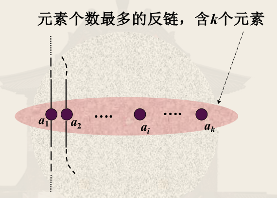
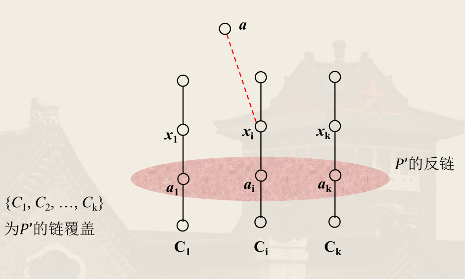

## 偏序关系

!!! info ""
    非空集合 $A$ 上的*自反*、*反对称*、*传递*关系称为 $A$ 上的**偏序关系**（partial order），记为 $\preccurlyeq$。

    $(a, b) \in \preccurlyeq$ 常写作 $a \preccurlyeq b$，读作「$a$ 小于等于 $b$」。

    使用 $a \prec b$ 表示 $a \preccurlyeq b \land a \ne b$。

    这里的偏序称为*非严格偏序*或*自反偏序*，若将「自反」换成「反自反」，则称为*严格偏序*或*反自反偏序*。

## 偏序集

!!! info ""
    集合 $A$ 及其上的偏序关系 $\preccurlyeq$ 称为 $A$ 上的**偏序集**，记为 $(A, \preccurlyeq)$。

!!! info ""
    设 $\preccurlyeq$ 为非空集合 $A$ 上的偏序关系，对 $x, y \in A$，若有 $x \preccurlyeq y$ 或 $y \preccurlyeq x$，则称 $x$ 和 $y$ **可比**。

!!! info ""
    设 $R$ 是 $A$ 上的偏序关系，若 $A$ 中任意两个元素都可比，则称 $R$ 是 $A$ 上的**全序关系**（或线性序，total order）

!!! info ""
    若 $x \prec y$ 且不存在 $z \in A$ 使得 $x \prec z \prec y$，则称 $y$ **覆盖**（cover）$x$。

## 哈斯图（Hasse）

- 自反性省略<u>圈</u>
- 反对称性省略<u>箭头</u>
- 传递性省略<u>箭头和中间节点</u>

## 特殊元素

!!! info ""
    $x$ 是 $A$ 上的偏序集 $(A, \preccurlyeq)$ 中的**极大元**，当且仅当 $\forall y \in A (x \preccurlyeq y \to x = y)$。

    $x$ 是 $A$ 上的偏序集 $(A, \preccurlyeq)$ 中的**极小元**，当且仅当 $\forall y \in A (y \preccurlyeq x \to x = y)$。

极大（小）元<u>不一定存在</u>，有穷集合一定有极大（小）元。

极大（小）元<u>不一定唯一</u>。一个元素可以同时为极大和极小元。

!!! info ""
    $x$ 是 $A$ 上的偏序集 $(A, \preccurlyeq)$ 中的**最大元**，当且仅当 $\forall y \in A (y \preccurlyeq x)$。

    $x$ 是 $A$ 上的偏序集 $(A, \preccurlyeq)$ 中的**最小元**，当且仅当 $\forall y \in A (x \preccurlyeq y)$。

最大（小）元<u>不一定存在</u>，<u>若存在必唯一</u>。

!!! info ""
    对于偏序集 $(A, \preccurlyeq)$ 与 $A$ 的子集 $B$，若存在 $y \in A$ 使得 $\forall x \in B (x \preccurlyeq y)$，则称 $y$ 是 $B$ 的**上界**。

    若 $B$ 的上界构成的偏序集有最小元，则称 $B$ 有**上确界**（最小上界，**l**east **u**pper **b**ound）。

    同理可定义下界和下确界（最大下界，**g**reatest **l**ower **b**ound）。

## 良序

!!! info ""
    给定集合 $A$ 上的偏序关系 $\preccurlyeq$，若 $A$ 的<u>任意非空子集有最小元</u>，则称 $\preccurlyeq$ 是 $A$ 上的**良序**（well order）。

良序必为全序，全序不一定为良序（对于无穷集合，全序不一定有最小元）。

良序的逆关系也未必是良序，例如 $(\N, \le)$

## 链

!!! info ""
    设 $C$ 是偏序集 $(P, \preccurlyeq)$ 的一个子集，若 $C$ 中<u>任意两个元素都可比</u>，则称 $C$ 构成一个**链**（chain）。

    若链 $C$ 不是任何其它链的子链，则称 $C$ 是*极大化*的，即 $C$ 外没有一个元素与 $C$ 中所有元素都可比。

!!! info ""
    设 $A$ 是偏序集 $(P, \preccurlyeq)$ 的一个子集，若 $A$ 中<u>任意两个元素都不可比</u>，则称 $A$ 构成一个**反链**（anti-chain）。

    若反链 $A$ 不是任何其它反链的子链，则称 $A$ 是*极大化*的，即 $A$ 外没有一个元素与 $A$ 中所有元素都不可比。

!!! info ""
    有限偏序集中最长链的元素个数称为该偏序集的**高度**（height），最大反链的元素个数称为该偏序集的**宽度**（width）。

## 任务调度

- 链内步骤有顺序依赖
- 反链内步骤可并发执行

### 并发任务调度

!!! info ""
    **并发调度**（concurrent scheduling）是将 $A$ 划分为 $A_0, \cdots, A_n$ 使得对于 $0 \le i < j \le n,\, \forall x_i \in A_i, x_j \in A_j (x_j \not\preccurlyeq x_i)$。

    即不可使得 $A_i$（前的）中的任务依赖于 $A_j$（后的）中的任务。

结束于 $a$ 的最长链称为到达 $a$ 的**关键路径**（critical path）。该路径除 $a$ 之外的元素个数称为 $a$ 的**深度**（depth）。

## 偏序的划分

!!! info Mirsky 定理
    设有限偏序集 $(P, \preccurlyeq)$ 的高度为 $t$，则可将其划分为 $t$ 个反链。

!!! note 推论
    对有限偏序集 $(P, \preccurlyeq)$，对于任意 $t > 0$，要么有长度大于 $t$ 的链，要么有长度至少为 $\dfrac{|P|}{t}$ 的反链。

    从而可知，对于任意有限偏序集 $(P, \preccurlyeq)$，要么有长度大于 $\sqrt{|P|}$ 的链，要么有长度至少为 $\sqrt{|P|}$ 的反链。

**链覆盖**是 $(P, \preccurlyeq )$ 中一组互不相交的链，它们一起包含了 $P$ 中的所有元素。即对互不相交的链 $C_i$，有

$$
\bigcup_{i=1}^{k} C_i = P
$$

!!! info Dilworth 定理
    设 $(P, \preccurlyeq)$ 是有限偏序集，其宽度为 $w$，则可将其划分为 $w$ 个链。

    <!-- {{{归纳证明 -->
    

    
归纳证明

    Perles 1963 证明：

    若 $|P| = 1$，则 $w = 1$，命题成立；

    设命题对于 $|P| \le k$ 时成立，现证明对于 $|P| = k + 1$ 时成立。

    对于某最长的反链 $A$，令

    $$
    \begin{aligned}
        D(A) = \left\lbrace x \mid \exists a \in A, x \prec a \right\rbrace\\
        U(A) = \left\lbrace x \mid \exists a \in A, x \succ a \right\rbrace
    \end{aligned}
    $$

    显然 $P = A \cup D(A) \cup U(A)$ 且三者互不相交。

    情况一：存在一个最长的反链 $A$ 使得 $D(A)$ 与 $U(A)$ 均非空。

    记 $A$ 中元素为 $a_1, \cdots, a_w$，在 $A \cup D(A)$ 上应用归纳假设（因为 $U(A)$ 非空，所以 $|A \cup D(A)| <  |P| = k + 1$，即 $|A \cup D(A)| \le k$）。不失一般性，有 $A \cup D(A)$ 一个链覆盖 $C_1, \cdots, C_w$，且 $a_i$ 是 $C_i$ 的最大元素。

    再在 $A \cup U(A)$ 上应用归纳假设，有 $A \cup U(A)$ 一个链覆盖 $C'_1, \cdots, C'_w$，且 $a_i$ 是 $C'_i$ 的最小元素。

    于是 $C_i \cup C'_i$ 是一个链，且这 $w$ 个链覆盖了 $P$。

    情况二：对于每一个最长的反链 $A$，$D(A), U(A)$ 都至少有一个为空。

    在 $P$ 中选择一个极大元素 $y$，再选择一个满足 $x \preccurlyeq y$ 的极小元素 $x$，则 $C = \left\lbrace x, y \right\rbrace$ 构成一条链。

    则 $P - C$ 的宽度为 $w - 1$。

    由归纳假设，可划分 $P - C$ 为 $w - 1$ 条链，再加上 $C$，共有 $w$ 条链即可。

    ---

    按 $P$ 中元素进行归纳证明。

    设 $a$ 为 $P$ 中的一个极大元素，$P' = P - \left\lbrace a \right\rbrace$。

    设 $(P', \preccurlyeq )$ 有一个大小为 $k$ 的反链 $\left\lbrace a_1, \cdots, a_k \right\rbrace$，并有一个规模为 $k$ 的链覆盖 $\left\lbrace C_1, \cdots, C_k \right\rbrace$。

    对任意 $C_i$，$P'$ 中大小为 $k$ 的任意反链均有唯一元素属于 $C_i$，这些元素中最大元记为 $x_i$。

    于是 $A = \left\lbrace x_1, \cdots, x_k \right\rbrace$ 为反链。否则设 $A$ 中有两个元素 $x_i \preccurlyeq x_j$，根据 $x_j$ 的定义，$P'$ 中有一个大小为 $k$ 的反链 $A_j$，$x_j$ 为 $A_j$ 和 $C_j$ 的公共元素，假设 $y$ 是 $A_j$ 和 $C_i$ 的公共元素，则 $y \preccurlyeq x_i$，从而 $y \preccurlyeq x_j$，与 $A_j$ 是反链矛盾。

    

    若 $\left\lbrace a, x_1, \cdots, x_{k} \right\rbrace$ 是 $P$ 中的反链，则 $P$ 的链覆盖 $\left\lbrace \left\lbrace a \right\rbrace, C_1, \cdots, C_{k} \right\rbrace$ 为规模为 $k+1$ 的覆盖，得证。

    若 $\left\lbrace a, x_1, \cdots, x_{k} \right\rbrace$ 不是 $P$ 中的反链，即存在 $x_m \preccurlyeq a$（因 $a$ 为极大元，不会有 $a \preccurlyeq x_m$）。

    令 $K = \left\lbrace a \right\rbrace \cup \left\lbrace z \in C_m \mid z \preccurlyeq x_m \right\rbrace$。显然 $K$ 是 $P$ 中的一条链。

    $P - K$ 中最大反链大小为 $k - 1$（$P - K$ 中没有含 $k$ 个元素的反链，否则与 $x_m$ 的定义矛盾）。

    由归纳假设，$P - K$ 有大小为 $k - 1$ 的一个链覆盖，该覆盖与 $K$ 构成 $P$ 的链覆盖（链数为 $k$），已知 $\left\lbrace x_1, \cdots, x_{k} \right\rbrace$ 是 $P$ 中的反链，得证。

    

    <!-- }}} -->

从而得到对任意有限偏序集 $(A, \preccurlyeq)$，覆盖 $A$ 的最小链数等于 $A$ 的最长反链的长度（元素个数）。
