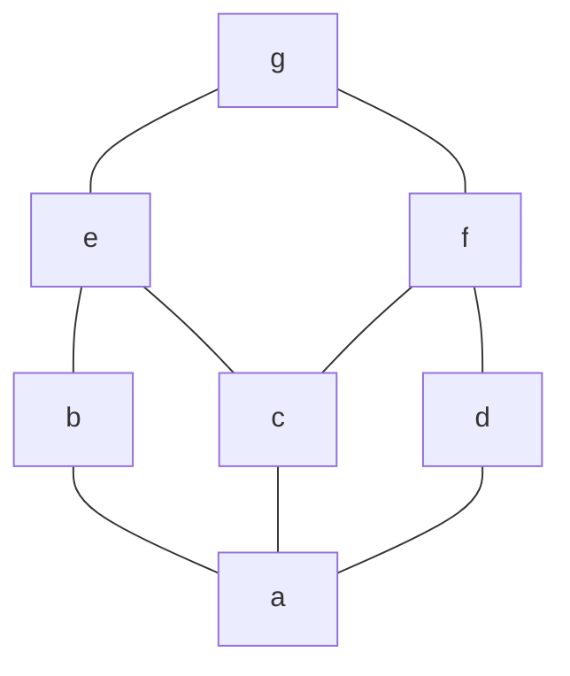
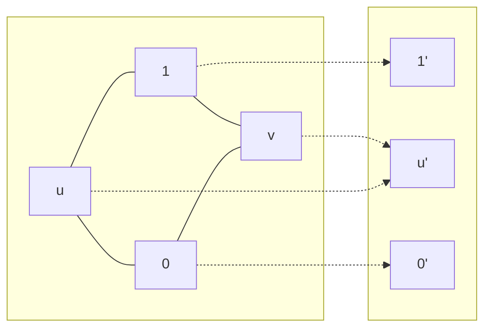
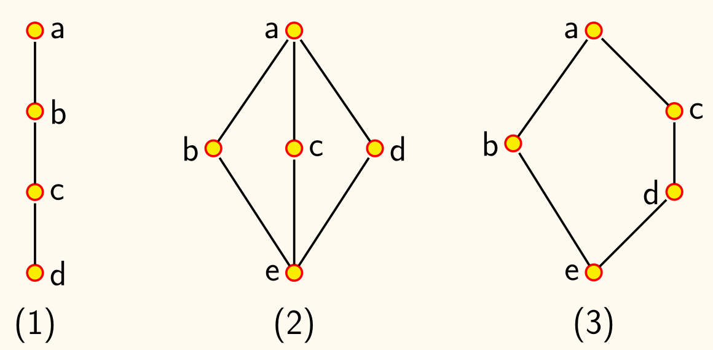
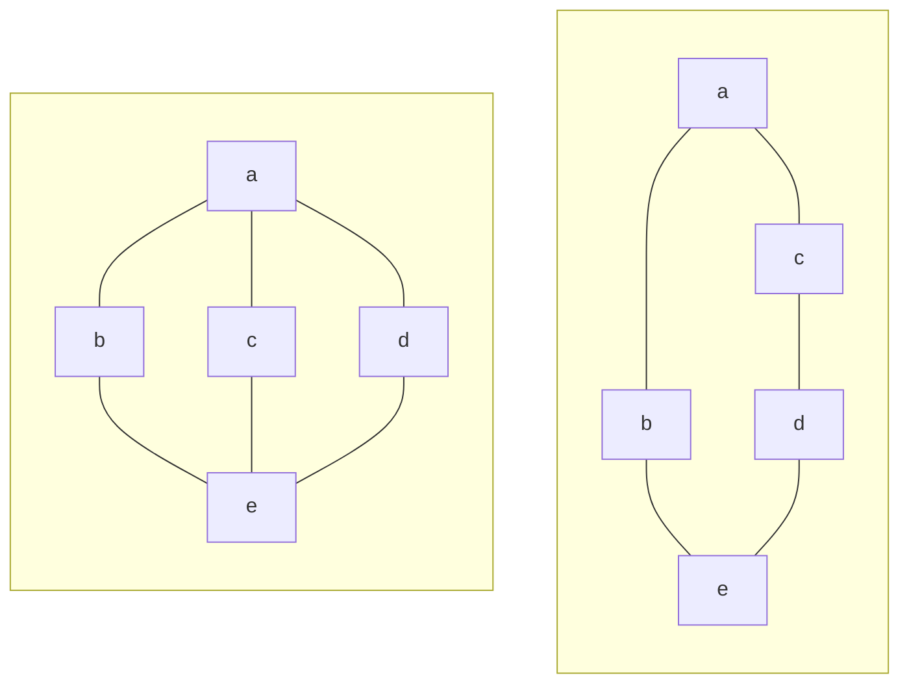
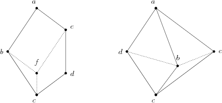

## 概念

!!! info ""
    设 $(L, \preccurlyeq)$ 是偏序集，若
    - 对任意 $x, y \in L$，存在 $\left\lbrace x, y \right\rbrace$ 最小上界 $\operatorname{lub}\left\lbrace x, y \right\rbrace$，记为 $x \vee y$，也称为 $x$ 和 $y$ 的**并**（join）；
    - 对任意 $x, y \in L$，存在 $\left\lbrace x, y \right\rbrace$ 最大下界 $\operatorname{glb}\left\lbrace x, y \right\rbrace$，记为 $x \wedge y$，也称为 $x$ 和 $y$ 的**交**（meet）。

    则称 $L$ 关于 $\preccurlyeq$ 构成一个**格**（lattice）。

## 性质

- $a \preccurlyeq b, b \preccurlyeq c \implies a \vee b \preccurlyeq c$
- $c \preccurlyeq a, c \preccurlyeq b \implies c \preccurlyeq a \wedge b$
- $a \preccurlyeq c, b \preccurlyeq d \implies a \vee b \preccurlyeq c \vee d, a \wedge b \preccurlyeq c \wedge d$

!!! info ""
    若 $(L, \preccurlyeq)$ 是格，则 $\forall a, b \in L$，有：

    $$
    a \preccurlyeq b \iff a \wedge b = a \iff a \vee b = b
    $$

设 $(L, \preccurlyeq)$ 是格，则 $\vee, \wedge$ 可看作是 $L$ 上的二元运算，有如下性质：
- **结合律**：$(a \wedge b) \wedge c = a \wedge (b \wedge c), (a \vee b) \vee c = a \vee (b \vee c)$；
- **交换律**：$a \wedge b = b \wedge a, a \vee b = b \vee a$；
- **吸收律**：$a \wedge (a \vee b) = a, a \vee (a \wedge b) = a$；
- **幂等律**：$a \wedge a = a, a \vee a = a$；

## 对偶命题

!!! info ""
    设 $P$ 是含有格中元素及符号 $=, \preccurlyeq, \succcurlyeq, \vee, \wedge$ 的命题。则将 $P$ 中
    - $\preccurlyeq$ 替换为 $\succcurlyeq$
    - $\succcurlyeq$ 替换为 $\preccurlyeq$
    - $\vee$ 替换为 $\wedge$
    - $\wedge$ 替换为 $\vee$

    所得到的命题称为 $P$ 的**对偶命题** $P^*$。

!!! note 格的对偶定理
    若命题 $P$ 对<u>一切格</u>成立，则 $P^*$ 也对<u>一切格</u>成立。

    <!-- {{{证明 -->
    

    
证明

    定义 $S$ 上二元关系 $\preccurlyeq^{*}\colon \forall a, b \in S, a \preccurlyeq^{*} b \iff b \preccurlyeq a$，显然 $\preccurlyeq^{*}$ 是 $S$ 上的偏序关系。

    而 $\forall a, b \in S, a \wedge^{*} b = a \vee b, a \vee^{*} b = a \wedge b$，故 $S$ 关于 $\preccurlyeq^{*}$ 构成一个格。

    从而 $P^{*}$ 在 $(S, \preccurlyeq)$ 中为真当且仅当 $P$ 在 $(S, \preccurlyeq^{*})$ 中为真。

    而 $P$ 对一切格成立，故 $P^{*}$ 对一切格成立。

    

    <!-- }}} -->

## 代数格

格的代数性质：
- 结合律
- 交换律
- 吸收律（吸收律蕴含幂等律，如 $x \wedge x = x \wedge ( x \vee (x \wedge x)) = x$）

!!! info ""
    设 $L$ 是一个集合，$\wedge, \vee$ 是 $L$ 上的二元运算，且满足*结合律*、*交换律*、*吸收律*，则 $(L, \wedge, \vee)$ 构成一个**代数格**。

对代数格 $(L, \wedge, \vee)$，有：
- $\forall x, y \in L,\, x \wedge y = x \iff x \vee y = y$
- $\forall x, y \in L$，定义 $x \preccurlyeq y \iff x \wedge y = x$，则 $(L, \preccurlyeq)$ 是一个（偏序）格。
    - $\operatorname{lub}\left\lbrace x, y \right\rbrace = x \vee y$
    - $\operatorname{glb}\left\lbrace x, y \right\rbrace = x \wedge y$

### 子格

!!! info ""
    设 $(L, \wedge, \vee)$ 是代数格，非空集合 $S \subseteq L$，若 $S$ 关于 $\wedge, \vee$ 构成一个*格*，则称 $(S, \wedge, \vee)$ 是 $L$ 的一个**子格**。

设 $L$ 为如图所示的格，设

$$
\begin{aligned}
    S_1 &= \left\lbrace a, e, f, g \right\rbrace\\
    S_2 &= \left\lbrace a, b, e, g \right\rbrace
\end{aligned}
$$

则 $S_1$ 不是 $L$ 的子格，因为 $e \wedge f = c \notin S_1$。

$S_2$ 是 $L$ 的子格。

### 格同态

!!! info ""
    设 $(L_1, \wedge_1, \vee_1)$ 和 $(L_2, \wedge_2, \vee_2)$ 是代数格，若有函数 $f\colon L_1 \to L_2$ 使得任意 $a, b \in L_1$，都有

    $$
    \begin{aligned}
        f(a \wedge_1 b) &= f(a) \wedge_2 f(b)\\
        f(a \vee_1 b) &= f(a) \vee_2 f(b)
    \end{aligned}
    $$

    成立。则称 $f$ 是从 $L_1$ 到 $L_2$ 的**同态映射**，简称**格同态**。

格同态保序：$\forall x, y \in L_1,\, \bigl(x \preccurlyeq_1 y \to f(x) \preccurlyeq_2 f(y)\bigr)$。一般逆命题不成立，如下所示。

### 格同构

!!! info ""
    设 $(L_1, \wedge_1, \vee_1)$ 和 $(L_2, \wedge_2, \vee_2)$ 是代数格，且其同态映射 $f$ 为双射，则称 $f$ 是从 $L_1$ 到 $L_2$ 的**同构映射**，简称**格同构**。

!!! note ""
    若 $f$ 为 $L_1$ 到 $L_2$ 的双射，则 $f$ 为格同构当且仅当

    $$
    \forall x, y \in L_1,\, \bigl(x \preccurlyeq_1 y \leftrightarrow f(x) \preccurlyeq_2 f(y)\bigr)
    $$

    <!-- {{{证明 -->
    

    
证明

    充分性：

    由于 $x \wedge_{1} y \preccurlyeq_{1} x$，由保序性，$f\left(x \wedge_{1} y\right) \preccurlyeq_{2} f(x)$；同理，$f\left(x \wedge_{1} y\right) \preccurlyeq_{2} f(y)$；于是 $f\left(x \wedge_{1} y\right) \preccurlyeq_{2} f(x) \wedge_{2} f(y)$。

    由于逆映射 $f^{-1}$ 仍然保序， $f(x) \wedge_{2} f(y) \preccurlyeq_{2} f(x), f^{-1}\left(f(x) \wedge_{2} f(y)\right) \preccurlyeq_{1} x$；同理 $f^{-1}\left(f(x) \wedge_{2} f(y)\right) \preccurlyeq_{1} y$；于是 $f^{-1}\left(f(x) \wedge_{2} f(y)\right) \preccurlyeq_{1} x \wedge_{1} y$；再由 $f$ 保序，$f(x) \wedge_{2} f(y)=$ $f\left(f^{-1}\left(f(x) \wedge_{2} f(y)\right)\right) \preccurlyeq_{2} f\left(x \wedge_{1} y\right)$。

    于是 $f\left(x \wedge_{1} y\right)=f(x) \wedge_{2} f(y)$。同理可证 $f\left(x \vee_{1} y\right)=f(x) \vee_{2} f(y)$。

    必要性由上面格同态保序的结论可知。

    

    <!-- }}} -->

同构的格具有相同的哈斯图形状。

下图分别为*链*（chain）、*钻石格* $M_3$（diamond lattice）、和*五角格* $N_5$（pentagon lattice）的哈斯图：

## 分配格

!!! info ""
    设 $(L, \wedge, \vee)$ 为格，若 $\forall a, b, c \in L$，有
    - $a \wedge (b \vee c) = (a \wedge b) \vee (a \wedge c)$
    - $a \vee (b \wedge c) = (a \vee b) \wedge (a \vee c)$

    则称 $(L, \wedge, \vee)$ 为**分配格**（distributive lattice）。

钻石格 $M_3$ 与五角格 $N_5$ 不是分配格。
- $M_3$：$b \wedge (c \vee d) = b$ 而 $(b \wedge c) \vee (b \wedge d) = e$ 
- $N_5$：$d \vee (b \wedge c) = d$ 而 $(d \vee b) \wedge (d \vee c) = c$

!!! info 分配格判定定理一
    设 $L$ 为格，则 $L$ 是分配格当且仅当 $L$ *不含有*与 $M_3$ 或 $N_5$ 同构的<u>子格</u>。

从而有推论：
- 小于五元的格都是分配格
- 链是分配格

有 $M_3$ 或 $N_5$ 作为子集，但不是子格，未必不是分配格。如上图两个格都是分配格。

!!! info 分配格判定定理二
    设 $L$ 为格，则 $L$ 是分配格当且仅当对于任意 $a, b, c \in L$，有

    $$
    (a \wedge b = a \wedge c) \land (a \vee b = a \vee c) \to b = c
    $$
    
    <!-- {{{证明 -->
    

    
证明

    必要性：
    
    $$
    \begin{aligned}
        b &= b \vee (a \wedge b)\\ 
        &= b \vee (a \wedge c)\\
        &= (b \vee a) \wedge (b \vee c)\\
        &= (a \vee c) \wedge (b \vee c)\\
        &= (a \wedge b) \vee c\\ 
        &= (a \wedge c) \vee c\\ 
        &= c
    \end{aligned}
    $$
    
    

    <!-- }}} -->
    
## 有界格

设 $L$ 为格，若
- $\exists b \in L, \forall x \in L, b \preccurlyeq x$，则 $b$ 称为格 $L$ 的**全下界**（bottom），记作 $\bm{0}$。
- $\exists t \in L, \forall x \in L, x \preccurlyeq t$，则 $t$ 称为格 $L$ 的**全上界**（top），记作 $\bm{1}$。

!!! info ""
    设 $L$ 为格，若 $L$ 有全下界和全上界，则称 $L$ 为**有界格**（bounded lattice）。

    全上界和全下界存在必唯一。

有界格一般记为 $(L, \wedge, \vee, \bm{0}, \bm{1})$。
- $\forall a \in L,\, a \vee \bm{0} = a, a \wedge \bm{1} = a$

- 同一律：$\forall a \in L,\, a \vee \bm{0} = a, a \wedge \bm{1} = a$
- 支配律：$\forall a \in L,\, a \wedge \bm{0} = \bm{0}, a \vee \bm{1} = \bm{1}$

因此称
- $\bm{0}$ 是关于 $\vee$ 的单位元，关于 $\wedge$ 的零元
- $\bm{1}$ 是关于 $\wedge$ 的单位元，关于 $\vee$ 的零元

有限格 $L = \left\lbrace a_1, \cdots, a_n \right\rbrace$ 为有界格，且
- $\bm{0} = a_1 \wedge \cdots \wedge a_n$
- $\bm{1} = a_1 \vee \cdots \vee a_n$

!!! note ""
    求涉及有界格的命题之对偶命题，须将全下界与全上界对换。

## 补元

!!! info ""
    设 $(L, \wedge, \vee, \bm{0}, \bm{1})$ 为有界格，若对 $a \in L$，存在 $b \in L$，使得
    - $a \wedge b = \bm{0}$
    - $a \vee b = \bm{1}$

    则称 $b$ 为 $a$ 的**补元**（complement）。

- 有界格中 $\bm{0}$ 和 $\bm{1}$ 互为补元
- 补元可能不存在
- 补元若存在，未必唯一

!!! note 有界分配格补元唯一
    设 $(L, \wedge, \vee, \bm{0}, \bm{1})$ 为有界分配格，$a \in L$ 的补元若存在，则唯一。

    <!-- {{{证明 -->
    

    
证明

    
    假设 $b$ 和 $c$ 是 $a$ 的补元，则

    $$
    \begin{aligned}
        a \vee c = \bm{1}, a \wedge c = \bm{0}\\ 
        a \vee b = \bm{1}, a \wedge b = \bm{0}
    \end{aligned}
    $$
    
    由于全上界和全下界的唯一性，有 $a \vee c = a \vee b, a \wedge c = a \wedge b$，由于 $L$ 为分配格，有 $b = c$。
    
    

    <!-- }}} -->

!!! info ""
    设 $(L, \wedge, \vee, \bm{0}, \bm{1})$ 为有界格，若 $L$ 中每个元素都有补元，则称 $L$ 为**有补格**（complemented lattice）。

$M_3$ 与 $N_5$ 皆为有补格。

有补分配格性质：
- 代数格：结合律、交换律、吸收率、（幂等律）
- 分配格：分配律
- 有界：同一律、（支配律）
- 有补：补律、（双重补律、德摩根律）

有补分配格的代数性质 $\implies $ <u>布尔代数</u>。
