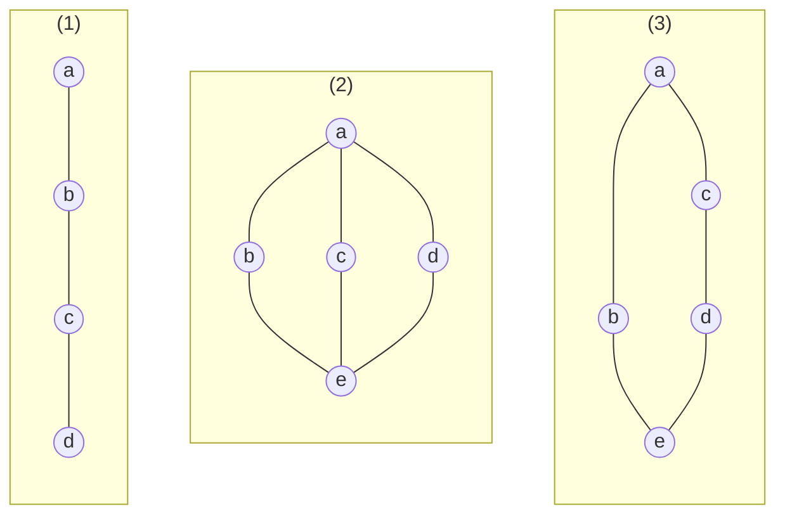

## George Boole 基本想法

设变量 $X, Y, Z, \cdots$ 代表事物的类别（一个事物要么属于这个类别，要么不属于这个类别），有
- 乘法：$X Y$ 表示 $X$ 与 $Y$ 同时满足
- 加法：$X + Y$ 表示 $X$ 或 $Y$ 满足
- 组合：$Z(X + Y) = ZX + ZY$

## 抽象定义

!!! info ""
    **布尔代数**是一个集合 $B$，定义二元运算 $\vee$ 和 $\wedge$，一元运算 $\bar{\phantom{a}}$，以及特殊元素 $\bm{0}$ 和 $\bm{1}$，且对 $\forall x, y, z \in B$，有
    - 结合律：$x \vee (y \vee z) = (x \vee y) \vee z$，$x \wedge (y \wedge z) = (x \wedge y) \wedge z$
    - 交换律：$x \vee y = y \vee x$，$x \wedge y = y \wedge x$
    - 分配律：$x \wedge (y \vee z) = (x \wedge y) \vee (x \wedge z)$，$x \vee (y \wedge z) = (x \vee y) \wedge (x \vee z)$
    - 同一律：$x \vee \bm{0} = x$，$x \wedge \bm{1} = x$
    - 补律：$x \vee \bar{x} = \bm{1}$，$x \wedge \bar{x} = \bm{0}$

上面的性质蕴含了下面的恒等式：

!!! info 布尔恒等式
    - 吸收律：$x + xy = x, x(x + y) = x$
    - 幂等律：$x + x = x, xx = x$
    - 支配律：$x + \bm{1} = \bm{1}, x \bm{0} = \bm{0}$
    - 双重补律：$\bar{\bar{x}} = x$
    - 德摩根定律：$\overline{x + y} = \bar{x} \bar{y}$，$\overline{x y} = \bar{x} + \bar{y}$

因此布尔代数即为<u>有补的分配格</u>。

$B = (\left\lbrace 0, 1 \right\rbrace, +, \cdot , \bar{\phantom{a}}, 0, 1)$ 是一个布尔代数。

$B^n = \left\lbrace (x_1, \cdots, x_n) \mid x_i \in B  \right\rbrace$ 构成布尔代数，其中记 $\bm{x} = (a_1, \cdots, a_n),\, \bm{y} = (b_1, \cdots, b_n),\, a_i, b_i \in B$，定义
- $\bm{x} \wedge \bm{y} = (a_1 \wedge b_1, \cdots, a_n \wedge b_n)$
- $\bm{x} \vee \bm{y} = (a_1 \vee b_1, \cdots, a_n \vee b_n)$
- $\bar{\bm{x}} = (\bar{a}_1, \cdots, \bar{a}_n)$

集合 $A$ 的幂集 $2^A$ 构成布尔代数，即 $(\mathcal{P}(A), \cap , \cup , \sim, \empty, A)$ 是一个布尔代数。

$B_1 = (\left\lbrace 0, 1 \right\rbrace, +, \cdot , \bar{\phantom{a}}, 0, 1)$ 记为 $B$。记 $B_n = B \times \cdots \times B$，在其上定义乘积偏序关系 $\bm{x} \le \bm{y}$ 当且仅当任意 $i$ 都有 $x_i \le y_i$。

显然 $B^n$ 与含 $n$ 个元素的集合的幂集代数同构。

## 有限布尔代数表示定理

!!! info ""
    设 $L$ 是格，$L$ 中有全下界 $\bm{0}$，给定元素 $a \ne  \bm{0}$，若任意 $x \in L$ 均有

    $$
    \bm{0} \prec x \preccurlyeq a \to x = a
    $$

    即不存在 $x \ne \bm{0} \in L$ 使得 $x \prec a$，

    则称 $a$ 是 $L$ 中的**原子**（atom）。

    即原子是覆盖最小元的那些元素。

设 $a, b$ 是格 $L$ 的原子，若 $a \ne b$，则 $a \wedge b = \bm{0}$。

(1) 中 c 为原子，(2) 中 b, c, d 为原子，(3) 中 b, d 为原子。

!!! info 有限布尔代数表示定理
    任一有限布尔代数 $B$ 同构于[^meaning] $B$ 中所有的原子构成的集合 $A$ 的幂集代数系统 $\mathcal{P}(A)$。即

    [^meaning]: 存在双射使得偏序关系保持。

    $$
    (B, \wedge, \vee, \bar{\phantom{a}}, \bm{0}, \bm{1}) \cong (\mathcal{P}(A), \cap , \cup , \sim, \empty, A)
    $$

    <!-- {{{证明 -->
    

    
证明

    令 $A = \left\lbrace a_1, \cdots, a_n \right\rbrace$ 为 $B$ 中各个原子的结合，要证下面两个结论：
    1. $B$ 中每个非 $\bm{0}$ 元素 $x_i$ 都是其下所有原子 $a_{i_1}, \cdots, a_{i_k}$ 的并
    2. $x_i$ 的上述并表示唯一

    对于第一个结论，记 $b = a_{i_1} \vee \cdots a_{i_k}$，即证 $b \preccurlyeq x_{i}$ 且 $x_{i} \preccurlyeq b$。

    由于各 $a_{i_t} \preccurlyeq x_i$，可得前者。对于后者，$x \wedge \bar{y} = \bm{0} \iff x \preccurlyeq y$[^why]且 $x_i \wedge \bar{b} = \bm{0}$ 可得（若 $x_i \wedge \bar{b} \ne \bm{0}$，则有原子 $c \preccurlyeq x_i$，从而 $c$ 是某 $a_{i_t}$，但 $c \preccurlyeq \bar{b}$，矛盾）。

    [^why]: $x \wedge \bar{y} = \bm{0} \iff (x \wedge \bar{y}) \vee y = \bm{0} \vee y = y \iff (x \vee y) \wedge \bm{1} = x \vee y = y \iff x \preccurlyeq y$ 

    对于第二个结论，设 $x_i = a_{i_1} \vee \cdots \vee a_{i_{k}} = a_{j_1} \vee \cdots \vee a_{j_{t}}$，不妨设 $a_{j_1}$ 不出现在前一种表示中，则

    $$
    \begin{aligned}
        \bm{0} &= a_{j_1} \wedge (a_{i_1} \vee \cdots \vee a_{i_{k}}) \\
        &= a_{j_1} \wedge (a_{j_1} \vee \cdots \vee a_{j_{t}}) \\
        &= a_{j_1}
    \end{aligned}
    $$
    
    由这两个结论即可构造 $B$ 与 $\mathcal{P}(A)$ 的布尔代数同构。

    

    <!-- }}} -->

<!-- {{{ 无限布尔代数 -->

无限布尔代数

对于无限布尔代数 $2^{\N}$，即可数无穷的零一序列，显然它有无穷多个原子（$100\cdots, 010\cdots, 001\cdots, \cdots$）。

然而对于其一个子代数，周期序列，就没有原子了。下面详细解释一下（个人理解，迟到三个月的想通）：

考虑的是 $2^{\N}$ 的所有周期序列构成的子代数 $C$，它是子代数的证明略。

注意到对于任意非 $\bm{0}$ 元素 $x$ 序列，它都存在（无穷多个）$1$，不妨设它周期为 $T$。

容易发现，$x$ 在两个周期内至少有 $2$ 个 $1$，总可以构造一个新的非 $\bm{0}$ 元素 $x'$，使得其周期为 $2T$，在这个 $2T$ 周期中仅保留与 $x$ 的 $2$ 个周期中某一个 $1$ 重合的位置为 $1$，其余位置为 $0$。即 $x'$ 在它的 $2T$ 周期中有且仅有 $1$ 个 $1$。

这样一来，显然有 $\bm{0} \prec x' \prec x$。

因为对于任意元素 $x$，总可以找到一个新的元素 $x'$ 使得 $\bm{0} \prec x' \prec x$，所以 $C$ 中不存在原子。

<!-- }}} -->

因此可得

!!! note ""
    任何有限布尔代数基数为 $2^n$，$n$ 为原子的个数。

    等势的布尔代数同构。

!!! note ""
    若设 $D_n$ 为 $n$ 所有正因子及其上的整除关系构成的偏序集。则当且仅当 $n = p_1 \cdots p_{k}$，其中 $p_i$ 为互不相等的素数时，$D_n$ 是布尔代数（也可以说不存在素数 $p$ 使得 $p^2 \mid n$）。

    <!-- {{{证明 -->
    

    
证明

    
    因 $p^2 \mid n$，则有正整数 $q$ 使得 $n = p^2 q$，注意到 $p$ 也是 $D_n$ 中元素，若 $D_n$ 是布尔代数，则 $p$ 有补元 $p'$ 使得 $\gcd(p, p') = 1$ 且 $\operatorname{lcm}(p, p') = n$，则 $p p' = n$，即 $p' = pq$，从而 $\gcd(p, p') = p$，矛盾。
    
    

    <!-- }}} -->

## 布尔函数

!!! info ""
    令 $B = \left\lbrace 0, 1 \right\rbrace,\, B^n = \left\lbrace (x_1, \cdots, x_n) \mid x_i \in B \right\rbrace$，则称 $f\colon B^n \to B$ 为 **$n$ 元布尔函数**。

    则 $n$ 元布尔函数的个数为 $\left\lvert B^{B^n} \right\rvert = 2^{2^n}$。

- 布尔和：$(f + g)(x_1, \cdots, x_n) = f(x_1, \cdots, x_n) + g(x_1, \cdots, x_n)$
- 布尔积：$(f \cdot g)(x_1, \cdots, x_n) = f(x_1, \cdots, x_n) \cdot g(x_1, \cdots, x_n)$
- 补函数：$\bar{f}(x_1, \cdots, x_n) = \overline{f(x_1, \cdots, x_n)}$

即 $n$ 元布尔函数的全体构成一个布尔代数：
- 布尔和
- 布尔积
- 补函数
- 全取 $0$ 的函数、全取 $1$ 的函数
