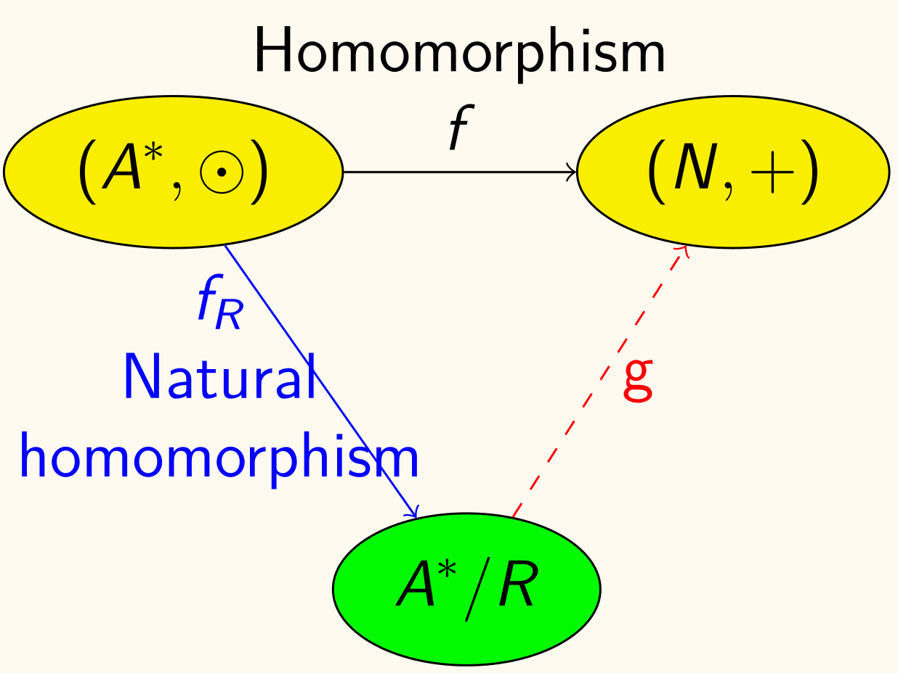

## 运算

!!! info ""
    函数 $f\colon A^n \to B$ 称为（从 $A$ 到 $B$ 的）**$n$ 元运算**。

!!! info ""
    对运算 $f\colon A^n \to B$，若 $B \subseteq A$，则称该运算**在集合 $A$ 上封闭**（$f$ is closed on $A$, or $A$ is closed with respect to $f$）。

## 代数系统

!!! info ""
    给定非空集合 $S$，以及一个或若干个运算 $\circ, *, \cdots$[^bi]，且给定的所有运算在 $S$ 上封闭，则称 $\left\langle S, \circ, *, \cdots\right\rangle$ 为**代数系统**。

    [^bi]: 以下主要讨论一个二元运算 $\circ$ 的情况。即 $\left\langle S, \circ \right\rangle$ 

!!! info 结合性（Associativity）
    集合 $A$ 上的运算 $\circ$ 具有**结合性**定义为

    $$
    \forall a, b, c \in A,\,  (a \circ b) \circ c = a \circ (b \circ c)
    $$

!!! info 分配性（Distributivity）
    集合 $A$ 上的运算 $\circ$ 和 $*$ 具有**分配性**定义为

    $$
    \forall a, b, c \in A,\,  a \circ (b * c) = (a \circ b) * (a \circ c)
    $$

!!! info 单位元（identity element）
    $e$ 是代数系统 $\left\langle S, \circ \right\rangle$ **单位元**当且仅当

    $$
    \forall x \in S, e \circ x = x \circ e = x
    $$
    
    单位元可记为 $\bm{1}_S$ 或 $\bm{1}$（幺元）。

    <u>代数系统不一定有单位元</u>。

!!! info 左（右）单位元
    $e_L$ 称为代数系统 $\left\langle S, \circ \right\rangle$ 的**左单位元**（左幺）当且仅当

    $$
    \forall x \in S, e_L \circ x = x
    $$
    
    同理，$e_R$ 称为代数系统 $\left\langle S, \circ \right\rangle$ 的**右单位元**（右幺）当且仅当

    $$
    \forall x \in S, x \circ e_R = x
    $$

- 左右单位元不一定存在
- 左右单位元不一定唯一
- 若代数系统同时有左右单位元，则左右单位元相等且唯一，即系统的单位元
- 即单位元若存在，则必唯一

!!! info 逆元（inverse element）
    仅对存在单位元的代数系统讨论。

    给定系统 $S$ 中元素 $x$，若存在 $S$ 中元素 $x'$ 使得

    $$
    x' \circ x = \bm{1}_S
    $$
    
    则称 $x'$ 是 $x$ 的**左逆元**。

    同理若存在 $S$ 中元素 $x''$ 使得

    $$
    x \circ x'' = \bm{1}_S
    $$
    
    则称 $x''$ 是 $x$ 的**右逆元**。

    若存在 $x^{-1}$ 既是 $x$ 的左逆元又是右逆元，则称 $x^{-1}$ 是 $x$ 的**逆元**。

若代数系统 $\left\langle S, \circ \right\rangle$ 具有结合性：
- 若给定元素既有左逆又有右逆，则二者相等且唯一。
    - 即 $\begin{aligned} x' &= x' \circ \bm{1}_S\\ &= x' \circ (x \circ x'')\\ &= (x' \circ x) \circ x''\\ &= \bm{1}_S \circ x''\\ &= x'' \end{aligned}$
- 若每个元素均有左逆，则左逆即为右逆，且逆元唯一
    - 任给 $a$ 中元素 $a$，设 $a$ 左逆是 $b$，$b$ 左逆是 $c$，则 $\begin{aligned} a \circ b &= (\bm{1}_S \circ a) \circ b\\ &= \bigl((c \circ b) \circ a\bigr) \circ b\\ &= \bigl(c \circ (b \circ a)\bigr) \circ b\\ &= (c \circ \bm{1}_S) \circ b\\ &= c \circ b\\ &= \bm{1}_S \end{aligned}$ 

!!! info 零元（zero element）
    元素 $t$ 是代数系统 $\left\langle S, \circ \right\rangle$ 的**零元**当且仅当

    $$
    \forall x \in S, t \circ x = x \circ t = t
    $$
    
    零元可记为 $\bm{0}_S$ 或 $\bm{0}$。

    <u>代数系统不一定有零元</u>。

令 $\left\langle A, * \right\rangle$ 为满足幂等律、交换律和结合律的代数系统，定义 $A$ 上偏序关系 $\preccurlyeq $ 为

$$
a \preccurlyeq b \iff a = a * b
$$

则 $(A, \preccurlyeq )$ 是一个偏序集，且 $a \wedge b = a * b$。

## 半群

!!! info 半群（Semigroup）
    若代数系统 $\left\langle S, \circ \right\rangle$ 具有结合性，则称其为**半群**。

结合律的推广：If $a_{1}, a_{2}, \cdots a_{n}, n \geq 3$, are arbitrary elements of a semigroup, then all products of the elements $a_{1}, a_{2}, \cdots a_{n}$ that can be formed by inserting meaningful parentheses arbitrarily are equal.[^translate]

[^translate]: 懒得抄译了，直接 Mathpix 走起。不过还是手动稍微调了一下样式。

Proof by induction: Let $\displaystyle \prod_{i=1}^{n} a_{i}=\left(\left(\cdots\left(a_{1} * a_{2}\right) * a_{3}\right) \cdots * a_{n-1}\right) * a_{n}$.

For any insertion of parentheses, let the last step is $u * v$.

By inductive hypothesis: $u=\displaystyle \prod_{i=1}^{m} a_{i}, v=\prod_{j=1}^{n-m} a_{m+j}\quad(m<n)$, then

$$
\begin{aligned}
    u * v &=\prod_{i=1}^{m} a_{i} * \prod_{j=1}^{n-m} a_{m+j}\\
    &= \left(\prod_{i=1}^{m} a_{i}\right) *\left(\prod_{j=1}^{n-m-1} a_{m+j} * a_{n}\right)\\
    &= \left(\prod_{i=1}^{m} a_{i} * \prod_{j=1}^{n-m-1} a_{m+j}\right) * a_{n}\\
    &= \left(\prod_{i=1}^{n-1} a_{i}\right) * a_{n}\\
    &= \prod_{i=1}^{n} a_{i} \end{aligned}
$$

!!! info ""
    类比根据乘法定义幂运算，可以为这里的「乘法」定义相应的「幂运算」。

    若运算 $\odot$ 具有结合性，则定义指数函数如下，对 $n \in \N^{+}$，有

    $$
    x^1 = x\\
    x^{n+1} = x^n \odot x
    $$

    若 $\odot$ 运算具有单位元，则定义 $x^0 = e$。

    - $x^{n+m} = x^n \odot x^m$
    - $(x^n)^m = x^{nm}$

!!! example ""
    设 $(A, *)$ 为半群，且 $\forall a, b \in A,\, a \ne b \to a * b \ne b * a$，则：
    1. $a * a = a$
    2. $a * b * a = a$
    3. $a * b * c = a * c$

    <!-- {{{证明 -->
    

    
证明

    1. 因为 $(a * a) * a = a * (a * a)$，由所给条件（逆否命题）可知 $a * a = a$。

    2. 由 $(a * b * a) * a = a * b * a = a * (a * b * a)$ 可得 $a * b * a = a$。

    3. 由 $(a * b * c) * (a * c) = a * b * c = (a * c) * (a * b * c)$ 可得 $a * b * c = a * c$。

    

    <!-- }}} -->

!!! example ""
    设 $(A, *)$ 为半群，且存在 $a \in A$，使得 $\forall x \in A,\; \exists u, v \in A,\, a * u = v * a = x$，证明 $A$ 有单位元。

    <!-- {{{证明 -->
    

    
证明

    既然 $a \in A$，则有 $u_A, v_A$ 使得 $a * u_A = v_A * a = a$。

    从而对任意 $x \in A$，有

    $$
    \begin{aligned}
        x * u_A &= (v_x * a) * u_A\\
        &= v_x * a\\
        &= x
    \end{aligned}
    $$

    同理 $v_A * x = x$。因此 $u_A = v_A = \bm{1}_A$

    

    <!-- }}} -->

!!! info 单元半群
    若半群 $(S, \circ)$ 存在单位元 $e$，则称其为**单元半群**（Monoid）。

!!! info 子半群
    设 $(S, \circ)$ 为半群，若 $T \subseteq S$ 且 $(T, \circ)$ 也是半群，则称 $(T, \circ)$ 为 $(S, \circ)$ 的**子半群**（Subsemigroup）。

!!! info 子单元半群
    设 $(S, \circ)$ 为单位元为 $e$ 的单元半群，若 $T$ 是 $S$ 的子半群且 $e \in T$，则称 $(T, \circ)$ 为 $(S, \circ)$ 的**子单元半群**（Submonoid）。

!!! example ""
    若 $(S, *)$ 与 $(T, *)$ 均为单位半群，且 $T$ 是 $S$ 的子半群，但这不意味着 $T$ 是 $S$ 的子单元半群。

    <!-- {{{反例 -->
    

    
反例

    设

    $$
    \left\lbrace \begin{bmatrix}
        a & 0 \\
        0 & d
    \end{bmatrix} \middle\vert a, d \in R \right\rbrace\\
    T = \left\lbrace \begin{bmatrix}
        a & 0 \\
        0 & 0
    \end{bmatrix} \middle\vert a \in R \right\rbrace
    $$

    并定义 $*$ 为矩阵乘法。

    则 $S$ 单位元为 $\begin{bmatrix}
        1 & 0 \\
        0 & 1
    \end{bmatrix}$，$T$ 单位元为 $\begin{bmatrix}
        1 & 0 \\
        0 & 0
    \end{bmatrix}$，且 $T$ 是 $S$ 的子半群，但不是子单元半群（因为 $T$ 不包含 $S$ 的单位元）。

    

    <!-- }}} -->

## 同态、同构

!!! info ""
    代数系统 $\left\langle S_1, \circ \right\rangle$ 与 $\left\langle S_2, * \right\rangle$ 同态（Homomorphism）当且仅当存在函数 $f\colon S_1 \to S_2$，满足

    $$
    \forall x, y \in S_1,\, f(x \circ y) = f(x) * f(y)
    $$

    记作 $S_1 \sim S_2$。其中函数 $f$ 称作**同态映射**。

    $S_2$ 是 $S_1$ 的**同态像**。

    特别地，若 $f$ 是满射，则称两系统**满同态**（Epimorphism）。

!!! info ""
    代数系统 $\left\langle S_1, \circ \right\rangle$ 与 $\left\langle S_2, * \right\rangle$ 同构（Isomorphism）当且仅当存在双射函数 $f\colon S_1 \to S_2$，满足

    $$
    \forall x, y \in S_1,\, f(x \circ y) = f(x) * f(y)
    $$

    记作 $S_1 \cong S_2$。其中双射函数 $f$ 称作**同构映射**。

!!! info ""
    若代数系统 $\left\langle S_1, \circ \right\rangle$ 与 $\left\langle S_2, * \right\rangle$ 同构，同构映射为 $f$，且 $e_1, e_2$ 分别为 $S_1, S_2$ 的单位元，则 $f(e_1) = e_2$。

    <!-- {{{证明 -->
    

    
证明

    仅证明一侧，因为另一侧同理。

    对任意 $x \in S_2$，有

    $$
    \begin{aligned}
        x * f(e_1) &= f\left(f^{-1}(x)\right) * f(e_1)\\
        &= f\left(f^{-1}(x) \circ e_1\right)\\
        &= f\left(f^{-1}(x)\right)\\
        &= x
    \end{aligned}
    $$

    因此 $f(e_1)$ 为 $S_2$ 单位元，即 $f(e_1) = e_2$。

    

    <!-- }}} -->

系统性质在同态像中的保持：设 $\left\langle S_1, \circ \right\rangle$ 和 $\left\langle S_2, \circ \right\rangle$ 为两个代数系统，$f\colon S_1 \to S_2$ 为一个满同态映射，则：
- 若 $S_1$ 有结合律，则 $S_2$ 也有结合律
- 若 $S_1$ 有单位元，则 $S_2$ 也有单位元

设 $f\colon S \to T$ 为半群 $(S, \odot)$ 到 $(T, *)$ 的同态映射。若 $S'$ 是 $(S, \odot)$ 的子半群，则 $f(S') = \left\lbrace t \in T \mid t = f(s), s \in S' \right\rbrace$ 为 $(T, *)$ 的子半群。

!!! info 半群乘积
    设 $(S, \odot)$ 和 $(T, *)$ 为两个半群，则 $(S \times T, \otimes)$ 也是一个半群，称为*这两个半群的乘积*，其中

    $$
    (s_1, t_1) \otimes (s_2, t_2) = (s_1 \odot s_2, t_1 * t_2)
    $$

    <!-- {{{证明 -->
    

    
证明

    显然 $(S \times T, \otimes)$ 是代数系统，且有

    $$
    \begin{aligned}
        \left((s_1, t_1) \otimes (s_2, t_2)\right) \otimes (s_3, t_3) &= (s_1 \odot s_2, t_1 * t_2) \otimes (s_3, t_3)\\
        &= (s_1 \odot s_2 \odot s_3, t_1 * t_2 * t_3)\\
        &= (s_1, t_1) \otimes (s_2 \odot s_3, t_2 * t_3)\\
        &= (s_1, t_1) \otimes \left((s_2, t_2) \otimes (s_3, t_3)\right)
    \end{aligned}
    $$

    

    <!-- }}} -->

!!! info 单位半群的乘积
    设 $(S, \odot)$ 和 $(T, *)$ 为单位元分别为 $e_S, e_T$ 的两个单位半群，则 $(S \times T, \otimes)$ 也是一个单位半群，称为*这两个单位半群的乘积*，$\otimes$ 定义同上，同时

    $$
    (e_S, e_T)
    $$

    为 $(S \times T, \otimes)$ 的单位元。

    <!-- {{{证明 -->
    

    
证明

    跟上面一样，仅证明一侧，因为另一侧同理。

    对任意 $(s, t) \in S \times T$，有

    $$
    \begin{aligned}
        (s, t) \otimes (e_S, e_T) &= (s \odot e_S, t * e_T)\\
        &= (s, t)
    \end{aligned}
    $$

    因此 $(e_S, e_T)$ 为 $(S \times T, \otimes)$ 的单位元。

    

    <!-- }}} -->

## 关系

!!! info 同余关系
    半群 $(S, *)$ 上的[等价关系](./11-binary-relation#等价关系) $R$ 是**同余关系**（Congruence）当且仅当

    $$
    a R a' \land b R b' \to (a * b) R (a' * b')
    $$

!!! info 商半群
    设 $(S, *)$ 为半群，$R$ 为 $S$ 上的同余关系，$S/R$ 为 $(S, *)$ 的[商集](./11-binary-relation#等价关系)。定义运算 $\otimes\colon S / R \times S / R \to S / R$ 为

    $$
    [a] \otimes [b] = [a * b]
    $$

    则 $(S/R, \otimes)$ 为半群，称为 $(S, *)$ 的**商半群**（Quotient Semigroup）。

!!! info 自然同态
    任何半群与其商半群满同态，称为**自然同态**（Natural Homomorphism）。

    <!-- {{{证明 -->
    

    
证明

    设 $(S / R, \otimes)$ 是半群 $(S, *)$ 相应的商半群，定义函数 $f_R\colon S \to S / R$ 为

    $$
    f_R(a) = [a]
    $$

    从而

    $$
    \begin{aligned}
        f_R(a * b) &= [a * b]\\
        &= [a] \otimes [b]\\
        &= f_R(a) \otimes f_R(b)
    \end{aligned}
    $$

    即 $f_R$ 为满同态映射。

    

    <!-- }}} -->

现在假设有两个半群 $(S, \odot)$ 和 $(T, *)$，同时 $(S / R, \otimes)$ 为 $(S, \odot)$ 的商半群（即有自然同态映射 $f_R\colon S \to S / R$），且有同态映射 $f\colon S \to T$。那么 $(S / R, \otimes)$ 与 $(T, *)$ 关系如何？

!!! info 基本同态定理
    设 $f\colon S \to T$ 为 $(S, \odot)$ 到 $(T, *)$ 的同态映射，$R$ 为 $S$ 上的同余关系，$S / R$ 为 $(S, \odot)$ 的商半群，$f_R\colon S \to S / R$ 为自然同态映射，则存在*同构映射* $g\colon S / R \to T$ 使得 $f = g \circ f_R$，且 $g$ 满足

    $$
    g([a]) = f(a)\qquad \forall a \in S
    $$

    > 似乎漏了条件。$R$ 定义为，$a R b$ 当且仅当 $f(a) = f(b)$。

    > 下图中 $A^{*}$ 即为 $S$，$N$ 即为 $T$，$+$ 即为 $*$。

    

    <!-- {{{证明 -->
    

    
证明

    显然 $g$ 是函数。（这下确实是显然了）

    同时 $g$ 是单射的，因为若 $f(a) = f(b)$，则 $a, b$ 在同一个等价类中，即 $[a] = [b]$。

    而且 $g$ 是满射的，因为对任意 $b \in T$，有 $a \in S$ 使得 $f(a) = b$（因为 $f$ 是满同态映射，满射），从而 $g([a]) = f(a) = b$。

    最后，则对任意 $[a], [b] \in S / R$，有

    $$
    \begin{aligned}
        g([a] \otimes [b]) &= g([a \odot b])\\
        &= f(a \odot b)\\
        &= f(a) * f(b)\\
        &= g([a]) * g([b])
    \end{aligned}
    $$

    因此 $g$ 为同构映射。

    

    <!-- }}} -->
