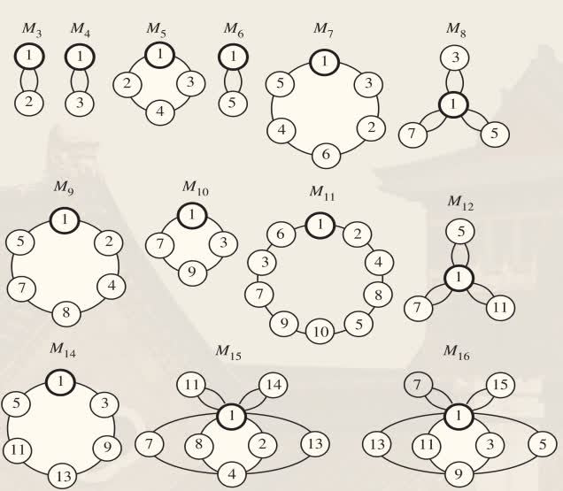
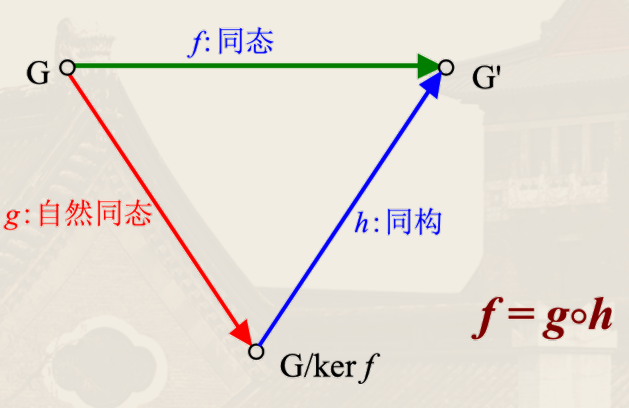

## 群

!!! info 群（group）
    $\left\langle G, * \right\rangle$ 为**群**当且仅当 $G$ 有单位元 $e$ 和一元运算 $^{-1}$ 满足：
    1. $G \ne \empty$
    2. $\forall x, y \in G,\, x * y \in G$（代数系统）
    3. $\forall x, y, z \in G,\, (x * y) * z = x * (y * z)$（半群）
    4. $\exists e \in G,\, \forall x \in G,\, e * x = x * e = x$（幺半群）
    5. $\forall x \in G,\, \exists x^{-1} \in G,\, x * x^{-1} = x^{-1} * x = e$（群）

    2.~5. 为<u>群公理</u>。

    等价表述为：设 $G$ 为非空集合，$*$ 为 $G$ 上的二元运算，若 $\left\langle G, * \right\rangle$ 为单元半群，且其单位元有

    $$
    \forall x \in G,\, \exists x^{-1} \in G,\, x * x^{-1} = x^{-1} * x = e
    $$

    则称 $\left\langle G, * \right\rangle$ 为**群**。

群性质：设 $\left\langle G, *, e, ^{-1} \right\rangle$ 为群：
1. $(a^{-1})^{-1} = a$
2. $(a * b)^{-1} = b^{-1} * a^{-1}$
3. $ab = ac \to b = c$（左消去律）
4. $ba = ca \to b = c$（右消去律）
5. $ax = b$ 和 $ya = b$ 在 $G$ 中对 $x, y$ 有唯一解（由消去律可推出）
    - 则有限群的运算表中每行（列）均为群中元素的一种排列，且无重复

元素的乘幂（次方）
- $a^0 = e$
- $a^{n+1} = a^{n} * a$（$n$ 为自然数）
- $a^{-n} = (a^{-1})^n$（$n$ 为正整数）

!!! info 元素的阶
    设 $\left\langle G, * \right\rangle$ 为群，$a \in G$，$a$ 的**阶**（周期）定义为

    $$
    |a| = \min \left\{ n \in \mathbb{N}^+ \mid a^n = e \right\}
    $$

    若这样的 $n$ 不存在，则称 $a$ 的阶为无穷，$a$ 为*无限阶元*。

- 有限群不存在无限阶元
- 群中元素及其逆元的阶相等
- 有限群中阶大于 $2$ 的元素个数为偶数
    - 阶大于 $2$ 的元素有 $a \ne a^{-1}$，因此 $a, a^{-1}$ 成对出现，必为偶数个
- *偶数群*中阶为 $2$ 的元素个数为奇数（$a = a^{-1}$）
    - 阶小于 $2$ 的元素有偶数个，而阶为 $1$ 的元素只有一个 $e$

!!! info 群的阶
    对群 $\left\langle G, * \right\rangle$：
    1. 若 $G$ 为有限集，则称 $G$ 为**有限群**，当 $|G| = n$ 时称 $\left\langle G, * \right\rangle$ 的**阶**为 $n$，$G$ 为 $n$ 阶群
    2. 若 $G$ 为无限集，则称 $G$ 为**无限群**

若群 $\left\langle G, * \right\rangle$ 满足交换律（即 $\forall x, y \in G,\, xy = yx$，则称 $\left\langle G, * \right\rangle$ 为**交换群**（**阿贝尔群**）。

- 一阶群同构意义下只有一个，$G = \left\lbrace e \right\rbrace$
- 二阶群也只有一个，$G = \left\lbrace e, a \right\rbrace$ 乘法表如下
  | $*$ | $e$ | $a$ |
  | :-: | :-: | :-: |
  | $e$ | $e$ | $a$ |
  | $a$ | $a$ | $e$ |
- 三阶群也只有一个，$G = \left\lbrace e, a, b \right\rbrace$ 乘法表如下
  | $*$ | $e$ | $a$ | $b$ |
  | :-: | :-: | :-: | :-: |
  | $e$ | $e$ | $a$ | $b$ |
  | $a$ | $a$ | $b$ | $e$ |
  | $b$ | $b$ | $e$ | $a$ |

!!! note ""
    四阶群为均阿贝尔群。

    四阶群元素阶为 $1$ 或 $2$ 或 $4$。

    <!-- {{{证明 -->
    

    
证明

    设 $G = \left\lbrace e, a, b, c \right\rbrace$，即证 $ab = ba$。

    反证法。若 $a b = e$，则 $b a = c$，则 $a b a = ac$，从而 $e a = a c$ 得到 $c = e$，矛盾！

    则 $a b = c$，从而 $b a = c$，得证。

    

    <!-- }}} -->

!!! note ""
    仅存在两种四阶群。

    存在元素阶为 $4$：$ G = \left\lbrace e, a, a^2, a^3 \right\rbrace$ 与 $\left\langle \Z_4, \oplus_4 \right\rangle$ 同构

    | $*$ | $e$ | $a$ | $b$ | $c$ |
    | :-: | :-: | :-: | :-: | :-: |
    | $e$ | $e$ | $a$ | $b$ | $c$ |
    | $a$ | $a$ | $b$ | $c$ | $e$ |
    | $b$ | $b$ | $c$ | $e$ | $a$ |
    | $c$ | $c$ | $e$ | $a$ | $b$ |

    元素阶均不为 $4$（Klein 四元群）：

    | $*$ | $e$ | $a$ | $b$ | $c$ |
    | :-: | :-: | :-: | :-: | :-: |
    | $e$ | $e$ | $a$ | $b$ | $c$ |
    | $a$ | $a$ | $e$ | $c$ | $b$ |
    | $b$ | $b$ | $c$ | $e$ | $a$ |
    | $c$ | $c$ | $b$ | $a$ | $e$ |

## 群方程

!!! note ""
    若代数系统 $(G, *)$ 为半群，且 $G$ 中方程 $a x = b$ 与 $y a = b$ 有唯一解，则 $(G, *)$ 为群。

    <!-- {{{证明 -->
    

    
证明

    下面的证明为了方便起见，根据结合律省略 $*$。后面可能会做类似的事情。

    先证明有左幺元 $e_l \in G$ 使得 $\forall a \in G, e_l a = a$。

    取定 $b \in G$，$x b = b$ 有唯一解，设为 $e_l$，对任何 $a \in G$，下证 $e_l a = a$。

    由 $b x = a$ 有解，设为 $c$，则

    $$
    \begin{aligned}
        e_l a &= e_l (b c)\\
        &= (e_l b) c\\
        &= b c\\
        &= a
    \end{aligned}
    $$

    即 $e_l$ 为左幺元。

    然后证明左逆元存在，即 $\forall a \in G, \exists a^{-1} \in G, a^{-1} a = e_l$。

    只需记 $a^{-1}$ 为 $y a = e_l$ 的唯一解即可。

    接着证明左逆元等于右逆元，即 $a a^{-1} = e_l$。

    因为 $a^{-1} \in G$，则 $y a^{-1} = e_l$ 有唯一解 $a'$，从而 $a' a^{-1} = e_l$，则

    $$
    \begin{aligned}
        a a^{-1} &= e_l (a a^{-1})\\
        &= (a' a^{-1}) (a a^{-1})\\
        &= a' (a^{-1} a) a^{-1}\\
        &= a' e_l a^{-1}\\
        &= a' a^{-1}\\
        &= e_l
    \end{aligned}
    $$

    最后证明左幺元等于右幺元，即 $\forall a \in G, a e_l = a$。

    $$
    \begin{aligned}
        a e_l &= a (a^{-1} a)\\
        &= (a a^{-1}) a\\
        &= e_l a\\
        &= a
    \end{aligned}
    $$

    因此 $(G, *)$ 为群。

    

    <!-- }}} -->

!!! note ""
    若 $(G, *)$ 为半群，存在左单位元，且每个元素都具有左逆元，则 $(G, *)$ 为群。

    <!-- {{{证明 -->
    

    
证明

    设 $e_l$ 为左单位元，对任意 $a \in G$，$a_l$ 为左逆元，即 $a_l a = e_l$。

    由于 $a_l \in G$，则也存在 $a^{-1} \in G$ 使得 $a^{-1} a_l = e_l$，则

    $$
    \begin{aligned}
        a a_l &= e_l (a a_l)\\
        &= (a^{-1} a_l) (a a_l)\\
        &= a^{-1} (a_l a) a_l\\
        &= a^{-1} e_l a_l\\
        &= a^{-1} a_l\\
        &= e_l
    \end{aligned}
    $$

    即左逆元等于右逆元，再证明 $e_l$ 为右单位元即可：任取 $a \in G$，有

    $$
    \begin{aligned}
        a e_l &= a (a_l a)\\
        &= (a a_l) a\\
        &= e_l a\\
        &= a
    \end{aligned}
    $$

    综上，$(G, *)$ 为群。

    

    <!-- }}} -->

!!! note ""
    设 $(G, *)$ 为*有限半群*，若 $(G, *)$ 满足消去律，则 $(G, *)$ 为群。

    即有限代数系统若同时满足结合律和消去律，则必为群。

    无限不一定，例如 $\left\langle \Z^{+}, * \right\rangle$ 满足结合律和消去律，但不是群。

    <!-- {{{证明 -->
    

    
证明

    设 $\left\lbrace a_1, \cdots, a_n \right\rbrace$，$\forall a, b \in G$，即证明 $a x = b$ 有唯一解。

    令 $a G = \left\lbrace a a_i \mid i = 1, \cdots, n \right\rbrace$。

    由左消去律，若 $a a_i = a a_{j}$，则 $i = j$，从而 $| a G| = n$，从而 $a G = G$。

    而 $b \in G$，故 $b \in a G$，即有 $a_i \in G$ 使得 $a a_i = b$，从而 $a x = b$ 有解。

    再通过左消去律，解唯一。

    同理可用右消去律证明 $y a = b$ 有唯一解，从而 $(G, *)$ 为群。

    

    <!-- }}} -->

- 原群（magma）：二元运算 + 封闭性
    - 半群（semigroup）：结合律
        - 单元半群（monoid）：有单位元
            - 群（group）：有逆元
                - 阿贝尔群（abelian group）：交换律

## 子群

### 定义

!!! info ""
    设 $\left\langle G, * \right\rangle$ 是群，$H$ 是 $G$ 的非空子集，若 $H$ 关于 $*$ 运算构成群，即 $\left\langle H, * \right\rangle$ 也是群，则 $H$ 是 $G$ 的**子群**，记作 $H \leq G$。

$\left\langle G, * \right\rangle$ 的平凡子群：
1. $\left\langle G, * \right\rangle$
2. $\left\langle \left\lbrace e \right\rbrace, * \right\rangle$

### 判定定理

!!! note 判定定理一
    设 $G$ 是群，$H$ 是 $G$ 的非空子集。则 $H$ 是 $G$ 的子群当且仅当：
    - $\forall a, b \in H,\, a b \in H$
    - $\forall a \in H, a^{-1} \in H$

    <!-- {{{证明 -->
    

    
证明

    必要性显然。

    充分性：因为逆元素的存在性和封闭性已给出，只需证明单位元素的存在性。

    取 $a \in H$，因为 $a^{-1} \in H$，故 $e = a a^{-1} \in H$

    

    <!-- }}} -->

!!! note 判定定理二
    设 $G$ 是群，$H$ 是 $G$ 的非空子集。则 $H$ 是 $G$ 的子群当且仅当：

    $$
    \forall a, b \in H,\, a b^{-1} \in H
    $$

    <!-- {{{证明 -->
    

    
证明

    必要性显然。

    充分性：
    - 单位元素：取 $a \in H$，有 $e = a a^{-1} \in H$
    - 逆元素：取 $a \in H$，因为有 $e \in H$，故 $a^{-1} = e a^{-1} \in H$
    - 封闭性：任取 $a, b \in H$，因为 $b^{-1} \in H$（由上一条），故 $a b = a (b^{-1})^{-1} \in H$

    

    <!-- }}} -->

!!! note 有限子群
    $G$ 是群，$H$ 是 $G$ 的*非空有限子集*。则 $H$ 是 $G$ 的子群当且仅当：

    $$
    \forall a, b \in H,\, a b \in H
    $$

    <!-- {{{证明 -->
    

    
证明

    必要性显然。

    充分性：封闭性已给出，只需证明逆元素和单位元素的存在性。

    若 $H$ 中仅含 $G$ 中单位元，显然 $H$ 是子群。

    否则任取 $H$ 中异于单位元的元素 $a$，考虑

    $$
    a^1, a^2 , \cdots
    $$

    由于 $H$ 有限，存在 $i < j$ 使得 $a^i = a^j$，因此有

    $$
    a^{-1} = a^{j - i - 1}
    $$

    因为有

    $$
    \begin{aligned}
        a^{j - i} a^i &= a^{j}\\
        &= a^{i}
    \end{aligned}
    $$

    故

    $$
    e = a^{j - i}
    $$

    即

    $$
    \begin{aligned}
        a a^{-1} &= a^{j - i}\\
        &= e
    \end{aligned}
    $$

    

    <!-- }}} -->

### 生成子群

!!! info ""
    设 $G$ 是群，$a \in G$，构造 $G$ 的子集 $H$ 为

    $$
    H = \left\lbrace a^{k} \mid k \in \Z \right\rbrace
    $$

    则 $H$ 是 $G$ 的子群，称 $H$ 是由 $a$ **生成**的子群，记作 $H = \left\langle a \right\rangle$。

## 阶

还记得群中元素的阶的定义：

!!! info 元素的阶
    设 $\left\langle G, * \right\rangle$ 为群，$a \in G$，$a$ 的**阶**（周期）定义为

    $$
    |a| = \min \left\{ n \in \mathbb{N}^+ \mid a^n = e \right\}
    $$

    若这样的 $n$ 不存在，则称 $a$ 的阶为无穷，$a$ 为*无限阶元*。

!!! note ""
    对群 $G$ 的*有限阶*元素 $a, b$ 有如下性质：
    1. 对任意 $k \in \Z^{+}$，$a^k = e$ 当且仅当 $|a|$ 整除 $k$。
    2. $|a| = \left\lvert a^{-1} \right\rvert$
    3. $|ab| = |ba|$
    4. $\left\lvert b^{-1}ab \right\rvert = |a|$

    <!-- {{{证明 -->
    

    
证明

    第一二个显然。

    第三个，$ab$ 阶有限，设 $|ab| = r$，则

    $$
    (ab)^{r+1} = a (ba)^r b = ab
    $$

    则 $(ba)^r = e$，则 $ba$ 阶有限，设为 $r'$，则 $r' \mid r$，同理 $r \mid r'$，故 $r = r'$。

    第四个，有

    $$
    \begin{aligned}
        \left\lvert b^{-1}ab \right\rvert &= \left\lvert b^{-1}(ab) \right\rvert\\
        &= \left\lvert (ab)b^{-1} \right\rvert\\
        &= \left\lvert a(bb^{-1}) \right\rvert\\
        &= \left\lvert a \right\rvert
    \end{aligned}
    $$

    

    <!-- }}} -->

## 中心

!!! info ""
    设 $G$ 为群，构造 $G$ 的子集 $C$ 为

    $$
    C = \left\lbrace a \in G \mid \forall x \in G,\, ax = xa \right\rbrace
    $$

    则 $C$ 是 $G$ 的子群，称 $C$ 为 $G$ 的**中心**。

    <!-- {{{证明 -->
    

    
证明

    $e \in C$，故 $C$ 非空。

    即证明任意 $a, b \in C$，有 $a b^{-1} \in C$，即

    $$
    a b^{-1} x = x a b^{-1}
    $$

    而

    $$
    \begin{aligned}
        a b^{-1} x &= a \left( x^{-1} b \right)^{-1}\\
        &= a \left( b x^{-1} \right)^{-1}\\
        &= a \left( x b^{-1} \right)\\
        &= (a x) b^{-1}\\
        &= x a b^{-1}
    \end{aligned}
    $$

    

    <!-- }}} -->

## 陪集

!!! info ""
    设 $G$ 是群，$H$ 是 $G$ 的子群，$a \in G$，定义

    $$
    aH = \left\lbrace ah \mid h \in H \right\rbrace
    $$

    为 $a$ 在 $H$ 上的**左陪集**。同理可定义 $Ha$ 为 $a$ 在 $H$ 上的**右陪集**。

!!! note ""
    设 $H$ 是 $G$ 的子群，则 $H$ 的所有左陪集构成 $G$ 的一个划分。

    <!-- {{{证明 -->
    

    
证明

    任取 $G$ 中一个元素 $a$，一定有 $a \in aH$（因为 $e \in H$）。

    然后证明

    $$
    \forall a, b \in G,\, \left((a H = b H) \lor (a H \cap b H = \empty)\right)
    $$

    设 $aH \cap bH \ne \empty$，即存在 $c \in aH \cap bH$，令 $c = ah_1 = bh_2$。

    则 $a = b(h_2h_1^{-1})$，从而 $aH \subseteq bH$。同理可证 $bH \subseteq aH$，故 $aH = bH$。

    

    <!-- }}} -->

$a, b$ 属于同一个左陪集当且仅当 $a \in bH \land b \in aH$ 或 $b^{-1} a \in H$。

!!! info 左陪集关系
    设 $H$ 是群 $G$ 的子群，定义 $G$ 上二元关系 $R$ 为：对任意 $a, b \in G,\, aRb \iff b^{-1} a \in H$

    则 $R$ 是 $G$ 上的等价关系，且 $[a]_R = aH$。

    <!-- {{{证明 -->
    

    
证明

    - 自反性：$\forall a \in G, a^{-1} a = e \in H$
    - 对称性：$a^{-1} b = (b^{-1} a)^{-1} \in H$（由自反性）
    - 传递性：$c^{-1} a = (c^{-1} b) (b^{-1} a) \in H$

    $$
    \begin{aligned}
        x \in [a]_R &\iff a R x\\
        &\iff x^{-1} a = h \in H\\
        &\iff x = a h^{-1} \in a H
    \end{aligned}
    $$

    

    <!-- }}} -->

## 拉格朗日定理

!!! note 陪集的势
    设 $\left\langle H, * \right\rangle \leq \left\langle G, * \right\rangle$，则

    $$
    H \approx a H \approx H a
    $$

    <!-- {{{证明 -->
    

    
证明

    设 $\sigma\colon H \to a H$ 为 $\sigma(h) = ah$，消去律有 $\sigma$ 为单射（$ah = bh \implies a = b$），同时 $\sigma$ 为满射，则 $\sigma$ 为双射，故 $H \approx a H$。

    

    <!-- }}} -->

!!! info ""
    对有限群 $G$，每个陪集元素个数有限且相同，且等于 $|H|$，即 $|G| = k |H|$，其中 $k$ 为左（右）陪集的个数，称为 $H$ 在 $G$ 中的**指数**，记为 $[G:H]$。

!!! info 拉格朗日定理
    设 $\left\langle G, * \right\rangle$ 为*有限群*，$\left\langle H, * \right\rangle \leq \left\langle G, * \right\rangle$，则

    $$
    |G| = |H| \cdot [G:H]
    $$

    <!-- {{{证明 -->
    

    
证明

    由 $G$ 有限，故 $[G:H]$ 有限，设为 $N$。

    从而有 $a_1, \cdots, a_N \in G$ 使得 $\left\lbrace a_i H \mid 1 \le  i \le N \right\rbrace$ 为 $G$ 的划分，即

    $$
    G = \bigcup_{i=1}^N Ha_i
    $$

    由陪集的势引理，对任意 $i, j$，有

    $$
    |H a_i| = |H a_{j}|
    $$

    则 $|G| = |H| \cdot N$，即

    $$
    |G| = |H| \cdot [G:H]
    $$

    

    <!-- }}} -->

!!! note 推论 1
    设 $\left\langle G, * \right\rangle$ 为有限群，$a \in G$，则 $|a|$ 为 $|G|$ 的因子。

    <!-- {{{证明 -->
    

    
证明

    显然有 $\left\langle \left\langle a \right\rangle, * \right\rangle \leq \left\langle G, * \right\rangle$，故 $\left\lvert \left\langle a \right\rangle \right\rvert$ 为 $|G|$ 的因子。

    而 $|a|$ 有限，故 $\left\lvert \left\langle a \right\rangle \right\rvert = |a|$，即 $|a|$ 为 $|G|$ 的因子。

    

    <!-- }}} -->

!!! note 推论 2
    设 $\left\langle G, * \right\rangle$ 为 $p$ 阶群，若 $p$ 为质数，则

    $$
    \exists a \in G, \left\langle a \right\rangle = G
    $$

    <!-- {{{证明 -->
    

    
证明

    取 $a \ne e, a \in G$，则 $\left\lvert \left\langle a \right\rangle \right\rvert$ 为 $|G|$ 的因子，且 $\left\lvert \left\langle a \right\rangle \right\rvert \ge 2$，故 $\left\lvert \left\langle a \right\rangle \right\rvert = p$，即 $G = \left\langle a \right\rangle$。

    

    <!-- }}} -->

!!! example ""
    证明 $6$ 阶群必含 $3$ 阶子群。

    <!-- {{{ 证明 -->
    

    
证明

    
    拉格朗日定理，$G$ 中元素阶只可能为 $1, 2, 3, 6$。若 $G$ 中有 $6$ 阶元素，则 $b = aa$ 是 $3$ 阶元素，即 $\left\langle b \right\rangle$ 为 $3$ 阶子群。
    
    若没有 $3, 6$ 阶元素，即 $\forall x \in G, x^2 = e$，则 $\forall  x, y \in G,\, x y = (yx)^2 (xy) = (yx) (yx xy) = yx$，即 $G$ 是交换群，因此 $\left\lbrace e, a, b, ab \right\rbrace$ 构成 $4$ 阶子群，但 $4 \nmid 6$，矛盾。
    
    故 $G$ 中必含 $3$ 阶元素 $a$ 使得 $\left\langle a \right\rangle$ 为 $3$ 阶子群。
    
    

    <!-- }}} -->

考虑模 $m$ 互素同余类 $\Z / m \Z$ 关于模 $m$ 乘法构成一个群，例如
- $\Z / 6 \Z = \left\lbrace 1, 5 \right\rbrace$
- $\Z / 8 \Z = \left\lbrace 1, 3, 5, 7 \right\rbrace$

从而 $\left\lvert \Z / m \Z \right\rvert = \varphi(m)$ 为 Euler's totient[^number-theory]

[^number-theory]: 见前面的笔记[自然数与数论初步](./06-natural-numbers-and-number-theory-preliminary#欧拉定理)

其构成一个群，封闭性、结合律、单位元 $1$ 显然。

对任意 $x$，其与 $m$ 互素，[裴蜀定理](./06-natural-numbers-and-number-theory-preliminary#裴蜀定理)有，存在整数 $r, s$ 使得 $xr + ms = 1$，即 $x r = 1 - ms$，从而 $xr \equiv 1 \pmod m$，从而 $r \bmod m$ 为 $x$ 的逆。

对任意有限群 $G$ 和其中任意元素 $x \in G$，有

$$
x^{|G|} = e
$$

代入上面的模 $m$ 互素同余群。上面的幂跟实际的幂不一样，上面的幂表示的运算 $*$ 是在「模 $m$ 同余」意义上的。为避免混淆，使用 $x^{*|G|}$ 替代。

从而有欧拉定理：若 $a, m$ 互素，则 $a \bmod m \in \left\langle m \right\rangle$，则 $(a \bmod m)^{* \varphi(m)} = 1$，即 $(a \bmod b)^{\varphi(m)} \bmod m = 1$，从而 $a^{\varphi(m)} \equiv 1 \pmod m$。

即欧拉定理是群论中拉格朗日定理的特殊情形。

## 循环群

!!! info ""
    $\left\langle G, * \right\rangle$ 为**循环群**（cyclic group）当且仅当

    $$
    \exists a \in G, G = \left\langle a \right\rangle
    $$

    $a$ 称为 $G$ 的**生成元**（generator）。

- **有限循环群**：若循环群生成元 $a$ 阶为 $n$，则 $G$ 为有限 $n$ 阶循环群，且 $G = \left\lbrace a^0, a^1, \cdots, a^{n-1} \right\rbrace$，其中 $a^0 = e$
- **无限循环群**：若循环群生成元 $a$ 为无限阶元，则 $G$ 为无限循环群，且 $G = \left\lbrace a^0, a^{\pm 1}, \cdots \right\rbrace$，其中 $a^0 = e$

!!! note ""
    若 $a$ 是无限循环群的生成元，则 $a^{-1}$ 也是该无限循环群的生成元。

    <!-- {{{证明 -->
    

    
证明

    设群 $G = \left\langle a \right\rangle = \left\lbrace a^{k} \mid a \in G, k \in \Z \right\rbrace$，则 $a^{k} = (a^{-1})^{-k}$，即 $G = \left\lbrace (a^{-1})^{k} \mid k \in \Z \right\rbrace$，故 $G = \left\langle a^{-1} \right\rangle$。

    

    <!-- }}} -->

!!! note ""
    无限循环群有且仅有两个生成元。

    <!-- {{{证明 -->
    

    
证明

    设 $G = \left\langle a \right\rangle$，若 $b$ 也为 $G$ 生成元，则 $\exists m, t \in \Z,\, a^m = b \land b^t = a$，故 $a = b^t = (a^m)^t = a^{mt}$，消去律有 $a^{mt - 1} = e$。

    因为 $a$ 为无限阶元，故 $mt = 1$，从而 $m = t = 1$ 或 $m = t = -1$，即 $b = a$ 或 $b = a^{-1}$。

    

    <!-- }}} -->

!!! info ""
    设有限群 $G = \left\langle a \right\rangle$，且 $|a| = n$，则对任意不大于 $n$ 的正整数 $r$，有

    $$
    G = \left\langle a^r \right\rangle \iff \gcd(n, r) = 1
    $$

    <!-- {{{证明 -->
    

    
证明

    $\impliedby$：设 $\gcd(n, r) = 1$，则由裴蜀定理有 $\exists u, v \in \Z, ur + vn = 1$，从而

    $$
    \begin{aligned}
        a &= a^{ur + vn} \\
        &= a^{ur} a^{vn} \\
        &= (a^r)^u
    \end{aligned}
    $$

    故 $G$ 中任意元素 $a^{k}$ 可表示为 $(a^r)^{uk}$ 的形式，即 $G = \left\langle a^r \right\rangle$。

    $\implies$：设 $a^r$ 是 $G$ 生成元，令 $\gcd(n, r) = d$，且 $r = dt$，则

    $$
    \begin{aligned}
        (a^n)^t &= (a^n)^{\frac{r}{d}}\\
        &= (a^r)^{\frac{n}{d}}\\
        &= e
    \end{aligned}
    $$

    故 $|a^r|$ 整除 $\dfrac{n}{d}$，但 $|a^r| = n$，故 $n \mid \dfrac{n}{d}$，则 $d = 1$，即 $\gcd(n, r) = 1$。

    

    <!-- }}} -->

即 $n$ 阶循环群 $G$ 生成元个数为不大于 $n$ 且与 $n$ 互质的正整数个数，即 $\varphi(n)$。

!!! info ""
    令 $a$ 为群 $G$ 的一个 $n$ 阶元素，$k$ 为正整数，有

    $$
    \left\langle a^{k} \right\rangle = \left\langle a^{\gcd(n, k)} \right\rangle
    $$
    
    及

    $$
    \left\lvert a^{k} \right\rvert = \dfrac{n}{\gcd(n, k)}
    $$
    
    <!-- {{{证明 -->
    

    
证明

    
    注意到 $\gcd(n, k) \mid k$，则有 $a^{k} \in \left\langle a^{\gcd(n, k)} \right\rangle$。

    又有裴蜀定理，$\exists s, t \in \Z,\, sn + tk = \gcd(n, k)$，则有

    $$
    \begin{aligned}
    a^{\gcd(n, k)} &= a^{sn + tk} \\
    &= a^{sn} a^{tk} \\
    &= \left( a^{k} \right)^t\\ 
    &\in \left\langle a^{k} \right\rangle
    \end{aligned}
    $$
    
    同时注意到

    $$
    \begin{aligned}
        \left( a^{k} \right)^{\frac{n}{\gcd(n, k)}} &= \left( a^{n} \right)^{\frac{k}{\gcd(n, k)}}\\ 
        &= e
    \end{aligned}
    $$
    
    于是 $\left\lvert a^{k} \right\rvert$ 整除 $\dfrac{n}{\gcd(n, k)}$。

    又 $\left\langle a^{k} \right\rangle = \left\langle a^{\gcd(n, k)} \right\rangle$，则 $\left\lvert a^{k} \right\rvert = \left\lvert a^{\gcd(n, k)} \right\rvert$，而 $\left\lvert a^{\gcd(n, k)} \right\rvert \ge \dfrac{n}{\gcd(n, k)}$（否则若 $\left\lvert a^{\gcd(n, k)} \right\rvert < \dfrac{n}{\gcd(n, k)}$，则 $\left\lvert \left( a^{\gcd(n, k)} \right)^{\left\lvert a^{\gcd(n, k)} \right\rvert} \right\rvert <^{*} \left\lvert a^n \right\rvert = 1$，矛盾！[^tips]），因此 $\left\lvert a^{k} \right\rvert = \dfrac{n}{\gcd(n, k)}$。

    [^tips]: 这里的 $<^{*}$ 并不是数值意义上的「小于」，而是指 $a^{\gcd(n, k)}$ 在 $a, \cdots, a^n$ 之间，同时 $\left( a^{\gcd(n, k)} \right)^{\left\lvert a^{\gcd(n, k)} \right\rvert}$ 在 $a^{\gcd(n, k)}$ 之后，但未到 $a^n$ 之前，因此与之为 $e$ 矛盾。
    
    

    <!-- }}} -->

!!! note 推论 1
    令 $|a| = n$，则
    - $\left\langle a^i \right\rangle = \left\langle a^{j} \right\rangle$ 当且仅当 $\gcd(n, i) = \gcd(n, j)$；
    - $\left\lvert a^i \right\rvert = \left\lvert a^{j} \right\rvert$ 当且仅当 $\gcd(n, i) = \gcd(n, j)$。

!!! note 推论 2
    令 $|a| = n$，则
    - $\left\langle a \right\rangle = \left\langle a^i \right\rangle$ 当且仅当 $\gcd(n, i) = 1$；
    - $\left\lvert a \right\rvert = \left\lvert a^i \right\rvert$ 当且仅当 $\gcd(n, i) = 1$。

!!! example ""
    设 $G = \left\langle a \right\rangle$ 为循环群，证明
    1. $G$ 的任意子群 $H$ 仍为循环群
    2. 若 $a$ 为无限阶元，则 $G$ 的非平凡子群 $H$ 均为无限循环群

    <!-- {{{解答 -->
    

    
解答

    1. 令 $\left\langle H, * \right\rangle \leq \left\langle G, * \right\rangle$，从而 $H \subseteq \left\langle a \right\rangle$。

    若 $H = \left\lbrace e \right\rbrace$，显然成立。

    否则取 $a^m$ 为 $H$ 中最小正方幂元，下证 $H = \left\langle a^m \right\rangle$。

    只需证明 $H \subseteq \left\langle a^m \right\rangle$。任取 $h \in H \subseteq \left\langle a \right\rangle$，故 $h = a^n$。

    令 $n = qm + r$，其中 $0 \le r < m$，从而 $h = a^n = a^{qm+r} = (a^m)^qa^r$，即 $a^r = h(a^m)^{-q}$，由 $m$ 最小性得 $r = 0$（否则由 $0 < r < m$ 有 $a^r$ 才是 $H$ 中最小正方幂元），故 $h = (a^m)^q$，即 $h \in \left\langle a^m \right\rangle$，因此 $H$ 为循环群。

    2. 设 $H \leq G$，由 1. 知 $H = \left\langle a^m \right\rangle$，若 $H \ne \left\lbrace e \right\rbrace$，则 $m \ne 0$，从而若 $H$ 有限，则 $|a^m|$ 有限，与 $a$ 为无限阶元矛盾，故 $H$ 为无限循环群。

    

    <!-- }}} -->

!!! info ""
    对 $n$ 每个因子 $d$，$n$ 阶循环群 $G$ 中恰有一个 $d$ 阶子群，且其中该子群的生成元的个数为 $\varphi(d)$。

    <!-- {{{证明 -->
    

    
证明

    令 $H = \left\langle a^{\frac{n}{d}} \right\rangle$，显然 $H$ 为 $G$ 的 $d$ 阶子群。

    若令 $H_1 = \left\langle a^m \right\rangle$ 也为 $d$ 阶子群，则 $(a^m)^d = a^{md} = e$，即 $n \mid md$，即 $\dfrac{n}{d} \mid m$，因此 $a^m = \left(a^{\frac{n}{d}}\right)^{k} \in H$，即 $H_1 \subseteq H$，又 $H_1 \approx H$，故 $H_1 = H$。

    子群为 $d$ 阶循环群，因此该子群的生成元个数为 $\varphi(d)$。

    

    <!-- }}} -->

因此由这个结论有

$$
n = \sum_{d \mid n} \varphi(d)
$$

### 群的直积

!!! info ""
    给定两个群 $\left\langle S, \circ  \right\rangle, \left\langle T, * \right\rangle$，定义 $S \times T$ 上运算 $\otimes$ 为

    $$
    (s_1, t_1) \otimes (s_2, t_2) = (s_1 \circ s_2, t_1 * t_2)
    $$

    从而有 $\left\langle S \times T, \otimes \right\rangle$ 为群，称为群 $\left\langle S, \circ  \right\rangle, \left\langle T, * \right\rangle$ 的**直积**。

    <!-- {{{证明 -->
    

    
证明

    1. 结合律：$\left( (r_1 \circ s_1) \circ t_1, (r_2 * s_2) * t_2 \right) = (r_1 \circ s_1, r_2 * s_2) \otimes (t_1, t_2)$
    2. 单位元：$(e_S, e_T)$
    3. 逆元：$(s, t)^{-1} = (s^{-1}, t^{-1})$

    

    <!-- }}} -->

!!! note ""
    $C_k$ 表示 $k$ 阶循环群，则 $C_m \times C_n$ 为 $mn$ 阶循环群当且仅当 $m, n$ 互质。（即 $C_m \times C_n \cong C_{mn} \iff \gcd(m, n) = 1$）

    <!-- {{{证明 -->
    

    
证明

    $\impliedby$：设 $\gcd(m, n) = 1$，只需证明 $C_m \times  C_n$ 中含有阶为 $mn$ 的元素（因为 $C_m \times C_n$ 有 $mn$ 个元素，只要证明存在阶为 $mn$ 的元素，就能说明 $C_m \times C_n$ 是 $mn$ 阶循环群了）。

    设 $a, b$ 分别为 $C_m, C_n$ 的生成元，则 $(a, b)^{mn} = e$。

    若 $(a, b)^{k} = e$，则 $k$ 为 $m, n$ 公倍数，又 $m, n$ 互质，故 $k$ 为 $mn$ 的倍数，即 $(a, b)$ 为 $mn$ 阶元素。

    $\implies$：若 $C_m \times C_n$ 是 $mn$ 阶循环群，则 $C_m \times  C_n$ 是循环群，生成元为 $(s, t)$，且其阶为 $mn$。

    若 $\gcd(m, n) = k > 1$，则 $(s, t)^{\frac{mn}{k}} = e$（因 $s^m = e_1, t^n = e_2$），与 $(s, t)$ 阶是 $mn$ 矛盾（$\dfrac{mn}{k} < mn$），故 $\gcd(m, n) = 1$。

    

    <!-- }}} -->

则有若 $m, n$ 互质，则 $\varphi(mn) = \varphi(m)\varphi(n)$。

## 置换群

!!! info ""
    设 $S = \left\lbrace 1, 2, \cdots, n \right\rbrace$，$S$ 上的任何双射函数 $\sigma\colon S \to S$ 称为 $S$ 上的 **$n$ 元置换**。

    $$
    \sigma = \begin{bmatrix}
        1 & 2 & \cdots & n \\
        \sigma(1) & \sigma(2) & \cdots & \sigma(n)
    \end{bmatrix}
    $$

    置换的**乘积**定义为置换的复合。

!!! info ""
    设 $\sigma$ 是 $S = \left\lbrace 1, 2, \cdots, n \right\rbrace$ 上的 $n$ 元置换，若

    $$
    \sigma(i_1) = i_2, \sigma(i_2) = i_3, \cdots, \sigma(i_{k-1}) = i_k, \sigma(i_k) = i_1
    $$

    且保持 $S$ 中其它元素不变，则称 $\sigma$ 为 $S$ 上的 **$k$ 阶轮换**，记作 $(i_1i_2\cdots i_{k})$。

    若 $k = 2$，则称 $\sigma$ 为 $S$ 上的**对换**。

!!! note ""
    任何 $n$ 元置换可以*唯一*地表示为不相交的轮换的乘积。

例如

$$
\sigma = \begin{bmatrix}
    1 & 2 & 3 & 4 & 5 & 6 & 7 & 8 \\
    5 & 3 & 6 & 4 & 2 & 1 & 8 & 7
\end{bmatrix}
$$

可表示为

$$
\sigma = (15236)(4)(78)
$$

通常省略 $1$ 阶轮换，即上式可简写为 $(15236)(78)$。

但对于恒等轮换，得保留 $(1)$，即 $(1)(2)\cdots(n)$ 写作 $(1)$。

!!! note ""
    轮换可以进一步分解为对换。

    设 $S = \left\lbrace 1, 2, \cdots, n \right\rbrace$，$\sigma$ 是 $S$ 上的 $k$ 阶轮换，则 $\sigma$ 可表示为对换的乘积，且

    $$
    (i_1i_2\cdots i_{k}) = (i_1 i_2)(i_1 i_3)\cdots(i_1 i_{k})
    $$

    但表示方法不唯一。

上面的可以进一步表示为

$$
(15236)(78) = (15)(12)(13)(16)(78)
$$

置换的对换表示不唯一，例如 $\sigma = \begin{bmatrix} 1 & 2 & 3 & 4 \\ 2 & 3 & 1 & 4 \end{bmatrix}$ 可表示为 $(12)(13)$ 或 $(14)(24)(34)(14)$。

但是其*奇偶性*保持恒定。

!!! info ""
    若 $n$ 元置换 $\sigma$ 可表示为奇数个对换之积，则称 $\sigma$ 为**奇置换**，否则称 $\sigma$ 为**偶置换**。

    奇置换和偶置换各有 $\dfrac{n!}{2}$ 个。

!!! note ""
    $n$ 元集合上所有置换的集合 $S_n$ 关于置换乘法构成群，称为 **$n$ 元对称群**。

    $S_n$ 的任何一个子群称为**置换群**。

    所有 $n$ 元偶置换的集合 $A_n$ 是 $S_n$ 的一个子群，称为 **$n$ 元交错群**。

## 群同构与同构映射

!!! info ""
    群 $\left\langle G_1, \circ  \right\rangle, \left\langle G_2, * \right\rangle$ 同构（$G_1 \cong G_2$）当且仅当存在双射函数 $f\colon G_1 \to G_2$ 使得

    $$
    \forall x, y \in G_1, f(x \circ y) = f(x) * f(y)
    $$

群同构关系是等价关系。

四元循环群

| $*$ | $1$ | $2$ | $3$ | $4$ |
| :-: | :-: | :-: | :-: | :-: |
| $1$ | $1$ | $2$ | $3$ | $4$ |
| $2$ | $2$ | $3$ | $4$ | $1$ |
| $3$ | $3$ | $4$ | $1$ | $2$ |
| $4$ | $4$ | $1$ | $2$ | $3$ |

$C_4 \cong Z_4$

Klein 四元群

| $*$ | $1$ | $2$ | $3$ | $4$ |
| :-: | :-: | :-: | :-: | :-: |
| $1$ | $1$ | $2$ | $3$ | $4$ |
| $2$ | $2$ | $1$ | $4$ | $3$ |
| $3$ | $3$ | $4$ | $1$ | $2$ |
| $4$ | $4$ | $3$ | $2$ | $1$ |

$V_4 \cong Z_2 \times Z_2$

!!! note ""
    设 $f$ 是从群 $\left\langle G, * \right\rangle$ 到群 $\left\langle H, \circ  \right\rangle$ 的同态映射，则
    1. $f(e_G) = e_H$
    2. $\forall a \in G, f(a^{-1}) = \left(f(a)\right)^{-1}$

!!! example ""
    $1, 2, \cdots, 1000$ 这 $1000$ 个正整数按任意组合加减，能否得到 $1001$？

    <!-- {{{解答 -->
    

    
解答

    定义系统「奇偶加群」$\left\langle \left\lbrace e, o \right\rbrace, * \right\rangle$，运算表为

    | $*$ | $e$ | $o$ |
    | :-: | :-: | :-: |
    | $e$ | $e$ | $o$ |
    | $o$ | $o$ | $e$ |

    则 $f\colon \Z \to \left\lbrace e, o \right\rbrace$

    $$
    \left\lbrace\begin{aligned}
        f(x) = \begin{cases}
            e, & x \text{ 为偶数} \\
            o, & x \text{ 为奇数}
        \end{cases}
    \end{aligned}\right.
    $$

    即 $f$ 是从 $\left\langle \Z, + \right\rangle$ 到「奇偶加群」的满同态映射。

    blablabla

    

    <!-- }}} -->

!!! note ""
    设 $\left\langle G, * \right\rangle$ 为无限循环群，则 $\left\langle G, * \right\rangle \cong \left\langle \Z, + \right\rangle$。

    <!-- {{{证明 -->
    

    
证明

    设 $G$ 生成元为 $a$，则 $|a| = \infty $。

    令 $f\colon \Z \to G$ 为 $f(n) = a^n$。

    因为

    $$
    \begin{aligned}
        f(m + n) &= a^{m + n} \\
        &= a^m * a^n \\
        &= f(m) f(n)
    \end{aligned}
    $$

    则 $f$ 为同态映射。

    又因为

    $$
    \begin{aligned}
        f(n) = f(m) &\implies a^n = a^m \\
        &\implies a^{n - m} = e \\
        &\implies n = m
    \end{aligned}
    $$

    则 $f$ 为单射。显然 $f$ 还为满射，故 $f$ 为同构映射，即 $\left\langle G, * \right\rangle \cong \left\langle \Z, + \right\rangle$。

    

    <!-- }}} -->

!!! note ""
    设 $\left\langle G, * \right\rangle$ 为 $n$ 阶循环群，则 $\left\langle G, * \right\rangle \cong \left\langle \Z_n, \oplus_n \right\rangle$（$\oplus_n$ 表示模 $n$ 加法）。

    <!-- {{{证明 -->
    

    
证明

    设 $G$ 生成元为 $a$，则 $|a| = n$，$G = \left\lbrace a_0, a_1, \cdots, a^{n-1} \right\rbrace$。

    令 $f\colon \Z_n \to G$ 为 $f(k) = a^k\quad (k = 0, 1, \cdots, n-1)$。

    因为

    $$
    \begin{aligned}
        f(i \oplus_n j) &= a^{i \oplus_n j} \\
        &= a^{i + j + kn}\\
        &= a^{i + j}\\
        &= f(i) * f(j)
    \end{aligned}
    $$

    故 $f$ 为同态映射。

    又因为

    $$
    \begin{aligned}
        f(i) = f(j) &\implies a^i = a^j\\
        &\implies a^{i - j} = e\\
        &\implies n \mid (i - j)\\
        &\implies i \equiv j \pmod{n}\\
        &\implies i = j
    \end{aligned}
    $$

    故 $f$ 为单射。显然 $f$ 为满射，故 $f$ 为同构映射，即 $\left\langle G, * \right\rangle \cong \left\langle \Z_n, \oplus_n \right\rangle$。

    

    <!-- }}} -->

!!! note ""
    循环群皆为阿贝尔群。

## 正规子群

!!! info ""
    群 $G$ 的子群 $H$ 是 $G$ 的**正规子群**，当且仅当 $\forall a \in G, H a = a H$，记作 $H \trianglelefteq G$。

显然平凡子群 $\left\langle G, \circ  \right\rangle, \left\langle \left\lbrace e \right\rbrace, \circ  \right\rangle$ 都是正规子群。

!!! note ""
    阿贝尔群的任何子群都是正规子群。

$Ha = aH$ 充要条件是

$$
\forall h_i \in H, a \in G,\, \exists h_{j} \in H,\,  h_i a = a h_{j}
$$

而非 $\forall h_i \in H, a \in G,\, h_i a = a h_i$。

!!! note ""
    群的中心 $C$ 是群 $G$ 的正规子群。即 $C \trianglelefteq G$。

    [中心](#中心)是什么？

!!! note 正规子群的判定
    设 $N$ 是群 $G$ 的子群，$N$ 是群 $G$ 的正规子群当且仅当

    $$
    \forall g \in G, n \in N,\, gng^{-1} \in N
    $$

    <!-- {{{证明 -->
    

    
证明

    必要性：任取 $g \in G, n \in N$，有 $n_1 \in N$ 使得 $gn = n_1g$，因此 $gng^{-1} = n_1 \in N$。

    充分性：先证明 $gN \subseteq Ng$。任取 $gn \in gN$，已知 $gng^{-1} \in N$，可令 $gng^{-1} = n_1$，则 $gn = n_1g \in N_g$。类似可证明 $Ng \subseteq gN$，故 $gN = Ng$，即 $N \trianglelefteq G$。

    

    <!-- }}} -->

即设 $N$ 是群 $G$ 的子群，$N$ 是群 $G$ 的正规子群当且仅当

$$
\forall g \in G, gNg^{-1} = N
$$

!!! note ""
    设 $N$ 是群 $G$ 的子群，若 $G$ 的其它子群都不与 $N$ 等势，则 $N$ 是 $G$ 的正规子群。

    <!-- {{{证明 -->
    

    
证明

    只需证明 $gNg^{-1} = N$。

    先证明 $gNg^{-1}$ 是个群，从而可得 $gNg^{-1}$ 是 $G$ 的子群：
    - 封闭性：$(gn_1g^{-1})(gn_2g^{-1}) = gng^{-1}$
    - $ab^{-1}$：$(gn_1g^{-1})\left(gn_2g^{-1}\right)^{-1} = (gn_1g^{-1})(gn_2^{-1}g^{-1}) = gng^{-1}$

    因为其它子群都不与 $N$ 等势，故只需证明 $gNg^{-1} \approx N$。

    注意到消去律，只需证明 $gN \approx Ng$。而这个在上面就已经证明过了，因而得证。

    

    <!-- }}} -->

!!! note ""
    设 $N$ 是群 $G$ 的子群，若 $[G : N] = 2$，则 $N$ 是 $G$ 的正规子群。

    <!-- {{{ 证明 -->
    

    
证明

    
    $[G : N] = 2$ 说明 $G$ 可以划分为两个互不相交的陪集。

    为证明 $N$ 是 $G$ 的正规子群，只需证明 $\forall g \in G, n \in N, gng^{-1} \in N$ 即可。

    若 $g \in N$，则显然有 $\forall n \in N, gng^{-1} \in N$。

    若 $g \notin N$，则 $G = N \cup gN$，且 $N \cap gN = \empty$。

    考虑 $G$ 的子群 $gNg^{-1}$，可知有且仅有 $gNg^{-1} = N$ 或 $gNg^{-1} = gN$。

    若 $gNg^{-1} = N$，则 $\forall n \in N, gng^{-1} \in N$，得证。

    若 $gNg^{-1} = gN$，则 $\forall n \in N, gng^{-1} \in gN$，即 $\exists n' \in N, gng^{-1} = gn'$，从而 $ng^{-1} = n' \in N$。

    或者简单来看，显然有 $e \in N$，而 $g e g^{-1} = e \notin gN$，故不成立。

    故 $g^{-1} \in N$，得 $g \in N$，矛盾！因此只能有 $gNg^{-1} = N$，得证。
    
    

    <!-- }}} -->

设 $N \trianglelefteq G$，可以证明若 $ap^{-1}, bq^{-1} \in N$，则

$$
(ab)(pd)^{-1} \in N
$$

即群 $G$ 中运算可以提升到陪集上，定义

$$
H a * H b = H(ab)
$$

于是<u>正规子群的陪集关系是同余关系</u>。

从而有

!!! note ""
    若 $N \trianglelefteq G$，则 $\left\langle G / N, * \right\rangle$ 是一个群，称为**商群**。

    <!-- {{{证明 -->
    

    
证明

    - 封闭性：由 $*$ 的定义保证了封闭性
    - 结合律：$G$ 运算满足结合律
    - 单位元：$N$（即 $N e$）
    - 逆元：$N a$ 逆元为 $N a^{-1}$

    

    <!-- }}} -->

!!! note ""
    任何群 $G$ 与其商群 $G / N$ 满同态，称为**自然同态**。

    <!-- {{{证明 -->
    

    
证明

    $G / N$ 是由 $N$ 确定的商群，其元素为 $N$ 的陪集。

    定义 $g\colon G \to G / N$，对任意 $a \in G, g(a) = Na$。

    显然 $g$ 是满射，且任意 $a, b \in G$ 有

    $$
    \begin{aligned}
        g(ab) &= N(ab)\\
        &= Na * Nb
        &= g(a) * g(b)
    \end{aligned}
    $$

    即 $g$ 是满同态映射。

    

    <!-- }}} -->

!!! info 同态核
    假设群 $G_1, G_2$ 是群，$f\colon G_1 \to G_2$ 是同态映射，定义集合

    $$
    \ker f = \left\lbrace x \mid x \in G_1 \land f(x) = e_2 \right\rbrace
    $$

    称为**同态核**。

!!! note ""
    同态核是正规子群。即 $\ker f \trianglelefteq G_1$。

    <!-- {{{证明 -->
    

    
证明

    - 非空：$e_1 \in \ker f$
    - 子群：任取 $a, b \in \ker f$，则 $f(a) = f(b )= e_2$，则 $f(ab^{-1}) = f(a) * \left(f(b)\right)^{-1} = e_2$
    - 正规子群：任取 $a \in \ker f, x \in G_1$，则 $f(a) = e_2$，因此 $f(xax^{-1}) = f(x) * f(a) * \left(f(x)\right)^{-1} = e_2$，即 $gag^{-1} \in \ker f$。

    

    <!-- }}} -->

!!! note 同态基本定理
    设 $G, G'$ 是群，$f\colon G \to G'$ 是满同态映射，则 $G / \ker f \cong G'$。

    

