## 图的定义

!!! info ""
    图 $G$ 是一个三元组 $G = (V, E, \varphi)$，其中
    - $V$ 是非空顶点集
    - $E$ 是边集
    - $V \cap E = \empty$
    - $\varphi\colon E \to \mathcal{P}(V)$，且 $\forall e \in E, 1 \le |\varphi(e)| \le 2$，$\varphi(e)$ 是边 $e$ 的*端点集*。

    常省略 $\varphi$，简记为 $G = (V, E)$。

!!! info ""
    图 $G = (V, E, \varphi)$ 为**简单图**当且仅当<u>同时满足以下条件</u>：
    1. 每条边有两个端点（即 $\forall e \in E, |\varphi(e)| = 2$）
    2. 不同边有不同端点集（即 $\forall e_1, e_2 \in E,\,  e_1 \ne e_2 \implies \varphi(e_1) \ne  \varphi(e_2)$）

!!! info ""
    图 $G = (V, E, \varphi)$ 为**伪图**当且仅当<u>满足以下其中一个条件</u>
    - 存在至少一条只有一个端点的边（即 $\exists e_0 \in E, |\varphi(e_0)| = 1$）
    - 有两条边具有相同的端点集（即 $\exists e_1, e_2 \in E, e_1 \ne e_2, \varphi(e_1) = \varphi(e_2)$）

即伪图包含「顶点环」或「多重边」。

!!! info ""
    **有向图** $G$ 是一个三元组 $G = (V, E, \varphi)$，其中
    - $V$ 是非空顶点集
    - $E$ 是有向边（弧）集
    - $V \cap E = \empty$
    - $\varphi\colon E \to V \times V$，若 $\varphi(e) = (u, v)$，则称 $u, v$ 分别为弧 $e$ 的*起点*和*终点*。

!!! info ""
    **无向图** $G$ 是一个三元组 $G = (V, E, \varphi)$，其中
    - $V$ 是非空顶点集
    - $E$ 是无向边集
    - $V \cap E \ne \empty$
    - $\varphi\colon E \to \mathcal{P}(V)$，$\varphi(e) = \left\lbrace u, v \right\rbrace$，称 $u, v$ 在 $G$ 里**邻接**（相邻），或 $e$ **关联**（连接）顶点 $u, v$。

!!! info 度
    顶点 $v$ 的**度** $\deg(v)$（或 $d_G(v)$）是与 $v$ 相关联的边的数目。

    $1$ 个环为顶点的度做出贡献 $2$。

    有向图中顶点的出度和入读：
    - $v$ 的**出度** $\deg^+(v)$ 是以 $v$ 为起点的弧的数目
    - $v$ 的**入度** $\deg^-(v)$ 是以 $v$ 为终点的弧的数目

!!! note 握手定理
    无向图 $G = (V, E)$ 中所有顶点的度数之和等于边数的两倍，即

    $$
    \sum_{v \in V} \deg(v) = 2|E|
    $$

    有向图中，所有顶点的出度之和等于入度之和，即

    $$
    \sum_{v \in V} \deg^+(v) = \sum_{v \in V} \deg^-(v) = |E|
    $$

!!! info 完全图
    若简单图 $G$ 中任意两点均相邻，则称 $G$ 为**完全图**，记为 $K_n$，其中 $n = |V|$。

    $K_n$ 中每个顶点 $v$ 都有 $\deg (v) = n - 1$，即 $|E| = \dfrac{n(n-1)}{2}$。

圈图与轮图

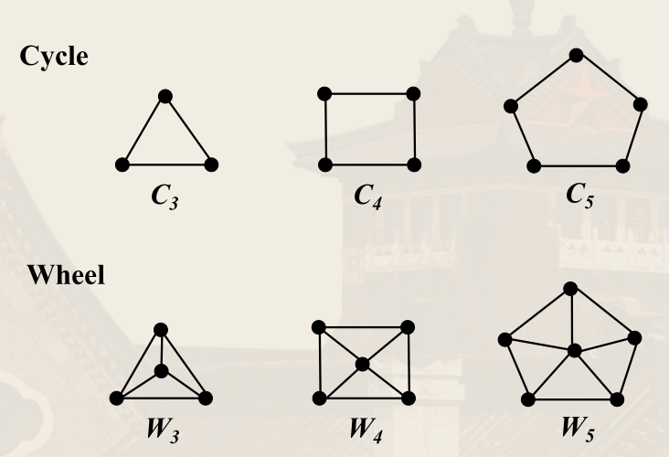

立方体图

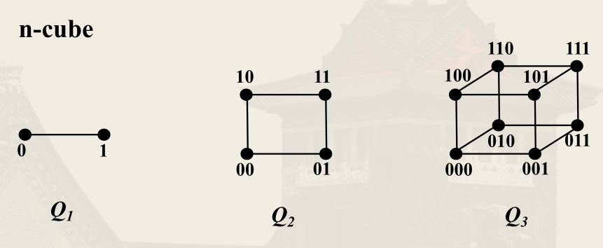

!!! info 正则图
    **正则图** $G$ 是一个简单图，其中每个顶点的度数相同。

    若 $G$ 是 $r$-正则图，且 $r = |V| - 1$，则 $G$ 是完全图。

!!! info ""
    设 $G = (V, E)$ 是一个图，$G' = (V', E')$ 是 $G$ 的子图，当且仅当
    - $V' \subseteq V$
    - $E' \subseteq E$

    若 $V' \subset V$ *或* $E' \subset E$，则称 $G'$ 是 $G$ 的**真子图**。

诱导子图：可以由顶点集的子集，或者由边集的子集导出一个子图。

## 图的表示

!!! info ""
    无向图 $G = (V, E, \varphi)$，不妨设 $V = \left\lbrace v_1, \cdots, v_n \right\rbrace,\, E = \left\lbrace e_1, \cdots, e_m \right\rbrace$。

    则 $M(G) = [m_{ij}]$ 称为 $G$ 的**关联矩阵**（$n \times m$ 阶矩阵），其中

    $$
    m_{ij} = \begin{cases}
        1, & \text{若 } e_j \text{ 关联到 } v_i \\
        0, & \text{否则}
    \end{cases}
    $$

关联矩阵表示法不适用于有向图。

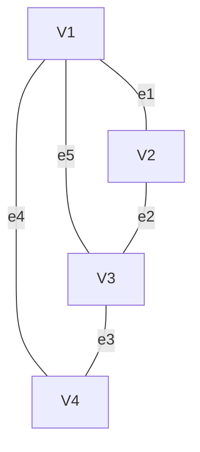

$$
\begin{bmatrix}
    1 & 0 & 0 & 1 & 1 \\
    1 & 1 & 0 & 0 & 0 \\
    0 & 1 & 1 & 0 & 1 \\
    0 & 0 & 1 & 1 & 0
\end{bmatrix}
$$

!!! info ""
    简单有向图 $G = (V, E, \varphi)$，不妨设 $V = \left\lbrace v_1, \cdots, v_n \right\rbrace,\, E = \left\lbrace e_1, \cdots, e_m \right\rbrace$。

    则 $A(G) = [a_{ij}]$ 称为 $G$ 的**邻接矩阵**（$n \times n$ 阶矩阵），其中

    $$
    a_{ij} = \begin{cases}
        1, & \text{若 } v_i \text{ 邻接到 } v_j \\
        0, & \text{否则}
    \end{cases}
    $$

    $v_i, v_{j}$ 相邻即存在 $e \in E$ 使得 $\varphi(e) = (v_i, v_j)$。

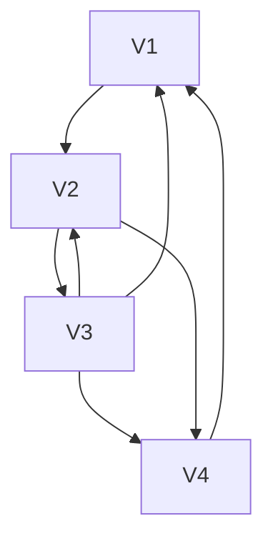

$$
\begin{bmatrix}
    0 & 1 & 0 & 0 \\
    0 & 0 & 1 & 1 \\
    1 & 1 & 0 & 1 \\
    1 & 0 & 0 & 0
\end{bmatrix}
$$

**邻接表**：对于每个顶点 $v_i$，记录与之相邻的顶点。（有向图无向图均可用）

| 顶点 | 相邻顶点 |
| :-:  |   :-:    |
|  …   |    …     |

邻接矩阵中元素为 $0, 1$，称为布尔矩阵。若表示包含多重边的图，则不是布尔矩阵。

- 当有向图中的有向边表示关系时，邻接矩阵就是关系矩阵。无向图的邻接矩阵是对称的。
- 图 $G$ 的邻接矩阵中的元素的次序是无关紧要的，只要进行和行、列和列的交换，则可得到相同的矩阵。
    - 若有二个简单有向图，则可得到二个对应的邻接矩阵，若对某一矩阵进行行和行、列和列之间的交换后得到和另一矩阵相同的矩阵，则此<u>二图同构</u>。

### 邻接矩阵的运算

!!! note ""
    顶点的度：
    - *行*中 $1$ 的个数即为行对应结点的**出度**
    - *列*中 $1$ 的个数即为列对应结点的**入度**

$$
\begin{bmatrix}
    0 & 1 & 0 & 0 \\
    0 & 0 & 1 & 1 \\
    1 & 1 & 0 & 1 \\
    1 & 0 & 0 & 0
\end{bmatrix}
$$

$$
\begin{aligned}
& \deg^{+}(1)=1, \deg^{-}(1)=2 \\
& \deg^{+}(2)=2, \deg^{-}(2)=2 \\
& \deg^{+}(3)=3, \deg^{-}(3)=1 \\
& \deg^{+}(4)=1, \deg^{-}(4)=2
\end{aligned}
$$

!!! note ""
    设 $G$ 邻接矩阵为 $A$，则 $G$ 的逆图的邻接矩阵是 $A^\intercal$。

$$
A = \begin{bmatrix}
    0 & 1 & 0 & 0 \\
    0 & 0 & 1 & 1 \\
    1 & 1 & 0 & 1 \\
    1 & 0 & 0 & 0
\end{bmatrix}\\
A^\intercal = \begin{bmatrix}
    0 & 0 & 1 & 1 \\
    1 & 0 & 1 & 0 \\
    0 & 1 & 0 & 0 \\
    0 & 1 & 1 & 0
\end{bmatrix}
$$

记 $A \times A^\intercal = B = [b_{ij}]$。

$$
b_{ij} = \sum_{k=1}^{n} a_{ik} a_{jk} = a_{i1} a_{j1} + \cdots + a_{in} a_{jn}
$$

其中 $b_{ij}$ 表示结点 $i$ 和结点 $j$ 均有边指向的那些结点的个数。$b_{ii}$ 表示结点 $i$ 的出度。

记 $A^\intercal \times A = C = [c_{ij}]$。

$$
c_{ij} = \sum_{k=1}^{n} a_{ki} a_{kj} = a_{1i} a_{1j} + \cdots + a_{ni} a_{nj}
$$

其中 $c_{ij}$ 表示同时有边指向结点 $i$ 和结点 $j$ 的那些结点的个数。$c_{ii}$ 表示结点 $i$ 的入度。

$$
A = \begin{bmatrix}
    0 & 1 & 0 & 0 \\
    0 & 0 & 1 & 1 \\
    1 & 1 & 0 & 1 \\
    1 & 0 & 0 & 0
\end{bmatrix}
$$

$$
A \times A^\intercal = \begin{bmatrix}
    1 & 0 & 0 & 0 \\
    0 & 2 & 1 & 0 \\
    1 & 1 & 3 & 1 \\
    0 & 0 & 1 & 1
\end{bmatrix}\\
A^\intercal \times A = \begin{bmatrix}
    2 & 1 & 0 & 1 \\
    1 & 2 & 0 & 1 \\
    0 & 0 & 1 & 1 \\
    1 & 1 & 1 & 2
\end{bmatrix}
$$

!!! note ""
    记 $A \times  A = A^2 = D = [d_{ij}]$。

    $$
    d_{ij} = \sum_{k=1}^{n} a_{ik} a_{kj} = a_{i1} a_{1j} + \cdots + a_{in} a_{nj}
    $$

    若 $a_{ik} a_{kj} = 1$，则表示有 $i \to k\to j$ 长度为 $2$ 的有向边。

    即 $d_{ij}$ 表示结点 $i$ 到结点 $j$ 的长度为 $2$ 的通路的个数。

$$
A = \begin{bmatrix}
    0 & 1 & 0 & 0 \\
    0 & 0 & 1 & 1 \\
    1 & 1 & 0 & 1 \\
    1 & 0 & 0 & 0
\end{bmatrix}
$$

$$
A^2 = \begin{bmatrix}
    0 & 0 & 1 & 1\\
    2 & 1 & 0 & 1 \\
    1 & 1 & 1 & 1 \\
    0 & 1 & 0 & 0
\end{bmatrix}\\
A^3 = \begin{bmatrix}
    2 & 1 & 0 & 1\\
    1 & 2 & 1 & 1 \\
    2 & 2 & 1 & 2 \\
    0 & 0 & 1 & 1
\end{bmatrix}
$$

长度不大于 $n$ 的通路个数，可由 $B_{n} = \sum_{k=1}^{n}A^{k}$ 确定。

## 图的运算

- 加新边：$G + e$
- 减边或边集：$G - e$
- 减点或点集：$G - v$（同时删除与 $v$ 关联的边）
- 边的收缩：$G / e$（将边 $e$ 收缩为一个顶点）

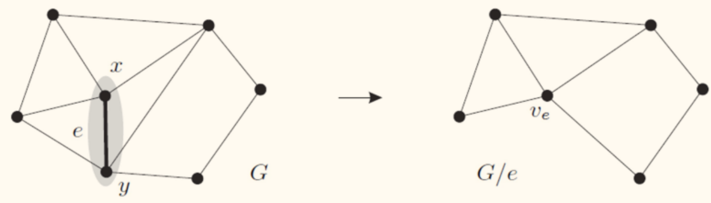

!!! info ""
    简单图 $G$ 和 $G'$ 的并 $G \cup G'$ 为：以 $V(G), V(G')$ 中的顶点组成的集合为顶点集，以 $E(G) \cup E(G')$ 为边集。

!!! info ""
    设图 $G, G'$ 是<u>不交的无向图</u>，定义 $G * G'$ 如下：
    - 以 $V(G) \cup V(G')$ 为顶点集
    - 以 $E(G) \cup E(G') \cup \left\lbrace (x, y) \mid x \in V(G), y \in V(G') \right\rbrace$ 为边集。

!!! info ""
    简单图 $G = (V, E)$ 的补图 $\bar{G} = (V, [V]^2 \backslash E)$

!!! note ""
    设 $G_{1}=\left(V_{1}, E_{1}, \varphi_{1}\right)$ 和 $G_{2}=\left(V_{2}, E_{2}, \varphi_{2}\right)$ 是两个<u>简单无向图</u>。若存在双射 $f\colon V_{1} \to V_{2}$，$u$ 和 $v$ 在 $G_{1}$ 中相邻当且仅当 $f(u)$ 和 $f(v)$ 在 $G_{2}$ 中相邻。此时称 $f$ 是一个同构函数。

    设 $G_{1}=\left(V_{1}, E_{1}, \varphi_{1}\right)$ 和 $G_{2}=\left(V_{2}, E_{2}, \varphi_{2}\right)$ 是两个<u>无向图</u>。若存在双射 $f: V_{1} \rightarrow V_{2}, g\colon E_{1} \to E_{2},\,  \forall e \in E_{1}, \varphi_{1}(e)=\{u, v\}$ 当且仅当 $g(e) \in E_{2}$，且 $\varphi_{2}(g(e))=\{f(u) , f(v)\}$ 。

判断两个简单图是否同构：邻接矩阵表示有 $n!$ 个。现有最好算法在最坏情况下时间复杂度为指数级。

图同构下保持的性质称为*图不变的性质*，如
- 顶点数
- 度序列

## 图的连通性

### 通路

!!! info ""
    图 $G$ 中从 $v_0$ 到 $v_n$ 的长度为 $n$ 的**通路**（walk）是 $G$ 的 $n$ 条边 $e_1, \cdots, e_n$ 的序列，满足
    - 存在 $v_i \in V, 0 < i \le n$ 使得 $v_{i-1}, v_i$ 是 $e_i$ 的两个端点

- **回路**（closed walk）：起点与终点相同，长度大于 $0$
- **简单通路**（trail）：边不重复，即 $\forall i \ne j, e_i \ne e_{j}$
- **初级通路**（path）：点不重复，也成为**路径**
- 不区分多重边时，可用相应顶点的序列表示通路
- 长度为 $0$ 的通路由单个顶点组成

有向图通路定义类似。

设图 $G$ 的邻接矩阵为 $A$，则
- $(A^{n})_{ij}$ 是 $v_i$ 到 $v_{j}$ 的长度为 $n$ 的通路的个数
- $(A^{n})_{ii}$ 是 $v_i$ 到 $v_{i}$ 的长度为 $n$ 的回路的个数

### 连通

!!! info ""
    若无向图 $G$ 中任意两个不同顶点之间都有通路，则称无向图 $G$ 是**连通的**（connected）。

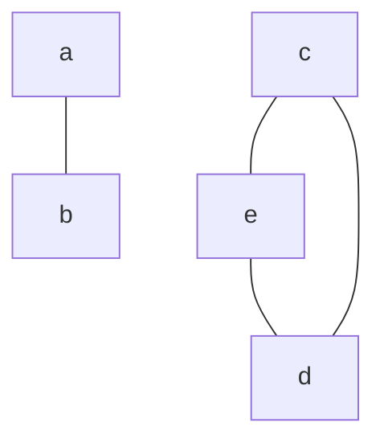

不连通的无向图。

**连通分支**是是一个无向子图，在分量中的任何两个顶点都可以经由该图上的边抵达另一个顶点，且没有任何一边可以连到其他子图的顶点。或者说连通分支即为「极大连通子图」。

有 $7$ 个连通分支。

### 点的删除与连通分支的增减

记 $p(G)$ 为 $G$ 的连通分支个数。

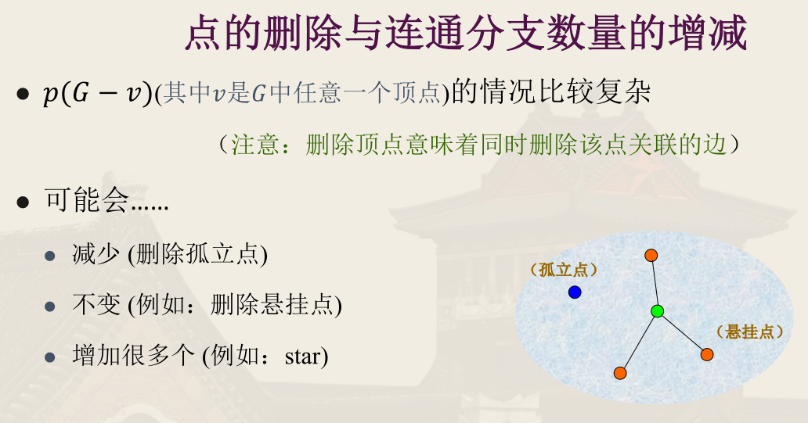

!!! info ""
    设 $G$ 为图，$v \in V_G$，若 $p(G - v) > p(G)$，则称 $v$ 是**割点**。

只需考虑割点所在的连通分支，因此下面的讨论不妨只考虑连通图。

!!! note ""
    关于割点的等价命题：
    1. $v$ 是割点
    2. 存在 $V - \left\lbrace v \right\rbrace$ 的分划 $\left\lbrace V_1, V_2 \right\rbrace$，使得任意 $u \in V_1, w \in V_2$，$uw$-通路均包含 $v$
    3. 存在顶点 $u, w \ne v$，使得任意 $uw$-通路均包含 $v$

    <!-- {{{证明 -->
    

    
证明

    (1) $\implies $ (2)：

    因为 $v$ 是割点，$G - v$ 至少存在两个连通分支，设其中一个顶点集为 $V_1$，令 $V_2 = V - (V_1 \cup \left\lbrace v \right\rbrace)$，则对于任意 $u \in V_1, v \in V_2$，$u, w$ 一定在 $G - v$ 的不同连通分支中，即 $G$ 中任何 $uw$-通路必含 $v$。

    (2) $\implies $ (3)：

    注意到 (3) 是 (2) 的特殊情况。

    (3) $\implies $ (1)：

    显然，$G - v$ 中不可能还有 $uw$-通路，则 $G - v$ 不连通，则 $v$ 是割点。

    

    <!-- }}} -->

### 边的删除与连通分支的增减

!!! note ""
    设 $G$ 为图，$e \in E_G$，则

    $$
    p(G) \le p(G - e) \le p(G) + 1
    $$

    第一个不大于显然；第二个注意在图中任意两点加一条边，最多只能将两个连通分支连成一个。

!!! info ""
    设 $G$ 为图，$e \in E_G$，若 $p(G - e) > p(G)$，则称 $e$ 是 $G$ 中的**割边**（桥，cut edge, bridge）。

只需考虑割边所在的连通分支，因此下面的讨论不妨只考虑连通图。

!!! note ""
    $e$ 是割边当且仅当 $e$ 不在 $G$ 的任一简单回路上。

    <!-- {{{证明 -->
    

    
证明

    $\implies $：

    假设 $C$ 是包含 $e=xy$ 的初级回路，令 $C-e=P$，$P$ 是不含 $e$ 的 $xy$-路径。对 $G$ 中任意顶点 $u, v$，若 $uv$-通路中不含 $e$，则该通路也是 $G-e$ 中的 $uv$-通路。

    若 $uv$-通路中含 $e$，则将所有的 $e$ 均替换为 $P$，得到 $G-e$ 中的 $uv-$-通路，所以 $G-e$ 仍连通，与 $e$ 是割边矛盾。

    $\impliedby $：

    假设 $e = xy$ 不是割边。则 $G - e$ 仍连通，设 $P$ 是 $G-e$ 中的 $xy$-路径，$P$ 中不含 $e$，则 $P + e$ 是 $G$ 中的简单回路，矛盾。

    

    <!-- }}} -->

!!! note ""
    关于割边的等价命题：
    1. $e$ 是割边
    2. $e$ 不在 $G$ 的任一简单回路上
    3. 存在 $V$ 的分划 $\left\lbrace V_1, V_2 \right\rbrace$，使得 $\forall u \in V_1, w \in V_2$，$uv$-通路均包含 $e$
    4. 存在顶点 $u, w$，使得任意 $uw$-通路均包含 $e$

### 连通度

!!! info ""
    使非平凡连通图 $G$ 成为*不连通图*或*平凡图*需要删除的<u>最少顶点数</u>称为图 $G$ 的 **（点）连通度**，记为 $\kappa(G)$。

    约定不连通图或平凡图的连通度为 $0$。而 $\kappa(K_n) = n - 1$。

若图 $G$ 的连通度<u>不小于</u> $k$，则称 $G$ 是 **$k$-连通图**。

$k$-连通图的意思是，删除少于 $k$ 个顶点，依然连通。

!!! info ""
    使非平凡连通图 $G$ 成为*不连通图*或*平凡图*需要删除的<u>最少边数</u>称为图 $G$ 的**边连通度**，记为 $\lambda(G)$。

    约定不连通图或平凡图的边连通度为 $0$。而 $\lambda(K_n) = n - 1$。

若图 $G$ 的边连通度<u>不小于</u> $k$，则称 $G$ 是 **$k$-边连通图**。

$k$-边连通图的意思是，删除少于 $k$ 条边，依然连通。

!!! info 二部图
    **二部图**是一种特殊的图，其顶点集可以分为两个互不相交的子集 $V_1, V_2$（$V_1 \cup V_2 = V, V_1 \cap V_2 = \empty$），使得每条边的两个端点分别属于不同的子集。

!!! info ""
    设 $G$ 是非平凡图，记 $\delta(G)$ 为图 $G$ 中最小顶点度，则有

    $$
    \kappa(G) \le \lambda(G) \le \delta(G)
    $$

    <!-- {{{证明 -->
    

    
证明

    易见 $\lambda(G) \le \delta(G)$，因为对于任意一个图，找出其度数最小的那个点，删除与其关联的边，一定会使得图不连通。

    设 $F$ 为 $E$ 的极小子集使得 $G - F$ 不连通，因此只需证明 $|F| \ge \kappa(G)$。

    若 $G$ 中存在不与 $F$ 中的边相关联的点 $v$，令 $C$ 为 $G - F$ 中 $v$ 所在的连通分支。则由 $F$ 的极小性，$F$ 中的任意一边，其两个端点不会都在 $C$ 中。

    $C$ 中与 $F$ 中的边相关联的顶点集合分隔 $v$ 与 $G - C$，于是 $\kappa(G) \le |F|$。

    > 下图中红圈点是 $v$，其所在的黑圈是 $C$，蓝边集合是 $F$。

    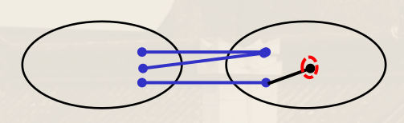

    若 $G$ 中各顶点均与 $F$ 中某条边关联。对任意顶点 $v$，令 $C$ 是 $G - F$ 中 $v$ 所在的连通分支。

    考虑 $v$ 邻居 $w$。若 $w$ 在 $C$ 中，则 $w$ 必与 $F$ 中某条边关联；若 $w$ 在 $G - C$ 中，则边 $vw$ 属于 $F$。因此 $v$ 的邻居数 $|N(v)|$ 小于等于 $|F|$，即 $d_G(v) \le |F|$。

    若 $V - N(v) - v \ne \empty$，则删除 $N(v)$ 后，$v$ 与 $V - N(v) - v$ 不连通，从而 $\kappa(G) \le |F|$。

    若 $V - N(v) - v = \empty$，则取其它节点满足 $V - N(v) - v \ne \empty$ 即可。若所有顶点都满足 $V - N(v) - v = \empty$，则 $G$ 是完全图，$\kappa(G) = \lambda(G) = |G| - 1$。

    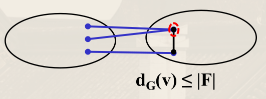

    

    <!-- }}} -->

!!! note ""
    设 $G$ 是简单图，$|G| = n \ge 3$ 且 $\delta(G) \ge n - 2$，则 $\kappa(G) = \delta(G)$。

!!! info Whitney 定理
    图 $G$（$|G| \ge 3$）是 $2$-连通图当且仅当 $G$ 中任意两点被至少被 $2$ 条除端点外顶点不相交的路径所连接。

    即任意两点均处在同一初级回路上。

推广有

!!! info Menar 定理
    - 图 $G$ 是 $k$-连通图当且仅当 $G$ 中任意两点被至少被 $k$ 条除端点外顶点不相交的路径所连接。
    - 图 $G$ 是 $k$-边连通图当且仅当 $G$ 中任意两点被至少被 $k$ 条边不相交的路径所连接。

#### $2$-连通图

!!! example ""
    一个图是 $2$-连通的当且仅当它是一个回路，或可在已有的 $2$-连通图上依次添加 H-path[^h-path]而得。

    [^h-path]: 通路上有两个端点，且仅这两个端点在原图上。

    

    <!-- {{{证明 -->
    

    
证明

    充分性显然（回路是 $2$-连通的；删除 H-path 的两个顶点可以使得图不连通，因此添加 H-path 后还是 $2$-连通，而且新增 H-path 后每个点都在一个回路中，因此也不是 $1$-连通的）。

    必要性：设 $G$ 是 $2$-连通的，则 $G$ 必包含回路 $C$（$2$-连通的性质）。

    设 $H$ 是包含 $C$ 并依次增加 H-path 得到的极大子图，则 $H$ 中一定包含 $G$ 中全部的点。

    否则若 $V_H \ne V_G$，则存在 $v \in V_G - V_H, w \in V_H$，$vw \in E_G$，图 $G$ 是 $2$-连通的，$G - w$ 连通，$v$ 到 $H$ 有路径 $P$，则 $wvP$ 是 H-path，与 $H$ 的极大性矛盾。

    

    若 $E_H < E_G$，只需补齐 $H$ 中的边，使得 $H$ 仍然是 $2$-连通的，即可得到 $G$。

    

    <!-- }}} -->

#### 有向图的连通性

!!! info ""
    若将有向图 $D$ 各边替换为无向边，得到的无向图是连通的，则称 $D$ 是**弱连通**的。

    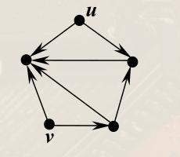

    若 $\forall u, v \in V_D$，存在一条从 $u$ 到 $v$（或相反）的有向通路，则称 $D$ 是**单连通**的。

    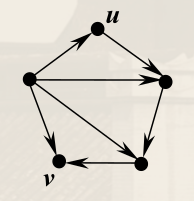

    若 $\forall u, v \in V_D$，均存在 $u$ 到 $v$ 和 $v$ 到 $u$ 的有向通路，则称 $D$ 是**强连通**的。

    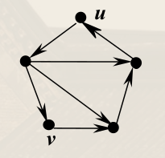

!!! note ""
    有向图 $D$ 强连通当且仅当 $D$ 中所有顶点在同一个有向回路上。

    <!-- {{{证明 -->
    

    
证明

    充分性显然。

    必要性：设 $V_D = \left\lbrace v_1, \cdots, v_n \right\rbrace$，设 $\Gamma_i$ 是 $v_i$ 到 $v_{i+1}$ 的有向通路（$i = 1, \cdots, n-1$），$\Gamma_n$ 是 $v_n$ 到 $v_1$ 的有向通路，则 $\Gamma_1, \cdots, \Gamma_n$ 依次连接是包含 $D$ 中一切顶点的有向回路。

    

    <!-- }}} -->

!!! note ""
    若有向图 $D$ 是单向连通的，则任意非空顶点集 $V' \subseteq V_D$，存在 $v' \in V'$ 使得 $v'$ 可达 $V'$ 中的所有顶点。

!!! memo ""
    边定向相关内容被快速略过了……

## 欧拉图

!!! info ""
    包含图（无向图或有向图）中每条边的简单通路称为**欧拉通路**。

    欧拉通路边不重复（简单通路），但顶点可以重复。

!!! info ""
    包含图中每条边的简单回路称为**欧拉回路**。

!!! info ""
    若图 $G$ 中存在欧拉回路，则称 $G$ 是**欧拉图**。若图 $G$ 中存在欧拉通路但不存在欧拉回路，则称 $G$ 是**半欧拉图**。

本节通常假设 $G$ 连通。

!!! note ""
    连通图 $G$ 是欧拉图当且仅当 $G$ 中每个顶点的度数均为偶数。

    <!-- {{{证明 -->
    

    
证明

    必要性：设 $C$ 是 $G$ 中的欧拉回路，则任意 $v \in V_G$，$\deg(v)$ 必等于 $v$ 在 $C$ 上出现数的 $2$ 倍（起点终点各算一次）。

    充分性：可以证明 $G$ 中所有边可以分为由若干条相互没有公共边的简单回路，这些回路可以串成一个欧拉回路。

    若无向图 $G$ 中任一顶点均为偶度数点，则 $G$ 中所有边包含在若干条相互没有公共边的简单回路中。

    <!-- {{{证明 -->
    

    
证明

    根据 $G$ 边数 $m$ 进行归纳证明。$m = 1$ 时，$G$ 是环，结论成立。

    对 $k \ge 1$，假设 $m \le k$ 时结论成立。考虑 $m = k + 1$ 的情况：

    > **我累了，后面再补充** 8, 9 页

    

    <!-- }}} -->

    

    <!-- }}} -->

欧拉图等价命题：
- $G$ 是欧拉图
- $G$ 中每个顶点的度数均为偶数
- $G$ 中所有的边包含在若干个相互没有公共边的简单回路中

!!! note ""
    连通图 $G$ 是半欧拉图当且仅当 $G$ 中恰有 $2$ 个奇度数顶点。

    <!-- {{{证明 -->
    

    
证明

    $\implies $：设 $P$ 是 $G$ 中的欧拉通路（非回路），起点与终点分别为 $u, v$。则对 $G$ 中任意一点 $x$，若 $x$ 不是 $u, v$，则 $\deg (x)$ 等于其在 $P$ 中出现次数的 $2$ 倍。而 $u, v$ 的度数为它们在 $P$ 中出现次数的 $2$ 倍再加 $1$。

    $\impliedby $：设 $u, v$ 是 $G$ 中的两个奇度数顶点，则 $G + uv$ 是欧拉图，设其欧拉回路为 $C$，则 $C$ 中包含 $uv$ 边，则 $C - uv$ 是 $G$ 中的欧拉通路。

    由此也可得，一笔画一个半欧拉图，必须要从一个奇度数顶点开始，到另一个奇度数顶点结束。

    

    <!-- }}} -->

有向图定义类似：
- 有向欧拉回路：有向图中含所有边的有向简单回路
- 有向欧拉图：含有向欧拉回路的有向图

若 $G$ 是弱连通的有向图，则下列命题等价：
- $G$ 是有向欧拉图
- $G$ 中每个顶点的入度等于出度
- $G$ 中所有的边包含在若干个相互没有公共边的有向简单回路中

!!! info 弗勒里算法（Fleury）
    构造欧拉回路的**弗勒里算法**
    - 输入：欧拉图 $G$
    - 输出：简单回路 $P = v_0 e_1 v_1 e_2 \cdots e_i v_i e_{i+1} \cdots e_m v_m$，其中包含了 $E_G$ 中全部元素
    - 步骤：
        1. 任取 $v_0 \in V_G$，令 $P_0 = v_0$；
        2. 设 $P_i = v_0 e_1 v_1 e_2 \cdots e_i v_i$，按下面的原则从 $E_G - \left\lbrace e_1, e_2, \cdots, e_i \right\rbrace$ 中选择 $e_{i+1}$：
            - $e_{i+1}$ 与 $v_i$ 相关联；
            - 除非别无选择，否则 $e_{i+1}$ 不应是 $G - \left\lbrace e_1, e_2, \cdots, e_i \right\rbrace$ 的割边。
        3. 重复步骤 $2$ 直至 $E_G$ 中的边全部被选中。

    <!-- {{{ 证明 -->
    

    
证明

    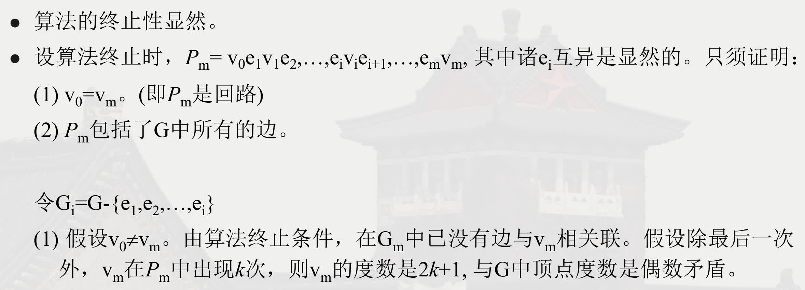

    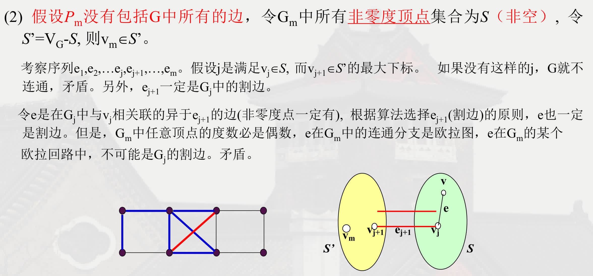

    

    <!-- }}} -->

## 哈密顿图

!!! info ""
    包含图中每个顶点的通路，且通路上各顶点不重复，称为**哈密顿通路**（Hamiltonian path）。

    哈密顿通路顶点不重复，但边可以重复。

!!! info ""
    包含图中每个顶点的回路，且除了起点和终点相同外回路上各顶点不重复，称为**哈密顿回路**。

哈密顿回路无重复地遍历图中诸点，欧拉回路则是无重复地遍历图中诸边。

- 若图 $G$ 有一顶点度为 $1$，则无哈密顿回路
- 若图 $G$ 有一顶点度大于 $2$，若存在哈密顿回路，则只用其中两条边
- 若图 $G$ 中有 $n$ 个顶点，若存在哈密顿回路，则恰有 $n$ 条边

哈密顿图的必要条件。

!!! note ""
    若图 $G = (V, E)$ 是哈密顿图，则对 $V$ 任意非空子集 $S$，有

    $$
    P(G - S) \le |S|
    $$

    其中 $P(G - S)$ 表示图 $G - S$ 的连通分支个数。

    理由：设 $C$ 是 $G$ 中的哈密顿回路，则 $P(G -S) \le P(C - S) \le |S|$，向一个图中顶点之间加边不会增加连通分支。

哈密顿图的充分条件。

!!! note 狄拉克定理（Dirac）
    设 $G$ 是无向简单图，$|G| = n \ge 3$，若 $\delta(G) \ge \dfrac{n}{2}$，则 $G$ 是哈密顿图。

!!! note 奥尔定理（Ore）
    设 $G$ 是无向简单图，$|G| = n \ge 3$，若对 $G$ 中任意两个不相邻的顶点 $u, v$，有 $\deg(u) + \deg(v) \ge n$，则 $G$ 是哈密顿图。

    <!-- {{{证明 -->
    

    
证明

    先证若无向简单图 $G$ 且 $|G| = n \ge 2$，其任意不相邻顶点 $u, v$ 均满足 $\deg(u) + \deg(v) \ge n - 1$，则 $G$ 是连通图。

    设 $G$ 不连通，则至少存在 $2$ 个连通分支，设为 $G_1, G_2$，取 $x \in V_{G_1}, y \in V_{G_2}$，则 $\deg(x) + \deg(y) \le n_1 - 1 + n_2 - 1 \le n - 2$，矛盾！

    反证法。设对无向简单图 $G$ 存在满足任意不相邻顶点有 $\deg(u) + \deg(v) \ge n$，但没有哈密顿回路。

    不妨设 $G$ 是边极大的非哈密顿图（可以给 $G$ 增边，而完全图一定是哈密顿图，存在一个极大的临界情况）。

    设 $u, v$ 是 $G$ 中不相邻的顶点，于是 $G + uv$ 是哈密顿图（由 $G$ 的极大性，再增边一定是哈密顿图），且其中每条哈密顿回路都要通过边 $uv$，因此 $G$ 中存在起点为 $u$ 终点为 $v$ 的哈密顿回路 $v_1, v_2, \cdots, v_n$，其中 $u = v_1, v = v_n$。

    不存在相邻顶点 $v_{i-1}, v_i$ 使得 $v_{i-1}$ 与 $v$ 相邻且 $v_i$ 与 $u$ 相邻，否则 $v_1, v_2, \cdots, v_{i-1}, v_n, \cdots, v_i, v_1$ 是 $G$ 的哈密顿回路。

    设在 $G$ 中 $u$ 与 $v_{i_1}, v_{i_2}, \cdots, v_{i_{k}}$ 相邻，则 $v$ 与 $v_{i_1-1}, v_{i_2-1}, \cdots, v_{i_{k}-1}$ 不相邻，因此 $\deg(u) + \deg(v) \le k + [(n - 1) - k] = n - 1 < n$，矛盾。

    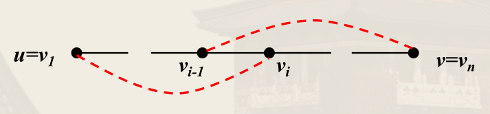

    

    <!-- }}} -->

引理可得：对有限图 $G$，若 $u, v$ 是 $G$ 中不相邻的两个顶点，且 $\deg(u) + \deg(v) \ge |G|$，则 $G$ 是哈密顿图当且仅当 $G + \{uv\}$ 是哈密顿图。

!!! info ""
    图 $G$ 的闭合图 $C(G)$：连接 $G$ 中不相邻的且度数之和不小于 $|G|$ 的点对，直到不存在这样的点对的图。

!!! note ""
    有限图 $G$ 是哈密顿图的充要条件是其闭合图 $C(G)$ 是哈密顿图。

奥尔定理推论有

!!! note ""
    设 $G$ 是简单图，$|G| = n \ge 2$，若 $G$ 中任意不相邻的顶点对 $u, v$，$\deg(u) + \deg(v) \ge n - 1$，则 $G$ 有哈密顿通路。

    <!-- {{{解释 -->
    

    
解释

    对任意图 $G$ 与顶点 $v \notin G$，有新图 $G' = G * v$（即将 $v$ 与 $G$ 中所有顶点相连）。若 $G$ 满足上面的条件，则 $G'$ 有哈密顿回路，从而可以绕过 $v$ 得到原图的哈密顿通路。

    

    <!-- }}} -->

这里是*通路*，不是*回路*。
