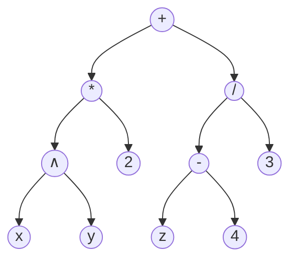
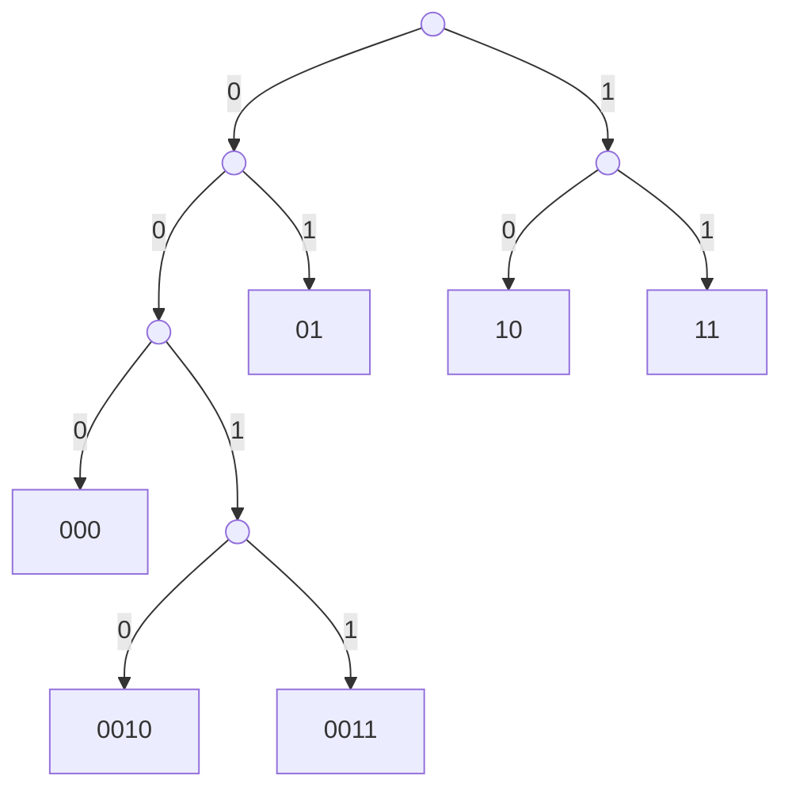
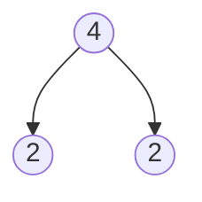
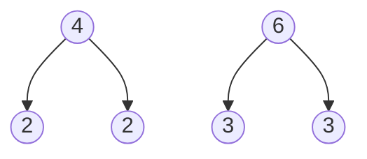
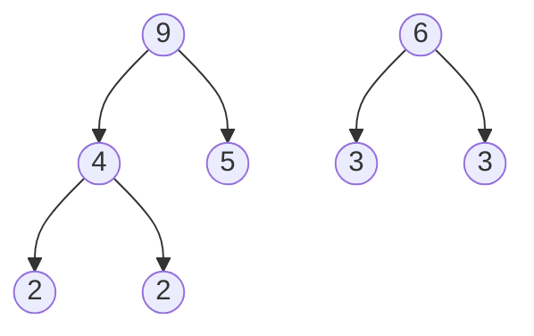
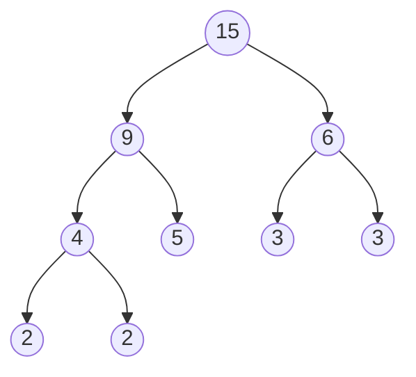
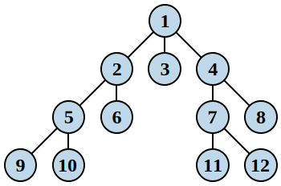

## 树的定义

!!! info ""
    不包含*简单回路*的连通无向图称为**树**。

各连通分支均为树的连通无向图称为**森林**。

**树叶**是度为 $1$ 的顶点。

树的连通度、边连通度均为 $1$，但（边）连通度为 $1$ 的连通无向图不一定是树。

!!! note ""
    设 $T$ 是树，则任意 $u, v \in V_T$，$T$ 中存在唯一的 $uv$-简单通路。

    <!-- {{{证明 -->
    

    
证明

    树没有简单回路，但是可以有回路，例如 $u$-$v$-$u$。
    
    设 $T$ 中有两条不同的 $uv$-简单通路 $P_1, P_2$。

    不失一般性，存在 $e = (x, y)$ 使得 $e \in P_1, e \notin P_2$，且在路径 $P_1$ 上，$x$ 比 $y$ 更靠近 $u$。

    令 $T^{*} = T - \left\lbrace e \right\rbrace$，则 $T^{*}$ 中包含 $P_2$，于是 $(xu)_{P_1}$-$P_2$-$(vy)_{P_1}$ 是 $T^{*}$ 中的 $xy$-通路。

    通路存在，则简单通路存在，记为 $P'$，则 $P'+e$ 是 $T$ 中的 $T$ 中的简单回路，矛盾。
    
    

    <!-- }}} -->

关于树的等价命题：设 $T$ 是简单无向图
- $T$ 是树
- $T$ 中任意两点之间有唯一简单通路
- $T$ 连通，但删除任意一边后不再连通
- $T$ 无回路，但在任意不相邻的两点间加一条边后会产生唯一简单回路

因此有
- 树是*边最少*的<u>连通无向图</u>
- 树是*边最多*的<u>无简单回路的图</u>

!!! note ""
    对树 $T$ 有

    $$
    |E_T| = |V_T| - 1
    $$
    
    <!-- {{{证明 -->
    

    
证明

    
    归纳证明即可。任取 $e \in E_T$，$e$ 为 $T$ 的割边，$T - \left\lbrace e \right\rbrace$ 含两个连通分支，归纳得证。 
    
    

    <!-- }}} -->

由此有

!!! note ""
    对顶点数为 $n \ge 2$ 的连通图 $G$，有 $|E_G| \ge |V_G| - 1$。

有关边点数量的树的等价命题：设 $T$ 是简单无向图
- $T$ 是树
- $T$ 不含简单回路，且 $|E_T| = |V_T| - 1$
- $T$ 连通，且 $|E_T| = |V_T| - 1$

!!! info ""
    底图是树的有向图称为**有向树**。
    
    若有向树<u>恰有一个顶点的入度为 $0$，其它顶点入读均为 $1$</u>，则称为**根树**，该顶点称为**根**。

!!! note ""
    对根树 $T$，若 $v_0$ 是 $T$ 的根，则对 $T$ 中任意其它顶点 $v_n$，存在唯一的有向 $v_0v_n$-通路，但不存在 $v_nv_0$-通路。

根树
- **内点**：有子节点
- **树叶**：无子节点
- **树高**：最大通路长度
- **$m$ 元树**：每个内点至多有 $m$ 个子节点
    - $2$ 元树也称为**二叉树**
- **完全 $m$ 元树**（full $m$-ary tree）：每个内点恰好有 $m$ 个子节点
- **平衡**：树叶都在 $h$ 或 $h - 1$ 层，其中 $h$ 为树高
- **满**：每个内点都有 $m$ 个子节点
- **完全**：除了最底层外，其它层都是满的，且最底层从左到右填满
- **有序**：同层每个顶点排定次序
    - 有序二叉树也通常简称为二叉树
        - 子树分为左子树和右子树
- **根子树**：根树任一顶点及其所有后代的导出子图

有序根树的**先序遍历**（preorder traversal）：

!!! info ""
    若 $T$ 只包含根 $r$，则 $\operatorname{preorder}(T) = r$。

    若子树为 $T_1, \cdots, T_2$，则为 $r, \operatorname{preorder}(T_1), \cdots, \operatorname{preorder}(T_n)$ 

有序根树的**中序遍历**（inorder traversal）：

!!! info ""
    若 $T$ 只包含根 $r$，则 $\operatorname{inorder}(T) = r$。

    若子树为 $T_1, \cdots, T_n$，则为 $\operatorname{inorder}(T_1), r, \cdots, \operatorname{inorder}(T_n)$

有序根树的**后序遍历**（postorder traversal）：

!!! info ""
    若 $T$ 只包含根 $r$，则 $\operatorname{postorder}(T) = r$。

    若子树为 $T_1, \cdots, T_n$，则为 $\operatorname{postorder}(T_1), \cdots, \operatorname{postorder}(T_n), r$

可以用根树表示*表达式*，则<u>前缀表达式</u>（波兰表示法）对应先序遍历，<u>后缀表达式</u>（逆波兰表示法）对应后序遍历，<u>中缀表达式</u>对应中序遍历。

例如 $((x \wedge y) * 2 + (z - 4) / 3)$ 的表达式树为

- 前缀表示：$+\, *\, \wedge\, x\,  y\,  2\,  /\,  -\,  z\,  4\,  3$
- 后缀表示：$x\, y\, \wedge\, 2\, *\, z\, 4\, -\, 3\, /\, +$
- 中缀表示：$x \wedge y * 2 + z - 4 / 3$

中缀表示的缺陷：不同表达式树可以有相同的中缀形式（因此需要括号标记运算顺序）。而前缀和后缀表示法是唯一的。

!!! info 前缀表示法（波兰表示法）
    1. 从右向左扫描表达式
    2. 遇到操作数则入栈
    3. 遇到操作符则取出栈顶相应数量的操作数，将操作符和操作数组成新的操作数入栈
    4. 最后栈中只有一个操作数，即为结果

!!! info 后缀表示法（逆波兰表示法）
    1. 从左向右扫描表达式
    2. 遇到操作数则入栈
    3. 遇到操作符则取出栈顶相应数量的操作数，将操作符和操作数组成新的操作数入栈
    4. 最后栈中只有一个操作数，即为结果

!!! info 二叉搜索树
    二叉搜索树满足下面的条件
    - 是二叉树
    - 各顶点非左即右，左右均不超过一个
    - 设 $u$ 是树中任意的顶点
        - $u$ 的左子树中所有顶点的值均小于 $u$ 的值
        - $u$ 的右子树中所有顶点的值均大于 $u$ 的值

若符号串 $\alpha$ 可以表示成符号串 $\beta_1, \beta_2$ 的并置，则称 $\beta_1$ 是 $\alpha$ 的一个**前缀**（$\beta_1, \beta_2$ 可以为空串）。

设 $A = \left\lbrace \beta_1, \cdots, \beta_m \right\rbrace$ 是符号串的集合，且对任意 $\beta_i, \beta_{j}$，若 $i \ne j$，有 $\beta_i, \beta_{j}$ 互不为前缀，则称 $A$ 是**前缀码**。

若前缀码 $A$ 中的任意串 $\beta_i$ 只含 $0, 1$，则称 $A$ 是**二元前缀码**。

给定一颗完全二叉树，可以产生唯一的二元前缀码：

各字母使用频率不同，使用频率高的字母使用尽量短的符号串表示。

!!! info ""
    若 $T$ 是二叉树，且每个叶 $v_i$ 有数值权 $w_1$，则二叉树的权 $W(T)$ 定义为

    $$
    W(T) = \sum_{v_i \in V_T} w_i l(v_i)
    $$
    
    其中 $l(v_i)$ 为 $v_i$ 的深度。

具有相同权序列的二叉树中权最小的树称为**最优二叉树**。

!!! note 哈夫曼算法
    - 输入：正实数序列 $w_1, w_2, \cdots, w_t$
    - 输出：有 $t$ 个树叶，权序列为 $w_1, w_2, \cdots, w_t$ 的最优二叉树
    - 过程：
        1. $T$ 棵根树（森林），根劝分别为 $w_1, w_2, \cdots, w_t$
        2. 选择根权最小的两棵树，以它们为左右子树合并生成新的二叉树，其根权为两树根权之和
        3. 重复步骤 $2$ 直到形成一棵树

例如对于序列 $2, 2, 3, 3, 5$，哈夫曼算法的过程如下

第一步（与上面数字序号并不一一对应）

第二步

第三步

第四步

## 生成树

图 $G'$ 是图 $G$ 的**生成子图**，当且仅当 $G'$ 包含 $G$ 的所有顶点，且 $G'$ 是 $G$ 的子图。

!!! info ""
    若图 $G$ 的生成子图是树，则该子图称为 $G$ 的**生成树**。

从而<u>无向图 $G$ 连通当且仅当 $G$ 有生成树</u>。简单无向图 $G$ 是树当且仅当 $G$ 有唯一的生成树。

- 深度优先算法：从某个顶点出发，沿着一条路径一直走到底，然后回溯，走到下一个路径，直到所有路径都走完
    - 
- 广度优先算法：从某个顶点出发，先访问所有邻接顶点，再访问邻接顶点的邻接顶点，依次类推
    - 

!!! info ""
    考虑边有权重的连通无向图，定义生成树的权重为<u>生成树中所有边权重之和</u>，一个带权连通图的**最小生成树**（Minimum Spanning Tree，MST）是<u>权重最小的生成树</u>。
    
    未必唯一。

!!! note Prim 算法
    1. $E = \left\lbrace e \right\rbrace$，其中 $e$ 是权最小的边
    2. 从 $E$ 以外选择与 $E$ 里顶点关联，又不会与 $E$ 的边构成回路的权最小的边加入 $E$
    3. 重复步骤 $2$ 直到 $E$ 包含 $n-1$ 条边

!!! note Kruskal 算法
    1. $E = \left\lbrace  \right\rbrace$
    2. 从 $G$ 中选择权最小的边，若该边不与 $E$ 的边构成回路，则加入 $E$
    3. 重复步骤 $2$ 直到 $E$ 包含 $n-1$ 条边

!!! memo ""
    证明写不动了……

- 上述算法都是贪心地增加不构成回路的边，以求得最优树，通常称为**避圈法**
- 从另一个角度来考虑最优树问题，在原连通带权图 $G$ 中逐步删除构成回路中权最大的边，最后剩下的无回路的子图为最优树。我们把这种方法称为**破圈法**
