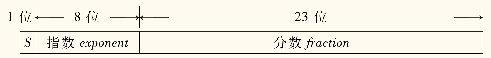

**比特**（bit）是计算机中最小的存储单位，只能存储 0 或 1。比特是「二进制位」（binary digit）的缩写。

8 个比特组成一个**字节**（byte），一个字节能表示 256 种不同的状态。

## 整数数据类型

### 无符号整数

像十进制一样，没什么好说的。比如 $00011110_{(2)} = 30_{(10)}$，因为

$$
0 \times 2^7 + 0 \times 2^6 + 0 \times 2^5 + 1 \times 2^4 + 1 \times 2^3 + 1 \times 2^2 + 1 \times 2^1 + 0 \times 2^0 = 30
$$

使用 $n$ 个比特可以表示 $2^n$ 个不同的状态，所以 $n$ 个比特可以表示 $0$ 到 $2^n - 1$ 的整数，一个字节可以表示 $0$ 到 $255$ 的整数。

### 有符号整数

最符合直觉的，自然是拿出一位（比如最高位）来表示符号，$0$ 表示正数，$1$ 表示负数，这就是**原码**。例如 $1101_{(2)} = -5_{(10)}$，因为

$$
(-1)^{1}\left(1 \times 2^3 + 1 \times 2^2 + 0 \times 2^1 + 1 \times 2^0\right) = -5
$$

但是这样有一个问题，就是 $0$ 有两种表示方法，$0000_{(2)}$ 和 $1000_{(2)}$，即 $+0$ 与 $-0$，相当于浪费了一个状态。

还有一种方法，既然正数负数互为相反数，取「反」意，将正数按位取反，就得到了**反码**。例如 $1101_{(2)} = -2_{(10)}$，因为最高位是 $1$，所以是负数，然后取反得到 $0010_{(2)}$，然后加 $1$ 得到 $0010_{(2)}$，即 $2_{(10)}$，再加个负号就是 $-2_{(10)}$。

不过还是一样有 $0000_{(2)}$ 与 $1111_{(2)}$ 的 $+0$ 与 $-0$ 问题。

而且，这样的表示方法，加法和减法的运算都不方便。下面分别是按十进制进位法计算原码和反码的加法：

$$
\begin{array}{r}
&\phantom{+}&0100&(4) \\
&+&1011&(-3) \\
\hline
&=&1111&(-7)
\end{array}
$$

$$
\begin{array}{r}
&\phantom{+}&0100&(4) \\
&+&1100&(-3) \\
\hline
&=&0000&(0)
\end{array}
$$

不可以按正常思路那样，一位一位加，然后进位，而是需要判断符号等。

**补码**解决上面的问题。

对于自然数，补码与原码相同。

对于负数，为了简化加法，我们想要实现 $A$ 与 $-A$ 的二进制表示相加（指符合常识的，也就是上面竖式计算的方式）等于 $0$，即 $A + (-A) = 0$。

当然加成 $0000_{(2)}$ 显然是不可能的，除非两个整数都是 $0$，但是可以像上面反码那样，进一位成 $10000_{(2)}$，忽略最高进位，于是变回 $0000_{(2)}$。

那么对于 $n$ 位，$A$ 的补码直接解释过来（即视为无符号）就应该是 $2^n - A$。

考虑反码，可以注意到原码和反码直接解释（同上）的和，就是所有位全为 $1$，也就是 $2^n - 1$，也就是说，$A$ 的反码直接解释是 $2^n - A - 1$。

也就是说，<u>补码是反码加 $1$</u>。

使用补码，$0$ 的表示方法就唯一，可以多一种状态以表示 $-2^{n - 1}$，而且方便进行加法运算，比如说上面的例子

$$
\begin{array}{r}
&\phantom{+}&0100&(4) \\
&+&1101&(-3) \\
\hline
&=&0001&(1)
\end{array}
$$

## 进制转换

### 二进制转十进制

自然数（最高位为 $0$）转换非常简单。有意思的是，对于负数（最高位为 $1$），也可以通过取反加一得到十进制表示的数值的绝对值的原码。原理如下

$$
\Bigl(2^n - (2^n - A) - 1\Bigr) + 1 = A
$$

### 十进制转二进制

只需要了解正整数的转换，因为负数根据上面说的，只需要了解其绝对值的转换。

具体方法就是，不断除以 $2$，然后取余数，直到商为 $0$，然后把余数倒过来就是二进制表示。即「除 $2$ 取余」法。

例如 $123$，有

$$
\begin{aligned}
    123 &= 61 \times 2 + \kern{-0.8em}&1 \\
    61 &= 30 \times 2 + \kern{-0.8em}&1 \\
    30 &= 15 \times 2 + \kern{-0.8em}&0 \\
    15 &= 7 \times 2 + \kern{-0.8em}&1 \\
    7 &= 3 \times 2 + \kern{-0.8em}&1 \\
    3 &= 1 \times 2 + \kern{-0.8em}&1 \\
    1 &= 0 \times 2 + \kern{-0.8em}&1 \\
\end{aligned}
$$

从而得到 $123_{(10)} = 01111011_{(2)}$。

### 二进制与八进制/十六进制互转

二进制转八进制，每三位二进制数对应一位八进制数，即 $000 \to 0,\, 001 \to 1,\,\cdots,\, 111 \to 7$。

二进制转十六进制，每四位二进制数对应一位十六进制数，即 $0000 \to 0,\, 0001 \to 1,\,\cdots,\, 1111 \to \mathrm{F}$。

反过来一样，每一位八进制数对应三位二进制数，每一位十六进制数对应四位二进制数。

上面说的「每」，是从*低位*开始的。

### 小数的二进制表示

定点数十进制转二进制方法是「乘 $2$ 取整」，从上到下整数部分为从高到低小数位。例如

$$
\begin{aligned}
    &0.6875 \times 2 = \kern{-0.8em}&\textcolor{FF9900}{1}.&375\\ 
    &0.375 \times 2 = \kern{-0.8em}&\textcolor{FF9900}{0}.&75\\
    &0.75 \times 2 = \kern{-0.8em}&\textcolor{FF9900}{1}.&5\\
    &0.5 \times 2 = \kern{-0.8em}&\textcolor{FF9900}{1}.&0
\end{aligned}
$$

那么 $0.6875 = 0.1011_{(2)}$。

### 算术运算

运算时，用 $0$ 扩展正数的左端，用 $1$ 扩展负数的左端，这个过程称为**符号扩展**。如 $-4_{(10)} = 1100_{(2)}$，应当扩展为 $\overbrace{111111111111}^{12}1100$（十六位）。

溢出只需要检查两个正数（负数）相加得到负数（正数）的情况，即可判断是否溢出。

### 逻辑运算

- **与** AND：$A \cdot B$ 
- **或** OR：$A + B$
- **非** NOT：$\bar{A}$
- **异或** XOR：$A \oplus B$

## ASCII 码

一个字符占一个字节，即 $8$ 位。

几个特征：
1. $0$-$9$ 的 ASCII 码是 $30_{(16)}$-$39_{(16)}$
2. $\mathrm{A}$-$\mathrm{Z}$ 的 ASCII 码是 $41_{(16)}$-$5\mathrm{A}_{(16)}$
3. $\mathrm{a}$-$\mathrm{z}$ 的 ASCII 码是 $61_{(16)}$-$7\mathrm{A}_{(16)}$

也就是说，大小写转换只需要在 ASCII 码上加减 $20_{(16)}$。

## 浮点数

应该是这章类型表示中最复杂的一部分了。使用的是 IEEE 754 标准，这里使用 $32$ 位的*单精度浮点数*来举例。

单精度浮点数的 $32$ 位分配如下：
- **符号位** $s$：$1$ 位
- **指数位** $E$：$8$ 位
- **分数位** $f$：$23$ 位

一般的书、教程都会直接丢一个公式上来，比如下面这个

$$
n = (-1)^s \times 2^{E-e} \times 1.f
$$

看起来比较吓人，然后开始依次讲解每个部分的意义。我觉得这样……很好。

### 符号位

这没啥好说的，$0$ 表示正数，$1$ 表示负数。

### 分数位

常用的科学计数法表示法，十进制中是 $a.b_1 b_2 \cdots b_n \times 10^p$，其中 $a \in \N^{*},\, b_i \in \N$，也就是说 $a$ 不为 $0$。

类似的，有二进制的「科学计数法」，即 $a.b_1 b_2 \cdots b_n \times 2^p$，这里 $a, b \in \left\lbrace 0, 1 \right\rbrace$。同样的，$a$ 不为 $0$，可以简化为 $1.b_1 b_2 \cdots b_n \times 2^p\;(b \in \left\lbrace 0, 1 \right\rbrace)$。这样最高位为 $1$，可以省去了 $1$ 位，同样位数可以多表示一位。

这也就是上面公式的 $1.f$ 部分。

### 指数位

这部分是 $2^p$，在上面表示为 $2^{E - e}$，其中 $e$ 为*偏置常数*，在单精度浮点数中为 $127$。

指数 $8$ 位当作无符号整数，可以表示 $0$-$255$，但是为了表示负指数，需要减去一个常数 $e$，因此实际上可以表示 $-127$-$128$。

至于为什么取 $e = 127$，这个我搜了一下没找到原因。这里是我参考网上的信息，结合自己的猜测：基本上为了对称，偏置常数取中间两个数比较好，也就是 $127$ 和 $128$。而如果采用 $128$，那么仅仅是能表示一个更小的数，但是表示范围却大大减少了，而大部分情况下可能大的范围比小的范围价值更高（尤其在已经有一定小范围的情况下），在权衡之下，最终选择了 $127$。

但是其实指数实际表示范围并不是 $-127$-$128$，而是 $-126$-$127$，因为 $-127$ 和 $128$ 都进行了特殊化处理：

- $E = 0$：表示*非规格化数*，此时数值为 $(-1)^s \times 2^{-126} \times (0.f)$（分数位开头变为 $0$），可以用来表示很小的数。
    - 特别的，$f = 0$ 时，表示的是 $0$（当然，这样的表示法有 $+0.0$ 和 $-0.0$ 之分）。
- $E = 255$：表示*特殊数*。
    - $f = 0$：表示无穷大，正负由符号位决定。
    - $f \neq 0$：表示*非数*（NaN, **N**ot **a** **N**umber），用来表示不确定的结果，如 $0.0 / 0.0$。

对于双精度浮点数（$64$ 位），符号位为 $1$ 位，指数位为 $11$ 位，分数位为 $52$ 位。（指数只需稍微增加一点，范围就会迅速增大，因此只需要稍微增加一点就可以满足大部分需求，而此时提高精度更有价值）
