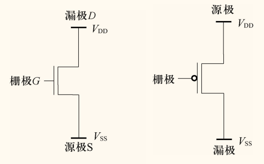
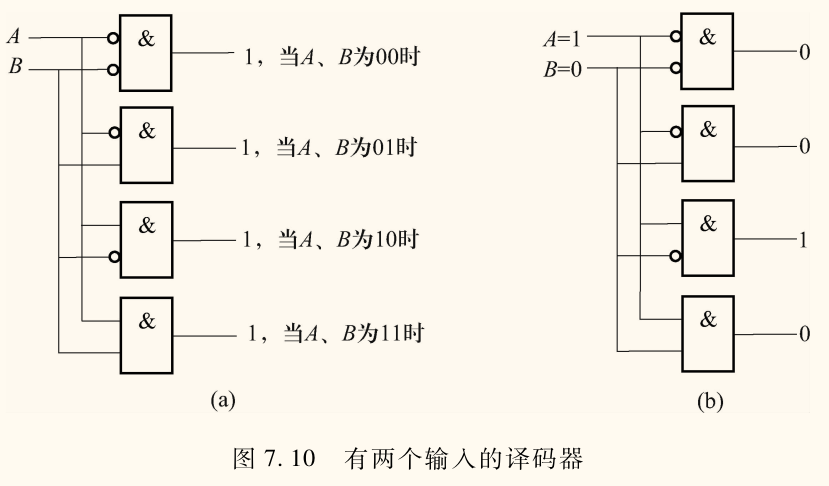
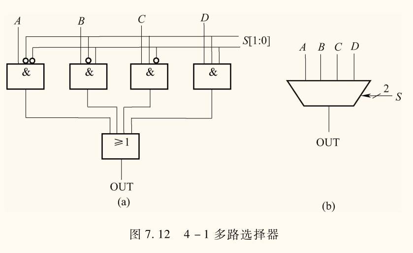
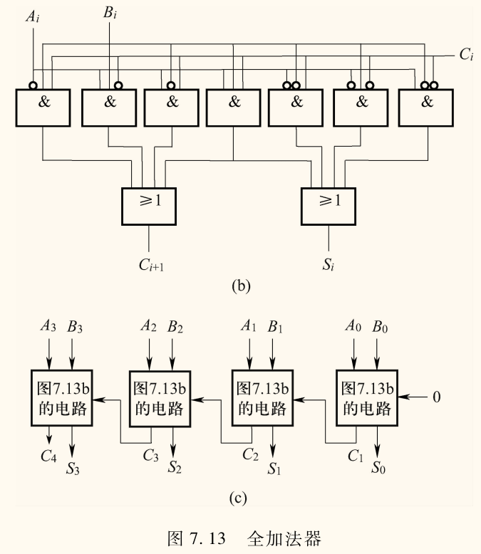

## 二进制逻辑运算

布尔代数部分见离散数学，这里懒得再写一遍了。

- 与（$\operatorname{AND}$）：$A \cdot B$
- 或（$\operatorname{OR}$）：$A + B$
- 非（$\operatorname{NOT}$）：$\bar{A}$

位组合编号规则
- 从右向左，顺序编号，最右边一位是 $[0]$ 
- 最左边是 $[n - 1]$ 
- 记作 $[n - 1 : 0]$

**位屏蔽/掩码**：保留某些位。
- 如保留最右边的 4 位，屏蔽掉其他位，可以用 $00001111$ 进行与运算。
- 原理是 $A \operatorname{AND} \mathbf{T} = A$ 

判断两个位组合是否相同：异或（$\operatorname{XOR}$），结果为 $0$ 代表相同。

C 语言中的位运算符

```c
a & b  // 与
a | b  // 或
a ^ b  // 异或
~a     // 非
a << b // 左移
a >> b // 右移
```

- 左移：零填充（低位补 $0$），相当于乘 $2^b$
- 右移：符号扩展（高位补符号位），相当于除 $2^b$

优先级（数字越小优先级越高）
- 非（1）
- 左移、右移（2）
- 与（3）
- 异或（4）
- 或（5）

## 晶体管和门电路

### 晶体管

MOS（Metal-Oxide Semiconductor，金属氧化物半导体）晶体管，是数字逻辑电路的基本元件，相当于*开关*。
- P 型
- N 型

下图分别为 N 型和 P 型的 MOS 晶体管。

- N 型 MOS 晶体管有 3 个终端，控制端称为**栅极**（Gate），接地一端称为**源极**（Source）。源极电压记作 $V_{\mathrm{SS}}$，接<u>正电压</u>一端称为**漏极**（Drain），漏极电压记作 $V_{\mathrm{DD}}$。
    - 当栅极电压为 $0$ 时，源极和漏极之间的电阻很大，相当于断路，即<u>截止</u>
    - 当栅极电压为 $\pu{3.3 V}$ 时，源极和漏极之间的电阻很小，相当于通路，即<u>导通</u>。
- P 型 MOS 晶体管工作原理与 N 型相反。
    - 当栅极电压为 $0$ 时，源极和漏极之间的电阻很小，相当于通路，即<u>导通</u>。
    - 当栅极电压为 $\pu{3.3 V}$ 时，源极和漏极之间的电阻很大，相当于断路，即<u>截止</u>



- N 型 MOS 晶体管要求源极不能接电源正极
- P 型 MOS 晶体管要求源极不能接地

CMOS（Complementary MOS）电路：既包含 N 型 MOS 晶体管，又包含 P 型 MOS 晶体管的电路，即互补金属氧化物半导体电路。

### 门电路

下面第一张图是晶体管 ANSI/IEEE 符号，第二张图是门电路的 IEC 符号。

<!-- {{{无关内容：CSS 图片深浅模式切换 -->
<details>
<summary>无关内容：CSS 图片深浅模式切换</summary>

控制台切换深浅色，可以发现下面的图片颜色也会跟着切换，始终保持最清晰的显示效果。

然而 markdown 比较弱，最直接的方式自然是直接使用 HTML 再加 CSS 实现。不过我在网上搜了一下，找到了可以保持 markdown 图片格式的情况下随深浅模式切换图片黑白的方式。

参考：
- [Invert colors of an image in CSS or JavaScript](https://stackoverflow.com/a/13325820)
- [How to add class in image markdown in Ghost?](https://stackoverflow.com/a/22683624)
- command-r-plus: `mix-blend-mode: screen`
- command-r: `hue-rotate(180deg)`

最后就是在前面添加一个 style 标签，内容如下。

```css
<style>
@media (prefers-color-scheme: dark) {
    img[src$='#invert'] {
        -webkit-filter: invert(1);
        filter: invert(1) hue-rotate(180deg);
        mix-blend-mode: screen;
    }
}
</style>
```

大致意思就是，在深色模式下，匹配 img 标签中 src 字段以 `#invert` 结尾的图片，然后进行反色。

接着就是对需要反色的图片，后面加上 `#invert`，例如

```markdown


```

</details>
<!-- }}} -->

<style>
@media (prefers-color-scheme: dark) {
    img[src$='#invert'] {
        -webkit-filter: invert(1);
        filter: invert(1) hue-rotate(180deg);
        mix-blend-mode: screen;
    }
}
</style>

#### 非门

**非门**（NOT Gate）：只有一个输入端，一个输出端。<u>输出端与输入端相反</u>。


#### 或门

**或门**（OR Gate）：两个输入端，一个输出端。<u>只有两个输入端都为 $0$ 时，输出端才为 $0$</u>。


#### 或非门

**或非门**（NOR Gate）：两个输入端，一个输出端。<u>只有两个输入端都为 $0$ 时，输出端才为 $1$</u>。


#### 与门

**与门**（AND Gate）：两个输入端，一个输出端。<u>只有两个输入端都为 $1$ 时，输出端才为 $1$</u>。


#### 与非门

**与非门**（NAND Gate）：两个输入端，一个输出端。<u>只有两个输入端都为 $1$ 时，输出端才为 $0$</u>。


#### 异或门

**异或门**（XOR Gate）：两个输入端，一个输出端。<u>只有两个输入端不同时，输出端才为 $0$</u>。


## 组合逻辑电路

两种基本类型：
- 能存储信息：
- 不能存储信息：**判定**原件

### 译码器

**译码器**：任意时刻下只有一个位输出 $1$，其它输出 $0$。
- 一般译码器有 $n$ 个输入，$2^n$ 个输出。



### 多路选择器

**多路选择器**：由选择信号选择一个输入连接到输出。
- 一般多路选择器由 $n$ 条选择线和 $2^n$ 个输入组成。



### 二进制加法全加器

**全加器**：三个输入，两个输出。
- 两个输入是加数 $A$ 和 $B$，一个输入是进位 $C_{\text{in}}$，两个输出是和 $S$ 和进位 $C_{\text{out}}$。

真值表

| $A$ | $B$ | $C_{\text{in}}$ | $C_{\text{out}}$ | $S$ |
| :-: | :-: | :-: | :-: | :-: |
| $0$ | $0$ | $0$ | $0$ | $0$ |
| $0$ | $0$ | $1$ | $0$ | $1$ |
| $0$ | $1$ | $0$ | $1$ | $0$ |
| $0$ | $1$ | $1$ | $1$ | $0$ |
| $1$ | $0$ | $0$ | $0$ | $1$ |
| $1$ | $0$ | $1$ | $1$ | $0$ |
| $1$ | $1$ | $0$ | $1$ | $0$ |
| $1$ | $1$ | $1$ | $1$ | $1$ |



### PLA

**可编程逻辑阵列**（Programmable Logic Array，PLA）：仅由与门、或门和非门组成的逻辑电路。

## 时序逻辑电路

!!! memo ""
    电路听困了，没咋记。

### 基本存储元件

#### $R$-$S$ 锁存器

- $R$：**R**eset，复位
- $S$：**S**et，置位

#### 门控 $D$ 锁存器

- $D$：**D**ata，数据
- $W\!E$：**W**rite **E**nable，写使能

#### 寄存器

由多个门控 $D$ 锁存器构成。

#### 有限状态机

### 时钟（Clock）

#### 主从寄存器

由两个门控 $D$ 锁存器及一个时钟信号构成。

### 存储器

可唯一标识的单元总数称为存储器的**地址空间**。

和每一个单元联系在一起的唯一标识符称为存储器的**地址**。

存储在每个单元中的位数是存储器的**寻址能力**。大多数存储器单元的寻址能力是 8 位（即 1 字节）。

!!! note ""
    1 字 $\ne$ 1 字节。
