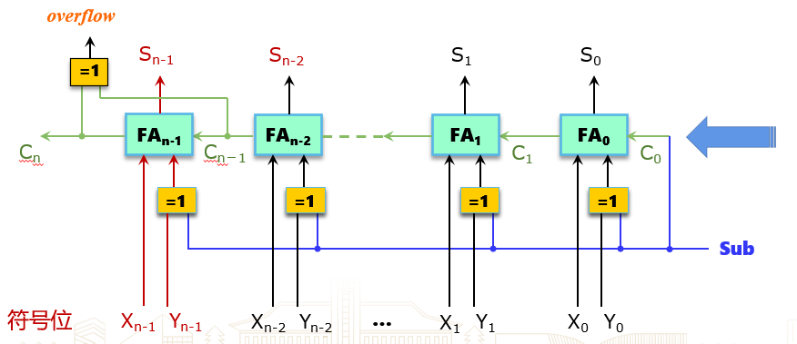
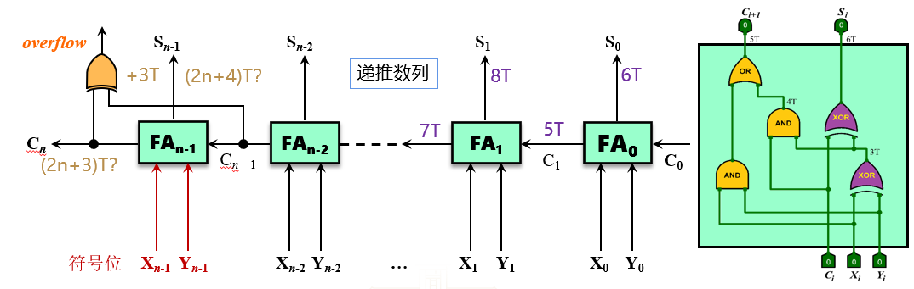
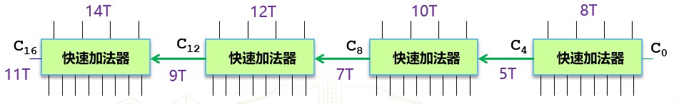

## 补码加法运算部件

溢出判断逻辑：正正得负，负负得正.

设两数符号位分别为 $f_0,\, f_1$，和数符号位为 $f_s$，定义溢出检测信号位 $\text{Overflow(OF)}$，则

$$
\mathrm{OF} = \bar{f_0} \cdot \bar{f_1} \cdot f_s + f_0 \cdot f_1 \cdot \bar{f_s}
$$

还有一种判断逻辑：设两数最高数值位产生的进位位为 $C_n$，符号位进位位为 $C_f$，则

$$
\mathrm{OF} = C_f \oplus C_n
$$

### 全加器

带进位位的一位全加器的真值表如下：

| 加数 $X_i$ | 加数 $Y_i$ | 低位进位 $C_i$ | 和数 $S_i$ | 进位 $C_{i+1}$ |
| :--------: | :--------: | :-------------: | :--------: | :-------------: |
|    $0$     |    $0$     |       $0$       |    $0$     |       $0$       |
|    $0$     |    $0$     |       $1$       |    $1$     |       $0$       |
|    $0$     |    $1$     |       $0$       |    $1$     |       $0$       |
|    $0$     |    $1$     |       $1$       |    $0$     |       $1$       |
|    $1$     |    $0$     |       $0$       |    $1$     |       $0$       |
|    $1$     |    $0$     |       $1$       |    $0$     |       $1$       |
|    $1$     |    $1$     |       $0$       |    $0$     |       $1$       |
|    $1$     |    $1$     |       $1$       |    $1$     |       $1$       |

$$
\begin{aligned}
    S_i &= X_i \oplus Y_i \oplus C_i\\ 
    C_{i+1} &= X_i \cdot Y_i + (X_i \oplus Y_i) \cdot C_i
\end{aligned}
$$

门级电路延迟
- 与非门：$\pu{1T}$ 
- 或非门：$\pu{1T}$
- 与门：$\pu{1T}$ 
- 或门：$\pu{1T}$
- 非门：$\pu{1T}$
- 异或门：$\pu{3T}$

!!! memo ""
    不严谨，例如与门是由与非门和非门组成，以及门器件内部层级也不一样。但是为了简化运算，如此规定。

门级电路延迟计算公式：

$$
t_{\mathrm{out}} = \max\left\lbrace t_{\mathrm{in_1}},\, t_{\mathrm{in_2}} \right\rbrace + t_{\mathrm{gate}}
$$

### 补码加减法实现

#### 行波进位加法器

无符号数溢出判断：加法变小，减法变大。

设减法操作的指示位为 $\mathrm{SUB}$ , 最高位产生的进位为 $C_{\mathrm{out}}$，定义一个溢出检测的信号位 $\text{Unsigned Overflow(UOF)}$，则

$$
\mathrm{UOF} = \mathrm{SUB} \oplus C_{\mathrm{out}}
$$

**行波进位加法器**（Ripple Carry Adder）

门级电路延迟：

#### 先行进位加法器

- 性能瓶颈：进位运算。
- 优化思路：提前产生各位进位输入，并行各位加法运算

已知

$$
\begin{aligned}
    S_i &= X_i \oplus Y_i \oplus \textcolor{00B050}{C_i}\\
    \textcolor{00B050}{C_{i+1}} &= X_i \cdot Y_i + (X_i \oplus Y_i) \cdot \textcolor{00B050}{C_i}
\end{aligned}
$$

定义*进位生成函数*（Generate）和*进位传递函数*（Propagate）：

$$
\begin{aligned}
    \textcolor{FFFF33}{G_i} &= X_i \cdot Y_i\\
    \textcolor{C00000}{P_i} &= X_i \oplus Y_i
\end{aligned}
$$

从而

$$
\begin{aligned}
    S_i &= \textcolor{C00000}{P_i} \oplus \textcolor{00B050}{C_i}\\
    \textcolor{00B050}{C_{i+1}} &= \textcolor{FFFF33}{G_i} + \textcolor{C00000}{P_i} \cdot \textcolor{00B050}{C_i}
\end{aligned}
$$

则有

$$
\begin{aligned}
    \textcolor{00B050}{C_1} &= \textcolor{FFFF33}{G_0} + \textcolor{C00000}{P_0} \textcolor{00B050}{C_0}\\ 
    \textcolor{00B050}{C_2} &= \textcolor{FFFF33}{G_1} + \textcolor{C00000}{P_1} \textcolor{00B050}{C_1}\\ 
    &= \textcolor{FFFF33}{G_1} + \textcolor{C00000}{P_1} (\textcolor{FFFF33}{G_0} + \textcolor{C00000}{P_0} \textcolor{00B050}{C_0})\\
    &= \textcolor{FFFF33}{G_1} + \textcolor{C00000}{P_1} \textcolor{FFFF33}{G_0} + \textcolor{C00000}{P_1} \textcolor{C00000}{P_0} \textcolor{00B050}{C_0}\\ 
    \textcolor{00B050}{C_3} &= \textcolor{FFFF33}{G_2} + \textcolor{C00000}{P_2} \textcolor{00B050}{C_2}\\
    &= \textcolor{FFFF33}{G_2} + \textcolor{C00000}{P_2} (\textcolor{FFFF33}{G_1} + \textcolor{C00000}{P_1} \textcolor{FFFF33}{G_0} + \textcolor{C00000}{P_1} \textcolor{C00000}{P_0} \textcolor{00B050}{C_0})\\
    &= \textcolor{FFFF33}{G_2} + \textcolor{C00000}{P_2} \textcolor{FFFF33}{G_1} + \textcolor{C00000}{P_2} \textcolor{C00000}{P_1} \textcolor{FFFF33}{G_0} + \textcolor{C00000}{P_2} \textcolor{C00000}{P_1} \textcolor{C00000}{P_0} \textcolor{00B050}{C_0}
\end{aligned}
$$

即

$$
\textcolor{00B050}{C_n} = \textcolor{FFFF33}{G_{n-1}} + \textcolor{C00000}{P_{n-1}} \textcolor{FFFF33}{G_{n-2}} + \textcolor{C00000}{P_{n-1}} \textcolor{C00000}{P_{n-2}} \textcolor{FFFF33}{G_{n-3}} + \cdots + \textcolor{C00000}{P_{n-1}} \textcolor{C00000}{P_{n-2}} \cdots \textcolor{C00000}{P_0} \textcolor{00B050}{C_0}
$$

这样，进位输出仅与最低位进位输入 $C_0$ 有关，可以并行计算。

但由于位数越多，进位链运算电路复杂度越高，通常按 4 位一组进行分组运算，即

$$
C_4 = \textcolor{FFFF33}{G_3} + \textcolor{C00000}{P_3} \textcolor{FFFF33}{G_2} + \textcolor{C00000}{P_3} \textcolor{C00000}{P_2} \textcolor{FFFF33}{G_1} + \textcolor{C00000}{P_3} \textcolor{C00000}{P_2} \textcolor{C00000}{P_1} \textcolor{FFFF33}{G_0} + \textcolor{C00000}{P_3} \textcolor{C00000}{P_2} \textcolor{C00000}{P_1} \textcolor{C00000}{P_0} \textcolor{00B050}{C_0}
$$

与门异或门电路（门延迟为 $\pu{3T}$）：

四位先行进位电路（门延迟为 $\pu{2T}$）：

组合形成**先行进位加法器**（Carry Lookahead Adder, CLA）。一个四位 CLA 门电路延迟为 $\pu{8T}$。

为实现 16 位 CLA，第一直觉是将 4 位 CLA 进行组件串行，如下图：

为进行优化，可以考虑实现组件并行。

类似地，已知

$$
C_4 = (\textcolor{FFFF33}{G_3} + \textcolor{C00000}{P_3} \textcolor{FFFF33}{G_2} + \textcolor{C00000}{P_3} \textcolor{C00000}{P_2} \textcolor{FFFF33}{G_1} + \textcolor{C00000}{P_3} \textcolor{C00000}{P_2} \textcolor{C00000}{P_1} \textcolor{FFFF33}{G_0}) + (\textcolor{C00000}{P_3} \textcolor{C00000}{P_2} \textcolor{C00000}{P_1} \textcolor{C00000}{P_0} \textcolor{00B050}{C_0})
$$

令*组件进位生成函数*和*组件进位传递函数*：

$$
\begin{aligned}
    \textcolor{FFFF33}{G^{*}} &= \textcolor{FFFF33}{G_3} + \textcolor{C00000}{P_3} \textcolor{FFFF33}{G_2} + \textcolor{C00000}{P_3} \textcolor{C00000}{P_2} \textcolor{FFFF33}{G_1} + \textcolor{C00000}{P_3} \textcolor{C00000}{P_2} \textcolor{C00000}{P_1} \textcolor{FFFF33}{G_0}\\
    \textcolor{C00000}{P^{*}} &= \textcolor{C00000}{P_3} \textcolor{C00000}{P_2} \textcolor{C00000}{P_1} \textcolor{C00000}{P_0}
\end{aligned}
$$

从而

$$
C_4 = \textcolor{FFFF33}{G^{*}} + \textcolor{C00000}{P^{*}} \textcolor{00B050}{C_0}
$$

先行进位电路（门延迟为 $\pu{2T}$）：

先行进位（发生器）芯片 **CLA 74182**：

从而得到了 16 位先行进位运算部件：

其门电路延迟为 $\pu{12T}$：
1. 生成 $P^{*},\, G^{*}$：$\pu{5T}$ 
2. 生成 $C_3 / C_{12}$：$\pu{2T}$
3. 计算进位：$\pu{2T}$
4. 求和：$\pu{3T}$

类似有 64 位先行进位运算部件：

其门电路延迟为 $\pu{16T}$：
1. 生成 $P,\, G$ 和第一级 $P^{*},\, G^{*}$：$\pu{5T}$
2. 生成第二级 $P^{*},\, G^{*}$：$\pu{2T}$
3. 生成 $C_3 / C_{48}$：$\pu{2T}$
4. 生成 $C_{52}$：$\pu{2T}$
5. 计算进位：$\pu{2T}$
6. 求和：$\pu{3T}$

32 位先行进位运算部件（不够四个，直接串行）：

!!! memo ""
    设计太精妙了，只想到串行，全部串行，还可以这样优化。~~自然也记不住~~。

## 补码乘法运算部件

### 阵列乘法器

1. 符号位单独运算：$S = S_1 \oplus S_2$
2. 乘数绝对值乘积：$M = M_1 \times M_2$

横向进位无符号阵列乘法（进位和第一个数「即最上面的数」相加）

共 $n(n-1)$ 个全加器，约为 $\bigl(6n(n - 1) + 1 \bigr)\pu{T}$ 的门延迟。

斜向进位无符号阵列乘法（进位和最后一个数「即最下面的数」相加）

共 $n(n-1)$ 个全加器，约为 $\bigl(12(n - 1) + 1\bigr) \pu{T}$ 的门延迟。

原码乘法运算部件

补码乘法运算部件

### 阵列乘法器的优化

需要 $n(n-1)$ 个全加器，是优化要点。

- 布斯乘法
- 华莱士树
- 乘法流水线

#### 布斯一位乘

核心：乘数为 $0$ 不产生加，乘数为 $1$ 产生加或减。

假设 $X, Y$ 为被乘数和乘数，$x, y$ 分别为其位数，中间结果 $A, S$ 和乘法结果 $P$ 都是 $x + y + 1$ 位。

1. 计算中间结果 $A$（**A**ddition）和 $S$（**S**ubtraction）并初始化 $P$（**P**roduction）：
    1. $A$：被乘数 $X$ 放在高 $x$ 位，低 $y + 1$ 位补 $0$。
        - $A = X \mid 0$
    2. $S$：$-X$ 补码 $[-X]_{\mathrm{c}}$ 放在高 $x$ 位，低 $y + 1$ 位补 $0$。
        - $S = [-X]_{\mathrm{c}} \mid 0$
    3. $P$：在高 $x$ 位补 $0$，接着 $y$ 位放乘数 $Y$，最低位补 $0$。
        - $P = 0 \mid Y \mid 0$
2. 根据 $P$ 最低两位进行运算：
    - $P[1:0] = 00$：不做运算
    - $P[1:0] = 01$：$P = P + A$
    - $P[1:0] = 10$：$P = P + S$
    - $P[1:0] = 11$：不做运算
3. 将 $P$ 算术右移 $1$ 位，即 $P = P \gg 1$ 
4. 重复步骤 $2$ 和 $3$，共进行 $y$ 次。
5. 截断 $P$ 最后一位，得到最终结果。

### 正确性检测

- 有符号：乘积高 $n$ 位全为符号位乘法运算结果
- 无符号：乘积高 $n$ 位全为 $0$

## 算术逻辑部件（ALU）

IA-32(x86-32) 中的 EFLAGS 寄存器
- ZF：结果为 $0$
- SF：结果为负
- CF：进位/借位
- OF：有符号溢出

MIPS, RISV-V 无标志寄存器，但仍有标志位。

### 数据总线设计

单总线结构 ALU 数据通路
- IB：内部数据总线
- CLK：时钟信号
- R：通用寄存器
- LA, LB：临时数据寄存器
- ALUOP：运算控制信号

双总线结构 ALU 数据通路

三总线结构 ALU 数据通路

总线越多性能越好，但占据空间越大，成本越高。
