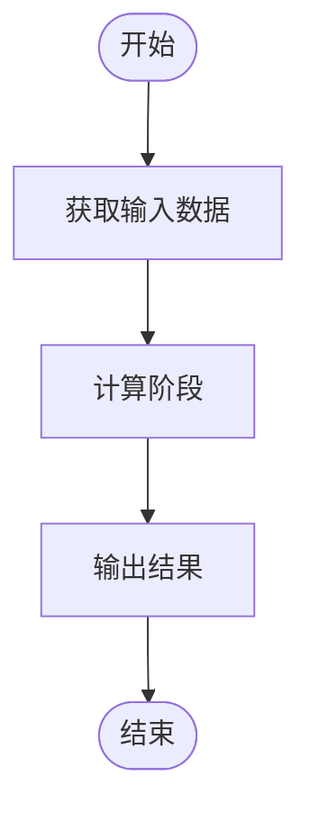
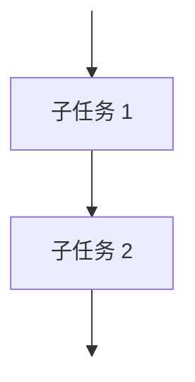
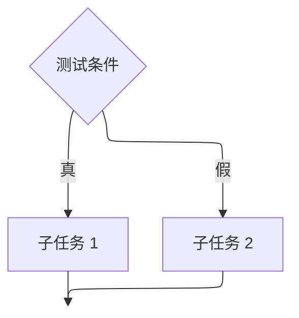

# 汇编语言

## 汇编语言

- 汇编器（assembler）：将汇编语言翻译成机器语言的程序
- 汇编（assembly）：进行翻译的过程
- 反汇编器（disassembler）：将机器语言翻译成汇编语言的程序
- 反汇编（disassembly）：进行反汇编的过程

### 汇编命令（Assemble Directive）

*汇编指示符*以 `.` 作为第一个字符，是告诉汇编器的命令，告诉汇编器代码和数据的位置等信息，还可以指定程序中使用的数据常量等。

程序包括：
- 数据区
- 代码区

*数据区*以 `.data` 作为起始提示，代码区以 `.text` 作为起始提示，如

```riscvasm
           .data
           .align   2
numbers:   .word    6, 3, 4, 6, 8, -2, 45, 5, 8, 5

           .text
           .align   2
           .globl   main
```

为了确保数据/代码对齐到预期的地址，可以使用 `.align` 或 `.balign`：
- `.align n`：将后续的数据/代码存储到以 $n$ 个 $0$ 结尾的地址中，即地址是 $2^n$ 的倍数
    - 如 `.align 2` 表示地址是 $4$ 的倍数
- `.balign n`：
将后续的数据/代码存储到按 $n$ 字节对齐的地址中
    - 如 `.balign 4` 表示紧着的数据保存在内存中时起始地址是按 $4$ 字节对齐，即数据按字（$\pu{32 bits}$）对齐

数据区数据提示：
- `.word`：表示一个字（$\pu{32 bits}$）的数据
    - `.word word1, word2, ...`：表示将 word1, word2, ... 存储在一片连续的存储空间中
    - `numbers: word 6, 3, 4, 6, 8, -2, 45, 5, 8, 5` 表示将这十个整数按字存储在数据区一段连续空间中，并将起始地址标记为 numbers
- `.half`：表示半字（$\pu{16 bits}$）的数据
- `.byte`：表示一个字节（$\pu{8 bits}$）的数据
- `.string`：表示一个字符串
    - 以空字符结尾，即每个字符串末尾再存储一个字节 0x00

全局标记 `.global label`：将 label 程序段标记为全局可见，即可以被其他程序段访问（一个汇编程序可以由多个汇编语言程序文件组成）

### 汇编指令（Assembly Instruction）

格式为

```riscvasm
LABEL   OPCODE   OPERANDS   #COMMENTS
```

- `LABEL`（标记，可选）：用于显式标识存储单元（指令或数据）
    - 命名规范
        - 由字母、数字及下划线组成，以冒号结尾
        - 指令操作码属于保留字，不能用做标记
        - 大小写敏感
    - 在当前文件中定义的，或是其他文件中使用 `.globl` 定义的标记，可以在汇编程序中使用,<u>与定义出现位置无关</u>
    - 没有被程序引用的指令，可以不做标记。即标记常用于跳转
- `OPCODE`（操作码，一个）：
使用助记符表示指令的操作，如 `add`、`sub`、`mov` 等
- `OPERANDS`（操作数，若干个）：可以是寄存器或立即数
    - 寄存器：x0, x1, ..., x31
    - 立即数
        - 通常用十进制数表示
        - 使用前缀 `0x` 的十六进制数表示
        - 使用标记，表示一个存储的*地址*
- `#COMMENTS`（注释，可选）：用于解释指令的作用

#### 整数运算指令

- 操作数为 3 个（除 `lui` 和 `auipc`）

I-型指令汇编格式

```riscvasm
OPCODE   RD, RS1, imm12
```

- `RD`：目标寄存器
- `RS1`：源寄存器 1
- `imm12`：$\pu{12 bits}$ 立即数

如 `addi` 等。

R-型指令汇编格式

```riscvasm
OPCODE   RD, RS1, RS2
```
- `RS2`：源寄存器 2

如 `add` 等。

U-型指令汇编格式

```riscvasm
OPCODE   RD, imm20
```

- `imm20`：$\pu{20 bits}$ 立即数

如 `lui` 等。`lui` 指令常用于*加载一个较大的数*，如 `lui x5, 0x10000`。

#### 数据传送指令

加载指令汇编格式

```riscvasm
OPCODE   RD, imm12(RS1)
```

- `RD`：目标寄存器
- `RS1`：基址寄存器
- `imm12`：偏移量

如 `lw` `lb` `lh` `lbu` `lhu` 等。

存储指令汇编格式

```riscvasm
OPCODE   RS2, imm12(RS1)
```

- `RS2`：目标寄存器

如 `sw` `sb` `sh` 等。

#### 控制指令

条件分支指令汇编格式

```riscvasm
OPCODE   RS1, RS2, LABEL
```

- `RS1`：源寄存器 1
- `RS2`：源寄存器 2
- `LABEL`：目标地址标记

如 `beq` `bne` 等。

无条件跳转指令汇编格式

JAL（绝对跳转）

```riscvasm
jal   RD, LABEL
```

- `RD`：目标寄存器（用于保存返回地址）
    - `RD` 为 `x0` 时，表示不保存返回地址

JALR（相对跳转）

```riscvasm
jalr   RD, imm12(RS1)
```

- `RS1`：基址寄存器
- `imm12`：偏移量

#### 注释

- 单行注释：以 `#` 或 `;` 开头
- 多行注释：以 `/*` 开头，以 `*/` 结尾，类似 C 语言

#### 伪指令

伪指令（pseudo-instruction）：在常规指令基础上实现的伪指令，目的是简化汇编程序员的工作，汇编器可以将其翻译为常规指令，如 `la`（load address，将标记标识的地址，赋值给目标寄存器） 等。

LA 指令汇编格式

```riscvasm
la   RD, LABEL
```

假设 RV32I 使用如下的内存分配方法：
- 将程序分配于 `0x0001 0000` ~ `0x0FFF FFFF`
- 将数据分配于 `0x1000 0000` ~ `0xBFFF FFFF`

对于 `la` 指令，汇编器首先计算出标记相对于当前指令所在位置（即 `PC`）的偏移量 offset（32 位），再将 32 位的 offset 拆分成高 20 位和低 12 位，最后将伪指令 `la` 翻译为如下 2 条指令：

```riscvasm
auipc   RD, offsetHi       # offsetHi = offset[31:12]，即 offset 的高 20 位
addi    RD, RD, offsetLo   # offsetLo = offset[11:0]，即 offset 的低 12 位
```

LI 指令汇编格式

```riscvasm
li   RD, imm
```

伪指令 `li`（load immediate）将一个 32 位的立即数加载到目标寄存器 `RD` 中。同样的

```riscvasm
lui   RD, imm20Hi       # imm20Hi = imm[31:12]，即 imm 的高 20 位
addi  RD, RD, imm12Lo   # imm12Lo = imm[11:0]，即 imm 的低 12 位
```

常用伪指令

| 伪指令            | 汇编指令                 | 含义                               |
| :--               | :--                      | :--                                |
| `la RD, LABEL`    | ```riscvasm                   | 加载地址                           | \
|                   | auipc   RD, offsetHi     |                                    | \
|                   | addi    RD, RD, offsetLo |                                    | \
|                   | ```                      |                                    |
| `li RD, imm`      | ```riscvasm                   | 加载立即数（大于 12 位）           | \
|                   | lui   RD, imm20Hi        |                                    | \
|                   | addi  RD, RD, imm12Lo    |                                    | \
|                   | ```                      |                                    |
| `j LABEL`         | `jal x0, LABEL`          | 跳转（不保存返回地址）             |
| `jr RS1`          | `jalr x0, 0(RS1)`        | 跳转（不保存返回地址）             |
| `beqz RS1, LABEL` | `beq RS1, x0, LABEL`     | 等于零时跳转（其它同理也有类似的） |
| `slt ZRD, RS1`    | `slt RD, RS1, x0`        | 小于零时置位（其它同理也有类似的） |
| `mv RD, RS1`      | `addi RD, RS1, 0`        | 寄存器间数据传送                   |
| `not RD, RS1`     | `xori RD, RS1, -1`       | 按位取反                           |

## 汇编过程

*汇编过程*即汇编器将汇编语言程序翻译成机器语言程序的过程。

通过「两趟扫描」完成翻译：
- 第一趟扫描
    - 标识出符号地址（标记）对应的实际的内存地址
    - 建立符号表
- 第二趟扫描
    - 将汇编语言翻译成机器语言

例如


01  #
02  # 计算一列数之和
03  #
04              .data
05              .align      2
06  numbers:    .word       6, 3, 4, 6, 8, -2, 45, 5, 8, 5
07  #
08  # 初始化
09  #
0A              .text
0B              .align      2
0C              .globl      main
0D  main:       la          x5, numbers     # x5，整数地址
0E              andi        x8, x0, 0       # x8 清零，一列数之和
0F              addi        x9, x0, 10      # x9，整数个数
10  #
11  # 循环计算
12  #
13  again:      beq         x9, x0, exit
14              lw          x6, 0(x5)
15              add         x8, x6, x8
16              addi        x5, x5, 4       # x5，跟踪下一个整数地址
17              addi        x9, x9, -1
18              jal         x0, again
19  exit:       ......                      # 下一个任务


使用 `LC`（location counter）记录当前指令的地址。

从程序顶部开始。

第一趟扫描：
- 01 到 03 行：抛弃注释
- 04 行：下面的内容位于数据区，`LC` 更新为 `0x1000 0000`
- 05 行：`LC` 不变，因为数据已对齐
- 06 行：发现标记 numbers，将其地址记录在符号表中，`LC`值增加 40（十个字），即 `0x1000 0028`
  |  符号   |     地址      |
  |   :-:   |      :-:      |
  | numbers | `0x1000 0000` |
- 07 到 09 行：抛弃注释
- 0A 行：下面的内容位于代码区，`LC` 更新为 `0x0001 0000`
- 0B 行：`LC` 不变，因为代码已对齐
- 0C 行：`main` 为全局标记，`LC` 不变
- 0D 行：发现标记 main，将其地址记录在符号表中，`LC` 值增加 8（伪指令对应两条基本指令），即 `0x0001 0008`
  |  符号   |     地址      |
  |   :-:   |      :-:      |
  | numbers | `0x1000 0000` |
  |  main   | `0x0001 0000` |
- 0E 行：`LC` 增加 4，即 `0x0001 000C`
- 0F 行：`LC` 增加 4，即 `0x0001 0010`
- 10 到 12 行：抛弃注释
- 13 行：发现标记 again，将其地址记录在符号表中，`LC` 增加 4，即 `0x0001 0014`
  |  符号   |     地址      |
  |   :-:   |      :-:      |
  | numbers | `0x1000 0000` |
  |  main   | `0x0001 0000` |
  |  again  | `0x0001 0010` |
- 14 到 18 行：`LC` 增加 20（五条指令），即 `0x0001 0028`
- 19 行：发现标记 exit，将其地址记录在符号表中，`LC` 增加 4，即 `0x0001 002C`
  |  符号   |     地址      |
  |   :-:   |      :-:      |
  | numbers | `0x1000 0000` |
  |  main   | `0x0001 0000` |
  |  again  | `0x0001 0010` |
  |  exit   | `0x0001 0028` |


01  #
02  # 计算一列数之和
03  #
04              .data
05              .align      2
06  numbers:    .word       6, 3, 4, 6, 8, -2, 45, 5, 8, 5
07  #
08  # 初始化
09  #
0A              .text
0B              .align      2
0C              .globl      main
0D  main:       la          x5, numbers     # x5，整数地址
0E              andi        x8, x0, 0       # x8 清零，一列数之和
0F              addi        x9, x0, 10      # x9，整数个数
10  #
11  # 循环计算
12  #
13  again:      beq         x9, x0, exit
14              lw          x6, 0(x5)
15              add         x8, x6, x8
16              addi        x5, x5, 4       # x5，跟踪下一个整数地址
17              addi        x9, x9, -1
18              jal         x0, again
19  exit:       ......                      # 下一个任务


第二趟扫描：
- 01 到 03 行：抛弃注释
- 04 行：`LC` 更新为 `0x1000 0000`
- 05 行：`LC` 不变
- 06 行：将十个整数依次翻译为二进制补码整数，`LC` 增加 40，即 `0x1000 0028`
  |     地址      |     数据      | 解释 |
  |      :-:      |      :-:      | :-:  |
  | `0x1000 0024` | `0x0000 0005` |  5   |
  | `0x1000 0020` | `0x0000 0008` |  8   |
  | `0x1000 001C` | `0x0000 0005` |  5   |
  | `0x1000 0018` | `0x0000 002D` |  45  |
  | `0x1000 0014` | `0xFFFF FFFE` |  -2  |
  | `0x1000 0010` | `0x0000 0008` |  8   |
  | `0x1000 000C` | `0x0000 0006` |  6   |
  | `0x1000 0008` | `0x0000 0004` |  4   |
  | `0x1000 0004` | `0x0000 0003` |  3   |
  | `0x1000 0000` | `0x0000 0006` |  6   |
- 07 到 09 行：抛弃注释
- 0A 行：`LC` 更新为 `0x0001 0000`
- 0B 到 0C 行：`LC` 不变
- 0D 行：查找符号表 numbers 为 `0x1000 0000`，`LC` 为 `0x0001 0000`，则 numbers - `LC` 为 `0x0FFF 0000`。将伪指令翻译为基本指令：
  ```riscvasm
  auipc   x5, 0xFFF0
  addi    x5, x5, 0
  ```
  翻译为机器指令：
  |     地址      |   机器指令    |  解释   |
  |     :-:       |     :-:       |   :-:   |
  | `0x0001 0004` | `0x0002 8293` |  `addi` |
  | `0x0001 0000` | `0x0FFF 0297` | `auipc` |

  `LC` 增加 8，即 `0x0001 0008`
- 0E 到 0F 行：直接翻译，`LC` 增加 8，即 `0x0001 0010`
  |     地址      |   机器指令    |  解释   |
  |     :-:       |     :-:       |   :-:   |
  | `0x0001 000C` | `0x00A0 0493` |  `addi` |
  | `0x0001 0008` | `0x0004 7413` |  `andi` |
- 10 到 12 行：抛弃注释
- 13 行：翻译 `beq x9, x0, exit`。查找符号表 exit 为 `0x0001 0028`，`LC` 为 `0x0001 0010`，则 exit - `LC` 为 `0x0000 0018`。翻译为机器指令：
  |     地址      |   机器指令    |  解释   |
  |     :-:       |     :-:       |   :-:   |
  | `0x0001 0010` | `0x0004 8C63` |  `beq`  |

  `LC` 增加 4，即 `0x0001 0014`
- 14 到 17 行：直接翻译，`LC` 增加 16，即 `0x0001 0024`
  |     地址      |   机器指令    |  解释   |
  |     :-:       |     :-:       |   :-:   |
  | `0x0001 0020` | `0xFFF4 8493` | `addi`  |
  | `0x0001 001C` | `0x0042 8293` | `addi`  |
  | `0x0001 0018` | `0x0083 0433` |  `add`  |
  | `0x0001 0014` | `0x0002 A303` |  `lw`   |
- 18 行：翻译 `jal x0, again`。查找符号表 again 为 `0x0001 0010`，`LC` 为 `0x0001 0024`，则 again - `LC` 为 `0xFFFF FFEC`（-20）。翻译为机器指令：
  |     地址      |   机器指令    |  解释   |
  |     :-:       |     :-:       |   :-:   |
  | `0x0001 0024` | `0xFEDF F06F` |  `jal`  |

  `LC` 增加 4，即 `0x0001 0028`

最终结果为

符号表
|  符号   |     地址      |
|   :-:   |      :-:      |
| numbers | `0x1000 0000` |
|  main   | `0x0001 0000` |
|  again  | `0x0001 0010` |
|  exit   | `0x0001 0028` |

机器指令
|     地址      |     数据      |  解释   |
|      :-:      |      :-:      |   :-:   |
| `0x1000 0024` | `0x0000 0005` |    5    |
| `0x1000 0020` | `0x0000 0008` |    8    |
| `0x1000 001C` | `0x0000 0005` |    5    |
| `0x1000 0018` | `0x0000 002D` |   45    |
| `0x1000 0014` | `0xFFFF FFFE` |   -2    |
| `0x1000 0010` | `0x0000 0008` |    8    |
| `0x1000 000C` | `0x0000 0006` |    6    |
| `0x1000 0008` | `0x0000 0004` |    4    |
| `0x1000 0004` | `0x0000 0003` |    3    |
| `0x1000 0000` | `0x0000 0006` |    6    |
|      ...      |      ...      |   ...   |
| `0x0001 0024` | `0xFEDF F06F` |  `jal`  |
| `0x0001 0020` | `0xFFF4 8493` | `addi`  |
| `0x0001 001C` | `0x0042 8293` | `addi`  |
| `0x0001 0018` | `0x0083 0433` |  `add`  |
| `0x0001 0014` | `0x0002 A303` |  `lw`   |
| `0x0001 0010` | `0x0004 8C63` |  `beq`  |
| `0x0001 000C` | `0x00A0 0493` | `addi`  |
| `0x0001 0008` | `0x0004 7413` | `andi`  |
| `0x0001 0004` | `0x0002 8293` | `addi`  |
| `0x0001 0000` | `0x0FFF 0297` | `auipc` |

## C 程序设计语言

### 程序设计语言

程序设计语言：
- **语法**（syntax）：表示程序的形式，表示构成语言的各个符号之间的组合规律
- **语义**（semantics）：表示程序的含义，表示按照各种方法所表示的各个符号的特定含义

### 解释与编译

翻译：
- **解释**（interpretation）
    - 使用解释技术，需要使用一个被称为解释器的翻译程序读入高级语言编写的程序，执行程序员指示的操作
    - 高级语言程序不是被计算机直接执行的，而是被解释程序所执行
    - 解释器是一个执行程序的虚拟机，一次能够翻译高级语言程序的一段、一行、一条命令或一个子程序
- **编译**（compilation）
    - 使用编译技术，需要使用一个被称为编译器的翻译程序，完成将高级语言编写的程序翻译为机器语言的工作
    - 编译器的输出被称为可执行映像，它可以直接在目标计算机上执行
    - 一个程序只需要被编译一次就可以多次执行

优劣对比：
- 解释
    - 容易开发调试
    - 解释器允许一次执行程序代码中的一段
    - 允许程序员查看中间的结果，并且在执行时修改代码，容易调试
    - 程序执行需要更多的开销
- 编译：
    - 可以产生更高效的代码，能够更加有效的使用内存，程序执行更快

绝大多数商业化软件趋向于使用*编译技术*，*解释技术*在开发和研究中经常使用。

### C 程序

!!! memo ""
    大部分都是基础知识，不记了。

## 结构化程序设计（Structured Programming）

也被称为<u>系统分解</u>：
- 思路：将一个描述复杂的问题，系统地分解成足够小的和可管理的单元/模块，从而能够编写成可以正确执行的程序
- 核心：将一个大规模的工作，系统地分解为更小的单元/模块（模块化）

系统分解思想使用三种基本控制结构：
- 顺序（sequential）
- 选择/判定（conditional/branching/decision-making）
- 循环/重复（loop/iteration）

流程图：
- 圆角矩形：开始/结束
- 矩形：执行的任务
- 菱形：判定
- 箭头：流程方向



### 顺序结构

- 将一个指定的任务分解成两个子任务，一个接着一个执行
- 当执行完第一个子任务之后再继续执行下一个子任务
- 而从第二个子任务返回第一个子任务的情况永远不会发生



### 选择结构

- 又称判定结构，根据条件的不同每次只执行两个子任务中的一个
- 当条件为真时，执行某一个子任务，若为假则执行另一个
- 任何一个子任务都可以为空，也就是说，选择结构中允许「什么都不做」
- 不管结果如何，当正确的子任务执行完后，程序始终向前行进，永远不会回头去再次测试条件



!!! memo ""
    也许该学下 PlantUML。

### 顺序结构

- 将一个指定的任务分解成两个子任务，一个接着一个执行
- 当执行完第一个子任务之后再继续执行下一个子任务
- 而从第二个子任务返回第一个子任务的情况永远不会发生


### 选择结构

- 又称判定结构，根据条件的不同每次只执行两个子任务中的一个
- 当条件为真时，执行某一个子任务，若为假则执行另一个
- 任何一个子任务都可以为空，也就是说，选择结构中允许「什么都不做」
- 不管结果如何，当正确的子任务执行完后，程序始终向前行进，永远不会回头去再次测试条件


!!! memo ""
    也许该学下 PlantUML。

<style>
@media (prefers-color-scheme: dark) {
    img[src$='#invert'] {
        -webkit-filter: invert(1);
        filter: invert(1) hue-rotate(180deg);
        mix-blend-mode: screen;
    }
}
</style>

if 结构


if-else 结构


级联的 if-else 结构


switch 结构


### 循环结构

while 结构


for 结构


## C 程序到 RISC-V

C 语言编译器会将代码转换为汇编语言，然后将汇编语言转换为机器语言，使计算机能够理解和执行该代码。这个过程通常分为四个步骤：
1. 预处理
2. 编译
3. 汇编
4. 链接

详细介绍：
1. 预处理（使用 preprocessor）：在编译 C 代码之前，预处理器会扫描代码并执行一些预处理操作，如宏替换、头文件包含和条件编译等
    - 输入 `*.c`，输出 `*.i`
2. 编译（使用 compiler）：
编译器会将代码转换为汇编语言，汇编语言描述了计算机的指令和寄存器信息
    - 输入 `*.i`，输出 `*.s`
3. 汇编（使用 assembler）：汇编器将汇编语言代码转换为目标机器语言代码（object code），并将其存储在可执行文件中
    - 输入 `*.s`，输出 `*.o`
    - 若目标代码文件中存在存在外部方法或变量的引用，进入链接阶段
4. 链接（使用 linker）：如果代码中包含外部函数或变量的引用，链接器会将这些引用解析为实际的函数或变量，并将它们与可执行文件中的代码进行链接
    - 输入 `*.o`，输出可执行文件
    - 链接器将多个目标文件和库文件连接成一个可执行文件
