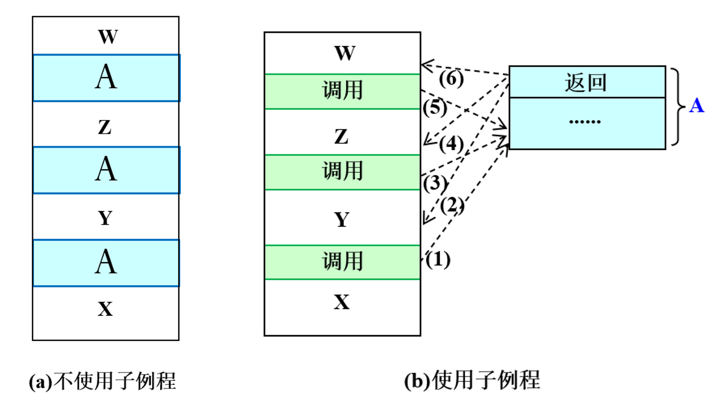

## 子例程

- 子程序（program， procedure）
    - 将一个组件的功能与其实现的细节分隔开来
    - 程序员只需理解组件的结构，不需要考虑其实现的细节，就能够把该组件作为一个程序块使用
    - 子程序使程序员能够以模块化的方式写程序，提高了构建复杂计算系统的能力
- 子例程（subroutine, function）
    - 在一个程序中，多次执行某个程序片段
        - 在程序内，不必每次给出这个程序片段
        - 通过多次调用该程序片段实现

调用-返回机制

<style>
@media (prefers-color-scheme: dark) {
    img[src$='#invert'] {
        -webkit-filter: invert(1);
        filter: invert(1) hue-rotate(180deg);
        mix-blend-mode: screen;
    }
}
</style>



通常设置 `jal`/`jalr` 目的寄存器为 x1，保存返回地址/链接；基址寄存器一般为 x5。

- `jal`
    - 计算出的地址被限制于内存一定范围中
    - 偏移范围为 $-20^{20} \backsim 2^{20} - 2$
- `jalr`
    - 无限制

伪指令 `call` 用于调用子例程

```risvasm
call LABEL
```

等价于

```risvasm
auipc RD, offsetHi       # offsetHi 为 offset 高 20 位
jalr  x1, offsetLo(RD)   # offsetLo 为 offset 低 12 位
```

伪指令 `ret` 用于从子例程返回

```risvasm
ret
```

等价于

```risvasm
jalr x0, 0(x1)
```

### 被调用者保存寄存器（callee-saved register）

由被调用者（callee）完成寄存器保存/恢复工作。

```risvasm
01              .data
02              .align  2
03 SaveReg1:    .word   0               # 保存寄存器的空间
04 #
05              .text
06              .align  2
07 # 省略代码，x8 <- x
08              addi    x10, x0, 3      # x10 <- 3，被乘数
09              addi    x11, x0, -2     # x11 <- -2，乘数
0A              call    Multiply
0B              ......                  # 使用 x8 做计算
0C              ......                  # 下一个任务
0D #
0E Multiply:    la      x5, SaveReg1
0F              sw      x8, 0(x5)       # callee save
10              andi    x9, x9, 0       # x9，积
11 Mloop:       beqz    x11, Mexit      # x11，乘数
12              andi    x8, x11, 1
13              beqz    x8, Mnext
14              add     x9, x9, x10     # x10，被乘数
15 Mnext:       srli    x11, x11, 1
16              slli    x10, x10, 1
17              j       Mloop
18 Mexit:       lw      x8, 0(x5)       # 寄存器恢复
19              ret
```

0E 和 0F 行将 x8 的值 x 保存到预留的空间中；18 行将 x8 的值恢复。

### 参数和返回值

```risvasm
......          ......
08              addi    x10, x0, 3      # x10 <- 3，被乘数
09              addi    x11, x0, -2     # x11 <- -2，乘数
0A              call    Multiply        # 调用子例程
......          ......
10              andi    x9, x9, 0       # x9，积
14              add     x9, x9, x10     # x10，被乘数
19              ret                     # 从子例程返回调用者
```

- 对于 Multiply 子例程：
    - x10 和 x11 是参数，x9 是返回值
- 对于调用 Multiply 子例程的程序
    - 先传递参数值，即为 x10 和 x11 赋值
    - 调用返回后，通过返回值 x9 得到乘法计算结果

### 调用者保存寄存器（caller-saved register）

由调用者（caller）完成的寄存器保存/恢复工作。

```risvasm
......
09 SaveReg2:    .word   0, 0
......
1F              la  x6, SaveReg2
20              sw  x11, 0(x6)          # caller save
......
22              addi    x11, x0, 10     # x11，乘数
23              call    Multiply        # x9 = x10 * 10
......
25              la  x6, SaveReg2
26              lw  x11, 0(x6)          # 寄存器恢复
......
29              addi    x11, x11, 1     # x11 指向下一个字符
......
2C DoneS2I:     ret
```

09 行使用数据区的存储单元作为保存寄存器的空间；1F 和 20 行将 x11 的值保存到预留的空间中；25 和 26 行：将 x11 的值恢复。

在 23 行执行 `call` 后，x1 被改变（为 24 行 PC 值），待该子例程在 2C 行 `ret` 返回时，会返回到 24 行，发生了错误！

```risvasm
......
09 SaveReg2:    .word 0, 0
......
1F              la  x6, SaveReg2
......
21              sw  x1, 4(x6)        # caller save
......
23              call  Multiply       # x9 = x10 * 10
......
25              la  x6, SaveReg2
......
27              lw  x1, 4(x6)        # 寄存器恢复
......
2C DoneS2I:     ret
```

09 行使用数据区的存储单元作为保存寄存器的空间；21 行将 x1 的值保存到预留的空间中；27 行将 x1 的值恢复。

### 寄存器的保存/恢复

基本原则：如果一个寄存器内的值将在该寄存器的值被改变之后再次被用到，必须在其值被改变之前将其保存，在再次使用它之前将其恢复。
- 通过将寄存器的值*存进内存*，来保存它的值
- 通过将内存保留的值*加载回寄存器*，来恢复它的值

!!! note ""
    如果在<u>子例程中又调用了子例程</u>，必须采用 caller-saved（调用者保存）的策略，保存/恢复返回地址 x1

RISC-V 各寄存器的 Saved by 可见 [5-指令集体系](./5-instruction-set-architecture)。

- caller-saved 寄存器
    - 维护责任：*调用者*
    - *调用者*要在子例程的调用前/后，保存/恢复寄存器
    - *被调用者*不用关心这些寄存器旧值，可以直接覆写
    - 必须在每次发生子例程调用前后都进行保存恢复
- callee-saved 寄存器
    - 维护责任：*被调用者*
    - 这些寄存器在使用前/后必须由*被调用者*保存/恢复
    - *调用者*可以认为子例程返回后这些寄存器是没有被改写的
    - 在子例程调用时不需要*调用者*做任何动作

## 递归过程

即在一个子例程中调用这个子例程本身，称为递归子例程。

计算前 $n$ 个正整数的和（本例取 $n = 3$）：

$$
S_n = S_{n - 1} + n
$$

初始条件 $S_1 = 1$。

将 $n$ 的值赋给 x10，调用 Sn 子例程，返回结果在 x11 中。

```risvasm
01              .data
02              .align  2
03 SaveReg:     .word   0
04 #
05              .text
06              .align  2
07              .globl  main
08 main:        addi    x10, x0, 3       # n = 3
09              jal     x1, Sn           # call  Sn
0A              j       end
0B #
0C Sn:          la      x5, SaveReg
0D              sw      x1, 0(x5)        # caller save
0E              addi    x6, x0, 1
0F              beq     x10, x6, exit1   # n == 1 ?
10              addi    x10, x10, -1     # n - 1
11              jal     x1, Sn           # 调用 S(n-1)
12              addi    x10, x10, 1      # n
13              add     x11, x11, x10    # S(n) = S(n-1) + n
14              j       exit2
15 exit1:       addi    x11, x0, 1       # S(1) = 1
16 exit2:       la      x5, SaveReg
17              lw      x1, 0(x5)
18              ret
```

但是这样每一层递归都将 x1 保存在了 SaveReg 中，导致了浅层次保存的结果被覆盖，因此会产生无限循环。

即递归调用子例程时，保存返回地址 x1 的指令将前一次保存的寄存器值覆盖了.

采用栈机制解决。

### 栈

栈是一种后进先出（LIFO, **L**ast **I**n, **F**irst **O**ut）的数据结构，栈顶指针指向栈顶元素。

栈操作：
- 压栈（push）：将数据压入栈顶，栈顶指针加 1
- 出栈（pop）：将栈顶数据弹出，栈顶指针减 1

栈指针：
- x2 寄存器
- 永远指向栈顶

内存中的栈实现：

初始地址 x2 指向 `0xBFFF FFF0`。栈从高地址向低地址，即栈顶地址最小，栈顶在下（底）。

将保存在 x9 中的数值压栈：

```risvasm
push:   addi    x2, x2, -4
        sw      x9, 0(x2)
```

将栈顶的数值弹出到 x9：

```risvasm
pop:    lw      x9, 0(x2)
        addi    x2, x2, 4
```

栈协议：
- 是一组对内存的访问控制规则
- 满足后进先出（LIFO）原则
- 包含方法：PUSH, POP

改进后的递归调用：

```risvasm
01              lui    x2, 0xc0000
02              addi   x2, x2, -16       # x2 = 0xBFFF FFF0
03              addi   x10, x0, 3        # n = 3
04              jal    x1, Sn            # call Sn
05              j      end
06 #
07 Sn:          addi    x2, x2, -4       # push x1
08              sw      x1, 0(x2)
09              addi    x6, x0, 1
0A              beq     x10, x6, exit1   # n == 1 ?
0B              addi    x10, x10, -1     # n - 1
0C              jal     x1, Sn           # S(n-1)
0D              addi    x10, x10, 1      # n
0E              add     x11, x11, x10    # S(n) = S(n-1) + n
0F              j       exit2
10 exit1:       addi    x11, x0, 1       # x11，S(1) = 1
11 exit2:       lw      x1, 0(x2)        # pop x1
12              addi    x2, x2, 4
13              ret
```
