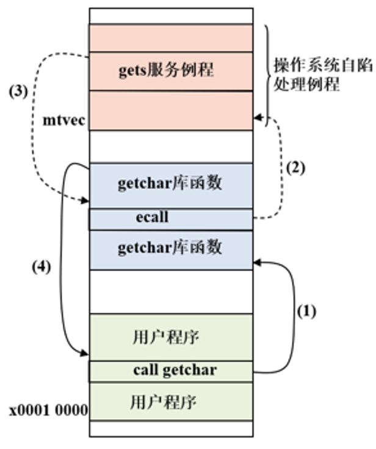

## 简单的输入和输出

### 键盘和显示器

输入/输出（**I**nput/**O**utput, I/O）

键盘和显示器
- 字符设备
- 面向流的设备
- 字符依次读写
- 按照先后顺序

最简单的 I/O 设备通常至少包括
- 保存在计算机和设备之间进行传输的*数据寄存器*
    - 例如键盘数据寄存器为 KBDR (keyboard data register) 中存储的是用户输入的字符的 ASCII 码
- 保存设备的状态信息的*控制寄存器*
    - 设备是处于可用的状态还是正忙于执行最近的 I/O 任务，例如键盘的 KBCR (keyboard control register)

键盘设备寄存器
- 每个设备寄存器 32 位
- KBDR：[7:0] 位用来存放数据，[31:8] 位包含 x000000
- KBCR：[0] 位，就绪位

显示器设备寄存器
- 每个设备寄存器 32 位
- DDR：[7:0] 位用来存放数据，[31:8] 位包含 x000000
- DCR：[0] 位，就绪位

### 内存映射 I/O

设置或加载 I/O 设备寄存器中的数据两种机制
- 专门 I/O 指令
    - 如 x86 指令集 in/out
    - 通用寄存器 $\leftrightarrow$ I/O 设备寄存器
- 数据传送指令
    - 通用寄存器 $\leftrightarrow$ 存储器
    - 内存映射 I/O

表示 I/O 设备寄存器的方式：**内存映射**
- 每一个 I/O 设备寄存器都被分配一个存储器地址空间中的地址
- 这些地址被分配给 I/O 设备寄存器，而不再是存储单元

例如 `xFFFF 0000` 到 `xFFFF 00FF` 被分配给 I/O 设备寄存器，其它地址分配给存储单元：

|            地址            | I/O 寄存器 |
|            :-:             |    :-:     |
| `xFFFF 0000` ~ `xFFF 0003` |    KBCR    |
| `xFFFF 0004` ~ `xFFF 0007` |    KBDR    |
| `xFFFF 0008` ~ `xFFF 000B` |    DCR     |
| `xFFFF 000C` ~ `xFFF 000F` |    DDR     |

### 异步问题

假如 x6 中保存了 KBDR 地址，则可以用

```riscvasm
lw x11, 0(x6)
```

将 KBDR 中数据读入 x11。

但需考虑异步问题：例如执行指令时用户还尚未输入新字符，就会将 KBDR 之前存储的数据读入 x11 中。

异步问题
- I/O 的执行与处理器的执行不同步
- 无法保证在 I/O 设备寄存器存取时输入端的信号已就绪

微处理器指令和用户键盘输入的不同点：
- 微处理器：时钟控制下执行指令
- 用户键盘输入：不受时钟控制，随时可能发生

显示器同理，若使用下面的指令将 x11 的值存储到 DDR 中

```riscvasm
sw x11, 0(x6)
```

同样有异步问题：若执行指令时显示器尚未将上一个 DDR 中字符显示完成，则会将 DDR 之前存储的数据覆盖。

### 处理 I/O 异步问题

使用**协议/握手机制**。

设备各有 1 位标志*就绪位*，在设备状态寄存器的 [0] 位。
- 键盘 KBCR[0]：是否输入了一个字符
    - 每当字符输入一个字符，键盘控制器就绪位设为 1（此时键盘不可用）
    - 处理器读取字符时，键盘控制器将就绪位清 0（此时允许读取下一个字符）
- 显示器 DCR[0]：被送给显示器的字符是否已被显示
    - 每当显示器完成了一个字符的显示，显示器控制器将 DSR[0] 设为 1（显示器就绪，可以写入新字符）
    - 每当处理器向 DDR 写字符时，显示器控制器将 DSR[0] 清空（显示器正忙，当前字符未完成显示）

### 轮询模式

轮询模式
- 周期性的检查状态位，判断是否执行 I/O 操作
- 由处理器完全控制和执行与 I/O 的通信工作

轮询获取键盘输入的指令序列

```riscvasm
......
01 KBCR:        .word   xFFFF0000       # KBCR 内存映射的起始地址
02 KBDR:        .word   xFFFF0004       # KBDR 内存映射的起始地址
......
03              la      x5, KBSR 
04 INPOLL:      lw      x6, 0(x5)       # 测试是否有字符被输入
05              lw      x7, 0(x6)
06              andi    x6, x7, 1
07              beqz    x6, INPOLL      # 如果 KBCR[0] == 0，轮询
08              la      x5, KBDR
09              lw      x6, 0(x5)
0A              lw      x11, 0(x6)      # 将 KBDR 中的数据加载到 x11
0B              j       ......          # 执行下一个任务
```

轮询使用显示器输出的指令序列

```riscvasm
......
01 DCR:         .word   xFFFF0008       # DCR 内存映射的起始地址
02 DDR:         .word   xFFFF000C       # DDR 内存映射的起始地址
......
03              la      x5, DCR 
04 OUTPOLL:     lw      x6, 0(x5)       # 测试显示器是否就绪
05              lw      x7, 0(x6)
06              andi    x6, x7, 1
07              beqz    x6, OUTPOLL     # 如果 DCR[0]==0，轮询
08              la      x5, DDR
09              lw      x6, 0(x5)
0A              sw      x11, 0(x6)      # 将 x11 中的数据写到 DDR
0B              j       ......          # 执行下一个任务
```

若读取键盘数据时，键盘状态是未就绪，假设
- CPU 的时钟频率是 300MHz
- 那么，一个时钟周期是 3.3 纳秒
- 处理执行一条指令平均需要 10 个时钟周期
- 那么，执行一条指令的平均时间是 33 纳秒

用户在 1 秒后输入一个字符，若轮询指令序列含 10 条指令，则处理器执行指令序列约 300 万次，才能读到字符，浪费了大量的处理器时间。

## 自陷机制

完善 I/O 模式中，硬件寄存器中有*特权*。没有正确的特权级别的应用程序无法访问硬件寄存器。

RISC-V 特权：

| Level | Encoding |       Name       | Abbr |
|  :-:  |   :-:    |       :-:        | :-:  |
|   0   |    00    | User/Application |  U   |
|   1   |    01    |    Supervisor    |  S   |
|   2   |    10    |    *Reserved*    |  -   |
|   3   |    11    |     Machine      |  M   |

操作系统**自陷**（TRAP）机制
- 用户的程序通过自陷指令，将控制权交给操作系统
- 由于操作系统拥有适当的特权级别，可以操作硬件寄存器，实现 I/O 行为
- 用户则不需要理解 I/O 行为的实现细节，由操作系统完成这层抽象

系统自陷（TRAP）
- 操作系统是拥有特权级别的系统程序，对计算机系统的资源（如内存和寄存器等）有高级别的访问权限
- 而用户程序只能访问有限的系统资源
- 从用户程序调用操作系统的*服务例程*，就是从用户模式到了拥有更高特权级别的特权模式下，这个过程被称为<u>系统自陷</u>
- 系统调用必须使用能够改变特权级别的指令，以及在特权模式下可以使用的*特权指令*来实现

### RISC-V 指令集定义的工作模式

- 用户程序工作于*用户模式*下
- 操作系统可工作于*机器模式*下

改变特权级别的指令
- `ecall` 指令（Environment Call，环境调用）：从用户模式进入机器模式
- `mret` 指令（Machine Return，从机器模式返回）：从操作系统返回到用户程序

特权指令
- `csrrw` 指令（Control Status Register Read/Write，读/写控制状态寄存器）：在操作系统中访问系统的控制状态寄存器

#### `ecall` 指令

- 环境调用（Environment Call）
- 向更高特权级发起请求
- 从用户模式进入机器模式
- 从用户程序自陷进入操作系统的服务例程
    - 修改 PC 的值为操作系统处理自陷子例程的起始地址
    - 提供一个用于返回调用者程序的地址
    - 改变工作模式，从用户模式进入机器模式

指令格式
- opcode：1110011，是 I-型指令
- funct：[14:12] 位 000 代表改变特权级别，[31:20] 位全为零，代表环境调用指令
    - 将 PC 的值，即返回链接，写入一个特殊寄存器 mepc（Machine Exception Program Counter，机器模式异常程序计数器）中
    - 再将一个特殊寄存器 mtvec（Machine Trap Vector，机器模式自陷向量基址寄存器）中的值，加载到 PC 中
        - mtvec，硬连线的值，即操作系统自陷处理子例程的起始地址
    - 将一个特殊寄存器 mstatus（Machine Status，机器状态寄存器）中的相应位（如 [12:11] 位）设置为机器模式（如 11）
    - 有权访问特殊寄存器和全部内存

当用户程序自陷进入操作系统后，系统应当执行哪一个服务例程？

系统预先为每个服务例程分配一个唯一的系统调用编号。用户程序在 `ecall` 指令之前，需要传递系统调用参数
- x10 寄存器（a0）：系统调用编号
- x11 寄存器（a1）：系统调用参数/返回值

#### `csrrw` 指令

自陷后系统如何将控制返回到用户程序？

一旦操作系统执行完服务子例程，将 PC 指向用户程序的 `ecall` 指令后面一条指令的地址，从而恢复用户程序的控制。

如何读/写特殊寄存器 mepc？使用 `csrrw` 特权指令。

`csrrw` 指令是用于读/写特殊寄存器的特权指令。

mepc, mtvec, mstatus 等都是特殊的控制状态寄存器（Control Status Register, CSR）

指令为每一个 CSR 分配一个 12 位的编码。
- mstatus 为 0x300
- mtvec 为 0x305
- mepc 为 0x341

指令格式
- opcode：1110011，I-型 指令
- funct：[14:12] 为 001，代表读/写特殊寄存器指令，[31:20] 为 CSR 编码
- 读 CSR 时，将 RS1 设置为 x0
    - `csrrw RD, CSR, x0`
- 写 CSR 时，将 RD 设置为 x0
    - `csrrw x0, CSR, RS1`

```riscvasm
csrrw   x5, mepc, x0    # x5 <- mepc
addi    x5, x5, 4       # x5 <- mepc + 4
csrrw   x0, mepc, x5    # mepc <- mepc + 4
```

#### `mret` 指令

如何将控制从操作系统返回到用户程序？使用改变特权级别的 `mret` 指令。

指令格式
- opcode：1110011，I-型指令
- funct：[31:20] 函数码为 0011 000 0010，表示从机器模式返回

`mret` 指令用于从系统自陷中返回。
- 将 mepc 写入 PC
- 将 mstatus[12:11] 恢复为 00，即返回到产生自陷的用户模式

#### 操作系统的服务例程

为用于处理自陷的子例程

```riscvasm
01 TrapVec:      .word   ......              # 自陷向量表
02               ......                      # 省略代码
03 mtvec:        addi    x2, x2, -4          # x2，栈指针
04               sw      x5, 0(x2)           # callee-save
05               addi    x2, x2, -4
06               sw      x6, 0(x2)           # push
07               la      x5, TrapVec         # 基址
08               slli    x6, x10, 2          # 偏移量，x10 系统调用号
09               add     x5, x5, x6      
0A               lw      x5, 0(x5)
0B               jr      x5
0C               ......                      # 省略代码
0D # 令 x10 = 4，找到输出字符串的服务例程
0E puts:        ......                       # 省略向显示器输出字符串
0F              csrrw   x5, mepc, x0
10              addi    x5, x5, 4
11              csrrw   x0, mepc, x5         # mepc <- mepc + 4
12              lw      x6, 0(x2)            # 寄存器恢复
13              addi    x2, x2, 4
14              lw      x5, 0(x2)
15              addi    x2, x2, 4            # pop
16              mret                         # 从自陷返回
17              ......                       # 省略代码
```

自陷向量表：存储了系统调用的服务例程起始地址的空间，从而不需要将 x10 与每一个系统调用号进行比较判断。
- 标记 TrapVec 是自陷向量表的基址
- TrapVec + n 中保存的是响应自陷的服务例程的程序起始地址

在进入 puts 服务例程时，省略了寄存器保存的过程.自陷到服务例程和子例程调用相同，需要使用「栈机制」。

被调用程序，即服务例程，知道需要使用哪些寄存器来完成它的工作，而调用者，即用户程序，不知道哪些寄存器的值将被破坏。

- 03~06 行：采用 callee-save（被调用者保存）策略
- 07~0B 行：根据 x10 中的系统调用号，跳转到相应的服务例程去执行
- 0F~11 行：`mepc <- mepc + 4`，准备好返回地址
- 12~15 行：采用 callee-save（被调用者保存）策略
- 16 行：`PC <- mepc`，返回用户程序

## C 语言的 I/O 实现

**I/O** 流
- 一种抽象：输入和输出以流的形式进入或离开缓冲区
    - 这种抽象的流适用于字符的 I/O 
- 常用的输入流
    - 键盘
    - 当一个字符被键入，添加到流的末尾处
    - C 程序则从 I/O 流的开头处读取输入
- 常用的输出流
    - 打印机
    - C 程序将待打印的字符添到输出流的末尾处
    - 打印机则从 I/O 流的开头处打印输出

C 语言标准输入输出流（stdin/stdout/stderr）
- `stdin`：标准输入流
    - 默认映射到键盘输入
    - C 语言使用 getchar 函数返回 stdin 中的下一个输入字符的ASCII码
- `stdout`：标准输出流
    - 默认映射到屏幕输出
    - C 语言使用 putchar 函数将下一个待输出字符的ASCII码添加到 stdout 中
- `stderr`：标准错误流
    - 用于输出错误信息

C 语言 I/O 流的实现
- 通过在 I/O 服务例程的基础上，增加了额外的软件层实现
- 例如，调用库函数 `getchar()`
- 先从 stdin 中读字符，如果有字符，就不需要进行系统调用
- 使用 I/O 流，可以有效减少系统调用次数，从而减少了由于系统运行状态的切换带来的开销
- 不必再从用户模式切换到机器模式，最后再从自陷返回
- 如果 stdin 中已经没有字符，则自陷进入操作系统



```riscvasm
01 stdin:       .byte   0, 0, ......         # 标准输入流，共 size 个字节，初值均为 0/null
02 inPt:        .word   ......               # 指针，初值为 stdin
03 num: .word   0                            # stdin 中的字符数，初值为 0
04              ......                       # 省略代码
05 getchar:     ......                       # 省略寄存器的保存代码
06              la      x5, inPt
07              lw      x7, 0(x5)            # 字符指针
08              la      x6, num
09              lw      x28, 0(x6)           # 字符数
0A              beqz    x28, trap            # 输入流中无字符，自陷
0B              lb      x8, 0(x7)            # 读出 stdin 中的下一个字符，加载到 x8 中
0C              addi    x7, x7, 1
0D              sw      x7, 0(x5)            # 指针指向下一个字符
0E              addi    x28, x28, -1 
0F              sw      x28, 0(x6)           # 字符数递减
10              j       exit
11 trap:        la      x11, stdin           # x11，字符串首地址
12              addi    x12, x0, 1024        # x12，输入流大小
13              addi    x10, x0, 8           # gets，输入字符串服务例程
14              ecall                        # 系统调用
15              la      x5, stdin       
16              lb      x8, 0(x5)            # 读出 stdin 中的第一个字符，加载到 x8 中
17              addi    x7, x5, 1            # 指针指向下一个字符
18              la      x5, inPt
19              sw      x7, 0(x5)       
1A              addi    x10, x10, -1         # 字符数（在 gets 的返回值 x10 中）递减
1B              la      x6, num
1C              sw      x10, 0(x6)
1D exit:        mv      x10, x8              # getchar 的返回值 x10
1E              ......                       # 省略寄存器的恢复代码
1F              ret
```

- 01 行：stdin 标记的空间，即输入流的缓冲区，大小以 size=1024 个字节为例
- 02 行：inPt 标记的存储单元，存储的是输入流中下一个字符的地址，即字符指针
- 03 行：num 标记的存储单元，存储的是输入流中还有多少个剩余的字符
- 06~09 行：读出字符指针和字符数
- 0A~0F 行：如果输入流中还有字符，就读出来，然后将指针指向下一个字符，剩余的字符数递减
- 如果输入流中没有字符可以读取，调用操作系统的输入字符串服务例程
- 11~14 行：设置系统调用号（x10）为 8，将 x11 设置为缓冲区首地址 stdin，将缓冲区大小（x12）设置为 1024，进 行系统调用
- 15~1C 行：从系统调用返回后，读出缓冲区中的第一个字符，将指针指向下一个字符，剩余的字符数递减
- 1D~1F 行：将读出的字符传到 x10 中，返回
