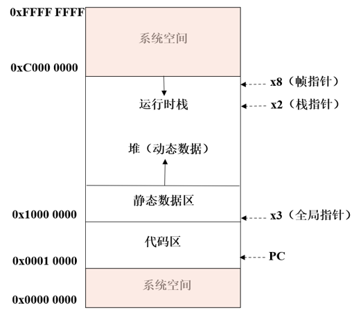
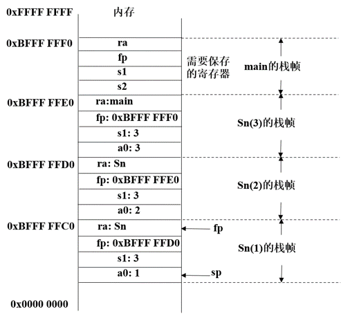

## C 函数的底层实现

根据 ISA (Instruction Set Architecture, 即指令集架构) 规定，程序和机器的接口是内存和寄存器。

**应用程序二进制接口**（Application Binary Interface，ABI）是操作系统和应用程序之间的接口，它定义了应用程序如何调用操作系统的服务。ABI 定义了函数调用的规则，包括函数参数的传递方式、函数返回值的传递方式、寄存器的使用、栈的使用等。

### RV32I 内存分配



- 代码区：程序、程序计数器 PC
- 为 C 变量分配存储空间
    - 静态数据区：静态存储类变量，寄存器 gp
    - 运行时栈：局部变量，寄存器 sp 指向栈顶
        - 向低地址 `x0000 0000` 增长
- 堆：动态分配数据
    - 向高地址 `xFFFF FFFF` 增长
- 系统空间
    - 操作系统，如自陷处理例程，自陷向量表，I/O 设备寄存器的内存映射地址等

RISV-V 整型寄存器
| Register name | Symbolic name | Description                         | Saved by |
| :-----------: | :-----------: | :----------                         | :------- |
| x0            | Zero          | Always zero                         | -        |
| x1            | ra            | Return address                      | Caller   |
| x2            | sp            | Stack pointer                       | Callee   |
| x3            | gp            | Global pointer                      | -        |
| x4            | tp            | Thread pointer                      | -        |
| x5            | t0            | Temporary/alternate return register | Caller   |
| x6~x7         | t1~t2         | Temporary                           | Caller   |
| x8            | s0/fp         | Saved register/frame pointer        | Callee   |
| x9            | s1            | Saved register                      | Callee   |
| x10~x11       | a0~a1         | Function argument/return value      | Caller   |
| x12~x17       | a2~a7         | Function argument                   | Caller   |
| x18~x27       | s2~s11        | Saved register                      | Callee   |
| x28~x31       | t3~t6         | Temporary                           | Caller   |

- *局部变量*必须由被调用者保存/恢复，即采用 **callee-save** 策略。
- *被调用者*知道使用了哪些寄存器存储局部变量
- *栈指针*如果被修改，采用 **callee-save** 策略保存/恢复
- zero，gp 和 tp 中的值是不变的，不需要保存/恢复
- 其他寄存器，视情况可采用 caller-save 策略保存/恢复

内存分配：
- 静态存储类变量分配到内存中
- 数组、结构体等类型的变量分配到内存中
- 寄存器数量不足时使用内存（如局部变量多于 12 个，或参数多于 8 个）
- 寄存器的保存和恢复，需要使用内存

函数的**栈帧**即从帧指针所指的单元到栈指针所指的单元之间的这段存储空间。

## C 函数调用过程

### 调用/返回机制

调用过程的 3 个步骤：
1. 调用者的变元/实参（argument）传给被调用者的形式参数/形参（parameter），并且控制权传给被调用者
2. 被调用者执行它的计算任务
3. 被调用者将返回值传回给调用者，并将控制权返回调用者

函数必须与调用者无关，即一个函数应该能被任何一个函数调用。

那么有个问题，是否允许函数调用它本身？即是否允许函数递归。

这也相当于在问是为每个函数分配一个栈帧？还是为每一次函数调用分配一个栈帧？

C 语言允许递归，因此每一次函数*调用*（而非函数定义），都会分配一个栈帧。

函数栈帧中存储局部数值。在内存中为每一次函数调用分配空间时，采用了栈机制——「栈帧」。内存中能够用于栈帧分配的空间，就是「运行时栈」。当函数返回时，它的栈帧将被回收

机器层面：
1. 实参被传递给形参
2. 栈帧被压入/弹出
3. 控制从一个函数转移到另一个

### 调用步骤

1. 调用函数（caller）：
    - 形参寄存器（a0~a7）← 实参
    - 如果需要（参数数量 > 8），运行时栈 ← 实参
2. 被调用函数（callee）：
    - 完成栈帧的分配
    - 运行时栈 ← 保存寄存器
    - 如需创建局部变量（数组、结构体等），运行时栈 ← 局部变量
3. 被调用函数（callee）：
    - 执行任务
4. 被调用函数（callee）：
    - 当完成任务后，栈帧弹出，将控制权返回到调用函数（caller）
    - 最后，调用函数（caller）：
    - 取回被调用函数的返回值

示例 C 代码

```c
#include <stdio.h>

int Sn(int n);

int main() {
    int in = 3;
    int sum = Sn(in);
    printf ("Sn of %d is %d\n",in, sum);
}

int Sn(int n) {
    if (n == 1) {
        return 1;
    } else {
        return n + Sn(n - 1);
    }
}
```

#### 产生函数调用

- 寄存器分配
- `main` 函数
    - `in -> s1`
    - `sum -> s2`
- `Sn` 函数
    - 形参 `n -> a0`

```riscvasm
mv   a0, s1
jal  ra, Sn
```

#### 开始被调用函数

- 首先，计算 `Sn` 函数栈帧的大小
    - 要保存哪些寄存器
        - `ra`：调用者的返回地址（caller-save）
        - `fp`：调用者的帧指针（callee-save）
        - `s1`：为局部变量分配的寄存器（callee-save）
        - `a0`：参数/返回值寄存器（caller-save）
    - 有哪些局部变量要分配到栈中
- 调整 `sp`：指向栈帧的顶部
- 然后，保存寄存器到栈帧，调整 `fp`

```riscvasm
Sn:     addi sp, sp, -16    # 为 Sn 函数分配栈帧
        sw ra, 12(sp)       # ra（返回地址）
        sw fp, 8(sp)        # sp（帧指针）
        addi fp, sp, 12     # 调整帧指针
        sw s1, 4(sp)        # s1（局部变量）
        sw a0, 0(sp)        # a0（参数）
```

每个栈帧都有相同的结构：返回地址、调用者的帧指针、局部变量寄存器、参数寄存器和函数的局部变量（数组、结构体）等。


#### 执行被调用函数

```riscvasm
        li      t0, 1
        beq     a0, t0, exit1   # n == 1?
        addi    a0, a0, -1      # n - 1
        jal     ra, Sn          # S(n-1)
        mv      t1, a0          # S(n-1) 的返回值
        lw      a0, 0(sp)       # 恢复 a0 // n
        add     a0, a0, t1      # return n + S(n - 1);
        j       exit2
exit1:  li      a0, 1           # return 1; 
```



#### 结束被调用函数

- 恢复局部变量寄存器
- 恢复调用者的帧指针 `fp`
- 恢复返回地址
- 调整 `sp`，指向调用者栈顶
- `ret` 指令将控制权返回给调用程序

```riscvasm
exit2:  lw      s1, 4(sp)               # 恢复 s1
        lw      fp, 8(sp)               # 恢复 fp
        lw      ra, 12(sp)              # 恢复 ra
        addi    sp, sp, 16              # 弹出 Sn 函数的栈帧
        ret
```

#### 从被调用函数返回

```riscvasm
mv      s2, a0   # sum = Sn(in);
```
