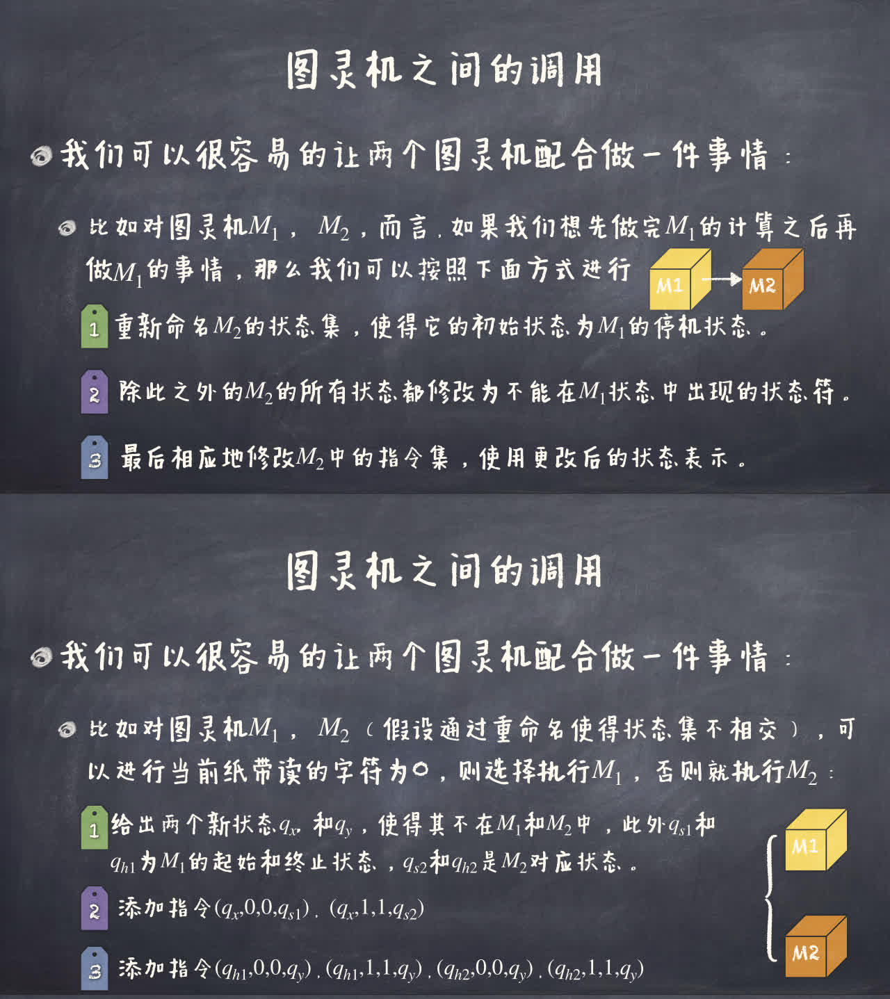

## 可计算性

!!! memo ""
    刚看过有关科普……

判定问题（Decision Problem）：对于给定的输入，判断其是否满足某个性质。

给定一个判定程序 $G$，判读任意一个代码输入 $P$，为其输入 $I$，$P$ 是否满足某个性质。

$$
G(P, I) = \begin{cases}
    \mathrm{Pass},\, & \text{满足} \\
    \mathrm{Fail},\, & \text{不满足}
    \end{cases}
$$

```c
#include <stdio.h>
#include <stdlib.h>

int main(int argc, char *argv[]) {
    int n = atoi(argv[1]);
    collatz(n); // Collatz 猜想
    return 0;
}
```

停机问题：无法写出一个程序，判断任意一个程序是否会停机。

**归约**（Reduction）：在可计算性理论与计算复杂性理论中，所谓的归约是将某个计算问题变换为另一个问题的过程。可用归约法定义某些问题的复杂度类（因变换过程而异）。

**可计算理论**（Computability Theory）：又称递归论，是数学的一个分支，研究的是什么样的函数能够被计算机算法计算。可计算理论的基本问题是哪些函数能够被计算机算法计算，哪些函数不能被计算机算法计算。

**希尔伯特计划**（Hilbert's program）：是数学家大卫·希尔伯特在20世纪初提出的一个计划，目的是通过形式化证明来解决数学的基础问题。希尔伯特计划的目标是建立数学的一套完备的公理化体系，使得数学的每一个定理都能够通过有限的推理步骤从公理体系中的公理推导出来。
- **一致性**（Consistency）：指的是公理体系中不会出现矛盾的情况。
- **完备性**（Completeness）：指的是公理体系中的每一个真命题都能够被证明。
- **可判定性**（Decidability）：指的是公理体系中的每一个命题都能够被证明或证伪。

**哥德尔不完备定理**（Gödel's incompleteness theorems）
- **第一不完备定理**：
任何自洽的形式系统（一致的），只要蕴涵皮亚诺算术公理，就可以在其中构造在体系中不能被证明的真命题，因此通过推理演绎不能得到所有真命题（即体系是不完备的）。
- **第二不完备定理**：任何逻辑自洽的形式系统，只要蕴涵皮亚诺算术公理，它就不能用于证明其本身的自洽性（一致性）。

### 图灵机

1.  一条无限延长的纸带，包含一个个小格子。这些格子可以从一个有限字符集 $\Sigma$ 中选值填上。一般最简单就是 $\Sigma=\{0,1\}$ 。其中 $0$ 表示空白。
2. 一个可以左右移动的读写头，每次扫描纸带上一个格子，可以读取格中符号，也能将其抹去填上新的符号，
3. 一个有穷状态集 $Q=\left\{q_{0}, q_{1}, \ldots, q_{n}\right\}, n \ge 1$，在任何时刻下，图灵机总处于 $Q$ 中的一个状态。
4. 一个有穷指令集 $\Delta=\left\{\delta_{0}, \delta_{1}, \ldots, \delta_{m}\right\}, m \ge 0$，所谓一个指令 $\delta_{k} \in \Delta$，其根据当前状态 $q_{i} \in Q$ 和当前方格读到的符号 $a \in \Sigma$，完成一个操作 $O$，并进入下一个状态 $q_{j} \in Q$。
5. 操作 $O \in\{L, R, b\}$ ，其中 $b \in \Sigma$ ，如果 $O=L$ 代表读写头左移，$O=R$ 代表右移，而 $O=b$ 代表将现有格子中的符号 $a$ 改为 $b$。

指令集 $\Delta$ 实际上是映射

$$
Q \times \Sigma \to (\left\lbrace L, R \right\rbrace \cup \Sigma) \times Q
$$

元素可表示为四元组 $\left(q_i, a, O, q_j\right)$ 

指令是确定的，即如果同一个图灵机有两个指令 $\left(q_{i}, a, O, q_{j}\right)$ 和 $\left(q_{i}, a, O^{\prime}, q_{j}^{\prime}\right)$, 那么 $O=O^{\prime}, q_{j}=q_{j}^{\prime}$

除自身外的信息：
- 初始状态 $q_s$ 
- 停机状态 $q_h$
- 输入是 $1$ 个或 $n$ 个自然数。一个自然数 $m$ 用 $m + 1$ 个 $1$ 表示，多个自然数用 $0$ 分隔
- 输出是停机时 $1$ 的总数
- 除了正常的 $q_h$ 停机外，如果此刻状态和当前符号对无匹配任何指令，也停止（异常或错误）。
- 死循环不是停机

**图灵可计算**：如果一个自然数上的函数是可计算的，当且仅当存在一个计算它的图灵机。即对于任意该函数定义域上的输入，都可以使得图灵机停机，并输出该函数要计算的值。

**图灵机编码**（Turing number）
- 假定字符集为 $\Sigma=\{0,1\}$，定义左移 $[L]=2$ 和右移 $[R]=3$.
- 定义状态集为 $Q=\{4,5, \ldots, n\}$。其中 4 为初始状态 $q_{s}$（即 $\left[q_{s}\right]=4$ ），而状态集中的最大的自然数 $n$ 为停机状态 $q_{h}$
- 对四元组 $\left(q, a, a^{\prime}, q^{\prime}\right)$ ，编码为 $\#\left(q, a, a^{\prime}, q^{\prime}\right)=\underbrace{1 \ldots 1}_{[q]+1 \text{个} 1} 0 \underbrace{1 \ldots 1}_{[a]+1 \text{个} 1} 0 \underbrace{1 \ldots 1}_{\left[a^{\prime}\right]+1 \text{个} 1} 0 \underbrace{1 \ldots 1}_{\left[q^{\prime}\right]+1 \text{个} 1}$
那么对于指令集 $\Delta=\left\{\delta_{0}, \delta_{1}, \ldots, \delta_{m}\right\}$ 而言，图灵机编码为 $\# \Delta=\# \delta_{0} 00 \# \delta_{1} 00 \# \delta_{2} \cdots 00 \# \delta_{m}$

既然 $\# \Delta$ 唯一确定了一个图灵机 $M$ ，我们可以将其和一个自然数对等（二进制），因此所有图灵机的数目是可数无穷大 $\aleph_0$。

可以被某个图灵机计算的函数就称为「可计算」函数。

### 通用图灵机

!!! info ""
    **通用图灵机**（Universal Turing Machine）：是一种特殊的图灵机，它能模拟任何其他图灵机的行为

!!! info ""
    存在一个通用的图灵机 $U$，输入为任何一台图灵机 $M_{1}$ 的编码，以及相应的任何输入 $I$，那么其输出和 $M_{1}$ 在 $I$ 输入下的输出一致。

- **拷贝机**（Copy Machine）
- **匹配机**（Match Machine）
- **替换机**（Term Substitution Machine）

!!! info 拷贝机
    让 $\$$ 和 $\#$ 为纸带间的不同于 $0$ 和 $1$ 的两个符号，之间只存在 $0$ 和 $1$ 的符号串。假设此刻读写头处于 $\$$ 处，那么我们可以构造一个图灵机，可以数紧挨着 $\#$ 之后的毗邻的 $1$ 个数，并将这些 $1$ 挎见到紧挨着 $\$$ 之后（当然，我们假设 $\#$ 和 $\$$ 之后的空间足够）。挎贝顺序也可以相反，从 $\$$ 之后挎背到 $\#$ 之后。

!!! info 匹配机
    让 $\$$ 和 $\#$ 为纸带间的不同于 $0$ 和 $1$ 的两个符号，之间只存在 $0$ 和 $1$ 的符号串。假设此刻读写头处于 $\$$ 处，那么我们可以构造一个图灵机，可以比较 $\$$ 之后连续的 $1$ 和 $\#$ 之后连续的 $1$，如果相同，以一个状态停机，否则以另一个状态停机。

!!! info 匹配机
    让 $\$$ 和 $\#$ 为纸带间的不同于 $0$ 和 $1$ 的两个符号，之间只存在 $0$ 和 $1$ 的符号串。令 $s$ 为紧挨着 $\#$ 之后 $0, 1$ 组成的串（有多个连续的 $1$ 组成的项，项之间用 $0$ 隔开）。$k$ 为紧挨着 $\$$ 之后的一个连续的 $1$ 串，假设此刻读写头处于 $\$$ 处，那么我们可以构造一个图灵机，用 $k$ 来替换 $s$ 的第一个项。

图灵机的调用，懒得抄了，见下图。



通用图灵机构造看 PDF，懒得抄了，而且还没消化。

### 可判定性

既然图灵机可以与自然数对应，停机问题就转换为判断图灵机对应编码是否在停机的图灵机的编码的集合中。

令 $A \subset \N$，其中 $A$ 是可判定的，当且仅当存在一个图灵机 $M$，对于任意 $n \in \N$，$M$ 能够判定 $n \in A$ 或 $n \notin A$。

记

$$
\chi_A(x) = \begin{cases}
    1, & x \in A \\
    0, & x \notin A
\end{cases}
$$

随即定义两个集合
- $K = \left\{\#M:\: M(\#M) \text{停机}\right\}$，即 $K$ 是停机的图灵机的编码的集合
- $K_0 = \left\{\left\langle \#M, x \right\rangle:\: M(\#M, x) \text{停机}\right\}$。$\left\langle \#M, x \right\rangle$ 是哥德尔编码，值为 $2^{\#M} \cdot 3^x$。

自停机问题即为判断 $K$ 是否可判定。

使用对角线法，类似证明实数不可数，可以证明 $K$ 不可判定。

我们假设存在这样的图灵机 $H_K$ 可以计算 $\chi_K$，那么既然自然数和图灵机可以一一映射，那我们就一一列举出来它们，可以得到如下结果

|          | $\#M_1$ | $\#M_2$ | $\#M_3$ | $\#M_4$ | $\cdots$ |
|   :-:    |   :-:   |   :-:   |   :-:   |   :-:   |   :-:    |
|  $M_1$   |   $0$   |         |         |         |          |
|  $M_2$   |         |   $1$   |         |         |          |
|  $M_3$   |         |         |   $1$   |         |          |
|  $M_4$   |         |         |         |   $1$   |          |
| $\vdots$ |         |         |         |         | $\ddots$ |

对角线表格值为 $1$ 时，表示对应的图灵机接收自己的编码为参数时，即$M_i(\#M_i)$ 停机，为 $0$ 时表示不停机。

构造一个图灵机 $D$，令 $D(\#M_i)$ 停机与否与对角线结果相矛盾，即 $D(\#M_i)$ 值与 $H_K(\#M_i)$ 值相反，然后可知，$D$ 与 $M_i$ 在以 $\#M_i$ 为输入时停机结果相反，从而 $D$ 不在这个序列中（对于任意 $i \in \N$，都有 $D \ne M_i$），从而导出了矛盾。因此不存在这样的图灵机 $H_K$。

## 归约

我们称集合 $A$ 可以 $m$-归约到集合 $B$，记为 $A \le_{m} B$，当存在一个全函数 $g:\: \N \rightarrow \N$（该函数必须图灵可计算，且对于任意 $x$，都有定义，即能够停机），满足对于任意 $x \in A$，当且仅当 $g(x) \in B$。

对于集合 $K,\, K_0$，有 $K \le_m K_0$。

构造 $g(x) = \left\langle x, x \right\rangle$，那么 $x \in K$ 当且仅当 $g(x) \in K_0$。

定义 $A \subseteq \mathbb{U}$（$\mathbb{U}$ 为全体图灵机编码的集合）为**指标集**，当且仅当如果 $\# M_{1} \in A$，且 $M_{1}$ 和 $M_{2}$ 在任何输入下的输出都相同，那么 $\# M_{2} \in A$

!!! info 莱斯定理（Rice's Theorem）
    对于指标集 $A$，如果 $A$ 是非平凡的（即 $A \neq \empty ,\, A \neq \mathbb{U}$），那么 $A$ 是不可判定的。

莱斯定理证明（思路）：
将自停机的图灵机 $M_x(x)$ 与另一个图灵机 $M_{x_1}$ 串联，形成一个新图灵机 $M_x^e$，从而将莱斯定理的证明转化为自停机问题的证明。
- 具体而言，假设非平凡指标集 $A$ 有 $M_{x_1} \in A$，且空函数（输出为空的图灵机）$M' \notin A$，从而 $M_x(x)$ 停机与否等价于 $M_x^e$ 是否属于 $A$，即 $A$ 可否判定。

- 若空函数 $M' \in A$，跟上面反过来，找一个 $x_2 \notin A$ 即可。

!!! memo ""
    乱啊，非常乱啊，我自己都没搞明白。等我抽时间理解消化一番然后重新整理吧。
