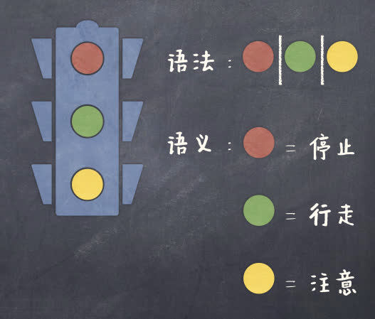
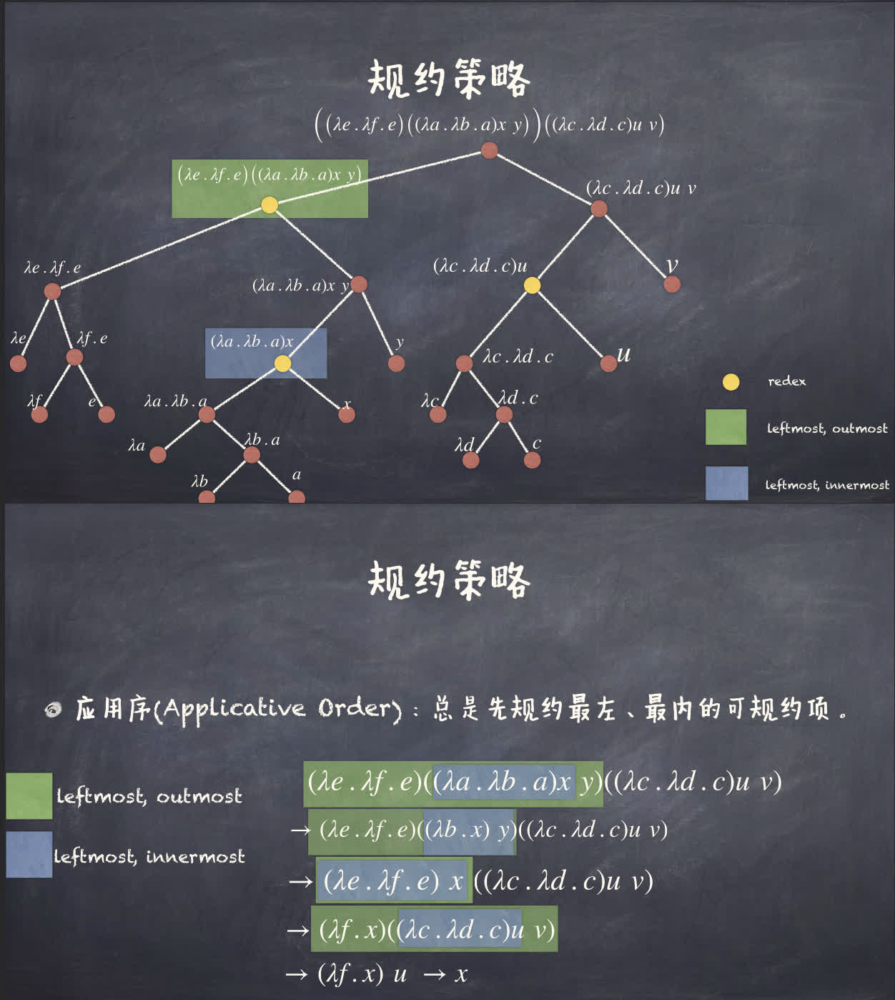
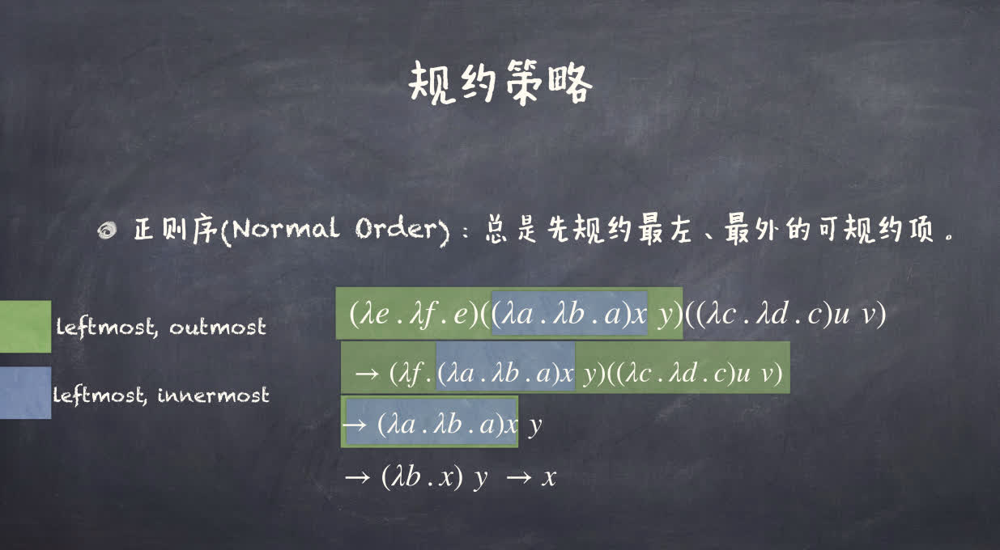
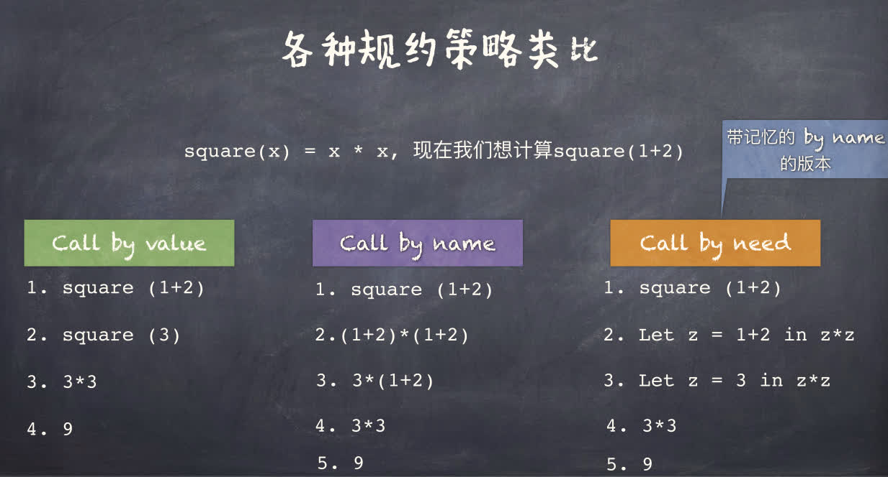

## 函数式编程（Functional Programming）

**函数式编程**是一种编程范型，其通过函数作用和复合来构造程序。它是*声明式范型*（Declarative Programming）的一种。与命令式的通过语句串改变状态不同，它使用一系列的函数表达式完成值到值的映射来表达计算。

函数作为一等公民（First-class Citizen）是函数式编程的一个重要特性。这意味着函数可以作为参数传递给其他函数，也可以作为返回值返回，可以被赋值给变量，可以被存储在数据结构中。

## Lambda 演算

### 定义

- **语法**（Syntax）：构成合法程序的写法规则
- **语义**（Semantics）：描述所写程序的运行行为



### 语法

$\lambda$ 项或 $\lambda$ 表达式的 BNF 范式（巴科斯范式，Backus-Naur Form）：

$$
\underbrace{M, N}_{\lambda \text{ 项}} \Coloneqq \underbrace{x}_{\text{变量}} \mid \lambda x.M \mid M N
$$

具体解释：给定一个无限的变量集合 $\mathbb{V}$，让 $A$ 为一个字符，其要么是 $\mathbb{V}$ 中的一个元素，要么是「$()\lambda.$」中一个字符，。让 $A*$ 为有限的字符串。那么隶属于 $\lambda$ 表达式的字符串符 $\Lambda \in A*$ 符合如下标准：
1. 如果 $x \in V $，那么 $x \in \Lambda$ 。
2. 如果 $x \in V$ 且 $M \in \Lambda$，那么 $\lambda x . M \in \Lambda$。
3. 如果 $M, N \in \Lambda$ ，那么 $M N \in \Lambda$。

$(\lambda x . M)$：Lambda 抽象（Lambda Abstraction）

```python
increment = lambda x: x + 1
```

$(M N)$：Lambda 作用（Lambda Application）。$M$ 作用到 $N$ 上。

```python
increment(3)
```

$M$ 尽可能右延伸，即 $\lambda x . M N $ 等价于 $\lambda x . (M N)$ 而非 $(\lambda x . M) N$，$\lambda x . \lambda y . x - y = \lambda x . (\lambda y . x - y)$

Lambda 作用左结合，即 $MNP$ 等价于 $(MN)P$。

$$
\begin{aligned}
(\lambda f . \lambda x . f x)(\lambda x . x+1) 2 &\to((\lambda f . \lambda x . f x)(\lambda x . x+1)) 2 \\
& \to\left(\lambda x .\left(\lambda x^{\prime} . x^{\prime}+1\right) x\right) 2 \\
& \to(\lambda x . x+1) 2 \\
& \to 3
\end{aligned}
$$

高阶函数（Higher-order Function）：
- 函数可以作为返回值返回
    - $\lambda x . \boxed{\lambda y . x - y}$
- 函数可以作为参数传递
    - $(\lambda f . \lambda x . f x) \boxed{(\lambda x . x + 1)} 2$ 

**柯里化**（Currying）：将多参数函数转化为单参数函数的过程。即将 $\lambda (x, y) . x - y$ 转化为 $\lambda x . \lambda y . x - y$。

```python
def subtract(x, y):
    return x - y
def curry(f):
    return lambda x: lambda y: f(x, y)

assert subtract(3, 2) == curry(subtract)(3)(2)
```

**逆柯里化**（Uncurrying）：将单参数函数转化为多参数函数的过程。即将 $\lambda x . \lambda y . x - y$ 转化为 $\lambda (x, y) . x - y$。

```python
def subtract(x):
    return lambda y: x - y
def uncurry(f):
    return lambda x, y: f(x)(y)

assert subtract(3)(2) == uncurry(subtract)(3, 2)
```

在 $\lambda$ 表达式，如 $\lambda x. x + y$ 中
- $x$ 为**绑定变量**（Bound Variable）
- $y$ 为**自由变量**（Free Variable）
- $\lambda x. M$ 中 $M$ 为 $x$ 的绑定域（Scope），如 $\lambda x. x + y$ 中 $x + y$ 为 $x$ 的绑定域。

$\alpha$-变换（Alpha Conversion）：改变绑定变量的名字，如 $\lambda x. x + y$ 可以变为 $\lambda z. z + y$。

自由变量不可重命名，如 $\lambda x. x + y$ 不可变为 $\lambda x. x + z$。

令 $f_v(M)$ 为 $M$ 中<u>自由变量</u>的集合，则
- $f_v(x) = \left\lbrace x \right\rbrace$ 
- $f_v(\lambda x. M) = f_v(M) \backslash \left\lbrace x \right\rbrace$
- $f_v(MN) = f_v(M) \cup f_v(N)$

### 语义

**$\beta$-归约**：$(\lambda x . M) N \to M[N / x]$（$N / x$ 表示用 $N$ 替换 $M$ 中的 $x$）

使用递归给出替换的严格定义：

$$
\begin{aligned}
    x [N / x] &= N \\
    y [N / x] &= y \\ 
    (M P) [N / x] &= (M [N / x]) (P [N / x]) \\
    (\lambda x . M) [N / x] &= \lambda x . M   \quad\text{只替换自由变量，不替换绑定变量}\\
    (\lambda y . M) [N / x] &= \begin{cases}
        \lambda y . (M [N / x]) & \text{如果 } y \notin f_v(N) \\
        \lambda z . (M [z / y] [N / x]) & \text{如果 } y \in f_v(N) \text{ 且 } z \notin f_v(M) \cup f_v(N) \\
    \end{cases}
\end{aligned}
$$

最后一条是为了避免自由变量被绑定，如 $(\lambda x . x - y) [x / y]$ 会变为 $\lambda x . x - x$。解决方法是将 $y$ 重命名为 $z$，即 $(\lambda x . x - y) [z / y] [x / y] = \lambda x . x - z [x / y] = \lambda y . y - z$。

$$
\text{递归 } \beta \text{-归约规则}
\left\lbrace\begin{aligned}
    \begin{array}{c}
        M \to M'\\ 
        \hline
        M N \to M' N
    \end{array}\\ 
    \begin{array}{c}
        N \to N'\\ 
        \hline
        M N \to M N'
    \end{array}\\
    \begin{array}{c}
        M \to M'\\ 
        \hline
        \lambda x . M \to \lambda x . M'
    \end{array}
\end{aligned}\right.
$$

- $\beta$-可约项（$\beta$-redex）：以 $(\lambda x . M) N$ 形式出现的 $\lambda$ 项（**red**ucible **ex**pression）
- $\beta$-范式（$\beta$-normal form）：不包含 $\beta$-可约项的 $\lambda$ 项（无法再进行 $\beta$-归约的 $\lambda$ 项）

!!! info 汇聚定理（Church-Rosser Theorem）
    $\beta$-归约无论采用何种归约顺序，最终都会收敛到同一个 $\beta$-范式。
    
    ---

    $$
    M \to^{*} M' = 
    \begin{cases}
        M \to^0 M' &\mathrm{iff.}\, M = M' \\
        M \to^{k + 1} M' &\mathrm{iff.}\, \exists M''\, M \to M'' \land M'' \to^k M'\\ 
        M \to^{*} M' &\mathrm{iff.}\, \exists k\, M \to^k M'
    \end{cases}
    $$

归约最多得到一个 $\beta$-范式，即 $\beta$-范式是唯一的。但有些归约得不到 $\beta$-范式，如 $(\lambda x . x x) \boxed{(\lambda x . x x)}$。

有些归约策略可能会陷入无限循环，例如 $(\lambda u . \lambda v . v) \big((\lambda x . x x) \boxed{ (\lambda x . x x)}\big)$ 

归约策略：
- **应用序**（Applicative Order）：总先归约最左、最内的可归约项（先归约参数，再归约函数）
    - 一个*最外*（outmost）的可约项是一个<u>不被其他可约项包含的可约项</u>。
    - 一个*最内*（innermost）的可约项是一个<u>不包含其他可约项的可约项</u>。
    - 
- **正则序**（Normal Order）：总先归约最左、最外的可归约项（参数未被归约，而是优先替换进函数体内）
    - 

!!! info ""
    如果 $\lambda$ 表达式存在 $\beta$-范式，那么按正则序归约总能归约到 $\beta$-范式。

在参数使用不到的情况下，「正则序」（Call by name）会比「应用序」（Call by value）要高效，然而如果参数会用到，而且会重复的话「应用序」（Call by value）要比「正则序」（Call by name）要更加高效。

Call by need 是一种介于 Call by name 和 Call by value 之间的策略，它会将参数的值缓存起来，以避免重复计算。



### 基于 $\lambda$ 演算的编程

**Church 编码**（Church Encoding）：使用 $\lambda$ 演算来表示自然数、布尔值、元组、列表等数据结构。

- 布尔值
    - $\mathbf{T} \triangleq \lambda x . \lambda y . x$
    - $\mathbf{F} \triangleq \lambda x . \lambda y . y$
- 操作
    - $\text{if } b \text{ then } M \text{ else } N \triangleq b M N$ 
    - $\text{Not} \triangleq \lambda b . b \mathbf{F} \mathbf{T}$ 
    - $\text{Not'} \triangleq \lambda b . \lambda x . \lambda y . b y x$
    - $\text{And} \triangleq \lambda b . \lambda c . b c \mathbf{F}$
    - $\text{Or} \triangleq \lambda b . \lambda c . b \mathbf{T} c$

$$
\begin{aligned}
    \mathbf{T} M N &\to (\lambda x . \lambda y . x) M N \\
    &\to (\lambda y . M) N \\
    &\to M
\end{aligned}
\quad
\begin{aligned}
    \mathbf{F} M N &\to (\lambda x . \lambda y . y) M N \\
    &\to (\lambda y . N) N \\
    &\to N
\end{aligned}\\ 
\begin{aligned}
    \text{And } \mathbf{T} b &\to (\lambda b . \lambda c . b c \mathbf{F}) \mathbf{T} b \\
    &\to (\lambda c . \mathbf{T} c \mathbf{F}) b \\
    &\to \mathbf{T} b \mathbf{F} \\
    &\to b
\end{aligned}
\quad
\begin{aligned}
    \text{And } \mathbf{F} b &\to (\lambda b . \lambda c . b c \mathbf{F}) \mathbf{F} b \\
    &\to (\lambda c . \mathbf{F} c \mathbf{F}) b \\
    &\to \mathbf{F} b \mathbf{F} \\
    &\to \mathbf{F}
\end{aligned}\\ 
\begin{aligned}
    \text{Or } \mathbf{T} b &\to (\lambda b . \lambda c . b \mathbf{T} c) \mathbf{T} b \\
    &\to (\lambda c .\mathbf{T} \mathbf{T} c) b \\
    &\to \mathbf{T} \mathbf{T} b \\
    &\to \mathbf{T}
\end{aligned}
\quad
\begin{aligned}
    \text{Or } \mathbf{F} b &\to (\lambda b . \lambda c . b \mathbf{T} c) \mathbf{F} b \\
    &\to (\lambda c .\mathbf{F} \mathbf{T} c) b \\
    &\to \mathbf{F} \mathbf{T} b \\
    &\to b
\end{aligned}
$$

!!! info 皮亚诺公理
    1. $0$ 是自然数。
    2. 对于任意自然数 $n$，$n$ 的后继 $n'$ 也是自然数。
    3. 对于每个自然数 $m, n$，$m = n$ 当且仅当 $m$ 和 $n$ 有相同的后继。
    4. $0$ 不是任何自然数的后继。
    5. 若 $A$ 是一个性质，且 $A(0)$ 成立，且对于任意自然数 $n$，$A(n)$ 成立时，$A(n')$ 也成立，则 $A(n)$ 对于所有自然数 $n$ 都成立。

从而可以这样对自然数进行编码：
1. 定义 $0$
2. 定义后继函数 $S$（递归 $n$ 次记作 $S^n$，从而有 $n = S^n(0)$）

邱奇数（Church numeral）
1. $0 \triangleq \lambda f . \lambda x . x$
2. $1 \triangleq \lambda f . \lambda x . f x$
3. $2 \triangleq \lambda f . \lambda x . f (f x)$
4. $\cdots$
5. $n \triangleq \lambda f . \lambda x . f^n x$

当把函数和变量作用于 Church 数时，相当于对函数进行了 $n$ 次迭代，即

$$
\begin{aligned}
    n g y &= (\lambda f . \lambda x . f^n x) g y \\
    &= (\lambda x . g^n x) y \\
    &= g^n (y)
\end{aligned}
$$

定义自增运算（基于上面的迭代）

$$
\begin{aligned}
    \operatorname{Inc} \triangleq \lambda n . \lambda f . \lambda x . f (n f x)\\
    \operatorname{Inc'} \triangleq \lambda n . \lambda f . \lambda x . n f (f x)
\end{aligned}
$$

定义加法运算（模仿自增运算，实际上上面省略了 $1$）

$$
\begin{aligned}
    \operatorname{Add} \triangleq \lambda m . \lambda n . \lambda f . \lambda x . n f (m f x)
\end{aligned}
$$

定义乘法运算需要注意到 $f^{m \times n} = (f^{m})^n$，因此

$$
\begin{aligned}
    \operatorname{Mult} \triangleq \lambda n . \lambda m . \lambda f . \lambda x . n (m f) x
\end{aligned}
$$

定义对零的判断

$$
\begin{aligned}
    \operatorname{IsZero} \triangleq \lambda n . n (\lambda x . \mathbf{F}) \mathbf{T}
\end{aligned}
$$

$$
\begin{aligned}
    \operatorname{IsZero} 0 &= (\lambda n . n (\lambda x . \mathbf{F}) \mathbf{T}) 0 \\
    &= 0 (\lambda x . \mathbf{F}) \mathbf{T} \\
    &= \mathbf{T}
\end{aligned}\quad 
\begin{aligned}
    \operatorname{IsZero} n &= (\lambda n . n (\lambda x . \mathbf{F}) \mathbf{T}) n \\
    &= n (\lambda x . \mathbf{F}) \mathbf{T} \\
    &= \mathbf{F}
\end{aligned}
$$

对有序对（Pairs）的编码

$$
\begin{aligned}
    \operatorname{Pair} &\triangleq \lambda x . \lambda y . \lambda f . f x y\\ 
    \pi_0 &\triangleq \lambda p . p \mathbf{T}\\ 
    \pi_1 &\triangleq \lambda p . p \mathbf{F}
\end{aligned}
$$

$$
\begin{aligned}
    \pi_0 (\operatorname{Pair} M N) &= (\lambda p . p \mathbf{T}) ((\lambda x . \lambda y . \lambda f . f x y) M N )\\
    &= (\lambda x . \lambda y . \lambda f . f x y) M N  \mathbf{T}\\
    &= \mathbf{T} M N\\
    &= M
\end{aligned}\quad 
\begin{aligned}
    \pi_1 (\operatorname{Pair} M N) &= (\lambda p . p \mathbf{F}) ((\lambda x . \lambda y . \lambda f . f x y) M N )\\
    &= (\lambda x . \lambda y . \lambda f . f x y) M N  \mathbf{F}\\
    &= \mathbf{F} M N\\
    &= N
\end{aligned}
$$

对元组（Tuples）的编码（仿照有序对）

$$
\begin{aligned}
    \operatorname{Tuple} &\triangleq \lambda x_1 . \cdots . \lambda x_n . \lambda f . f x_1 \cdots x_n\\
    \pi_i &\triangleq \lambda p . p (\lambda x_1 . \cdots . \lambda x_n . x_i)
\end{aligned}
$$

## 递归

但这样还不具有通用编程能力，因为不能递归。

之前定义的函数严格意义上其实是**宏**（Macro），是代表的 Lambda 表达式的缩写。

对于函数 $f(x)$，使得 $x = f(x)$ 成立的 $x$ 称为 $f$ 的不动点（Fixed point）。

类似的，递归的实质在于 $f = F(f)$，即 $f$ 是 $F$ 的不动点。

将阶乘函数 $\operatorname{Fact}$ 写成 $f = F(f)$ 的形式：

$$
\begin{aligned}
    \operatorname{Fact} &= \lambda n . \text{if } (n == 0) \text{ then } 1 \text{ else } n \times \operatorname{Fact} (n - 1)\\
    &= (\lambda f . \lambda n . \text{if } (\operatorname{IsZero} n) \text{ then } 1 \text{ else } n \times f (n - 1)) \operatorname{Fact}\\ 
    &= (\lambda f . \lambda n . (\operatorname{IsZero} n) 1 (n \times f (n - 1))) \operatorname{Fact}
\end{aligned}
$$

虽然数学函数 $f$ 有可能没有不动点，但是 Lambda 表达式 $F$ 一定有不动点。

**不动点组合子**（Fixed-point combinator）是一个高阶函数 $h$ 满足，对于任意函数 $f$，$h f$ 是 $f$ 的不动点，即 $h f = f (h f)$。存在无数个不动点组合子。

- 图灵不动点组合子 $\Theta$
    - 令 $A = \lambda x . \lambda y . y (x x y)$
    - 令 $\Theta = A A$
- 邱奇不动点组合子 $\mathbf{Y}$
    - 令 $\mathbf{Y} = \lambda f . (\lambda x . f (x x)) (\lambda x . f (x x))$

!!! memo 彩蛋
    老师给了个链接，[鳄鱼和蛋](https://worrydream.com/AlligatorEggs)，「形象」地解释了 Lambda 演算的基础规则，看完了，挺绷不住的。

## 停机问题

Lambda 演算的停机问题，即判断一个 Lambda 表达式有没有 $\beta$-范式。

假设存在一个高阶函数 $h$ 可以判定停机问题，其以一个 Lambda 表达式 $f$ 为参数（即 $h f$），当 $f$ 存在 $\beta$-范式时返回 $\mathbf{T}$，否则返回 $\mathbf{F}$。

记

$$
\left\lbrace\begin{aligned}
    I &\triangleq (\lambda x.x) \\
    \Omega &\triangleq (\lambda x.x x) (\lambda x.x x)
\end{aligned}\right.
$$

显然 $I$ 有 $\beta$-范式，$\Omega$ 无 $\beta$-范式。

定义

$$
P \triangleq \lambda x . h (x x) \Omega I
$$

考察 $P P$，若 $P P$ 有 $\beta$-范式，则 $P P $ 会等于 $\Omega$，即没有 $\beta$-范式；若 $P P$ 无 $\beta$-范式，则 $P P$ 会等于 $I$，即有 $\beta$-范式。从而产生了矛盾，因此不存在这样的高阶函数 $h$。
