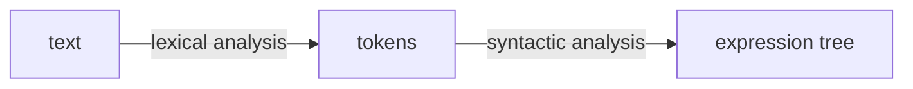
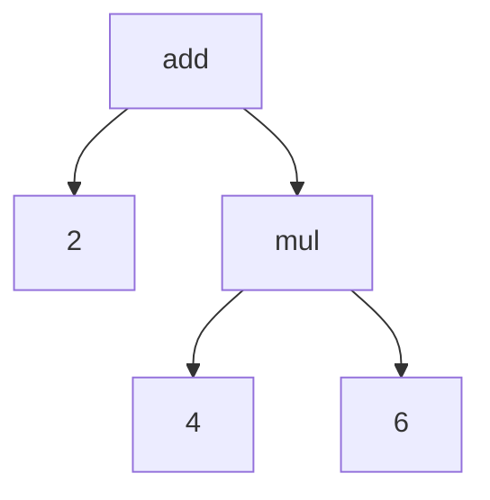
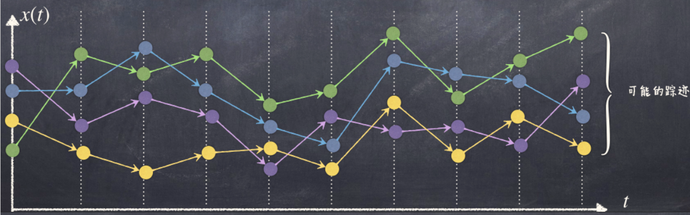
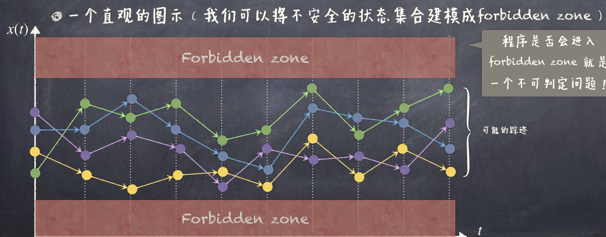
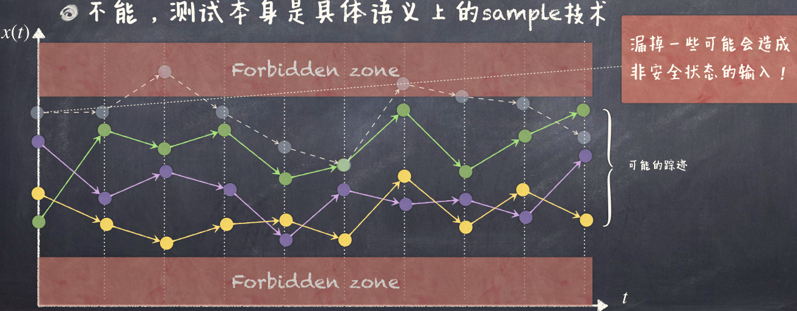
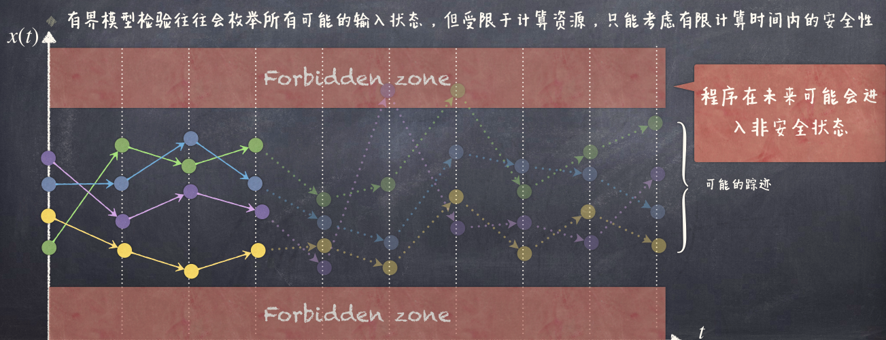
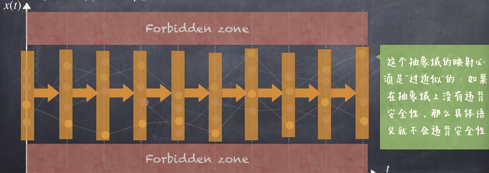

!!! memo ""
    好久没写软工计的笔记了。开始讲 Python 后，因为对 Python 有点了解，就懒得记了。不过即使到后面有一些之前不了解的，亦或者到 Java 完全不了解，也没记。但现在又回到理论了，还是记点。

一些基本概念已经在[计算系统基础](/notes/E-fundamentals-of-computing-systems)中介绍过了。

解释器流程 Read-Eval-Print Loop (REPL)：
- 读取（Read）用户的输入（并转化为表达式）
- 求值（Evaluate）表达式
- 打印（Print）结果
- 循环（Loop）上述过程直至结束

## 计算器语言（**Calc**ulator Language）

新创造一个语言 Calc，并为其实现一个解释器。

该过程叫 metalinguistic abstraction，即用一种语言描述另一种语言。

新创造的语言称为 domain-specific language（DSL），即特定领域语言。

```
calc> add(3, 4)
7
calc> add(3, mul(4, 5))
23
calc> +(3, *(4, 5), 6)
29
calc> div(3, 0)
ZeroDivisionError: division by zero
```


用一个语言去解释另一个语言（常见的解释及设计方案）：
- C 解释 Python（CPython）
- Java 解释 Python（Jython）
- Python 解释 Python（Pypy）

下面用 Python 实现一个 Calc 解释器。

## 语法和语义（Syntax & Semantics）

Calc 表达式：
- 基本表达式（primitive expression）：数字
- 调用表达式（call expression）：操作符名字，加上括号，括号里是由括号隔开的操作数列表

操作符：
- add, +：所有实参的和
- sub, -：若只有一个实参，则返回其负值；若有多个实参，则从第一个实参开始减去后续所有实参
- mul, *：所有实参的积
- div, /：从第一个实参开始除以后续所有实参

设定为前缀（prefix）表示法，即操作符在操作数之前。

类似 Lisp 语言的表达式：

```lisp
(+ 3 4)
(+ 3 (* 4 5))
(+ 3 (* 4 5) 6)
(/ 3 0)
```

## Read-Eval-Print Loop

```python
def read_eval_print_loop():
    while True:
        try:
            expression_tree = calc_parse(input("calc> "))
            print(calc_eval(expression_tree))
        except ...:
            # Error handling
```

- Read: `input`
- Parse: `calc_parse`
- Eval: `calc_eval`
- Print: `print`

### Parse

但仅有原始的字符串是不够的，对于计算机而言，一个简单的结构化的表达式更加容易理解，因此我们要进一步对原始的字符串进行「解析」。

解析器（parser）接受字符串输入，返回一个表达式。

步骤：
- 词法分析（lexical analysis）：将字符串分解为 token
    - Identify the words: Divide input string into meaningful tokens, such as integer litterals, identifiers, key words.
    - 识别单词：将输入字符串分解为有意义的 token，如整数字面量、标识符、关键字
- 语法分析（syntactic analysis）：将 token 组合成表达式
    - Derive the structure of sentence: Converts tokens into a more structured representation (parse tree or expression tree).
    - 推导句子结构：将 token 转化为更有结构的表达（解析树或表达式树）



```python
def calc_parse(line):
    tokens = tokenize(expression_string) # Lexical analysis
    expression_tree = analyze(tokens)    # Syntactic analysis
    return expression_tree
```

`tokenize("add(2, mul(4, 6))")` 返回

```
['add', '(', '2', ',', 'mul', '(', '4', ',', '6', ')', ')']
```

`analyze` 函数将 token 转化为表达式树



### Eval

求值（evaluation）

给定一个解析后的表达式（表达式树），Evaluation 过程用来求出该表达式的值。

- 基本表达式：直接返回其值
- 调用表达式：递归地求出所有操作数的值，然后应用操作符
    - 对每个操作数进行求值（evaluate）
    - 将求得的值放到实参的列表上
    - 将操作符应用到实参列表上

```python
def calc_eval(exp):
    if type(exp) in (int, float):
        return exp
    elif type(exp) == Expr:
        arguments = list(map(calc_eval, exp.operands))
        return calc_apply(exp.operator, arguments)
```

```python
def calc_apply(operator, args):
    match operator:
        case 'add' | '+':
            return sum(args)
        case 'sub' | '-':
            if len(args) == 1:
                return -args[0]
            return args[0] - sum(args[1:])
        case 'mul' | '*':
            return reduce(lambda x, y: x * y, args)
        case 'div' | '/':
            return reduce(lambda x, y: x / y, args)
```

## Python 子集语言 Py

- 环境
    - 有了变量可以在「记忆」信息，这些变量可以在环境中可访问
    - 函数有参数、函数体、并且知道当被调用时所在的环境
- 语句
    - 语句比表达式更加复杂，表达了自身求值、改变环境等操作

REPL for Py:

```python
def read_eval_print_loop(interactive=True):
    global_env = create_global_env()
    while True:
        try:
            statement = py_read_and_parse()
            value = statement.evaluate(global_env)
            if value is not None and interactive:
                print(repr(value))
        except ...:
            # Error handling
```

- `py_read_and_parse`: Read in a statement and produce a `Statement` object（读入一个语句并生成一个 `Statement` 对象）
- `evaluate`: Evaluate the statement we read, using the global environment（使用全局环境对读入的语句进行求值）
- `print`: Print the result of the evaluation（打印求值结果）

### 环境（Environment）

作用是追踪变量名字和相应的值。使用字典来实现。

```python
class Environment:
    ...
    def __init__(self, enclosing_env=None):
        self.enclosing_env = enclosing_env
        self.bindings = {}
        self.nonlocal_refs = set()
    ...
```

- `self.enclosing_env`: parent environment（父环境）
- `self.bindings`: variable bindings（变量绑定）
- `self.nonlocal_refs`: nonlocal references（非局部引用）

```python
class Environment:
    ...
    def is_global(self):
        return self.enclosing_env is None

    def note_nonlocal_ref(self, var):
        self.nonlocal_refs.add(var)
    ...
```

- `is_global`: Check if the environment is global（检查环境是否为全局环境）
- `note_nonlocal_ref`: Record a nonlocal reference（记录一个非局部引用）

在环境中查找名字绑定的值：

```python
class Environment:
    ...
    def __getitem__(self, var):
        if var in self.bindings:
            return self.bindings[var]      # 先从当前环境查找
        elif not self.is_global():
            return self.enclosing_env[var] # 再从父环境查找（递归）
        else:
            # 找不到，抛出异常
            raise NameError(f"NameError: name '{var}' is not defined")
    ...
```

- `__getitem__` 特殊方法，可以直接用 `env[var]` 来查找名字绑定的值

在环境中改变名字绑定的值：

```python
class Environment:
    ...
    def set_var(self, name, value, is_nonlocal=False):
        if is_nonlocal:
            self.enclosing_env[name] = value
        else:
            self.bindings[name] = value
    
    def __setitem__(self, name, value):
        self.set_var(name, value, name in self.nonlocal_refs)
```

- `__setitem__` 特殊方法，可以直接用 `env[name] = value` 来改变名字绑定的值

### 语句（Statement）

- 赋值语句（assignment statement）：自动对表达式进行求值，并将值绑定到目标名字上
- 调用语句（call statement）：对操作符和操作数分别求值，然后将执行 apply
- 控制语句（control statement）：复合语句，包含布尔表达式，语句块，首先对布尔表达式进行求值，根据结果是否对语句块中的语句进行求值

**赋值语句**：

```python
class AssignStatement(Statement):
    def __init__(self, target, expr):
        self.target = target
        self.expr = expr

    def evaluate(self, env):
        env[self.target] = self.expr.evaluate(env)
```

- `__init__`：初始化赋值语句
- `expr.evaluate`：在所给环境对赋值语句进行求值

**调用语句**：

```python
class CallStatement(Statement):
    def __init__(self, operator, operands):
        self.operator = operator
        self.operands = operands

    def evaluate(self, env):
        operator = self.operator.evaluate(env)
        arguments = [operand.evaluate(env) for operand in self.operands]
        return operator.apply(arguments)
```

- `__init__`：初始化调用语句
- `operator.evaluate(env)`：在所给环境对操作符进行求值
- `operand.evaluate(env)`：在所给环境对操作数进行求值
- `operator.apply(arguments)`：对操作符和操作数进行应用

核心是对 `Function` 对象的 `apply` 方法的调用。

构造函数表达：

```python
class Function:
    def __init__(self, *args):
        raise NotImplementedError()

    def apply(self, operands):
        raise NotImplementedError()

class PrimitiveFunction(Function):
    def __init__(self, procedure):
        self.body = procedure

    def apply(self, operands):
        return self.body(operands)
```

- `Function` 类：抽象函数类，定义了 `apply` 方法
- `PrimitiveFunction` 类：原始函数类

内建基本函数：

```python
primitive_functions = [
    ("or", PrimitiveFunction(lambda args: any(args))),
    ("and", PrimitiveFunction(lambda args: all(args))),
    ...
]

def setup_global_env():
    global_env = Environment()
    for name, function in primitive_functions:
        global_env[name] = function
    return global_env
```

用户定义函数：

```python
class CompoundFunction(Function):
    def __init__(self, args, body, env):
        self.args = args
        self.body = body
        self.env = env

    def apply(self, operands):
        call_env = Environment(self.env)
        if len(operands) != len(self.args):
            raise ValueError(f"Wrong number of arguments passed to function {self}")
        for name, value in zip(self.args, operands):
            call_env[name] = value
        for statement in self.body:
            try:
                statement.evaluate(call_env)
            except StopFunction as sf:
                return sf.return_value
        return None
```

- `__init__`：初始化用户定义函数，包含参数（args）、函数体（body）、所在环境（env）
- `call_env`：调用时创建一个帧
- `for name, value`：将实参绑定到形参上
- `for statement`：在当前帧中，对函数体每个语句进行求值
- `except`：直到获取返回值

实现返回语句

```python
class StopFunction(Exception):
    def __init__(self, return_value):
        self.return_value = return_value

class ReturnStatement:
    def __init__(self, expr=None):
        self.expr = expr

    def evaluate(self, env):
        if self.expr is None:
            raise StopFunction(None)
        raise StopFunction(self.expr.evaluate(env))
```

**控制语句**：

```python
class ControlStatement(Statement):
    def __init__(self, condition, blocks):
        self.condition = condition
        self.blocks = blocks

    def evaluate(self, env):
        var = self.condition.evaluate(env)
        executed = []
        if var:
            executed = blocks["true"]
        else:
            executed = blocks["false"]
        for statement in executed:
            statement.evaluate(env)
```

### 总结

我们实际上是用「Python 的程序语句」来表达对象语言（我们自己定义的语言）的语义。

这种表达语义的方式就是**操作语义**（Operational Semantics），即描述语言是如何执行的。

## 抽象解释（Abstract Interpretation）

### 具体语义的问题

程序的具体语义形式化了程序在所有可能环境中的所有可能执行。

例如

```c
unsigned int a = input();
a++;
```

代表

```
a = 0 --> a = 1
a = 1 --> a = 2
...
```

对于一个具体的操作语义而言，可以将程序的执行看成是「状态」（即程序的变量构成的环境）的不断迁移的过程（如何迁移为具体语义定义）。

由于输入的无限可能，执行路径有无数可能（甚至某一条路径无限长，即不停机）。



然而对于这种具有无限的踪迹的语义来说，很多关于程序的不平凡的问题都没有答案。
    - 比如全停机问题：程序在任何可能输入下会终止吗？

更一般地，我们关心一些有关程序的安全性的问题。

所谓的**安全性**就是：「没有坏事发生」，具体的安全性与具体的「坏事」相关
    - 例如：不可终止、空指针解引用、数组越界等。

安全性要求执行中的*任何*有限步骤内都保持这个性质。



「测试」无法解决这个问题，因为测试是具体语义上的 sample 技术（可能漏掉一些可能非安全状态的输入）。



「有界模型检验」（bounded model checking）也无法解决这个问题，因为它只能检查有限长度的路径。



「抽象解释」：赋予语句抽象语义，利用抽象的域替代无限的输入，状态的迁移变成了抽象域的迁移，减少了计算空间。



### 抽象解释

例如判定程序中所有数字变量的正负性。

抽象域：
- `+`：正数
- `-`：负数
- `0`：零
- `⊤`：都可能（未知）
- `⊥`：非法（未定义）

抽象语义：
- 迁移函数：在抽象域上进行求值
    - `+` + `+` = `+`
    - `-` + `-` = `-`
    - `0` + `0` = `0`
    - `+` + `-` = `⊤`
    - `⊤` / `0` = `⊥`
    - ……

例如

```
a = 5;              a = +
b = -3;             b = -
c = a * b;          c = 0
d = 0;        -->   d = 0
e = c * d;          e = 0
f = 10 / e;         f = ⊥
g = a + b;          g = ⊤
```
