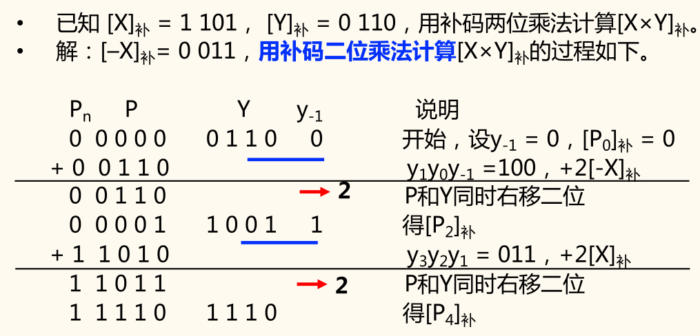
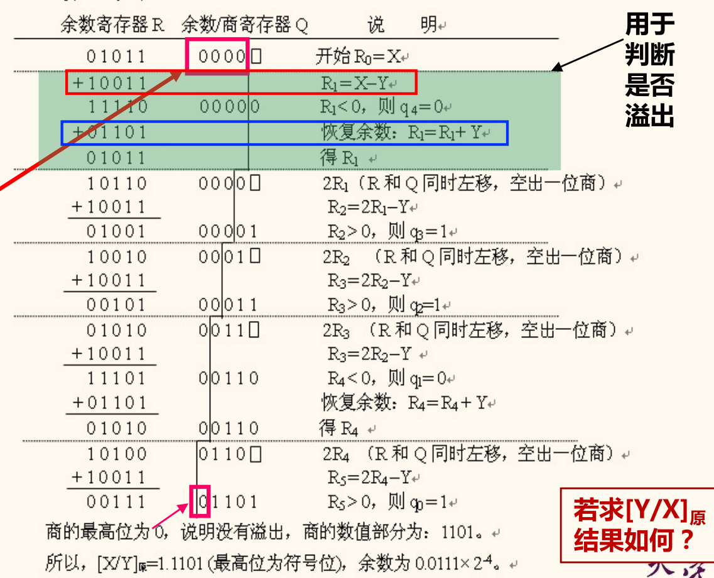
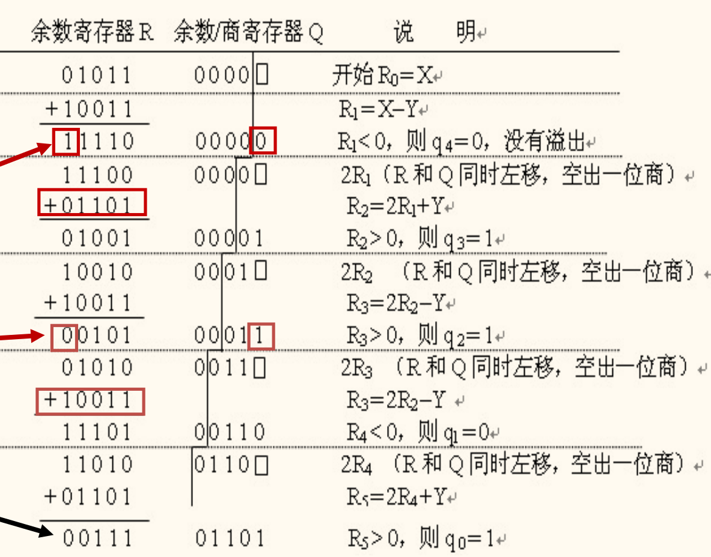
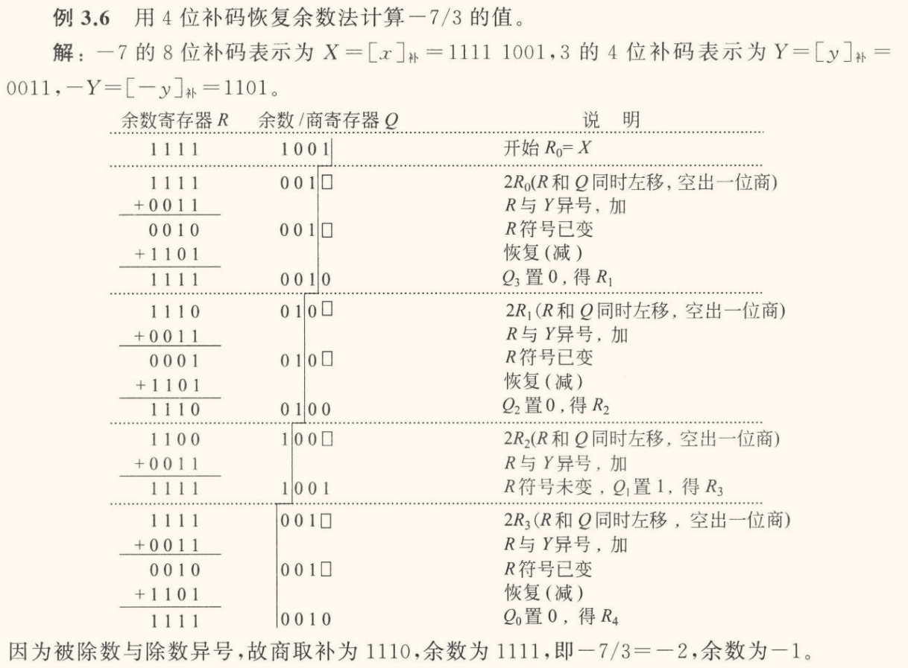
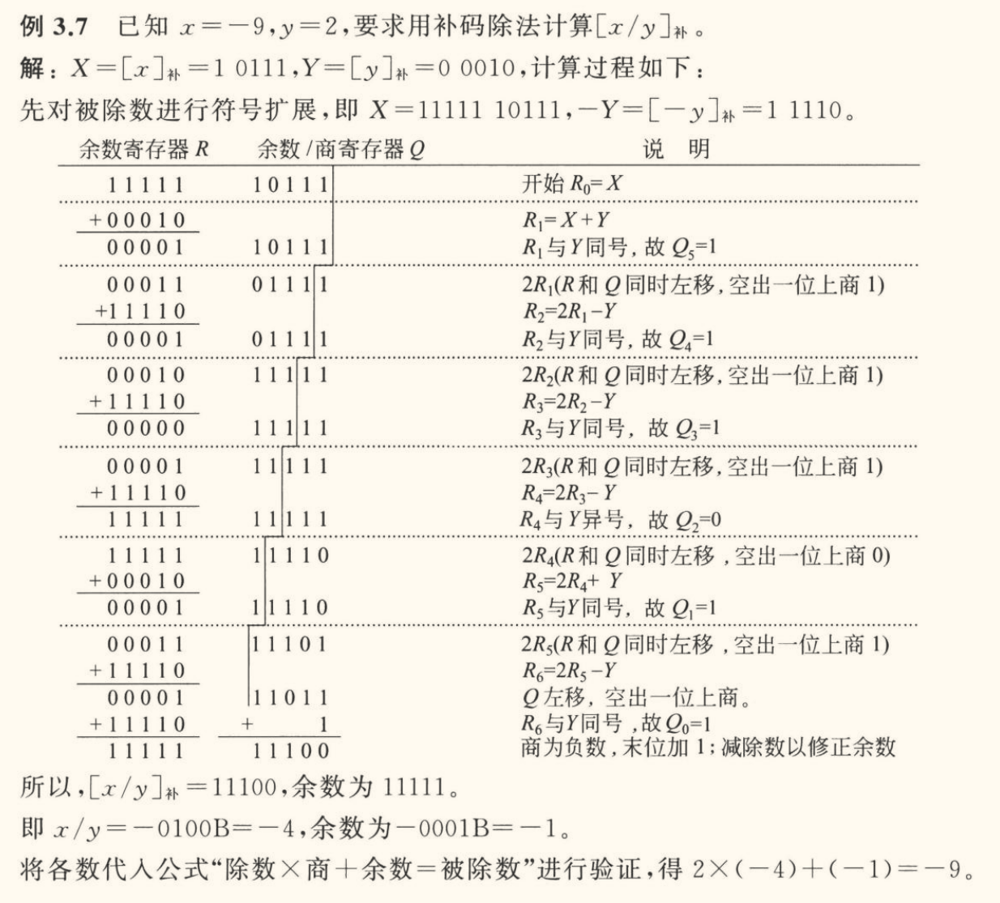
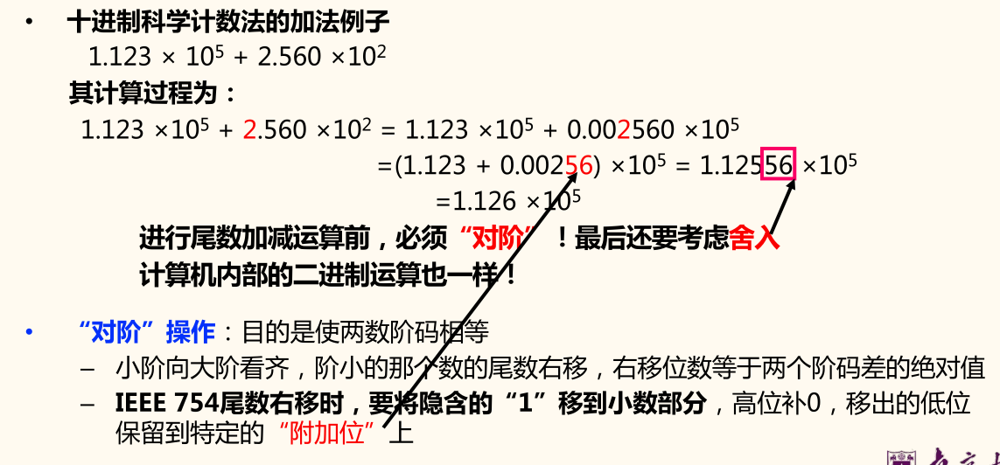

有关「高级语言和机器指令中的运算」的内容，大部分都在其他课程（例如[《计算系统基础》](/notes/E-fundamentals-of-computing-systems)）中提及了，这里不再赘述。

## 基本运算部件

详细内容可见[《计算系统基础》笔记——4. 运算方法和运算部件](/notes/E-fundamentals-of-computing-systems/04-calculation-method-and-calculation-component)。

!!! info 全加器
    设输入为加数 $A$、被加数 $B$ 和低位进位 $C_{\mathrm{in}}$，输出为和 $F$ 和高位进位 $C_{\mathrm{out}}$。则有

    $$
    \left\lbrace\begin{aligned}
        F &= A \oplus B \oplus C_{\mathrm{in}} \\
        C_{\mathrm{out}} &= A \cdot B + A \cdot C_{\mathrm{in}} + B \cdot C_{\mathrm{in}}
    \end{aligned}\right.
    $$

    详细内容见[《计算系统基础》笔记中关于「全加器」的介绍](/notes/E-fundamentals-of-computing-systems/04-calculation-method-and-calculation-component#全加器)。

    > 《计算系统基础》笔记中用的是 $S$，这里是 $F$，下同。

「串行进位加法器」见[《计算系统基础》笔记中关于「行波进位加法器」的介绍](/notes/E-fundamentals-of-computing-systems/04-calculation-method-and-calculation-component#行波进位加法器)。

!!! info 并行进位加法器
    串行进位加法器采用串行逐级传递进位，电路延迟与位数成正比关系。因此，现代计算机采用一种**先行进位**（carry look ahead）方式。
    
    定义辅助函数

    $$
    \left\lbrace\begin{aligned}
        G_i &= X_i \cdot Y_i, &\text{进位生成函数}\\
        P_i &= X_i + Y_i, &\text{进位传递函数}
    \end{aligned}\right.
    $$

    全加逻辑方程

    $$
    \left\lbrace\begin{aligned}
        F_i &= X_i \oplus Y_i \oplus C_{i-1} \\
        C_{i+1} &= X_i \cdot Y_i + (X_i + Y_i) \cdot C_i = G_i + P_i \cdot C_i
    \end{aligned}\right.
    $$
    
    通过计算 $G_i$ 和 $P_i$，可以直接计算出 $C_{i+1}$，而不需要等待 $C_i$ 传递过来。

    详细内容见[《计算系统基础》笔记中关于「先行进位加法器」的介绍](/notes/E-fundamentals-of-computing-systems/04-calculation-method-and-calculation-component#先行进位加法器)，里面的式子解释更为详细，同时还有不同颜色的标注。

    > 《计算系统基础》笔记中 $P_i$ 定义为 $X_i \oplus Y_i$，这没差，而且 $F_i$ 里也会用到。

!!! info 带标志加法器
    对于**溢出标志 $\mathrm{OF}$** 有

    $$
    \mathrm{OF} = C_n \oplus C_{n-1}
    $$

    对于**符号标志 $\mathrm{SF}$** 有

    $$
    \mathrm{SF} = F_{n-1}
    $$
    
    对于**零标志 $\mathrm{ZF}$** 有

    $$
    \mathrm{ZF} = 1 \iff F = 0
    $$
    
    对于**进位/借位标志 $\mathrm{CF}$** 有

    $$
    \mathrm{CF} = C_{\mathrm{in}} \oplus C_{\mathrm{out}}
    $$

!!! info 算术逻辑部件（Alorithmic Logic Unit, ALU）
    - 进行基本算术运算与逻辑运算
    - 核心电路是**整数加/减运算部件**
    - 输出*和/差*及*标志信息*
    - 有*操作控制端*（ALUop），用来决定 ALU 所执行的处理功能。

## 定点数运算

### 补码加减运算

!!! memo ""
    好像没啥好记的？

### 原码加减运算\*

- 用于浮点数尾数运算
- 符号位和数值部分分开处理
- 仅对数值部分进行加减运算，符号位起判断和控制作用

规则：
- 比较两数符号，对加法实行「同号求和，异号求差」，对减法实行「异号求和，同号求差」。
- **求和**：数值位相加，若最高位产生进位，则结果溢出。和的符号取被加数（被减数）的符号。
- **求差**：被加数（被减数）加上加数（减数）的补码。分二种情况讨论：
    1. 最高数值位*产生进位*，表明加法结果为正，所得数值位正确。
    2. 最高数值位*没有产生进位*，表明加法结果为负，得到的是数值位的补码形式，<u>需对结果求
补，还原为绝对值形式的数值位</u>。
- 差的符号位：
    - 上面的 1. 情况下，符号位取被加数（被减数）的符号
    - 上面的 2. 情况下，符号位为被加数（被减数）的符号<u>取反</u>

### 无符号数的乘法运算

被乘数 $X$ 与乘数 $Y$，按手算列竖式乘法的规则，有

$$
X \times Y = \sum (X \times Y_i \times 2^i)
$$

采用递推减少保存各次相乘结果 $X \times Y_i$ 的开销。

设 $P_0 = 0$，有

$$
\begin{aligned}
    P_1 &= 2(P_0 + X \times Y_n)\\
    P_2 &= 2(P_1 + X \times Y_{n-1})\\ 
    &\vdots\\ 
    P_n &= 2(P_{n-1} + X \times Y_1)
\end{aligned}
$$

递推有

$$
P_{i+1} = 2(P_i + X \times Y_{n-i})
$$

最终 $P_n = X \times Y$。

### 原码乘法运算

用于浮点数尾数乘运算。数值部分使用无符号乘法运算。

原码两位乘法操作递推公式：
- $00$：$P_{i+1} = 2^{-2} P_i$
- $01$：$P_{i+1} = 2^{-2} (P_i + X)$
- $10$：$P_{i+1} = 2^{-2} (P_i + 2X)$
- $11$：$P_{i+1} = 2^{-2} (P_i + 3X) = 2^{-2} (P_i - X) + X $（即本次 $-X$，下次 $+X$）

如下表所示，其中 $T$ 触发器用来记录下次是否要执行 $+X$，开始时为 $0$。

| $Y_{i-1}$ | $Y_i$ | $T$ |  $X$  |   操作   |      迭代公式       |
|    :-:    |  :-:  | :-: |  :-:  |   :-:    |         :-:         |
|    $0$    |  $0$  | $0$ |   -   | $0\to T$ |    $2^{-2} P_i$     |
|    $0$    |  $0$  | $1$ | $+X$  | $0\to T$ | $2^{-2} (P_i + X)$  |
|    $0$    |  $1$  | $0$ | $+X$  | $0\to T$ | $2^{-2} (P_i + X)$  |
|    $0$    |  $1$  | $1$ | $+2X$ | $0\to T$ | $2^{-2} (P_i + 2X)$ |
|    $1$    |  $0$  | $0$ | $+2X$ | $0\to T$ | $2^{-2} (P_i + 2X)$ |
|    $1$    |  $0$  | $1$ | $-X$  | $1\to T$ | $2^{-2} (P_i - X)$  |
|    $1$    |  $1$  | $0$ | $-X$  | $1\to T$ | $2^{-2} (P_i - X)$  |
|    $1$    |  $1$  | $1$ |   -   | $1\to T$ |    $2^{-2} P_i$     |

### 补码乘法运算

「布斯一位乘法」部分见[《计算系统基础》中关于「布斯一位乘」的介绍](/notes/E-fundamentals-of-computing-systems/04-calculation-method-and-calculation-component#布斯一位乘)。

上面的笔记中关于布斯乘法的记录是将 $A, S, P$ 扩充成等长度。实际上「列式」可能可以少写很多零，不过懒得赘述了，放张布斯两位乘法的图看看得了。



布斯两位乘法，也就是补码两位乘法，操作比较复杂，这里就不详细说明了，操作表也不给了，因为太复杂了不会去记的，要考试也肯定会给的。

实际上跟一位乘法相比，前面多了个 $P_n$ 符号位，需要注意的是这个是个「符号位」，如果本来是 1，$P$ 最高位运算后进位了个 1，那结果还是 1。这是手算的血泪教训。

<!-- {{{ 例子以详细说明 -->
<details>
<summary>例子以详细说明</summary>

六位机器数 $x = 10, y = -6$，运用补码两位乘法计算 $x \times y$。

$x$ 为 001 010，$y$ 为 111 010。

由于列式比较难在这里表示出来，这里还是使用扩充的方法。

- $A$：0 0010 1000 0000 0
- \(A \ll 1\)：0 0101 0000 0000 0
- $S$：0 1101 1000 0000 0
- \(S \ll 1\)：1 1011 0000 0000 0
- $P$：0 0000 0011 1010 0

$P$ 的变化如下：
1. 1 1110 1100 1110 1
2. 1 1111 0001 0011 1
3. 1 1111 1100 0100 1

结果为 1111 1100 0100。

详细解释如下：
1. 一开始是 100，因此 $P$ 加上 $S \ll 1$，变成 1 1011 0011 1010 0，然后右移两位变成 1 1110 1100 1110 1。
2. 然后是 101，因此 $P$ 加上 $S$，变成 1 1100 0100 1110 1（这里就要注意最高的符号位不会因进位变成 0），然后右移两位变成 1 1111 0001 0011 1。
3. 最后就是 111，不用操作，直接右移两位变成 1 1111 1100 0100 1。

在写这个解释说明时才发现我昨晚一直算错的原因是上面的 $S, S\ll 1$ 写错了……明明布斯一位乘法那里写的是对的，直接复制过来不就好了嘛……然后刚刚写解释时按着这个算跟第二步完全不同。也就是说昨晚算错是因为照着上面书写，而算对是因为在稿纸上自己写……

</details>
<!-- }}} -->

### 快速乘法器\*

通过一个 ALU 多次做「加/减 + 右移」来实现。具体过程略。

### 原码除法运算

可将商符和商值分开处理。<u>余数的符号同被除数符号</u>。

除前预处理：
1. 若被除数为 $0$，且除数不为 $0$，或定点整数除法时被除数的绝对值小于除数的绝对值，则商为 $0$，不再继续
2. 若被除数不为 $0$，除数为 $0$，则发生「除数为 $0$」异常（浮点数时为 $\pm \infty$）
    - 浮点除法被除数和除数都为 $0$ 时，有些机器会产生一个不发信号的 NaN，即 quiet NaN
3. 当被除数和除数都不为 $0$ 时，进一步进行除法运算

计算机内部并没有符号数除法运算，因为基本操作为减法和移位，可以与乘法合用一套硬件。

两个 $n$ 位数相除的情况（统一为 $2n$ 位数除以一个 $n$ 位数）：
1. 定点正整数（无符号数）相除：在被除数的高位补 $n$ 个 0
2. 定点正小数（原码小数）相除：在被除数的低位补 $n$ 个零

定点数除法中，第一次试商若为 1，则说明商有 $n+1$ 位数，会溢出。例如 1111 1111/1111 = 0001 0001。

若是浮点数中尾数原码小数运算，第一次试商为1，则说明尾数部分有「溢出」，可通过浮点数的「右规」消除「溢出」。所以，在浮点数运算器中，第一次得到的商 1 要保留。例如 0.1111 0000/0.1000 = 1.1110。

#### 恢复余数除法

设被除数 $X$ 有 $2n$ 位，除数 $Y$ 和商 $Q$ 都为 $n$ 位[^string]。恢复余数除法步骤如下：
1. $R_1 = X - Y$：
    - 若 $R_1 < 0$，则上商 $Q_{n+1}=0$，同时恢复余数，即 $R_1 = R_1 + Y$；
    - 若 $R_1 \ge 0$：则上商 $Q_{n+1} = 1$，这里求得的商 $Q_{n+1}$ 是商的第 $n + 1$ 位数值。若 $Q_{n+1} = 1$，则商会有 $n+1$ 位数，对不同情况有不同的结果：
        - 对于*无符号整数除法*，发生溢出；
        - 对于*原码定点小数除法*，相除结果从小数部分溢出到了整数部分，可通过右规消除，最终只要阶码不溢出，结果仍然正确，这种情况下保留 $Q_{n+1} = 1$ 继续执行。
2. 若已求得第 $i$ 次中间余数为 $R_i$，则第 $i+1$ 次中间余数为 $R_{i+1} = 2 R_i - Y$。若 $R_{i+1} < 0$，则上商 $Q_{n+1-i} = 0$，同时恢复余数，即 $R_{i+1} = R_{i+1} + Y$；若 $R_{i+1} \ge 0$，则上商 $Q_{n+1-i} = 1$。
3. 循环执行第二步 $n$ 次，直到求出所有 $n$ 位商 $Q_n \cdots Q_1$ 为止。

[^string]: 排列为 $X_{2n}\cdots X_1, Y_n\cdots Y_1$ 这样，与书上稍有不一致。

最终商在 $Q$ 寄存器中，余数在 $R$ 寄存器中。

列式大致如下所示（$[X]_{\text{原}} = 0.1011, [Y]_{\text{原}} = 1.1101, [-Y]_{\text{补}} = 1.0011$）：



#### 不恢复余数除法

在恢复余数除法运算中，当中间余数与除数相减结果为负时，要多做一次 $+Y$ 操作，因而降低了算法执行速度，又使控制线路变得复杂。在计算机中很少采用恢复余数除法，而普遍采用不恢复余数除法。

在恢复余数除法中，第 $i$ 次余数为 $R_{i} = 2 R_{i-1} - Y$，根据下次中间余数的计算方法，有两种情况：
- 若 $R_i \ge 0$，则上商为 $1$，不需要恢复余数，直接左移一位后试商，得到下一次的余数 $R_{i+1} = 2 R_i - Y$。
- 若 $R_i < 0$，则上商为 $0$，且需要恢复余数后左移一位再试商，得下一次的余数 $R_{i+1} = 2(R_i + Y) - Y = 2R_i + Y$。

因此，当第 $i$ 次中间余数为负时，可以跳过恢复余数这一步，直接求第 $i+1$ 次中间余数。因此被称为**不恢复余数法**。

不恢复余数法含义就是：若中间余数为正，上商为 $1$，做减法；若中间余数为负，上商为 $0$，做加法。因此也被称为**加减交替法**。

另外，若最后一步上商为 $0$，则必须恢复余数，把试商时减掉的余数加回去。

列式大致如下所示（$[X]_{\text{原}} = 0.1011, [Y]_{\text{原}} = 1.1101, [-Y]_{\text{补}} = 1.0011$）：



### 补码除法运算

补码除法有两种方法，第一种就是同原码除法一样，先转换为正数，用无符号数除法，然后再修正商和余数。

第二种方法就是直接用补码除法，符号和数值一起进行运算。

「补码恢复余数除法」流程：
1. 操作数预置。除数装入除数寄存器 $Y$，被除数符号扩展后装入余数寄存器 $R$ 和余数/商寄存器 $Q$。
2. $R, Q$ 同步串行左移一位。
3. 若 $R, Y$ 同号，则 $R = R - Y$；否则 $R = R + Y$。并按以下规则确定第 $i$ 次循环得到的商 $Q_{n+1-i}$：
    1. 若 $R$ 和 $Q$ 中的余数为 $0$ 或 $R$ 操作前后符号未变，则表示够减，$Q_{n+1-i} = 1$；
    2. 若 $R$ 操作前后符号已变，表示不够减，$Q_{n+1-i} = 0$，并恢复余数 $R = R + Y$。
4. 重复 2、3 步直到取得 $n$ 位商为止。
5. 若被除数和除数同号，则 $Q$ 中为真正的商；否则将 $Q$ 中的数值求补后作为商。
6. 余数在 $R$ 中。

列式大致如下所示：



「补码不恢复余数除法」流程：
1. 操作数预置。除数装入除数寄存器 $Y$，被除数符号扩展后装入余数寄存器 $R$ 和余数/商寄存器 $Q$。
2. 若 $X, Y$ 同号，则做减法，即 $R_1 = X - Y$；否则做加法，即 $R_1 = X + Y$。并按以下规则确定第 $i$ 次循环得到的商 $Q_{n+1}$（$Q_{n+1}$ 用以判断是否溢出，并不是真正的商。$X, Y$ 同号且 $Q_{n+1} = 1$ 或 $X, Y$ 异号且 $Q_{n+1} = 0$ 时溢出）：
    1. 若新的中间余数 $R_1$ 与 $Y$ 同号，则 $Q_{n+1} = 1$；
    2. 若新的中间余数 $R_1$ 与 $Y$ 异号，则 $Q_{n+1} = 0$。
3. 对 $i = 1, \cdots, n$，按以下规则求出相应的商：
    1. 若 $R_i$ 与 $Y$ 同号，则 $Q_{n+1-i} = 1,\, R_{i+1} = 2R_i - Y$；
    2. 若 $R_i$ 与 $Y$ 异号，则 $Q_{n+1-i} = 0,\, R_{i+1} = 2R_i + Y$。
4. 商的修正：最后一次 $Q$ 寄存器左移一位，将最高位 $Q_{n+1}$ 移出，并在最低位置上商 $Q_1$。若被除数与除数同号，则 $Q$ 中为真正的商；否则将 $Q$ 中的商的末位加 1。
5. 余数的修正：若余数符号与被除数符号相同，则不需要修正，余数在 $R$ 中；否则按以下规则修正余数：
    1. 被除数符号与除数符号相同时，最后余数加上除数；
    2. 被除数符号与除数符号不同时，最后余数减去除数。

列式大致如下所示：



## 整数乘除运算

### 整数的乘运算

$n$ 位整数乘法 $X \times Y$ 高 $n$ 位用来判断溢出：
- 无符号：高 $n$ 位全为 $0$，则不溢出，否则溢出；
- 有符号：高 $n$ 位全为 $1$ 或 $0$，且等于低 $n$ 位的最高位，则不溢出，否则溢出（即高 $n + 1$ 位全为 $0$ 或 $1$）。

### 常量的乘除运算

不能整除时，采用**朝零舍入**，即截断方式
- 无符号数、带符号正整数：移出的低位直接丢弃
- 带符号负整数：加偏移量 $(2^{k}-1)$，然后再右移 $k$ 位 ，低位截断（这里 $k$ 是右移位数）

例如 `int` 类型变量 `x`，可使用 `(x >= 0 ? x : (x + 31)) >> 5` 计算 `x / 32`。

但若不可以使用比较运算，则需要计算偏移量 `b`。

`x` 为正时 `b` 为 0，为负时 `b` 为 31，因此从 `x` 的符号获得 `b`，即 `b = (x >> 31) & 31`。若 `x` 为正数，`b` 为 00000b，若 `x` 为负数，`b` 为 11111b，即 32。

```c
int div32(int x) {
    int b = (x >> 31) & 0x1F;
    return (x + b) >> 5;
}
```

## 浮点数运算

设两个规格化浮点数分别为 $A = A_a \cdot 2^{E_a},\, B = B_b \cdot 2^{E_b}$，

$$
\left\lbrace\begin{aligned}
    A \times B &= (A_a \cdot B_b) \cdot 2^{E_a + E_b} \\
    A \div B &= (A_a \div B_b) \cdot 2^{E_a - E_b}\\
    A \pm B &= (M_a \pm M_b \cdot 2^{-(E_a-E_b)}) \cdot 2^{E_a}\quad (\text{假设 } E_a > E_b)
\end{aligned}\right.
$$

可能出现以下几种情况：
- 阶码上溢：一个正指数超过了最大允许值。$\implies +\infty $ 或 $-\infty $ 或溢出。
- 阶码下溢：一个负指数超过了最小允许值。$\implies +0$ 或 $-0$。
- 尾数溢出：最高有效位有进位 $\implies $ 右规。
- 非规格化尾数：数值部分高位为 0 $\implies $ 左规。
- 右规或对阶时，右段有效位丢失 $\implies $ 尾数舍入。

IEEE 建议实现时为每种异常情况提供一个**自陷允许位**。若某异常对应的位为 1，则发生相应异常时，就调用一个特定的异常处理程序执行。

特殊问题：
- 无效运算（无意义）
    - 运算时有一个数是非有限数，如加减 $\infty, 0 \times \infty, \infty / \infty$ 
    - 结果无效，如源操作数是 NaN、$0 / 0, x \mathbin{\mathrm{REM}} 0, \infty \mathbin{\mathrm{REM}} x$ 
- 除以 0（即无穷大）
- 数太大（阶码上溢）：对于单精度浮点数，阶码 $E > 127$。
- 数太小（阶码下溢）：对于单精度浮点数，阶码 $E < -126$。
- 结果不精确（舍入引起）：如 $1 / 3, 1 / 10$ 无法精确地表示为浮点数。

上述情况硬件可以捕捉到，因此这些异常可设定让硬件处理，也可设定让软件处理。让硬件处理时，称为**硬件陷阱**[^hardware_trap]。

[^hardware_trap]: 硬件陷阱：事先设定好是否要进行硬件处理（即挖一个陷阱），当出现相应异常时，就由硬件自动进行相应的异常处理（掉入陷阱）。

浮点数乘除运算相较于加减运算比较容易，因此主要讨论加减运算。

### 浮点数加减运算

**对阶**操作，目的是使两数阶码相等：
- 小阶向大阶看齐，阶小的那个数的尾数右移，右移位数等于两个阶码差的绝对值
- IEEE 754 尾数右移时，要将隐含的 1 移到小数部分，高位补 0，移出的低位保留到特定的「附加位」上



如何进行对阶？通过计算 $\Delta E$ 的补码来判断两数的阶差：

$$
\begin{aligned}
    [\Delta E]_{\text{补}} &= [E_x - E_y]_{\text{补}}\\
    &= [E_x]_{\text{移}} + [-[E_y]_{\text{移}}]_{\text{补}} \pmod{2^n}
\end{aligned}
$$

在 $\Delta E$ 溢出时，无法根据其补码判断阶差。例如对于 4 位移码，$E_x = 7, E_y = -7$，有 $[\Delta E]_{\text{补}} = 1111 + 1111 = 1110 < 0$（偏置常数可以看出来为 8）。

对于 IEEE 754 SP 格式，当 $|\Delta E| > 24$ 时，结果就等于阶大的那个数（即小数被大数吃掉了）。

规格化：
- 当尾数高位为 0 时，需进行**左规**：尾数左移，阶码减 1，直到尾数高位为 1 或阶码全为零（-126，非规格化数）
    - 每次阶码减 1 后要判断阶码是否下溢（比最小可表示的阶码还要小）
- 当尾数高位为 1 时，需进行**右规**：尾数右移，阶码加 1，直到尾数高位为 1
    - 每次阶码加 1 后要判断阶码是否上溢（比最大可表示的阶码还要大）

阶码溢出异常处理：
- 阶码上溢，则<u>结果溢出</u>
- 阶码下溢到无法用非规格化数表示，则<u>结果为 0</u>

若运算结果尾数为 0，则需要将阶码也置为 0，因为尾数为 0 说明结果为 0（即阶码和尾数都为 0）。

!!! note 为何 IEEE 754 加减运算右规时最多只需一次？
    因为即使是两个最大的尾数（$1.111\cdots 1\text{b}$）相加，得到的和的尾数也不会达到 4，故尾数的整数部分最多有两位，保留一个隐含的 1 后，最多只有一位被右移到小数部分。

### 浮点运算的精度

保留附加位可以得到比不保留附加位更高的精度。

IEEE 754 规定：中间结果须在右边至少加 2 个附加位（guard & round）
- **Guard bit(保护位/警戒位)**：在浮点数尾数右边的位
- **Rounding bit(舍入位)**：在保护位右边的位
- **Sticky(粘位)**: 舍入位右边任何非 0 数字，粘位置 1，否则置 0

附加位的作用：用以保护对阶时右移的位或运算的中间结果。

附加位的处理：
- 左规时被移到尾数中
- 作为舍入的依据

### 浮点运算的舍入

IEEE 754 规定：舍入方式为**最近偶数舍入**，即舍入到最接近的偶数。这种舍入方式可以减小舍入误差。

舍入方式：
- **就近舍入**：舍入到最近的可表示的数。对于非中间值，0 舍 1 入，对于中间值，舍入到最接近的偶数。
    - $1.1101 \textcolor{FF0099}{11} \to 1.1101$
    - $1.1101 \textcolor{FF0099}{01} \to 1.1101$
    - $1.1101 \textcolor{FF0099}{10} \to 1.1110$
    - $1.1111 \textcolor{FF0099}{10} \to 10.0000$
- **正向舍入**：朝 $+\infty $ 方向舍入。
- **负向舍入**：朝 $-\infty $ 方向舍入。
- **朝零舍入**：朝 $0$ 方向舍入。

### 浮点数乘除运算

乏了，规则略了。

乘法运算结果不需要左规，最多右规一次。除法运算结果左规次数视具体情况而定，不需要右规。
