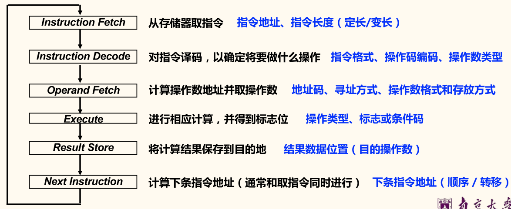
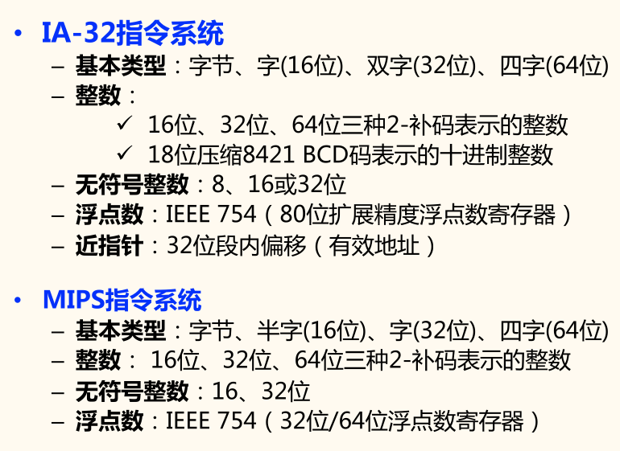
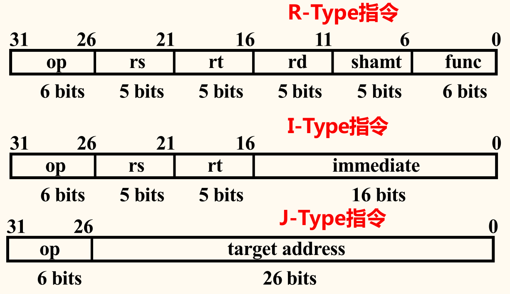
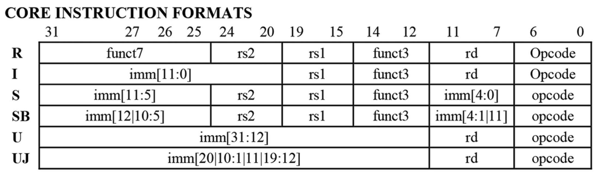
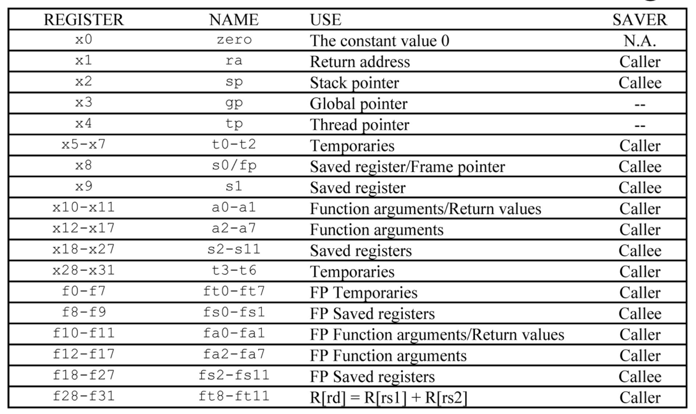
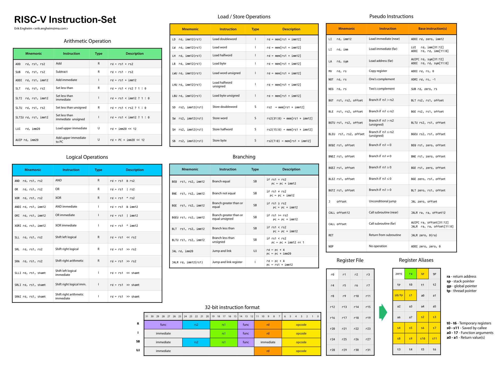

一台计算机能执行的机器指令的集合称为该机的**指令集**，它是构成程序的基本元素，也是硬件设计的依据，它衡量机器硬件的功能，反映硬件对软件支持的程度。

系统软件直接建立在硬件支持的指令基础上，系统程序员感觉到的计算机的功能特性和概念性结构就是**指令集体系结构**（instruction set architecture, ISA），简称**指令系统**。

## 指令格式设计

指令系统处在软/硬件交界面，能同时被硬件设计者和系统程序员看到
- 硬件设计者角度：指令系统为 CPU 提供功能需求（易于硬件设计）
- 系统程序员角度：通过指令系统来使用硬件，要求易于编写编译器
- 指令系统设计的好坏还决定了计算机的性能和成本

冯·诺伊曼结构机器对指令规定：
- 用二进制表示，和数据一起存放在主存中
- 由两部分组成：操作码和操作数（或其地址码）
    - **操作码**：定义操作类型
    - **操作数**：表示操作的源和目的

### 指令地址码的个数

一条指令必须显式或隐式包含的信息：
- **操作码**：指定操作类型，如加、减、乘、除、传送等
- **源操作数或其地址**：一个或多个源操作数所在的地址，如主（虚）存地址、寄存器编号、I/O 端口、指令给出
- **结果的地址**：产生的结果存放何处（目的操作数），如存储单元地址、寄存器编号、I/O 端口
- **下条指令地址**：下条指令存放何处，通常隐含在程序计数器 PC 中，当改变顺序时由指令给出

- 零地址指令 `op`
    1. 无需操作数：如空操作/停机等
    2. 所需操作数为默认的，如堆栈/累加器等
- 一地址指令 `op A1`：其地址既是操作数地址，也是结果地址。
    1. 单目运算：如取反/取负等
    2. 双目运算：另一操作数为默认的，如累加器等
- 二地址指令 `op A1, A2`（最常用）：分别存放双目运算中两个操作数，并将
其中一个地址作为结果的地址。
- 三地址指令 `op A1, A2, A3`（RISC 风格）：分别作为双目运算中两个源操作数的地
址和一个结果的地址。
- 多地址指令：用于成批数据处理的指令，如: 向量 /
矩阵等运算的 SIMD 指令。

### 指令格式设计原则

指令执行周期如下图所示：

*指令格式*的选择应遵循的几条基本原则
- 应尽量短
- 要有足够的操作码位数
- 指令编码必须有唯一的解释，否则是不合法的序列
- 指令字长应是字节的整数倍
- 合理地选择地址字段的个数
- 指令尽量规整

## 指令系统设计

### 基本设计问题

*指令系统*设计，必须遵循的基本原则
- **完备性或完整性**：应能足够编制任何可计算程序
- **兼容性**：高档机的指令系统应兼容以前低档机的指令系统
- **均匀性**：运算指令应能对多种类型的数据进行处理
- **可扩充性**：操作码字段要预留一定的编码空间，以便扩充

与指令集设计相关的重要方面
- 操作码的全部组成：操作码个数/种类/复杂度
    - LD/ST/INC/BRN 四种指令已足够编制任何可计算程序，但程序会很长
- 数据类型：对哪几种数据类型完成操作
- 指令格式：指令长度 / 地址码个数 / 各字段长度
- 通用寄存器：个数 / 功能 / 长度
- 寻址方式：操作数地址的指定方式
- 下条指令的地址如何确定：顺序，PC + 1；条件转移；无条件转移；……

一般通过对操作码进行不同的编码来定义不同的含义，操作码相同时，再由功能码定义不同的含义。

### 操作数类型

操作数是指令处理的对象，基本类型有：
- **指针或地址**：被看成无符号整数，用来参加运算以确定主（虚）存地址
- **数值数据**：
    - 定点数（整数）：一般用二进制补码表示
    - 浮点数（实数）：大多数机器采用 IEEE 754 标准
    - 十进制数：用 NBCD 码（8421 码）表示
- **位、位串、字符和字符串**：
    - 位和位串：标志、控制和状态等信息
    - 字符和字符串：表示文本等

例子如下：

### 寻址方式

**寻址方式**是指令或操作数地址的指定方式。即：根据地址找到指令或操作数的方法。

*地址码编码*由操作数的寻址方式决定，编码原则为：
- 指令地址码尽量短（目标代码短，省空间）
- 操作数存放位置灵活，空间应尽量大（利于编译器优化产生高效代码）
- 地址计算过程尽量简单（指令执行快）

指令的寻址比较简单，正常情况下通过 PC 增值的方式来确定下一条指令的地址。对于跳转指令，跟操作数寻址方式相同。

操作数的寻址比较复杂，通常寻址方式也特指「操作数的寻址」。
- 操作数来源：寄存器/外设端口/主(虚)存/栈顶
- 操作数结构：位/字节/半字/字/双字/一维表/二维表/…

寻址方式的确定：
1. 没有专门的寻址方式位（由操作码确定寻址方式）
    - 如：MIPS 指令，一条指令中最多仅有一个主（虚）存地址，且仅有一到两种寻址方式，Load/Store 型机器指令属于这种情况。
2. 有专门的寻址方式位
    - 如：x86 指令，一条指令中有多个操作数，且寻址方式各不相同，需要各自说明寻址方式，因此每个操作数有专门的寻址方式位。

**有效地址**的含义：操作数所在存储单元的地址（可能是逻辑地址或物理地址），可通过指令的寻址方式和地址码计算得到。

设
- `A`：地址字段值
- `R` 寄存器编号
- `EA`：有效地址
- `(X)`：`X` 中的内容

|    方式    |     算法     |        优点        |      缺点      |
|    :-:     |     :-:      |        :-:         |      :-:       |
|    立即    |  `操作数 = A`  |   指令执行速度快   | 操作数幅值有限 |
|    直接    |    `EA = A`    |  有效地址计算简单  |  地址范围有限  |
|    间接    |   `EA = (A)`   |   有效地址范围大   | 多次存储器访问 |
|   寄存器   | `操作数 = (R)` | 指令执行快，指令短 |  地址范围有限  |
| 寄存器间接 |   `EA = (R)`   |     地址范围大     | 额外存储器访问 |
|    偏移    |  `EA = A + (R)`  |        灵活        |      复杂      |
|    堆栈    |  `EA = 栈顶`   |       指令短       |    应用有限    |

偏移方式：将直接方式和寄存器间接方式结合起来，有*相对*/*基址*/*变址*三种。

`EA = A + (R)` 中，`R` 可以明显给出，也可以隐含给出；`R` 可以为 `PC`、基址寄存器 `B` 或变址寄存器 `I`。
- 相对寻址（`EA = A + (PC)`）：相对于*当前指令*处偏移量为 `A` 的单元
    - 指令地址码给出一个偏移量（带符号数），基准地址隐含由 `PC` 给出
    - 可用来实现程序（公共子程序）的浮动或指定转移目标地址
    - 注意：当前PC的值可以是正在执行指令的地址或下条指令的地址
- 基址寻址（`EA = A + (B)`）：相对于*基址 `(B)`* 处偏移量为 `A` 的单元
    - 指令地址码给出一个偏移量，基准地址明显或隐含由基址寄存器`B` 给出
    - 可用来实现多道程序重定位或过程调用中参数的访问
- 变址寻址（`EA = A + (I)`）：相对于*基址 `A`* 处偏移量为 `(I)` 的单元
    - 指令地址码给出一个基准地址，而偏移量（无符号数）明显或隐含由变址寄存器 `I` 给出
    - 可为循环重复操作提供一种高效机制，如实现对线性表的方便操作
    - 自动变址：指令中的地址码 `A` 给定数组首址，变址器 `I` 每次加/减数组元素的长度 `x`
        - 一般 RISC 机器不提供自动变址寻址，并将变址和基址寻址统一成一种偏移寻址方式

### 操作类型

- 算术和逻辑运算指令：加、减、乘、除、比较、与、或、取反等
- 移位指令：算术移位、逻辑移位、循环移位、半字交换等
- 传送指令：传送、读取、写等
- 串指令：串传送、串比较、检索、传送转换等
- 顺序控制指令：条件转移、无条件转移、跳步、调用、返回等
- CPU 控制指令：停机、开中断、关中断、系统模式切换等
- 输入输出指令：CPU 与外部设备交换数据或传输控制命令及状态信息

### 操作码编码

操作码编码方式
- 定长操作码编码
- 扩展操作码编码

编码长度
- 代码长度更重要时：采用变长指令字、变长操作码
- 性能更重要时：采用定长指令字、定长操作码

变长指令字和变长操作码使机器代码更*紧凑*；定长指令字、定长操作码*便于快速访问*和*译码*。

指令长度是否可变与操作码长度是否可变没有绝对关系，但通常是 ：「定长操作码不一定是定长指令字」、「变长操作码一般是变长指令字」。

- 定长操作码编码：指令的操作码部分采用固定长度的编码
    - 如：假设操作码固定为 6 位，则系统最多可表示 64 种指令
    - 特点：译码方便，但有信息冗余
- 扩展（变长）操作码编码
    - 基本思想：将操作码的编码长度分成几种固定长的格式。被大多数指令集采用。
    - 如：PDP-11 是典型的变长操作码机器。

!!! example ""
    设某指令系统指令字是 16 位，每个地址码为 6 位。若二地址指令 15 条，一地址指令 34 条，则剩下零地址指令最多有多少条？

    <!-- {{{ 解答 -->
    

    
解答

    
    操作码按短到长进行扩展编码。

    首先是二地址指令，需要 4 位进行描述，可以设为从 `(0000 ~ 1110)`。

    然后是一地址指令。上面已经占用了 `(0000 ~ 1110)`，因此一地址必须是 `(1111)`，再加上有 34 条，需要 6 位进行描述，可以划分为以下两种：
    - `11110 (00000 ~ 11111)`，共 32 条
    - `11111 (00000 ~ 00001)`，共 2 条

    最后是零地址指令，剩下的就是 `(00010 ~ 11111)`，这一共有 30 种，此外这一共也才占用了 10 位，还剩下六位，因此答案就是 $30 \times 2^6 = 15 \times 2^7$ 条。
    
    

    <!-- }}} -->

### 标志信息

条件转移指令通常根据 Condition Codes（条件码 CC/状态位/标志位）转移。

其余略。

### 指令系统设计风格

按操作数位置指定风格：
- 累加器型指令系统（早期机器）
    - 特点：其中一个操作数（源操作数 1）和目的操作数总在累加器中
- 堆栈型指令系统
    - 特点：总是将栈顶两个操作数进行运算，指令无需指定操作数地址
- 通用寄存器型指令系统
    - 特点：操作数可以是寄存器或存储器数据（即 A、B 和 C 可以是寄存器或存储单元）
- 装入/存储型指令系统
    - 特点：运算操作数只能是寄存器数据，只有 Load/Store 能访问存储器

早期 CISC (Complex Instruction Set Computer, 复杂指令集计算机) 机器的指令系统设计风格：
1. 指令系统复杂
    - 变长操作码/变长指令字/指令多/寻址方式多/指令格式多
2. 指令周期长
    - 绝大多数指令需要多个时钟周期才能完成
3. 各种指令都能访问存储器
    - 除了专门的存储器读写指令外，运算指令也能访问存储器
4. 采用微程序控制
5. 有专用寄存器
6. 难以进行编译优化来生成高效目标代码

RISV (Reduced Instruction Set Computer, 精简指令系统计算机) 机器的指令系统设计风格：
1. 简化的指令系统
    - 指令少/寻址方式少/指令格式少/指令长度一致
2. 以 RR[^RR] 方式工作
    - 除 Load/Store 指令可访问存储器外，其余指令都只访问寄存器。
3. 指令周期短
    - 以流水线方式工作， 因而除 Load/Store 指令外，其他简单指令都只需一个或一个不到的时钟周期就可完成。
4. 采用大量通用寄存器
    - 减少访存次数
5. 采用组合逻辑电路控制
    - 不用或少用微程序控制
6. 采用优化的编译系统
    - 有效地支持高级语言程序

[^RR]: 即 Register-Register，寄存器-寄存器型指令，从寄存器中取操作数，把操作结果放到另一寄存器中，不需要访问内存存储器，因此速度快。RS(Register-Storage, 寄存器-存储器) 和 SS(Storage-Storage, 存储器-存储器) 型指令既要访问内存单元，又要访问寄存器。

举例的 Pentium 和 MMX 懒得记了。

### 异常和中断处理机制

程序执行过程中 CPU 会遇到一些特殊情况，使正在执行的程序被「中断」。CPU 中止原来正在执行的程序，转到处理异常情况或特殊事件的程序去执行，结束后再返回到原被中止的程序处（断点）继续执行。

程序执行被「中断」的事件：
- 内部异常：在 CPU 执行某指令时内部发生的意外事件或特殊事件
    - 故障（fault）：执行某条指令时发生的异常事件，如溢出、缺页、越界、越权、越级、非法指令、除数为0、堆/栈溢出、访问超时等。
    - 自陷（trap）：执行预先设置的指令，如断点、单步、系统调用等。
    - 终止（abort）：指令执行过程中出现了硬件故障，如访存校验错等。
- 外部中断：在 CPU 外部发生的特殊事件，通过「中断请求」信号向 CPU 请求处理。如实时钟、控制台、打印机缺纸、外设准备好、采样计时到、DMA 传输结束等。

异常/中断处理分两个阶段
- 检测和响应：由硬件完成
- 具体的处理过程由软件（操作系统）执行程序完成

发生异常（exception）和中断（interrupt）事件后，系统将进入 OS 内核态对相应事件进行处理，即改变处理器状态（用户态→内核态）：

## 程序的机器级表示

### MIPS 汇编语言和机器语言

MIPS 中，所有指令都是 32 位宽，须按字地址对齐，字地址为 4 的倍数。

MIPS 三种指令格式：
- R-Type
    - 两个操作数和结果都在寄存器的运算指令
- I-Type
    - 运算指令：一个寄存器、一个立即数
    - Load 和 Store 指令
    - 条件分支指令
- J-Type
    - 无条件跳转指令

- `OP`（Operation）：操作码
    - R-Type 为 0 (000 000)
    - J-Type 为 2 (000 010) 或 3 (000 011)
    - I-Type 为其他
- `rs`（Register Source）：第一个源操作数寄存器
- `rt`（Register Target）：第二个源操作数寄存器
- `rd`（Register Destination）：结果寄存器
- `shamt`（Shift Amount）：移位量
- `func`（Function Code）：功能码
    - R-Type 指令中 `OP` 字段是特定的值，具体操作由 `func` 字段给定。
- `immediate`：立即数或 Load/Store 指令和分支指令的偏移地址
- `target address`：无条件转移地址的低 26 位。将 `PC` 高 4 位拼上 26 位直接地址，最后添 2 个 0 就是 32 位目标地址

### MIPS R-Type 指令的电路

1. 准备阶段
    - 装入指令寄存器 `IR`
    - 以下相应字段送控制逻辑
        - `OP` 字段
        - `func` 字段
        - `shamt` 字段
    - 以下相应字段送寄存器
        - 第一操作数寄存器编号
        - 第二操作数寄存器编号
        - 存放结果的目标寄存器编号
2. 执行阶段
    - 寄存器号被送选择器
    - 对应选择器输出被激活
    - 被选寄存器的输出送到数据线
    - 控制逻辑提供：
        - ALU 操作码
        - 写信号等
    - 结果被写回目标寄存器

存储器数据指定：
- 32-bit 有效地址，可访问空间: $2^{32}$ 字节
- 采用*大端*方式访问数据
- 只能通过 Load/Store 指令访问存储器数据
- 数据地址通过一个 32 位寄存器内容加 16 位偏移量得到
- 16 位偏移量是带符号整数，使用*符号扩展*
- 数据要求按边界对齐

!!! memo ""
    有关 MIPS 算术和逻辑指令、数据传输指令、调用/返回指令、算术运算、选择/循环结构等内容，《计算系统基础》中或多或少有涉及，我就不记了。

### 过程调用

过程调用的执行步骤（假设过程 P 调用过程 Q）：
- 调用过程 P 中完成
    1. 将参数放到 Q 能访问到的地方
    2. 将 P 中的返回地址存到特定的地方，将控制转移到过程 Q
- 被调用过程 Q 中完成
    1. 为 Q 的局部变量分配空间（局部变量临时保存在栈中）
    2. 执行过程 Q
    3. 将 Q 执行的返回结果放到 P 能访问到的地方
    4. 取出返回地址，将控制转移到 P，即返回到 P 中执行

MIPS 规定少量过程调用信息用寄存器传递。通常使用 `$a0 ~ $a3` 作为过程调用参数，使用 `$v0 ~ $v1` 作为过程调用返回值，使用 `$t0 ~ $t7` 作为临时变量，在被调用过程无需保存。

更多的参数和返回值要保存到存储器的特殊区域——栈当中，以便嵌套或循环调用。

Linux 在 x86 上的虚拟地址空间
- 内核（Kernal）
- 用户栈（User Stack）
- 共享库（Shared Libraries）
- 堆（Heap）
- 可读写数据（Read/Write Data）
- 只读数据（Read-Only Data）
- 代码（Code）

上面灰色部分称为「空洞」（Hole）。

加载数据时不会真正从磁盘调入信息到主存，只是将代码和数据与虚拟空间建立对应关系，称为「映射」。

#### 栈

MIPS 中栈的实现：
- 用栈指针寄存器 `$sp` 来指示栈顶元素
- 每个元素的长度为 32 位，即：一个字（4 个字节）
- 「入栈」和「出栈」操作用  `sw`/`lw`  指令来实现，需用 `add`/`sub` 指令调整 `$sp` 的值，不能像 x86 那样自动进行栈指针的调整（有些处理器有专门的 `push`/`pop` 指令，能自动调整栈指针。如 x86）
- 栈生长方向：*从高到低*地址「增长」，而取数/存数的方向是*从低到高*地址（大端方式）
    - 每入栈 1 字：`$sp - 4 -> $sp`
    - 每出栈 1 字：`$sp + 4 -> $sp`

#### 栈帧

各过程有自己的栈区，称为**栈帧**（stack frame），即*过程的帧*（procedure frame）。

栈由若干栈帧组成。

- 用专门的**帧指针**寄存器指定起始位置
- 当前*栈帧范围*在<u>帧指针和栈指针之间</u>
- 程序执行时，栈指针*可移动*，帧指针*不变*。所以过程内对栈信息的访问可通过帧指针进行
- 复杂局部变量一定分配在栈帧中

<u>程序可访问的寄存器组是所有过程共享的资源</u>，给定时刻只能被一个过程使用，因此过程中使用的寄存器的值不能被另一个过程覆盖。

MIPS 寄存器使用约定：
- 保存寄存器 `$s0 ~ $s7`  的值在从被调用过程返回后还要被用，被调用者需要保留
- 临时寄存器 `$t0 ~ $t9` 的值在从被调用过程返回后不需要被用（需要的话，由调用者保存） ，被调用者可以随意使用
- 参数寄存器 `$a0 ~ $a3` 在从被调用过程返回后不需要被用（需要的话，由调用者保存在栈帧或其他寄存器中），被调用者可以随意使用
- 全局指针寄存器 `$gp` 的值不变
- 帧指针寄存器 `$fp` 用栈指针寄存器 `$sp - 4`来初始化

需在*被调用过程 Q* 中入栈保存的寄存器（**被调用者保存**）
- 返回地址 `$ra`
- 保存寄存器 `$s0 ~ $s7`
- 所有局部数组和结构等复杂类型变量

若局部变量和临时变量发生了寄存器溢出（寄存器不够分配），则也要入栈。

## 指令系统实例

### RISC-V 指令系统

RISC-V 的模块化结构
- 核心：RV32I + 标准扩展集（RV32M, RV32F, RV32D, RV32A）= RV32G
- 32 位架构 RV32G = RV32IMAFD，其压缩指令集 RV32C（指令长度 16 位）
- 64 位架构 RV64G = RV64IMAFD，其压缩指令集 RV32C（指令长度 16 位）
- 向量计算 RV32V 和 RV64V；嵌入式 RV32E

!!! memo ""
    我以为《计算系统基础》课程中记录过了 RISC-V 指令系统，于是不打算再详细记录，结果记录的是[「略」](/notes/E-fundamentals-of-computing-systems/05-instruction-set-architecture#RISC-V-指令集)……

    不过当时看额外的文档也差不多了，就只放几张图罢。

!!! info RTL(Register Transfer Language) 规定
    - `R[r]`：通用寄存器 `r` 的内容
    - `M[addr]`：存储单元 `addr` 的内容
    - `M[R[r]]`：寄存器 `r` 的内容所指存储单元的内容
    - `PC`：`PC` 的内容
    - `M[PC]`：`PC` 所指存储单元的内容
    - `SEXT[imm]`：对立即数 `imm` 进行符号扩展
    - `ZEXT[imm]`：对立即数 `imm` 进行零扩展
    - 传送方向用 `<-` 表示，即传送源在右，传送目的在左
