## 概述

### 指令与功能

CPU 执行指令过程：
1. 取指阶段
    1. 取指令
    2. `PC + 1` 送 `PC`
2. 译码和执行阶段
    1. 指令译码
    2. 主存地址运算
    3. 取操作数
    4. 算数/逻辑运算
    5. 存储结果

以上每步都需检测「异常」，若有异常，则自动切换到异常处理程序。同时检测是否有「中断」请求，有则转中断处理。

每条指令的功能由以下四种基本操作的组合实现：
1. 读取某一主存单元的内容，并将其装入某个寄存器
    - 取指令、取操作数
2. 把一个数据从某个寄存器存入给定的主存单元中
    - 存储结果
3. 把一个数据从某个寄存器送到另一个寄存器或 ALU 中
    - 取数据、存储结果
4. 进行算术或逻辑运算
    - `PC + 1` 送 `PC`、计算地址、算数/逻辑运算

!!! info RTL(Register Transfer Language) 规定
    - `R[r]`：通用寄存器 `r` 的内容
    - `M[addr]`：存储单元 `addr` 的内容
    - `M[R[r]]`：寄存器 `r` 的内容所指存储单元的内容
    - `PC`：`PC` 的内容
    - `M[PC]`：`PC` 所指存储单元的内容
    - `SignExt(imm)`：对立即数 `imm` 进行符号扩展
    - `ZeroExt(imm)`：对立即数 `imm` 进行零扩展
    - 传送方向用 `<-` 表示，即传送源在右，传送目的在左

### 数据通路

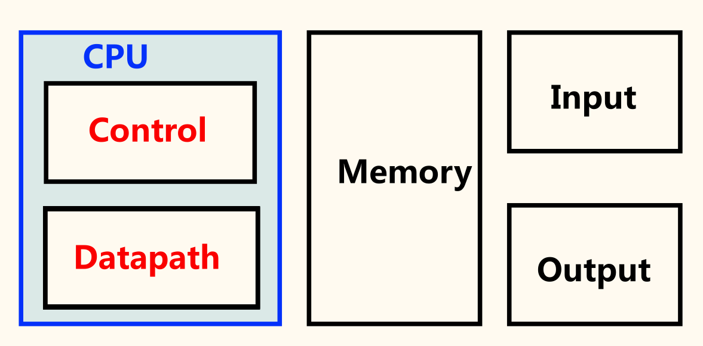

**数据通路**（Data Path）是指令执行过程中，数据所经过的路径，包括路径中的部件。它是<u>指令的执行部件</u>。

**控制器**（Control）的功能是，对指令进行译码，生成指令对应的控制信号，控制数据通路的动作。能对执行部件发出控制信号，是<u>指令的控制部件</u>。

数据通路由两类元件组成：
- 组合逻辑元件（也称为操作元件）
- 时序逻辑元件（也称为状态元件、存储元件）

元件间连接方式：
- 总线连接方式
- 分散连接方式

数据通路的构成方式：由「操作元件」和「存储元件」通过总线方式或分散方式连接而成。

数据通路的功能：进行数据存储、处理、传送。

即数据通路是由操作元件和存储元件通过总线方式或分散方式连接而成的进行数据存储、处理、传送的路径。

#### 操作元件

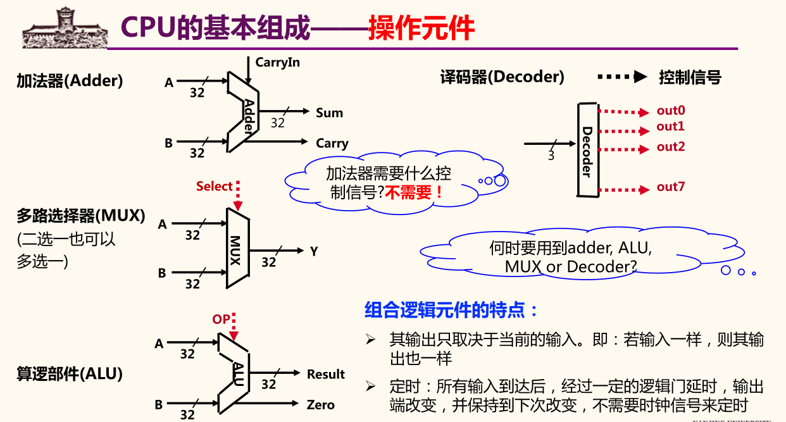

特点：
- 输出只取决于当前的输入
- 定时：所有输入到达后，经过一定的逻辑门延时，输出端改变，并保持到下次改变，不需要时钟信号来定时

#### 状态元件

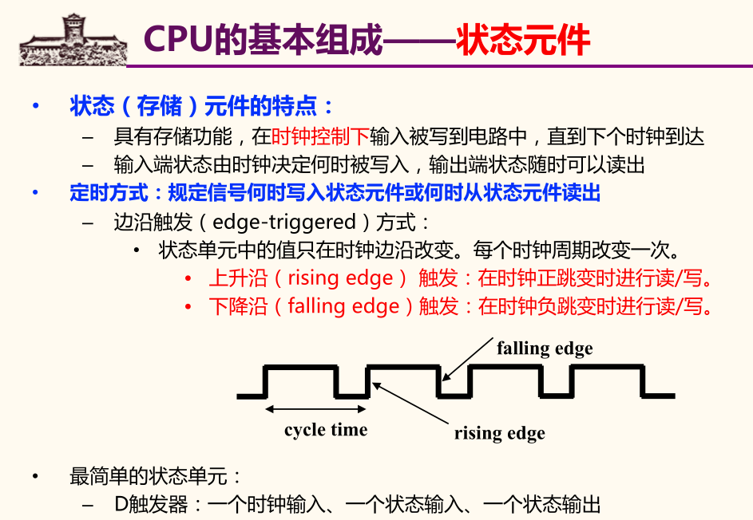

特点：
- 具有存储功能，在时钟控制下输入被写到电路中，直到下个时钟到达
- 输入端状态由时钟决定何时被写入，输出端状态随时可以读出

定时方式：规定信号何时写入状态元件或何时从状态元件读出。
- 边缘触发（edge-triggered）方式：状态单元中的值只在时钟边沿改变。每个时钟周期改变一次。
    - 上升沿（rising edge）触发：在时钟正跳变时进行读/写。
    - 下降沿（falling edge）触发：在时钟负跳变时进行读/写。

最简单的状态单元——D 触发器，有一个时钟输入、一个状态输入、一个状态输出：

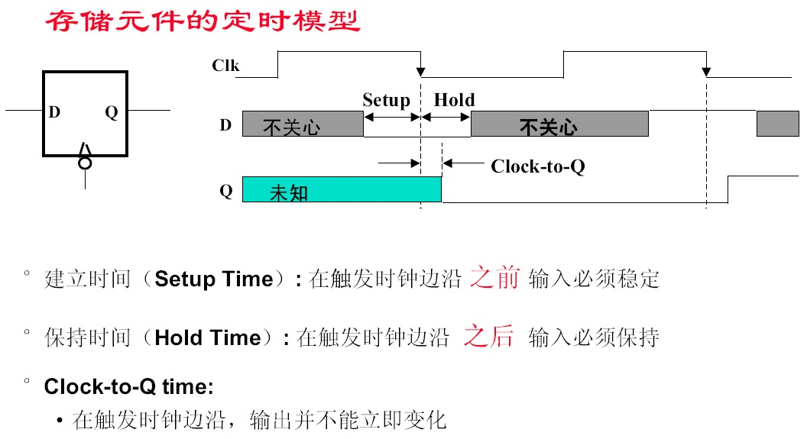

- **建立时间**（Setup）：触发时钟边沿之后，输入必须稳定
- **保持时间**（Hold）：在触发时钟边沿之后，输入必须稳定
- **锁存延迟**（Clk-to-Q）：在触发时钟边沿，输出并不能立即变化

数据通路中的状态元件有两种：寄存器（组）+ 存储器。

#### 寄存器（组）

- 寄存器（Register）
    - 有一个写使能（Write Enable, WE）信号
        - 0：时钟边沿到来时，输出不变
        - 1：时钟边沿到来时，输出开始变为输入
    - 若每个时钟边沿都写入，则不需 WE 信号
    - 
- 寄存器组（Register File）
    - 两个读口（组合逻辑操作）：busA 和 busB 分别由 RA 和 RB 
给出地址。地址 RA 或 RB 有效后，经一个「取数时间」（ AccessTime ），busA 和 busB 有效。
    - 一个写口（时序逻辑操作）：写使能为 1 的情况下，时钟边沿到来时，busW 传来的值开始被写入 RW 指定的寄存器中。
    - 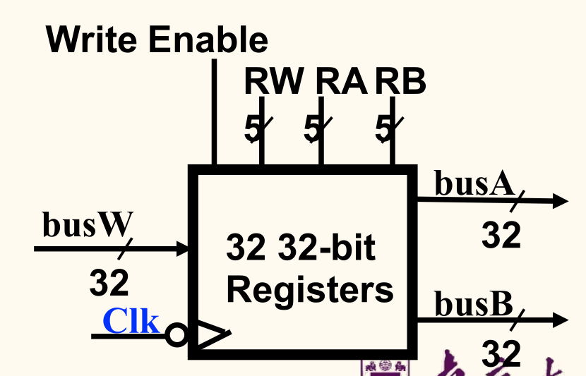

寄存器组的内部结构：

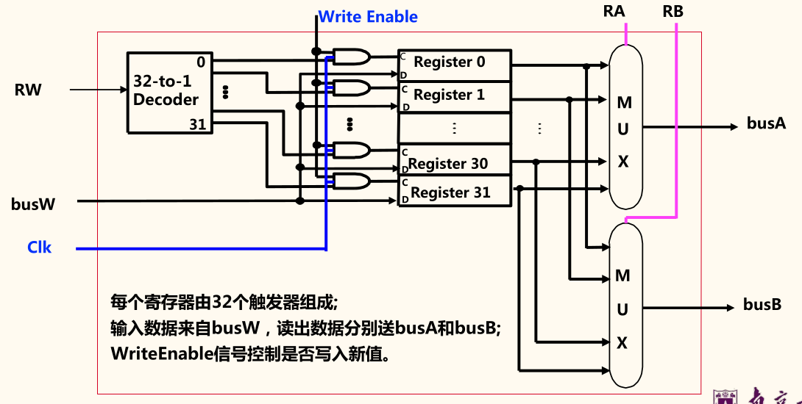

#### 存储器

理想存储器（idealized memory）
- Data Out：32 位读出数据
- Data In：32 位写入数据
- Address：读写公用一个32位地址

存储器的读写操作：
- 读操作（组合逻辑操作）：地址 Address 有效后，经一个「取数时间」，Data Out 上数据有效。
- 写操作（时序逻辑操作）：写使能为 1 的情况下，时钟 Clk 边沿到来时，Data In 传来的值开始被写入 Address 指定的存储单元中。

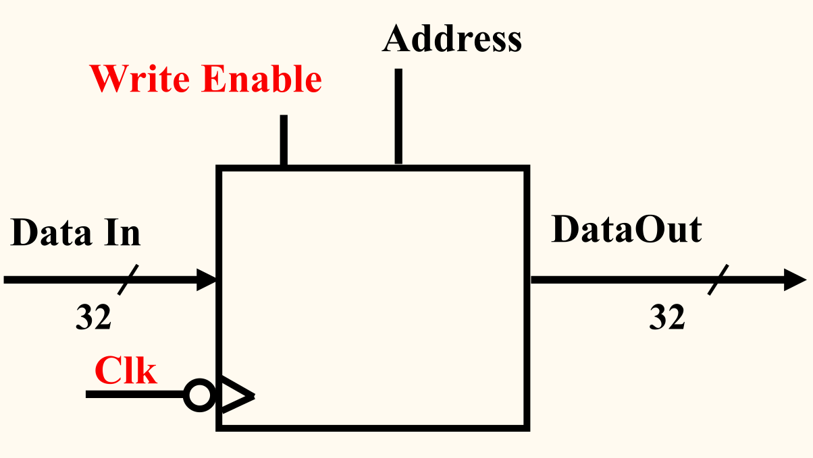

#### 数据通路与时序控制

**同步系统**（Synchronous System）：
- 所有动作有专门时序信号来定时
- 由时序信号规定何时发出什么动作

**时序信号**是同步系统中用于进行同步控制的定时信号，如时钟信号。

**指令周期**是取并执行一条指令的时间。每条指令的指令周期未必一样。

早期计算机采用「三级时序系统」：
- 机器周期 - 节拍 - 脉冲
- 指令周期可分为取指令、读操作数、执行并写结果等多个基本工作周期，称为**机器周期**。
- 机器周期有取指令、存储器读、存储器写、中断响应等不同类型

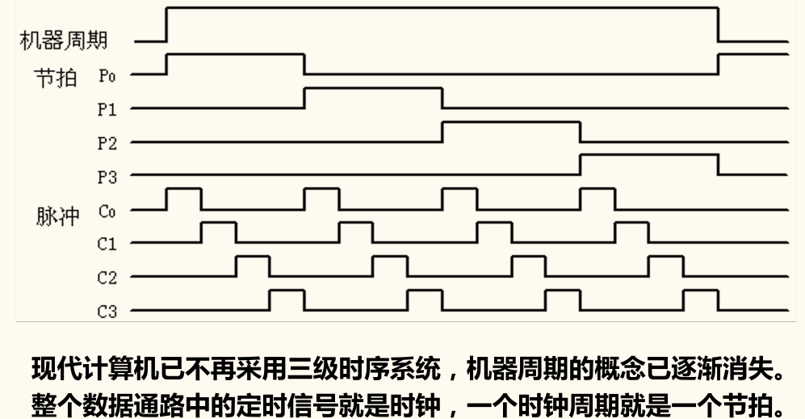

现代计算机的时钟周期：
- 数据通路由「… + 状态元件 + 操作元件（组合电路）+ 状态元件 + …」组成
- 只有状态元件能存储信息，所有操作元件都须从状态单元接收输入，并将输出写入状态单元中。其输入为前一时钟生成的数据，输出为当前时钟所用的数据

假定采用下降沿触发（负跳变）方式（也可以是上升沿方式）
- 所有状态单元在下降沿写入信息，经过锁存延迟后输出开始有效。
- 假定每个时钟的下降沿是一个时钟周期的开始时刻，则一个时钟周期内整个处理过程如下：经过 Clk-to-Q 时间，前一个时钟周期内组合逻辑生成的信号被写入状态元件，并输出到随后的组合逻辑电路进行处理，经过若干级门延迟，得到的处理结果被送到下一级状态元件的输入端，然后必须稳定一段时间（setup time）才能开始下个时钟周期，并在时钟信号到达后还要保持一段时间（hold time）。
- 时钟周期 = 锁存延迟 + 最长传输延迟 + 建立时间 + 时钟偏移；
- 约束条件：（锁存延迟 + 最短传输延迟 - 时钟偏移）> 保持时间

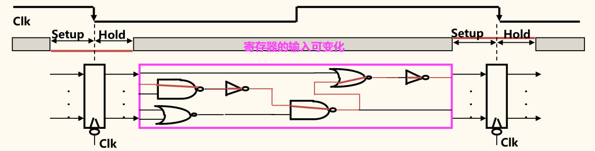

## 单周期处理器设计

ISA 确定后，进行处理器设计的大致步骤：
- 第一步：分析每条指令的功能，并用 RTL(Register Transfer Language) 来表示。
- 第二步：根据指令的功能给出所需的元件，并考虑如何将他们互连。
- 第三步：确定每个元件所需控制信号的取值。
- 第四步：汇总所有指令所涉及到的控制信号，生成反映指令与控制信号之间关系的表。
- 第五步：根据表得到每个控制信号的逻辑表达式，据此设计控制器电路。

处理器设计涉及到数据通路的设计和控制器的设计。

以 MIPS 的三种指令格式，七种指令为例：
- `add`, `sub`
    - `add/sub rd, rs, rt`
- `ori`
    - `ori rt, rs, imm16`
- `load`, `store`
    - `lw/sw rt, imm16(rs)`
- `beq`
    - `beq rs, rt, imm16`
- `j`
    - `j target`

这些指令具有代表性：有算术运算、逻辑运算；有 RR 型、 RI 型；有访存指令；有条件转移、无条件转移。

### 寄存器传送级语言 RTL

- `add rd, rs, rt`
    - `M[PC]`：从 `PC` 所指的内存单元中取指令
    - `R[rd] <- R[rs] + R[rt]`：从 `rs` 与 `rt` 所知的寄存器中取数后相加。若结果不溢出，则将结果送 $rd$ 所知的寄存器中；若结果溢出，则不送结果，并转到「溢出处理程序」执行
    - `PC <- PC + 4`：将 `PC` 加 4，使`PC` 指向下一条指令
- `lw rt, imm16(rs)`
    - `M[PC]`：从 `PC` 所指的内存单元中取指令
    - `R[rt] <- M[R[rs] + SignExt(imm16)]`：从 `rs` 所知的寄存器中取数后加上符号扩展后的立即数 `imm16`，得到存储器地址，从该地址取数后送 `rt` 所知的寄存器中
    - `PC <- PC + 4`：将 `PC` 加 4，使 `PC` 指向下一条指令

其他指令分析类似。

### 数据通路

#### 取指令部件

每条指令都有的公共操作：
1. 取指令：`M[PC]`
2. 更新 `PC`：`PC <- PC + 4`

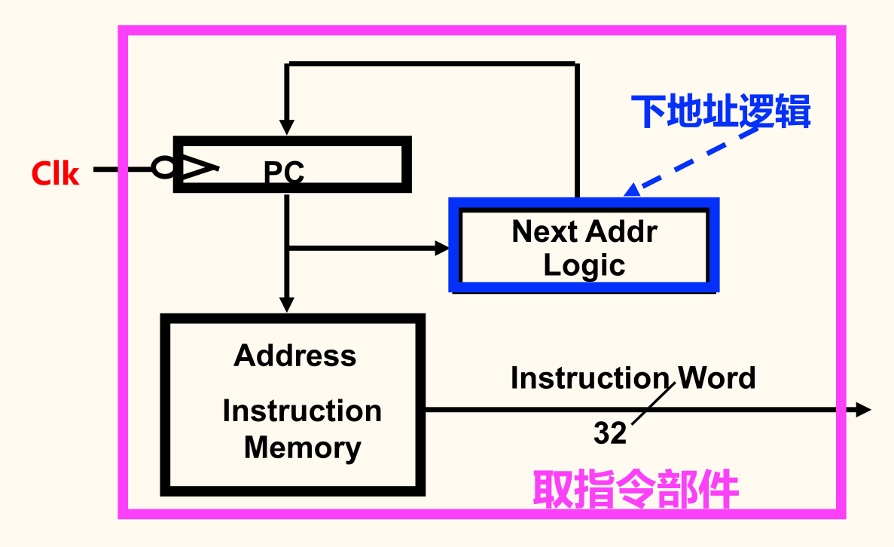

#### R-型指令的数据通路

```mips
R[rd] <- R[rs] op R[rt]
```

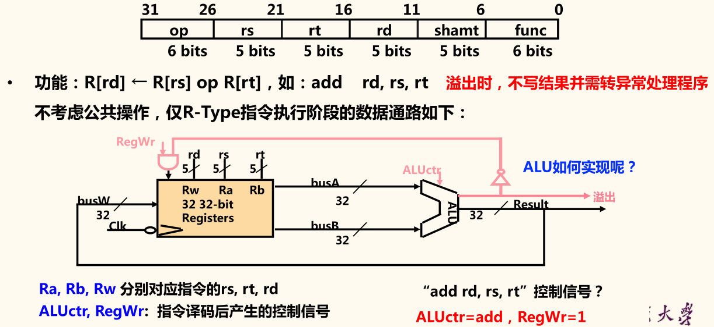

其中
- `ALUctr`：ALU 控制信号（ALU Control）
- `RegWr`：寄存器写使能信号（Register Write Enable）

#### 带立即数的逻辑指令的数据通路

```mips
R[rt] <- R[rs] op ZeroExt(imm16)
```

`ori rt, rs, imm16`
- `M[PC]`
- `R[rt] <- R[rs] or ZeroExt(imm16)`
- `PC <- PC + 4`

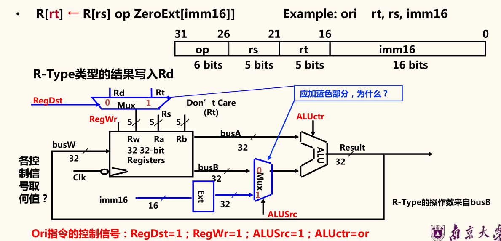

其中
- `Mux`：多路选择器（Multiplexer）
- `ALUSrc`：ALU 选择信号（ALU Source）
- `RegDst`：寄存器目的选择信号（Register Destination）

#### 访存指令中数据装入指令（`lw`）的数据通路

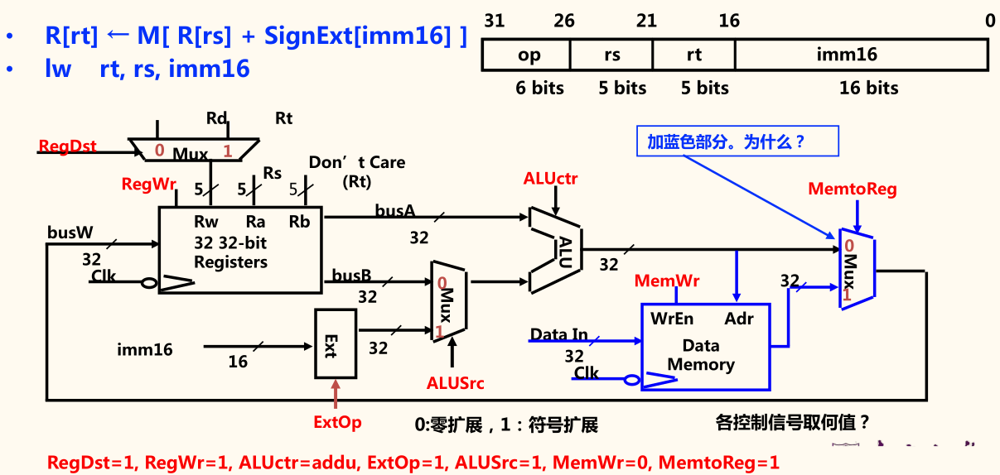

> 上图 `RegDst` 那边 Rd, Rt 有点偏移，需要注意一下。

其中
- `ExtOp`：立即数扩展操作（Extend Operation）
    - 0：零扩展（Zero Extend）
    - 1：符号扩展（Sign Extend）
- `MemWr`：存储器写使能信号（Memory Write Enable）
- `MemtoReg`：存储器到寄存器选择信号（Memory to Register）

#### 访存指令中数据存储指令（`sw`）的数据通路

`sw rt, imm16(rs)`
- `M[PC]`
- `M[R[rs] + SignExt(imm16)] <- R[rt]`
- `PC <- PC + 4`

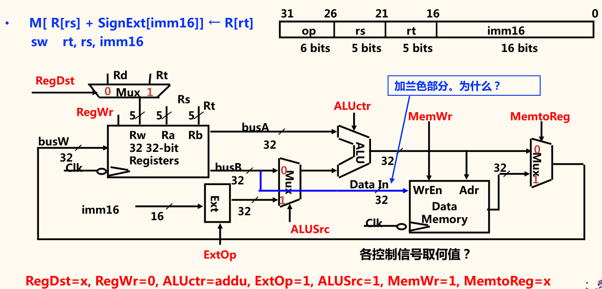

其中
- `x` 表示不关心的位

#### 分支（条件转移）指令的数据通路

`beq rs, rt, imm16`
- `M[PC]`
- `Cond <- R[rs] - R[rt]`
    1. 若 `Cond == 0`：`PC <- PC + 4 + (SignExt(imm16) * 4)`
    2. 若 `Cond != 0`：`PC <- PC + 4`

这里的立即数的含义是「相对指令数」，而非「相对单元数」。

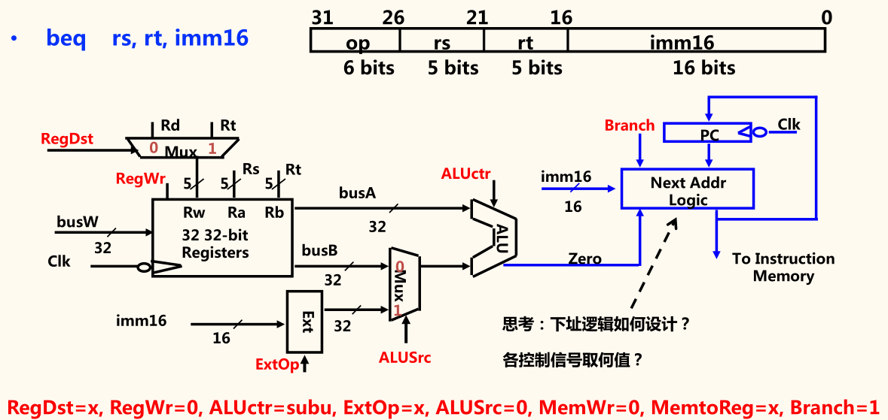

#### 下地址计算逻辑的设计

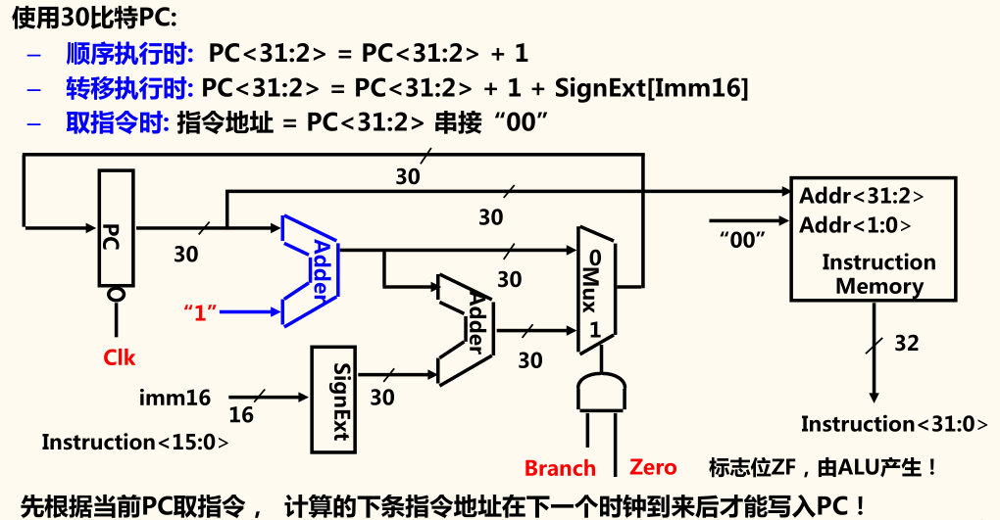

#### 无条件转移指令的数据通路

`j target`
- `M[PC]`
- `PC[31:2] <- PC[31:28] || target[25:0]`

是「绝对寻址」，而非「相对寻址」。

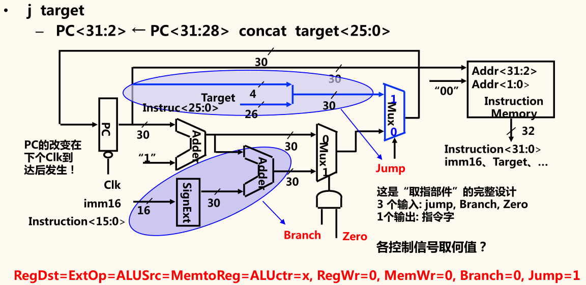

#### 综合 7 条指令的完整数据通路

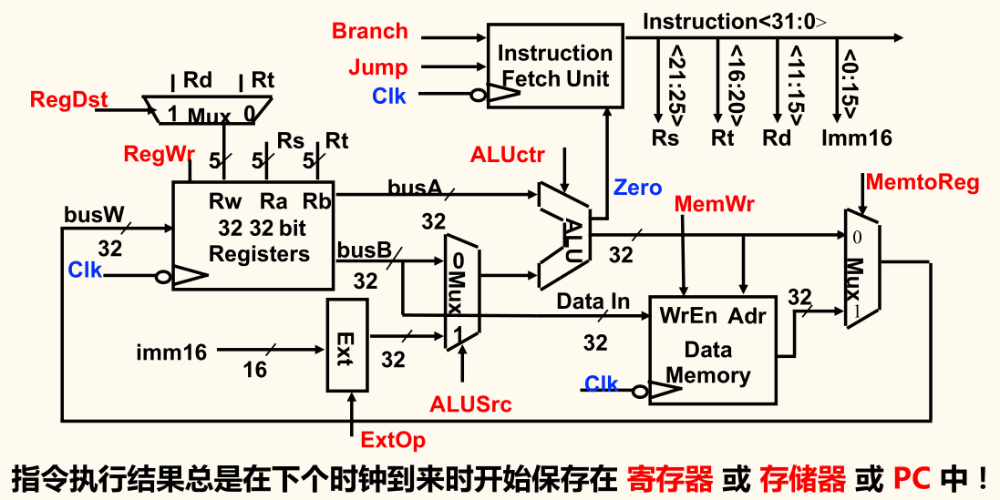

### 控制器的设计

下一个目的就是设计单周期数据通路的控制器。

各类指令执行过程略。详细可见 PPT。

#### 指令与控制信号的关系表

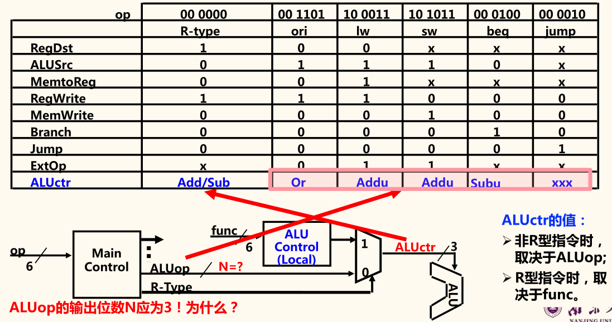

#### ALUop 逻辑表达式

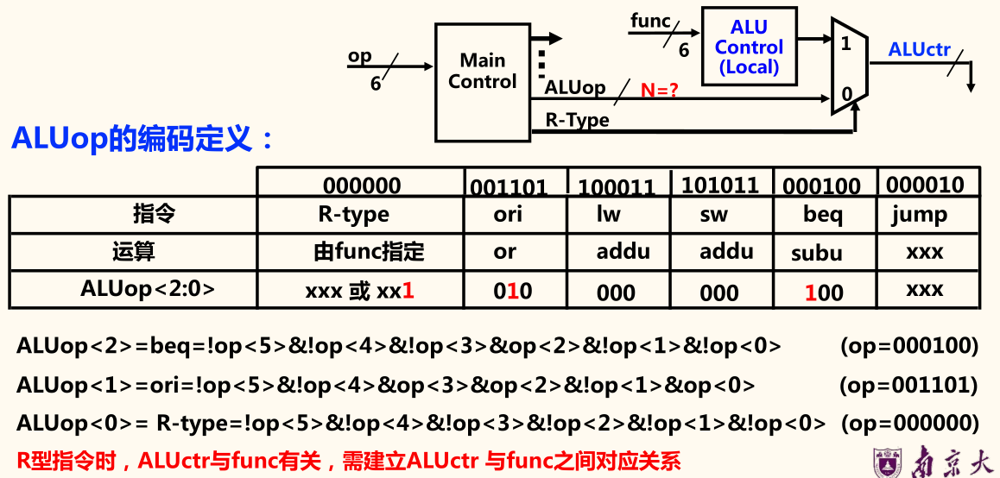

ALU 局部控制器逻辑表达式：

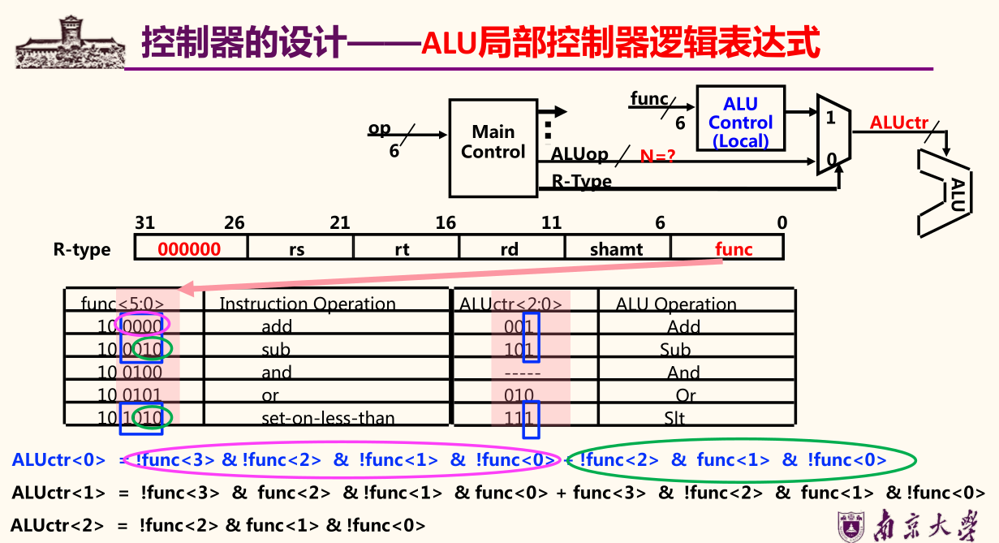

#### 控制信号（如 RegWrite）的逻辑方程

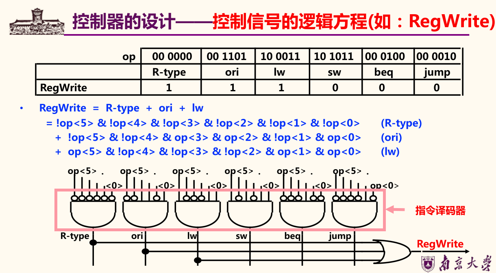

#### 主控制器的 PLA  实现

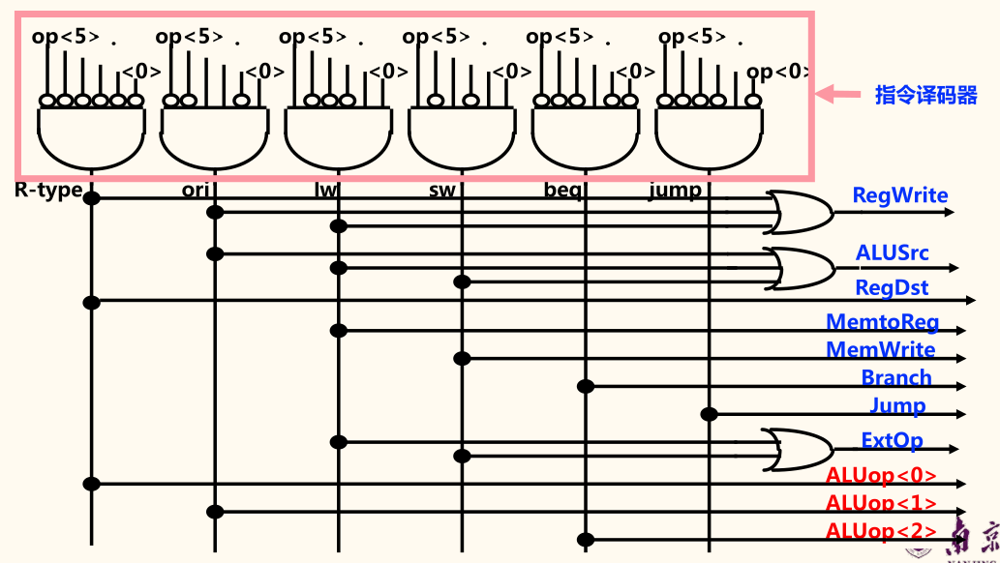

PLA 即可编程逻辑阵列（Programmable Logic Array），是一种可编程逻辑器件。

#### 执行 7 条指令的完整单周期处理器

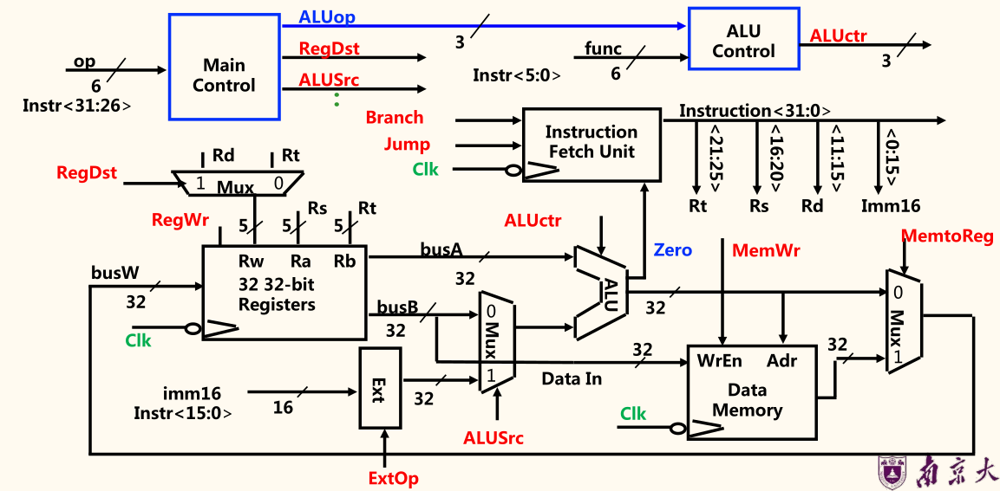

### 时钟周期的确定

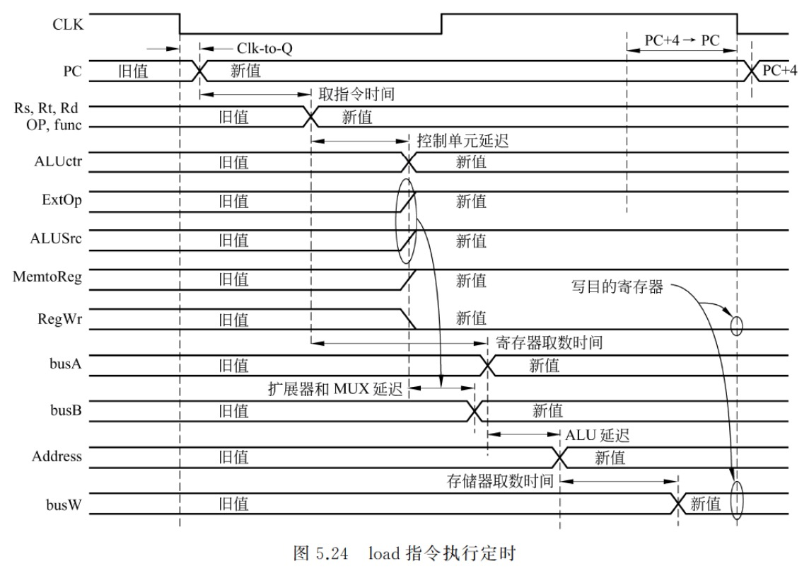

!!! memo ""
    这部分（单周期处理器设计）记得有点摆，不过重看了遍课件，大致理解了，因此也懒得补了。

## 多周期处理器设计

### 多周期数据通路

单周期处理器的缺点：
- 单周期处理器的 CPI 为 1，所有指令的执行时间都以最长的 `load` 指令为准
    - 具体如上图，为：锁存时间 + 取指令时间 + 寄存器取数时间 + ALU 延迟 + 存储器取数时间 + 建立时间 + 时钟偏移
- 时钟周期远远大于其他指令实际所需的执行时间，效率极低
    - R-型指令、立即数运算指令不需要读内存
    - `store` 指令不需要写寄存器
    - 分支跳转指令不需要访问内存和写寄存器
    - `jump` 指令不需要 ALU 运算、读内存、读写寄存器

解决思路：
- 把指令的执行<u>分成多个阶段</u>，每个*阶段*在一个时钟周期内完成
    - 时钟周期以*最复杂阶段*所花时间为准
    - 尽量分成*大致相等*的若干阶段
    - 规定每个阶段最多只能完成 1 次访存或寄存器堆读/写或 ALU
- 每步都设置存储元件，每部执行结果都在下个时钟开始保存到相应单元

好处：
- 时钟周期短
- 不同指令所用周期数可以不同，如：
    - `load`：5 个时钟周期
    - `jump`：3 个时钟周期（前两个都一样）
- 允许功能部件在一条指令执行过程中被重复使用。如：
    - 单周期有 Adder 和 ALU（多周期时只用一个 ALU，在不同周期可重复使用）
    - 单周期分开指令和数据存储器（多周期时合用，不同周期中重复使用）

### 竞争问题

- 单周期机器中，寄存器组和存储器被简化为理想的：
    - 时钟边沿到来之前，地址、数据和写使能都已经稳定
    - 时钟边沿到来时，才进行写
- 实际机器中，寄存器组和存储器的情况为：
    - 写操作不是由时钟边沿触发，是组合电路，其过程为：
        - 写使能（WE）为 1，并且 Din 信号已稳定的前提下，经过 Write Access 时间，Din 信号被写入 Adr 处
    - 重要之处: 地址和数据必须在写使能为 1 前稳定

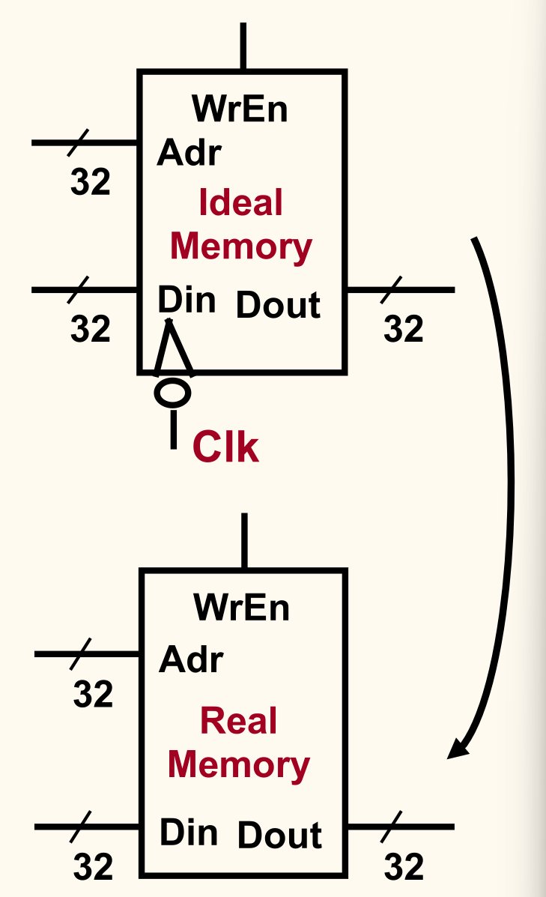

实际寄存器组、存储器在单周期通路中都不能可靠工作：
- 寄存器组（Register File）
    - 不能保证 Rw 和 busW 在 RegWr=1 之前稳定。即在 Rw 和 busW 与 RegWr 之间存在竞争（race）。
- 存储器（Memory）
    - 不能保证 Adr 和 Din 在 WrEn=1 之前稳定。即：在 Adr 和 Din 与 WrEn 之间存在竞争。

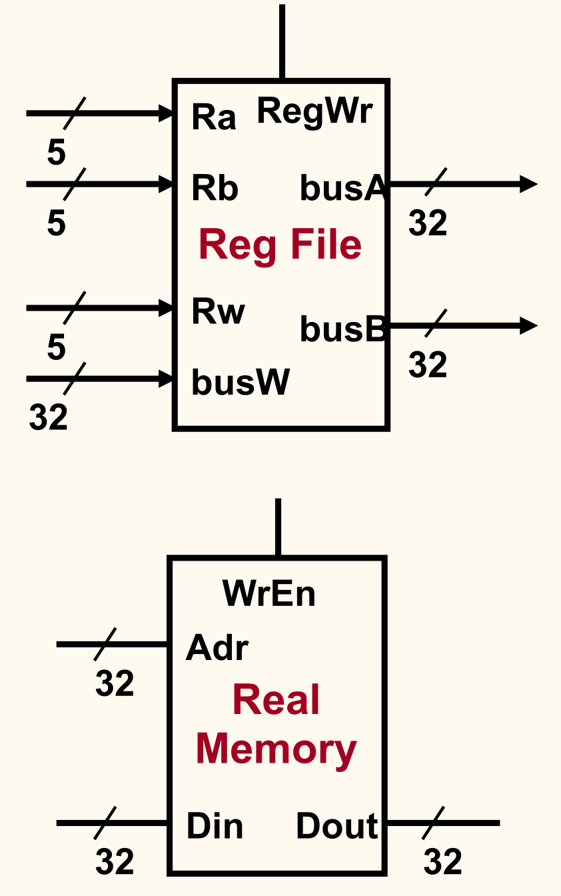

多时钟周期中解决竞争问题：
- 确认地址和数据在第 N 周期结束时已稳定
- 使写使能信号在一个周期后（即：第 N+1 周期）有效
- 在写使能信号无效前地址和数据不改变

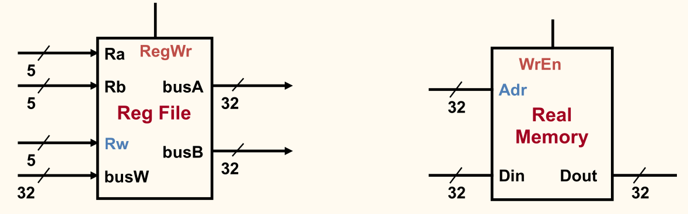

## 带异常处理的处理器设计
