## 流水线概述

如果将指令的每个阶段看成相应的流水段，则指令的执行过程构成了一条指令流水线。

一条指令流水线由如下 5 个流水段组成：
- **取指令**（IF）：从存储器取指令；
- **指令译码**（ID）：产生指令执行所需的控制信号；
- **取操作数**（OF）：读取操作数；
- **执行**（EX）：对操作数完成指定操作；
- **写回**（WB）：将结果写回。

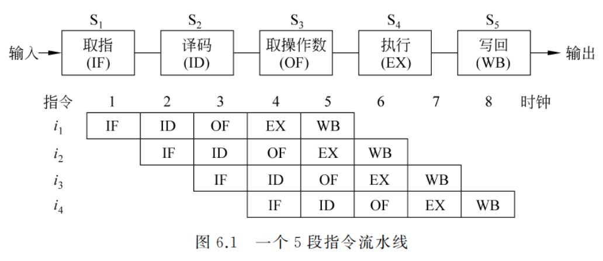

当后一条指令的第 i 步与前一条指令的第 i+1 步同时进行，可以使一串指令总的完成时间大为缩短。

理想情况下，每个时钟都有一条指令进入流水线，每个时钟周期都有一条指令完成，每条指令的时钟周期数（即 CPI）都为 1。

### `load` 指令流水线

对于 `load` 指令的五个阶段：
1. **Ifetch**（取指）：取指令并计算 PC + 4
    - 指令存储器、Adder
2. **Reg/Dec**（取数和译码）：取数的同时译码
    - 寄存器堆读口、指令译码器
3. **Exec**（执行）：计算内存单元地址
    - 扩展器、ALU
4. **Mem**（读存储器）：从数据存储器中读
    - 数据存储器
5. **Wr**（写寄存器）：将数据写到寄存器中
    - 寄存器堆写口

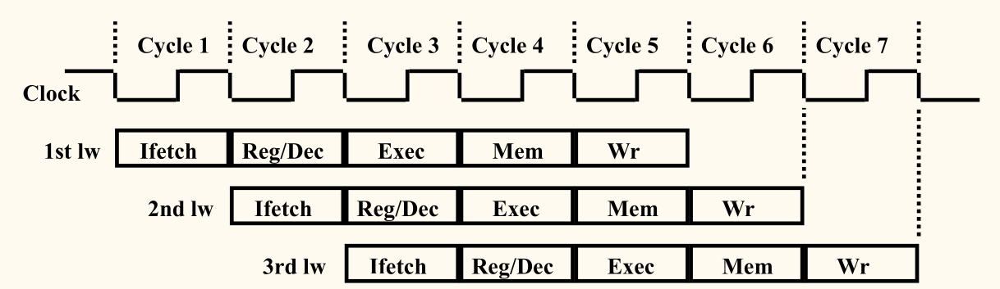

`load` 指令的流水线如上所示，每个周期有五个功能部件同时在工作，后面指令在前面完成取指后马上开始。每个`load` 指令仍需要 5 个周期，但**吞吐率**（throughput）提高了许多。

理想情况下有：
- 每个周期有一条指令进入流水线
- 每个周期都有一条指令完成
- 每条指令的有效周期（CPI）为 1

流水线方式下，<u>单条指令执行时间不能缩短</u>，但能<u>大大提高指令吞吐率</u>。

### 适合流水线的指令集特征

「规整」「简单」和「一致」等特性有利于指令的流水线执行：
- **长度尽量一致**：有利于简化取指令和指令译码操作。
- **格式少，且源寄存器位置相同**：有利于在指令未知时就可取操作数。
    - 若位置随指令不同而不同，则需先确定指令类型才能取寄存器编号。
- **`load` 和 `store` 指令才能访问寄存器**：有利于减少操作步骤，规整流水线。
    - `load` 和 `store` 指令的地址计算和运算指令的执行步骤规整在同一个周期。
- **内存中「对齐」存放**：有利于减少访存次数和流水线的规整。

## 流水线处理器的实现

### 指令功能段划分

#### `load` 指令的流水线

如下图所示：

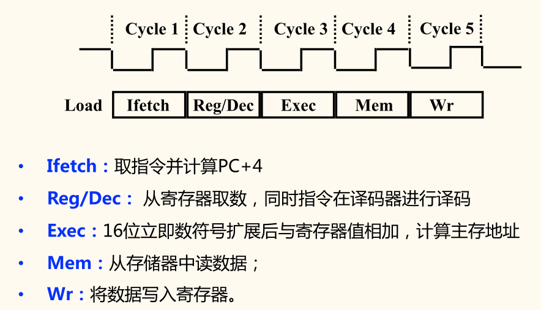

#### R-型指令功能段划分

如下图所示：

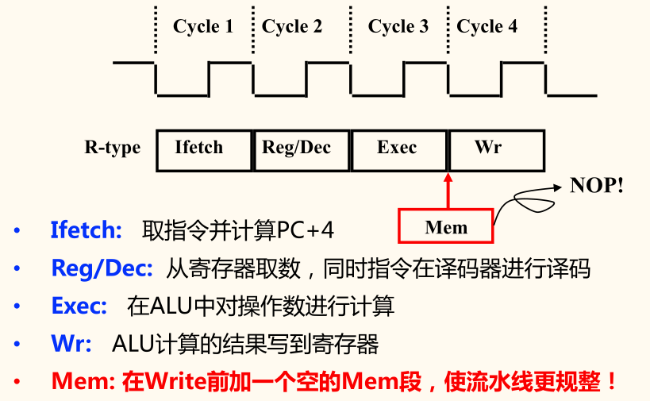

I-型指令功能段划分与 R-型指令相同。

#### `store` 指令功能段划分

如下图所示：

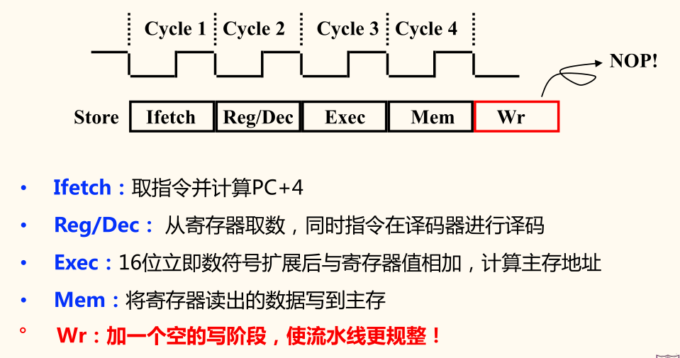

#### `beq` 指令功能段划分

如下图所示：

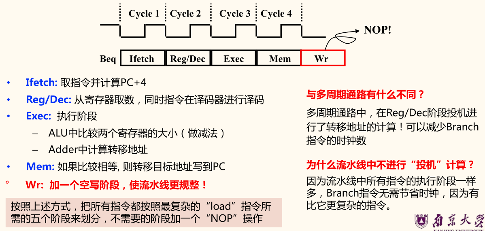

#### `j` 指令功能段划分

如下图所示：

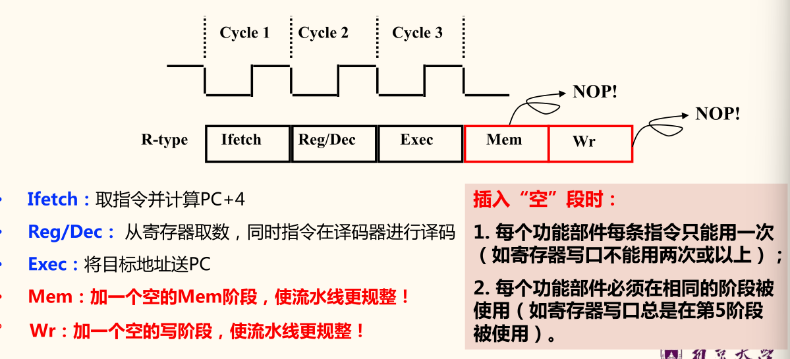

### 5 段流水段数据通路

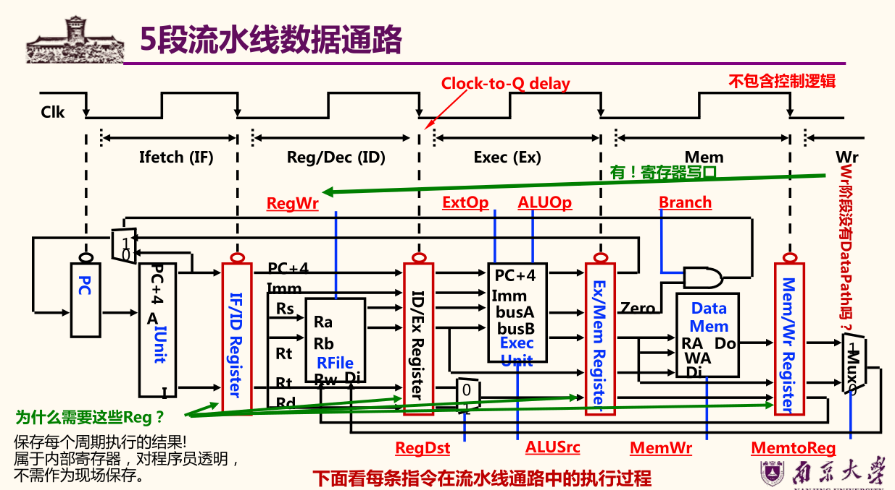

#### 取指令阶段（Ifetch）

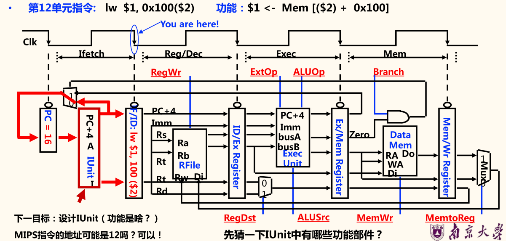

指令部件 IUnit 的设计：


> 勘误：上图中的「10」应为「12」。

#### 译码/取数阶段（Reg/Dec）

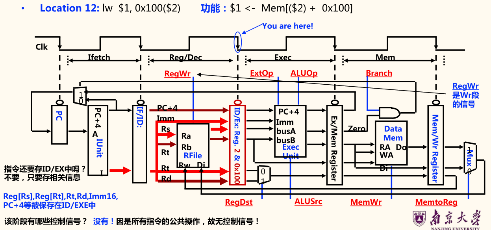

#### 执行阶段（Exec）：`load` 指令的地址计算阶段

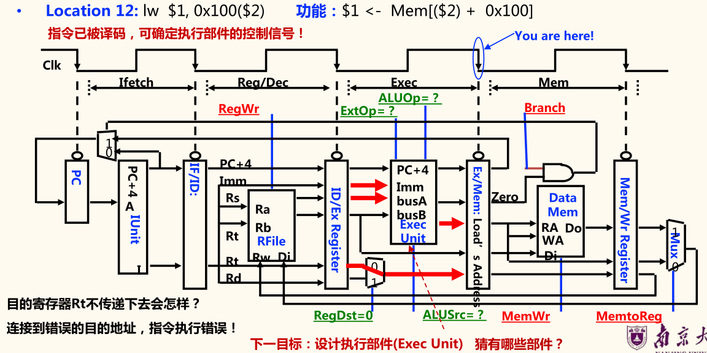

执行部件 Exec Unit 的设计：

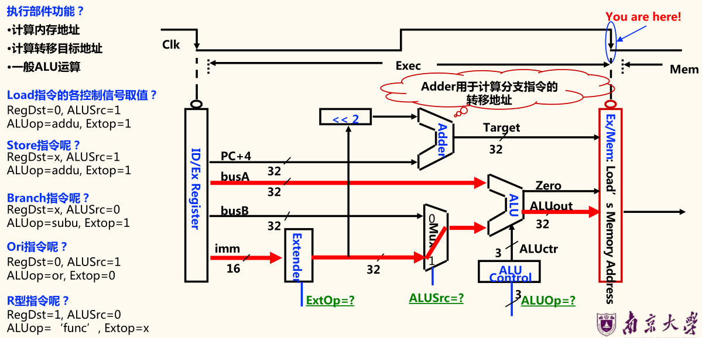

执行部件功能：
- 计算内存地址
- 计算转移目标地址
- 一般 ALU 运算

#### 存储器访问阶段（Mem）：`load` 的存储器读周期

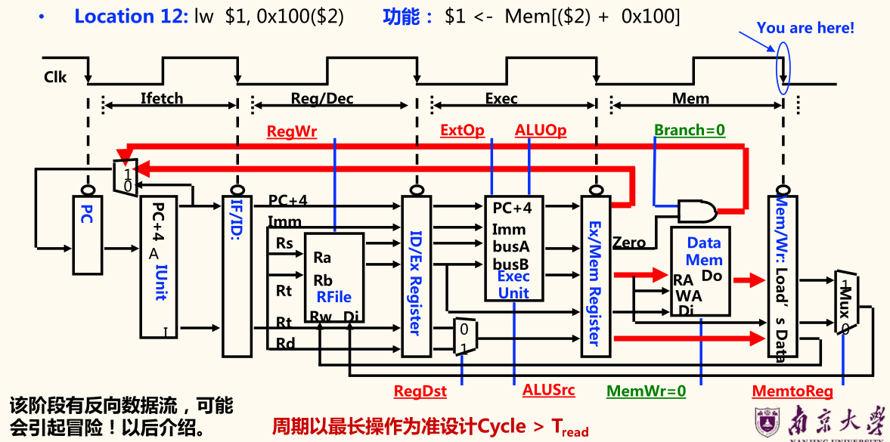

#### 写回阶段（Wr）：`load` 指令的回写（Write Back）阶段

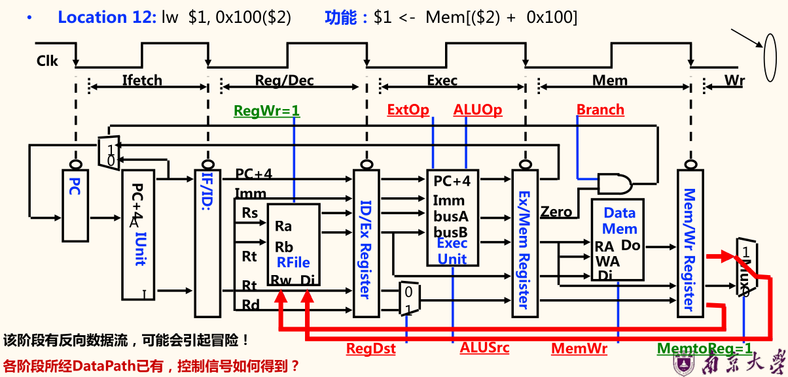

### 流水线中的控制信号

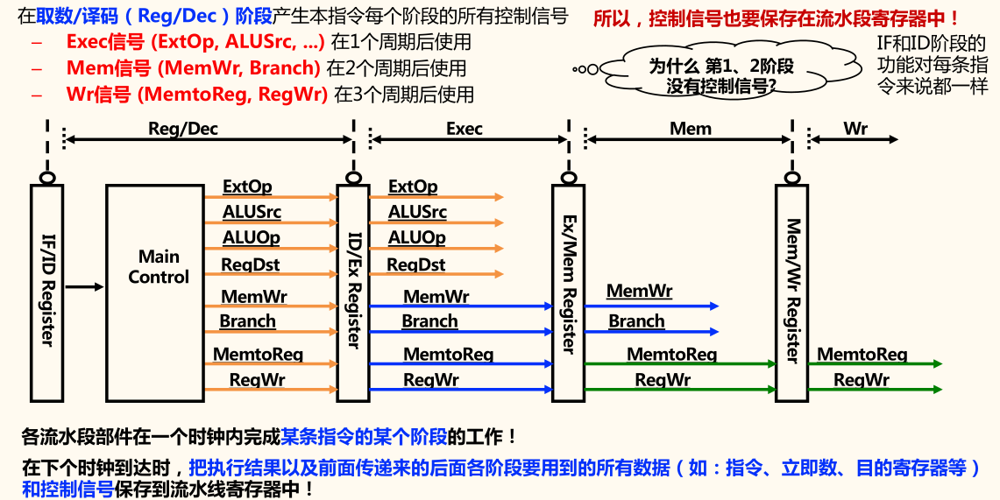

PC 无需写使能，因为每个时钟都会改变 PC。流水段寄存器同理。

- Ifetch 和 Dec/Reg 阶段都没有控制信号。
- Exec 阶段控制信号
    - ExtO（扩展器操作）：1 是符号扩展，0 是零扩展。
    - ALUSrc（ALU 的 B 口来源）：1 来源于扩展器，0 来源于 BusB
    - ALUOp（主控制器输出，用于辅助局部 ALU 控制逻辑来决定 ALUCtrl）
    - RegDst（指定目的寄存器）：1 为 Rd，0 为 Rt
- Mem 阶段的控制信号：
    - MemWr（DM 的写信号）：`store` 指令为 1，其他指令为 0
    - Branch（是否为分支指令）：分支指令时为 1，其他指令为 0
- Wr 阶段的控制信号：
    - MemtoReg（寄存器的写入源）：1 DM 输出，0 为 ALU 输出
    - RegWr（寄存器堆写信号）：结果写寄存器的指令为 1，其他指令为 0

## 流水线冒险及其处理

**冒险**（Hazards）指流水线遇到无法正确执行后续指令，或执行了不该执行的指令。
- **结构冒险**（Structural Hazards）：硬件资源冲突
    - 现象：同一个部件同时被不同指令所使用
    - 解决方法：
        - 一个部件每条指令只能使用1次，且只能在特定周期使用
        - 设置多个部件，以避免冲突。如指令存储器 IM 和数据存储器 DM 分开
- **数据冒险**（Data hazards）：数据冲突
    - 现象：后面指令用到前面指令结果数据时，前面指令的结果还没产生
    - 解决方法：
        - 采用转发（Forwarding/Bypassing）技术
        - Load-use 冒险需要一次阻塞（stall）
        - 编译程序优化指令顺序
- **控制冒险**（Control hazards）：指令执行顺序改变
    - 现象：转移或异常改变执行流程，后继指令在目标地址产生前已被取出
    - 解决方法：
        - 采用静态或动态分支预测
        - 编译程序优化指令顺序（分支延迟）

### 结构冒险

#### 现象

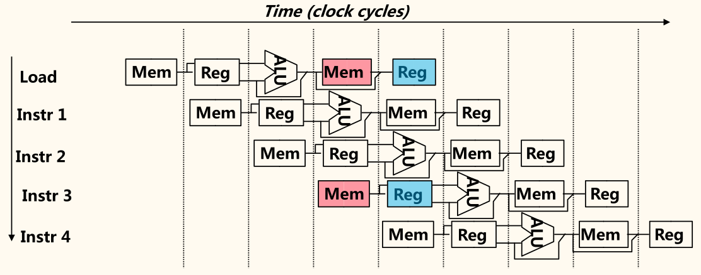

只有一个存储器时，在 `load` 指令取数据同时又取指令的话，就会发生冲突。

若不对寄存器堆的写口和读口独立设置的话，就会发生冲突。

结构冒险也成为「硬件资源冲突」：同一个执行部件被多条指令使用。

#### 解决方案

为了避免结构冒险，规定流水线数据通路中功能部件的设置原则为：
- 每个部件在特定的阶段被用（如：ALU总在第三阶段被用！）
- 将指令存储器（Im）和数据存储器（Dm）分开
- 将寄存器读口和写口独立开来

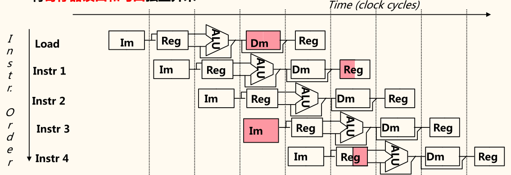

### 数据冒险

#### 现象

对于以下的指令序列，寄存器 `r1` 会发生数据冒险：

```mips
add r1,  r2, r3
sub r4,  r1, r3  # 读 r1 时，add 指令正在执行加法（EXE），老值
and r6,  r1, r7  # 读 r1 时，add 指令正在传递加法结果（MEM），老值
or  r8,  r1, r9  # 读 r1 时，add 指令正在写加法结果到 r1（WB），老值
xor r10, r1, r11 # 读 r1 时，add 指令已经把加法结果写到 r1，新值
```

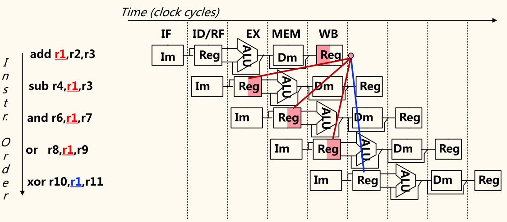

最后一条指令的 `r1` 才是新的值。

三类数据冒险现象：
- RAW：写后读（基本流水线中经常发生，如上例）
- WAR：读后写（基本流水线中不会发生，乱序执行时会发生）
- WAW：写后写（基本流水线中不会发生，乱序执行时会发生）

本节仅考虑 RAW 冒险。

有几种解决方案：
1. 硬件阻塞（stall）
2. 软件插入 NOP 指令
3. 合理实现寄存器堆的读/写操作（但不能解决所有的数据冒险）
    - 前半时钟周期写，后半时钟周期读，若同一个时钟内前面指令写入的数据正好是后面指令所读数据，则不会发生数据冒险。
4. 转发（Forwarding 或 Bypassing 旁路）技术
    - 若相关数据是 ALU 结果，可通过转发解决
    - 若相关数据是上条指令 DM 读出内容，不能通过转发解决，随后指令需被阻塞一个时钟或加 NOP 指令 （称为 Load-use 数据冒险）
5. 编译优化：调整指令顺序（不能解决所有数据冒险）

实现「转发」和「阻塞」需要修改数据通路。

#### 硬件阻塞

在硬件上采取措施，使相关指令延迟执行。

硬件上通过阻塞（stall）方式阻止后续指令执行，延迟到有新值以后。这种做法称为流水线阻塞，也称为插入「气泡」（Bubble）。


缺点：
- 控制比较复杂，需要修改数据通路
- 指令被延迟三个时钟执行

#### 软件插入无关指令

由编译器插入三条 NOP 指令，浪费了三条指令的空间和时间。是最差的做法。

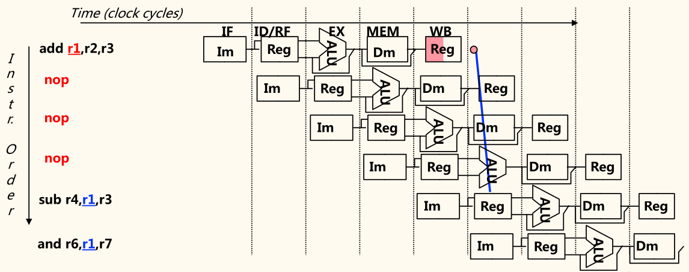

优点：无需修改数据通路。

与上一个方案都是多三个时钟周期。

#### 同一周期内寄存器堆先写后读

寄存器堆的读口和写口是相互独立的部件。


寄存器*写口/读口*分别在*前/后半周期*进行操作，使写入数据被直接读出。

但是只能解决部分数据冒险。

#### 利用数据通路中的中间数据：转发 + 阻塞

流水段寄存器中已有需要的值 `r1`，可将数据从流水段寄存器中直接取到 ALU 的输入端，称为「转发」或「旁路」。

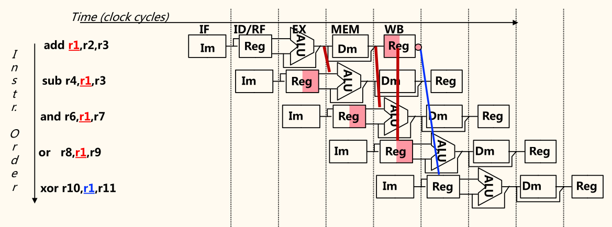

硬件上的改动以支持「转发」技术：加入 MUX，使得流水段寄存器值返回 ALU 输入端。

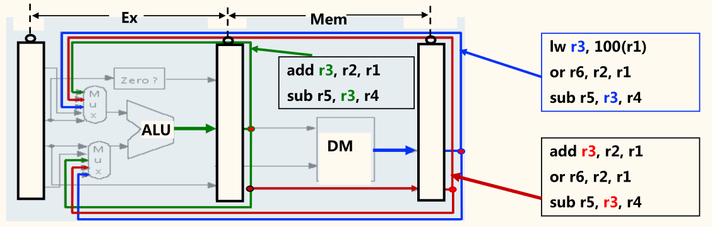

若指令序列为

```mips
lw  r3, 100(r1)
or  r6, r3, r1
sub r5, r3, r4
```

则不能通过「转发」技术来解决 1、2 条指令间的数据冒险。
