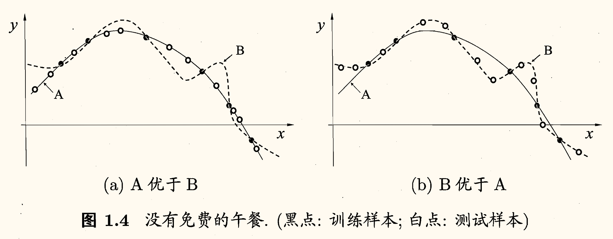

## 基本术语

西瓜书名不虚传。假定收集了一批关于西瓜的数据，例如

| 编号 | 色泽 | 根蒂 | 敲声 | *好坏* |
| :-:  | :-:  | :-:  | :-:  |  :-:   |
|  1   | 青绿 | 蜷缩 | 浊响 |   好   |
|  2   | 乌黑 | 蜷缩 | 浊响 |   好   |
|  3   | 青绿 | 硬挺 | 清脆 |   坏   |
|  4   | 乌黑 | 稍蜷 | 沉闷 |   坏   |

这组记录的集合称为一个**数据集**（data set）。

其中每条记录是关于一个事件或对象的描述，称为一个**示例**（instance），例如上表其中一个示例就是第一行不包括*好坏*的部分。

色泽、根蒂、敲声称为**属性**（attribute）或**特征**（feature）。属性张成的空间称为**属性空间**（attribute space）、**样本空间**（sample space）或**输入空间**（input space）。

可以将各个属性作为坐标轴，则它们张成一个用于描述西瓜的空间，每个西瓜示例都是这个空间中的一个点。由于空间中的每个点对应一个坐标向量，因此我们也把一个示例称为一个**特征向量**（feature vector）。

一般地，令 $D = \left\lbrace \bm{x}_1, \bm{x}_2, \cdots, \bm{x}_m \right\rbrace$ 表示包含 $m$ 个示例的数据集，其中 $\bm{x}_i \in \mathcal{X}$ 是 $d$ 维样本空间 $\mathcal{X}$ 中的一个向量，每个示例 $\bm{x}_i$ 由 $d$ 个属性描述。$x_{ij}$ 表示示例 $\bm{x}_i$ 的第 $j$ 个属性。$d$ 称为样本 $\bm{x}_i$ 的**维数**（dimensionality）。

从数据中学得模型的过程称为**学习**（learning）或**训练**（training），这个过程通过执行某个学习算法来完成。训练过程中使用的数据称为**训练数据**（training data），其中每个样本称为一个**训练样本**（training sample）。训练样本组成的集合称为**训练集**（training set）。

学得模型对应了关于数据的某种潜在规律，称为**假设**（hypothesis）。这种潜在规律自身，则称为**真相**或**真实**（ground-truth）。学习的过程就是为了找出或逼近真相，有时将模型称为**学习器**（learner）。

若希望得到一个通过这几种属性预测一个瓜是否为好瓜的模型，仅有示例数据是不够的，有时需要训练样本的结果信息。

这里关于示例结果的信息，例如「好」「坏」称为**标记**（label）。拥有标记的示例称为**样例**（example）。

一般地，用 $(\bm{x}_i, y_i)$ 表示第 $i$ 个样例，其中 $y_i \in \mathcal{Y}$ 是示例 $\bm{x}_i$ 的标记，$\mathcal{Y}$ 是所有标记的集合，称为**标记空间**（label space）或**输出空间**（output space）。

若欲预测的的是离散值，例如「好瓜」「坏瓜」，则称为**分类**（classification）；若欲预测的是连续值，如西瓜成熟度，则称为**回归**（regression）。

对于只涉及两个类别的分类任务，称为**二分类**（binary classification），通常将其中一个类别称为**正类**（positive class），另一个类别称为**反类**（negative class）。对二分类任务，通常 $\mathcal{Y} = \left\lbrace -1, +1 \right\rbrace$ 或 $\left\lbrace 0, 1 \right\rbrace$，多分类任务 $|\mathcal{Y}| > 2$，回归任务 $\mathcal{Y} = \mathbb{R}$。

学得模型后进行预测的过程称为**测试**（testing）。被预测的样本称为**测试样本**（testing sample），测试样本组成的集合称为**测试集**（testing set）。

训练集中的西瓜可以分成若干组，例如「浅色瓜」「深色瓜」等，有助于了解数据的内在规律，能为更深入地分析数据建立基础。每个组称为一个**簇**（cluster）。这个操作称为**聚类**（clustering）。聚类学习过程中使用的训练样本通常不拥有标记信息。

根据训练数据是否拥有标记信息，学习任务可分为**监督学习**（supervised learning）和**无监督学习**（unsupervised learning）。前者代表有分类和回归，后者代表有聚类。

机器学习的目标是使学得的模型能很好地适用于「新样本」。学得模型适用于新样本的能力称为**泛化**（generalization）能力。

尽管训练集通常只是样本空间的一个很小的采样，我们仍希望它能很好地反映出样本空间的特性，否则就很难期望在训练集上学得的模型能在整个样本空间上都工作得很好。

通常假设样本空间中全体样本服从一个未知**分布**（distribution）$\mathcal{D}$，获得的每个样本都是独立地从这个分布上采样得到的，即**独立同分布**（independent and identically distributed, i.i.d.）假设。

## 假设空间

**归纳**（induction）是从特殊到一般的泛化过程，**演绎**（deduction）是从一般到特殊的*特化*（specialization）过程。因此从样例中学习的过程也被称为**归纳学习**（inductive learning）。

广义归纳学习大体相当于从样例中学习。狭义归纳学习要求从训练数据中学得**概念**，因此也被称为**概念学习**（concept learning）或**概念形成**（concept formation）。

概念学习最基本的便是*布尔概念学习*，如上面的「好瓜」和「坏瓜」。

可以将学习过程看作是在一个所有假设组成的空间中进行搜索的过程。这个空间称为**假设空间**（hypothesis space）。搜索目标是找到与训练集**匹配**（fit）的假设。

假设各个属性分别有 $a_1, a_2, a_3$ 种可能的取值，那么假设空间规模大小为 $(a_1 + 1)(a_2 + 1)(a_3 + 1) + 1$。属性中的 $+1$ 考虑的是可能与这个属性无关，最后再 $+1$ 是因为可能没有好瓜。

现实问题常面临很大的假设空间，但学习过程是基于有限样本训练集训练的，可能存在多个假设和样本集一致，即存在一个与训练集一致的假设集合，称为**版本空间**（version space）。例如与最上面的表格对应的版本空间如下：
1. 色泽=\*；根蒂=蜷缩；敲声=浊响
2. 色泽=\*；根蒂=蜷缩；敲声=\*
2. 色泽=\*；根蒂=\*；敲声=浊响

## 归纳偏好

如上的版本空间所示，现在有三个与训练集一致的假设，但与它们对应的模型在面临新样本时会产生不同的输出。所以究竟应该采用哪一个模型（或假设）呢？

仅凭表格的训练样本，其实无法判断三个假设哪个「更好」。但对于具体的学习算法，必须产生一个模型，这时就需要引入算法本身的「偏好」。机器学习算法在学习过程中对某种类型假设的偏好称为**归纳偏好**（inductive bias），或简称**偏好**（bias）。例如学习算法更喜欢「尽可能特殊」的模型，就可能会喜欢第 1 个模型。若它更喜欢「尽可能一般」的模型，同时更「相信」根蒂，就会喜欢第 2 个模型。

若没有偏好，学得模型每次在进行预测时都会随机选择一个假设，时而告诉我们这个瓜是好的，时而又说这是坏的。显然没有意义。

归纳偏好可看作学习算法自身在一个可能很庞大的假设空间中对假设进行选择的启发式或「价值观」。

**奥卡姆剃刀**（Occam's razor）是一种常用的归纳偏好。奥卡姆剃刀原则是指，若有多个假设与观察一致，则选最简单的那个。

然而这并不是唯一可行的原则，即使采用这个原则，它也存在不同的诠释，例如「更简单」的定义是什么？

对于训练样本（黑点），学习算法可能得到图中 $A, B$ 两条曲线。相较而言，$A$ 更平滑，而 $B$ 更崎岖。若奥卡姆剃刀原则认为平滑的 $A$ 更好，那么在测试样本（白点）上，$A$ 的泛化能力可能更好。但若测试样本在 $B$ 的曲线上，$B$ 的泛化能力可能更好。

对于一个学习算法 $\mathfrak{L}_a$，若它在某些问题上比学习算法 $\mathfrak{L}_b$ 好，则必然存在另一些问题，在那里 $\mathfrak{L}_b$ 比 $\mathfrak{L}_a$ 好。

反直觉的是，这个结论对任何算法都成立，即使是将一些「好的算法」作为 $\mathfrak{L}_a$ 和一些随机乱猜的笨拙算法作为 $\mathfrak{L}_b$，也是如此。下面进行一个简单的证明。

为了简单起见，假设样本空间 $\mathcal{X}$ 和假设空间 $\mathcal{H}$ 都是离散的。$P(h \mid X, \mathfrak{L}_a)$ 代表算法 $\mathfrak{L}_a$ 基于训练数据 $X$ 产生假设 $h$ 的概率，$f$ 代表我们希望学习的真实目标函数，$E_{\mathrm{ote}}(\mathfrak{L}_a \mid X, f)$ 代表 $\mathfrak{L}_a$ 的*训练集外误差*（**o**ut-of-**t**raining **e**rror，即 $\mathfrak{L}_a$ 在训练集之外的所有样本上的误差）。则有

$$
E_{\mathrm{ote}}(\mathfrak{L}_a \mid X, f) = \sum_h \sum_{\bm{x} \in \mathcal{X} - X} \mathbb{I}\left( h(\bm{x}) \ne f(\bm{x}) \right) P(\bm{x}) P(h \mid X, \mathfrak{L}_a)
$$

其中 $\mathbb{I}(\cdot)$ 是指示函数。$\cdot $ 为真时，$\mathbb{I}(\cdot) = 1$，否则 $\mathbb{I}(\cdot) = 0$。

上式的含义就为，对于每个假设 $h$，当它对训练集外每个示例 $\bm{x}$ 的预测 $h(\bm{x})$ 与真实标记 $f(\bm{x})$ 不一致时，计算基于这个训练数据 $X$ 产生假设 $h$ 的概率 $P(h \mid X, \mathfrak{L}_a)$，乘以这个示例出现的概率 $P(\bm{x})$，再求和。

考虑二分类问题，真实目标函数是 $f\colon \mathcal{X} \mapsto \left\lbrace 0, 1 \right\rbrace$。那么函数空间为 $\left\lbrace 0, 1 \right\rbrace^{\mathcal{X}}$，其规模大小为 $2^{|\mathcal{X}|}$。对于所有的 $f$ 按均匀分布对误差求和，有（为保证推导公式的连贯性，解释在下面）

$$
\begin{aligned}
    \sum_f E_{\mathrm{ote}}(\mathfrak{L}_a \mid X, f) &= \sum_f \sum_h \sum_{\bm{x} \in \mathcal{X} - X} \mathbb{I}\left( h(\bm{x}) \ne f(\bm{x}) \right) P(\bm{x}) P(h \mid X, \mathfrak{L}_a)\\
    &= \sum_{\bm{x} \in \mathcal{X} - X} P(\bm{x}) \sum_h P(h \mid X, \mathfrak{L}_a) \sum_f \mathbb{I}\left( h(\bm{x}) \ne f(\bm{x}) \right)\\
    &= \dfrac{1}{2} 2^{|\mathcal{X}|} \sum_{\bm{x} \in \mathcal{X} - X} P(\bm{x}) \sum_h P(h | X, \mathfrak{L}_a)\\
    &= 2^{|\mathcal{X}| - 1} \sum_{\bm{x} \in \mathcal{X} - X} P(\bm{x})
\end{aligned}
$$

1. 第一个等号就是展开上面的训练集外误差式子；
2. 第二个等号是将求和顺序交换，以简化运算；
3. 第三个等号是因为，若 $f$ 均匀分布，那么一定有一半的 $f$ 对 $\bm{x}$ 的预测与 $h(\bm{x})$ 不一致，即 $\displaystyle \sum_f \mathbb{I}\left( h(\bm{x}) \ne f(\bm{x}) \right) = \dfrac{1}{2} 2^{|\mathcal{X}|}$；
4. 第四个等号是因为，$P(h \mid X, \mathfrak{L}_a)$ 是产生假设 $h$ 的概率。对所有的 $h$ 进行求和，自然为 $1$，即 $\displaystyle \sum_h P(h \mid X, \mathfrak{L}_a) = 1$。

从而我们得到了一个惊人的结论，<u>总误差与学习算法无关</u>！即对于任意两个学习算法 $\mathfrak{L}_a, \mathfrak{L}_b$，有

$$
\sum_f E_{\mathrm{ote}}(\mathfrak{L}_a \mid X, f) = \sum_f E_{\mathrm{ote}}(\mathfrak{L}_b \mid X, f)
$$

即无论学习算法 $\mathfrak{L}_a$ 多聪明，$\mathfrak{L}_b$ 多笨拙，期望性能是一样的。这就是「没有免费的午餐」定理（**N**o **F**ree **L**unch Theorem，简称 NFL 定理）。

那学习机器学习有什么用处吗，不如就此结课？

NFL 定理有一个重要前提，即<u>所有问题的分布是均匀的</u>。但实际情形并不是这样的。

NFL 定理的重要寓意是让我们认识到，脱离具体的问题，空谈「什么学习算法更好」毫无意义。若考虑所有潜在的问题，所有学习算法一样好。<u>要讨论算法的相对优劣，必须要针对具体的学习问题</u>。
