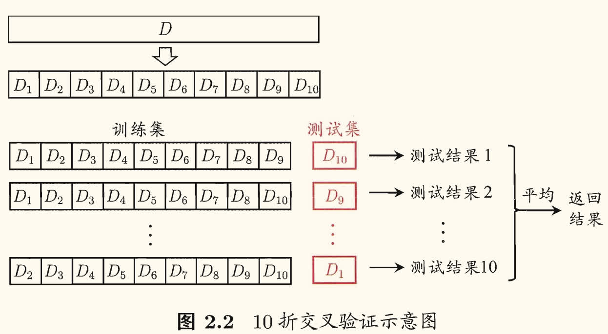
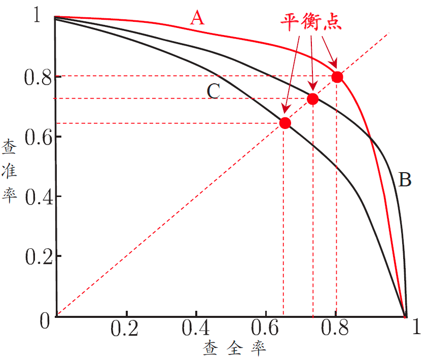
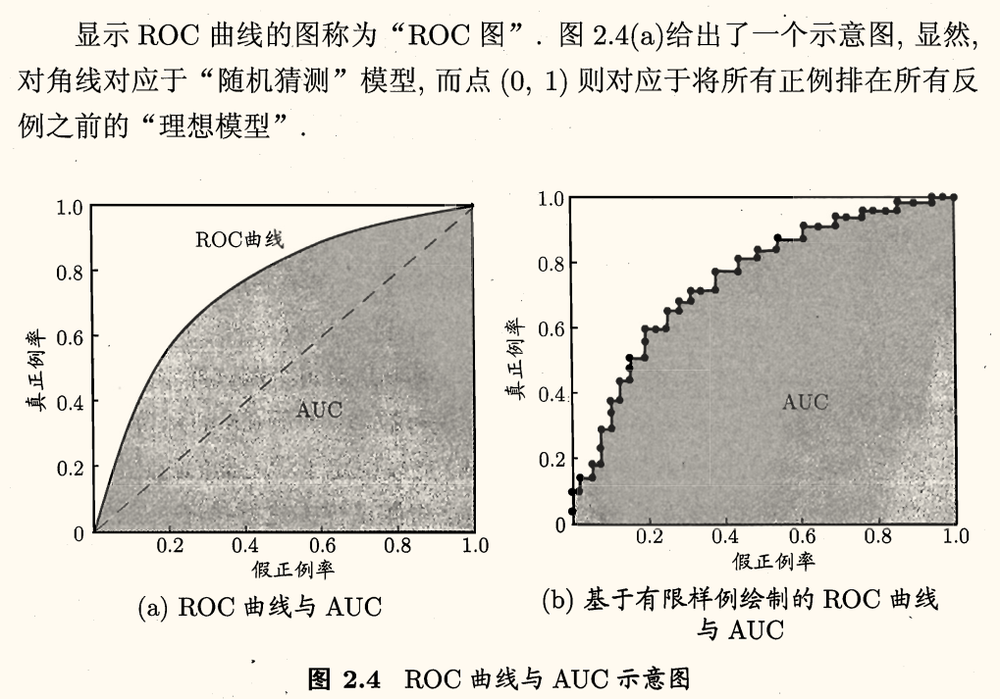
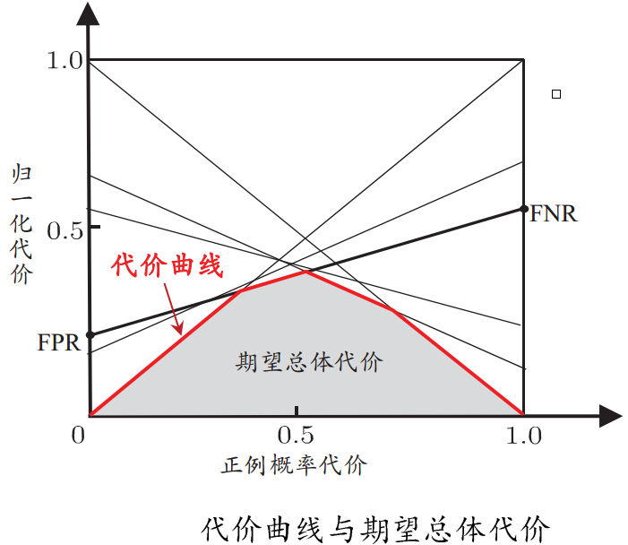
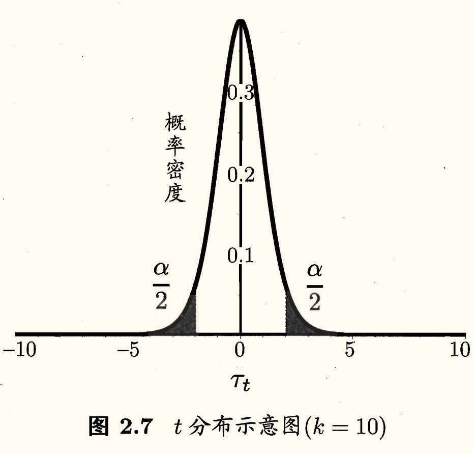
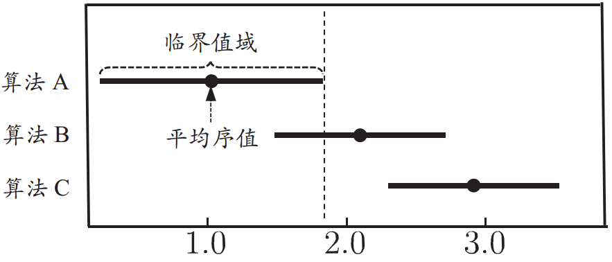
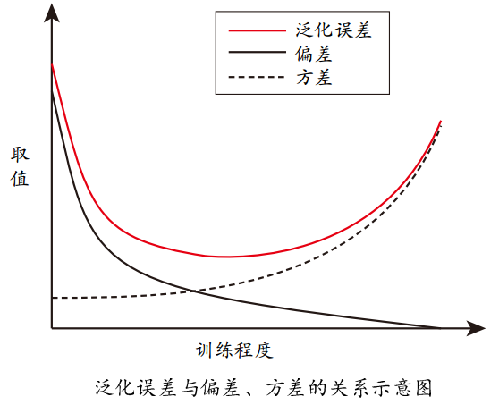

## 经验误差与过拟合

通常我们把分类错误的样本数占样本总数的比例称为**错误率**（error rate），即若 $m$ 个样本中有 $a$ 个样本分类错误，则错误率 $E = \dfrac{a}{m}$。相应地 $1 - \dfrac{a}{m}$ 称为**精度**（accuracy）。

更一般地，我们把学习器的实际预测输出与样本的真实输出之间的差异称为**误差**（error），学习器在训练集上的误差称为**训练误差**（training error）或**经验误差**（empirical error），在新样本上的误差称为**泛化误差**（generalization error）。

显然我们希望得到泛化误差小的学习器，但是我们无法直接得到泛化误差，实际能做的努力是努力使经验误差最小化。然而经验误差很小、在训练集上表现很好的学习器，在多数情况下泛化能力都并不好。

我们实际希望的，是在新样本上能表现得很好的学习器。为了达到这个目的，应该从训练样本中尽可能学出适用于所有潜在样本的「普遍规律」，这样才能在遇到新样本时做出正确的判别。然而当学习器把训练样本学得「太好了」时，很可能将训练样本自身一些特点当作了所有潜在样本都会具有的一般性质，这就会导致泛化性能下降，这种现象称为**过拟合**（overfitting）。

与之相对的是**欠拟合**（underfitting），即模型在训练集上的表现就很差，这种情况下模型的泛化能力也会很差。

有多种因素可能导致过拟合，其中最常见的情况是由于学习能力过于强大，以至于把训练样本所包含的不太一般的特性都学到了；而欠拟合则通常是由于学习能力低下而造成的。

欠拟合比较容易克服，例如在决策树学习中扩展分支、在神经网络学习中增加训练轮数等。而过拟合则很麻烦，实际上过拟合是机器学习面临的关键障碍，是无法彻底避免的，我们所能做的只是缓解，或者说减小其风险。

## 评估方法

通常，我们可通过实验测试来对学习器的泛化误差进行评估并进而做出选择。为此需使用一个**测试集**（testing set）来测试学习器对新样本的判别能力，然后以测试集上的「测试误差」（testing error）作为泛化误差的近似。

通常我们假设测试样本也是从样本真实分布中独立同分布采样而得。但需注意的是，<u>测试集应该尽可能与训练集互斥</u>，即测试样本尽量不在训练集中出现、未在训练过程中使用过。

我们只有一个包含 $m$ 个样例的数据集 $D = \left\lbrace (\bm{x}_1, y_1),\, (\bm{x}_2, y_2),\, \cdots,\, (\bm{x}_m, y_m) \right\rbrace$，既要训练，又要测试，就需要对 $D$ 进行适当的处理，从中产生训练集 $S$ 和测试集 $T$。下面是几种常见的做法。

### 留出法

**留出法**（hold-out）直接将数据集 $D$ 划分为两个互斥的集合，其中一个集合作为训练集 $S$，另一个作为测试集 $T$。即 $D = S \cup T,\, S \cap T = \empty$。在 $S$ 上训练出模型后，用 $T$ 来评估其测试误差，作为对泛化误差的估计。

训练/测试集的划分要尽可能保持数据分布的一致性，例如在分类问题中，每个类别的样本在训练集和测试集中的比例应该大致相同。从采样（sampling）的角度看待数据集的划分过程，保留类别比例的采样法时通常称为**分层采样**（stratified sampling）。

即使给定训练/测试集的样本比例，仍然存在多种划分方式对初始数据集 $D$ 进行分割。单次使用留出法得到的估计结果往往不够稳定可靠，通常要采用若干次随机划分、重复进行实验评估后取平均值作为留出法的评估结果。

我们希望评估的是用 $D$ 训练出的模型的性能，但留出法需要划分训练/测试集，这会导致一个窘境：若令训练集 $S$ 包含绝大多数样本，则训练出的模型可能更接近于用 $D$ 训练出的模型，但由于 $T$ 比较小，评估结果可能不够稳定准确；但若令测试集 $T$ 多包含一些样本，则训练集 $S$ 和 $D$ 差别更大了，被评估的模型与用 $D$ 训练出的模型相比可能有较大的差别，从而降低了评估结果的**保真性**（fidelity）。

这个问题没有完美的解决方案，常见做法是将大约 $\dfrac{2}{3} \backsim \dfrac{4}{5}$ 的样本用于训练，剩余样本用于测试。

### 交叉验证法

**交叉验证法**（cross validation）先将数据集 $D$ 划分为 $k$ 个大小相似的互斥子集，即 $D = D_1 \cup D_2 \cup \cdots \cup D_k, D_i \cap D_j = \empty$。每个子集 $D_i$ 都尽可能保持数据分布的一致性，即采用分层采样。然后每次用 $k - 1$ 个子集的并集作为训练集，余下的那个子集作为测试集，这样就可以得到 $k$ 组训练/测试集，从而可进行 $k$ 次训练和测试，最终返回的是这 $k$ 个测试结果的均值。

显然，交叉验证法评估结果的稳定性和保真性在很大程度上取决于 $k$ 的取值，因此通常将交叉验证法称为 **$k$ 折交叉验证**（$k$-fold cross validation）。通常 $k = 10$，此时成为 *10 折交叉验证*。

与留出法类似，划分为 $k$ 个子集同样存在多种划分方式。为减小因样本划分不同而引入的差别，$k$ 折交叉验证通常要随机使用不同的划分 $p$ 次，最终评估结果是这 $p$ 次 $k$ 折交叉验证结果的均值。常使用的有「10 次 10 折交叉验证」，这与「100 次留出法」都是进行了 100 次训练/测试。

令 $k$ 为数据集 $D$ 中包含的样本数量，就得到了交叉验证发的一个特例——**留一法**（leave-one-out, LOO）。显然留一法不受随机样本划分方式的影响。但留一法的重要缺陷就是，当数据集比较大时，训练大量模型的计算开销可能是难以忍受的。

### 自助法

我们希望评估的是用 $D$ 训练出的模型，但在前两个方法中，都保留了一部分样本用于测试，因此实际评估的模型所使用的训练集比 $D$ 小，这必然会引入一些因训练样本规模不同而导致的估计偏差。

**自助法**（bootstrapping）是一种通过自助采样技术来评估学习器泛化误差的方法。给定包含 $m$ 个样本的数据集 $D$，我们对它进行 $m$ 次有放回的随机采样，得到了 $m$ 个样本的自助采样集 $D'$。显然，由于是有放回采样，$D'$ 中有的样本可能重复出现，而有的样本则根本不出现。

可以进行一个简单的估计，样本在 $m$ 次采样中始终不被采到的概率是 $\left(1 - \dfrac{1}{m}\right)^m$，取极限得到 $\lim\limits_{m \to \infty} \left(1 - \dfrac{1}{m}\right)^m = \dfrac{1}{\e} \approx 0.368$，即约有 $36.8\%$ 的样本不会出现在自助采样集中。

于是我们可将 $D'$ 用作训练集，$D\backslash D'$ 用作测试集。这样实际评估的模型与期望评估的模型都使用 $m$ 个训练样本，而我们仍有数据总量约 $\dfrac{1}{3}$ 的、没在训练集中出现的样本用于测试。这样的测试结果，亦称为**包外估计**（out-of-bag estimate）。

自助法在<u>数据集较小、难以有效划分训练/测试集</u>时很有用。但由于自助法产生的数据集改变了初始数据集的分布，这会引出估计偏差，因此在数据集足够大时，留出法和交叉验证法更常用。

## 调参与最终模型

大多数学习算法都有些**参数**（parameter）需要设定，参数配置不同，学得模型的性能往往有显著差别。因此，在进行模型评估与选择时，除了要对适用学习算法进行选择，还需对算法参数进行设定，这就是通常所说的**参数调节**或简称**调参**（parameter tuning）。

调参似乎与算法选择并没什么本质区别：对每种参数配置训练出模型，然后把对应最好的模型的参数作为结果。但实际上，调参与算法选择是有区别的。

学习算法的很多参数都是在实数范围内取值，因此对每种参数的配置都训练出模型是不可行的。现实中常用的做法是对每个参数选定一个范围和变化步长，例如在 $[0, 0.2]$ 范围内以 $0.05$ 为步长，则实际需要评估的候选参数只要 $5$ 个，最终是从这 $5$ 个候选值中产生选定值。这是在计算开销与性能估计之间进行折中的结果。

给定包含 $m$ 个样本的数据集 $D$，在模型评估与选择过程中由于需要留出一部分数据进行评估测试，事实上我们只使用了一部分数据训练模型。因此，在模型选择完成后，学习算法和参数配置已选定，此时<u>应该用数据集 $D$ 重新训练模型</u>。这个模型在训练过程中使用了所有 $m$ 个样本，这才是我们最终提交给用户的模型。

通常将学得模型在实际使用中遇到的数据称为**测试数据**，为了加以区分，模型评估与选择中用于评估测试的数据集常称为**验证集**（validation set）。

在研究对比不同算法的泛化性能时，我们用*测试集*上的判别效果来估计模型在实际使用时的泛化能力，而把训练数据另外划分为*训练集*和*验证集*，基于*验证集*上的性能来进行模型选择和调参。即
- **训练集**：用于训练模型；
- **验证集**：用于模型选择和调参；
- **测试集**：用于评估模型的泛化能力。

另外，算法参数选定后，要用*所有训练数据*（即「训练集+验证集」）重新训练最终模型。

## 性能度量

对学习器的泛化性能进行评估，不仅需要有效可行的实验估计方法，还需要有衡量模型泛化能力的评价标准，这就是**性能度量** （performance measure）。

在预测任务中，给定样例集 $D = \left\lbrace (\bm{x}_1, y_1), (\bm{x}_2, y_2), \ldots, (\bm{x}_m, y_m) \right\rbrace$，其中 $y_i$ 是示例 $\bm{x}_i$ 的真实标记。要评估学习器 $f$ 的性能，就是要把学习器预测结果 $f(\bm{x})$ 与真实标记 $y$ 进行比较。

!!! info ""
    回归任务最常用的性能度量是**均方误差**（mean squared error）：
    
    $$
    \boxed{E(f; D) = \dfrac{1}{m} \sum_{i=1}^{m} \left(f(\bm{x}_i) - y_i\right)^2}
    $$

!!! note ""
    更一般的，对于数据分布 $\mathcal{D}$ 和概率密度函数 $p$，均方误差可描述为
    
    $$
    E(f; \mathcal{D}) = \int_{\bm{x} \sim \mathcal{D}} \left(f(\bm{x}) - y\right)^2 p(\bm{x}) \d \bm{x}
    $$

### 错误率与精度

**错误率**是<u>分类错误的样本数占样本总数的比例</u>，**精度**则是<u>分类正确的样本数占样本总数的比例</u>。

!!! info ""
    对样例集 $D$，**分类错误率**定义为
    
    $$
    \boxed{E(f; D) = \dfrac{1}{m} \sum_{i=1}^{m} \mathbb{I}\left(f(\bm{x}_i) \ne y_i\right)}
    $$

    **精度**则定义为

    $$
    \boxed{ \begin{aligned}
        \operatorname{acc}(f; D) &= \dfrac{1}{m} \sum_{i=1}^{m} \mathbb{I}\left(f(\bm{x}_i) = y_i\right) \\
               &= 1 - E(f; D)
    \end{aligned}}
    $$

!!! note ""
    更一般的，对于数据分布 $\mathcal{D}$ 和概率密度函数 $p$，错误率和精度可描述为

    $$
    \begin{aligned}
        E(f; \mathcal{D}) &= \int_{\bm{x} \sim \mathcal{D}} \mathbb{I}\left(f(\bm{x}) \ne y\right) p(\bm{x}) \d \bm{x} \\
        \operatorname{acc}(f; \mathcal{D}) &= 1 - E(f; \mathcal{D})
    \end{aligned}
    $$

### 查准率、查全率与 $F_1$

以西瓜问题为例，错误率衡量的是「有多少比例的瓜被判别错误」。但如果我们关心的是「挑出的西瓜中有多少比例是好瓜」或「所有好瓜中有多少比例被挑了出来」，就需要其他的性能度量。

类似的需求在信息检索、Web 搜索等应用中经常出现。例如在信息检索中，我们经常会关心「检索出的信息中有多少比例是用户感兴趣的」「用户感兴趣的信息中有多少被检索出来了」。**查准率**（precision, **准确率**）与**查全率**（recall, **召回率**）是更为适用于此类需求的性能度量。

对于二分类问题，可将样例根据其真实类别与学习器预测类别的组合划分为真正例（true positive）、假正例（false positive）、真反例（true negative）、假反例 false negative）四种情形。分别令为 $TP, FP, TN, FN$，分类结果的**混淆矩阵**（confusion matrix）如下：

| 真实情况 |    预测正例    |    预测反例    |
|   :-:    |      :-:       |      :-:       |
|   正例   | $TP$（真正例） | $FN$（假反例） |
|   反例   | $FP$（假正例） | $TN$（真反例） |

则查准率 $P$ 与查全率 $R$ 分别定义为：

$$
\left\lbrace\begin{aligned}
    P &= \dfrac{TP}{TP + FP} \\
    R &= \dfrac{TP}{TP + FN}
\end{aligned}\right.
$$

!!! note ""
    查准率和查全率是一对矛盾的度量。一般来说，查准率高时，查全率往往偏低；而查全率高时，查准率往往偏低。

    例如，若希望将好瓜尽可能多地选出来，则可通过增加选瓜的数量来实现，如果将所有西瓜都选上，那么所有的好瓜也必然都被选上了，但这样查准率就会较低；若希望选出的瓜中好瓜比例尽可能高，则可只挑选最有把握的瓜，但这样就难免会漏掉不少好瓜，使得查全率较低。

    通常只有在一些简单任务中，才可能使查全率和查准率都很高。

在很多情形下，我们可根据学习器的预测结果对样例进行排序，排在前面的是学习器认为「最可能」是正例的样本，排在最后的则是学习器认为「最不可能」是正例的样本。按此顺序逐个把样本作为正例进行预测，则每次可以计算出当前的查全率、查准率。以查准率为纵轴、查全率为横轴作图，就得到了「查准率-查全率曲线」，简称 **P-R 曲线**，显示该曲线的图称为 **P-R 图**。

在上图中，显然有学习器 A 的性能优于学习器 C（因为 C 被 A 完全「包住」）。但是对于 A 与 B 则难以进行断言，一般只能在具体的查准率或查全率条件下进行比较。

但很多情况下仍然希望将二者分个胜负，一个合理的判据就是比较其 P-R 曲线下面积的大小。但这个不太容易估算。

**平衡点**（break-even point, BEP）是 P-R 曲线上查准率等于查全率的点，是一个综合考虑查准率和查全率的性能度量。基于 BEP 比较，可认为 A 优于 B。

BEP 仍然过于简化了，更常用的是 **$F_1$ 度量**。

!!! info ""
    $F_1$ 是基于查准率与查全率的调和平均（harmonic mean）定义的：

    $$
    \dfrac{1}{F_1} = \dfrac{1}{2} \left( \dfrac{1}{P} + \dfrac{1}{R} \right)
    $$
    
    即

    $$
    \begin{aligned}
        F_1 &= \dfrac{2 \times P \times R}{P + R} \\
            &= \dfrac{2 \times TP}{\text{样例总数} + TP - TN}
    \end{aligned}
    $$

!!! info ""
    $F_{\beta}$ 是加权调和平均：

    $$
    F_{\beta} = \dfrac{1}{1 + \beta^2} \left( \dfrac{1}{P} + \dfrac{\beta^2}{R} \right) 
    $$

    即

    $$
    F_{\beta} = \dfrac{(1 + \beta^2) \times P \times R}{(\beta^2 \times P) + R}
    $$
    
    其中 $\beta > 0$ 度量了*查全率对查准率的相对重要性*。当 $\beta = 1$ 时，$F_{\beta}$ 退化为标准 $F_1$；$\beta > 1$ 时查全率有更大影响；$\beta < 1$ 时查准率有更大影响。

与算术平均 $\dfrac{P + R}{2}$ 与几何平均 $\sqrt{P \times R}$ 相比，调和平均更重视较小值。

很多时候我们有多个二分类混淆矩阵，例如进行多次训练/测试，每次都能得到一个混淆矩阵，抑或是在多个数据集上进行训练/测试，希望估计算法的全局性能等。总之我们希望在 $n$ 个二分类混淆矩阵上综合考察查准率和查全率。

!!! info ""
    一种直接的做法是先在各混淆矩阵上分别计算出查准率和查全率，记为 $(P_1, R_1),\, (P_2, R_2),\, \cdots,\, (P_n, R_n)$，再计算平均值，就得到了**宏查全率**（macro-$P$）、**宏查准率**（macro-$R$）和相应的**宏 $F_1$**（macro-$F_1$）：
    
    $$
    \left\lbrace\begin{aligned}
        \text{macro-}P &= \dfrac{1}{n} \sum_{i=1}^{n} P_i \\
        \text{macro-}R &= \dfrac{1}{n} \sum_{i=1}^{n} R_i \\
        \text{macro-}F_1 &= \dfrac{2 \times \text{macro-}P \times \text{macro-}R}{\text{macro-}P + \text{macro-}R}
    \end{aligned}\right.
    $$

!!! info ""
    另一种做法是先将各混淆矩阵的对应元素进行平均，得到 $TP, FP, TN, FN$ 的平均值，记为 $\overline{TP}, \overline{FP}, \overline{TN}, \overline{FN}$，再计算查准率和查全率，就得到了**微查全率**（micro-$P$）、**微查准率**（micro-$R$）和相应的**微 $F_1$**（micro-$F_1$）：
    
    $$
    \left\lbrace\begin{aligned}
        \text{micro-}P &= \dfrac{\overline{TP}}{\overline{TP} + \overline{FP}} \\
        \text{micro-}R &= \dfrac{\overline{TP}}{\overline{TP} + \overline{FN}} \\
        \text{micro-}F_1 &= \dfrac{2 \times \text{micro-}P \times \text{micro-}R}{\text{micro-}P + \text{micro-}R}
    \end{aligned}\right.
    $$

### ROC 与 AUC

很多学习器是为测试样本产生一个实值或概率预测，然后将这个预测值与一个*分类阈值*（threshold）进行比较，若大于阈值则分为正类，否则反类。这样分类过程就相当于在这个排序中以某个「截断点」（cut point）将样本分为两部分，前一部分判作正例，后一部分判作反例。

在不同的应用任务中，我们可根据任务需求来采用不同的截断点，例如若我们更重视「查准率」，则可选择排序中靠前的位置进行截断；若更重视「查全率」，则可选择靠后的位置进行截断。

因此排序本身的质量好坏，体现了综合考虑学习器在不同任务下的「期望泛化性能」的好坏，或者说，「一般情况下 」泛化性能的好坏。ROC 曲线则是从这个角度出发来研究学习器泛化性能的有力工具。

ROC 全称是**受试者工作特征**（receiver operating characteristic）曲线。与 P-R 曲线类似，我们根据学习器的预测结果对样例进行排序，按此顺序逐个把样本作为正例进行预测，每次计算出两个重要量的值，分别以它们为横纵坐标作图，就得到了 ROC 曲线。

ROC 曲线的横轴是*假正例率*（false positive rate, FPR），纵轴是*真正例率*（true positive rate, TPR），分别定义为

$$
\left\lbrace\begin{aligned}
    \text{FPR} &= \dfrac{FP}{FP + TN} \\
    \text{TPR} &= \dfrac{TP}{TP + FN}
\end{aligned}\right.
$$

进行学习器的比较时，与 P-R 图类似，若一个学习器的 ROC 曲线被另一个学习器的曲线完全包住，可断言后者的性能优于前者。

若两个学习器的 ROC 曲线发生交叉，难以一般性断言两者孰优孰劣，若一定要进行比较，一个合理的判据是比较 **ROC 曲线下的面积**，即 **AUC**（Area Under ROC Curve）。

假定 ROC 曲线是由坐标为 $\left\lbrace (x_1, y_1), (x_2, y_2), \cdots, (x_m, y_m) \right\rbrace$ 的点按序连接而成（$x_1 = 0, x_m = 1$），AUC 可估算为

$$
\text{AUC} = \dfrac{1}{2} \sum_{i=1}^{m-1} (x_{i+1} - x_i) \cdot (y_i + y_{i+1})
$$

形式化地看，AUC 考虑的是样本预测的排序质量，与排序误差有紧密联系。

给定 $m^{+}$ 个正例和 $m^{-}$ 个反例，令 $D^{+}$ 和 $D^-$ 分别表示正、反例集合，则排序**损失**（loss）定义为

$$
\ell_{\text{rank}} = \dfrac{1}{m^{+}m^{-}} \sum_{\bm{x}^{+} \in D^{+}} \sum_{\bm{x}^{-} \in D^{-}} \left( \mathbb{I}\left(f(\bm{x}^{+}) < f(\bm{x}^{-})\right) + \dfrac{1}{2} \mathbb{I}\left(f(\bm{x}^{+}) = f(\bm{x}^{-})\right) \right)
$$

上式的含义是：考虑每一对正、反例，若正例的预测值小于反例，则记一个「罚分」；若相等，则记半个「罚分」。显然 $\ell_{\text{rank}}$ 对应的是 ROC 曲线之上的面积：若一个正例在 ROC 曲线上对应标记点的坐标为 $(x, y)$，则 $x$ 恰是排序在其之前的反例所占的比例，即假正例率，因此有

$$
\text{AUC} = 1 - \ell_{\text{rank}}
$$

### 代价敏感错误率与代价曲线

在很多应用中，不同的错误分类所造成的损失是不同的。例如在医学诊断中，将一个健康人诊断为患病（假正例）与将一个患病的人诊断为健康（假反例）所造成的后果是不同的。为权衡不同类型错误所造成的不同损失，可为错误赋予**非均等代价**（unequal cost）。

以二分类任务为例，可根据任务的领域知识设定一个**代价矩阵**（cost matrix），如下表所示，其中 $\text{cost}_{ij}$ 表示将第 $i$ 类样本预测为第 $j$ 类样本的代价。一般来说，$\text{cost}_{ii} = 0$，即正确分类的代价为零。

| 真实类别  | 预测类别（第 $0$ 类） | 预测类别（第 $1$ 类） |
|    :-:    |          :-:          |          :-:          |
| 第 $0$ 类 |          $0$          | $\text{cost}_{01}$  |
| 第 $1$ 类 | $\text{cost}_{10}$  |          $0$          |

若将第 $0$ 类判别为第 $1$ 类所造成的损失更大，则 $\text{cost}_{01} > \text{cost}_{10}$。损失程度相差越大，$\text{cost}_{01}$ 与 $\text{cost}_{10}$ 的差别越大。

前面介绍的一些性能度量大都隐式地假设了均等代价。例如上面对「错误率」的定义 $E(f; D) = \dfrac{1}{m} \displaystyle \sum_{i=1}^{m} \mathbb{I}\left(f(\bm{x}_i) \ne y_i\right)$，直接计算了错误次数，并没有考虑不同错误会造成不同后果。

在非均等代价下，我们所希望的不再是最小化错误次数，而是希望最小化**总体代价**（total cost）。

若将上表中第 $0$ 类作为正类、第 $1$ 类作为反类，令 $D^{+}, D^{-}$ 分别代表样例集 $D$ 的正例子集和反例子集，则**代价敏感**（cost-sensitive）错误率定义为

$$
E(f; D; \text{cost}) = \dfrac{1}{m} \left( \sum_{\bm{x}_i \in D^{+}} \mathbb{I}\left(f(\bm{x}_i) \ne y_i\right) \times \text{cost}_{01} + \sum_{\bm{x}_i \in D^{-}} \mathbb{I}\left(f(\bm{x}_i) \ne y_i\right) \times \text{cost}_{10} \right)
$$

类似地可以给出基于分布定义的「代价敏感错误率」，以及其他一些性能度量如「精度的代价敏感版本」。

若令 $\text{cost}_{ij}$ 中的 $i, j$ 取值不限于 $0, 1$，则可定义出多分类任务的代价敏感性能度量。

在非均等代价下，ROC 曲线不能直接反映出学习器的期望总体代价，而**代价曲线**（cost curve）则可达到该目的。

代价曲线图的横轴是取值为 $[0, 1]$ 的正例概率代价

$$
P(+)\text{cost} = \dfrac{p \times \text{cost}_{01}}{p \times \text{cost}_{01} + (1 - p) \times \text{cost}_{10}}
$$

其中 $p$ 是样例为正例的概率；纵轴是取值为 $[0, 1]$ 的归一化代价[^normalization]

[^normalization]: **规范化**（normalization）是将不同变化范围的值映射到相同的固定范围中，常见的是 $[0, 1]$，此时亦称为**归一化**。

$$
\text{cost}_{\text{norm}} = \dfrac{\text{FNR} \times p \times \text{cost}_{01} + \text{FPR} \times (1 - p) \times \text{cost}_{10}}{p \times \text{cost}_{01} + (1 - p) \times \text{cost}_{10}}
$$

其中 $\text{FPR}$ 是上面定义的「假正例率」；$\text{FNR}$ 是「假反例率」，定义为 $1 - \text{TPR}$。

ROC 曲线上每一点对应了代价平面上的一条线段，设 ROC 曲线上点的坐标为 $(\text{TPR}, \text{FPR})$，则可相应计算出 $\text{FNR}$，然后在代价平面上绘制一条从 $(0, \text{FPR})$ 到 $(1, \text{FNR})$ 的线段，线段下的面积即表示了该条件下的期望总体代价。

如此将 ROC 曲线上的每个点转化为代价平面上的一条线段，然后取所有线段的下界，圈成的面积即为在所有条件下学习器的期望总体代价，如下图所示：

## 比较检验

在某种度量下取得评估结果后，是否可以直接比较以评判优劣？

答案是不可以，因为：
- 测试性能并不等于泛化性能
- 测试性能随着测试集的变化而变化
- 很多机器学习算法本身有一定的随机性

因此，直接选取相应评估方法在相应度量下比大小的方法不可取。

**统计假设检验**（hypothesis test）为学习器性能比较提供了重要依据，基于其结果我们可以推断出若在测试集上观察到学习器 $A$ 比 $B$ 好，则 $A$ 的泛化性能是否在统计意义上优于 $B$，以及这个结论的把握有多大。

我们先介绍两种最基本的假设检验，然后介绍几种常用的机器学习性能比较方法。

为便于讨论，本节默认以错误率为性能度量，用 $\epsilon$ 表示。

<!-- {{{ 二项检验 -->

二项检验

假设检验中的「假设」是对学习器泛化错误率分布的某种判断或猜想，例如 $\epsilon = \epsilon_0$。

现实任务中我们并不知道学习器的泛化错误率，只能获知其测试错误率 $\hat{\epsilon}$。泛化错误率与测试错误率未必相同，但直观上，二者接近的可能性应比较大，相差很远的可能性比较小。因此，可根据测试错误率估推出泛化错误率的分布。

*泛化错误率*为 $\epsilon$ 的学习器在一个样本上犯错的概率是 $\epsilon$；而*测试错误率* $\hat{\epsilon}$ 意味着在 $m$ 个测试样本中恰有 $\hat{\epsilon} \times m$ 个被误分类。

假定测试样本是从样本总体分布中独立采样而得，那么该学习器将其中 $m'$ 个样本误分类、其余样本全都分类正确的概率是 $\epsilon^{m'}(1-\epsilon)^{m-m'}$。

由此可估算出其恰将 $\hat{\epsilon} \times m$ 个样本误分类的概率如下所示，这同时也表达了在包含 $m$ 个样本的测试集上，泛化错误率为 $\epsilon$ 的学习器被测得测试错误率为 $\hat{\epsilon}$ 的概率：

$$
P(\hat{\epsilon}; \epsilon) = \dbinom{m}{\hat{\epsilon} \times m} \epsilon^{\hat{\epsilon} \times m} (1-\epsilon)^{(1-\hat{\epsilon})\times m}
$$

给定测试率，则解 $\dfrac{\partial P(\hat{\epsilon}; \epsilon)}{\partial \epsilon} = 0$ 可知，$P(\hat{\epsilon}; \epsilon)$ 在 $\epsilon = \hat{\epsilon}$ 时最大，$|\epsilon - \hat{\epsilon}|$ 增大时，$P(\hat{\epsilon}; \epsilon)$ 减小，符合*二项分布*（binomial distribution）。

考虑假设「$\epsilon \le \epsilon_0$」，我们可使用*二项检验*（binomial test）来对这一假设进行检验。则在 $1 - \alpha$ 的概率内所能观测到的最大测试率如下所示

$$
\bar{\epsilon} = \max \epsilon\quad \text{s.t.}\quad \sum_{i=\epsilon_0 \times m + 1}^{m} \dbinom{m}{i} \epsilon^i (1-\epsilon)^{m-i} < \alpha
$$

> 上式中的 $\text{s.t.}$ 即 subject to (such that)，表示「使左边式子在右边条件满足时成立」，可译为「使得」。

这里的 $1-\alpha$ 反映了结论的**置信度**（confidence）。

此时若测试错误率 $\hat{\epsilon}$ 小于临界值 $\bar{\epsilon}$，则根据二项检验可得出结论：在 $\alpha$ 的显著度下，假设「$\epsilon \le \epsilon_0$」不能被拒绝，即能以 $1 - \alpha$ 的置信度认为，学习器的泛化错误率不大于 $\epsilon_0$；否则该假设可被拒绝，即在 $\alpha$ 的显著度下可认为学习器的泛化错误率大于 $\epsilon_0$。

<!-- }}} -->

<!-- {{{ t 检验 -->

t 检验

在很多时候我们并非仅做一次留出法估计，而是通过多次重复留出法或是交叉验证法等进行多次训练/测试，这样会得到多个测试错误率，此时可使用「$t$ 检验」（$t$-test）。

假定我们得到了 $k$ 个测试错误率 $\hat{\epsilon}_1, \hat{\epsilon}_2, \cdots, \hat{\epsilon}_k$，则平均测试错误率 $\mu$ 和方差 $\sigma^2$ 为

$$
\left\lbrace\begin{aligned}
    \mu &= \dfrac{1}{k} \sum_{i=1}^{k} \hat{\epsilon}_i \\
    \sigma^2 &= \dfrac{1}{k-1} \sum_{i=1}^{k} (\hat{\epsilon}_i - \mu)^2
\end{aligned}\right.
$$

考虑这 $k$ 个测试错误率可看作泛化错误率 $\epsilon_0$ 的独立采样，则变量

$$
\tau_t = \dfrac{\sqrt{k}(\mu - \epsilon_0)}{\sigma}
$$

服从自由度为 $k-1$ 的 $t$ 分布，如下图所示

对假设「$\mu = \epsilon_0$」和显著度 $\alpha$，我们可计算出当测试错误率均值为 $\epsilon_0$ 时，在 $1 - \alpha$ 概率内能观测到的最大测试率，即临界值。

这里考虑*双边假设*（two-tailed hypothesis），如上图所示，两边阴影面积各有 $\dfrac{\alpha}{2}$ 的面积。假定阴影部分范围分别为 $[-\infty , t_{-\alpha / 2}],\, [t_{\alpha / 2}, \infty ]$。

若平均错误率 $\mu$ 与 $\epsilon_0$ 之差 $|\mu - \epsilon_0|$ 位于临界值范围 $[t_{- \alpha / 2}, t_{\alpha / 2}]$ 内，则不能拒绝假设「$\mu = \epsilon_0$」，即可认为泛化错误率为 $\epsilon_0$，置信度为 $1 - \alpha$；否则可拒绝该假设，即在该显著度下可认为泛化错误率与 $\epsilon_0$ 有显著不同。

<!-- }}} -->

上面介绍的两种方法都是对关于单个学习器泛化性能的假设进行检验，而在现实任务中，更多时候我们需对不同学习器的性能进行比较。

- 两学习器比较
    - 交叉验证 $t$ 检验（基于成对 $t$ 检验）
    - McNemar 检验（基于列联表，卡方检验）
- 多学习器比较
    - Friedman + Nemenyi
        - Friedman 检验（基于序值，F 检验；判断「是否都相同」）
        - Nemenyi 后续检验（基于序值，进一步判断两两差别）

### 交叉验证 $t$ 检验

对两个学习器，若 $k$ 折交叉验证得到的错误率分别为 $\hat{\epsilon}^A_1, \hat{\epsilon}^A_2, \cdots, \hat{\epsilon}^A_k$ 和 $\hat{\epsilon}^B_1, \hat{\epsilon}^B_2, \cdots, \hat{\epsilon}^B_k$，可用 $k$ 折交叉验证「成对 $t$ 检验」（paired $t$-test）进行比较检验。

基本思想是，若两学习器性能相同，则它们使用相同的训练/测试集得到的测试错误率应相同，即 $\epsilon^A_i = \epsilon^B_i$。

先对每对结果求差，$\Delta_i = \epsilon^A_i - \epsilon^B_i$，若两个学习器性能相同，则差值均值应为零。因此可根据差值 $\Delta_1, \cdots, \Delta_n$ 来对「学习器 $A$ 与 $B$ 性能相同」这个假设做 $t$ 检验。

假设检验的前提是测试错误率为泛化错误率的独立采样，然而由于样本有限，使用交叉验证导致训练集重叠，测试错误率并不独立，从而过高估计假设成立的概率，为缓解这一问题，可采用「$5 \times 2$ 交叉验证」法。

所谓「$5 \times 2$ 交叉验证」，就是做 5 次 2 折交叉验证，每次 2 折交叉验证之前将数据打乱，使得五次交叉验证中的数据划分不重复。

对两个学习器 $A, B$，第 $i$ 次 2 折交叉验证将产生两对测试错误率，我们对它们分别求差，得到 $\Delta_i^1, \Delta_i^2$。

为缓解测试数据错误率的非独立性，仅计算第一次 2 折交叉验证结果的平均值 $\mu = 0.5(\Delta_1^1 + \Delta_1^2)$，但对每次 2 折实验的结果都计算出其方差 $\sigma_i = \left( \Delta_i^1 - \frac{\Delta_i^1 + \Delta_i^2}{2} \right)^2 + \left( \Delta_i^2 - \frac{\Delta_i^1 + \Delta_i^2}{2} \right)^2$。

则变量

$$
\tau_t = \dfrac{\mu}{\sqrt{0.2 \sum\limits_{i=1}^{5} \sigma_i^2}}
$$

服从自由度为 5 的 $t$ 分布。

### McNemar 检验

对于二分类问题，留出法不仅可以估计出学习器 $A$ 和 $B$ 的测试错误率，还能获得两学习器分类结果的差别，如下面的「列联表」（contingency table）所示：

| 算法 $B$ \ 算法 $A$ |   正确   |   错误   |
|         :-:         |   :-:    |   :-:    |
|        正确         | $e_{00}$ | $e_{01}$ |
|        错误         | $e_{10}$ | $e_{11}$ |

假设两学习器性能相同，则有 $e_{01} = e_{10}$，那么变量 $\lvert e_{01} - e_{10}\rvert$ 应服从正态分布，且均值为 $1$，方差为 $e_{01} + e_{10}$，因此变量

$$
\tau_{\chi^2} = \dfrac{(|e_{01} - e_{10}| - 1)^2}{e_{01} + e_{10}}
$$

服从自由度为 1 的 $\chi^2$ 分布，即标准正态分布变量的平方。

给定显著度 $\alpha$，当以上变量值小于临界值 $\chi^2$ 时，不能拒绝该假设，即认为两学习器的性能没有显著差别；否则拒绝假设，认为两者性能有显著差别，且平均错误率较小的那个学习器性能较优。

### Freidman 检验

交叉验证 t 检验 和 McNemar 检验都是在一个数据集上比较两个算法的性能，而在很多时候，我们会在一组数据集上对多不算法进行比较。

当有多个算法参与比较时，一种做法是在每个数据集上分别列出两两比较的结果，而在两两比较时可使用前述方法；另一种方法更为直接，即使用基于算法排序的 Friedman 检验。

假定我们用 $D_1, D_2, D_3, D_4$ 四个数据集对算法 $A, B, C$ 进行比较。

首先使用留出法或交叉验证法得到每个算法在每个数据集上的测试结果，然后在每个数据集上根据性能由好到坏排序，并赋序值 $1, 2, \cdots$；若若算法性能相同则平分序值，继而得到每个算法的平均序值 $r_i$。

例如

|  数据集  | 算法 $A$ | 算法 $B$ | 算法 $C$ |
|   :-:    |   :-:    |   :-:    |   :-:    |
|  $D_1$   |    1     |    2     |    3     |
|  $D_2$   |    1     |   2.5    |   2.5    |
|  $D_3$   |    1     |    2     |    3     |
|  $D_4$   |    1     |    2     |    3     |
| 平均序值 |    1     |  2.125   |  2.875   |

然后由平均序值进行 Freidman 检验来判断这些算法是否性能相同。若相同，则它们的平均序值应相同。

假定我们在 $N$ 个数据集上比较 $k$ 个算法，令 $r_i$ 表示第 $i$ 个算法的平均序值，为简化讨论，暂不考虑平分序值的情况。则 $r_i$ 服从正态分布，其均值和方差分别为 $\dfrac{k+1}{2}$ 和 $\dfrac{k^2 - 1}{12}$。

变量

$$
\begin{aligned}
    \tau_{\chi^2} &= \dfrac{k - 1}{k} \cdot \dfrac{12N}{k^2 - 1} \sum_{i=1}^{k} \left( r_i - \dfrac{k+1}{2} \right)^2\\
    &= \dfrac{12N}{k(k+1)}\left( \sum_{i=1}^{k}r_i^2 - \dfrac{k(k+1)^2}{4} \right)
\end{aligned}
$$

在 $k, N$ 都较大时，服从自由度为 $k-1$ 的 $\chi^2$ 分布。

<!-- {{{ 补充 -->

补充

按书上的内容，上述这样的「原始 Freidman 检验」过于保守，现在通常使用变量

$$
\tau_F = \dfrac{(N-1)\tau_{\chi^2}}{N(k-1)-\tau_{\chi^2}}
$$

$\tau_F$ 服从自由度为 $k-1$ 和 $(k-1)(N-1)$ 的 $F$ 分布。

<!-- }}} -->

### Nemenyi 后续检验

若「所有算法的性能相同」这个假设被拒绝，说明算法的性能显著不同，这时需进行*后续检验*（post-hoc test）来进一步区分各算法。

Nemenyi 检验计算平均序值差别的临界阈值

$$
CD = q_{\alpha} \sqrt{\dfrac{k(k+1)}{6N}}
$$

如果两个算法的平均序值之差超出了临界阈值 $CD$，则以相应的置信度拒绝「两个算法性能相同」这一假设。

根据上面的序值结果可以绘制如下的 Freidman 检验图，其中横轴为平均序值，每个算法圆点为其平均序值，线段为临界阈值的大小：

若两个算法有交叠（$A, B$），则说明没有显著差别；否则有显著差别（$A, C$），算法 $A$ 明显优于算法 $C$。

## 偏差与方差

### 偏差-方差分解

对学习算法除了通过实验估计其泛化性能，人们往往还希望了解它「为什么」具有这样的性能。「偏差-方差分解」（bias-variance decomposition）是解释学习算法泛化性能的一种重要工具。

偏差-方差分解试图对学习算法的期望泛化错误率进行拆解。我们知道，算法在不同训练集上学得的结果很可能不同，即便这些训练集是来自同一个分布。

对于测试样本 $\bm{x}$，令 $y_D$ 为 $\bm{x}$ 在数据集中的标记，$y$ 为 $\bm{x}$ 的真实标记（有可能出现噪声使得 $y_D \ne y$），$f(\bm{x}; D)$ 为训练集 $D$ 上学得模型 $f$ 在 $\bm{x}$ 上的预测输出。

对回归任务，泛化误差可分解为

$$
E(f; D) = \operatorname{bias}^2(\bm{x}) + \operatorname{var}(\bm{x}) + \varepsilon^2
$$

其中，使用样本数相同的不同训练集产生的方差为

$$
\operatorname{var}(\bm{x}) = \mathbb{E}_D \left[ \left( f(\bm{x}; D) - \bar{f}(\bm{x}) \right)^2 \right]
$$

其中学习算法的期望预测为

$$
\bar{f}(\bm{x}) = \mathbb{E}_D \left[ f(\bm{x}; D) \right]
$$

噪声为

$$
\varepsilon^2 = \mathbb{E}_D \left[ \left( y_D - y \right)^2 \right]
$$

期望输出与真实标记的差别称为**偏差**（bias），即

$$
\operatorname{bias}^2(\bm{x}) = \left( \bar{f}(\bm{x}) - y \right)^2
$$

<!-- {{{ 过程 -->

过程

为了便于讨论，假设噪声期望为零，即 $\mathbb{E}_D[y_D - y] = 0$，则

$$
\begin{aligned}
    E(f; D) &= \mathbb{E}_D \left[(f(\bm{x}; D) - y_D)^2\right]\\
    &= \mathbb{E}_D \left[(f(\bm{x}; D) - \bar{f}(\bm{x}) + \bar{f}(\bm{x}) - y_D)^2\right]\\
    &= \mathbb{E}_D\left[\left(f(\bm{x}; D) - \bar{f}(\bm{x})\right)^2\right] + \mathbb{E}_D\left[\left(\bar{f}(\bm{x}) - y_D\right)^2\right] \\
    &\phantom{=}+ \mathbb{E}_D\left[2\left(f(\bm{x}; D) - \bar{f}(\bm{x})\right)\left(\bar{f}(\bm{x}) - y_D\right)\right]\\
    &= \mathbb{E}_D\left[\left(f(\bm{x}; D) - \bar{f}(\bm{x})\right)^2\right] + \mathbb{E}_D\left[\left(\bar{f}(\bm{x}) - y_D\right)^2\right] \\
    &= \mathbb{E}_D\left[\left(f(\bm{x}; D) - \bar{f}(\bm{x})\right)^2\right] + \mathbb{E}_D\left[\left(\bar{f}(\bm{x}) - y + y  - y_D\right)^2\right] \\
    &= \mathbb{E}_D\left[\left(f(\bm{x}; D) - \bar{f}(\bm{x})\right)^2\right] + \mathbb{E}_D\left[\left(\bar{f}(\bm{x}) - y\right)^2\right] \\
    &\phantom{=} + \mathbb{E}_D\left[\left(y - y_D\right)^2\right] + 2\mathbb{E}_D\left[\left(\bar{f}(\bm{x}) - y\right)\left(\bar{f}(y - y_D\right)\right] \\
    &= \mathbb{E}_D\left[\left(f(\bm{x}; D) - \bar{f}(\bm{x})\right)^2\right] + \left(\bar{f}(\bm{x}) - y\right)^2 + \mathbb{E}_D\left[\left(y_D - y\right)^2\right] \\
    &= \operatorname{var}(\bm{x}) + \operatorname{bias}^2(\bm{x}) + \varepsilon^2
\end{aligned}
$$

<!-- }}} -->

也就是说，泛化误差可分解为<u>偏差、方差和噪声之和</u>。

偏差、方差、噪声的含义：
1. **偏差**度量了学习算法的期望预测与真实结果的偏离程度，即刻画了<u>学习算法本身的拟合能力</u>。
2. **方差**度量了同样大小的训练集的变动所导致的学习性能的变化，即刻画了<u>数据扰动所造成的影响</u>。
3. **噪声**则表达了当前任务上任何学习算法所能达到的期望泛化误差下界，即刻画了<u>学习问题本身的难度</u>。

**泛化性能**是由*学习算法的能力*（偏差）、*数据的充分性*（方差）以及*学习任务本身的难度*（噪声）共同决定。

给定学习任务，为了取得好的泛化性能，需要使偏差小（充分拟合数据）而且方差较小（减少数据扰动产生的影响）。

### 偏差-方差窘境

一般来说，偏差与方差是有冲突的，这成为「偏差-方差窘境」（bias-variance dilemma）。

如图所示是一个示意图：

加入我们能控制算法的训练程度：
- 在*训练不足*时，<u>学习器拟合能力不强</u>，训练数据的扰动不足以使学习器的拟合能力产生显著变化，此时**偏差**主导泛化错误率；
- 随着*训练程度加深*，<u>学习器拟合能力逐渐增强</u>，**方差**逐渐主导泛化错误率；
- *训练充足*后，<u>学习器拟合能力非常强</u>，训练数据的轻微扰动都会导致学习器的显著变化，若训练数据自身非全局特性被学到则会发生过拟合，**方差**主导。

## 总结

- **评估方法**：获得测试结果。
- **性能度量**：评估性能优劣。
- **比较检验**：判断实质差别。
