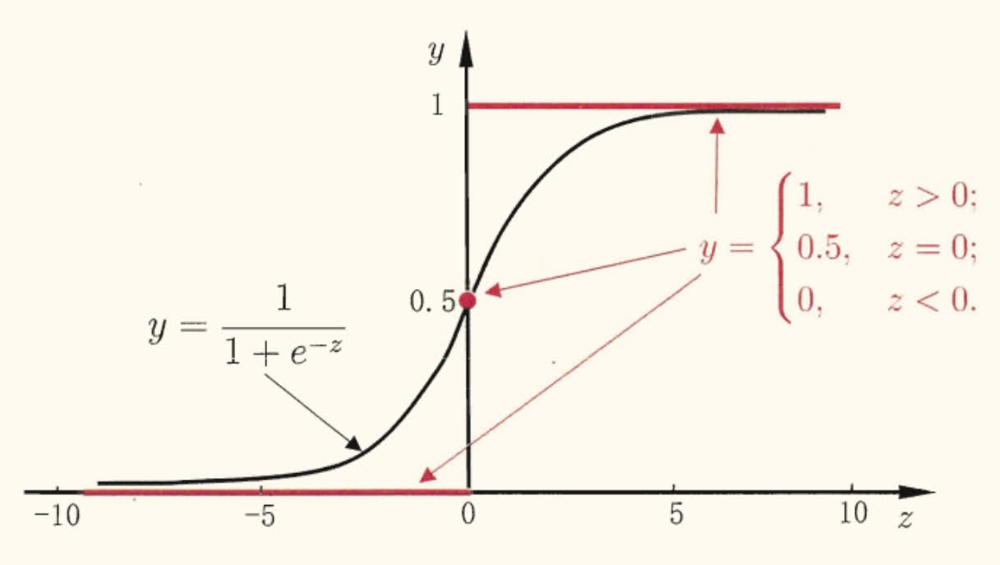
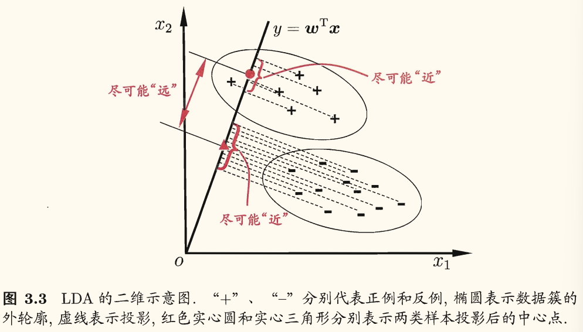
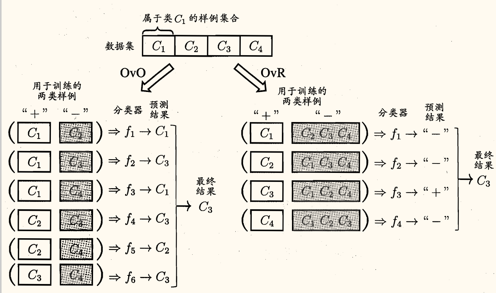
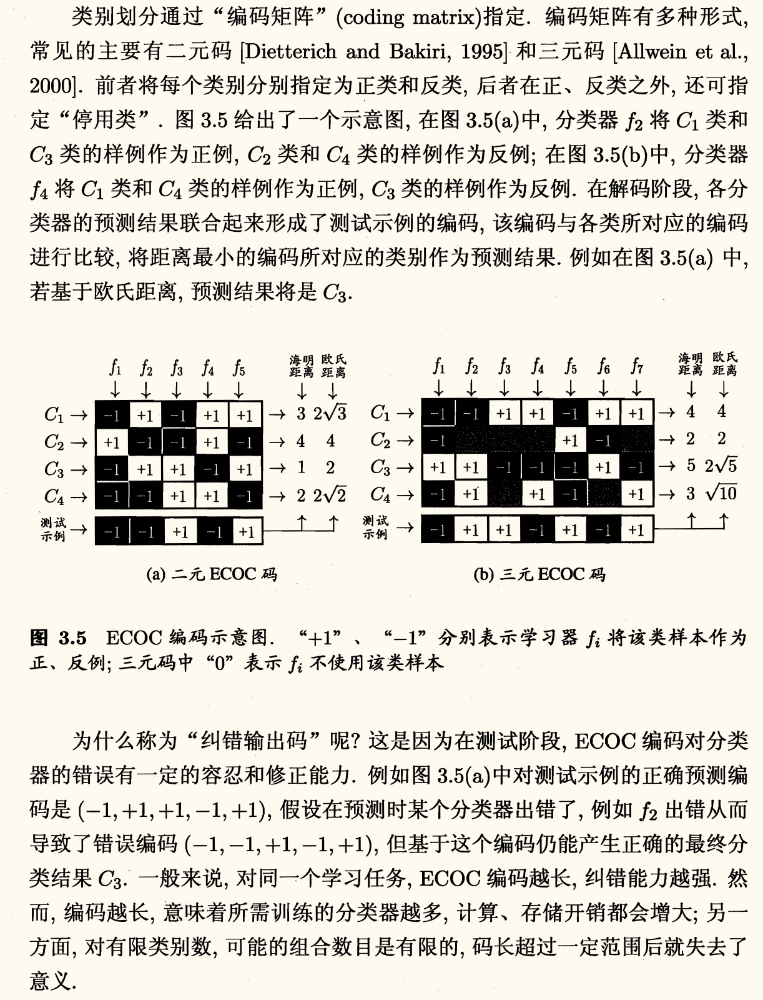

## 基本形式

!!! info ""
    给定由 $d$ 个属性描述的示例 $\bm{x} = (x_1; x_2; \cdots; x_d)$，其中 $x_i$ 是 $\bm{x}$ 的第 $i$ 个属性上的取值，**线性模型**（linear model）试图学得一个通过属性的线性组合来进行预测的函数，即
    
    $$
    f(\bm{x}) = w_1 x_1 + w_2 x_2 + \cdots + w_d x_d + b
    $$
    
    一般用向量形式写成
    
    $$
    f(\bm{x}) = \bm{w}^\intercal \bm{x} + b
    $$
    
    其中 $\bm{w} = (w_1; w_2; \cdots; w_d)$。$\bm{w}, b$ 学得后，模型就得以确定。

线性模型形式简单、易于建模，有很好的*可解释性*（comprehensibility），蕴含着机器学习中一些重要的基本思想，许多功能更强大的非线性模型（nonlinear model）可在线性模型的基础上通过引入层级结构或高维映射而得。

## 线性回归

给定数据集 $D = \left\lbrace (\bm{x}_1, y_1),\, (\bm{x}_2, y_2),\, \cdots,\, (\bm{x}_m, y_m) \right\rbrace$，其中 $\bm{x}_i = (x_{i1}; x_{i2}; \cdots; x_{id}),\, y_i \in \R$。**线性回归**（linear regression）试图学得一个线性模型以尽可能准确地预测实值输出标记。

先考虑一种简单的情形（单一属性线性回归）：输入的属性数目只有一个。为了便于讨论，此时忽略关于属性的下标。

线性回归试图学得

$$
f(x_i) = w x_i + b
$$

使得

$$
f(x_i) \simeq y_i
$$

确定 $w, b$ 的方法有很多，最常见的是**最小二乘法**（least squares method），即使得均方误差最小化：

$$
(w^{*}, b^{*}) = \argmin_{(w, b)} \sum_{i=1}^{m} \left( f(x_i) - y_i \right)^2
$$

求解 $w, b$ 使得 $E_{(w, b)}$ 最小化的过程，称为线性回归模型的最小二乘「参数估计」（parameter estimation）。

<!-- {{{ 过程 -->

过程

求偏导有

$$
\left\lbrace\begin{aligned}
    \dfrac{\partial E_{(w, b)}}{\partial w} &= 2 \left( w \sum_{i=1}^{m} x_i^2 - \sum_{i=1}^{m} (y_i - b) x_i \right) \\
    \dfrac{\partial E_{(w, b)}}{\partial b} &= 2 \left( m b - \sum_{i=1}^{m} (y_i - w x_i) \right)
\end{aligned}\right.
$$

令两式为零可得 $w, b$ 最优解的闭式（closed-form）解

$$
\left\lbrace\begin{aligned}
    w &= \dfrac{\sum\limits_{i = 1}^m y_i (x_i - \bar{x})}{\sum\limits_{i = 1}^m x_i^2 - \frac{1}{m} \left( \sum\limits_{i = 1}^m x_i \right)^2} \\ 
    b &= \dfrac{1}{m} \sum_{i=1}^{m} (y_i - w x_i)
\end{aligned}\right.
$$

其中 $\bar{x} = \frac{1}{m} \sum\limits_{i = 1}^m x_i$ 为 $x$ 的均值。

<!-- }}} -->

更一般的情形就是*多元线性回归*（multivariate linear regression），即输入的属性数目大于一个。此时，线性回归试图学得

$$
f(\bm{x}_i) = \bm{w}^\intercal \bm{x}_i + b
$$

使得

$$
f(\bm{x}_i) \simeq y_i
$$

<!-- {{{ 过程 -->

过程

为了便于讨论，将 $\bm{w}, b$ 吸收入向量形式 $\hat{\bm{w}} = (\bm{w}; b)$。相应的，把数据集 $D$ 表示为一个 $x \times (d + 1)$ 大小的矩阵 $\mathbf{X}$，其中每一行对应于一个示例，该行前 $d$ 个元素对应于示例的 $d$ 个属性值，最后一个元素恒置为 $1$，即

$$
\mathbf{X} = \begin{pmatrix}
    x_{11} & x_{12} & \cdots & x_{1d} & 1 \\
    x_{21} & x_{22} & \cdots & x_{2d} & 1 \\
    \vdots & \vdots & \ddots & \vdots & \vdots \\
    x_{m1} & x_{m2} & \cdots & x_{md} & 1
\end{pmatrix} = \begin{pmatrix}
    \bm{x}_1^\intercal & 1 \\
    \bm{x}_2^\intercal & 1 \\
    \vdots & \vdots \\
    \bm{x}_m^\intercal & 1
\end{pmatrix}
$$

标记也写成向量形式 $\bm{y} = (y_1; y_2; \cdots; y_m)$。类似地有

$$
\hat{\bm{w}}^{*} = \argmin_{\hat{\bm{w} }} (\bm{y} - \mathbf{X} \hat{\bm{w}})^\intercal (\bm{y} - \mathbf{X} \hat{\bm{w}})
$$

令 $E_{\hat{\bm{w} }} = (\bm{y} - \mathbf{X} \hat{\bm{w}})^\intercal (\bm{y} - \mathbf{X} \hat{\bm{w}})$，求导有

$$
\dfrac{\partial E_{\hat{\bm{w} } }}{\partial \hat{\bm{w} }} = 2 \mathbf{X}^\intercal (\mathbf{X} \hat{\bm{w}} - \bm{y})
$$

令上式为零可得 $\hat{\bm{w}}$ 最优解的闭式解。但涉及矩阵逆的计算，比单变量复杂一点。下面进行一个简单的讨论。

当 $\mathbf{X}^\intercal \mathbf{X}$ 为满秩矩阵（full-rank matrix）或正定矩阵（positive definite matrix）时，$\mathbf{X}^\intercal \mathbf{X}$ 可逆，此时有

$$
\hat{\bm{w}}^{*} = (\mathbf{X}^\intercal \mathbf{X})^{-1} \mathbf{X}^\intercal \bm{y}
$$

令 $\hat{\bm{x}}_i = (\bm{x}_i, 1)$，则最终学得的多元线性回归模型为

$$
f(\bm{x}_i) = \hat{\bm{x}}_i^\intercal (\mathbf{X}^\intercal \mathbf{X})^{-1} \mathbf{X}^\intercal \bm{y}
$$

现实中 $\mathbf{X}^\intercal \mathbf{X}$ 往往不是满秩矩阵。例如在很多任务中会遇到大量的变量，甚至超出样例数，导致 $\mathbf{X}$ 列数多于行数，此时 $\mathbf{X}^\intercal \mathbf{X}$ 显然不满秩。此时可解出多个 $\hat{\bm{w}}$，它们都能使均方误差最小化，选择哪一个解作为输出，由学习算法的归纳偏好决定。常见的做法是引入**正则化**（regularization）项[^regularization]。

[^regularization]: 等到第六章才会涉及。后面补充链接，若有的话。

<!-- }}} -->

对数线性回归（log-linear regression）类似，即

$$
\ln y = \bm{w}^\intercal \bm{x} + b
$$

这里就不再多谈。

!!! note ""
    更一般地，考虑单调可微函数 $g$，令

    $$
    y = g^{-1}(\bm{w}^\intercal \bm{x} + b)
    $$
    
    这样得到的模型称为**广义线性模型**（generalized linear model）。其中函数 $g$ 称为**联系函数**（link function）。

## 对数几率回归

上一节讨论的是如何使用线性模型进行回归学习。对于分类任务，可以利用上面的广义线性模型，找到一个单调可微函数将分类任务的真实标记 $y$ 与线性回归模型的预测值联系起来。

考虑二分类问题，输出标记 $y \in \left\lbrace 0, 1 \right\rbrace$。对于线性回归模型，产生的预测值 $z = \bm{w}^\intercal \bm{x} + b$ 为实数，需要将其转换为 $0 / 1$ 值。

一种方法是使用**单位阶跃函数**（unit-step function）：

$$
y = \begin{cases}
    0, & z < 0;\\ 
    0.5, & z = 0;\\ 
    1, & z > 0.
\end{cases}
$$

但单位阶跃函数不连续，不可微。于是希望找到能在一定程度上近似单位阶跃函数的*替代函数*（surrogate function），并希望它单调可谓。

**对数几率函数**（logistic function，对率函数）[^logistic]是一个常用的替代函数：

[^logistic]: 名字跟「逻辑」很像，但没有关系。

$$
y = \dfrac{1}{1 + \e^{-z}}
$$

如图所示，对率函数是一种 Sigmoid 函数，即形似 S 的函数。它将 $z$ 值转化为一个接近 $0 / 1$ 的 $y$ 值，并在 $z = 0$ 附近变化陡峭。

对于单调可谓函数 $g$，广义线性模型有

$$
\begin{equation}
    y = g^{-1}(\bm{w}^\intercal \bm{x} + b) \label{1}
\end{equation}
$$

将对率函数作为其中的 $g^{-1}$，有

$$
\begin{equation}
    y = \dfrac{1}{1 + \e^{-(\bm{w}^\intercal \bm{x} + b)}} \label{2}
\end{equation}
$$

从而得到

$$
\ln \dfrac{y}{1 - y} = \bm{w}^\intercal \bm{x} + b
$$

若将 $y$ 视为样本 $\bm{x}$ 作为正例的可能性，则 $1 - y$ 为其反例可能性，两者的比值 $\dfrac{y}{1 - y}$ 称为**几率**（odds），这反映了 $\bm{x}$ 作为正例的相对可能性。同理有**对数几率**（log odds, a.k.a. logit）$\ln \dfrac{y}{1 - y}$。

即式 $\eqref{2}$ 实际上是在用线性回归模型的预测结果去逼近*真实标记的对数几率*，因此这个对应的模型才被称为**对数几率回归**（logistic regression, a.k.a. logit regression）。

虽然被称为是「回归」，但这实际上是一种学习方法。这种方法有很多优点，例如它是直接对分类可能性进行建模，无需事先假设数据分布，这样就避免了假设分布不准确所带来的问题；它不是仅预测出「类别」，而是可得到近似概率预测，这对许多需利用概率辅助决策的任务很有用；此外，对率函数是任意阶可导的凸函数，有很好的数学性质，现有的许多数值优化算法都可直接用于求取最优解。

接下来是确定式 $\eqref{2}$ 中的 $\bm{w}, b$。若将其中的 $y$ 视为类后验概率估计 $p(y = 1 \mid \bm{x})$，则有

$$
\ln \dfrac{p(y = 1 \mid \bm{x})}{p(y = 0 \mid \bm{x})} = \bm{w}^\intercal \bm{x} + b
$$

从而有

$$
\left\lbrace\begin{aligned}
    p(y = 1 \mid \bm{x}) &= \dfrac{\e^{\bm{w}^\intercal \bm{x} + b}}{1 + \e^{\bm{w}^\intercal \bm{x} + b}} \\
    p(y = 0 \mid \bm{x}) &= \dfrac{1}{1 + \e^{\bm{w}^\intercal \bm{x} + b}}
\end{aligned}\right.
$$

可以通过**极大似然法**（maximum likelihood method，最大似然估计）[^mlm]来估计 $\bm{w}, b$。给定数据集 $\left\lbrace (\bm{x}_i, y_i) \right\rbrace_{i=1}^m$，对率回归模型最大化**对数似然**（log-likelihood）

[^mlm]: 有机会补充一下关于极大似然法的内容。

$$
\ell(\bm{w}, b) = \sum_{i=1}^m \ln p (y_i \mid \bm{x}_i; \bm{w}, b)
$$

即令每个样本属于其真实标记的概率越大越好。

为便于讨论，令 $\bm{\beta} = (\bm{w}; b),\, \hat{\bm{x}} = (\bm{x}; 1)$，则 $\bm{w}^\intercal \bm{x} + b$ 可记为 $\bm{\beta}^\intercal \hat{\bm{x}}$。

再令 $p_1(\hat{\bm{x}}; \bm{\beta}) = p(y = 1 \mid \hat{\bm{x}}; \bm{\beta}),\, p_0(\hat{\bm{x}}; \bm{\beta}) = p(y = 0 \mid \hat{\bm{x}}; \bm{\beta}) = 1 - p_1(\hat{\bm{x}}; \bm{\beta})$，则对数似然项可重写为

$$
p(y_i \mid \bm{x}_i; \bm{w}, b) = y_i p_1(\hat{\bm{x}}_i; \bm{\beta}) + (1 - y_i) p_0(\hat{\bm{x}}_i; \bm{\beta})
$$

!!! memo ""
    书上这部分把我绕晕了……下面按自己的理解写。

将上式代入对率回归模型对数似然有

$$
\begin{aligned}
    \ell(\bm{\beta}) &= \sum_{i=1}^m \ln\left( y_i p_1(\hat{\bm{x}}_i; \bm{\beta}) + (1 - y_i) p_0(\hat{\bm{x}}_i; \bm{\beta}) \right)\\ 
    &= \sum_{i=1}^m \ln\left( y_i \dfrac{\e^{\bm{\beta}^\intercal\hat{\bm{x}}_i}}{1 + \e^{\bm{\beta}^\intercal\hat{\bm{x}}_i}} + (1 - y_i)\dfrac{1}{1 + \e^{\bm{\beta}^\intercal\hat{\bm{x}}_i}}\right) 
\end{aligned}
$$

然后呢，$\ln$ 移到 $p_{0 / 1}(\hat{\bm{x}}_i; \bm{\beta})$ 上（可能我没搞懂其中的原理），就有

$$
\begin{aligned}
    \ell(\bm{\beta}) &= \sum_{i=1}^m \left( y_i\bm{\beta}^\intercal \hat{\bm{x}}_i - \ln\left( 1 + \e^{\bm{\beta}^\intercal \hat{\bm{x}}_i} \right) \right)
\end{aligned}
$$

最大似然估计即要使上式最大化。按书上的说法，将其取负以转化为最小值（相同的记号，不停变式子内容…）

$$
\ell(\bm{\beta}) = \sum_{i=1}^m \left( -y_i\bm{\beta}^\intercal \hat{\bm{x}}_i + \ln\left( 1 + \e^{\bm{\beta}^\intercal \hat{\bm{x}}_i} \right) \right)
$$

这个是关于 $\bm{\beta}$ 的高阶可导连续凸函数，根据凸优化理论，可以使用经典的数值优化算法（如梯度下降法、牛顿法等）求得其最优解，得到

$$
\bm{\beta}^{*} = \argmin_{\bm{\beta}} \ell(\bm{\beta})
$$

<!-- {{{ 牛顿法 -->

牛顿法

以牛顿法为例，其 $t + 1$ 轮迭代解的更新公式为

$$
\bm{\beta}^{t+1} = \bm{\beta}^t - \left( \dfrac{\partial^2 \ell(\bm{\beta})}{\partial \bm{\beta} \partial \bm{\beta}^\intercal} \right)^{-1} \dfrac{\partial \ell(\bm{\beta})}{\partial \bm{\beta}}
$$

其中关于 $\bm{\beta}$ 的一二阶导数分别为

$$
\left\lbrace\begin{aligned}
    \dfrac{\partial \ell(\bm{\beta})}{\partial \bm{\beta}} &= - \sum_{i=1}^{m} \hat{\bm{x}}_i (y_i - p_1(\hat{\bm{x}}_i; \bm{\beta})) \\
    \dfrac{\partial^2 \ell(\bm{\beta})}{\partial \bm{\beta} \partial \bm{\beta}^\intercal} &= \sum_{i=1}^{m} \hat{\bm{x}}_i \hat{\bm{x}}_i^\intercal p_1(\hat{\bm{x}}_i; \bm{\beta}) (1 - p_1(\hat{\bm{x}}_i; \bm{\beta}))
\end{aligned}\right.
$$

<!-- }}} -->

## 线性判别分析

线性判别分析（linear discriminant analysis, LDA）是一种经典的线性学习方法。

LDA 的思想：给定训练样例集，设法将样例投影到一条直线上，使得同类样例的投影点尽可能接近，异类样例的投影点尽可能远离；在对新样本进行分类时，将其投影到同样的这条直线上，再根据投影点的位置来确定新样本的类别。

由于将样例投影到一条直线（低维空间），因此这也被视为一种「监督降维」技术（第 10 章）。

给定数据集 $\left\lbrace (\bm{x}_i, y_i) \right\rbrace_{i=1}^m,\, y_i \in \left\lbrace 0, 1 \right\rbrace$，其中第 $i \in \left\lbrace 0, 1 \right\rbrace$ 类示例有
- 集合 $X_i$
- 均值向量 $\bm{\mu}_i$
- 协方差矩阵 $\bm{\Sigma}_i$

若将数据投影到直线 $\bm{w}$ 上，则
- 两类样本的中心在直线上的投影分别为 $\bm{w}^\intercal \bm{\mu}_0$ 和 $\bm{w}^\intercal \bm{\mu}_1$
- 两类样本的协方差在直线上的投影分别为 $\bm{w}^\intercal \bm{\Sigma}_0 \bm{w}$ 和 $\bm{w}^\intercal \bm{\Sigma}_1 \bm{w}$。

若使同类样例投影点尽可能接近，可以让<u>同类样例协方差尽可能小</u>，即 $\bm{w}^\intercal \bm{\Sigma}_0 \bm{w} + \bm{w}^\intercal \bm{\Sigma}_1 \bm{w}$ 尽可能小；若使异类样例投影点尽可能远离，可以让<u>异类样例中心点尽可能远离</u>，即 $\left\lVert \bm{w}^\intercal \bm{\mu}_0 - \bm{w}^\intercal \bm{\mu}_1 \right\rVert^2_2$[^l2_norm] 尽可能大。

[^l2_norm]: 下标的 2 表示这是一个 $L_2$ 范数。有关 $L_p$-范数的内容，可以简单参考[维基百科](https://zh.wikipedia.org/wiki/Lp范数)。

同时考虑二者，可得欲最大化的目标函数为

$$
\begin{equation}
    \begin{aligned}
    J &= \dfrac{\left\lVert \bm{w}^\intercal \bm{\mu}_0 - \bm{w}^\intercal \bm{\mu}_1 \right\rVert^2_2}{\bm{w}^\intercal \bm{\Sigma}_0 \bm{w} + \bm{w}^\intercal \bm{\Sigma}_1 \bm{w}} \\ 
    &= \dfrac{\bm{w}^\intercal(\bm{\mu}_0 - \bm{\mu}_1)(\bm{\mu}_0 - \bm{\mu}_1)^\intercal\bm{w}}{\bm{w}^\intercal(\bm{\Sigma}_0 + \bm{\Sigma}_1)\bm{w}}
    \end{aligned}\label{3}
\end{equation}
$$

定义**类内散度矩阵**（within-class scatter matrix）

$$
\begin{aligned}
    \mathbf{S}_w &= \bm{\Sigma}_0 + \bm{\Sigma}_1 \\
    &= \sum_{\bm{x} \in X_0} (\bm{x} - \bm{\mu}_0)(\bm{x} - \bm{\mu}_0)^\intercal + \sum_{\bm{x} \in X_1} (\bm{x} - \bm{\mu}_1)(\bm{x} - \bm{\mu}_1)^\intercal
\end{aligned}
$$

与**类间散度矩阵**（between-class scatter matrix）

$$
\mathbf{S}_b = (\bm{\mu}_0 - \bm{\mu}_1)(\bm{\mu}_0 - \bm{\mu}_1)^\intercal
$$

$\eqref{3}$ 可重写为

$$
\begin{equation}
    J = \dfrac{\bm{w}^\intercal \mathbf{S}_b \bm{w}}{\bm{w}^\intercal \mathbf{S}_w \bm{w}} \label{4}
\end{equation}
$$

即 LDA 欲最大化的目标就是，$\mathbf{S}_b$ 与 $\mathbf{S}_w$ 的**广义瑞利商**（generalized Rayleigh quotient）。

<!-- {{{ 过程 -->

过程

首先确定 $\bm{w}$。注意到 $\eqref{4}$ 分子分母都是关于 $\bm{w}$ 的二次项，因此解与 $\bm{w}$ 长度无关，仅与其方向有关。不失一般性，令 $\bm{w}^\intercal S_w \bm{w} = 1$，即最大化 $\eqref{4}$ 等价于

$$
\min_{\bm{w}} - \bm{w}^\intercal \mathbf{S}_b \bm{w}\quad \text{s.t.}\quad \bm{w}^\intercal \mathbf{S}_w \bm{w} = 1
$$

拉格朗日乘子法有拉格朗日函数（$\lambda$ 是拉格朗日乘子）

$$
\mathcal{L}(\bm{w}, \lambda) = - \bm{w}^\intercal \mathbf{S}_b \bm{w} + \lambda (\bm{w}^\intercal \mathbf{S}_w \bm{w} - 1)
$$

偏导有

$$
\left\lbrace\begin{aligned}
    \dfrac{\partial \mathcal{L}}{\partial \bm{w}} &= 2 \left( \lambda \mathbf{S}_w \bm{w} - \mathbf{S}_b \bm{w} \right) \\
    \dfrac{\partial \mathcal{L}}{\partial \lambda} &= \bm{w}^\intercal \mathbf{S}_w \bm{w} - 1
\end{aligned}\right.
$$

即

$$
\begin{equation}
    \mathbf{S}_b \bm{w} = \lambda \mathbf{S}_w \bm{w} \label{h1} \tag{h1}
\end{equation}
$$

注意到 $\mathbf{S}_b \bm{w}$ 方向恒为 $\bm{\mu}_0 - \bm{\mu}_1$，不妨设

$$
\mathbf{S}_b \bm{w} = \lambda (\bm{\mu}_0 - \bm{\mu}_1)
$$

代入 $\eqref{h1}$ 有

$$
\bm{w} = \mathbf{S}_w^{-1} (\bm{\mu}_0 - \bm{\mu}_1)
$$

实践中通常是对 $\mathbf{S}_w$ 进行奇异值分解，即 $\mathbf{S}_w = \mathbf{U} \bm{\Sigma} \mathbf{V}^\intercal$，其中 $\bm{\Sigma}$ 是一个实对角矩阵，对角线上的元素是 $\mathbf{S}_w$ 的奇异值，再由 $\mathbf{S}_w^{-1} = \mathbf{V} \bm{\Sigma}^{-1} \mathbf{U}^\intercal$ 得到 $\mathbf{S}_w^{-1}$。

!!! tip ""
    LDA 的贝叶斯决策理论解释：两类数据同先验、满足高斯分布且协方差相等时，LDA 达到最优分类。

<!-- }}} -->

<!-- {{{ 推广到多分类任务 -->

推广到多分类任务

假定存在 $N$ 个类，第 $i$ 类示例数为 $m_i$，先定义**全局散度矩阵**

$$
\begin{aligned}
    \mathbf{S}_t &= \mathbf{S}_b + \mathbf{S}_w\\ 
    &= \sum_{i=1}^m (\bm{x}_i - \bm{\mu})(\bm{x}_i - \bm{\mu})^\intercal
\end{aligned}
$$

其中 $\bm{\mu}$ 是所有示例的均值向量。

将类内散度矩阵 $\mathbf{S}_w$ 重定义为每个类别的散度矩阵之和，即

$$
\mathbf{S}_w = \sum_{i=1}^N \mathbf{S}_{w_i}
$$

其中

$$
\mathbf{S}_{w_i} = \sum_{\bm{x} \in X_i} (\bm{x} - \bm{\mu}_i)(\bm{x} - \bm{\mu}_i)^\intercal
$$

从而有

$$
\begin{aligned}
    \mathbf{S}_b &= \mathbf{S}_t - \mathbf{S}_w\\ 
    &= \sum_{i=1}^N m_i (\bm{\mu}_i - \bm{\mu})(\bm{\mu}_i - \bm{\mu})^\intercal
\end{aligned}
$$

从而多分类 LDA 有多种实现方法：使用 $\mathbf{S}_b, \mathbf{S}_w, \mathbf{S}_t$ 三者中的任何两个即可。

常见的一种实现是采用优化目标

$$
\max_{\mathbf{W}} \dfrac{\trace(\mathbf{W}^\intercal \mathbf{S}_b \mathbf{W})}{\trace(\mathbf{W}^\intercal \mathbf{S}_w \mathbf{W})}
$$

其中 $\mathbf{W} \in \R^{d \times (N - 1)}$，$\trace$ 是矩阵的**迹**（trace）。上式可通过广义特征值问题求解：

$$
\mathbf{S}_b \mathbf{W} = \lambda \mathbf{S}_w \mathbf{W}
$$

$\mathbf{W}$ 的闭式解是 $\mathbf{S}_w^{-1} \mathbf{S}_b$ 的 $N - 1$ 个最大广义特征值所对应的特征向量组成的矩阵。

<!-- }}} -->

## 多分类学习

现实中常遇到多分类学习任务。有些二分类学习方法可直接推广到多分类，但在更多情形下，我们是基于一些基本策略，利用二分类学习器来解决多分类问题。

不失一般性，考虑 $N$ 个类别 $C_1, C_2, \cdots, C_N$，多分类学习的基本思路是「拆解法」，即<u>将多分类任务拆为若干个二分类任务求解</u>。

上面的方法具体而言是：先对问题进行拆分，为拆出的每个二分类任务训练一个分类学习器，即**分类器**（classifier）。在测试时，对这些分类器的预测结果进行集成以获得最终的多分类结果。

因此关键在于「如何对多分类任务进行拆分」以及「如何对多个分类器进行集成」。本节主要介绍拆分策略。

最经典的拆分策略有**一对一**（One vs. One, OvO）、**一对其余**（One vs. Rest, OvR）和**多对多**（Many vs. Many, MvM）。

给定数据集 $\left\lbrace (\bm{x}_1, y_1),\, (\bm{x}_2, y_2),\, \cdots,\, (\bm{x}_m, y_m) \right\rbrace,\, y_i \in \left\lbrace C_1, C_2, \cdots, C_N \right\rbrace$。

OvO 将这 $N$ 个类别两两配对，从而产生 $\dfrac{N(N-1)}{2}$ 个二分类任务。测试阶段，新样本将同时提交给所有分类器，于是将得到 $\dfrac{N(N-1)}{2}$ 个分类结果，最终结果由投票决定：即把被预测得最多的类别作为最终的分类结果。

OvR 则是每次将一个类的样例作为正例、所有其他类的样例作为反例训练 $N$ 个分类器。测试时若仅有一个分类器预测为正例，则对应的类别标记作为最终分类结果。若有多个分类器预测为正例，则通常考虑各分类器的预测置信度，选择置信度最大的类别标记作为分类结果。

OvR 只需训练 $N$ 个分类器，而 OvO 需训练 $\dfrac{N(N-1)}{2}$ 个分类器，因此 OvO 的存储开销和测试时间开销通常比 OvR 更大。但在训练时， OvR 的每个分类器均使用全部训练样例，OvO 的每个分类器仅用到两个类的样例，因此<u>类别很多时 OvO 的训练时间开销同时比 OvR 更小</u>。

预测性能取决于具体的数据分布，多数情形下两者差不多。

MvM 是一种折中的策略。它每次将若干个类作为正类，若干个其他类作为反类。正、反类的构造必须有特殊的设计，下面是一种最常用的 MvM 技术——**纠错输出码**（Error Correcting Output Codes, ECOC）。

ECOC 是将编码的思想引入类别拆分，并尽可能在解码过程中具有容错性。工作过程主要分为两步：
1. 编码：对 $N$ 个类别做 $M$ 次划分，每次划分将一部分类别划为正类，一部分划为反类，从而形成一个二分类训练集。一共产生 $M$ 个训练集，可训练 $M$ 个分类器。
2. 解码：$M$ 个分类器分别对测试样本进行预测，这些预测标记组成一个编码。将这个编码与每个类别各自的编码进行比较，返回其中距离最小的类别作为最终预测结果。

对同等长度的编码，理论上来说，任意两个类别之间的编码距离越远，则纠错能力越强。因此，在码长较小时可根据这个原则计算出理论最优编码。然而，码长稍大一些就难以有效地确定最优编码，事实上这是 NP 难问题。不过，通常我们并不需获得理论最优编码，因为非最优编码在实践中往往已能产生足够好的分类器。

另一方面，并不是编码的理论性质越好，分类性能就越好，因为机器学习问题涉及很多因素，例如将多个类拆解为两个「类别子集」，不同拆解方式所形成的两个类别子集的区分难度往往不同，即其导致的二分类问题的难度不同；于是，一个理论纠错性质很好、但导致的二分类问题较难的编码，与另一个理论纠错性质差一些、但导致的二分类问题较简单的编码，最终产生的模型性能孰强孰弱很难说。

## 类别不平衡问题

前面介绍的分类学习方法基于一个共同的基本假设，即「不同类别的训练样例数目相当」。

若不同类别的训练样例数差别很大，会对学习过程造成困扰。例如有 998 个正例，2 个反例，一个分类器只需将所有样例都预测为正例，就能达到 99.8% 的准确率。但这样的分类器显然是无用的。

**类别不平衡**（class-imbalance）就是指<u>分类任务中不同类别的训练样例数目差别很大</u>的情况。不失一般性，本节假定正类样例较少，反类样例较多。

从线性分类器的角度进行讨论。

在用 $y = \bm{w}^\intercal \bm{x} + b$ 对新样本 $\bm{x}$ 进行分类时，事实上是在用预测出的 $y$ 值与一个阈值进行比较，例如通常在 $y > 0.5$ 时判别为正例，否则为反例。

$y$ 实际上表达了正例的可能性，几率 $\dfrac{y}{1 - y}$ 则反映了正例可能性与反例可能性之比值，阈值设置为 $0.5$ 恰表明分类器认为真实正、反例可能性相同，即分类器决策规则为

> 若 $\dfrac{y}{1 - y} > 1$，则预测为正例。

然而，当训练集中正、反例数目不同时，令 $m^{+}, m^{-}$ 分别表示正、反例数目，则观测几率是 $\dfrac{m^{+}}{m^{-}}$。由于我们通常假设训练集是真实样本总体的无偏采样，因此观测几率就代表了真实几率。于是只要分类器的预测几率高于观测几率就应判定为正例，即

> 若 $\dfrac{y}{1 - y} > \dfrac{m^{+}}{m^{-}}$，则预测为正例。

但是分类器基于第一个决策规则进行决策。因此需要对其观测值进行调整，使其基于第一个决策规则，但实际上是在执行第二个决策规则。只需令

$$
\begin{equation}
    \dfrac{y'}{1 - y'} = \dfrac{y}{1 - y} \cdot \dfrac{m^{-}}{m^{+}} \label{5}
\end{equation}
$$

这就是类别不平衡学习的一个基本策略——**再缩放**（rescaling, 亦称*再平衡* rebalance）。

然而，「训练集是真实样本总体的无偏采样」这个假设往往并不成立，即未必能有效地基于训练集观测几率来推断真实几率。

现有技术大体上有三类做法：
- **欠采样**（undersampling）：去除一些反例使得正、反例数目接近。
- **过采样**（oversampling）：增加一些正例使得正、反例数目接近。
- **阈值移动**（threshold-moving）：直接基于原始训练集进行学习，但在用训练好的分类器进行预测时，将式 $\eqref{5}$ 嵌入到其决策过程中。

欠采样法的时间开销通常远小于过采样法，因为前者丢弃了很多反例，使得分类器训练集远小于初始训练集，而过采样法增加了很多正例，其训练集大于初始训练集。

过采样法不能简单地对初始正例样本进行重复采样，否则会招致严重的过拟合；一方面，欠采样法若随机丢弃反例，可能丢失一些重要信息。

过采样法的代表性算法 SMOTE 是通过对训练集里的正例进行插值来产生额外的正例；欠采样法的代表性算法 EasyEnsemble 则是利用集成学习机制，将反例划分为若干个集合供不同学习器使用，这样对每个学习器来看都进行了欠采样，但在全局来看却不会丢失重要信息。

「再缩放」也是**代价敏感学习**（cost-sensitive learning）的基础。在代价敏感学习中将式 $\eqref{5}$ 中的 $\dfrac{m^{-}}{m^{+}}$ 用 $\dfrac{\mathrm{cost}^{+}}{\mathrm{cost}^{-}}$ 代替即可，其中 $\mathrm{cost}^{+}, \mathrm{cost}^{-}$ 分别表示将正、反例错分的代价。
