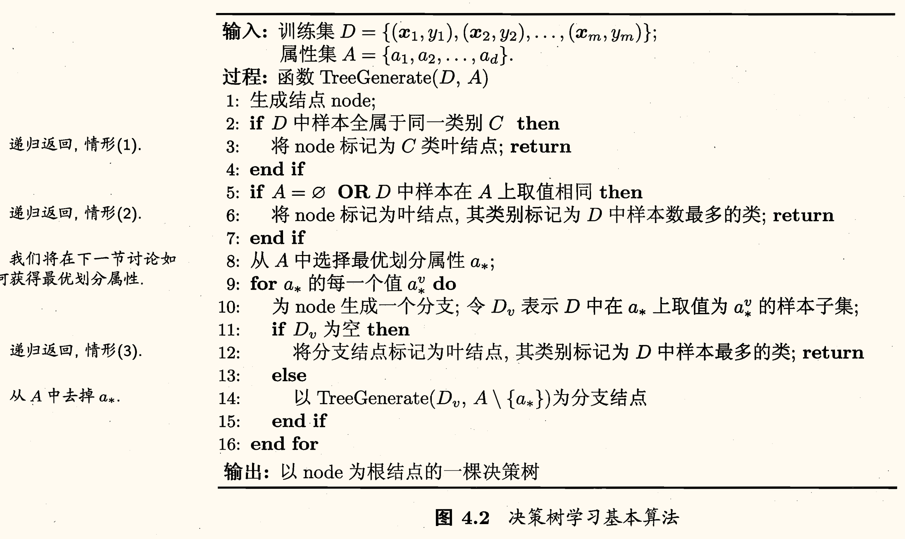
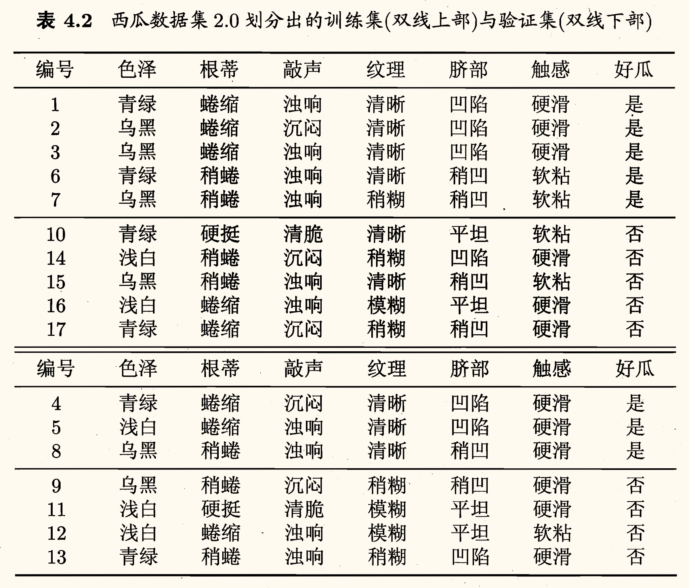
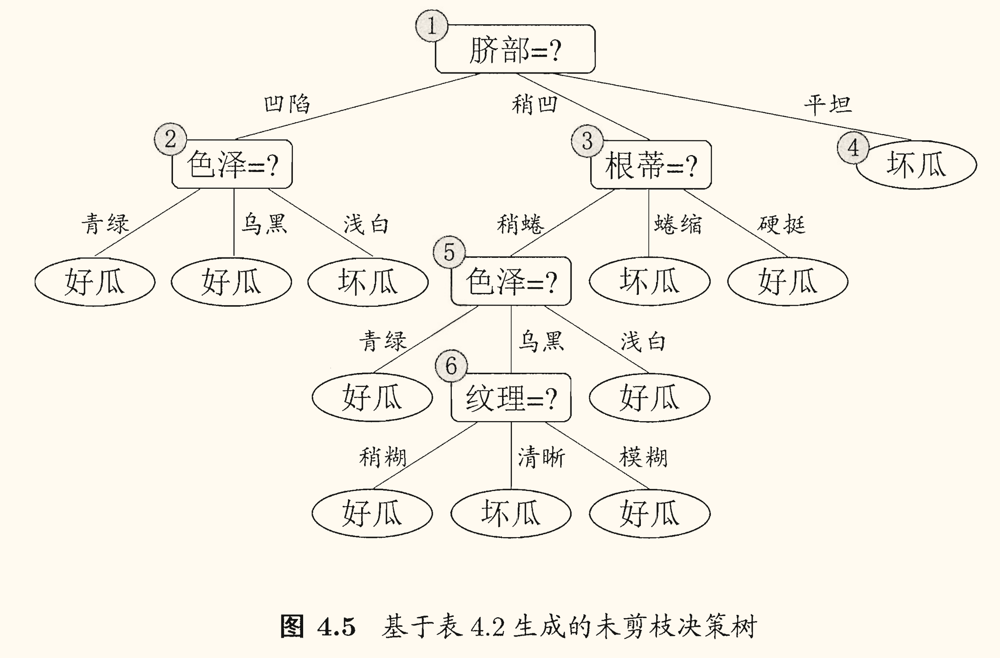
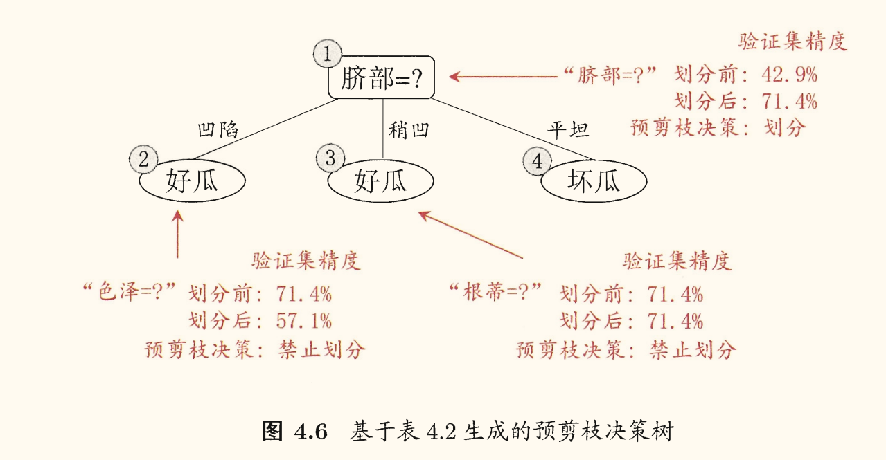
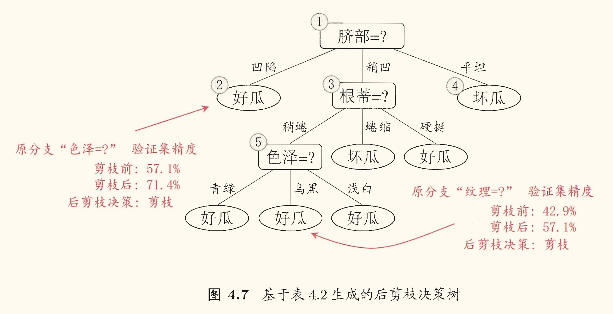
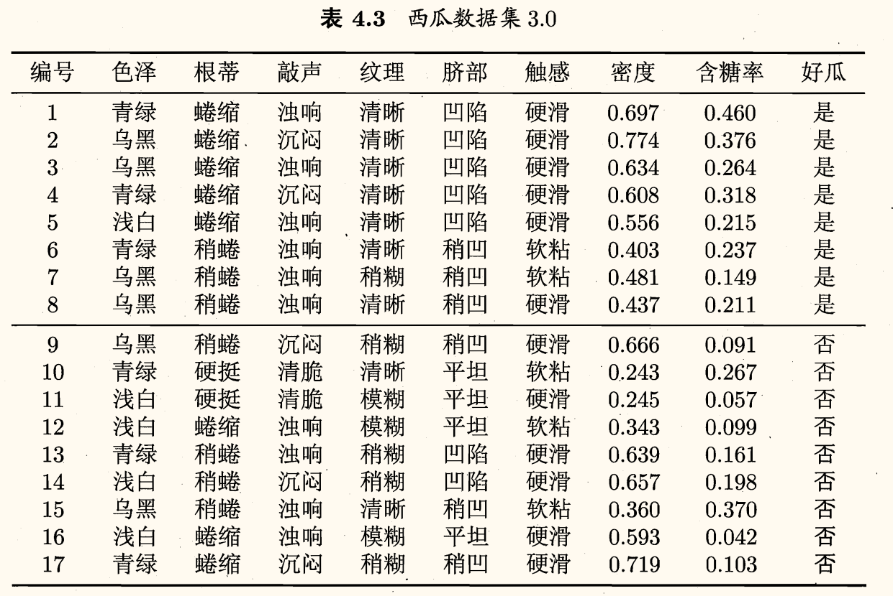
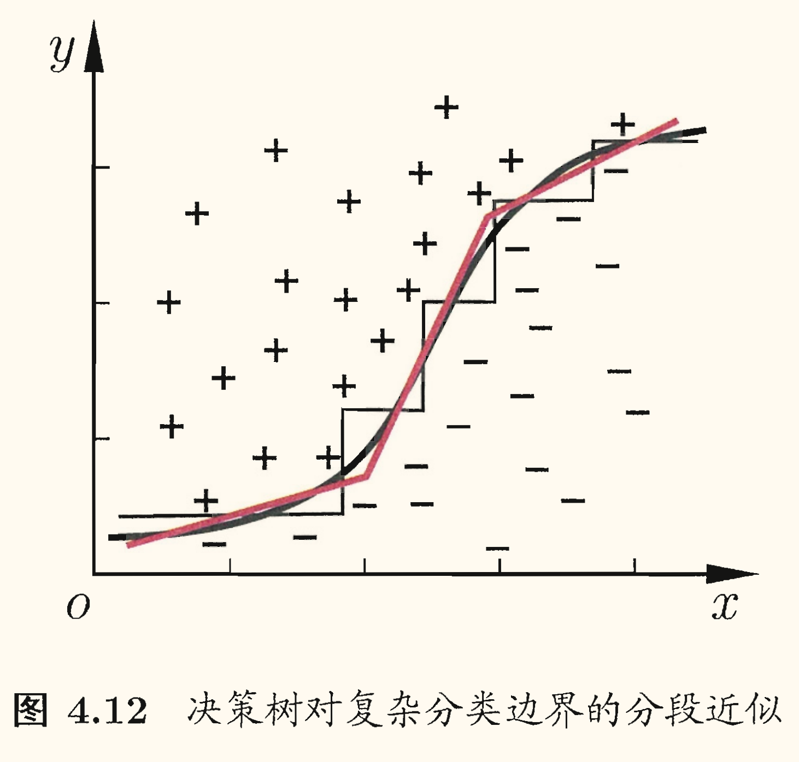
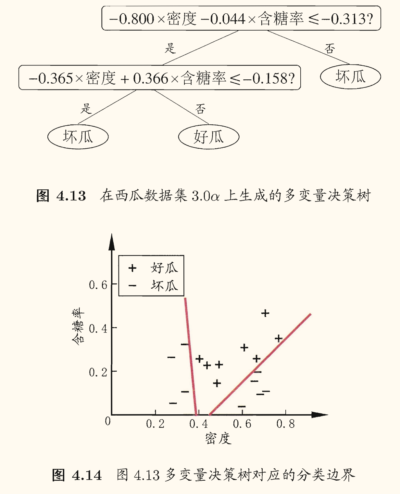

## 基本流程

**决策树**（decision tree，亦称*判定树*）是一类常见的学习方法[^decision_tree]。

[^decision_tree]: 「决策树」有时指的是学习方法，有时指的是学得的树。

以二分类任务为例，我们希望从给定训练数据集学得一个模型用以对新示例进行分类，这个把样本分类的任务，可看作对「当前样本属于正类吗？」这个问题的「决策」或「判定」过程。

一般的，一棵决策树包含*一个根结点*、*若干个内部结点*和*若干个叶结点*；叶结点对应于*决策结果*，其他每个结点则对应于一个*属性测试*；每个结点包含的样本集合根据属性测试的结果被划分到子结点中；根结点包含样本全集。从根结点到每个叶结点的路径对应了一个判定测试序列。

决策树学习的目的是为了产生一棵泛化能力强的决策树，对未见示例能做出正确的判定。

基本流程是遵循**分而治之**（divide-and-conquer）策略。是一个自根至叶的递归过程，在每个中间结点寻找一个*划分*（split or test）属性：

停止条件：
1. 当前结点包含的样本全属于同一类别，无需划分；
2. 当前属性集为空，或所有样本在所有属性上取值相同，无法划分；
3. 当前结点包含的样本集合为空，不能划分。

在第 2 种情形下，把当前结点标记为叶结点，并将其类别设定为该结点所含样本最多的类别；在第 3 种情形下，同样把当前结点标记为叶结点，但将其类别设定为其父结点所含样本最多的类别。

这两种情形处理实质不同：情形 2 是在利用当前结点的后验分布，而情形 3 则是把父结点的样本分布作为当前结点的先验分布。

## 划分选择

由算法伪代码可以看出，决策树学习的关键在于<u>如何选择最优划分属性</u>。

一般而言，随着划分过程不断进行，我们希望决策树的分支结点所包含的样本尽可能属于同一类别，即结点的**纯度**（purity）越来越高。

### 信息增益

**信息熵**（information entropy）是度量样本集合纯度最常用的一种指标。

假定当前样本集合 $D$ 中第 $k \in \left\lbrace 1, 2, \cdots, |\mathcal{Y}| \right\rbrace$ 类样本所占的比例为 $p_k$，则 $D$ 的信息熵定义为[^math_convention]：

[^math_convention]: 约定若 $p = 0$，则 $p \log p = 0$。

$$
\operatorname{Ent}(D) = - \sum_{k=1}^{|\mathcal{Y}|} p_k \log_2 p_k
$$

显然 $\operatorname{Ent}(D)$ 最小值为 $0$，最大值为 $\log_2 |\mathcal{Y}|$。具体证明过程见 [2022 年 2 月 22 日博文《初遇信息熵 Information Entropy》](/2022/02/information-entropy)。

$\operatorname{Ent}(D)$ 的值越小，样本集合 $D$ 的纯度越高。

假定离散属性 $a$ 有 $V$ 个可能的取值 $\left\lbrace a^1, a^2, \cdots, a^V \right\rbrace$，若使用 $a$ 来对样本集合 $D$ 进行划分，则会产生 $V$ 个分支结点，其中第 $v$ 个分支结点包含了 $D$ 中所有在属性 $a$ 上取值为 $a^v$ 的样本，记为 $D^v$。

可根据定义计算出 $D^v$ 的信息熵，再考虑到不同分支结点所包含的样本数不同，给分支结点赋予权重 $\dfrac{|D^v|}{|D|}$ ，即样本数越多的分支结点的影响越大，于是可计算出属性 $a$ 对样本集 $D$ 进行划分所获得的**信息增益**（information gain）：

$$
\begin{equation}
    \operatorname{Gain}(D, a) = \operatorname{Ent}(D) - \sum_{v=1}^V \dfrac{|D^v|}{|D|} \operatorname{Ent}(D^v) \label{1}
\end{equation}
$$

信息增益即划分前后信息熵之差。

一般而言，信息增益越大，意味着使用属性 $a$ 来进行划分所获得的「纯度提升」越大。

因此，我们可用信息增益来进行决策树的划分属性选择。即在算法中选择属性 $a_{*} = \argmax\limits_{a \in A} \operatorname{Gain}(D, a)$。

著名的 ID3 决策树学习算法就是以「信息增益」为准则来选择划分属性的。

### 增益率

若一个划分属性可以使得每个分支结点仅包含一个样本，此时分支结点纯度已达最大，但是这样的决策树显然不具有泛化能力，无法对新样本进行有效预测。例如「编号」属性，可以产生很多个分支，每个分支结点仅包含一个样本。

「信息增益准则」对*可取值数目较多的属性*有所偏好，为了减少这种偏好可能带来的不利影响，C4.5 决策树算法使用了**增益率**（gain ratio）来选择最优划分属性。

增益率定义为：

$$
\operatorname{Gain\_ratio}(D, a) = \dfrac{\operatorname{Gain}(D, a)}{\operatorname{IV}(a)}
$$

其中

$$
\operatorname{IV}(a) = - \sum_{v=1}^V \dfrac{|D^v|}{|D|} \log_2 \dfrac{|D^v|}{|D|}
$$

称为属性 $a$ 的**固有值**（intrinsic value）。属性 $a$ 的可能取值数目越多（即 $V$ 越大），则 $\operatorname{IV}(a)$ 的值通常会越大。

「增益率准则」对*可取值数目较少的属性*有所偏好，因此 C4.5 算法并不是直接选择增益率最大的候选划分属性，而是使用了一个启发式：<u>先从候选划分属性中找出信息增益高于平均水平的属性，再从中选择增益率最高的</u>。

### 基尼指数

CART 决策树使用**基尼指数**（Gini index）来选择最优划分属性。

数据集 $D$ 的纯度可用基尼值来度量：

$$
\begin{aligned}
    \operatorname{Gini}(D) & = \sum_{k=1}^{|\mathcal{Y}|} \sum_{k' \neq k} p_k p_{k'} \\ 
    & = 1 - \sum_{k=1}^{|\mathcal{Y}|} p_k^2
\end{aligned}
$$

直观来说，$\operatorname{Gini}(D)$ 反映了<u>从数据集 $D$ 中随机抽取两个样本，其类别标记不一致的概率</u>。因此，$\operatorname{Gini}(D)$ 越小，数据集 $D$ 的纯度越高。

属性 $a$ 的基尼指数定义为：

$$
\operatorname{Gini\_index}(D, a) = \sum_{v=1}^V \dfrac{|D^v|}{|D|} \operatorname{Gini}(D^v)
$$

于是我们在侯选属性集合 $A$ 中，选择那个使得划分后*基尼指数最小*的属性作为最优划分属性，即 $a_{*} = \argmin\limits_{a \in A} \operatorname{Gini\_index}(D, a)$。

## 剪枝处理

研究表明，划分选择的各种准则虽然对决策树的尺寸有较大影响，但*对泛化性能的影响有限*。

但剪枝方法和程度对决策树泛化性能的影响更为显著。

**剪枝**（pruning）是决策树学习算法对付「过拟合」的主要手段。在决策树学习中，为了尽可能正确分类训练样本，结点划分过程将不断重复，有时会造成决策树分支过多，这时就可能因训练样本学得「太好」了，以致于把训练集自身的一些特点当作所有数据都具有的一般性质而导致过拟合。因此，可通过主动去掉一些分支来降低过拟合的风险。

决策树剪枝基本策略有两种：
- **预剪枝**（pre-pruning）是指在决策树生成过程中，对每个结点在划分前先进行估计，若当前结点的划分不能带来决策树泛化性能提升，则停止划分并将当前结点标记为叶结点。即<u>提前终止某些分支的生长</u>。
- **后剪枝**（post-pruning）则是先从训练集生成一颗完整的决策树，然后自底向上地对非叶结点进行考察，若将该结点对应的子树替换为叶结点能带来决策树泛化性能提升，则将该子树替换为叶结点。即<u>生成一棵完全树，再「回头」剪枝</u>。

剪枝过程中需评估剪枝前后决策树的优劣。如何判断决策树泛化性能是否提升呢？这可使用[前面介绍的性能评估方法](/notes/H-machine-learning/2-model-evaluation-and-selection#评估方法)。

### 预剪枝

划分前后验证集精度不变，根据奥卡姆剃刀原则采取「禁止划分」的预剪枝决策。

- 优点
    - 降低过拟合风险
    - 显著减少了决策树的训练时间开销和测试时间开销
- 缺点
    - 欠拟合风险：有些分支的当前划分虽不能提升泛化性能、甚至可能导致泛化性能暂时下降，但在其基础上进行的后续划分却有可能导致性能显著提高

### 后剪枝

剪枝前后验证集精度不变，根据奥卡姆剃刀原则采取「不剪枝」的后剪枝决策。这里的「简单」不再指的是决策树的「简单」，而是操作上的「简单」。

通常后剪枝决策树比预剪枝决策树保留了更多的分支。

- 优点
    - 比预剪枝保留了更多的分支，欠拟合风险小，泛化性能往往优于预剪枝决策树
- 缺点
    - 训练时间开销比未剪枝决策树和预剪枝决策树都要大得多

|  剪枝  | 测试时间开销 | 训练时间开销 | 过拟合风险 | 欠拟合风险 |   泛化性能    |
|  :-:   |     :-:      |     :-:      |    :-:     |    :-:     |   :-:       |
| 预剪枝 |     降低     |     降低     |    降低    |    增加    |         -        |
| 后剪枝 |     降低     |     增加     |    降低    |  基本不变  | 通常优于预剪枝 |

## 连续与缺失值

### 连续值处理

对于连续属性，我们可以考虑将其转换为离散值，即「连续属性离散化」。

最简单的策略是采用**二分法**（bi-partition）。

给定样本集 $D$ 和连续属性 $a$，假定 $a$ 在 $D$ 上出现了 $n$ 个不同的取值，将这些值从小到大排序记为 $\left\lbrace a^1, a^2, \cdots, a^n \right\rbrace$。

基于划分点 $t$ 可将 $D$ 分为子集 $D_t^{-}, D_t^{+}$，其中 $D_t^{-}$ 包含那些在属性 $a$ 上取值不大于 $t$ 的样本，$D_t^{+}$ 包含那些在属性 $a$ 上取值大于 $t$ 的样本。

对于相邻的属性取值 $a^i, a^{i+1}$ 而言，$t$ 在区间 $[a^i, a^{i+1})$ 中取任意值所产生的划分结果相同。

因此对连续属性 $a$，我们可考察包含 $n-1$ 个元素的候选划分点集合

$$
T_a = \left\lbrace \dfrac{a^i + a^{i+1}}{2} \biggm| 1 \le i \le n-1 \right\rbrace
$$

即把区间 $[a^a, a^{i+1})$ 的中点作为候选划分点。

然后就可以像离散属性值一样来考察这些划分点，选取最优的划分点进行样本集合的划分。对信息增益的计算式 $\eqref{1}$ 可以改造为

$$
\begin{aligned}
    \operatorname{Gain}(D, a) &= \max\limits_{t \in T_a} \operatorname{Gain}(D, a, t) \\
    &= \max\limits_{t \in T_a} \operatorname{Ent}(D) - \sum_{\lambda \in \{-, +\}} \dfrac{|D_t^{\lambda}|}{|D|} \operatorname{Ent}(D_t^{\lambda})
\end{aligned}
$$

其中 $\operatorname{Gain}(D, a, t)$ 是样本集 $D$ 基于划分点 $t$ 二分后的信息增益。于是可选择使 $\operatorname{Gain}(D, a, t)$ 最大化的划分点。

需注意的是，与离散属性不同，若当前结点划分属性为连续属性，该属性还可作为其后代结点的划分属性。

例如对于属性「密度」，候选划分点集合包含 16 个候选值：

$$
T_{\text{密度}} = \left\lbrace 0.244, 0.294, 0.351, 0.381, 0.420, 0.459, 0.518, 0.574, 0.600, 0.621, 0.636, 0.648, 0.661, 0.681, 0.708, 0.74 \right\rbrace
$$

根据上述公式可以计算出信息增益为 $0.262$，对应于划分点 $0.381$。

与离散属性不同，若当前结点划分属性为连续属性，该属性还
可作为其后代结点的划分属性。

### 缺失值处理

仅使用无缺失的样例会造成数据的极大浪费。

使用带缺失值的样例，去解决两个问题：
1. 如何进行划分属性选择？
2. 给定划分属性，若样本在该属性上的值缺失，如何对样本进行划分？

基本思路是「样本赋权，权重划分」。

给定训练集 $D$ 和属性 $a$，令 $\tilde{D}$ 表示 $D$ 中在属性 $a$ 上没有缺失值的样本子集。

#### 划分属性选择

对于第一个问题，我们仅可根据 $\tilde{D}$ 来判断属性 $a$ 的优劣。

假定属性 $a$ 有 $V$ 个可取值 $\left\lbrace a^1, a^2, \cdots, a^V \right\rbrace$，令 $\tilde{D}^v$ 表示 $\tilde{D}$ 中在属性 $a$ 上取值为 $a^v$ 的样本子集。$\tilde{D}_{k}$ 表示 $\tilde{D}$ 中属于第 $k \in \left\lbrace 1, 2, \cdots, |\mathcal{Y}| \right\rbrace$ 类的样本子集。则显然有 $\tilde{D} = \bigcup_{v=1}^V \tilde{D}^v = \bigcup_{k=1}^{|\mathcal{Y}|} \tilde{D}_{k}$。

假定我们给每个样本 $\bm{x}$ 赋予一个权重 $w_{\bm{x}}$，并定义

$$
\left\lbrace\begin{aligned}
    \rho &= \dfrac{\sum_{\bm{x} \in \tilde{D}} w_{\bm{x}}}{\sum_{\bm{x} \in D} w_{\bm{x}}} \\
    \tilde{p}_{k} &= \dfrac{\sum_{\bm{x} \in \tilde{D}_{k}} w_{\bm{x}}}{\sum_{\bm{x} \in \tilde{D}} w_{\bm{x}}}\quad (1 \le k \le |\mathcal{Y}|) \\
    \tilde{r}_v &= \dfrac{\sum_{\bm{x} \in \tilde{D}^v} w_{\bm{x}}}{\sum_{\bm{x} \in \tilde{D}} w_{\bm{x}}}\quad (1 \le v \le V)
\end{aligned}\right.
$$

对于属性 $a$：
- $\rho$ 表示<u>无缺失值样本所占的比例</u>
- $\tilde{p}_{k}$ 表示<u>无缺失值样本中第 $k$ 类样本所占的比例</u>
- $\tilde{r}_v$ 表示<u>无缺失值样本中在属性 $a$ 上取值为 $a^v$ 的样本所占的比例</u>

显然 $\displaystyle \sum_{k=1}^{|\mathcal{Y}|} \tilde{p}_{k} = 1,\, \sum_{v=1}^V \tilde{r}_v = 1$。

于是可以将信息增益的计算式 $\eqref{1}$ 推广为

$$
\begin{aligned}
    \operatorname{Gain}(D, a) &= \rho \times \operatorname{Gain}(\tilde{D}, a) \\ 
    &= \rho \times \left( \operatorname{Ent}(\tilde{D}) - \sum_{v=1}^V \tilde{r}_v \operatorname{Ent}(\tilde{D}^v) \right)
\end{aligned}
$$

其中

$$
\operatorname{Ent}(\tilde{D}) = - \sum_{k=1}^{|\mathcal{Y}|} \tilde{p}_{k} \log_2 \tilde{p}_{k}
$$

#### 样本划分

对于第二个问题：
- 若样本 $\bm{x}$ 在划分属性 $a$ 上的取值已知：则将 $\bm{x}$ 划入与其取值对应的子结点，且样本权值在子结点中保持为 $w_{\bm{x}}$；
- 若样本 $\bm{x}$ 在划分属性 $a$ 上的取值未知：则将 $\bm{x}$ 同时划入所有子结点，且样本权值在与属性值 $a^v$ 对应的子结点中调整为 $\tilde{r}_v \cdot w_{\bm{x}}$。直观地看，这就是让同一个样本以不同的概率划入到不同的子结点中去。

## 多变量决策树

在**单变量决策树**（univariate decision tree）中，把每个属性视为坐标空间中的一个坐标轴，则 $d$ 个属性描述的样本就对应了 $d$ 维空间中的一个数据点，对样本分类则意味着在这个坐标空间中寻找不同类样本之间的分类边界。决策树所形成的分类边界有一个明显的特点：轴平行（axis-parallel），即它的分类边界由若干个与坐标轴平行的分段组成。

这样的分类边界使得学习结果有较好的可解释性，因为每一段划分都直接对应了某个属性取值。但在学习任务的真实分类边界比较复杂时，必须使用很多段划分才能获得较好的近似。此时的决策树会相当复杂，由于要进行大量的属性测试，预测时间开销会很大。

对于**多变量决策树**（multivariate decision tree），非叶节点不再是仅对某个属性，而是对属性的线性组合，是一个形如 $\sum_{i=1}^d w_i a_i = t$ 的线性分类器[^explanation]，这时候的分类边界就是一个斜线。

[^explanation]: 这里的 $w_i$ 是属性 $a_i$ 的权重，$w_i, t$ 可在该结点所含的样本集和属性集上学得。

