## 神经元模型

**神经网络**（neural networks）是由具有适应性的简单单元组成的广泛并行互连的网络，它的组织能够模拟生物神经系统对真实世界物体所作出的交互反应。

我们在机器学习中谈论神经网络时指的是「神经网络学习」，或者说，是机器学习与神经网络这两个学科领域的交叉部分。

神经网络中最基本的成分是**神经元**（neuron, a.k.a. unit）模型，即上述定义中的「简单单元」。

在生物神经网络中，每个神经元与其他神经元相连，当它「兴奋」时，就会向相连的神经元发送化学物质，从而改变这些神经元内的电位；如果某神经元的电位超过了一个「阈值」（threshold, a.k.a. bias），那么它就会被激活，即「兴奋」起来，向其他神经元发送化学物质。

将上述情形抽象化，得到沿用至今的 **M-P 神经元模型**。在这个模型中，神经元接收到来自几个其他神经元传递过来的输入信号，这些输入信号通过带权重的*连接*（connection）进行传递，神经元接收到的总输入值将与神经元的阈值进行比较，然后通过「激活函数」（activation function, 亦称激活函数）处理以产生神经元的输出。

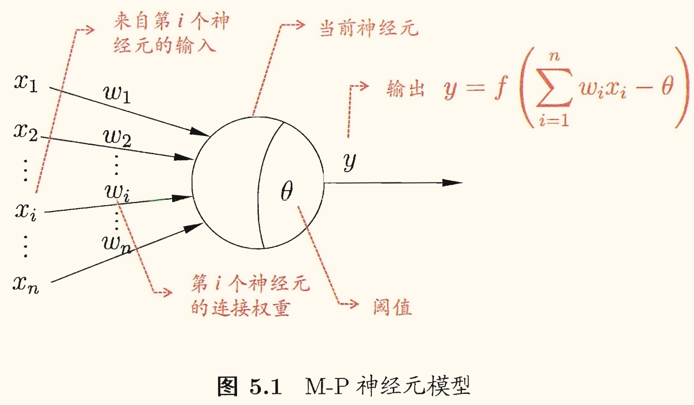

理想的激活函数是阶跃函数，将输入值映射为输出值 $0 \backslash 1$，分别对应于神经元抑制和兴奋。但是阶跃函数有不连续、不光滑等不太好的性质，常用 Sigmoid 函数作为激活函数。

常用的 Sigmoid 函数

$$
\operatorname{sigmoid}(x) = \dfrac{1}{1 + \e^{-x}}
$$

它把可能在较大范围内变化的输入值挤压到 $(0, 1)$ 输出值范围内，有时也被称为「挤压函数」（squashing function）。

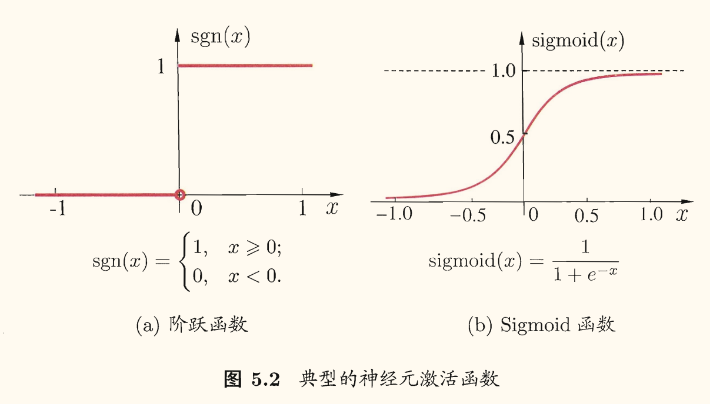

把许多个这样的神经元按一定的层次结构连接起来，就得到了神经网络。

计算机科学的角度看，只需将一个神经网络视为包含了许多参数的数学模型，这个模型是若干个函数（例如 $y_{j} = f\left(\sum_i w_i x_i - \theta_{j}\right)$）相互（嵌套）代入而得。

## 感知机与多层网络

### 感知机

**感知机**（perceptron）由两层神经元组成，如下图所示：

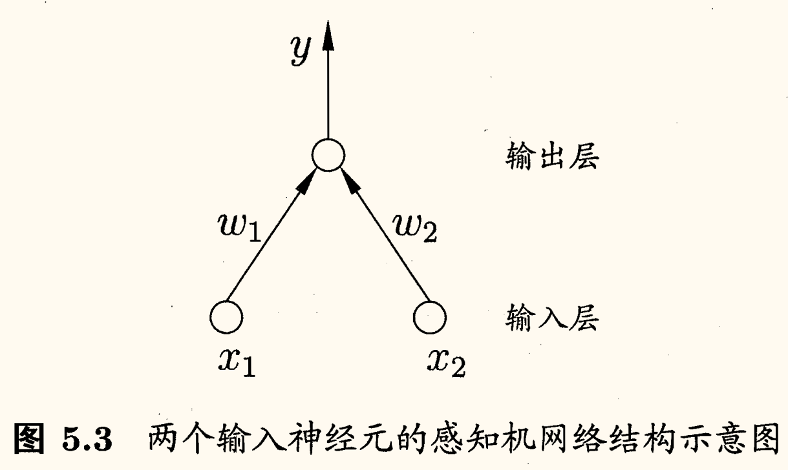

*输入层*接收外界输入信号后传递给输出层，*输出层*是 M-P 神经元，亦称「阈值逻辑单元」（threshold logic unit）。

感知机能容易地实现逻辑与、或、非等运算，注意到 $y = f(\sum_i w_i x_i - \theta)$，假设 $f$ 是阶跃函数，有
- **与**（$x_1 \land x_2$）：令 $w_1 = w_2 = 1, \theta = 2$，则 $y = f(x_1 + x_2 - 2)$，当且仅当 $x_1 = x_2 = 1$ 时 $y = 1$，否则 $y = 0$；
- **或**（$x_1 \lor x_2$）：令 $w_1 = w_2 = 1, \theta = 0.5$，则 $y = f(x_1 + x_2 - 0.5)$，当且仅当 $x_1 = 1$ 或 $x_2 = 1$ 时 $y = 1$，否则 $y = 0$；
- **非**（$\lnot x_1$）：令 $w_1 = -0.6, w_2 = 0, \theta = -0.5$，则 $y = f(-0.6x + 0.5)$，当 $x_1 = 1$ 时 $y = 0$，当 $x_1 = 0$ 时 $y = 1$。

更一般地，给定训练数据集，权重 $w_i$ 以及阈值 $\theta$ 可通过学习得到。阈值 $\theta$ 可看作一个固定输入为 $-1.0$ 的*哑结点*（dummy node）所对应的连接权重 $w_{n+1}$。这样，权重和阈值的学习就可统一为权重的学习。

对训练样例 $(\bm{x}, y)$，若当前感知机的输出为 $\hat{y}$，则感知机权重将这样调整

$$
\begin{aligned}
    w_i &\leftarrow w_i + \Delta w_i \\
    \Delta w_i &= \eta(y - \hat{y})x_i
\end{aligned}
$$

其中 $\eta \in (0, 1)$ 是**学习率**（learning rate）。

可以看出来，若感知机对样例 $(\bm{x}, y)$ 预测正确，即 $\hat{y} = y$，则感知机不发生变化，否则将根据错误的程度进行权重调整。

感知机只有输出层神经元进行激活函数处理，即只用有一层**功能神经元**（functional neuron），其学习能力非常有限。

上述与、或、非问题都是*线性可分*（linearly separable）的问题。

可证明若两类模式是线性可分的，即存在一个线性超平面能将它们分开，则感知机的学习过程一定会收敛（converge）而求得适当的权向量 $\bm{w} = (w_1; w_2; \dots; w_{n+1})$；否则感知机学习过程将会发生振荡（fluctuation），$\bm{w}$ 难以稳定下来，不能求得合适解。

例如感知机甚至无法解决异或这样简单的非线性可分问题。

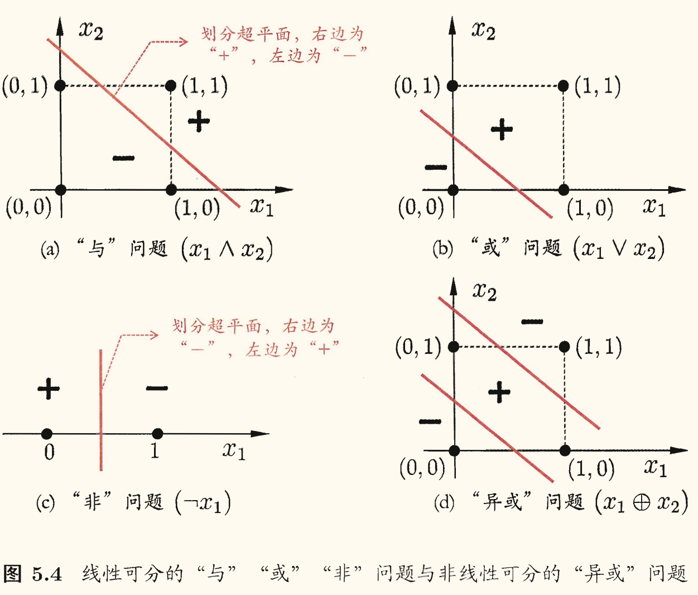

### 多层网络

要解决非线性可分问题，需考虑使用多层功能神经元。例如下图 中这个简单的两层感知机就能解决异或问题。

在下图 (a) 中，输出层与输入层之间的一层神经元，被称为**隐层**或**隐含层**（hidden layer），隐含层和输出层神经元都是拥有激活函数的功能神经元，亦称*功能单元*（functional unit）。因此这通常被称为「两层网络」或「单隐层网络」（避免歧义的名称）。

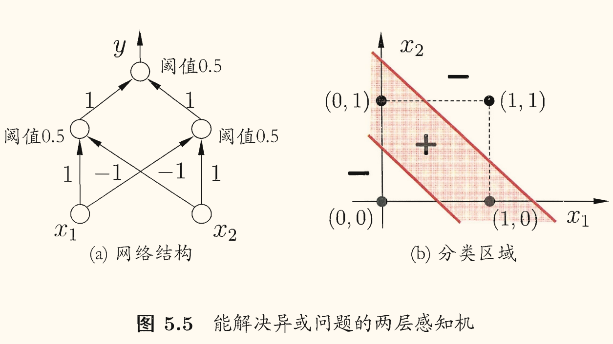

更一般的，常见的神经网络是形如下图所示的层级结构，每层神经元与下一层神经元全互连，神经元之间不存在同层连接，也不存在跨层连接。

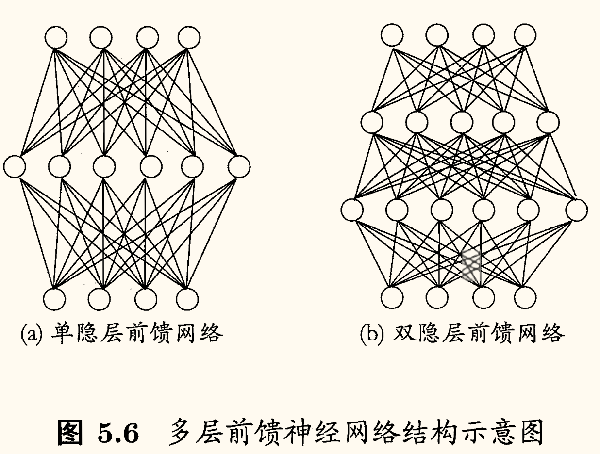

这样的神经网络结构通常称为「多层前馈神经网络」（multi-layer feedforward neural networks），其中输入层神经元接收外界输入，隐层与输出层神经元对信号进行加工，最终结果由输出层神经元输出。

换言之，输入层神经元仅是接受输入，不进行函数处理，隐层与输出层包含功能神经元。

<u>只需包含隐层，即可称为多层网络。</u>

神经网络的学习过程，就是根据训练数据来调整神经元之间的即神经元连接的权重。「连接权」（connection weight）以及每个功能神经元的阈值。

换言之，神经网络「学」到的东西，蕴涵在*连接权*与*阈值*中。

多层前馈网络有强大的表示能力，即「万有逼近性」。

只需包含足够多神经元的隐层，多层前馈网络就能以任意精度逼近任意复杂度的连续函数。但如何设置隐层神经元数仍是未决问题（open problem），实际常用「试错法」（trial-by-error）。

## 误差逆传播算法

### 标准 BP 算法

**误差逆传播**（error BackPropagation, BP）算法是迄今最成功的神经网络学习算法。

给定训练集 $D = \left\lbrace (\bm{x}_1, \bm{y}_1),\, (\bm{x}_2, \bm{y}_2),\, \cdots,\, (\bm{x}_m, \bm{y}_m) \right\rbrace,\, \bm{x}_i \in \R^d,\, \bm{y}_i \in \R^l$，即输入示例由 $d$ 个属性描述，输出 $l$ 维实值向量。

如下图所示，给出了一个拥有 $d$ 个输入神经元、$l$ 个输出神经元、$q$ 个隐层神经元的多层前馈神经网络：

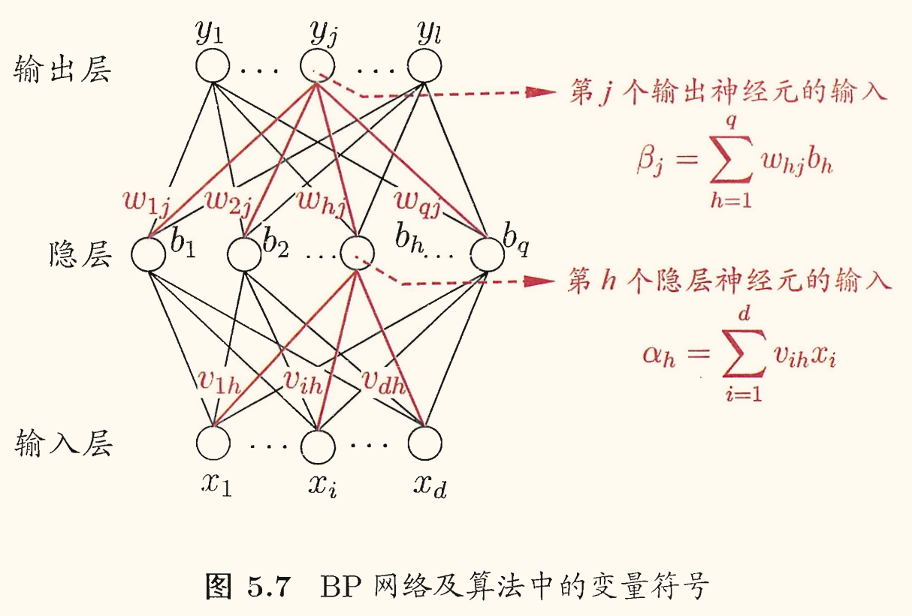

输出层第 $j$ 个神经元的阈值用 $\theta_{j}$ 表示，隐层第 $h$ 个神经元的阈值用 $\gamma_{h}$ 表示。

输入层第 $i$ 个神经元与隐层第 $h$ 个神经元之间的连接权为 $v_{ih}$，隐层第 $h$ 个神经元与输出层第 $j$ 个神经元之间的连接权为 $w_{hj}$。

记隐层第 $h$ 个神经元接收到的输入为 $\alpha_h = \sum_{i=1}^d v_{ih}x_i$，输出层第 $j$ 个神经元接收到的输入为 $\beta_j = \sum_{h=1}^q w_{hj}b_h$。其中 $b_h$ 为隐层第 $h$ 个神经元的输出。假设隐层和输出层神经元都使用 Sigmoid 函数作为激活函数。

对训练例 $(\bm{x}_{k}, \bm{y}_{k})$，假定神经网络的输出为 $\hat{\bm{y}}_{k} = (\hat{y}^{k}_1, \hat{y}^{k}_2, \cdots, \hat{y}^{k}_n)$，即

$$
\hat{y}^{k}_j = f(\beta_j - \theta_{j})
$$

则网络在训练例 $(\bm{x}_{k}, \bm{y}_{k})$ 上的均方误差为

$$
E_{k} = \dfrac{1}{2} \sum_{j=1}^l (\hat{y}^{k}_j - y^{k}_j)^2
$$

图所示的网络有 $(d + l + 1)q + l$ 个参数需确定：
- 输入层到隐层的 $d \times q$ 个权值
- 隐层到输出层的 $q \times l$ 个权值
- 隐层的 $q$ 个阈值
- 输出层的 $l$ 个阈值

BP 是一个迭代学习算法，在迭代的每一轮中采用广义的感知机学习规则对参数进行更新估计，，任意参数 $v$ 的更新估计式为

$$
v \leftarrow v + \Delta v
$$

以隐层到输出层的连接权 $w_{hj}$ 为例进行推导：

BP 算法基于「梯度下降」（gradient descent）策略，以目标的负梯度方向对参数进行调整，对上面的误差 $E_{k}$，给定学习率 $\eta$，有

$$
\Delta w_{hj} = - \eta \dfrac{\partial E_k}{\partial w_{hj}}
$$

注意到 $w_{hj}$ 先影响到第 $j$ 个输出层神经元的输入值 $\beta_{j}$，再影响到其输出值 $\hat{y}^{k}_j$，最终影响到误差 $E_{k}$，因此（链式法则）

$$
\dfrac{\partial E_{k}}{\partial w_{hj}} = \dfrac{\partial E_{k}}{\partial \hat{y}^{k}_j} \cdot \dfrac{\partial \hat{y}^{k}_j}{\partial \beta_j} \cdot \dfrac{\partial \beta_j}{\partial w_{hj}}
$$

根据 $\beta_{j}$ 的定义，有

$$
\dfrac{\partial \beta_{j}}{\partial w_{hj}} = b_h
$$

Sigmoid 函数有这样的性质：$f'(x) = f(x)(1 - f(x))$。

<!-- {{{ 简短的证明 -->

简短的证明

$$
\begin{aligned}
    f'(x) &= \left( \dfrac{1}{1 + \e^{-x}} \right)'\\
    &= \dfrac{\e^{-x}}{(1 + \e^{-x})^2}\\
    &= \dfrac{1}{1 + \e^{-x}} \cdot \dfrac{\e^{-x}}{1 + \e^{-x}}\\
    &= f(x)(1 - f(x))
\end{aligned}
$$

<!-- }}} -->

于是由上面的 $\hat{y}_{j}^{k}, E_{k}$，可得输出层神经元梯度项 $g_{j}$ 为

$$
\begin{aligned}
    g_{j} &= - \dfrac{\partial E_{k}}{\partial \hat{y}_{j}^{k}} \cdot \dfrac{\partial \hat{y}_{j}^{k}}{\partial \beta_{j}}\\ 
    &= - (\hat{y}_{j}^{k} - y_{j}^{k}) f'(\beta_{j} - \theta_{j})\\ 
    &= \hat{y}_{j}^{k} (1 - \hat{y}_{j}^{k}) (y_{j}^{k} - \hat{y}_{j}^{k})
\end{aligned}
$$

再将这个式子和 $\dfrac{\partial \beta_{j}}{\partial w_{hj}} = b_h$ 代入上面的链式法则，再代入 $\Delta w_{hj} = - \eta \dfrac{\partial E_{k}}{\partial w_{hj}}$，可得

$$
\Delta w_{hj} = \eta g_{j} b_h
$$

类似地有

$$
\begin{aligned}
    \Delta \theta_{j} &= - \eta g_{j}\\
    \Delta v_{ih} &= \eta e_h x_i\\
    \Delta \gamma_h &= - \eta e_h
\end{aligned}
$$

其中隐层神经元梯度项 $e_h$ 为

$$
\begin{aligned}
    e_h &= - \dfrac{\partial E_{k}}{\partial b_h} \cdot \dfrac{\partial b_h}{\partial \alpha_h}\\ 
    &= - \sum_{j=1}^l \dfrac{\partial E_{k}}{\partial \beta_j} \cdot \dfrac{\partial \beta_j}{\partial b_h} f'(\alpha_h - \gamma_h)\\
    &= \sum_{j=1}^l w_{hj} g_{j} f'(\alpha_h - \gamma_h)\\
    &= b_h(1 - b_h) \sum_{j=1}^l w_{hj} g_{j}
\end{aligned}
$$

<!-- {{{ 诺奖趣闻 -->

诺奖趣闻

10.9 上课继续记笔记。[2024 年诺贝尔物理学奖](https://www.nobelprize.org/prizes/physics/2024/press-release/)于 10.8 颁给了 John J. Hopfield 与 Geoffrey E. Hinton，以表彰他们在使用人工神经网络进行机器学习的基础性发现和发明（for foundational discoveries and inventions that enable machine learning with artificial neural networks）。

这两位大佬在课件上介绍神经网络历史中有出现，~~只是我没留意~~。

<!-- }}} -->

学习率 $\eta \in (0, 1)$ 控制着算法每一轮迭代中的更新步长。若太大则容易振荡，太小则收敛速度又会过慢。[^eta]

[^eta]: 常设置 $\eta = 0.1$。可以开始时设大一点，后面设小一点。

BP 算法工作流程：对于每个训练样例
1. 先将输入示例提供给输入层神经元
2. 逐层将信号前传，直到产生输出层的结果
3. 计算输出层的误差（4~5 行）
4. 再将误差逆向传播至隐层神经元（6 行）
5. 最后根据隐层神经元的误差来对连接权和阈值进行调整（7 行）
6. 迭代过程循环进行，直到达到某些停止条件，例如训练误差已达到一个很小的值，为止。

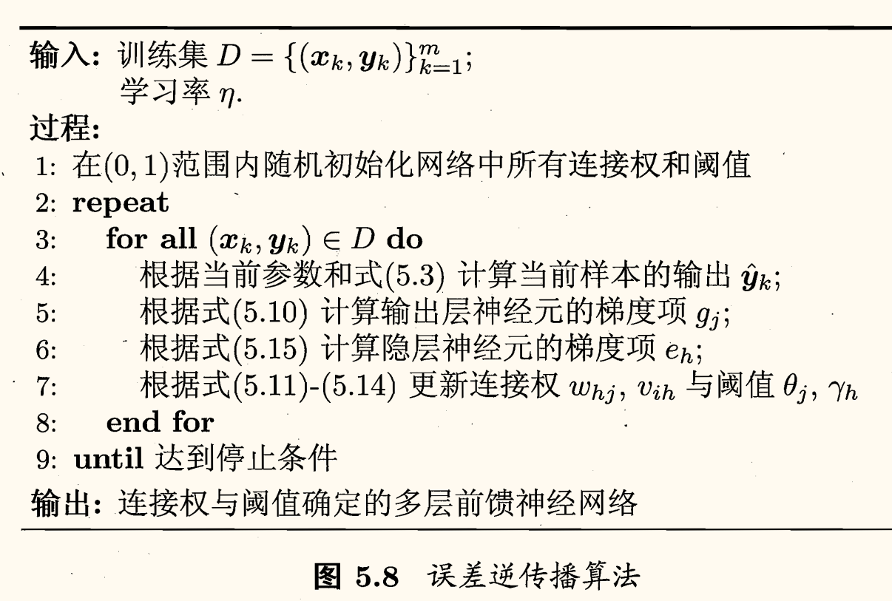

停止条件也与缓解 BP 过拟合的策略有关。

### 累积 BP 算法

BP 算法的目的是要最小化训练集 $D$ 上的累积误差 $E = \dfrac{1}{m}\displaystyle \sum_{k=1}^{m}E_{k}$。但是上面介绍的「标准 BP 算法」每次仅针对一个训练样例更新连接权和阈值。即上图中的算法更新规则是基于单个的 $E_{k}$ 推导而得。可类似推导出基于累计误差最小化的更新规则，就得到了**累积误差逆传播**（accumulated error backpropagation）算法。

标准 BP 算法每次更新只针对单个样例，参数更新得非常频
繁，而且对不同样例进行更新的效果可能出现「抵消」现象。因此，为了达到同样的累积误差极小点，标准 BP 算法往往需进行更多次数的迭代。

累积 BP 算法直接针对累积误差最小化，它在读取整个训练集 $D$ 一遍后才对参数进行更新，其参数更新的频率低得多。但在很多任务中，累积误差下降到一定程度之后，进一步下降会非常缓慢，这时标准 BP 往往会更快获得较好的解，尤其是在训练集。非常大时更明显。

总结为
- 标准 BP 算法
    - 每次针对单个训练样例更新权值与阈值
    - 参数更新频繁，不同样例可能抵消，需要多次迭代
- 累积 BP 算法
    - 优化目标是最小化整个训练集上的累积误差
    - 读取整个训练集一遍才对参数进行更新，参数更新频率较低

### 过拟合

正是由于其强大的表示能力，BP 神经网络经常遭遇过拟合，其训练误差持续降低，但测试误差却可能上升。

有两种策略常用来缓解 BP 网络的过拟合：
- **早停**（early stopping）
    - 若训练误差连续 $a$ 轮的变化小于某个阈值 $b$，则停止训练。
    - 使用验证集：若训练误差降低、验证误差升高，则停止训练。
- **正则化**（regularization）：基本思想是在误差目标函数中增加一个用于描述网络复杂度的部分（例如权值和阈值的平方和）。

对于正则化策略，仍令 $E_{k}$ 表示第 $k$ 个训练样例上的误差，$w_i$ 表示权值和阈值，则（累积）误差目标函数改变为

$$
E = \lambda \dfrac{1}{m} \sum_{k=1}^{m} E_{k} + (1-\lambda) \sum_i w_i^2
$$

其中 $\lambda \in (0, 1)$ 用于对经验误差与网络复杂度这两项进行折中。常通过交叉验证发进行估计。

## 全局最小与局部最小

若用 $E$ 表示神经网络在训练集上的误差，则它显然是关于连接权 $\bm{w}$ 和阈值 $\theta$ 的函数。此时，神经网络的训练过程可看作一个参数寻优过程，即在参数空间中，寻找一组最优参数使得 $E$ 最小。

有两种「最优」：**局部极小**（local minimum）和**全局最小**（global minimum）。

对 $\bm{w}^{*}$ 和 $\theta^{*}$，若存在 $\epsilon$ 使得

$$
\forall (\bm{w}; \theta) \in \left\lbrace (\bm{w}; \theta) \mid \|(w; \theta) - (\bm{w}^{*}; \theta^{*})\| < \epsilon \right\rbrace
$$

都有 $E(\bm{w}; \theta) \ge E(\bm{w}^{*}; \theta^{*})$，则称 $(\bm{w}^{*}; \theta^{*})$ 是局部极小解。

若对参数空间中的任意 $(\bm{w}; \theta)$，都有 $E(\bm{w}; \theta) \ge E(\bm{w}^{*}; \theta^{*})$，则称 $(\bm{w}^{*}; \theta^{*})$ 是全局最小解。

参数空间内梯度为零的点，只要其误差函数小于邻点的误差函数值，就是局部极小点。

基于梯度的搜索是使用最为广泛的参数寻优方法。在此类方法中，我们从某些初始解出发，迭代寻找最优参数值。每次迭代中，我们先计算误差函数在当前点的梯度，然后根据梯度确定搜索方向。

例如，由于负梯度方向是函数值下降最快的方向，因此「梯度下降法」就是沿着负梯度方向搜索最优解。

然而，如果误差函数具有多个局部极小，则不能保证找到的解是全局最小。对这种情形，我们称此时参数寻优「陷入了局部极小」。

现实任务中常用以下策略试图「跳出」局部极小，从而进一步接近全局最小（可参考《人工智能导论》课程教材）：
- 以多组不同参数值初始化多个神经网络，按标准方法训练后，取其中误差最小的解作为最终参数。
    - 这相当于从多个不同的初始点开始搜索，这样就
可能陷入不同的局部极小，从中进行选择有可能获得更接近全局最小的结果。
- **模拟退火**（simulated annealing）技术。
    - 模拟退火在每一步都以一定的概率接受比当前解更差的结果，从而有助于「跳出」局部极小。在每步迭代过程中，接受「次优解」的概率要随着时间的推移而逐渐降低，从而保证算法稳定。
    - 也会造成「跳出」全局最小。
- **随机梯度下降**
    - 随机梯度下降法在计算梯度时加入了随机因素。于是，即便陷入局部极小点，它计算出的梯度仍可能不为零，这样就有机会跳出局部极小继续搜索。

上述用于跳出局部极小的技术大多是启发式，理论上尚缺乏保障。

## 其他常见神经网络

### RBF 网络

**径向基函数**（Radial Basis Function, RBF）网络是一种单隐层前馈神经网络，它使用径向基函数作为隐层神经元激活函数，而输出层则是对隐层神经元输出的线性组合。

假定输入为 $d$ 维向量 $\bm{x}$，输出为实值，则 RBF 网络可表示为

$$
\varphi(\bm{x}) = \sum_{i=1}^{q} w_i \rho(\bm{x}, \bm{c}_i)
$$

其中 $q$ 为隐层神经元个数，$\bm{c}_{i}$ 和 $w_{i}$ 分别是第 $i$ 个隐层神经元所对应的中心和权重，$\rho\left(x, c_{i}\right)$ 是径向基函数[^rbf]，常用的高斯径向基函数形如

$$
\rho(\bm{x}, \bm{c}_{i}) = \exp\left( - \beta_i\|\bm{x} - \bm{c}_{i}\|^2 \right)
$$

[^rbf]: 这是某种沿径向对称的标量函数，通常定义为样本 $x$ 到数据中心 $c_{i}$ 之间欧氏距离的单调函数。

具有足够多隐层神经元的 RBF 网络能以任意精度逼近任意连续函数。

训练 RBF 网络过程：
1. 确定神经元中心 $\bm{c}_i$
    - 常用的方式包括随机采样、聚类等
2. 利用 BP 算法等确定参数 $w_i, \beta_i$

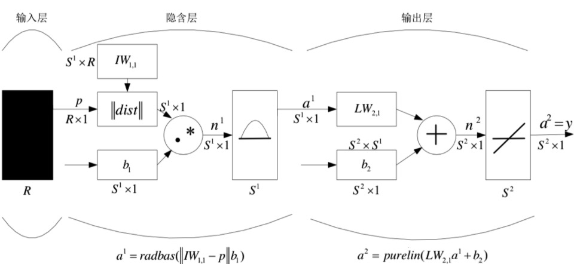

### ART 网络

**竞争型学习**（competitive learning）是神经网络中一种常用的无监督学习策略。在使用该策略时，网络的输出神经元相互竞争，每一时刻仅有一个竞争获胜的神经元被激活，其他神经元的状态被抑制。这种机制亦称「胜者通吃」（winner-take-all）原则。

**自适应共振理论**（Adaptive Resonance Theory, ART）网络是一种竞争型神经网络。该网络由比较层、识别层、识别
阈值和重置模块构成：
- 比较层负责接收输入样本，并将其传递给识别层神经元
- 识别层每个神经元对应一个模式类，神经元数目可在训练过程中动态增长以增加新的模式类

步骤：
1. 匹配
2. 比较
3. 搜索
4. 学习

在接收到比较层的输入信号后，识别层神经元之间相互竞争以产生获胜神经元。

竞争的最简单方式：计算输入向量与每个识别层神经元所对应的模式类的代表向量之间的距离，距离最小者胜。

获胜神经元将向其他识别层神经元发送信号，抑制其激活。若输入向量与获胜神经元所对应的代表向量之间的相似度
- 大于识别阈值：则当前输入样本将被归为该代表向量所属类别，同时，网络连接权将会更新，使得以后在接收到相似输入样本时该模式类会计算出更大的相似度，从而使该获胜神经元有更大可能获胜；
- 不大于识别阈值：则重置模块将在识别层增设一个新的神经元，其代表向量就设置为当前输入向量。

显然，识别阈值对 ART 网络的性能有重要影响：
- 识别阈值较高时：输入样本将会被分成比较多、比较精细的模式类；
- 识别阈值较低时：输入样本将会被分成比较少、比较粗略的模式类。

ART 比较好地缓解了竞争型学习中的「可塑性-稳定性窘境」（stability­plasticity dilemma），**可塑性**是（plasticity）指<u>神经网络要有学习新知识的能力</u>，而**稳定性**（stability）则是指<u>神经网络在学习新知识时要保持对旧知识的记忆</u>。

这就使得 ART 网络具有一个很重要的优点：可进行增量学习（incremental learning）[^incremental_learning]或在线学习（online learning）[^online_learning]。

[^incremental_learning]: **增量学习**是指在学得模型后，再接收到训练样例时，仅需根据新样例对模型进行更新，不必重新训练整个模型，并且先前学得的有效信息不会被「冲掉」。
[^online_learning]: **在线学习**是指每获得一个新样本就进行一次模型更新。显然，在线学习是增量学习的特例，而增量学习可视为「批模式」（batch-mode）的在线学习。

### SOM 网络

**自组织映射**（Self-Organizing Map, SOM）网络是一种竞争学习型的无监督神经网络，它能将高维输入数据映射到低维空间（通常为二维），同时保持输入数据在高维空间的拓扑结构，即将高维空间中相似的样本点映射到网络输出层中的邻近神经元。

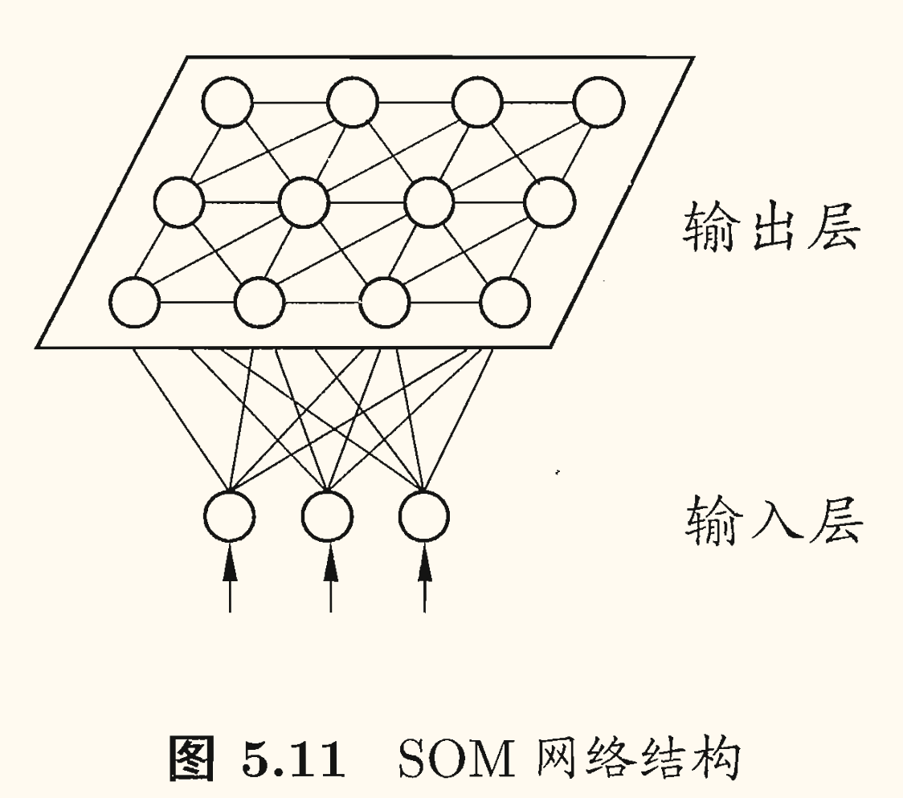

如图所示，SOM 网络中的输出层神经元以矩阵方式排列在二维空间中，每个神经元都拥有一个权向量，网络在接收输入向量后，将会确定输出层获胜神经元，它决定了该输入向量在低维空间中的位置。

SOM 的训练目标就是为每个输出层神经元找到合适的权向量，已达到保持拓扑结构的目的。

SOM 的训练过程：
1. 在接收到一个训练样本后，每个输出层神经元会
计算该样本与自身携带的权向量之间的距离，距离最近的神经元成为竞争获胜者，称为*最佳匹配单元*（best matching unit）。
    - 网络接受输入样本后，将会确定输出层的「获胜」神经元（优胜邻域）。
2. 最佳匹配单元及其邻近神经元的权向量将被调整，以使得这些权向量与当前输入样本的距离缩小。
    - 获胜神经元的权向量向当前输入样本移动。
3. 上述过程不断迭代，直至收敛。

### 级联相关网络

一般的神经网络模型通常假定网络结构是事先固定的，训练的目的是利用训练样本来确定合适的连接权、阈值等参数。与此不同，*结构自适应网络*则将网络结构也当作学习的目标之一，并希望能在训练过程中找到最符合数据特点的网络结构。

**级联相关**（Cascade-Correlation）网络是结构自适应网络的重要代表。

级联相关网络有两个主要成分：「级联」和「相关」。

「级联」是指建立层次连接的层级结构。在开始训练时，网络只有输入层和输出层，处于最小拓扑结构；随着训练的进行，新的隐层神经元逐渐加入，从而创建起层级结构。当新的隐层神经元加入时，其输入端连接权值是冻结固定的。

「相关」是指通过最大化新神经元的输出与网络误差之间的相关性（correlation）来训练相关的参数。

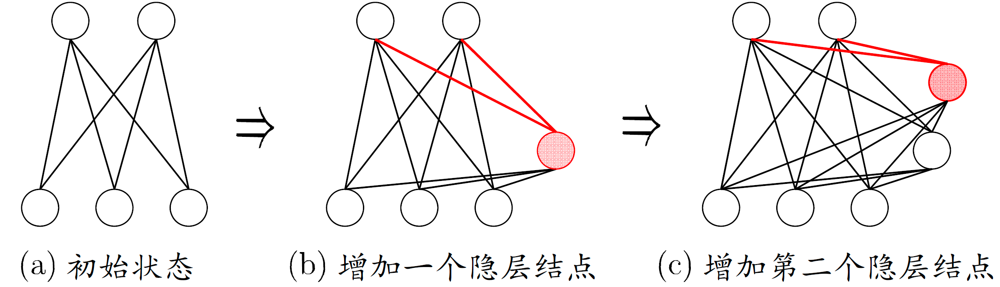

与一般的前馈神经网络相比，级联相关网络无需设置网络层数、隐层神经元数目，且训练速度较快，但其在数据较小时易陷入过拟合.

### [Hopfield 网络](https://en.wikipedia.org/wiki/Hopfield_network)

这是 2024 年诺贝尔物理学奖的成果。

根据神经网络运行过程中的信息流向，可分为前馈式和反馈式两种基本类型。

John J. Hopfield 1982 年提出了一种单层反馈神经网络，后来人们将这种反馈网络称为 Hopfield 网络。

Hopfield 是一种反馈性神经网络，包括离散型 Hopfield 网络（DHNN）和连续型 Hopfield 网络（CHNN）。

神经元的输出称为网络的「状态」。

转移函数

$$
x_i = \operatorname{sign}(\mathrm{net}_i) = \begin{cases}
    1, & \mathrm{net}_i \ge 0\\
    -1, & \mathrm{net}_i < 0
\end{cases}
$$

反馈网络稳定时，每个神经元的状态都不再改变，此时的<u>稳定状态就是网络输出</u>。

网络的稳定性由吸引子和**能量函数**（energy function）来描述。

Hopfield 网络主要用于存储和检索记忆。

### Elman 网络

与前馈神经网络不同，「递归神经网络」（recurrent neural networks）允许网络中出现环形结构，从而可让一些神经元的输出反馈回来作为输入信号。这样的结构与信息反馈过程，使 得网络在 $t$ 时刻的输出状态不仅与 $t$ 时刻的输入有关，还 与 $t - 1$ 时刻的网络状态有关，从而能处理与时间有关的动态变化。

Elman 网络是最常用的递归神经网络之一。

它的结构与多层前馈网络很相似，但隐层神经元的输出被反馈回来，与下一时刻输入层神经元提供的信号一起，作为隐层神经元在下一时刻的输入。隐层神经元通常采用 Sigmoid 激活函数，而网络的训练则常通过推广的 BP 算法进行。

### Boltzmann 机

神经网络中有一类模型是为网络状态定义一个「能量」（energy），能量最小化时网络达到理想状态，而网络的训练就是在最小化这个能量函数。

Boltzmann 机就是一种「基于能量」（energy-based）的模型。其神经元分为两层：
- **显层**用于表示数据的输入与输出；
- **隐层**则被理解为数据的内在表达。

Boltzmann 机中的神经元都是布尔型的，只能取 $\left\lbrace 0, 1 \right\rbrace$，状态 1 表示激活，状态 0 表示抑制。

令向量 $\bm{s} \in \left\lbrace 0, 1 \right\rbrace^n$ 表示 $n$ 个神经元的状态，$w_{ij}$ 表示神经元 $i, j$ 之间的连接权，$\theta_i$ 表示神经元 $i$ 的阈值，则状态函数 $\bm{s}$ 所对应的 Boltzmann 机能量定义为

$$
E(\bm{s}) = - \sum_{i=1}^{n-1} \sum_{j=i+1}^{n} w_{ij}s_i s_j - \sum_{i=1}^{n} \theta_i s_i
$$

其中 $w_{ij}$ 表示两个神经元之间的连接权值，$\theta_i$ 表示神经元 $i$ 的阈值。

网络中的神经元以任意不依赖与输入值的顺序进行更新，则网络最终将达到 *Boltzmann 分布*，此时状态向量出现的概率将仅由其能量与所有可能状态向量的能量确定：
$$
P(\bm{s}) = \dfrac{\exp(-E(\bm{s}))}{\sum_{\bm{t}}\exp(-E(\bm{t}))}
$$

!!! memo ""
    待补充

## 深度学习

理论上来说，参数越多的模型复杂度越高、 「容量」（capacity）越大，这意味着它能完成更复杂的学习任务。但一般情形下，复杂模型的训练效率低，易陷入过拟合，因此难以受到人们青睐。

而随着云计算、大数据时代的到来，计算能力的大幅提高可缓解训练低效性，训练数据的大幅增加则可降低过拟合风险, 因此，以 「深度学习」（deep learning）为代表的复杂模型开始受到人们的关注。

典型的深度学习模型就是很深层的神经网络。对神经网络模型，提高容量的一个简单办法是增加隐层的数目。隐层多了，相应的神经元连接权、阈值等参数就会更多。

从增加模型复杂度的角度来看，增加隐层的数目比增加隐层神经元的数目更有效，因为增加隐层数不仅增加了拥有激活函数的神经元数目，还增加了激活函数嵌套的层数。

然而，多隐层神经网络难以直接用经典算法（例如标准 BP 算法）进行训练，因为误差在多隐层内逆传播时，往往会「发散」（diverge）而不能收敛到稳定状态。

重要诀窍（tricks）[^tricks]：
- 无监督逐层训练（预训练 + 微调）
    - 预训练：监督逐层训练，每次训练一层隐结点
    - 微调：预训练全部完成后，对全网络进行微调训练
    - 可视为将大量参数分组，对每组先找到较好的局部配置，再全局寻优
- 权共享（weight-sharing）
    - 一组神经元使用相同的连接权值
    - 减少需优化的参数
- Dropout
    - 在每轮训练时随机选择一些参数令其不被更新
    - 减低 Rademacher 复杂度
- ReLU (Rectified Linear Units)
    - 将 Sigmoid 激活函数修改为修正线性函数 $f(x) = \max(0, x)$
    - 求导容易；缓解梯度消失现象
- 交叉熵（cross-entropy）
    - BP 算法中以交叉熵 $-\dfrac{1}{m}\displaystyle \sum_{i=1}^{m}y_i \log \hat{y}_i$ 代替均方误差 $E = \dfrac{1}{m}\displaystyle \sum_{i=1}^{m}(y_i - \hat{y}_i)^2$
    - 更能体现分类任务的特性

[^tricks]: 尚有许多 tricks 缺乏关于奏效原因的合理猜测。

- 特征工程（feature engineering）：特征工程由人类专家根据现实任务来设计，「特征提取」和「识别」是单独的两个阶段。
- 特征学习（feature learning）：特征学习通过深度学习技术，自动产生有益于分类的特征，是一个端到端的学习框架。

## 补充内容

上面提及的神经网络基本都是上个世纪的产物，下面是一些 21 世纪的神经网络模型：
- CNN 卷积神经网络
- RNN 循环神经网络
- GNN 图神经网络
- Transformer 自注意力神经网络
