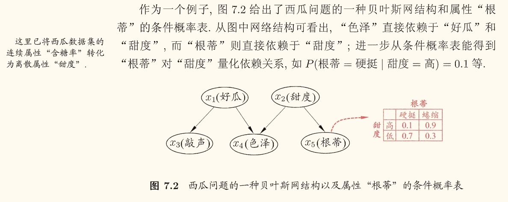
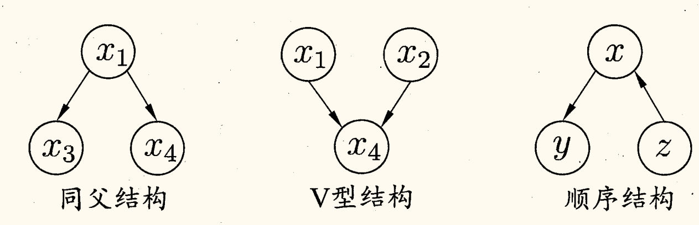
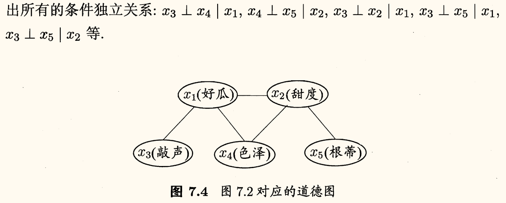
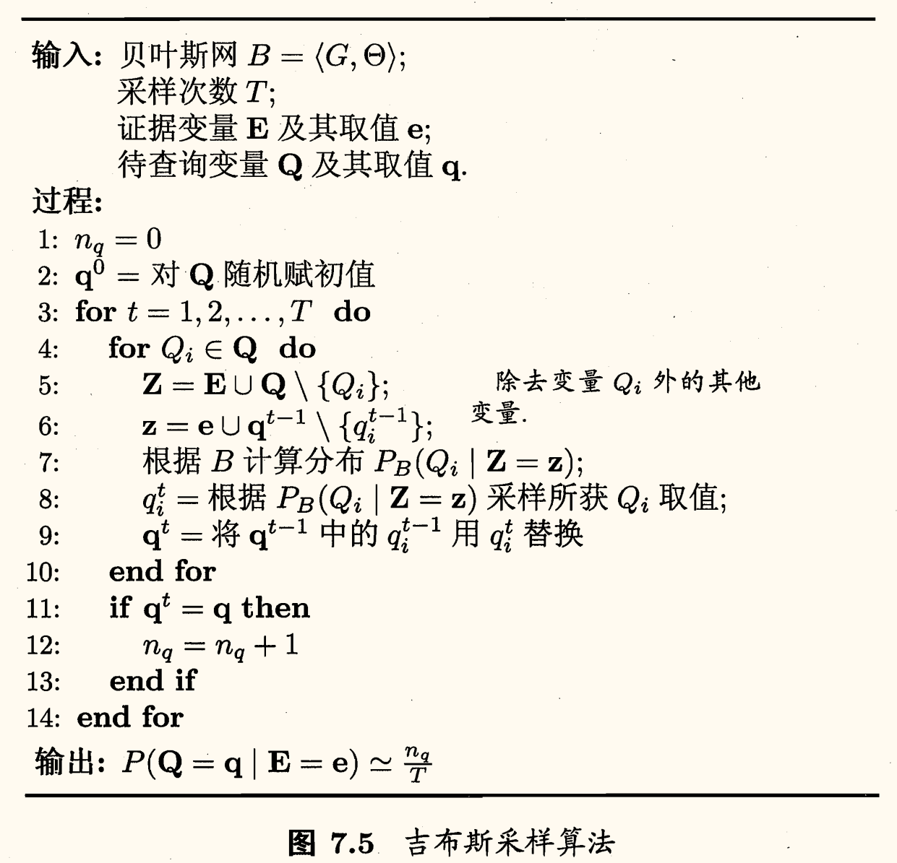

## 贝叶斯决策论

「贝叶斯决策论」（Bayesian decision theory）是概率框架下实施决策的基本方法。对分类任务来说，贝叶斯决策论考虑如何基于这些概率和误判损失来选择最优的类别标记。

下面以多分类任务为例来解释其基本原理。

假设有 $N$ 中可能的类别标记，即 $\mathcal{Y} = \left\lbrace c_1, c_2, \cdots, c_N \right\rbrace$，$\lambda_{ij}$ 是将一个真实标记为 $c_{j}$ 的样本误分类为 $c_i$ 所产生的损失。基于后验概率 $P(c_{i} \mid \bm{x})$ 可获得将样本 $\bm{x}$ 分类为 $c_i$ 所产生的期望损失（expected loss），即在样本 $\bm{x}$ 上的「条件风险」（conditional risk）：
$$
R(c_i \mid \bm{x}) = \sum_{j=1}^{N} \lambda_{ij} P(c_{j} \mid \bm{x})
$$

要寻找一个判定准则 $h\colon \mathcal{X} \to \mathcal{Y}$ 以最小化总体风险
$$
R(h) = \mathbb{E}_x \left[ R(h(\bm{x}) \mid \bm{x}) \right] 
$$

对每个样本 $\bm{x}$，若 $h$ 能最小化条件风险 $R(h(\bm{x}) \mid \bm{x})$，则总体风险 $R(h)$ 也将被最小化。这就产生了「贝叶斯判定准则」（Bayes decision rule）：为最小化总体风险，只需在每个样本上选择那个能使条件风险 $R(c_i \mid \bm{x})$ 最小的类别标记，即
$$
\begin{equation}
    h^{*}(\bm{x}) = \argmin_{c \in \mathcal{Y}} R(c \mid \bm{x})\label{1}
\end{equation}
$$

此时，$h^{*}$ 称为「贝叶斯最优分类器」（Bayes optimal classifier），与之对应的总体风险 $R(h^{*})$ 称为「贝叶斯风险」（Bayes risk）。$1 - R(h^{*})$ 反映了分类器所能达到的最好性能，即通过机器学习所能产生的模型精度的理论上限。

要用贝叶斯判定准则来最小化决策风险，首先要获得后验概率 $P(c \mid \bm{x})$，但现实任务中通常难以获得。从这个角度来看，机器学习所要实现的是基于有限的训练样本，尽可能准确地估计出后验概率。

有两种基本策略：
- **判别式模型**（discriminative models）：给定 $\bm{x}$，直接建模 $P(c \mid \bm{x})$ 来预测 $c$。
    - 包括前面介绍的决策树、BP 神经网络、支持向量机等。
- **生成式模型**（generative models）：先对联合分布 $P(\bm{x}, c)$ 建模，再由此获得 $P(c \mid \bm{x})$。
    - 代表有贝叶斯分类器[^bayes_classifier]。

[^bayes_classifier]: 贝叶斯分类器不等于贝叶斯学习（Bayesian learning）。

对于生成式模型，要考虑
$$
P(c \mid \bm{x}) = \dfrac{P(\bm{x}, c)}{P(\bm{x})}
$$

贝叶斯定理可写为
$$
\begin{equation}
    P(c \mid \bm{x}) = \dfrac{P(\bm{x} \mid c) P(c)}{P(\bm{x})}\label{2}
\end{equation}
$$

其中 $P(c)$ 是类「先验」（prior）概率；$P(\bm{x} \mid c)$ 是样本 $\bm{x}$ 相对于类标记 $c$ 的「类条件概率」（class-conditional probability），或称为「似然」（likelihood）；$P(\bm{x})$ 是用于归一化的「证据」（evidence）因子。

对给定样本 $\bm{x}$，证据因子 $P(\bm{x})$ 与类标记无关，因此估计 $P(c \mid \bm{x})$ 的问题就转化为如何基于训练数据 $D$ 来估计先验概率 $P(c)$ 和似然 $P(\bm{x} \mid c)$。

类先验概率 $P(c)$ 表达了样本空间中各类样本所占的比例，根据大数定律，当训练集包含充足的独立同分布样本时，$P(c)$ 可通过各类样本出现的频率来进行估计。

对类条件概率 $P(\bm{x} \mid c)$ 来说，由于它涉及关于 $\bm{x}$ 的所有属性的联合概率，直接根据样本出现的频率来估计将会遇到严重的困难：例如假设样本的 $d$ 个属性都是二值的，则样本空间将有 $2^d$ 种可能的取值，现实任务中这个值往往远大于训练样本 $m$，即很多样本取值在训练集中根本没出现。这种情况用频率估计 $P(\bm{x} \mid c)$ 显然不可行。

## 极大似然估计

估计类条件概率的一种常用策略是先假定其具有某种确定的概率分布形式，再基于训练样本对概率分布的参数进行估计。

具体地，记关于类别 $c$ 的类条件概率为 $P(\bm{x} \mid c)$，假设其具有确定的形式并被参数向量 $\bm{\theta}_c$ 唯一确定。即要利用训练集 $D$ 估计参数 $\bm{\theta}_c$。为了明确起见，记 $P(\bm{x} \mid c)$ 为 $p(\bm{x} \mid \bm{\theta}_c)$。

概率模型的训练过程就是「参数估计」（parameter estimation）过程。统计学界两个学派提供了不同的解决方案：
- **频率主义学派**（Frequentist）：参数虽然未知，但却是客观存在的固定值，因此可通过优化似然函数等准则来确定参数值。
- **贝叶斯学派**（Bayesian）：参数是未观察到的随机变量，其本身也可有分布，因此可假定参数服从一个先验分布，然后基于观测的数据来计算参数的后验分布。

本节介绍源自频率主义学派的**最大似然估计**（Maximum Likelihood Estimation，MLE, 极大似然法），这是根据数据采样来估计概率分布参数的经典方法。

令 $D_c$ 表示训练集 $D$ 中第 $c$ 类样本组成的集合，假设这些样本是独立同分布的，则参数 $\bm{\theta}_c$ 对于数据集 $D_c$ 的似然是
$$
P(D_c \mid \bm{\theta}_c) = \prod_{\bm{x} \in D_c} p(\bm{x} \mid \bm{\theta}_c)
$$

对 $\bm{\theta}_c$ 进行最大似然估计，就是去寻找能最大化似然 $P(D_c \mid \bm{\theta}_c)$ 的参数值 $\bm{\theta}_c$。

直观上来看，最大似然估计是试图在 $\bm{\theta}_c$ 所有可能的取值中，找到一个能使数据出现的「可能性」最大的值。

上式的连乘容易造成下溢，通常将似然函数取对数，得到「对数似然」（log-likelihood）：
$$
\begin{aligned}
    LL(\bm{\theta}_c) &= \log P(D_c \mid \bm{\theta}_c) \\ 
    &= \sum_{\bm{x} \in D_c} \log p(\bm{x} \mid \bm{\theta}_c)
\end{aligned}
$$

此时参数 $\bm{\theta}_c$ 的极大似然估计 $\hat{\bm{\theta}}_c$ 为
$$
\hat{\bm{\theta}}_c = \argmax_{\bm{\theta}_c} LL(\bm{\theta}_c)
$$

在连续属性情形下，假设概率密度函数 $p(\bm{x} \mid c) \sim \mathcal{N}(\bm{\mu}_c, \bm{\sigma}_c^2)$，则参数 $\bm{\mu}_c$ 和 $\bm{\sigma}_c^2$ 的极大似然估计为
$$
\begin{aligned}
    \hat{\bm{\mu}}_c &= \dfrac{1}{|D_c|} \sum_{\bm{x} \in D_c} \bm{x} \\ 
    \hat{\bm{\sigma}}_c^2 &= \dfrac{1}{|D_c|} \sum_{\bm{x} \in D_c} (\bm{x} - \hat{\bm{\mu}}_c) (\bm{x} - \hat{\bm{\mu}}_c)^\intercal
\end{aligned}
$$

这种参数化方法虽然能使类条件概率估计变得相对简单，但估计结果的准确性严重依赖于所假设的概率分布形式是否符合潜在的真实数据分布。

!!! memo ""
    【待补充课件】

## 朴素贝叶斯分类器

基于贝叶斯公式估计后验概率 $P(c \mid \bm{x})$ 的主要困难在于，类条件概率 $P(\bm{x} \mid c)$ 是所有属性上的联合概率，难以从有限的训练样本直接估计而得。

为了避开这个障碍，**朴素贝叶斯分类器**（naïve Bayes classifier）采用了「属性条件独立性假设」（attribute conditional independence assumption）：对已知类别，假设所有属性相互独立。换言之，假设每个属性独立地对分类结果发生影响。

在这个假设下，贝叶斯公式 $\eqref{2}$ 可重写为
$$
\begin{equation}
    P(c \mid \bm{x}) = \dfrac{P(c)P(\bm{x} \mid c)}{P(\bm{x})} = \dfrac{P(c)}{P(\bm{x})} \prod_{i=1}^{d} P(x_i \mid c)\label{3}
\end{equation}
$$
其中 $d$ 为属性数目，$x_i$ 是样本 $\bm{x}$ 的第 $i$ 个属性的取值。

对于所有类别来说 $P(\bm{x})$ 相同，基于 $\eqref{1}$ 的贝叶斯判定准则有
$$
\begin{equation}
    h_{\text{nb}}(\bm{x}) = \argmax_{c \in \mathcal{Y}} P(c) \prod_{i=1}^{d} P(x_i \mid c)\label{4}
\end{equation}
$$

朴素贝叶斯分类器的训练过程就是基于训练集 $D$ 来估计类先验概率 $P(c)$，并为每个属性估计条件概率 $P(x_i \mid c)$。

令 $D_c$ 表示训练集 $D$ 中第 $c$ 类样本组成的集合，若有充足的独立同分布样本，则可估计出类先验概率
$$
\begin{equation}
    P(c) = \dfrac{|D_c|}{|D|}\label{5}
\end{equation}
$$

对于离散属性而言，令 $D_{c, x_i}$ 表示 $D_c$ 中第 $i$ 个属性上取值为 $x_i$ 的样本组成的集合，则条件概率 $P(x_i \mid c)$ 可估计为
$$
\begin{equation}
    P(x_i \mid c) = \dfrac{|D_{c, x_i}|}{|D_c|}\label{6}
\end{equation}
$$

对于连续属性可考虑概率密度函数，假定 $p(x_i \mid c) \sim \mathcal{N}(\mu_{c, i}, \sigma_{c, i}^2)$，其中 $\mu_{c, i},\, \sigma_{c, i}^2$ 分别是第 $c$ 类样本在第 $i$ 个属性上取值的均值和方差，则有
$$
p(x_i \mid c) = \dfrac{1}{\sqrt{2\pi}\sigma_{c, i}} \exp\left( -\dfrac{(x_i - \mu_{c, i})^2}{2\sigma_{c, i}^2} \right)
$$

若某个属性值在训练集中没有与某个类同时出现过，直接基于 $\eqref{3}$ 进行概率估计，再进行判别将会出现问题。

为了避免其他属性携带的信息被训练集中未出现的属性「抹去」，在估计概率值时通常要进行「平滑」（smoothing）处理，常用的方法有**拉普拉斯修正**（Laplace correction）。

具体来说，令 $N$ 表示训练集 $D$ 中可能的类别数，$N_i$ 表示第 $i$ 个属性可能的取值，则 $\eqref{5}, \eqref{6}$ 分别修正为
$$
\begin{equation}
    \begin{aligned}
        P(c) &= \dfrac{|D_c| + 1}{|D| + N} \\
        P(x_i \mid c) &= \dfrac{|D_{c, x_i}| + 1}{|D_c| + N_i}
    \end{aligned}\label{7}
\end{equation}
$$

拉普拉斯修正避免了因训练集样本不充分而导致概率估值为零的问题，并且在训练集变大时，修正过程所引入的先验（prior）的影响也会逐渐变得可忽略，使得估值渐趋向于实际概率值。

在现实任务中朴素贝叶斯分类器有多种使用方式：
- 若任务对预测速度要求较高，则对给定训练集，可将朴素贝叶斯分类器涉及的所有概率估值事先计算好存储起来，这样在进行预测时只需「查表」即可进行判别；
- 若任务数据更替频繁，则可采用「懒惰学习」（lazy learning）方式，先不进行任何训练，待收到预测请求时再根据当前数据集进行概率估值；
- 若数据不断增加，则可在现有估值基础上，仅对新增样本的属性值所涉及的概率估值进行计数修正即可实现增量学习。

## 半朴素贝叶斯分类器

### ODE

为降低 $\eqref{2}$ 中估计后验概率 $P(c \mid \bm{x})$ 的困难，朴素贝叶斯分类器采用了属性条件独立性假设。但这个假设在现实任务中往往很难成立。

于是人们尝试对属性条件独立性假设进行一定程度的放松，由此产生了一类称为「半朴素贝叶斯分类器」（semi-naïve Bayes classifier）的学习方法。

半朴素贝叶斯分类器的基本想法是<u>适当考虑一部分属性间的相互依赖信息</u>，从而既不需进行完全联合概率计算，又不至于彻底忽略了比较强的属性依赖关系。

「独依赖估计」（One-Dependent Estimator, ODE）是半朴素贝叶斯分类器最常用的一种策略。顾名思议，所谓「独依赖」就是假设每个属性在类别之外最多仅依赖于一个其他属性，即
$$
P(c \mid \bm{x}) \propto P(c) \prod_{i=1}^{d} P(x_i \mid c, pa_i)
$$

其中 $pa_i$ 为属性 $x_i$ 所依赖的属性，称为 $x_i$ 的*父属性*。此时，对每个属性 $x_i$，若其父属性 $pa_i$ 已知，则可类似 $\eqref{7}$ 估计概率值 $P(x_i \mid c, pa_i)$。

于是问题的关键转化为如何确定每个属性的父属性：
1. SPODE (Super-Parent ODE)：假设所有属性都依赖于同一个属性「超父」（super-parent），然后通过交叉验证等模型选择方法来确定超父属性。
    - 下图中 $x_1$ 是超父属性。
2. TAN (Tree Augmented naïve Bayes)：TAN 在最大带权生成树（maximum weighted spanning tree）算法基础上，通过以下步骤将属性间的依赖关系约简为如下图所示的树形结构：
    1. 计算任意两个属性之间的*条件互信息*（conditional mutual information）
    $$
    I(x_i, x_j \mid y) = \sum_{x_i, x_j} \sum_{c \in \mathcal{Y}} P(x_i, x_j, c) \log \dfrac{P(x_i, x_j \mid c)}{P(x_i \mid c) P(x_j \mid c)}
    $$
    2. 以属性为结点构建完全图，任意两个结点之间的边权为 $I(x_i, x_j \mid y)$；
    3. 构建此完全图的最大带权生成树，挑选根变量，将边置为有向；
    4. 加入类别节点 $y$，增加从 $y$ 到每个属性的有向边。

条件互信息 $I(x_i, x_j \mid y)$ 刻画了属性 $x_i, x_{j}$ 在已知类别情况下的相关性。TAN 通过最大生成树算法，实际上仅保留了强相关属性之间的依赖性。

### AODE

AODE (Averaged One-Dependent Estimator) 是一种
基于集成学习机制、更为强大的独依赖分类器。

与 SPODE 通过模型选择确定超父属性不同，AODE 尝试将每个属性作为超父来构建 SPODE，然后将那些具有足够训练数据支撑的 SPODE 集成起来作为最终结果，即
$$
P(c \mid \bm{x}) \propto \sum_{\substack{i=1\\ |D_{x_i}|\ge m'}}^{d} P(c, x_i) \prod_{j=1}^{d} P(x_j \mid c, x_j)
$$
其中 $D_{x_i}$ 是在第 $i$ 个属性上取值为 $x_i$ 的样本集合，$m'$ 是阈值常数（默认设为 30）。

AODE 需估计 $P(c, x_i)$ 与 $P(x_{j} \mid c, x_i)$，类似 $\eqref{7}$ 有
$$
\begin{aligned}
    \hat{P}(c, x_i) &= \dfrac{|D_{c, x_i}| + 1}{|D| + N_i} \\ 
    \hat{P}(x_j \mid c, x_i) &= \dfrac{|D_{c, x_i, x_j}| + 1}{|D_{c, x_i}| + N_j}
\end{aligned}
$$
其中 $N_i$ 是第 $i$ 个属性可能的取值数，$D_{c, x_i}$ 是类别为 $c$ 且在第 $i$ 个属性上取值为 $x_i$ 的样本集合，$D_{c, x_i, x_j}$ 是类别为 $c$ 且在第 $i$ 个属性上取值为 $x_i$ 且在第 $j$ 个属性上取值为 $x_j$ 的样本集合。

除了 ODE，还可以通过考虑属性间的高阶依赖来进一步提升泛化性能。即将 $pa_i$ 换成包含 $k$ 个属性的集合 $\mathbf{pa}_i$，从而将 ODE 拓展为 kDE。

需要注意的是，随着 $k$ 的增加，准确估计概率 $P(x_i \mid y, \mathbf{pa}_i)$ 所需的样本数量将以指数级增长。因此，若训练数据非常充分，泛化性能有可能提升；但在有限样本条件下，则又陷入估计高阶联合概率的泥沼。

## 贝叶斯网络

**贝叶斯网络**（Bayesian newtwork），亦称「信念网」（belief network），借助*有向无环图*（Directed Acyclic Graph, DAG）来刻画属性之间的依赖关系，并使用「条件概率表」（Conditional Probability Table, CPT）来描述属性之间的联合概率分布。

> 为了简化讨论，本节假定所有属性均为离散型。对于连续属性，条件概率表可推广为条件概率密度函数。

一个贝叶斯网络 $B = \left\langle G, \Theta \right\rangle$ 由两部分组成：
1. 结构 $G$：有向无环图，结点表示属性，边表示属性间的依赖关系；
    - 若两个属性有直接依赖关系，则它们由一条边连接起来。
2. 参数 $\Theta$：定量描述依赖关系。
    - 假设属性 $x_i$，在 $G$ 中的父结点集为 $\pi_i$，则 $\Theta$ 包含了每个属性的条件概率表 $\theta_{x_i \mid \pi_i} = P_B(x_i \mid \pi_i)$。

### 结构

给定父结点集，贝叶斯网络假设每个属性与它的非后裔属性独立，于是 $B = \left\langle G, \Theta \right\rangle$ 将属性 $\left\lbrace x_i \right\rbrace_{i=1}^d$ 的联合概率分布定义为
$$
\begin{equation}
    P_B(\bm{x}) = \prod_{i=1}^{d} P_B(x_i \mid \pi_i) = \prod_{i=1}^d \theta_{x_i \mid \pi_i} \label{8}
\end{equation}
$$

例如上图例子对应的联合概率分布定义为
$$
P(x_1, \dots, x_5) = P(x_1) P(x_2) P(x_3 \mid x_1) P(x_4 \mid x_1, x_2) P(x_5 \mid x_2)
$$
$x_3, x_4$ 在给定 $x_1$ 的取值时独立，$x_4, x_5$ 在给定 $x_2$ 的取值时独立，简记为 $x_3 \perp x_4 \mid x_1,\, x_4 \perp x_5 \mid x_2$。

下图显示了贝叶斯网络中三个变量之间的典型依赖关系：

在「同父」（common parent）结构中，给定父结点 $x_1$ 的取值，则 $x_3, x_4$ 条件独立。

在「顺序」结构中，给定 $x$ 的值，$y, z$ 条件独立。

在「V 型」结构（亦称「冲撞」结构），给定子结点 $x_4$ 的取值，$x_1, x_2$ 必不独立。但若 $x_4$ 的取值完全未知，则 $x_1, x_2$ 却是相互独立的：
$$
\begin{aligned}
    P(x_1, x_2) &= \sum_{x_4} P(x_1, x_2, x_4)\\
    &= \sum_{x_4} P(x_4 \mid x_1, x_2) P(x_1) P(x_2)\\
    &= P(x_1) P(x_2)
\end{aligned}
$$

这样的独立性称为**边际独立性**（marginal independence），记为 $x_1 \mathbin{⫫} x_2$。

同父结构中，条件独立性 $x_3 \perp x_4 \mid x_1$ 成立。但若 $x_1$ 取值未知，则 $x_3, x_4$ 不再独立，即 $x_3 \mathbin{⫫} x_4$ 不成立。同样的，顺序结构中 $y \perp z \mid x$，但 $y \mathbin{⫫} z$ 不成立。

为了分析有向图中变量的条件独立性，可使用**有向分离**（D-separation, D 代表 direction）：
1. 找出有向图中所有 V 型结构，在 V 型结构的两个父结点之间加上一条无向边；
2. 将所有的有向边改为无向边。

由此产生的无向图称为**道德图**（moral graph）。令父结点相连的过程称为「道德化」（moralization）。

假定道德图中有变量 $x, y$ 和变量集合 $\mathbf{z} = \left\lbrace z_i \right\rbrace$，若变量 $x, y$ 能在图上被 $\mathbf{z}$ 分开，即从道德图中将变量集合 $\mathbf{z}$ 去除后，$x, y$ 分属两个连通分支，则称「$x, y$ 被 $\mathbf{z}$ 有向分离」，有 $x \perp y \mid \mathbf{z}$ 成立。

### 学习

若网络结构已知，即属性间的依赖关系已知，则贝叶斯网络的学习过程相对简单，只需通过对训练样本「计数」，估计出每个结点的条件概率表即可。

但在现实应用中我们往往并不知晓网络结构，于是贝叶斯网络学习的首要任务就是根据训练数据集来找出结构最「恰当」的贝叶斯网络。

「评分搜索」是求解这一问题的常用办法。具体来说，我们先定义一个*评分函数*（score function）, 以此来<u>评估贝叶斯网络与训练数据的契合程度</u>，然后基于这个评分函数来寻找结构最优的贝叶斯网络。即评分函数引入了关于我们希望获得什么样的贝叶斯网络的归纳偏好。

常用评分函数通常基于信息论准则，此类准则将学习问题看作一个数据压缩任务，学习的目标是找到一个能以<u>最短编码长度</u>描述训练数据的模型，此时编码的长度包括了*描述模型自身所需的字节长度*和*使用该模型描述数据所需的字节长度*。

对贝叶斯网络学习而言，模型就是一个贝叶斯网络，同时，每个贝叶斯
网络描述了一个在训练数据上的概率分布，自有一套编码机制能使那些经常出现的样本有更短的编码.于是，我们应选择那个综合编码长度(包括描述网络和编码数据)最短的贝叶斯网络，这就是「最小描述长度」（Minimal Description Length, 简称 MDL）准则。

给定数据集 $D = \left\lbrace \bm{x}_i \right\rbrace_{i=1}^m$（这里的 $\bm{x}_i$ 是样本，即包含了示例和类别），贝叶斯网络 $B = \left\lbrace G, \Theta \right\rbrace$ 在 $D$ 上的评分函数可写为
$$
s(B \mid D) = f(\theta) |B| - LL(B \mid D)
$$
其中 $|B|$ 是贝叶斯网络的参数个数，$f(\theta)$ 表示描述每个参数所需的字节数，$LL(B \mid D) = \displaystyle \sum_{i=1}^m \log P_B(\bm{x}_i)$ 是贝叶斯网络 $B$ 的对数似然。

于是评分函数第一项是计算编码贝叶斯网络所需字节数，第二项是计算 $B$ 所对应的概率分布 $P_B$ 需要多少字节来描述 $D$。

学习任务就转化为一个优化任务，即寻找一个贝叶斯网络 $B^{*}$ 使得 $s(B^{*} \mid D)$ 最小。

- AIC 评分函数：$f(\theta) = 1$，即每个参数用 1 个字节描述。
$$
\operatorname{AIC}(B \mid D) = |B| - LL(B \mid D)
$$
- BIC 评分函数：$f(\theta) = \dfrac{1}{2} \log m$，其中 $m$ 是样本数目。
$$
\operatorname{BIC}(B \mid D) = \dfrac{\log m}{2} |B| - LL(B \mid D)
$$
- $f(\theta) = 0$，不计算对网络进行编码的长度，退化为负对数似然。
    - 此时学习任务退化为最大似然估计。

若贝叶斯网 $B = \left\langle G, \Theta \right\rangle$ 的网络结构 $G$ 固定，则评分函数的第一项为常数。此时学习任务等价于对参数 $\Theta$ 的极大似然估计。参数 $\theta_{x_i \mid \pi_i}$ 能直接在训练数据 $D$ 上通过经验估计获得，即
$$
\theta_{x_i \mid \pi_i} = \hat{P}_D (x_i \mid \pi_i)
$$
其中 $\hat{P}_D$ 是 $D$ 上的经验分布，即事件在训练数据上出现的频率。

因此为了最小化评分函数 $s(B \mid D)$，只需对网络结构进行搜索，而候选结构的最优参数可直接在训练集上计算得到。

然而从所有可能的网络结构空间搜索最优贝叶斯网结构是一个 NP
难问题，难以快速求解。有两种常用的策略能在有限时间内求得近似解：
1. 贪心法：从某个网络结构出发,每次调整一条边（增加、删除或调整方向），直到评分函数值不再降低为止。
2. 通过给网络结构施加约束来削减
搜索空间，例如将网络结构限定为树形结构等。

### 推断

贝叶斯网络训练好后，就能用来回答「问询」（query），即通过一些属性变量的观测值来推测其他属性变量的取值，这样通过已知变量观测值来推测待查询变量的过程称为「推断」（inference），已知变量观测值称为「证据」（evidence）。

最理想的是直接根据贝叶斯网络定义的联合概率分布精确计算后验概率，然而这是 NP 难的。当网络结点较多、连接稠密时，难以进行精确推断。此时需借助「近似推断」，通过降低精度要求，在有限时间内求得近似解。

实际应用中贝叶斯网络的近似推断常使用**吉布斯采样**（Gibbs sampling）这一种随机采样方法来完成。

令 $\mathbf{Q} = \left\lbrace Q_i \right\rbrace_{i=1}^n$ 表示待查询变量，$\mathbf{E} = \left\lbrace E_i \right\rbrace_{i=1}^{k}$ 为证据变量，其取值为 $\mathbf{e} = \left\lbrace e_i \right\rbrace_{i=1}^{k}$。目标是计算后验概率 $P(\mathbf{Q} = \mathbf{q} \mid \mathbf{E} = \mathbf{e})$，其中 $\mathbf{q} = \left\lbrace q_i \right\rbrace_{i=1}^{n}$ 是待查询变量的一组取值。

吉布斯采样算法先随机产生一个与证据 $\mathbf{E} = \mathbf{e}$ 一致的样本 $\mathbf{q}^0$ 作为初始点，然后每步从当前样本出发产生下一个样本。

具体而言，在第 $t$ 次采样中，算法先假设 $\mathbf{q}^t = \mathbf{q}^{t-1}$，然后对非证据变量逐个进行采样改变其取值，采样概率根据贝叶斯网络 $B$ 和其他变量的当前取值（即 $\mathbf{Z} = \mathbf{z}$）计算获得。

假定经过 $T$ 次采样得到的与 $\mathbf{q}$ 一致的样本共有 $n_q$ 个，则可近似估算出后验概率
$$
P(\mathbf{Q} = \mathbf{q} \mid \mathbf{E} = \mathbf{e}) \simeq \dfrac{n_q}{T}
$$

实际上，吉布斯采样是在贝叶斯网络所有变量的联合状态空间与证据 $\mathbf{E} = \mathbf{e}$ 一致的子空间中进行「随机游走」（random walk）。每一步仅依赖于前一步的状态，这是一个「马尔可夫链」（Markov chain）。

在一定条件下，无论从什么初始状态开始，马尔可夫链在第 $t$ 步的状态分布在 $t \to \infty $ 时必收敛于一个平稳分布（stationary distribution）。对于吉布斯采样来说，这个分布恰好是 $P(\mathbf{Q} \mid \mathbf{E} = \mathbf{e})$。因此 $T$ 很大时，吉布斯采样相当于根据 $P(\mathbf{Q} \mid \mathbf{E} = \mathbf{e})$ 采样，从而保证了上式收敛于 $P(\mathbf{Q} = \mathbf{q} \mid \mathbf{E} = \mathbf{e})$。

马尔可夫链通常需要很长时间才能趋于平稳分布，因此吉布斯采样算法的收敛速度较慢。

此外若贝叶斯网络中存在极端概率 $0 / 1$，则不能保证马尔可夫链存在平稳分布，此时吉布斯采样会给出错误的估计结果。

## EM 算法

前面一直假设了训练样本所有属性变量的值都已被观测到，即训练样本是「完整」的。但现实应用中往往会遇到「不完整」的训练样本。

未观测变量的学名是**隐变量**（latent variable）。令 $\mathbf{X}$ 表示已观测变量集，$\mathbf{Z}$ 表示隐变量集，$\Theta$ 表示模型参数。若欲对 $\Theta$ 做最大似然估计，则应最大化对数似然
$$
LL(\Theta \mid \mathbf{X}, \mathbf{Z}) = \ln P(\mathbf{X}, \mathbf{Z} \mid \Theta)
$$

然而由于 $\mathbf{Z}$ 是隐变量，上式无法直接求解。此时可通过对 $\mathbf{Z}$ 计算期望，来最大化已观测数据的对数「边际似然」（marginal likelihood）
$$
LL(\Theta \mid \mathbf{X}) = \ln P(\mathbf{X} \mid \Theta) = \ln \sum_{\mathbf{Z}} P(\mathbf{X}, \mathbf{Z} \mid \Theta)
$$

EM (Expectation-Maximization, 期望最大化) 算法是常用的估计参数隐变量的方法。它是一种迭代式的方法，基本想法是：若参数 $\Theta$ 已知，则可根据训练数据推断出最优隐变量 $\mathbf{Z}$ 的值（E 步）；反之若 $\mathbf{Z}$ 值已知，则可方便地对参数 $\Theta$ 做最大似然估计（M 步）。

于是以初始值 $\Theta_0$ 为起点，对上面的边际似然可以迭代执行以下步骤直至收敛：
1. E 步：基于 $\Theta^t$ 推测隐变量 $\mathbf{Z}$ 的期望，记为 $\mathbf{Z}^t$；
2. M 步：基于已观测变量 $\mathbf{X}$ 与 $\mathbf{Z}^t$ 对参数 $\Theta$ 做最大似然估计，得到 $\Theta^{t+1}$。

这就是 EM 算法的原型。

进一步，若不是取 $\mathbf{Z}$ 的期望，而是基于 $\Theta^t$ 计算隐变量 $\mathbf{Z}$ 的概率分布 $P(\mathbf{Z} \mid \mathbf{X}, \Theta^t)$，则 EM 算法的步骤为：
1. E 步（Expectation）：以当前参数 $\Theta^t$ 推断隐变量分布 $P(\mathbf{Z} \mid \mathbf{X}, \Theta^t)$，并计算对数似然 $LL(\Theta \mid \mathbf{X}, \mathbf{Z})$ 关于 $\mathbf{Z}$ 的期望
$$
Q(\Theta \mid \Theta^t) = \mathbb{E}_{\mathbf{Z} \mid \mathbf{X}, \Theta^t} LL(\Theta \mid \mathbf{X}, \mathbf{Z})
$$
2. M 步（Maximization）：寻找参数最大化期望似然，即
$$
\Theta^{t+1} = \argmax_{\Theta} Q(\Theta \mid \Theta^t)
$$

简要来说，EM 算法使用两个步骤交替计算：第一步是期望（E）步，利用当前估计的参数值来计算对数似然的期望值；第二步是最大化（M）步，寻找能使 E 步产生的似然期望最大化的参数值。然后新得到的参数值重新被用于 E 步……直到收敛到局部最优解。

隐变量估计问题也可通过梯度下降等优化算法求解，但由于求和的项数将随着隐变量的数目以指数级上升，会给梯度计算带来麻烦。EM 算法可看作是一种非梯度优化方法。

## 补充内容

!!! memo ""
    【课件待补充】
