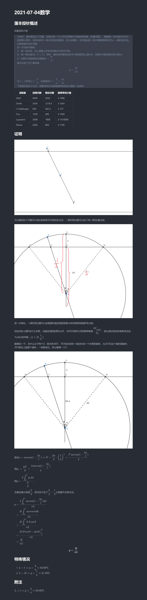

## 样本空间

**样本空间**（sample space）$\Omega$ 是一个集合，包含一次试验的所有可能结果。

每个 $\omega \in \Omega$ 称为一个**样本**（sample）或**基本事件**（elementary event）。

## 离散概率空间

对于*离散*概率空间（即 $\Omega$ 有限或可数无穷）：
- **概率质量函数**（probability mass function, **pmf**）$p\colon \Omega \to [0, 1]$ 满足 $\displaystyle \sum_{\omega \in \Omega} p(\omega) = 1$；
- 事件 $A \subseteq \Omega$ 的**概率**（probability）定义为 $\displaystyle \Pr(A) = \sum_{\omega \in A} p(\omega)$。即 $\Pr\colon 2^\Omega \to [0, 1]$。

## 样本空间与事件

!!! info ""
    **事件**（event）满足：
    - $\empty, \Omega$ 都是事件（称为*不可能事件*和*必然事件*）；
    - 若 $A$ 是事件，则 $A^c$ 也是事件；
    - 若 $A_1, A_2, \cdots$ 是事件，则 $\bigcup_i A_i$ 也是事件。

## $\sigma$-代数

!!! info ""
    $\Omega$ 的子集[族](https://en.wikipedia.org/wiki/Family_of_sets) $\Sigma \subseteq 2^{\Omega}$ 称为 **$\sigma$-代数**（$\sigma$-algebra）或 **$\sigma$-域**（$\sigma$-field）满足：
    - $\empty \in \Sigma$；
    - $A \in \Sigma \implies A^c \in \Sigma$；
    - $A_1, A_2, \cdots \in \Sigma \implies \bigcup_i A_i \in \Sigma$。

## 概率空间的经典例子

- 古典概型（classic probability）：离散均匀分布。对于有限样本空间 $\Omega$，任意的结果 $\omega \in \Omega$ 都有相同的概率。则对于任意事件 $A \subseteq \Omega$，有 $\Pr(A) = \dfrac{|A|}{|\Omega|}$。
- 几何概型（geometric probability）：连续概率空间使得，对于任意事件 $A \in \Sigma$，有 $\Pr(A) = \dfrac{\operatorname{Vol}(A)}{\operatorname{Vol}(\Omega)}$。

几何概型的例子有蒲丰投针问题（Buffon's Needle Problem），这个三年前有写过短篇笔记，方法比较粗糙，格式也比较差劲，但作为一段历史还是放在下面。

<!-- {{{ 2021 年 7 月 4 日 -->

2021 年 7 月 4 日

<!-- }}} -->

下面是课件上的证明，记号有所不同。

记事件 $A = \left\lbrace (x, y) \in [0, \pi] \times \left[0, \dfrac{d}{2}\right] \middle| y \le \dfrac{l}{2} \sin x \right\rbrace$，则

$$
\begin{aligned}
    \Pr(A) &= \dfrac{\operatorname{Vol}(A)}{\operatorname{Vol}(\Omega)} \\
    &= \dfrac{2}{d \pi} \int_0^{\pi} \dfrac{l}{2} \sin x \d x\\ 
    &= \dfrac{2l}{d \pi}
\end{aligned}
$$

## 概率空间

!!! info ""
    一般而言，三元组 $(\Omega, \Sigma, \Pr)$ 称为一个**概率空间**（probability space），若：
    - 令 $\Sigma \subseteq 2^{\Omega}$ 为 $\sigma$-代数；
    - **概率测度**（probability measure），亦称**概率律**（probability law），是一个函数 $\Pr\colon \Sigma \to [0, 1]$ 满足：
        - 归一性/标准化（unitary/normalized）：$\Pr(\Omega) = 1$；
        - $\sigma$-可加性（$\sigma$-additive）：若 $A_1, A_2, \cdots \in \Sigma$ 两两互斥（disjoint），则 $\Pr\left(\bigcup_i A_i\right) = \sum_i \Pr(A_i)$。

可从上面的概率空间公理推导出以下性质：
- $\Pr(\empty) = 0$（$\Pr(A) > 0 \implies A \neq \empty$）；
- $\Pr(A^c) = 1 - \Pr(A)$；
- $\Pr(A \backslash B) = \Pr(A) - \Pr(A \cap B)$；
- $A \subseteq B \implies \Pr(A) \le \Pr(B)$；
- $\Pr(A \cup B) = \Pr(A) + \Pr(B) - \Pr(A \cap B)$。

仅从上面的叙述似乎感觉不到这个定义的意义所在，下面通过两个例子阐释一下我的理解。

!!! example ""
    1. 「任意一个自然数是偶数的概率为 $\dfrac{1}{2}$」
    2. 「$[0, 1]$ 中随机抽取一个实数是有理数的概率为 $0$」
    
    <!-- {{{ 解释 -->
    

    
解释

    
    第一个是错误的，甚至是 not even wrong 的。因为无法定义这样的「均匀分布」。
    
    若是要均匀分布，为其中每一个自然数分配一个概率 $p$，那么我们有
    
    $$
    \sum_{n=1}^\infty p = 1
    $$
    
    这显然是不可能的。因此，我们无法定义一个均匀分布在自然数上的概率测度。
    
    第二个是正确的。一开始我还有疑问，为什么这个就不会出现像上面那样，每个数概率为 $0$，但是和为 $1$ 的无良定义的情况呢？于是我去问了 ChatGPT 得到了满意的答案，下面就是我的理解了：
    
    原因就是上面的概率测度。面对不可数集时，常常使用连续概率分布，这时的概率并不是像之前的例子一样是离散的，在这种情况下，概率分布不是通过单个点的概率来处理，而是通过区间的长度来计算。因此「均匀分布」是有合理的定义在的。
    
    

    <!-- }}} -->

存在不可数的 $[0, 1]$ 的子集，使得其概率为 $0$。答案是[康托尔集](https://zh.wikipedia.org/wiki/康托尔集)。

## 并集界

!!! info 并集界（Union bound, 布尔不等式）
    对任意事件 $A_1, A_2, \cdots, A_n \in \Sigma$，有

    $$
    \Pr\left(\bigcup_{i=1}^n A_i\right) \le \sum_{i=1}^n \Pr(A_i)
    $$

!!! example Balls into bins 问题
    将 $n$ 个球随机扔到 $n$ 个盒中，$k$ 是盒中球最多的个数，则 $k$ **高概率**[^whp]是 $O\left( \dfrac{\ln n}{\ln \ln n} \right)$。

    [^whp]: with high probability, **w.h.p.**, 以 $1 - O(1/n)$ 概率。

    <!-- {{{ 证明 -->
    

    
证明

    
    记
    - 事件 $A$：存在盒接受到不少于 $k$ 个球（$k$ 是待定常数）
    - 事件 $A_i$：盒-$i$ 接受到不少于 $k$ 个球

    并集界有

    $$
    \Pr(A) = \Pr\left( \bigcup_{i=1}^n A_i \right) \le \sum_{i=1}^n \Pr(A_i) \le \dfrac{1}{n}
    $$

    因为此时有 $\Pr(A^c) \ge 1 - \dfrac{1}{n}$，即具有最多球的盒中球的个数不超过 $k$ 的概率至少为 $1 - \dfrac{1}{n}$，符合题意。

    对于任意 $S \in \dbinom{[n]}{k}$[^denote]，记事件 $A_{i, S}$ 为盒-$i$ 接受到所有 $S$ 中的球。并集界有
    $$
    \begin{aligned}
        \Pr(A_i) &= \Pr\left( \bigcup_{S \in \binom{[n]}{k}} A_{i, S} \right)\\ 
        &\le \sum_{S \in \binom{[n]}{k}} \Pr(A_{i, S})\\ 
        &= \dbinom{n}{k} \dfrac{1}{n^{k}}\\
        &\le \left( \dfrac{\e n}{k} \right)^{k} \dfrac{1}{n^{k}}\\
        &\le \left( \dfrac{\e}{k} \right)^{k}\\
        &\textcolor{ff0099}{\le \dfrac{1}{n^2}}
    \end{aligned}
    $$

    [^denote]: 这里出现了两个后面常见的记号：$[n]$ 代表 $\left\lbrace 1, 2, \cdots, n \right\rbrace$；$\dbinom{[n]}{k}$ 代表 $[n]$ 的所有 $k$-组合，即 $[n]$ 所有大小为 $k$ 的子集组成的集合。

    可取 $k = 3\dfrac{\ln n}{\ln \ln n}$ 以实现彩色部分成立。

    

    <!-- }}} -->

## 容斥原理

!!! info 容斥原理（Principle of Inclusion-Exclusion）
    对任意事件 $A_1, A_2, \cdots, A_n \in \Sigma$，有

    $$
    \begin{aligned}
        \Pr\left(\bigcup_{i=1}^n A_i\right) &= \sum_{i=1}^n \Pr(A_i) - \sum_{i < j} \Pr(A_i \cap A_j) + \sum_{i < j < k} \Pr(A_i \cap A_j \cap A_k) -\\ 
        &= \sum_{\empty \ne S \subseteq [n]} (-1)^{|S| - 1} \Pr\left(\bigcap_{i \in S} A_i\right)
    \end{aligned}
    $$

    <!-- {{{ 证明 -->
    

    
证明

    
    两个事件的情况成立，即
    $$
    \Pr(A_1 \cup A_2) = \Pr(A_1) + \Pr(A_2) - \Pr(A_1 \cap A_2)
    $$

    采用数学归纳法，假设对于 $n$ 个事件 $A_1, A_2, \dots, A_n$，有
    $$
    \Pr\left(\bigcup_{i=1}^n A_i\right) = \sum_{\empty \ne S \subseteq [n]} (-1)^{|S| - 1} \Pr\left(\bigcap_{i \in S} A_i\right)
    $$

    则对于 $n+1$ 个事件 $A_1, A_2, \dots, A_n, A_{n+1}$ 有
    $$
    \begin{aligned}
        \Pr\left(\bigcup_{i=1}^{n+1} A_i\right) &= \Pr\left(\bigcup_{i=1}^n A_i \cup A_{n+1}\right)\\
                                                  &= \Pr\left(\bigcup_{i=1}^n A_i\right) + \Pr(A_{n+1}) - \Pr\left(\bigcup_{i=1}^n A_i \cap A_{n+1}\right)\\ 
                                                  &= \sum_{\empty \ne S \subseteq [n]} (-1)^{|S| - 1} \Pr\left(\bigcap_{i \in S} A_i\right) + \Pr(A_{n+1}) - \Pr\left(\bigcup_{i=1}^n (A_i \cap A_{n+1})\right)\\
                                                  &= \sum_{\empty \ne S \subseteq [n]} (-1)^{|S| - 1} \Pr\left(\bigcap_{i \in S} A_i\right) + \sum_{S \subseteq [n]} (-1)^{|S|}\Pr\left(\bigcap_{i \in S} A_i \cap A_{n+1}\right)\\
                                                  &= \sum_{\empty \ne S \subseteq [n]} (-1)^{|S| - 1} \Pr\left(\bigcap_{i \in S} A_i\right) + \sum_{\left\lbrace n+1 \right\rbrace \subseteq S' \subseteq [n+1]} (-1)^{|S'|-1}\Pr\left(\bigcap_{i \in S'} A_i \right)\\
                                                  &= \sum_{\empty \ne S \subseteq [n+1]} (-1)^{|S| - 1} \Pr\left(\bigcap_{i \in S} A_i\right)
    \end{aligned}
    $$
    
    

    <!-- }}} -->

!!! note 布尔-邦费罗尼不等式（Boole-Bonferroni inequality）
    由布尔不等式可得事件并集的上下界。

    对任意事件 $A_1, A_2, \cdots, A_n \in \Sigma$ 与任意 $k > 0$，有

    $$
    \sum_{\substack{S \subseteq [n]\\ 1 \le |S| \le 2k}} (-1)^{|S| - 1} \Pr\left(\bigcap_{i \in S} A_i\right) \le \Pr\left(\bigcup_{i=1}^n A_i\right) \le \sum_{\substack{S \subseteq [n]\\ 1 \le |S| \le 2k+1}} (-1)^{|S| - 1} \Pr\left(\bigcap_{i \in S} A_i\right)
    $$

    <!-- {{{ 证明 -->
    

    
证明

    
    先证明 $n = 2$ 时的情形，即
    $$
    \Pr(A_1) + \Pr(A_2) - \Pr(A_1 \cap A_2) \le \Pr(A_1 \cup A_2) \le \Pr(A_1) + \Pr(A_2) - \Pr(A_1 \cap A_2)
    $$
    
    显然成立，而且是恒为等号。

    采用数学归纳法，假设对于 $n$ 个事件 $A_1, A_2, \dots, A_n$，有
    $$
    \sum_{i=1}^{n}\Pr(A_i) - \sum_{i\le i < j \le n}\Pr(A_i \cap A_j) \le \Pr\left(\bigcup_{i=1}^n A_i\right) \le \sum_{i=1}^{n}\Pr(A_i) - \sum_{i=2}^{n}\Pr(A_1 \cap A_i)
    $$
    
    现在考虑 $n+1$ 个事件 $A_1, A_2, \dots, A_n, A_{n+1}$。分别证明两个不等式，先证明左边的不等式，即
    $$
    \begin{aligned}
        \sum_{i=1}^{n+1}\Pr(A_i) - \sum_{i\le i < j \le n+1}\Pr(A_i \cap A_j) &= \sum_{i=1}^{n}\Pr(A_i) + \Pr(A_{n+1}) - \sum_{i\le i < j \le n}\Pr(A_i \cap A_j) - \sum_{i=1}^{n}\Pr(A_i \cap A_{n+1})\\
        &\le \Pr\left(\bigcup_{i=1}^n A_i\right) + \Pr(A_{n+1}) - \sum_{i=1}^{n}\Pr(A_i \cap A_{n+1})\\
        &\le \Pr\left(\bigcup_{i=1}^n A_i\right) + \Pr(A_{n+1}) - \Pr\left(\bigcup_{i=1}^n A_i \cap A_{n+1}\right)\\
        &= \Pr\left(\bigcup_{i=1}^{n+1} A_i\right)
    \end{aligned}
    $$

    再证明右边的不等式，即
    $$
    \begin{aligned}
        \Pr\left(\bigcup_{i=1}^{n+1} A_i\right) &= \Pr\left( \bigcup_{i=1}^n A_i \right) + \Pr(A_{n+1}) - \Pr\left(\bigcup_{i=1}^n A_i \cap A_{n+1}\right)\\ 
        &\le \sum_{i=1}^{n+1} \Pr(A_i) - \sum_{i=2}^{n}\Pr(A_1 \cap A_i) - \Pr\left(\bigcup_{i=1}^n A_i \cap A_{n+1}\right)\\
        &\le \sum_{i=1}^{n+1} \Pr(A_i) - \sum_{i=2}^{n}\Pr(A_1 \cap A_i) - \Pr(A_1 \cap A_{n+1})\\
        &= \sum_{i=1}^{n+1} \Pr(A_i) - \sum_{i=2}^{n+1}\Pr(A_1 \cap A_i)
    \end{aligned}
    $$

    

    <!-- }}} -->

!!! example 错排问题（Derangement）
    随机排列 $\pi\colon [n] \xrightarrow{\text{1-1 onto}} [n]$ 不存在不动点的概率。

    <!-- {{{ 解答 -->
    

    
解答

    
    令 $A_i$ 是 $\pi(i) = i$ 的事件，有

    $$
    \begin{aligned}
        \Pr\left( \bigcup_{i=1}^n A_i \right) &= \sum_{k=1}^n \sum_{S \in \binom{[n]}{k}} (-1)^{k-1} \Pr\left( \bigcap_{i \in S} A_i \right)\\ 
        &=  \sum_{k=1}^n \sum_{S \in \binom{[n]}{k}} (-1)^{k-1} \dfrac{(n - |S|)!}{n!}\\
        &= \sum_{k=1}^n \dbinom{n}{k} (-1)^{k-1} \dfrac{(n-k)!}{n!}\\
        &= -\sum_{k=1}^n \dfrac{(-1)^{k}}{k!}
    \end{aligned}
    $$
    
    则

    $$
    \begin{aligned}
        \Pr[\pi \text{ 没有不动点}] &= \Pr\left( \bigcap_{i=1}^n A_i^c \right)\\ 
        &= 1 - \Pr\left( \bigcup_{i=1}^n A_i \right)\\ 
        &= 1 + \sum_{k=1}^n \dfrac{(-1)^{k}}{k!}\\
        &= \sum_{k=0}^n \dfrac{(-1)^{k}}{k!}\\
        &\to \dfrac{1}{\e}\quad (n \to \infty )
    \end{aligned}
    $$
    
    

    <!-- }}} -->

## 概率测度的连续性（continuity of probability measures）\*

!!! info ""
    记 $A_1 \subseteq A_2 \subseteq \cdots$ 是一个递增的事件序列，并记 $A$ 是它们的极限

    $$
    A = \bigcup_{i=1}^{\infty } = \lim_{n \to \infty} A_n
    $$
    
    于是

    $$
    \Pr(A) = \lim_{n \to \infty} \Pr(A_n)
    $$

    <!-- {{{ 证明 -->
    

    
证明

    
    将 $A$ 表示为不相交的并集

    $$
    A = A_1 \uplus (A_2 \backslash A_1) \uplus (A_3 \backslash A_2) \uplus \cdots
    $$
    
    于是

    $$
    \begin{aligned}
        \Pr(A) &= \Pr(A_1) + \sum_{i=1}^{\infty } \Pr(A_{i+1} \backslash A_i)\\ 
        &= \Pr(A_1) + \lim_{n\to \infty } \sum_{i=1}^{n-1} [\Pr(A_{i+1} - \Pr(A_i))]\\ 
        &= \lim_{n\to \infty } \Pr(A_n)
    \end{aligned}
    $$
    
    

    <!-- }}} -->
    
    类似地，记 $B_1 \supseteq B_2 \supseteq \cdots$ 是一个递减的事件序列，并记 $B$ 是它们的极限

    $$
    B = \bigcap_{i=1}^{\infty } = \lim_{n \to \infty} B_n
    $$
    
    于是

    $$
    \Pr(B) = \lim_{n \to \infty} \Pr(B_n)
    $$
    
    <!-- {{{ 证明 -->
    

    
证明

    
    考虑它们的补集 $B_n^c$，有 $B_1^c \subseteq B_2^c \subseteq \cdots$，于是这是一个递增的事件序列，根据上面的结论得证。
    
    

    <!-- }}} -->

## 几乎从不和几乎必然事件\*

- 一个事件 $A \in \Sigma$ 称为 **null**(几乎从不)，若 $\Pr(A) = 0$；
    - null 事件并不一定是 impossible(不可能) 事件 $\empty$ 
- 一个事件 $A \in \Sigma$ **almost sure**(**a.s.**, 几乎必然) 发生，若 $\Pr(A) = 1$；
    - 一个事件 a.s. 发生，并不一定是 certain(必然) 事件 $\Omega$
- 一个概率空间称为 **complete**，若 $\Sigma$ 包含 null 事件集的所有子集。
    - 不失一般性，我们仅考虑 complete 概率空间（因为若考虑 incomplete 的，可以将其 complete 而不改变其概率）
