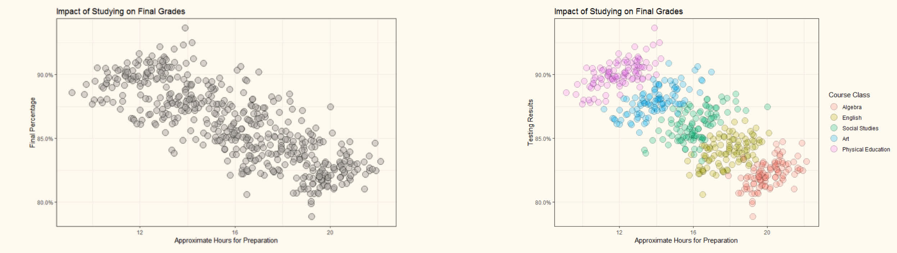

## 条件概率

The probability of $A$ is $p$, given that $B$ occurs. 即在事件 $B$ 发生的条件下，事件 $A$ 发生的概率 $p$，称为条件概率。

对于离散均匀分布的情况

$$
p = \dfrac{|A \cap B|}{|B|} = \dfrac{|A \cap B| / |\Omega|}{|B| / |\Omega|} = \dfrac{\Pr(A \cap B)}{\Pr(B)}
$$

!!! info ""
    令 $A$ 是一个事件，$B$ 是一个非零概率事件，即 $\Pr(B) > 0$，则 $A$ 在 $B$ 条件下的概率（conditional probability）定义为

    $$
    \Pr(A \mid B) = \dfrac{\Pr(A \cap B)}{\Pr(B)}
    $$
    
    <!-- {{{ 条件概率是概率 -->
    

    
条件概率是概率

    
    - 样本空间是 $B$
    - $\Sigma^B = \left\lbrace A \cap B \mid A \in \Sigma \right\rbrace$ 是 $\sigma$-代数
    - 概率测度 $\Pr(\cdot \mid B)$ 满足概率公理
    
    

    <!-- }}} -->

[*辛普森悖论*](https://zh.wikipedia.org/wiki/辛普森悖论)是指一个总体中的两组数据分别满足某一规律，但是当这两组数据合并后，这一规律却被打破的现象。

在概率论中，可以构造事件 $A, B$ 与样本空间 $\Omega$ 的划分 $C_1, C_2, \cdots, C_n$ 使得
- 对于每个 $C_i$，$B$ 的发生对 $A$ 有正向影响
    - $\Pr(A \mid B \cap C_i) > \Pr(A \mid B^c \cap C_i)$ 对任意 $i$ 成立
- 但总体上，$B$ 的发生对 $A$ 有负向影响
    - $\Pr(A \mid B) < \Pr(A \mid B^c)$

其他例子：
- 冯·诺依曼的伯努利工厂：使用未知不公平硬币构造一个公平硬币的方法。
- [双孩问题（Two Child Problem, boy or girl paradox）](https://en.wikipedia.org/wiki/Boy_or_girl_paradox)

## 条件概率法则（Laws for Conditional Probability）

### 链式法则

!!! info 链式法则（Chain Rule）
    对于任意事件 $A_1, A_2, \cdots, A_n$，有

    $$
    \Pr\left( \bigcap_{i=1}^n A_i \right) = \prod_{i=1}^n \Pr\left( A_i \biggm| \bigcap_{j < i} A_j \right)
    $$

    <!-- {{{ 证明 -->
    

    
证明

    $$
    \Pr\left( \bigcap_{i=1}^n A_i \right) = \frac{\Pr\left(\bigcap_{i=1}^{n} A_{i}\right)}{\Pr\left(\bigcap_{i=1}^{n-1} A_{i}\right)} \cdot \frac{\Pr\left(\bigcap_{i=1}^{n-1} A_{i}\right)}{\Pr\left(\bigcap_{i=1}^{n-2} A_{i}\right)} \cdots \frac{\Pr\left(A_{1} \cap A_{2}\right)}{\Pr\left(A_{1}\right)} \cdot \Pr\left(A_{1}\right)
    $$

    

    <!-- }}} -->

链式法则，又称为 General Product Rule 或 Law of Successive Conditioning。

考虑均匀随机映射 $f\colon [n] \to [m]$，有 $f$ 为 1-1 映射（双射）的概率

$$
\Pr[f \text{ is 1-1}] = \dfrac{m! / (m-n)!}{m^n} = \prod_{i=1}^n \left(1 - \dfrac{i - 1}{m}\right)
$$

Balls-into-bins 模型中，有 $n$ 个球随机放入 $m$ 个盒子，每个盒子最多放一个球的概率为 $\epsilon$，其中 $n \approx \sqrt{2 m \ln(1 / \epsilon)}$。

$$
\begin{aligned}
    \Pr[\text{每个球入一个空盒}] &= \Pr[\text{球 $i$ 入空盒} \mid \text{每个球 $j < i$ 在空盒}]\\ 
    &= \prod_{i=1}^n \left(1 - \dfrac{i - 1}{m}\right) \\ 
    &\approx \exp\left(-\sum_{i=1}^n \dfrac{i - 1}{m}\right) \\ 
    &\approx \exp\left(-\dfrac{n^2}{2m}\right)
\end{aligned}
$$

### 全概率法则

!!! info 全概率法则（Law of Total Probability）
    对于任意事件 $A$ 和样本空间 $\Omega$ 的划分 $B_1, B_2, \cdots, B_n$，有

    $$
    \begin{aligned}
        \Pr(A) &= \sum_{i=1}^n \Pr(A \cap B_i) \\ 
        &= \sum_{i=1}^n \Pr(A \mid B_i) \Pr(B_i)
    \end{aligned}
    $$

<!-- {{{ 证明 -->

证明

$A \cap B_1, A \cap B_2, \cdots, A \cap B_n$ 互不相交，同时 $A = \bigcup\limits_{i=1}^n (A \cap B_i)$。

从而有 $\Pr(A) = \displaystyle \sum_{i=1}^n \Pr(A \cap B_i)$。

而 $\Pr(A \cap B_i) = \Pr(A \mid B_i) \Pr(B_i)$。

<!-- }}} -->

[三门问题](https://zh.wikipedia.org/wiki/蒙提霍尔问题)

!!! example ""
    [赌徒破产](https://en.wikipedia.org/wiki/Gambler%27s_ruin)（Gambler's Ruin, 一维对称随机游走）：一个赌徒玩一个公平的游戏，每一步他抛一枚硬币，正面得一分，反面失一分。他以 $k$ 分开始游戏，会一直玩直到分数为 $0$（失败）或 $n$（胜利）。那么他最终破产的概率是多少？
    
    <!-- {{{ 解答 -->
    

    
解答

    
    记事件
    - $A$：赌徒失败。
    - $B$：第一枚硬币为正面。
    
    令 $\Pr_{k}$ 是赌徒以 $k$ 分开始游戏时最终破产的概率分布，有
    
    $$
    \begin{aligned}
        \Pr\nolimits_{k}(A) &= \dfrac{1}{2} \Pr\nolimits_{k}(A \mid B) + \dfrac{1}{2} \Pr\nolimits_{k}(A \mid B^c)\\ 
        &= \dfrac{1}{2} \Pr\nolimits_{k+1}(A) + \dfrac{1}{2} \Pr\nolimits_{k-1}(A)
    \end{aligned}
    $$
    
    即
    
    $$
    \Pr\nolimits_{k}(A) = \begin{cases}
        \dfrac{1}{2}\left(\Pr_{k+1}(A) + \Pr_{k-1}(A)\right) & \text{if } 0 < k < n\\
        1 & \text{if } k = 0\\ 
        0 & \text{if } k = n
    \end{cases}
    $$
    
    注意到
    
    $$
    \dfrac{1}{2}(\Pr\nolimits_{k+1}(A) - \Pr\nolimits_{k}(A)) = \dfrac{1}{2}(\Pr\nolimits_{k}(A) - \Pr\nolimits_{k-1}(A))
    $$
    
    即 $\Pr_{k}(A)$ 是一个等差数列，从而有 $\Pr_{k}(A) = 1 - \dfrac{k}{n}$。
    
    

    <!-- }}} -->

### 贝叶斯法则

!!! info 贝叶斯法则（Bayes' Law）
    对于任意事件 $A$ 和样本空间 $\Omega$ 的划分 $B_1, B_2, \cdots, B_n$，有

    $$
    \begin{aligned}
        \Pr(B_i \mid A) &= \dfrac{\Pr(B_i) \Pr(A \mid B_i)}{\Pr(A)} \\
        &= \dfrac{\Pr(A \mid B_i) \Pr(B_i)}{\sum\limits_{j=1}^n \Pr(A \mid B_j) \Pr(B_j)}
    \end{aligned}
    $$
