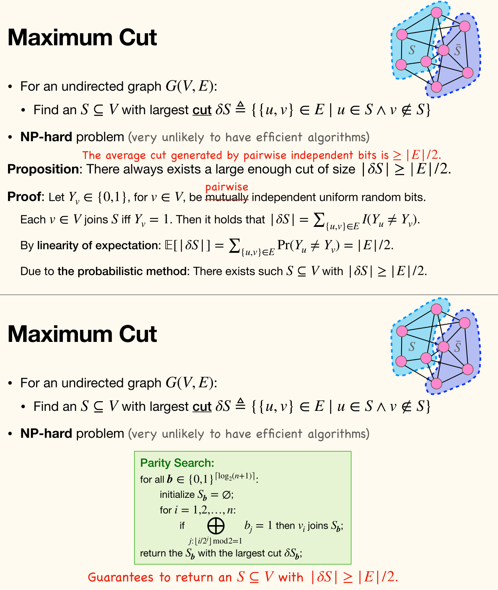

## 定义

!!! info ""
    一个随机变量 $X$ 的**期望**（expectation, or mean）定义为

    $$
    \mathbb{E}[X] = \sum_{x} x \cdot p_X(x)
    $$

    其中 $p_X$ 表示 $X$ 的概率质量函数（pmf）。

$\mathbb{E}[X]$ 可能为 $\infty $，本节基本假定 $\mathbb{E}[X] < \infty $ *绝对收敛*（absolute convergence）。一些反例：
- [圣彼得堡悖论](https://zh.wikipedia.org/wiki/圣彼得堡悖论)：$p_X(2^{k}) = 2^{-k}$
- $X \in \Z \backslash\left\lbrace 0 \right\rbrace,\, p_X(k) = \dfrac{1}{ak^2},\, a = \dfrac{\pi^2}{3}$

## 性质

### 指示随机变量

!!! note ""
    对于以 $p$ 为参数的伯努利随机变量 $X \in \left\lbrace 0, 1 \right\rbrace$，有

    $$
    \mathbb{E}[X] = 0 \cdot (1-p) + 1 \cdot p = p
    $$

!!! note ""
    对于事件 $A$ 的指示随机变量 $X = I(A)$，有

    $$
    \mathbb{E}[X] = 0 \cdot \Pr(A^c) + 1 \cdot \Pr(A) = \Pr(A)
    $$

### 变量变换（[Change of Variables](https://en.wikipedia.org/wiki/Change_of_variables)）

> [Law Of The Unconscious Statistician (LOTUS)](https://en.wikipedia.org/wiki/Law_of_the_unconscious_statistician)
> 不省人事的统计学家定律
> 叫「无意识」应该更合理？

!!! note LOTUS
    对于 $f\colon \R \to \R$ 以及离散随机变量 $X$ 与 $\bm{X} = (X_1, \dots, X_n)$，有
    - $\mathbb{E}[f(X)] = \sum_x f(x)p_X(x)$ 
    - $\mathbb{E}[f(\bm{X})] = \sum_{\bm{x}} f(\bm{x})p_{\bm{X}}(\bm{x}) = \sum\limits_{(x_1, \dots, x_n)}f(x_1, \dots, x_n)p_{\bm{X}}(x_1, \dots, x_n)$

    <!-- {{{ 证明 -->
    <details>
    <summary>证明</summary>
    
    令 $Y = f(X_1, \dots, X_n)$，于是

    $$
    \begin{aligned}
        \mathbb{E}[f(X_1, \dots, X_n)] &= \sum_y y \Pr(Y = y) \\
        &= \sum_y y\sum_{(x_1, \dots, x_n) \in f^{-1}(y)} \Pr[(X_1, \dots, X_n) = (x_1, \dots, x_n)] \\ 
        &= \sum_{(x_1, \dots, x_n)} f(x_1, \dots, x_n) \Pr[(X_1, \dots, X_n) = (x_1, \dots, x_n)] \\ 
        &= \sum_{(x_1, \dots, x_n)} f(x_1, \dots, x_n) p_{\bm{X}}(x_1, \dots, x_n)
    \end{aligned}
    $$
    
    </details>
    <!-- }}} -->

### 期望的线性性质

!!! note ""
    对于 $a, b \in \R$ 与随机变量 $X, Y$：
    - $\mathbb{E}[aX + b] = a\mathbb{E}[X] + b$
    - $\mathbb{E}[X + Y] = \mathbb{E}[X] + \mathbb{E}[Y]$

    对于在随机变量 $X_1, \dots, X_n$ 上的*线性（仿射）*（linear (affine)）函数 $f$，有

    $$
    \mathbb{E}[f(X_1, \dots, X_n)] = f(\mathbb{E}[X_1], \dots, \mathbb{E}[X_n])
    $$
    
    对于任意相互不独立（dependent）的随机变量 $X_1, \dots, X_n$，上式成立[^arbitrarily]。

    [^arbitrarily]: It holds for *arbitrarily dependent* $X_1, \dots, X_n$

    <!-- {{{ 证明 -->
    <details>
    <summary>证明</summary>
    
    Proof 1.

    $$
    \begin{aligned}
        \mathbb{E}[aX + b] &= \sum_x (ax + b)p_X(x) \\ 
        &= a \sum_x x p_X(x) + b \sum_x p_X(x) \\ 
        &= a \mathbb{E}[X] + b
    \end{aligned}
    $$
    
    Proof 2.

    $$
    \begin{aligned}
        \mathbb{E}[X + Y] &= \sum_{x, y} (x + y)\Pr[(X, Y) = (x, y)] \\ 
        &= \sum_x x \sum_y \Pr[(X, Y) = (x, y)] + \sum_y y \sum_x \Pr[(X, Y) = (x, y)] \\ 
        &= \sum_x x \Pr[X = x] + \sum_y y \Pr[Y = y] \\ 
        &= \sum_x x p_X(x) + \sum_y y p_Y(y) \\ 
        &= \mathbb{E}[X] + \mathbb{E}[Y]
    \end{aligned}
    $$
    
    </details>
    <!-- }}} -->

## 一些分布的期望

### 泊松分布

!!! note ""
    泊松分布 $X \sim \operatorname{Pois}(\lambda)$ 的期望

    $$
    \mathbb{E}[X] = \lambda
    $$

    <!-- {{{ 证明 -->
    <details>
    <summary>证明</summary>
    
    $$
    \begin{aligned}
        \mathbb{E}[X] &= \sum_{k\ge 0} k \dfrac{\e^{-\lambda}\lambda^{k}}{k!}\\
        &= \sum_{k\ge 1} \dfrac{\e^{-\lambda}\lambda^{k}}{(k-1)!}\\
        &= \sum_{k\ge 0} \dfrac{\e^{-\lambda}\lambda^{k+1}}{k!}\\
        &= \lambda \sum_{k\ge 0} \dfrac{\e^{-\lambda}\lambda^{k}}{k!}\\ 
        &= \lambda
    \end{aligned}
    $$
    
    </details>
    <!-- }}} -->

### 二项分布

!!! note ""
    对于二项随机变量 $X \sim \operatorname{Bin}(n, p)$，有

    $$
    \mathbb{E}[X] = np
    $$
    
    <!-- {{{ 证明 -->
    <details>
    <summary>证明</summary>
    
    $$
    \mathbb{E}[X] = \sum_{k=0}^{n} k \dbinom{n}{k}p^{k}(1-p)^{n-k}
    $$

    不过注意到 $X \sim \operatorname{Bin}(n, p)$ 可表示为 $X = X_1 + \dots + X_n$，其中 $X_i$ 是 i.i.d. 以 $p$ 为参数的伯努利随机变量，于是

    $$
    \mathbb{E}[X] = \mathbb{E}[X_1] + \dots + \mathbb{E}[X_n] = np
    $$
    
    </details>
    <!-- }}} -->

### 几何分布

!!! note ""
    对于几何随机变量 $X \sim \operatorname{Geo}(p)$，有

    $$
    \mathbb{E}[X] = \dfrac{1}{p}
    $$

    <!-- {{{ 证明 -->
    <details>
    <summary>证明</summary>
    
    $$
    \mathbb{E}[X] = \sum_{k\ge 1} k(1-p)^{k-1}p \\ 
    $$

    注意到 $X \sim \operatorname{Geo}(p)$ 可以表示为 $\displaystyle X = \sum_{k \ge 1}I_{k}$，其中 $I_{k}$ 是一个指示函数，表示<u>前 $k-1$ 次试验是否*全部*失败</u>（indicate whether all of the first $k-1$ trials fail）。

    $$
    \begin{aligned}
        \mathbb{E}[X] &= \sum_{k\ge 1} \mathbb{E}[I_{k}] \\ 
        &= \sum_{k\ge 1}(1-p)^{k-1}\\
        &= \dfrac{1}{p}
    \end{aligned}
    $$
    
    </details>
    <!-- }}} -->

### 负二项分布

!!! note ""
    对于以 $r, p$ 为参数的负二项随机变量 $X$，有

    $$
    \mathbb{E}[X] = r \dfrac{1-p}{p}
    $$

    <!-- {{{ 证明 -->
    <details>
    <summary>证明</summary>
    
    $$
    \mathbb{E}[X] = \sum_{k\ge 1} k\dbinom{k+r-1}{k}(1-p)^{k}p^r
    $$

    $X$ 可表示为 $(X_1 - 1) + \dots + (X_r - 1)$，其中 $X_i$ 是 i.i.d. 以 $p$ 为参数的几何随机变量，于是

    $$
    \mathbb{E}[X] = \mathbb{E}[X_1] + \dots + \mathbb{E}[X_r] - r = r \dfrac{1-p}{p}
    $$
    
    </details>
    <!-- }}} -->

### 超几何分布

!!! note ""
    对于以 $N, M, n$ 为参数的超几何随机变量 $X$，有

    $$
    \mathbb{E}[X] = n \dfrac{M}{N}
    $$

    <!-- {{{ 证明 -->
    <details>
    <summary>证明</summary>
    
    $$
    \mathbb{E}[X] = \sum_{k=0}^{n} k \dfrac{\binom{M}{k}\binom{N-M}{n-k}}{\binom{N}{n}}
    $$
    
    每个红球（成功）以概率 $\dfrac{\binom{N-1}{n-1}}{\binom{N}{n}} = \dfrac{n}{N}$ 被选中。同时 $X = X_1 + \dots + X_M$，其中 $X_i \in \left\lbrace 0, 1 \right\rbrace$ 表示<u>第 $i$ 个红球是否被选中</u>，于是

    $$
    \mathbb{E}[X] = \mathbb{E}[X_1] + \dots + \mathbb{E}[X_M] = n \dfrac{M}{N}
    $$
    
    </details>
    <!-- }}} -->

## 例子

### 模式匹配（Pattern Matching）

记 $s = (s_1, \dots, s_n) \in Q^n$，表示长度为 $n$ 的均匀随机字串，由大小为 $q$ 的字母表 $Q$ 中的字母组成。

对于长度为 $k$ 的字串（**pattern**）$\pi \in Q^{k}$，令 $X$ 表示字串 $\pi$ 出现在 $s$ 中的次数。

记 $I_i \in \left\lbrace 0, 1 \right\rbrace$ 表示<u>第 $i$ 个位置是否匹配，即 $\pi = (s_i, \dots, s_{i+k-1})$</u>，于是 $\displaystyle X = \sum_{i=1}^{n-k+1}I_i$。

期望的线性性质给出

$$
\begin{aligned}
    \mathbb{E}[X] &= \sum_{i=1}^{n-k+1}\mathbb{E}[I_i] \\ 
    &= (n-k+1)\mathbb{E}[I_i] \\ 
    &= (n-k+1)q^{-k}
\end{aligned}
$$

字串匹配次数的期望与给定字串 $\pi$ 无关，仅与其长度有关。

但是期望的首次匹配成功的位置（expected time(position) for the first appearance）就可能与 $\pi$ 有关。
- [Optional Stopping Theorem (OST)](https://en.wikipedia.org/wiki/Optional_stopping_theorem)

### [赠券收集问题](https://zh.wikipedia.org/wiki/赠券收集问题)（[Coupon Collector's Problem](https://en.wikipedia.org/wiki/Coupon_collector%27s_problem)）

> 假设有 $n$ 种赠券，每种赠券获取概率相同，而且赠券亦无限供应。要集齐 $n$ 种赠券。

Balls-into-bins 模型：一个个地扔球，u.a.r.，使得 $n$ 个桶全部被占据。
- $X$ 表示使 $n$ 个桶非空的扔球次数
- $X_i$ 表示恰有 $i-1$ 个非空桶时的扔球次数

$X_i$ 是一个以 $p_i$ 为参数的几何随机变量，$p_i = 1 - \dfrac{i-1}{n}$，且 $\displaystyle X = \sum_{i=1}^{n}X_i$，于是

$$
\begin{aligned}
    \mathbb{E}[X] &= \sum_{i=1}^{n}\mathbb{E}[X_i] \\ 
    &= \sum_{i=1}^{n} \dfrac{n}{n-i+1}\\
    &= n \sum_{i=1}^{n} \dfrac{1}{i}\\ 
    &= n H(n)\\
    &\approx n \ln n
\end{aligned}
$$

其中 $H(n)$ 表示第 $n$ 个调和数（harmonic number）。

### 双重计数法（Double Counting）

!!! note ""
    对于非负随机变量 $X$，其取值范围为 $\left\lbrace 0, 1, \dots \right\rbrace$，有
    
    $$
    \mathbb{E}[X] = \sum_{k=0}^{\infty}\Pr[X > k]
    $$

    <!-- {{{ 证明一（双重计数） -->
    <details>
    <summary>证明一（双重计数）</summary>
    
    $$
    \begin{aligned}
        \mathbb{E}[X] &= \sum_{x \ge 0} x \Pr[X = x]\\
        &= \sum_{x\ge 0}\sum_{k=0}^{x-1}\Pr[X = x]\\
        &= \sum_{k\ge 0}\sum_{x > k} \Pr[X = x]\\
        &= \sum_{k\ge 0}\Pr[X > k]
    \end{aligned}
    $$

    纵轴表示 $x$，横轴表示 $p_X$，先对 $x$ 求和，再变为 $k$ 求和。
    
    </details>
    <!-- }}} -->
    
    <!-- {{{ 证明二（期望的线性性质） -->
    <details>
    <summary>证明二（期望的线性性质）</summary>
    
    令 $I_{k} \in \left\lbrace 0, 1 \right\rbrace$ 表示是否有 $X > k$，于是 $X = \sum_{k \ge 0}I_{k}$。由期望的线性性质有

    $$
    \begin{aligned}
        \mathbb{E}[X] &= \sum_{k\ge 0} \mathbb{E}[I_{k}]\\
        &= \sum_{k\ge 0} \Pr[X > k]
    \end{aligned}
    $$
    
    </details>
    <!-- }}} -->

### Open Addressing with Uniform Hashing

**哈希表**（Hash table）：全集 $U$ 中 $n$ 个键值（keys）通过哈希函数 $h\colon U \to [m]$ 映射（map）到 $m$ 个槽位（slots）上，

**开放寻址**（open addressing）：当*哈希冲突*（hash collision）发生时，探测策略（probing strategy）为，当查找一个键值 $x \in U$ 时，第 $i$ 次探测的槽位由 $h(x, i)$ 给出，有以下几种策略：
- *线性探测*（linear probing）：$h(x, i) = h(x) + i \pmod m$
- *二次探测*（quadratic probing）：$h(x, i) = h(x) + c_1i + c_2i^2 \pmod m$
- *双重哈希*（double hashing）：$h(x, i) = h_1(x) + ih_2(x) \pmod m$
- *uniform hashing*：$h(x, i) = \pi(i)$，其中 $\pi$ 是 $[m]$ 上的一个<u>随机排列</u>（random permutation）。是最理想的情况。

在一个*负载因子*（load factor）为 $\alpha = \dfrac{n}{m}$ 的哈希表中，考虑 uniform hashing，在一次不成功的查找中，探测次数的期望为 $\dfrac{1}{1-\alpha}$[^original_text]。

[^original_text]: the expected number of probes in an unsuccessful search is at most $\dfrac{1}{1-\alpha}$.

<!-- {{{ 证明 -->
<details>
<summary>证明</summary>

假设 $X$ 表示在一次不成功的查找中的探测次数，$A_i$ 是第 $i$ 次探测的插槽被占据的事件，有

$$
\begin{aligned}
    \mathbb{E}[X] &= \sum_{k=0}^{\infty} \Pr[X > k]\\
    &= 1 + \sum_{k=1}^{\infty} \Pr[X > k]\\ 
    &= 1 + \sum_{k=1}^{\infty} \Pr\left(\bigcap_{i=1}^{k} A_i\right)\\ 
    &= 1 + \sum_{k=1}^{\infty} \prod_{i=1}^{k} \Pr\left(A_i \Biggm| \bigcap_{j < i} A_{j}\right)\quad \text{(chain rule)}\\ 
    &= 1 + \sum_{k=1}^{\infty} \prod_{i=1}^{k} \dfrac{n-i+1}{m-i+1}\\ 
    &\le 1 + \sum_{k=1}^{\infty}\prod_{i=1}^{k}\dfrac{n}{m}\\ 
    &= 1 + \sum_{k=1}^{\infty}\alpha^{k}\\ 
    &= \dfrac{1}{1-\alpha}
\end{aligned}
$$

</details>
<!-- }}} -->

### 容斥原理

记 $I(A) \in \left\lbrace 0, 1 \right\rbrace$ 是事件 $A$ 的指示随机变量，显然有
- $I(A^c) = 1 - I(A)$
- $I(A \cap B) = I(A) \cdot I(B)$

对于事件 $A_1, \dots, A_n$，有

$$
\begin{aligned}
    I\left( \bigcup_{i=1}^n A_i \right) &= 1 - I\left( \bigcap_{i=1}^n A_i^c \right)\\ 
    &= 1 - \prod_{i=1}^n I(A_i^c)\\ 
    &= 1 - \prod_{i=1}^n \left(1 - I(A_i)\right)\\
    &= 1 - \sum_{S \subseteq [n]}(-1)^{\left| S \right|}\prod_{i \in S}I(A_i)\quad \text{（二项式定理）}\\
    &= 1 - \sum_{S \subseteq [n]}(-1)^{\left| S \right|} I\left(\bigcap_{i \in S}A_i\right)\\
    &= \sum_{\empty \ne S \subseteq [n]}(-1)^{\left| S \right| - 1}I\left(\bigcap_{i \in S}A_i\right)\quad \text{（1 跟 $\empty$ 抵消了）}
\end{aligned}
$$

### 布尔不等式

对于事件 $A_1, \dots, A_n$，有

$$
\begin{aligned}
    I\left( \bigcup_{i=1}^n A_i \right) &= 1 - \prod_{i=1}^n \left(1 - I(A_i)\right)\\ 
    &= \sum_{k=1}^{n} (-1)^{k-1}\sum_{S \in \binom{[n]}{k}} I\left(\bigcap_{i \in S}A_i\right)\\
\end{aligned}
$$

定义随机变量 $X_{k} \coloneqq \dbinom{\sum\limits_{i=1}^{n}I(A_i)}{k}$，于是

$$
\begin{aligned}
    X_{k} &= \sum_{S \in \binom{[n]}{k}} \prod_{i \in S}  I(A_i)\\ 
    X_{k} &= \sum_{S \in \binom{[n]}{k}} I\left(\bigcap_{i \in S}A_i\right)\\ 
\end{aligned}
$$

$X_k$ 作为二项式系数，是单模的。[^original_text_2]

[^original_text_2]: $X_i$ as a binomial coefficient is *unimodal* in $k$.

对于单模序列 $X_{k}$，有

$$
\sum_{k \le 2t} (-1)^{k-1} X_{k} \le \sum_{k=1}^{n} (-1)^{k-1} X_{k} \le \sum_{k \le 2t+1} (-1)^{k-1} X_{k}
$$

## 线性性质的局限性

对于无穷求和，线性性质不一定成立。

对于无穷随机变量 $X_1, X_2, \dots$，$\displaystyle \mathbb{E}\left[\sum_{i=1}^{\infty}X_i\right] = \sum_{i=1}^{\infty} \mathbb{E}[X_i]$ 当且仅当 $\displaystyle \sum_{i=1}^{\infty} \mathbb{E}[|X_i|] < \infty$（绝对收敛）。

存在 $\displaystyle \mathbb{E}\left[\sum_{i=1}^{\infty}X_i\right] < \infty,\, \sum_{i=1}^{\infty} \mathbb{E}[X_i] < \infty$ 但 $\displaystyle \mathbb{E}\left[\sum_{i=1}^{\infty}X_i\right] \ne \sum_{i=1}^{\infty} \mathbb{E}[X_i]$ 的反例。

反例：公平赌博游戏中采取*亏损加仓投注策略*（[martingale betting strategy](https://en.wikipedia.org/wiki/Martingale_%28betting_system%29)），前者为 $1$，后者为 $0$。

随机多个（$N$ ）随机变量 $X_1, \dots, X_N$，无法得出
$$
\mathbb{E}\left[\sum_{i=1}^{N}X_i\right] \mathop{{=}\mathllap{?\,}} \mathbb{E}[N] \mathbb{E}[X_1]
$$

令 $\left\lbrace X_n \right\rbrace_{n\ge 1}$ 为同分布随机变量，且 $N$ 是一个取非负值、与 $X_n$ 独立的随机变量，则有 $\mathbb{E}\left[ \displaystyle \sum_{i=1}^N X_i \right] = \mathbb{E}[N] \mathbb{E}[X_1]$：
$$
\begin{aligned}
    \mathbb{E}\left[ \sum_{i=1}^N X_i \right] &= \sum_{n} \Pr(N = n) \mathbb{E}\left[ \sum_{i=1}^n X_i \right]\\
                                              &= \sum_{n} \Pr(N = n) \sum_{i=1}^n \mathbb{E}\left[ X_i \right]\\
                                              &= \sum_{n} \Pr(N = n) n \mathbb{E}\left[ X_1 \right]\\
                                              &= \mathbb{E}[X_1] \sum_n n \Pr(N = n)\\
                                              &= \mathbb{E}[X_1] \mathbb{E}[N]
\end{aligned}
$$

## 条件期望

!!! info ""
    随机变量 $X$ 在给定事件 $A$ 的**条件期望**（conditional expectation）定义为

    $$
    \mathbb{E}[X \mid A] = \sum_{x} x \Pr[X = x \mid A]
    $$

    其中假设 $\Pr(A) > 0$ 以及这个求和绝对收敛。

!!! info 条件分布
    随机变量 $X$ 在给定事件 $A$ 的概率质量函数（probability mass function）$p_{X \mid A}\colon \Z \to [0, 1]$ 由下式给出

    $$
    p_{X \mid A}(x) = \Pr[X = x \mid A]
    $$

$(X \mid A)$ 现在可视为一个良定义的离散随机变量，其分布由 pmf $p_{X \mid A}$ 描述。

条件期望 $\mathbb{E}[X \mid A]$ 实际上就只是 $(X \mid A)$ 的期望，因此也满足期望的性质。

## 全期望法则（Law of Total Expectation）

!!! note 全期望法则
    $X$ 是一个离散随机变量，其期望 $\mathbb{E}[X]$ 有限。

    令事件 $B_1, \dots, B_n$ 是 $\Omega$ 的一个划分，使得 $\Pr(B_i) > 0$，则

    $$
    \mathbb{E}[X] = \sum_{i=1}^{n}\mathbb{E}[X \mid B_i]\Pr(B_i)
    $$

    <!-- {{{ 证明 -->
    <details>
    <summary>证明</summary>
    
    $$
    \begin{aligned}
        \mathbb{E}[X] &= \sum_x x \Pr[X = x]\\
        &= \sum_x \sum_{i=1}^{n} \Pr[X = x \mid B_i] \Pr(B_i)\\
        &= \sum_{i=1}^{n} \Pr(B_i) \sum_x x \Pr[X = x \mid B_i]\\ 
        &= \sum_{i=1}^{n} \mathbb{E}[X \mid B_i]\Pr(B_i)
    \end{aligned}
    $$
    
    </details>
    <!-- }}} -->

全概率法则实际上就是 $X = I(A)$ 的特殊情况。

!!! note ""
    $$
    \mathbb{E}[\mathbb{E}[X \mid Y]] = \mathbb{E}[X]
    $$

    <!-- {{{ 证明 -->
    <details>
    <summary>证明</summary>
    
    $$
    \begin{aligned}
        \mathbb{E}[\mathbb{E}[X \mid Y]] &= \sum_y \mathbb{E}[X \mid Y = y]\Pr(Y = y) &\text{（定义）}\\ 
        &= \mathbb{E}[X] &\text{（全期望法则）}\\ 
    \end{aligned}
    $$
    
    </details>
    <!-- }}} -->

### 快排分析

!!! info ""
    可参考 [Average-case analysis of QuickSort](https://tcs.nju.edu.cn/wiki/index.php?title=%E6%95%B0%E6%8D%AE%E7%A7%91%E5%AD%A6%E5%9F%BA%E7%A1%80_%28Fall_2024%29/Average-case_analysis_of_QuickSort)，同时应根据此进行笔记修正（完成则删此句，待删）。


```python
QSort(A): an array A of n distinct entries

if n > 1
    choose a pivot x = A[1]
    partition A into L with all entries < x,
                 and R with all entries > x
    QSort(L) and QSort(R)
```

最差时间复杂度为 $O(n^2)$（对于已经排好的序列）。将计算平均时间复杂度。

令 $t(n) = \mathbb{E}[X_n]$，其中 $X_n$ 是 `QSort(A)` 中的比较次数，其中 `A` 是有 $n$ 个不同数字的均匀随机排列。

记 $B_i$ 是 `A[1]` 是 `A` 中第 $i$ 位数字的事件，有

$$
\begin{aligned}
    t(n) &= \mathbb{E}[X_n]\\ 
    &= \sum_{i=1}^{n} \mathbb{E}[X_n \mid B_i] \Pr(B_i)\\
    &= \dfrac{1}{n} \sum_{i=1}^{n} \mathbb{E}[n-1 + X_{i-1} + X_{n-i}]\\
    &= n-1 + \dfrac{2}{n} \sum_{i=0}^{n-1}t(i)
\end{aligned}
$$

其中 $t(0) = t(1) = 0$。

还可以使用期望的线性性质。

对于均匀随机输入，`A` 是一个 $a_1 < \dots < a_n$ 的均匀随机排列。

令 $X_{ij} \in \left\lbrace 0, 1 \right\rbrace$ 表示 $a_i, a_{j}$ 是否在 `QSort(A)` 中进行过比较。

注意到
- 任意对 $a_i, a_{j}$ 至多被比较一次。
    - 从而有 $X = \sum\limits_{i < j} X_{ij}$。
- 若 $a_i, a_{j}$ 仍在相同的数组中，那么对所有 $i < k < j$，都有 $a_{k}$ 也在相同的数组中。$a_i, a_{j}$ 被比较，当且仅当它们仍在同一个数组中时，其中一个被选为 pivot。
    - 从而有 $\mathbb{E}[X_{ij}] = \Pr[a_i, a_j \text{ compared}] = \Pr[\left\lbrace a_i, a_{j} \right\rbrace \mid \left\lbrace a_i, \dots, a_{j} \right\rbrace] = \dfrac{2}{j-i+1}$。

于是

$$
\begin{aligned}
    \mathbb{E}[X] &= \sum_{i < j}\mathbb{E}[X_{ij}]\\ 
    &= \sum_{i < j}\dfrac{2}{j-i+1}\\ 
    &= \sum_{i=1}^{n}\sum_{k=2}^{n-i+1}\dfrac{2}{k}\\
    &\le 2 \sum_{i=1}^{n} \sum_{k=1}^{n} \dfrac{1}{k}\\
    &= 2 n H(n)\\
    &= 2 n \ln n + O(n)
\end{aligned}
$$

### Random Family Tree (随机家谱树)

$X_0, X_1, X_2, \dots$ 按如下规则进行定义

$$
\left\lbrace\begin{aligned}
    X_0 &= 1\\
    X_{n+1} &= \sum_{j=1}^{X_n}\xi_{j}^{(n)}
\end{aligned}\right.
$$

其中 $\xi_{j}^{(n)} \in \Z_{\ge 0}$ 是 i.i.d. 随机变量，均值（mean value）为 $\mu = \mathbb{E}[\xi_{j}^{(n)}]$。

$X_0 = 1$，同时有 $\mathbb{E}[X_1] = \mathbb{E}[\xi_1^{(0)}] = \mu$。

对后面有

$$
\begin{aligned}
    \mathbb{E}[X_n \mid X_{n-1} = k] &= \mathbb{E}\left[\sum_{j=1}^{k}\xi_{j}^{(n-1)} \biggm| X_{n-1} = k\right]\\ 
    &= k \mu
\end{aligned}
$$

于是 $\mathbb{E}[X_n \mid X_{n-1}] = X_{n-1}\mu$。

从而

$$
\begin{aligned}
    \mathbb{E}[X_n] &= \mathbb{E}[\mathbb{E}[X_n \mid X_{n-1}]]\\
    &= \mathbb{E}[X_{n-1}\mu]\\ 
    &= \mu \mathbb{E}[X_{n-1}]\\ 
    &= \mu^n
\end{aligned}
$$

于是有

$$
\begin{aligned}
    \mathbb{E}\left[ \sum_{n\ge 0} X_n \right] &= \sum_{n\ge 0} \mathbb{E}[X_n]\\ 
    &= \sum_{n\ge 0} \mu^n\\ 
    &= \begin{cases}
        \dfrac{1}{1-\mu} & \text{if } 0 < \mu < 1\\
        \infty & \text{if } \mu \ge 1
    \end{cases}
\end{aligned}
$$

### 琴生不等式（Jensen's Inequality）

对于一般的（非线性的）函数 $f(X)$ 与随机变量 $X$，一般没有 $\mathbb{E}[f(X)] = f(\mathbb{E}[X])$。

但若 $f$ 的凹凸性已知，则有琴生不等式

!!! info 琴生不等式（Jensen's Inequality）
    - 若 $f$ 是**凸**（convex）函数，等价于 $f(\lambda x + (1 - \lambda)y) \le \lambda f(x) + (1-\lambda)f(y)$，则对于任意随机变量 $X$，有 $\mathbb{E}[f(X)] \ge f(\mathbb{E}[X])$。
    - 若 $f$ 是**凹**（concave）函数，等价于 $f(\lambda x + (1 - \lambda)y) \ge \lambda f(x) + (1-\lambda)f(y)$，则对于任意随机变量 $X$，有 $\mathbb{E}[f(X)] \le f(\mathbb{E}[X])$。

    

### 期望的单调性（Monotonicity of Expectation）

对于随机变量 $X, Y$ 与常数 $c \in \R$：
- 若 $X \le Y$[^stochastically_dominate]，则 $\mathbb{E}[X] \le \mathbb{E}[Y]$。
- 若 $X \le c$（或 $X \ge c$），则 $\mathbb{E}[X] \le \mathbb{E}[c]$（或 $\mathbb{E}[X] \ge \mathbb{E}[c]$）。
- $\mathbb{E}[|X|] \ge | \mathbb{E}[X] | \ge 0$。

[^stochastically_dominate]: 几乎必然（almost surely），即 $\Pr(X \le Y) = 1$。称为 $Y$ stochastically dominates $X$ ($Y$ 随机支配 $X$)。

<!-- {{{ 第一点的证明 -->
<details>
<summary>第一点的证明</summary>

$$
\begin{aligned}
\mathbb{E}[X] & =\sum_{x} x \Pr(X=x)\\ &=\sum_{x} x \sum_{y} \Pr[(X, Y)=(x, y)] \\
& =\sum_{x} x \sum_{y \ge x} \Pr[(X, Y)=(x, y)]\\
&=\sum_{y} \sum_{x \le y} x \Pr[(X, Y)=(x, y)] \\
& \le \sum_{y} \sum_{x \le y} y \Pr[(X, Y)=(x, y)] \\
&\le \sum_{y} y\Pr(Y=y)\\
&=\mathbb{E}[Y]
\end{aligned}
$$

</details>
<!-- }}} -->

### 平均法则（Average Principle）

- $\Pr(X \ge \mathbb{E}[X]) > 0$
    - 若 $\Pr(X < c) = 1$，则 $\mathbb{E}[X] < c$
- $\Pr(X \le \mathbb{E}[X]) > 0$
    - 若 $\Pr(X > c) = 1$，则 $\mathbb{E}[X] > c$

根据**概率法**（probabilistic method）：
- $\exists \omega \in \Omega\quad \text{s.t.}\quad X(\omega) \ge \mathbb{E}[X]$ 
- $\exists \omega \in \Omega\quad \text{s.t.}\quad X(\omega) \le \mathbb{E}[X]$

### 最大割（Maximum Cut）

对于一个无向图（undirected graph）$G = (V, E)$，最大割问题是要找到一个划分 $V = S \cup \bar{S}$，使得其**割集**（cut set）$\delta S = \left\lbrace (u, v) \in E \mid u \in S, v \in \bar{S} \right\rbrace$ 的大小最大。 

这是一个 NP 难问题。

!!! note ""
    始终存在一个割集，其大小至少为边集大小的一半，即

    $$
    |\delta S| \ge \dfrac{1}{2} |E|
    $$
    
    <!-- {{{ 证明 -->
    <details>
    <summary>证明</summary>
    
    令 $Y_v \in \left\lbrace 0, 1 \right\rbrace$，表示顶点 $v$ 是否在 $S$ 中，是成对独立均匀随机变量（uniform random bits）。

    于是

    $$
    |\delta S| = \sum_{(u, v) \in E} I(Y_u \ne Y_v)
    $$
    
    由期望的线性性质有

    $$
    \begin{aligned}
        \mathbb{E}[|\delta S|] &= \sum_{(u, v) \in E} \mathbb{E}[I(Y_u \ne Y_v)]\\
        &= \sum_{(u, v) \in E} \Pr(Y_u \ne Y_v)\\ 
        &= \sum_{(u, v) \in E} \dfrac{1}{2}\\ 
        &= \dfrac{1}{2} |E|
    \end{aligned}
    $$
    
    概率法有，存在这样的 $S \subseteq V$ 使得 $|\delta S| \ge \dfrac{1}{2} |E|$。
    
    </details>
    <!-- }}} -->


