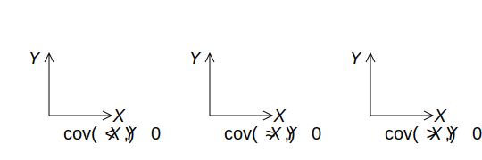

## 马尔可夫不等式（Markov's Inequality）

### 定义

> 亦称为切比雪夫第一不等式（the first Chebyshev's Inequality）

!!! info 马尔可夫不等式
    设 $X$ 是一个非负随机变量，那么对于任意 $a > 0$，有
    $$
    \Pr(X \ge a) \le \frac{\mathbb{E}[X]}{a}
    $$
    
    <!-- {{{ 用「指示」（indicator）证明 -->
    

    
用「指示」（indicator）证明

    
    令 $I = I(X \ge a)$。因为 $X \ge 0, a > 0$，有
    $$
    I \le \left\lfloor \dfrac{X}{a} \right\rfloor \le \dfrac{X}{a}
    $$
    
    从而
    $$
    \Pr(X \ge a) = \mathbb{E}[I] \le \mathbb{E}\left[\dfrac{X}{a}\right] = \dfrac{\mathbb{E}[X]}{a}
    $$

    

    <!-- }}} -->

    <!-- {{{ 用全期望证明 -->
    

    
用全期望证明

    $$
    \begin{aligned}
        \mathbb{E}[X] &= \mathbb{E}[X \mid X \ge a] \cdot \Pr(X \ge a) + \mathbb{E}[X \mid X < a] \cdot \Pr(X < a)\\
        &\ge a \cdot \Pr(X \ge a) + 0 \cdot \Pr(X < a)\\ 
        &= a \cdot \Pr(X \ge a)
    \end{aligned}
    $$
    
    从而有
    $$
    \Pr(X \ge a) \le \dfrac{\mathbb{E}[X]}{a}
    $$
    
    

    <!-- }}} -->

!!! note 推论
    对于任意 $c > 1$，有
    $$
    \Pr(X \ge c \mathbb{E}[X]) \le \dfrac{1}{c}
    $$

!!! note Tight in the worst case (最坏情况下的紧确性)
    任意 $c > 1, \mu \in \R$，存在期望为 $\mu$ 的非负随机变量 $X$ 使得 $\Pr(X \ge c \mu) = \dfrac{1}{c}$。

!!! note lower tail variant (下尾变式)
    > 有时也称为逆马尔可夫不等式
    
    $$
    \Pr(X \le a) \le  \dfrac{u - \mathbb{E}[X]}{u - a}
    $$
    
    其中要求 $X$ 有界，$X \le u$。

    <!-- {{{ 证明 -->
    

    
证明

    
    考虑随机变量 $Y = u - X$，则 $Y \ge 0$。由马尔可夫不等式有
    $$
    \Pr(X \le a) = \Pr(Y \ge u - a) \le \dfrac{\mathbb{E}[Y]}{u - a} = \dfrac{u - \mathbb{E}[X]}{u - a}
    $$

    

    <!-- }}} -->

### 从拉斯维加斯到蒙特卡洛

- 蒙特拉洛算法：一个随机算法。
- 拉斯维加斯算法：一个确定性算法，但是有一个随机的运行时间。

若有一个拉斯维加斯算法 $\mathscr{A}$，其对于任意大小为 $n$ 的输入，运行时间最大为 $t(n)$（算法 $\mathscr{A}$ 有着最坏预期时间复杂度 $t(n)$）。

算法 $\mathscr{B}$ 是一个蒙特卡洛算法，其模拟算法 $\mathscr{A}$ 至多 $\left\lceil \frac{t(n)}{\varepsilon} \right\rceil$ 步，若算法 $\mathscr{A}$ 终止，则算法 $\mathscr{B}$ 返回 $\mathscr{A}$ 的结果，否则返回任意答案。

则算法 $\mathscr{B}$ 最坏情况运行时间 $\le \left\lceil \frac{t(n)}{\epsilon} \right\rceil$，同时正确概率
$$
\begin{aligned}
    p &= 1 - \Pr\left(t \ge \tfrac{t(n)}{\varepsilon}\right)\\ 
    &\ge 1 - \dfrac{\varepsilon\mathbb{E}[t]}{t(n)}\\ 
    &= 1 - \varepsilon
\end{aligned}
$$

### 随机图中的团

!!! info 团（clique）
    顶点集 $C$ 被称为无向图 $G=(V,E)$ 的**团**（clique），如果 $C$ 是顶点集 $V$ 的子集（$C \subseteq V$），而且任意两个 $C$ 中的顶点都有边连接。即 $C$ 诱导的子图是完全图。

对于随机图 $G(n, p)$[^random_graph]，固定一个常整数 $k \ge 3$，令随机变量 $X$ 是随机图 $G \sim G(n, p)$ 中 $k$-团（$K_{k}$）的个数。

[^random_graph]: 在 $n$ 个顶点中，任意点对 $u, v$，边 $(u, v)$ 以概率 $p$ 独立地存在。

对于每个不同的 $S \subseteq [n]$，其中 $|S| = k$，令 $I_S = I(K_S \subseteq G)$，于是有
- $\mathbb{E}[I_S] = \Pr(K_S \subseteq G) = p^{\binom{k}{2}}$
- $X = \displaystyle \sum_{S \in \binom{[n]}{k}} I_S$

根据线性性有
$$
\begin{aligned}
    \mathbb{E}[X] &= \dbinom{n}{k} p^{\binom{k}{2}}\\
    &\le n^{k} p^{\frac{k(k-1)}{2}}\\
    &= o(1)
\end{aligned}
$$
对于 $p = o\left(n^{-\frac{2}{k-1}}\right)$。

根据马尔可夫不等式有 $\Pr(X \ge 1) \le \mathbb{E}[X] = o(1)$，即 $\Pr(X = 0) \ge 1 - o(1)$。

也就是说，若 $p = o\left(n^{-\frac{2}{k-1}}\right)$，那么 $G(n, p)$ 是**渐进几乎必然**（asymptotically almost surely, **a.a.s.**）不含 $k$-团（$K_{k}$-free）。

### 一般化（generalized）马尔可夫不等式

!!! info 一般化马尔可夫不等式
    设 $X$ 是一个随机变量，$f\colon \R \to \R_{\ge 0}$ 是一个非负函数，那么对于任意 $a > 0$，有
    $$
    \Pr(f(X) \ge a) \le \dfrac{\mathbb{E}[f(X)]}{a}
    $$

    <!-- {{{ 证明 -->
    

    
证明

    令 $Y = f(X)$，则 $Y$ 是一个非负随机变量。代入马尔可夫不等式。

    

    <!-- }}} -->

## 方差与矩

### 离差不等式（Deviation Inequality）

令 $X$ 是一个均值为 $\mu = \mathbb{E}[X]$ 的随机变量。对于任意 $a > 0$，应用马尔可夫不等式，令 $Y = |X - \mu| $，得到
$$
\Pr(|X - \mu| \ge a) \le \dfrac{\mathbb{E}[|X - \mu|]}{a}
$$

但是绝对值并不好处理。于是改令 $Y = (X - \mu)^2$，得到
$$
\begin{aligned}
    \Pr(|X - \mu| \ge a) &= \Pr[(X - \mu)^2 \ge a^2]\\
    &\le \dfrac{\mathbb{E}[(X - \mu)^2]}{a^2}\\
\end{aligned}
$$

$\mathbb{E}[(X - \mu)^2]$ 就是**方差**（variance），又称为**二阶中心矩**（2nd central moment）。

### 矩（moment）

!!! info 矩（moment）
    对于正整数 $k$，随机变量 $X$ 的 **$k$ 阶矩**（$k$-th moment）为 $\mathbb{E}[X^k]$，而 **$k$ 阶中心矩**（$k$-th central moment）为 $\mathbb{E}[(X - \mathbb{E}[X])^k]$。

随机变量 $X$ 称为**中心化的**（centralized），若 $\mathbb{E}[X] = 0$。随机变量 $X$ 可以通过 $Y = X - \mathbb{E}[X]$ 进行中心化。

!!! info 方差与标准差
    随机变量 $X$ 的[**方差**](#方差)（variance）就是其二阶中心矩，即
    $$
    \operatorname{Var}[X] = \mathbb{E}[(X - \mathbb{E}[X])^2]
    $$
    
    方差的平方根称为**标准差**（standard deviation）。记为 $\sigma = \sigma[X] = \sqrt{\operatorname{Var}[X]}$。

### 切比雪夫不等式（Chebyshev's Inequality）

!!! info 切比雪夫不等式
    设 $X$ 是一个随机变量，$\mu = \mathbb{E}[X]$ 是其均值，$\sigma^2 = \operatorname{Var}[X]$ 是其方差。那么对于任意 $a > 0$，有
    $$
    \Pr(|X - \mu| \ge a) \le \dfrac{\sigma^2}{a^2}
    $$

    <!-- {{{ 证明 -->
    

    
证明

    令 $Y = (X - \mu)^2$，则 $Y$ 是一个非负随机变量。代入马尔可夫不等式。

    

    <!-- }}} -->

!!! note 推论
    对于标准差 $\sigma$ 与任意 $k \ge 1$，有
    $$
    \Pr(|X - \mu| \ge k \sigma) \le \dfrac{1}{k^2}
    $$

切比雪夫不等式也有最坏情况的紧确性。对任意 $k \ge 1,\, \mu \in \R,\, \sigma > 0$，总存在随机变量 $X$ 满足 $\mathbb{E}[X] = \mu,\, \operatorname{Var}[X] = \sigma^2$ 使得 $\Pr(| X - \mu| \ge k \sigma) = \dfrac{1}{k^2}$。

## 中位数与均值

!!! info 中位数
    随机变量 $X$ 的**中位数**（median）是一个实数 $m$，使得[^st]
    $$
    \Pr(X \le m) \ge \dfrac{1}{2} \quad \text{and} \quad \Pr(X \ge m) \ge \dfrac{1}{2}
    $$

    [^st]: **s**hǐ **t**hé，笑。

!!! note ""
    期望 $\mu = \mathbb{E}[X]$ 是使得 $\mathbb{E}[(X - \mu)^2]$ 最小的值。

    <!-- {{{ 证明 -->
    

    
证明

    
    $$
    \begin{aligned}
        f(x) &= \mathbb{E}[(X - x)^2]\\
        &= \mathbb{E}[X^2] - 2x \mathbb{E}[X] + x^2\\ 
    \end{aligned}
    $$
    
    是一个关于 $x$ 的二次函数，其最小值在 $x = \mu$ 处取得。
    
    

    <!-- }}} -->

!!! note ""
    中位数是使得 $\mathbb{E}[|X - m|]$ 最小的值。

    <!-- {{{ 证明 -->
    

    
证明

    
    根据对称性，假设一个非中位数 $y > m$，那么有 $\Pr(X \ge y) < \dfrac{1}{2}$，于是
    $$
    \begin{aligned}
        \mathbb{E}[|X - y| - |X - m|] &= \textcolor{da6904}{(m-y)\Pr(X \ge y) + \sum_{m < x < y}(m + y - 2x) \Pr(X = x)} + \textcolor{05aa94}{(y - m) \Pr(X \le m)}\\
        &> \textcolor{da6904}{\dfrac{m-y}{2}} + \textcolor{05aa94}{\dfrac{y-m}{2}}\\
        &= 0
    \end{aligned}
    $$
    
    

    <!-- }}} -->

!!! note ""
    若随机变量 $X$ 有着有限期望 $\mu$、中位数 $m$ 与标准差 $\sigma$，则有
    $$
    | \mu - m | \le \sigma
    $$
    
    <!-- {{{ 证明 -->
    

    
证明

    
    $$
    \begin{aligned}
        |\mu - m| &= |\mathbb{E}[X] - m|\\ 
        &= |\mathbb{E}[X - m]|\\ 
        &\le \mathbb{E}[|X - m|] & \text{（琴生不等式）}\\ 
        &\le \mathbb{E}[|X - \mu|]  &\text{（中位数最小化上式）}\\
        &= \mathbb{E}\left[ \sqrt{(X - \mu)^2} \right] \\
        &\le \sqrt{\mathbb{E}[(X - \mu)^2]} &\text{（琴生不等式）}\\ 
        &= \sigma
    \end{aligned}
    $$
    
    

    <!-- }}} -->

## 方差

### 性质

!!! note ""
    $$
    \operatorname{Var}[X] = \mathbb{E}[X^2] - \mathbb{E}[X]^2
    $$
    
    <!-- {{{ 证明 -->
    

    
证明

    
    $$
    \begin{aligned}
        \operatorname{Var}[X] &= \mathbb{E}[(X - \mathbb{E}[X])^2]\\
        &= \mathbb{E}[X^2 - 2X\mathbb{E}[X] + \mathbb{E}[X]^2]\\
        &= \mathbb{E}[X^2] - 2\mathbb{E}[X]\mathbb{E}[X] + \mathbb{E}[X]^2\\
        &= \mathbb{E}[X^2] - \mathbb{E}[X]^2
    \end{aligned}
    $$
    
    

    <!-- }}} -->

!!! note ""
    对于随机变量 $X, Y$ 与实数 $a \in \R$，有
    - $\operatorname{Var}[a] = 0$ 
    - $\operatorname{Var}[X+a] = \operatorname{Var}[X]$（方差是中心距）
    - $\operatorname{Var}[aX] = a^2 \operatorname{Var}[X]$（方差是二次的，即 quadratic）
    - $\operatorname{Var}[X+Y] = \operatorname{Var}[X] + \operatorname{Var}[Y] + 2(\textcolor{FF0099}{\mathbb{E}[XY] - \mathbb{E}[X]\mathbb{E}[Y]})$

    彩色部分即为**协方差**（covariance）。

    <!-- {{{ 第四点的证明 -->
    

    
第四点的证明

    
    $$
    \begin{aligned}
        \operatorname{Var}[X + Y] &= \mathbb{E}[(X + Y)^2] - \mathbb{E}[X + Y]^2\\ 
        &= \mathbb{E}[X^2 + 2XY + Y^2] - (\mathbb{E}[X] + \mathbb{E}[Y])^2\\ 
        &= (\mathbb{E}[X^2] - \mathbb{E}[X]^2) + (\mathbb{E}[Y^2] - \mathbb{E}[Y]^2) + 2(\mathbb{E}[XY] - \mathbb{E}[X]\mathbb{E}[Y])\\ 
        &= \operatorname{Var}[X] + \operatorname{Var}[Y] + 2(\mathbb{E}[XY] - \mathbb{E}[X]\mathbb{E}[Y])
    \end{aligned}
    $$
    
    

    <!-- }}} -->

### 协方差

!!! info ""
    随机变量 $X, Y$ 的**协方差**（covariance）定义为
    $$
    \begin{aligned}
        \operatorname{Cov}(X, Y) &= \mathbb{E}[(X - \mathbb{E}[X])(Y - \mathbb{E}[Y])]\\
        &= \mathbb{E}[XY] - \mathbb{E}[X]\mathbb{E}[Y]
    \end{aligned}
    $$

    

!!! note ""
    - $\operatorname{Var}[X] = \operatorname{Cov}(X, X)$
    - 对称性：$\operatorname{Cov}(X, Y) = \operatorname{Cov}(Y, X)$
    - 分配性：$\operatorname{Cov}(X, Y + Z) = \operatorname{Cov}(X, Y) + \operatorname{Cov}(X, Z)$
    - 线性性：$\operatorname{Cov}(aX, Y) = a \operatorname{Cov}(X, Y)$

!!! note ""
    若 $X, Y$ 独立，则 $\operatorname{Cov}(X, Y) = 0$。

!!! note ""
    若随机变量 $X_1, X_2, \dots, X_n$ 相互独立，则
    $$
    \mathbb{E}\left[ \prod_{i=1}^{n}X_i \right] = \prod_{i=1}^{n}\mathbb{E}[X_i]
    $$
    
    <!-- {{{ 证明 -->
    

    
证明

    
    运用 LOTUS
    $$
    \begin{aligned}
        \mathbb{E}[XY] &= \sum_{x, y} xy \Pr[X = x \cap Y = y]\\
        &= \sum_{x, y} x y \Pr[X = x] \Pr[Y = y]\\
        &= \left( \sum_{x} x \Pr[X = x] \right) \left( \sum_{y} y \Pr[Y = y] \right)\\ 
        &= \mathbb{E}[X] \mathbb{E}[Y]
    \end{aligned}
    $$
    
    

    <!-- }}} -->

### 期望的乘积

!!! info 柯西-施瓦茨不等式（Cauchy-Schwarz Inequality）
    对于任意两个随机变量 $X, Y$，有
    $$
    \mathbb{E}[XY]^2 \le \mathbb{E}[X^2] \mathbb{E}[Y^2]
    $$

    <!-- {{{ 证明 -->
    

    
证明

    考虑离散的情形，定义
    $$
    \left\lbrace\begin{aligned}
        u_{x, y} &= \sqrt{p(x, y)} x\\
        v_{x, y} &= \sqrt{p(x, y)} y
    \end{aligned}\right.
    $$
    
    其中 $p(x, y) = \Pr[X = x \cap Y = y]$。则有
    $$
    \begin{aligned}
        \left( \sum_{x, y}p(x, y)xy \right)^2 &\le \left( \sum_{x, y}p(x, y)x^2 \right) \left( \sum_{x, y}p(x, y)y^2 \right)\\
    \end{aligned}
    $$
    
    即
    $$
    \mathbb{E}[XY]^2 \le \mathbb{E}[X^2] \mathbb{E}[Y^2]
    $$

    

    <!-- }}} -->

其还有两种形式：

!!! note ""
    对任意 $\vec{u}, \vec{v} \in \R^n$，有
    $$
    \left\langle \vec{u}, \vec{r} \right\rangle^2 \le \left\lVert \vec{u} \right\rVert_2^2 \cdot \left\lVert \vec{v} \right\rVert_2^2
    $$

!!! note ""
    $$
    \left( \sum_i u_i v_i \right)^2 \le \left( \sum_i u_i^2 \right) \left( \sum_i v_i^2 \right)
    $$

!!! info 赫尔德不等式（Hölder's Inequality）
    对于任意两个随机变量 $X, Y$ 与 $p, q > 0$ 且 $\dfrac{1}{p} + \dfrac{1}{q} = 1$，有
    $$
    \mathbb{E}[|XY|] \le \left( \mathbb{E}[|X|^p] \right)^{\frac{1}{p}} \left( \mathbb{E}[|Y|^q] \right)^{\frac{1}{q}}
    $$

    <!-- {{{ 证明 1 --> 
    

    
证明 1

    令 $f(x) = x^{\frac{1}{p}}$ 与 $g(x) = x^{\frac{1}{q}}$，则 $f, g$ 是凸函数。根据琴生不等式有
    $$
    \begin{aligned}
        \mathbb{E}[|XY|] &= \mathbb{E}[|f(|X|^p)g(|Y|^q)|]\\
        &\le \mathbb{E}[f(|X|^p)] \cdot \mathbb{E}[g(|Y|^q)]\\
        &= f(\mathbb{E}[|X|^p]) \cdot g(\mathbb{E}[|Y|^q])\\
        &= \left( \mathbb{E}[|X|^p] \right)^{\frac{1}{p}} \left( \mathbb{E}[|Y|^q] \right)^{\frac{1}{q}}
    \end{aligned}
    $$
    
    

    <!-- }}} -->

    <!-- {{{ 证明 2 -->
    

    
证明 2

    
    先证明「杨氏不等式」（Young's Inequality）：对于任意 $x, y > 0$ 与 $p, q > 0$ 且 $\dfrac{1}{p} + \dfrac{1}{q} = 1$，有
    $$
    xy \le \dfrac{x^p}{p} + \dfrac{y^q}{q}
    $$
    
    记 $t = \dfrac{1}{p}$，有
    $$
    \begin{aligned}
        \ln \left( t x^p + (1-t)y^q \right) &\ge t \ln x^p + (1-t) \ln y^q\\ 
        &= pt \ln x + q(1-t) \ln y\\ 
        &= \ln x + \ln y\\
        &= \ln xy
    \end{aligned}
    $$
    
    得证。

    类似地，令
    $$
    \left\lbrace\begin{aligned}
        u_i &= \dfrac{x_i}{\left( \sum\limits_i x_i^p \right)^{\frac{1}{p} }}\\
        v_i &= \dfrac{y_i}{\left( \sum\limits_i y_i^q \right)^{\frac{1}{q} }}
    \end{aligned}\right.
    $$

    于是
    $$
    \begin{aligned}
        \sum_i u_i v_i &\le \sum_i \dfrac{x_i^p}{p \left( \sum\limits_i x_i^p \right)} + \sum_i \dfrac{y_i^q}{q \left( \sum\limits_i y_i^q \right)}\\ 
        &= \dfrac{1}{p} + \dfrac{1}{q}\\
        &= 1
    \end{aligned}
    $$
    
    

    <!-- }}} -->

另一种形式就是

!!! note ""
    对任意 $\vec{u}, \vec{v} \in \R^n$ 与 $p, q > 0$ 且 $\dfrac{1}{p} + \dfrac{1}{q} = 1$，有
    $$
    \left\lvert \left\langle \vec{u}, \vec{v} \right\rangle \right\rvert \le \left\lVert \vec{u} \right\rVert_p \cdot \left\lVert \vec{v} \right\rVert_q
    $$

### 相关性

当随机变量等比例变化时，其方差会按照比例的平方变化。因此有标准化的协方差，即「相关系数」。

!!! info 相关系数（correlation coefficient）
    随机变量 $X, Y$ 的**相关系数**（correlation coefficient）定义为
    $$
    \rho(X, Y) = \dfrac{\operatorname{Cov}(X, Y)}{\sqrt{\operatorname{Var}[X] \operatorname{Var}[Y]}}
    $$

    其中 $\rho(X, Y) \in [-1, 1]$。

两个随机变量 $X, Y$ 被称为**不相关**（uncorrelated），当且仅当 $\rho(X, Y) = 0$，即 $\operatorname{Cov}(X, Y) = 0$。

### 方差的和

!!! note ""
    对于随机变量 $X, Y$，有
    $$
    \operatorname{Var}[X + Y] = \operatorname{Var}[X] + \operatorname{Var}[Y] + 2\operatorname{Cov}(X, Y)
    $$

!!! note ""
    对于随机变量 $X_1, X_2, \dots, X_n$，有
    $$
    \begin{aligned}
        \operatorname{Var}\left[ \sum_{i=1}^{n}X_i \right] &= \sum_{i=1}^{n}\operatorname{Var}[X_i] + \sum_{i \ne j}\operatorname{Cov}(X_i, X_j)\\
        &= \sum_{i=1}^{n}\operatorname{Var}[X_i] + 2\sum_{i < j}\operatorname{Cov}(X_i, X_j)
    \end{aligned}
    $$

!!! note ""
    对于<u>成对独立</u>的随机变量 $X_1, X_2, \dots, X_n$，有
    $$
    \operatorname{Var}\left[ \sum_{i=1}^{n}X_i \right] = \sum_{i=1}^{n}\operatorname{Var}[X_i]
    $$

### 常见分布的方差

#### 指示函数

!!! info ""
    对于以 $p$ 为参数的伯努利随机变量 $X \in \left\lbrace 0, 1 \right\rbrace$ 有
    $$
    \operatorname{Var}[X] = p(1-p)
    $$
    
    <!-- {{{ 证明 -->
    

    
证明

    
    有 $X^2 = X$，故
    $$
    \begin{aligned}
        \operatorname{Var}[X] &= \mathbb{E}[X^2] - \mathbb{E}[X]^2\\
        &= p - p^2\\
        &= p(1-p)
    \end{aligned}
    $$
    
    

    <!-- }}} -->

!!! note ""
    对于事件 $A$ 的指示随机变量 $X = I(A)$ 有
    $$
    \operatorname{Var}[X] = \Pr(A)\Pr(A^c)
    $$

#### 离散均匀分布的方差

!!! info ""
    对整数 $a \le b$，令 $X$ 是从 $[a, b]$ 中均匀随机（u.a.r.）抽取的值，有
    $$
    \operatorname{Var}[X] = \dfrac{(b-a)(b-a+2)}{12}
    $$

    <!-- {{{ 证明 -->
    

    
证明

    
    $$
    \left\lbrace\begin{aligned}
        \mathbb{E}[X] &= \sum_{k=a}^b \dfrac{k}{b-a+1} &= \dfrac{a+b}{2}\\
        \mathbb{E}[X^2] &= \sum_{k=a}^b \dfrac{k^2}{b-a+1} &= \dfrac{2b^2 + 2ab + 2a^2 + b-a}{6}\\ 
    \end{aligned}\right.
    $$
    
    

    <!-- }}} -->

#### 几何分布

!!! info ""
    对于几何随机变量 $X \sim \operatorname{Geo}(p)$，有
    $$
    \operatorname{Var}[X] = \dfrac{1-p}{p^2}
    $$
    
    <!-- {{{ 证明 -->
    

    
证明

    
    $\mathbb{E}[X] = \dfrac{1}{p}$。

    利用几何分布的无记忆性，有
    $$
    \begin{aligned}
        \mathbb{E}[X^2] &= \mathbb{E}[X^2 \mid X > 1] \cdot (1-p) + \mathbb{E}[X^2 \mid X  =1]\cdot p\\
        &= \mathbb{E}[((X-1)+1)^2 \mid X > 1]\cdot (1-p) + p\\
        &= (1-p)\sum_{k\ge 1}\Pr[X = (k - 1) + 1 \mid X > 1]\cdot x^2 + p \\
        &= (1-p)\sum_{k\ge 1}\Pr[X = k](k+1)^2+p\\
        &= \mathbb{E}[(X+1)^2]\cdot (1-p) + p\\
        &= (1-p)\mathbb{E}[X^2] + \dfrac{2(1-p)}{p} + 1
    \end{aligned}
    $$
    
    可得 $\mathbb{E}[X^2] = \dfrac{2-p}{p^2}$。

    【待修正】：上面过程要再检查一下。
    
    

    <!-- }}} -->

#### 二项分布

!!! info ""
    对于二项随机变量 $X \sim \operatorname{Bin}(n, p)$，有
    $$
    \operatorname{Var}[X] = np(1-p)
    $$
    
    <!-- {{{ 证明 -->
    

    
证明

    
    $X \sim \operatorname{Bin}(n, p)$ 可以表示为 $X = X_1 + X_2 + \dots + X_n$，其中 $X_i$ 是以 $p$ 为参数的 i.i.d. 伯努利随机变量。

    而对于相互独立的随机变量 $X_1, X_2, \dots, X_n$，有
    $$
    \operatorname{Var}\left[ \sum_{i=1}^{n}X_i \right] = \sum_{i=1}^{n}\operatorname{Var}[X_i] = np(1-p)
    $$
    
    

    <!-- }}} -->

#### 泊松分布

!!! info ""
    对于泊松随机变量 $X \sim \operatorname{Pois}(\lambda)$，有
    $$
    \operatorname{Var}[X] = \lambda
    $$

    <!-- {{{ 证明 -->
    

    
证明

    
    $\mathbb{E}[X] = \lambda^2$。

    同时有
    $$
    \begin{aligned}
        \mathbb{E}[X^2] &= \sum_{k\ge 0}k^2 \dfrac{\e^{-\lambda}\lambda^{k}}{k!}\\
        &= \sum_{k\ge 1}k \dfrac{\e^{-\lambda}\lambda^{k}}{(k-1)!}\\ 
        &= \sum_{k\ge 0}(k+1) \dfrac{\e^{-\lambda}\lambda^{k+1}}{k!}\\ 
        &= \lambda \sum_{k\ge 0}(k+1) \dfrac{\e^{-\lambda}\lambda^{k}}{k!}\\ 
        &= \lambda \mathbb{E}[X + 1]\\
        &= \lambda(\mathbb{E}[X] + 1)\\
        &= \lambda(\lambda + 1)
    \end{aligned}
    $$

    于是
    $$
    \operatorname{Var}[X] = \mathbb{E}[X^2] - \mathbb{E}[X]^2 = \lambda
    $$
    
    

    <!-- }}} -->

#### 负二项分布

!!! info ""
    对于以 $r, p$ 为参数的负二项随机变量 $X$，有
    $$
    \operatorname{Var}[X] = \dfrac{r(1-p)}{p^2}
    $$
    
    <!-- {{{ 证明 -->
    

    
证明

    
    $X$ 可以表示为 $X = (X_1 - 1) + (X_2 - 1) + \dots + (X_r - 1)$，其中 $X_i$ 是以 $p$ 为参数的 i.i.d. 几何随机变量。

    而对于相互独立的随机变量 $X_1, X_2, \dots, X_r$，有
    $$
    \begin{aligned}
        \operatorname{Var}[X] &= \sum_{i=1}^{r}\operatorname{Var} [X_i - 1]\\ 
        &= \sum_{i=1}^{r}\operatorname{Var} [X_i]\\ 
        &= \dfrac{r(1-p)}{p^2}
    \end{aligned}
    $$
    
    

    <!-- }}} -->

## 切比雪夫不等式

### 无偏估计（Unbiased Estimator）

令 $X_1, \dots, X_i$ 是 i.i.d. 随机变量，$\mathbb{E}[X_i] = \mu, \operatorname{Var}[X,i] = \sigma^2$。

Empirical mean (经验均值) $\bar{X} = \dfrac{1}{n}\sum_{i=1}^{n}X_i$ 是 $\mu$ 的无偏估计，有
$$
\begin{aligned}
    \mathbb{E}[\bar{X}] &= \dfrac{1}{n}\sum_{i=1}^{n}\mathbb{E}[X_i]\\ 
    &= \mu
\end{aligned}
$$
与
$$
\begin{aligned}
    \operatorname{Var}[\bar{X}] &= \dfrac{1}{n^2}\sum_{i=1}^{n}\operatorname{Var}[X_i]\\ 
    &= \dfrac{\sigma^2}{n}
\end{aligned}
$$

切比雪夫不等式有
$$
\begin{aligned}
    \Pr(|\bar{X} - \mu| \ge \epsilon \mu) &\le  \dfrac{\operatorname{Var} [\bar{X}]}{\epsilon^2 \mu^2}\\
    &= \dfrac{\sigma^2}{\epsilon^2 \mu^2 n}\\
    &\le \delta
\end{aligned}
$$
当且仅当 $n \ge \dfrac{\sigma^2}{\epsilon^2 \mu^2 \delta}$。

### (one-sided) Error Reduction（单侧误差减小）

对于一个决定（decision）问题 $f\colon \left\lbrace 0, 1 \right\rbrace^{*} \to \left\lbrace 0, 1 \right\rbrace$。

蒙特卡洛随机算法 $\mathscr{A}$ 有着单侧误差：对于任意输入 $x$ 与均匀随机种子（seed）$r \in [p]$，其中 $p$ 是素数，有
- $f(x) = 1 \implies \Pr[\mathscr{A}(x, r) = 1] \ge \epsilon$ 
- $f(x) = 0 \implies \mathscr{A}(x, r) = 0$ 对任意 $r \in [p]$ 成立

对于 $k$ 个（相互）独立的种子 $r_1, \dots, r_{k} \in [p]$，$\mathscr{A}^{k}(x, r_1, \dots, r_{k}) = \bigvee_{i=1}^{k}\mathscr{A}(x, r_i)$，有
$$
f(x) = 1 \implies \Pr[\mathscr{A}(x, r_1, \dots, r_{k}) = 0] \le (1 - \epsilon)^k
$$

### Two-Point Sampling (2-Universal Hashing)

令 $p$ 为一个素数，且 $[p] = \left\lbrace 0, 1, \dots, p-1 \right\rbrace$。

均匀随机从 $[p]$ 中选取 $a, b$，并令 $r_i = (a\cdot i + b) \bmod p$，其中 $i=1, \dots, p$ 
- $r_1, \dots, r_p \in [p]$ 是成对独立的
- 每个 $r_i$ 都是在 $[p]$ 上均匀分布对[^ot_2_universal_hashing]

[^ot_2_universal_hashing]: each $r_i$ is <u>uniformly distributed</u> over $[p]$.

<!-- {{{ 证明 -->

证明

对任意 $i \ne j$ 与 $c, d \in [p]$，有 $\Pr[r_i = c \cap r_j = d] = \dfrac{1}{p^2}$，因为
$$
\left\lbrace\begin{aligned}
    a \cdot i + b \equiv c \pmod{p}\\ 
    a \cdot j + b \equiv d \pmod{p}
\end{aligned}\right.
$$
有一个唯一解（unique solution）$(a, b) \in [p]^2$。则
$$
\begin{aligned}
    \Pr[r_i = c] &= \Pr[a \cdot i + b \equiv c \pmod{p}]\\ 
    &= \dfrac{1}{p} \sum_{a \in [p]}\Pr(b \equiv c - ai \pmod{p})\\ 
    &= \dfrac{1}{p}
\end{aligned}
$$

<!-- }}} -->

### Derandomization with Two-Point Sampling (两点采样的去随机化)

还是上面的，我要累死了。

- $\mathscr{A}$：对任意输入 $x$ 与均匀随机种子 $r \in [p]$ 有
    - $f(x) = 1 \implies \Pr[\mathscr{A}(x, r) = 1] \ge \epsilon$ 
    - $f(x) = 0 \implies \mathscr{A}(x, r) = 0$ 对任意 $r \in [p]$ 成立
- $\mathscr{A}^{k}(x, r_1, \dots, r_{k}) = \bigvee_{i=1}^{k}\mathscr{A}(x, r_i)$：$k \le p$，种子 $r_i$ 是由 $(a \cdot i + b) \bmod{p}$ 生成的，其中 $a, b \in [a, b]$ 均匀随机抽取[^ot_derandomization_2_point_sampling]
    - $f(x) = 0 \implies \mathscr{A}^{k}(x, r_1, \dots, r_{k}) = \bigvee_{i=1}^{k}\mathscr{A}(x, r_i) = 0$
    - $f(x) = 1 \implies \Pr[\mathscr{A}(x, r_1, \dots, r_{k}) = 0] \le (1 - \epsilon)^k$

[^ot_derandomization_2_point_sampling]: $r_i = (a \cdot i + b) \bmod p$ with uniform $a, b \in [p]$.

令 $X_i = \mathscr{A}(x, r_i)$，同时 $X = \displaystyle \sum_{i=1}^{k}X_i$，则
- $X_1, \dots, X_{k}$ 是*成对独立*的伯努利随机变量，且 $\Pr[X_i = 1] \ge \epsilon$
- $\Pr[X = 0] = \Pr[\mathscr{A}^{k}(x, r_1, \dots, r_{k}) = 0] \le \Pr[|X - \mathbb{E}[X]| \ge \mathbb{E}[X]] \le  \dfrac{\operatorname{Var}[X]}{\mathbb{E}[X]^2} \le \dfrac{1}{\epsilon k}$ 
    - 期望的线性性质：$\mathbb{E}[X] = \displaystyle \sum_{i=1}^{k}\mathbb{E}[X_i] \ge \epsilon k$ 
    - 成对独立：$\operatorname{Var}[X] = \displaystyle \sum_{i=1}^{k} \operatorname{Var}[X,i] \le \sum_{i=1}^{k}\mathbb{E}[X_i^2] = \sum_{i=1}^{k} \mathbb{E}[X_i] = \mathbb{E}[Y]$

通过 $k\le p$ 次算法的运行（run），仅使用了总共两个随机种子，将任意单侧误差 $1-\epsilon$ 减小到了 $\dfrac{1}{\varepsilon k}$。

<!-- {{{ 补充内容（待施工） -->

补充内容（待施工）

### Min Sketch

> 输入：序列 $x_1, \dots, x_n \in U = [N]$
> 输出：$z = \left\lvert \left\lbrace x_1, \dots, x_n \right\rbrace \right\rvert$ 的*估计*

!!! info Simple Uniform Hash Assumption (SUHA)
    假设的哈希函数会将项目均匀地分布到散列表的槽中。

（理想）均匀哈希函数 $h\colon U \to[0, 1]$ 

得到 $\left\lbrace h(x_1), \dots, h(x_n) \right\rbrace$ 是 $z$ 个均匀独立的 $[0, 1]$ 中的值。

可以将 $[0, 1]$ 划分为 $z + 1$ 个子区间，其长度是*同分布*的（证明略）。

于是
$$
\begin{aligned}
    \mathbb{E}\left[ \min_{1\le i\le n}h(x_i) \right] &= \mathbb{E}[\text{子区间的长度}]\\
    &= \dfrac{1}{z + 1}
\end{aligned}
$$

对于一个估计 Min Sketch，令 $Y = \min\limits_{1\le i\le n}h(x_i)$，有
$$
\hat{Z} = \dfrac{1}{Y} - 1
$$

目标是
$$
\Pr[\hat{Z} < (1-\epsilon)z \lor \hat{Z} > (1+\epsilon)z] \le \delta
$$

假设 $\epsilon\le \dfrac{1}{2}$。

几何意义可以得到 $\Pr[Y > y] = (1-y)^z$，则概率密度函数 pdf 为 $p(y) = z (1-y)^{z-1}$，有
$$
\begin{aligned}
    \mathbb{E}[Y^2] &= \int_{0}^{1}y^2 z(1-y)^{z-1}\d y\\ 
    &= \dfrac{2}{(z+1)(z+2)}
\end{aligned}
$$

于是
$$
\begin{aligned}
    \operatorname{Var}[Y] &= \mathbb{E}[Y^2] - \mathbb{E}[Y]^2\\ 
    &= \dfrac{2}{(z+1)(z+2)} - \dfrac{1}{(z+1)^2}\\
    &= \dfrac{z}{(z+1)^2(z+2)}\\
    &\le \dfrac{1}{(z+1)^2}
\end{aligned}
$$

切比雪夫不等式有
$$
\Pr\left[ |Y - \mathbb{E}[Y] | \ge  \dfrac{\epsilon / 2}{z + 1} \right] \le \dfrac{4}{\epsilon^2}
$$

然而 $\epsilon \le \dfrac{1}{2}$，这个 sketch 估计是不准确的，原因在于其方差太大。

对于每个 $1 \le j \le k$，有
- $\mathbb{E}[Y_{j}] = \dfrac{1}{z + 1} \implies \mathbb{E}[\bar{Y}] = \dfrac{1}{z + 1}$ 
- $\operatorname{Var}[Y_{j}] \le \dfrac{1}{(z + 1)^2} \implies \operatorname{Var}[\bar{Y}] \le \dfrac{1}{k(z + 1)^2}$

同样使用切比雪夫不等式，有
$$
\Pr\left[ |\bar{Y} - \mathbb{E}[\bar{Y}] | \ge  \dfrac{\epsilon / 2}{z + 1} \right] \le \dfrac{4}{k\epsilon^2}
$$

因此

!!! note Min Sketch
    对每个 $1 \le j \le k$，令 $Y_{j} = \min\limits_{1\le i \le n}h_{j}(x_i)$，返回 $\hat{Z} = \dfrac{1}{Y} - 1$，其中 $\bar{Y} = \dfrac{1}{k}\displaystyle \sum_{j=1}^{k}Y_{j}$

    空间花费：$k = O\left(\dfrac{1}{\epsilon^2 \delta}\right)$ 

!!! memo ""
    上面记的比较残缺。【待补充】

<!-- }}} -->

### 魏尔施特拉斯逼近定理

!!! info 魏尔施特拉斯逼近定理（Weierstrass Approximation Theorem）
    任意连续函数 $f\colon [0, 1] \to [0, 1]$ 都可以被多项式逼近，即对任意 $\epsilon>0$，存在多项式 $p$ 使得
    $$
    \sup_{x \in [0, 1]} |p(x) - f(x)| \le \epsilon
    $$

    <!-- {{{ 证明 -->
    

    
证明

    
    令整数 $n$ 足够大（稍后固定）。

    对于 $x \in [0, 1]$，令 $X \sim \dfrac{1}{n} \operatorname{Bin}(n, x)$。定义 $x \in [0, 1]$ 上的多项式 $p$ 为
    $$
    \begin{aligned}
        p(x) &= \mathbb{E}[f(X)]\\
        &= \sum_{k=0}^{n} f\left( \dfrac{k}{n} \right) p_X(k)\\
        &= \dfrac{1}{n} \sum_{k=0}^{n} f\left( \dfrac{k}{n} \right) \binom{n}{k} x^k (1-x)^{n-k}
    \end{aligned}
    $$

    $f$ 在 $[0, 1]$ 上连续可得，存在 $\delta > 0$ 使得 $|f(x) - f(y)| \le \dfrac{\epsilon}{2}$ 对于任意 $x, y \in [0, 1]$ 且 $|x - y| \le \delta$ 成立。

    则
    $$
    \begin{aligned}
        |p(x) - f(x)| &= \left\lvert \mathbb{E}\left[ f(X) - f(x) \right]  \right\rvert\\
        &\le \mathbb{E}\left[ \left\lvert f(X) - f(x) \right\rvert \right]\\ 
        &= \textcolor{da6904}{\mathbb{E}\left[ \left\lvert f(X) - f(x) \right\rvert \Biggm| | X - x | \le \delta  \right]} \cdot \Pr\left(| X - x | \le \delta\right)\\
        &\phantom{=}+ \mathbb{E}\left[ \left\lvert f(X) - f(x) \right\rvert \Biggm| | X - x | > \delta  \right] \cdot \textcolor{05aa94}{\Pr\left(| X - x | > \delta\right)}\\ 
        &\le \textcolor{da6904}{\mathbb{E}\left[\frac{\epsilon}{2}\right]} + |1 - 0| \cdot \textcolor{05aa94}{\Pr\left(| X - x | > \delta\right)} &\text{（值域为 $[0, 1]$）}\\ 
        &\le \mathbb{E}\left[ \dfrac{\epsilon}{2} \right] + \dfrac{x(1-x)}{n \delta^2} &\text{（切比雪夫不等式）}\\
        &\le \dfrac{\epsilon}{2} + \dfrac{1}{4n \delta^2}
    \end{aligned}
    $$

    于是当我们令 $n \ge \dfrac{1}{2 \epsilon \delta^2}$ 时有 $|p(x) - f(x)| \le \epsilon$。
    
    

    <!-- }}} -->

## 高阶矩

### 偏度（Skewness）

!!! info 偏度（Skewness）
    随机变量 $X$ 的**偏度**（skewness）定义为
    $$
    \operatorname{Skew}[X] = \mathbb{E}\left[ \left( \dfrac{X - \mu}{\sigma} \right)^3  \right] =  \dfrac{\mathbb{E}[(X - \mu)^3]}{\sigma^3}
    $$

    其中 $\mu = \mathbb{E}[X], \sigma = \sqrt{\operatorname{Var}[X]}$。

    

偏度即*三阶中心矩*。

### 峰度（Kurtosis）

!!! info 峰度（Kurtosis）
    随机变量 $X$ 的**峰度**（kurtosis）定义为
    $$
    \operatorname{Kurt}[X] = \mathbb{E}\left[ \left( \dfrac{X - \mu}{\sigma} \right)^4  \right] =  \dfrac{\mathbb{E}[(X - \mu)^4]}{\sigma^4}
    $$

    其中 $\mu = \mathbb{E}[X], \sigma = \sqrt{\operatorname{Var}[X]}$。

峰度即*四阶中心矩*。

### The $k$-th Moment Method ($k$ 阶矩估计)

令 $X$ 是一个随机变量，其期望 $\mathbb{E}[X] = \mu$。对于任意 $C > 1$ 与整数 $k \ge 1$，有
$$
\begin{aligned}
    \Pr\left( |X - \mu| \ge C \cdot \mathbb{E}\left[ |X - \mu|^{k} \right] ^{\frac{1}{k}} \right) \le \dfrac{1}{C^k}
\end{aligned}
$$

证明只需令 $Z = |X - \mu|^{k}$，然后应用切比雪夫不等式：
$$
\begin{aligned}
    \Pr\left( |X - \mu| \ge C \cdot \mathbb{E}\left[ |X - \mu|^{k} \right] ^{\frac{1}{k}} \right) &= \Pr\left( Z \ge C^{k} \cdot \mathbb{E}[Z] \right)\\
    &\le \dfrac{1}{C^k}
\end{aligned}
$$

有**矩问题**（The Moment Problem）：是否矩序列 $m_{k} = \mathbb{E}X[^{k}],\, \forall k \ge 1$ 唯一地确定了一个随机变量 $X$ 的分布？

若随机变量 $X$ 从一个*有限*集 $\left\lbrace x_1, \cdots, x_n \right\rbrace$ 中取值，且 $p_X(x_i) = p_i$，同时有矩序列 $\left\lbrace m_i \right\rbrace$，那么可以通过解范德蒙德系统（Vandermonde system）
$$
\begin{bmatrix}
    x_1 & x_2 & \cdots & x_n \\
    x_1^2 & x_2^2 & \cdots & x_n^2 \\ 
    \vdots & \vdots & \ddots & \vdots\\ 
    x_1^n & x_2^n & \cdots & x_n^n
\end{bmatrix} \begin{bmatrix}
    p_1\\ 
    p_2\\ 
    \vdots\\ 
    p_n
\end{bmatrix} = \begin{bmatrix}
    m_1\\ 
    m_2\\ 
    \vdots\\ 
    m_n
\end{bmatrix}
$$
获得 $p_i = p_X(x_i)$，即恢复了概率密度函数 pmf。

!!! info ""
    若随机变量 $X, Y$ 有相同的**矩母函数**（moment generating function, MGF）
    $$
    M_X(t) = \mathbb{E}[\e^{tX}] = \sum_{k\ge 0} \dfrac{t^{k}\mathbb{E}[X^{k}]}{k!}
    $$
    则 $X, Y$ 有相同的分布。

MGF $M_X(t)$ 收敛，前提是序列 $\mathbb{E}[X^{k}]$「不要增长过快」。
