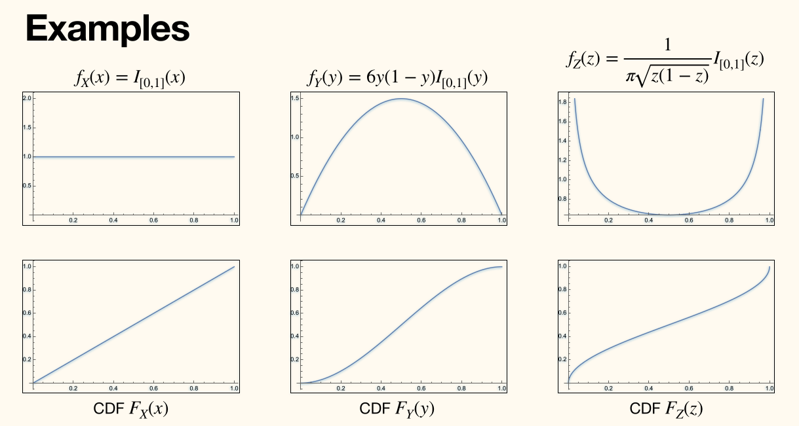
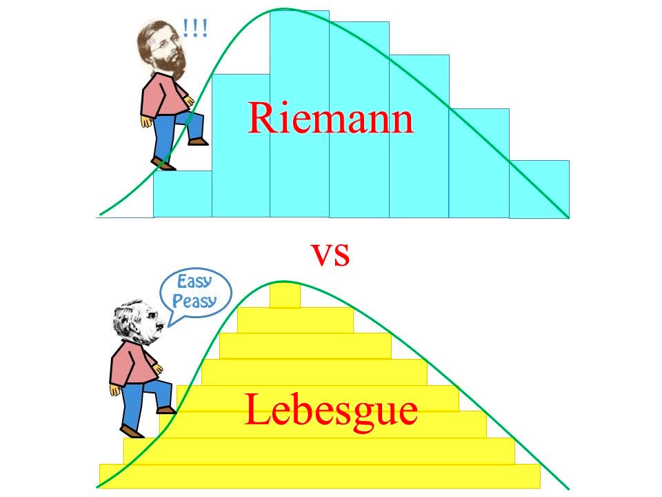

## 连续随机变量

有关随机变量的内容，可以参见[前面的笔记「随机变量」](04-random-variable)。

!!! info ""
    一个随机变量 $X\colon \Omega \to \R$ 是**连续**（continuous）的，若其累积分布函数 CDF 可以表示为
    $$
    F_X(x) = \Pr[X \le x] = \int_{-\infty}^x f_X(u) \d u
    $$
    的形式。其中 $f_X\colon \R \to [0, \infty )$ 是一个可积函数，称为 $X$ 的**概率密度函数**（probability density function, pdf）。

密度函数 $f$ 并不唯一由上式确定，概率密度函数实际上有无穷多个。

!!! note ""
    若 $F_X$ 可微（differentiable），一般取 $f_X(x) = F_X'(x)$。

对于连续随机变量 $X$，有（it holds that）
$$
\forall x \in \R,\, \Pr[X = x] = 0
$$

概率质量函数 pmf 是一个概率，概率密度函数 pdf *不是*概率，而是 proportion(density, 密度)
$$
\Pr[x < X \le X + \Delta x] = F_X(x + \Delta x) - F_x(x) \approx f_X(x) \Delta x
$$

!!! note ""
    $f_X$ 是一个连续随机变量 $X\colon \Omega \to \R$ 的 pdf 当且仅当
    $$
    \int_{-\infty}^\infty f_X(x) \d x = 1
    $$
    与 $\forall x \in \R,\, f_X(x) \ge 0$。

上面的 $I_{[0, 1]}$ 将自变量范围限制在了 $[0, 1]$ 中。

### 连续概率空间\*

令 $\mathscr{I}$[^this_is_i] 是 $\R$ 中全部开区间的集合，**博雷尔（Borel）$\sigma$-代数 $\mathscr{B}$**（Borel $\sigma$-field）是最小的包含 $\mathscr{I}$ 的 $\sigma$-代数。每个 $B \in \mathscr{B}$ 称为**博雷尔集**（Borel set），是一个对开区间由可数个 $\cap , \cup , \setminus$ 进行可数次操作得到的集合。

[^this_is_i]: 这是 I $\mathscr{I}$ `\mathscr{I}`，不是 F $\mathscr{F}$ `\mathscr{F}`。

对于博雷尔集 $B \in  \mathscr{B}$，勒贝格积分（Lebesgue integral）
$$
\mu(b) \coloneqq \Pr[X \in B] = \int_B f_X(x) \d x = \int_{-\infty}^\infty I_B(x) \d F_X(x)
$$
则 $(\R, \mathscr{B}, \mu)$ 是一个良定义的概率空间。

若 $g\colon \R \to \R$ 是**博雷尔可测**（Borel-measurable），即 $\forall y \in \R,\, \left\lbrace x \in \R \mid g(x) \le y \right\rbrace \in \mathscr{B}$，则 $g(X)$ 也是一个随机变量。

#### 勒贝格积分

> 这部分只是「科普性质」的「简单介绍」。

令 $(\R, \mathscr{B}, \mu)$ 是一个概率空间（测度空间）。

假设 $f$ 是（博雷尔）可测的，且非负，对于 $B \in \mathscr{B}$，定义
$$
f^{*}(t) \mu(\left\lbrace x \in B \mid f(x) > t \right\rbrace)
$$

**勒贝格积分**（Lebesgue integral）定义为
$$
\int_B f(x) \d \mu(x) = \int_0^\infty f^{*}(t) \d t
$$

对于一般的 $f$，可令 $f=f^{+}-f^{-}$，其中 $f^{+}, f^{-}$ 非负。

#### 病态（Pathological）例子

- 不可测集的例子
    - 维塔利集（Vitali set）：$V \subseteq [0, 1]$，包含每个有理数[陪集](/notes/D-discrete-mathematics/16-group-theory-introduction#陪集)的一个元素。
    - contains a single point from each coset of $\Q$ in $\R$
- 勒贝格可积但黎曼不可积的函数
    - 狄利克雷函数（Dirichlet function）：有理数的指示函数。
- $[0, 1]$ 的不可数子集，但测度为 0
    - 康托尔集（Cantor set）
    - 

### 联合分布

!!! info ""
    随机变量 $X, Y$ 的**联合分布函数**（joint distribution function）是函数 $F_{X, Y}\colon \R^2 \to [0, 1]$ 定义为
    $$
    F_{X, Y}(x, y) = \Pr[X \le x \cap Y \le y]
    $$

!!! note ""
    随机变量 $X, Y$ 是以**联合概率密度函数**（joint pdf）$f_{X, Y}\colon \R^2 \to[0, \infty )$ **（联合）连续**的（(jointly continuous)），若对任意 $x, y \in \R$ 有
    $$
    F_{X, Y}(x, y) = \int_{v=-\infty }^y \int_{u=-\infty }^x f_{X, Y}(u, v) \d u \d v
    $$

!!! note ""
    设 $F_{X, Y}$ 充分可微（sufficiently differentiable），则
    $$
    f_{X, Y}(x, y) = \frac{\partial^2}{\partial x \partial y} F_{X, Y}(x, y)
    $$

### 边缘分布

!!! info ""
    $X, Y$ 的**边缘分布函数**（marginal distribution function）为
    $$
    \begin{aligned}
        F_X(x) = \Pr[X \le x] = F_{X, Y}(x, \infty ) = \int_{-\infty }^x \int_{-\infty }^\infty f_{X, Y}(u, y) \d y \d u\\
        F_Y(y) = \Pr[Y \le y] = F_{X, Y}(\infty , y) = \int_{-\infty }^y \int_{-\infty }^\infty f_{X, Y}(x, v) \d x \d v
    \end{aligned}
    $$

!!! note ""
    $X, Y$ 的**边缘密度函数**（marginal density function）为
    $$
    \begin{aligned}
        f_X(x) = \int_{-\infty }^\infty f_{X, Y}(x, y) \d y\\ 
        f_Y(y) = \int_{-\infty }^\infty f_{X, Y}(x, y) \d x
    \end{aligned}
    $$

### 独立性

!!! info ""
    随机变量 $X, Y$ 是**独立**的（independent），若对任意 $x, y \in \R$ 有 $X \le x$ 与 $Y \le y$ 是独立事件，即
    $$
    F_{X, Y}(x, y) = F_X(x) F_Y(y)
    $$
    
    对于*连续*随机变量 $X, Y$，等价于
    $$
    f_{X, Y}(x, y) = f_X(x) f_Y(y)
    $$

对于博雷尔可测的 $g, h\colon \R \to \R$（即 $g(X), h(Y)$ 是随机变量），则 $X, Y$ 独立可以<u>推出</u> $g(X), h(Y)$ 也是独立的。
- 因为 $X$ 是 $\Sigma$-可测的，$g$ 是博雷尔可测的，于是 $g(X)$ 是 $\Sigma$-可测的。

### 条件分布

!!! info ""
    令 $X$ 是一个连续随机变量，$A$ 是一个事件，且 $\Pr(A) > 0$，则 $X$ 在 $A$ 条件下的**条件分布函数**（conditional distribution function）为
    $$
    F_{X\mid A}(x) = \Pr[X \le x \mid A] = \int_{-\infty }^x f_{X\mid A}(u) \d u
    $$
    其中密度函数 $f_{X\mid A} = \dfrac{\d F_{X \mid A}(x)}{\d x}$。

!!! note 全概率法则（离散）
    对于 $\Omega$ 的划分 $B_1, \dots, B_n$，且任意 $B_i$ 有 $\Pr(B_i) > 0$，有
    $$
    f_X(x) = \sum_{i=1}^n \Pr(B_i) f_{X \mid B_i}(x)
    $$
    
    <!-- {{{ 证明 -->
    

    
证明

    
    两边同时求导有
    $$
    \Pr[X \le x] = \sum_{i=1}^n \Pr(B_i) \Pr[X \le x \mid B_i]
    $$
    
    

    <!-- }}} -->

!!! info ""
    对于（联合）连续随机变量 $X, Y$，则 $X$ 在给定 $Y = y$ 条件下的**条件分布函数**为
    $$
    F_{X \mid Y}(x \mid y) = \Pr[X \le x \mid Y = y] = \int_{-\infty }^x \dfrac{f_{X, Y}(u, y)}{f_Y(y)} \d u
    $$

    ---
    
    这个*定义*是有意义的，因为
    $$
    \begin{aligned}
        \Pr[X \le x \mid y \le Y \le y + \d y] &= \dfrac{\Pr[X \le x \cap y \le Y \le y + \d y]}{\Pr[y \le Y \le y + \d y]}\\ 
        &= \dfrac{\int_{u=-\infty }^x f_{X, Y}(u, y)\d y \d u}{f_Y(y) \d y}\\
        &= \int_{u=-\infty }^x \dfrac{f_{X, Y}(u, y)}{f_Y(y)} \d u
    \end{aligned}
    $$

!!! info ""
    $F_{X \mid Y}$ 的**条件密度函数**定义为
    $$
    f_{X \mid Y} (x \mid y) = \dfrac{f_{X, Y}(x, y)}{f_Y(y)}
    $$
    对于任意 $y$ 使得 $f_Y(y) > 0$。

!!! note 全概率法则
    令 $B \subseteq \R$ 是一个集合（博雷尔集），对于联合连续随机变量 $X, Y$，其中 $Y$ 在 $\Omega_Y \subseteq \R$ 上有着*正密度*，则有
    $$
    \begin{aligned}
        \Pr[X \in B] &= \int_{\Omega_Y} \Pr[X \in B \mid Y = y] \cdot f_Y(y) \d y\\
        &= \int_{\Omega_Y}f_Y(y) \int_{B} \dfrac{f_{X, Y}(x, y)}{f_Y(y)} \d x \d y\\
        &= \boxed{
                \int_{\Omega_Y}f_Y(y) \int_{B} f_{X \mid Y}(x \mid y) \d x \d y
            }
    \end{aligned}
    $$

### 期望

!!! info ""
    以 $f_X$ 为 pdf（与 CDF $F_X$）的连续随机变量 $X$ 的**期望**（expectation，亦称为*均值* mean）定义为
    $$
    \mathbb{E}[X] = \int_{-\infty}^\infty x f_X(x) \d x = \int_{-\infty }^{\infty }x \d F_X(x)
    $$

!!! info ""
    $X$ 的 **$k$-阶矩**（$k$-th moment）类似地定义为
    $$
    \mathbb{E}[X^{k}] = \int_{-\infty}^\infty x^{k} f_X(x) \d x = \int_{-\infty }^{\infty }x^{k} \d F_X(x)
    $$

这些定义当积分存在时，都是良定义的。

!!! note 双重计数法
    若连续随机变量 $X$ 仅取*非负值*[^nonnegative]，则
    $$
    \mathbb{E}[X] = \int_0^{\infty }\left(1-F_X(x)\right)\d x = \int_0^{\infty }\Pr[X > x] \d x
    $$

    [^nonnegative]: 对任意 $x < 0$，有 $f_X(x) = 0$（连续）或 $p_X(x) = 0$（离散）。还有一个（弱）定义是 $\Pr[X \ge 0] = 1$，即 $X \ge 0$ 几乎必然发生（almost sure）。
    
    <!-- {{{ 证明 -->
    

    
证明

    
    $$
    \begin{aligned}
        \int_0^{\infty }\left(1-F_X(x)\right) \d x &= \int_0^{\infty }\Pr[X > x] \d x\\
        &= \int_0^{\infty } \left( \int_x^{\infty }f_X(u)\d u \right) \d x\\
        &= \int_{u=0}^{\infty }f_X(u)\int_{x=0}^{u} \d \d u\\
        &= \int_{0}^{\infty} u f_X(u) \d u\\
        &= \mathbb{E}[X]
    \end{aligned}
    $$
    
    

    <!-- }}} -->

!!! note LOTUS
    若 $X$ 是一个连续随机变量，且 $g(X)$ 是一个随机变量，则
    $$
    \mathbb{E}[g(X)] = \int_{-\infty}^\infty g(x) f_X(x) \d x
    $$

    <!-- {{{ 证明 -->
    

    
证明

    
    先假设 $g \ge 0$，令 $B_y = \left\lbrace x \mid g(x) > y \right\rbrace$，于是
    $$
    \begin{aligned}
        \mathbb{E}[g(X)] &= \int_{0}^\infty \Pr[g(X) > y] \d y\\ 
        &= \int_0^{\infty }\int_{B_y} f_X(x) \d x \d y\\ 
        &= \int_{-\infty }^{\infty }f_X(x)\int_0^{g(x)} \d y \d x\\ 
        &= \int_{-\infty }^{\infty }g(x) f_X(x) \d x
    \end{aligned}
    $$
    
    对于一般的 $g\colon \R \to\R$，可令 $g = g^{+} - g^{-}$，其中 $g^{+}, g^{-}$ 非负，于是
    $$
    \begin{aligned}
        \mathbb{E}[g(X)] &= \mathbb{E}[g^{+}(X)] - \mathbb{E}[g^{-}(X)]\\ 
        &= \int_{-\infty }^{\infty }g^{+}(x) f_X(x) \d x - \int_{-\infty }^{\infty }g^{-}(x) f_X(x) \d x\\ 
        &= \int_{-\infty }^{\infty }g(x) f_X(x) \d x
    \end{aligned}
    $$
    
    

    <!-- }}} -->

期望的线性性质就略了，证明也是类似的，就不再写一次了。

额外写一个 $\mathbb{E}[X + Y] = \mathbb{E}[X] + \mathbb{E}[Y]$ 的证明：

<!-- {{{ 证明 -->

证明

$$
\begin{aligned}
    \mathbb{E}[X + Y] &= \iint_{\R^2} (x + y) f_{X, Y}(x, y) \d x \d y\\ 
    &= \iint_{\R^2} x f_{X, Y}(x, y) \d x \d y + \iint_{\R^2} y f_{X, Y}(x, y) \d x \d y\\ 
    &= \int_{-\infty }^{\infty }x f_{X}(x) \d x + \int_{-\infty }^{\infty }y f_{Y}(y) \d y\\ 
    &= \mathbb{E}[X] + \mathbb{E}[Y]
\end{aligned}
$$

<!-- }}} -->

期望的单调性：
1. 若 $X \ge 0$，则 $\mathbb{E}[X] \ge 0$；
2. 若 $X \ge Y$，则 $\mathbb{E}[X] \ge \mathbb{E}[Y]$。

接下来是全期望，离散的部分就不写了，可见[前面的笔记](/notes/I-fundamentals-of-data-science/05-expectation#全期望法则（Law-of-Total-Expectation）)。

$$
\begin{aligned}
    \mathbb{E}[\mathbb{E}[X \mid Y]] &= \int_{-\infty }^{\infty } \mathbb{E}[X \mid y] f_Y(y) \d y\\ 
    &= \int_{-\infty }^{\infty } f_Y(y) \int_{-\infty }^{\infty } x f_{X \mid Y}(x \mid y) \d x \d y\\ 
    &= \int_{-\infty }^{\infty } f_Y(y) \int_{-\infty }^{\infty } x \dfrac{f_{X, Y}(x, y)}{f_Y(y)} \d x \d y\\ 
    &= \int_{-\infty }^{\infty } \int_{-\infty }^{\infty } x f_{X, Y}(x, y) \d x \d y\\ 
    &= \int_{-\infty }^{\infty } x f_X(x) \d x\\ 
    &= \mathbb{E}[X]
\end{aligned}
$$

对独立随机变量 $X, Y$，可根据变量代换证明期望的乘积：
$$
\begin{aligned}
    \mathbb{E}[XY] &= \iint_{\R^2} xy f_{X, Y}(x, y) \d x \d y\\ 
    &= \iint_{\R^2} xy f_X(x) f_Y(y) \d x \d y\\ 
    &= \left( \int_{-\infty }^{\infty } x f_X(x) \d x \right) \left( \int_{-\infty }^{\infty } y f_Y(y) \d y \right)\\ 
    &= \mathbb{E}[X] \mathbb{E}[Y]
\end{aligned}
$$

## 连续概率分布

### 连续均匀分布

!!! info ""
    随机变量 $X$ 在 $a$ 到 $b$ 的区间[^interval]上是**均匀分布**（uniform）的，若其概率密度函数 pdf 为
    $$
    f(x) = \begin{cases}
        \dfrac{1}{b - a} & \text{if } a \le x \le b\\ 
        0 & \text{otherwise}
    \end{cases}
    $$
    与累积分布函数 CDF 为
    $$
    F(x) = \begin{cases}
        0 & \text{if } x \le  a\\ 
        \dfrac{x - a}{b - a} & \text{if } a < x \le b\\ 
        1 & \text{if } x > b
    \end{cases}
    $$

    [^interval]: 可以是 $[a, b],\, (a, b),\, [a, b),\, (a, b]$。
    
    

    

期望（与离散均匀分布的期望*相同*）
$$
\begin{aligned}
    \mathbb{E}[X] &= \int_a^b \dfrac{x}{b - a} \d x\\
    &= \dfrac{a+b}{2}
\end{aligned}
$$

方差（这与离散均匀分布的方差*不同*）
$$
\begin{aligned}
    \operatorname{Var} [X] &= \mathbb{E}[X^2] - \mathbb{E}[X]^2\\ 
    &= \int_a^b \dfrac{x^2}{b-a}\d x - \left( \dfrac{a+b}{2} \right)^2\\ 
    &= \dfrac{(b-a)^2}{12}
\end{aligned}
$$

#### 拒绝采样（Rejection Sampling）

令 $X$ 是 $[a, b]$ 上的一个均匀随机变量，则对任意 $[c, d] \subseteq [a, b]$ 有
$$
\Pr(X \in [c, d]) = \dfrac{d-c}{b-a}
$$

同时给定 $X \in [c, d]$ 条件，$X$ 的条件分布在 $[c, d]$ 上也是均匀的：
$$
\Pr(X \le x \mid X \in [c, d]) = \begin{cases}
    0 & \text{if } x < c\\ 
    \dfrac{x-c}{d-c} & \text{if } c \le x \le d\\ 
    1 & \text{if } x > d
\end{cases}
$$

因为有
$$
\Pr(X \le x \mid X \in [c, d]) = \dfrac{\Pr(X \in [a, x] \cap [c, d])}{\Pr(X \in [c, d])} = \dfrac{\Pr(X \in [c, x])}{\Pr(X \in [c, d])}
$$

#### Induced probability distribution (诱导概率分布)

对于 pdf 为 $f_X$ 的连续随机变量 $X$，若 $Y = g(X)$ 是一个随机变量（$g\colon \R \to \R$ 博雷尔可测），则其 pdf $f_Y$ 为什么呢？

不妨假设 $g$ 单调递增，则 $Y$ 的 CDF 是
$$
\begin{aligned}
    F_Y(y) &= \Pr[Y \le y]\\
    &= \Pr[g(X) \le y]\\ 
    &= \int_{\left\lbrace x \mid g(x) \le y \right\rbrace} f_X(x) \d x\\ 
    &= \int_{-\infty }^{g^{-1}(y)} f_X(x) \d x\\ 
    &= F_X(g^{-1}(y))
\end{aligned}
$$

于是 $Y$ 的 pdf 为
$$
\begin{aligned}
    f_Y(y) &= \dfrac{\d F_Y(y)}{\d y}\\ 
    &= \dfrac{\d F_X(g^{-1}(y))}{\d y}\\ 
    &= f_X(g^{-1}(y)) \dfrac{\d g^{-1}(y)}{\d y}\\
    &= f_X(g^{-1}(y)) \left| \dfrac{\d g^{-1}(y)}{\d y} \right|\\
    &= f_X(g^{-1}(y)) \left| \dfrac{1}{g'(g^{-1}(y))} \right|
\end{aligned}
$$

$g$ 单调递减结果是一样的。

!!! memo ""
    最后绝对值里面要再看看，课件上写的是 $\dfrac{1}{g'(y)}$。

#### 逆变换采样（Inverse Transform Sampling）

> 又称「逆万流齐一」或「逆万流归宗」。

令随机变量 $U$ 在 $[0, 1]$ 上均匀分布。令 $F\colon \R \to [0, 1]$ 是一个 CDF
- 若 $F$ 是连续的，则随机变量 $X = F^{-1}(U)$ 有 CDF 为 $F$；
- 若 $F$ 是一个整数值的离散随机变量的 CDF，则离散随机变量 $X = k$ 当且仅当 $F(k-1) < U \le F(k)$ 有 CDF 为 $F$。

反函数 $F^{-1}$ 给出了随机变量 $X$ 的分位点（quantile）[^quantile]：
$$
\begin{aligned}
    \Pr[X \le x] &= \Pr[F^{-1}(U) \le x]\\
    &= \Pr[U \le F(x)]\\ 
    &= \dfrac{F(x) - 0}{1 - 0}\\
    &= F(x)
\end{aligned}
$$
与
$$
\begin{aligned}
    \Pr[X = k] &= \Pr[F(k-1) < U \le F(k)]\\ 
    &= F(k) - F(k-1)
\end{aligned}
$$

[^quantile]: $F^{-1}$ gives the **quantile** of $X$.

#### Stochastic Domination and Coupling

!!! info ""
    若随机变量 $X, Y$ 满足
    $$
    F_X(u) \le F_Y(u),\, \forall u \in \R
    $$
    则称 $X$ 随机支配[^stochastic_dominate] $Y$，记作 $X \succeq_{\mathrm{st}} Y$。

    [^stochastic_dominate]: $X$ dominates $Y$ stochastically.

    > 用另一种说法就是，对任意 $u \in \R$，都有 $\Pr[X \ge u] \ge \Pr[Y \ge u]$。

    

    上图中，红线对应的随机变量随机支配黑线对应的随机变量。

    

    上图中，红线对应的随机变量，与黑线对应的随机变量不可比。

$X \succeq_{\mathrm{st}} Y$ 当且仅当存在 $X, Y$ 的一个**耦合**（coupling）$(X', Y')$，满足边缘分布 $F_{X'} = F_X,\, F_{Y'} = F_Y$，使得 $\Pr(X' \ge Y') = 1$（即 $X' \ge Y'$ 几乎必然发生）。

<!-- {{{ 证明 -->

证明

令 $U$ 为 $[0, 1]$ 上的均匀随机变量，$X' = F_X^{-1}(U),\, Y' = F_Y^{-1}(U)$。

> 若 $X, Y$ 是离散的，则令 $X' = k \iff F_X(k-1) < U \le F_X(k),\, Y' = k \iff F_Y(k-1) < U \le F_Y(k)$。

通过「逆万流归宗」，边缘分布 $F_{X'} = F_X,\, F_{Y'} = F_Y$，且有 $X' = F_{X}^{-1}(U) \ge F_Y^{-1}(U) = Y'$，因为对任意 $u \in \R$ 都有 $F_X(u) \le F_Y(u)$。

<!-- }}} -->
