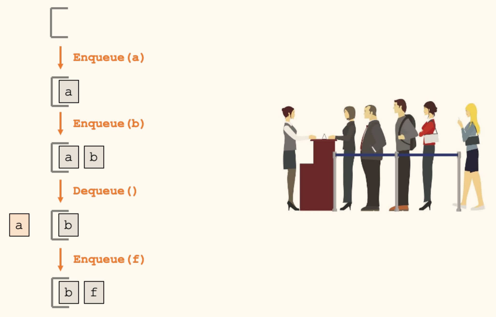
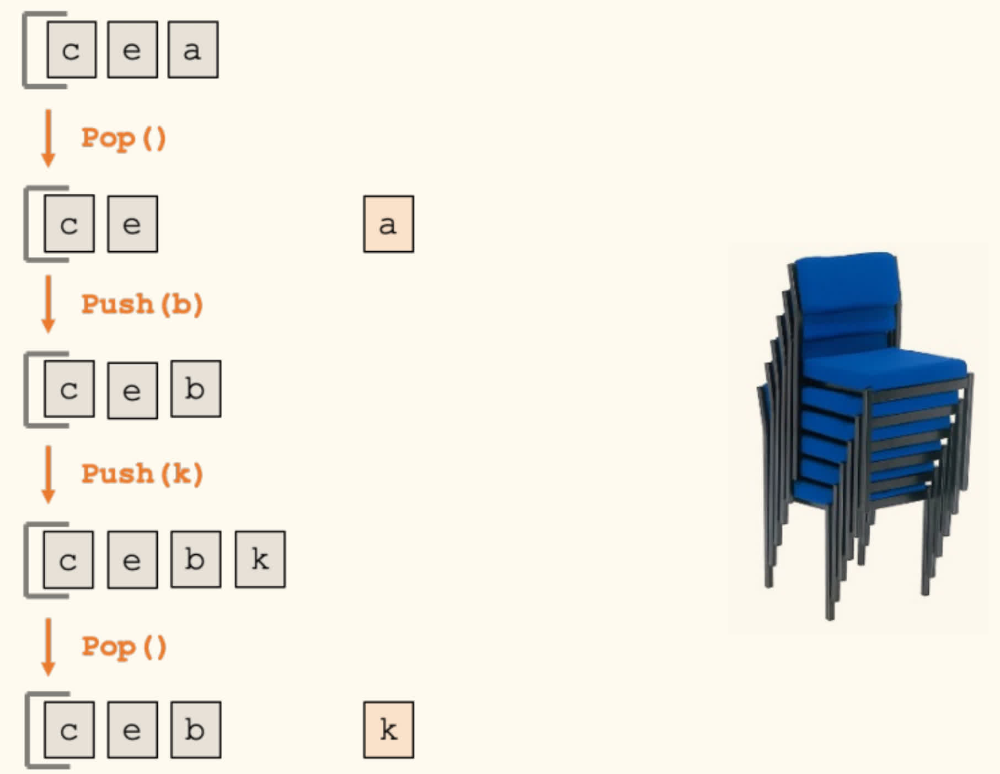
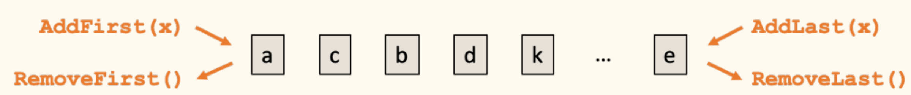
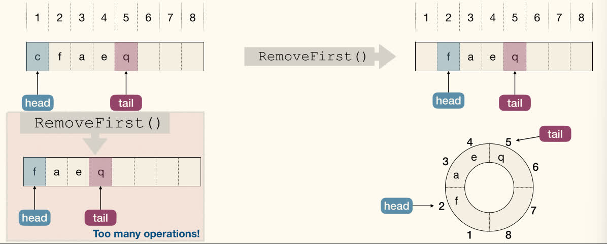
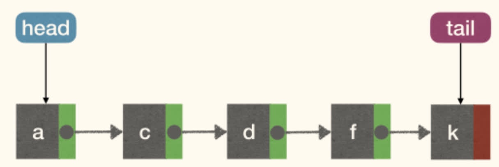
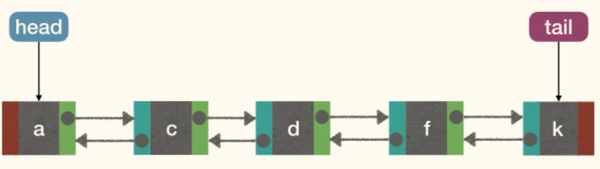
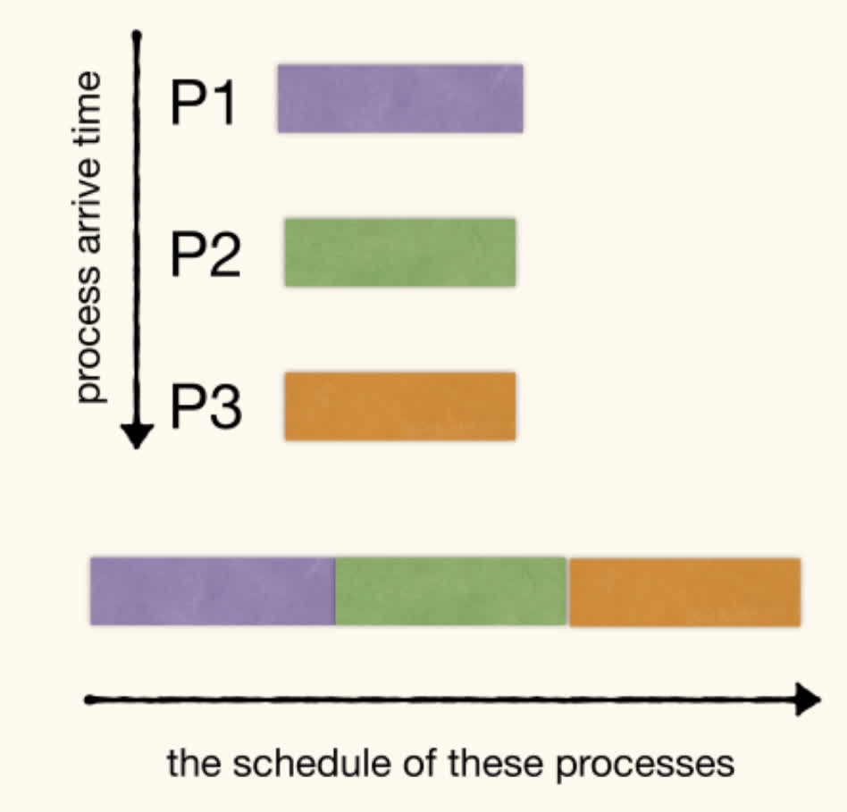

!!! info ""
    A **data structure**(数据结构) is a way to <u>store and organize data</u> in order to facilitate *access* and *modifications*.

## Abstract Data Type

!!! info ""
    A data structure usually provides an interface. Often, the interface is also called an **Abstract Data Type** (ADT).

    An ADT specifies what a data structure "*can* do" and "*should* do", but not "*how to* do" them.

    An ADT is a <u>logical description</u>, and a data structure is a concrete <u>implementation</u>.

### The Queue ADT

!!! info Queue
    The **Queue**(队列) ADT represents a collection of items to which we can *add* items and *remove* the next item.
    - `Add(x)`: Add $x$ to the queue.
    - `Remove()`: Remove the next item $y$ from queue, return $y$.
    
    The *queuing discipline* decides which item to be removed.

### FIFO Queue

!!! info ""
    The **first-in-first-out (FIFO)** queuing discipline: items are removed in the same order they are added.
    - `Add(x)` or `Enqueue(x)`: Add $x$ to the end of the queue.
    - `Remove()` or `Dequeue()`: Remove the first item from the queue.



### LIFO Queue: Stack

!!! info ""
    The **last-in-first-out (LIFO)** queuing discipline: items are removed in the reverse order they are added.
    - `Add(x)` or `Push(x)`: Add $x$ to the top of the stack.
    - `Remove()` or `Pop()`: Remove the top item from the stack.



### The Deque ADT

!!! info ""
    The **Deque**(双端队列, Double-Ended Queue) ADT represents a sequence of items with a front and a back, which supports the following operations:
    - `AddFirst(x)`: Add $x$ to the front of the queue.
    - `AddLast(x)`: Add $x$ to the back of the queue.
    - `RemoveFirst()`: Remove the first item $y$ from the queue, return $y$.
    - `RemoveLast()`: Remove the last item $y$ from the queue, return $y$.



A DEQUE is a generalization of both the FIFO Queue and LIFO QUEUE (STACK).

1. DEQUE can implement FIFO QUEUE:
    - `Enqueue(x)`: `AddFirst(x)`
    - `Dequeue()`: `RemoveFirst()`
2. DEQUE can implement LIFO QUEUE (STACK):
    - `Push(x)`: `AddLast(x)`
    - `Pop()`: `RemoveLast()`

### The List ADT

!!! info ""
    A **List**(列表) is a sequence of items $x_1, x_2, \cdots, x_n$, which supports the following operations:
    - `Size()`: return $n$, the length of the list
    - `Get(i)`: return $x_i$
    - `Set(i, x)`: set $x_i$ to $x$
    - `Add(i, x)`: set $x_{j+1} = x_{j}$ for $n \ge j \ge i$, then set $x_i = x$, increase list size by $1$
    - `Remove(i)`: set $x_{j} = x_{j+1}$ for $n - 1 \ge j \ge i$, decrease list size by $1$

LIST can implement DEQUE:
- `AddFirst(x)`: `Add(1, x)`
- `AddLast(x)`: `Add(Size() + 1, x)`
- `RemoveFirst()`: `Remove(1)`
- `RemoveLast()`: `Remove(Size())`

### Array

#### ArrayList

Using *array* to implement LIST, **ArrayList**:
- `Size()`: $\Theta(1)$ (Use a variable `size` to store the size)
- `Get(i)`: $\Theta(1)$
- `Set(i, x)`: $\Theta(1)$
- `Add(i, x)`: $\Theta(1)$ to $\Theta(n)$
- `Remove(i)`: $\Theta(1)$ to $\Theta(n)$

Queries, Updates and Modifications at end are fast, but Modifications at front or middle are slow.

Therefore, ARRAYLIST is good for STACK, cos `Push` and `Pop` are fast. But not good for FIFO QUEUE and DEQUE, cos `Enqueue` and `Dequeue` are slow.

#### ArrayDeque

Using *circular array* to implement Deque, **ArrayDeque**:

Move head and tail pointer instead of moving elements.



Use modular arithmetic(取模运算) to "wrap around" at both ends.

- `AddLast(x)`: `A[tail := (tail % N) + 1] := x`
- `RemoveLast(x)`: `tail := (tail = 1) ? N : tail - 1`
- `AddFirst(x)`: `A[head := (head = 1) ? N : head - 1] := x`
- `RemoveFirst(x)`: `head := (head % N) + 1`

Queries, Updates and Modifications at both front and end are fast (All of these operations are $O(1)$), but still slow at middle.

ARRAYDEQUE is good for STACK, FIFO QUEUE and DEQUE, but can be slow for some LIST operations.

#### When the array is full?

When the array is full, we can resize the array: Create a new array of greater size and copy the elements of the original array into it.

So, how large?

Suppose we have array with initial capacity being $1$, then insert $N$ items.

The first category of resizing is to have one additional cell every time, which requires $1 + 2 + 3 + \cdots + N = \Theta(N^2)$ copy operations.

The second category of resizing is to double the size every time, which requires $1 + 2 + 4 + \cdots + 2^{k-1} = \Theta(N)$ copy operations (For simplicity, we assume $N = 2^k$).

We could of course do better if we multiplied the size of the array by an even larger value, but then there would likely be a lot more unused cells in the array on average (consider the case that resizing happens infrequently).

#### [Amortized analysis(平摊分析)](https://zh.wikipedia.org/wiki/平摊分析)

Starting from an empty data structure, *average* running time per operation over a *worst-case* sequence of operations.

Thus, if resizing by one more cell each time, the amortized complexity is $\Theta(n)$ for *each* operation. If resizing by doubling space each time, the amortized complexity is $\Theta(1)$ for *each* operation.

#### When to shrink array?

When shrinking an array, we allocate a new array with smaller capacity, and then copy necessary items from the original array into the new array, and abandon the old array.

- When `pop()` each time, we shrink the array by 1 less cell?
- When the array is one-half full, we shrink the array to the halve size?
    - Since, if now we add just one element, we need to resize the array by doubling the size, and then pop one element, we should shrink it back to the halve size. When pushes and pops come with relatively equal frequency, it will be too expensive! This is called [**Thrashing**](https://en.wikipedia.org/wiki/Thrashing_%28computer_science%29) problem.

Usually, we shrink the array to half size when the array is one-quarter ($\dfrac{1}{4}$) full.

After all, by doing this we ensure that the array holding the contents of our stack will always be between $25\%$ and $100\%$ full!

### LinkedList

The list operations implemented by **LinkedList**:
- `Size()`: $\Theta(1)$
- `Get(i)`: $\Theta(1)$ to $\Theta(n)$
- `Set(i, x)`: $\Theta(1)$ to $\Theta(n)$
- `Add(i, x)`: $\Theta(1)$ to $\Theta(n)$
- `Remove(i)`: $\Theta(1)$ to $\Theta(n)$

LINKEDLIST is good for STACK (`Push` and `Pop` at `head`) and FIFO QUEUE (`Enqueue` at `tail` and `Dequeue` at `head`), but not good for DEQUE, cos `RemoveLast` can be slow.



### DLinkedList (Doubly-Linked List)

DLINKEDLIST is good for STACK, FIFO QUEUE, and DEQUE; but can be slow for some LIST operations.



- `AddFirst(x)`: 
    ```python
    x.next := head
    if head != NULL:
        head.prev := x
    head := x
    x.prev := NULL
    ```

However, if `head` is `NULL`, we need to update `tail` as well.

Since there are similar operations for `head` and `tail`, and need to consider boundary conditions, we can connect them.

A circular, doubly linked list with a `sentinel`(哨兵) node:
- A `sentinel` node is a dummy node(虚拟节点) used as an alternative over using `NULL` as the path terminator
- The `sentinel`'s *next* points to the first node on the list, and its *prev* points to the last node on the list.
- The first node's *prev* points to the `sentinel`, as does the last node's *next*.


- `AddFirst(x)`: 
    ```python
    x.next := sentinel.next
    sentinel.next.prev := x
    sentinel.next := x
    x.prev := sentinel
    ```
- `RemoveFirst()`: 
    ```python
    sentinel.next := sentinel.next.next
    sentinel.next.prev := sentinel
    ```

In this way, we can avoid the boundary conditions. We no longer need to check if `head` is `NULL`, which fastens the operations (no branches).

## Applications

### FIFO Queue

- Process Scheduling


### Stack

- Balancing Symbols
- Function Calls
- Eliminating Recursion (with the help of a stack, recursion can be replaced by iteration)
    - Cons: Recursion can be *slow* and *memory consuming* due to the creation and maintenance of stack frames.
    - Pros: Recursion can make the code *clearer*, *concise*, and *intuitive*.

!!! info ""
    A function is called **tail-recursive**(尾递归) if each activation of the function will make *at most* one single recursive call, and will <u>return immediately after that call</u>.

- Recursion can be converted into iteration
    - Generic method: simulate a call stack
    - Special case: tail recursion
- Iteration can be converted into tail recursion
    - No one is always perfect
    - Iteration can be faster and more memory efficient
    - Recursion can be clearer, more concise and intuitive
