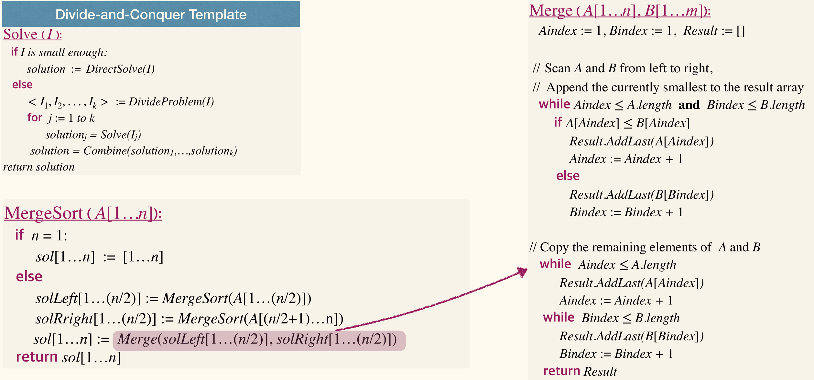
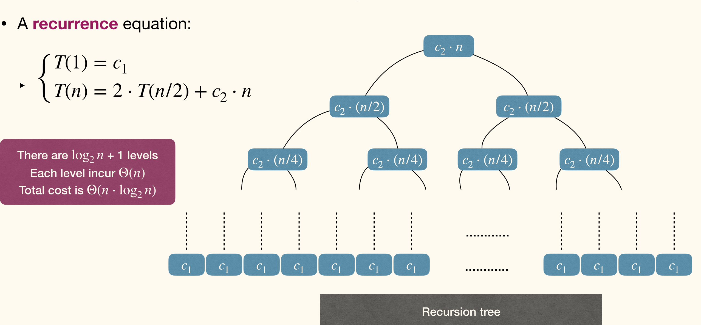
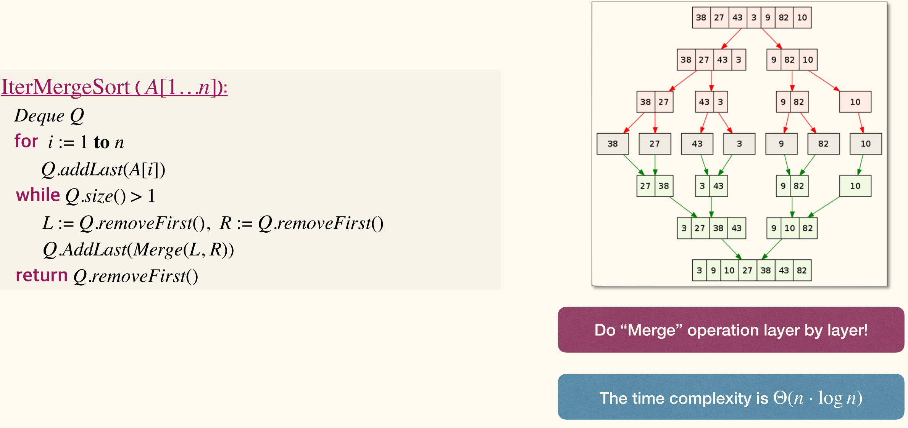
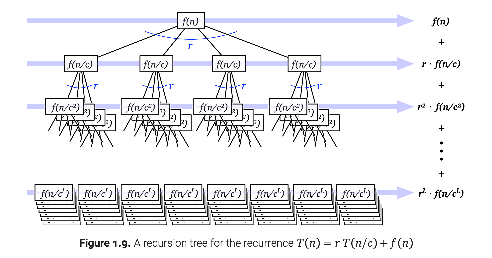
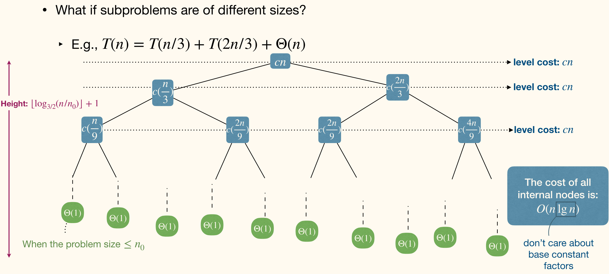
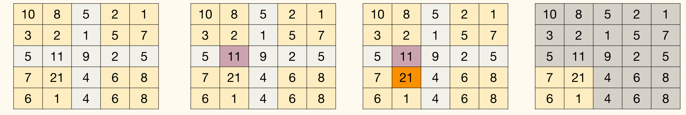
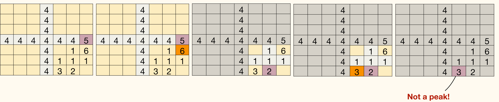
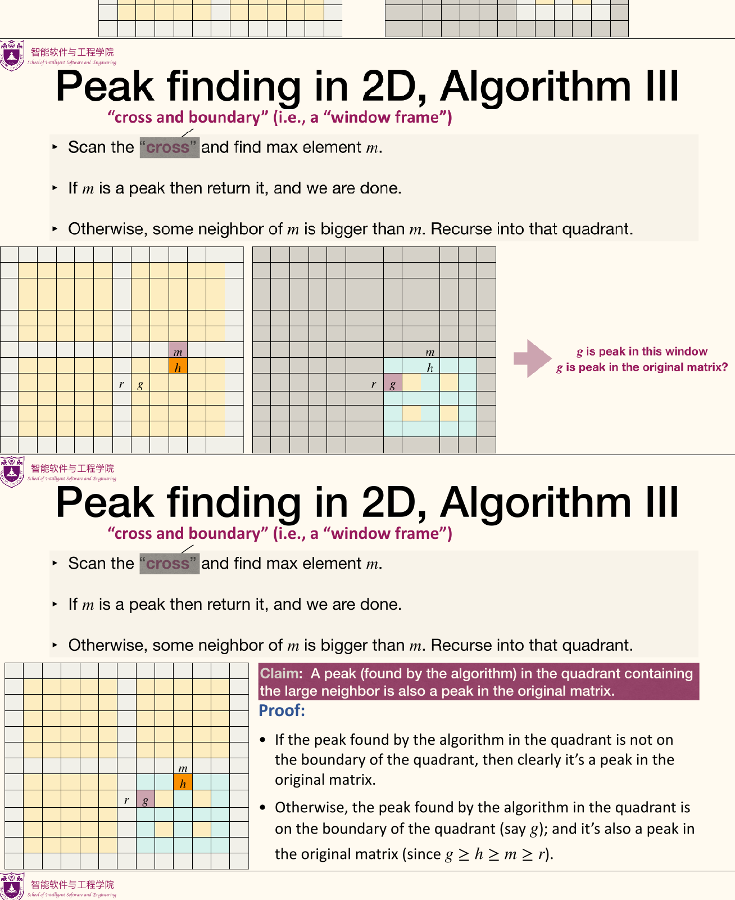

## The Divide-and-Conquer Approach

!!! info ""
    The **Divide-and-Conquer Approach**(分治策略)
    - *Divide* the given problem into a number of subproblems that are smaller instances of the same problem.
    - *Conquer* the subproblems by solving them recursively.
        - Or, use brute-force if a subproblem is small enough.
    - *Combine* the solutions for the subproblems to obtain the solution for the original problem.

### Correctness

Use (strong) mathematical induction, proceeding by induction on the "size" of the inputs.
- Induction basis: prove the algorithm can correctly solve small problem instances.
- Induction hypothesis: the algorithm can correctly solve any problem instance of size at most, says $n$.
- Inductive step: assuming induction hypothesis, prove the algorithm can correctly solve problem instance of size $n + 1$.

Partial or Total Correctness? Termination and partial correctness can be encapsulated!

本课程基本不考虑终止性。

### Merge Sort



#### Time complexity

For subroutine `Merge`, the three `while` processes involves scanning all the elements in $A$ and $B$.
- The `if` processes has fewer comparisons than `while` processes.
- Therefore, the time complexity of subroutine`Merge` is $\Theta(n)$, where $n$ is the sum of elements of $A$ and $B$.

For the main procedure `MergeSort`:
- Let $T(n)$ be the runtime of `MergeSOrt` of instance of size $n$.
- Clearly, $T(1) = c_1 = \Theta(1)$ for some constant $c_1$.
- For larger $n$, $T(n) = 2\cdot T(\frac{n}{2}) + c_2 \cdot n = 2 T(\frac{n}{2}) + \Theta(n)$.

A recurrence equation:

$$
\left\lbrace\begin{aligned}
    T(1) &= c_1\\ 
    T(n) &= 2 T(\tfrac{n}{2}) + c_2 \cdot n
\end{aligned}\right.
$$



There are $\log n + 1$ levels, each level incur $\Theta(n)$. Total cost is $\Theta(n \log n)$.

#### Iterative



The time complexity is $\Theta(n \log n)$.

### Matrix Multiplication

Suppose we want to multiply two $n \times n$ matrices $\bm{X}, \bm{Y}$. The most straightforward method needs $\Theta(n^3)$ time.

$$
\bm{X} = \begin{bmatrix}
    \bm{A} & \bm{B} \\
    \bm{C} & \bm{D}
\end{bmatrix}\quad \bm{Y} = \begin{bmatrix}
    \bm{E} & \bm{F} \\
    \bm{G} & \bm{H}
\end{bmatrix}
$$

$$
\bm{X} \bm{Y} = \begin{bmatrix}
    \bm{A} & \bm{B} \\
    \bm{C} & \bm{D}
    \end{bmatrix}\begin{bmatrix}
    \bm{E} & \bm{F} \\
    \bm{G} & \bm{H}
    \end{bmatrix} = \begin{bmatrix}
    \bm{AE} + \bm{BG} & \bm{AF} + \bm{BH} \\
    \bm{CE} + \bm{DG} & \bm{CF} + \bm{DH}
\end{bmatrix}
$$

The recurrence equation is $T(n) = 8T(\frac{n}{2}) + \Theta(n^2)$. The time complexity is still $\Theta(n^3)$ (There're $\log_2 n$ layers and each layer has $8^i$ subproblems).

#### Strassen's algorithm

$$
\bm{X}\bm{Y} = \begin{bmatrix}
    \bm{P}_5 + \bm{P}_4 - \bm{P}_2 + \bm{P}_6 & \bm{P}_1 + \bm{P}_2 \\
    \bm{P}_3 + \bm{P}_4 & \bm{P}_1 + \bm{P}_5 - \bm{P}_3 - \bm{P}_7
\end{bmatrix}
$$
where
$$
\left\lbrace\begin{aligned}
    \bm{P}_1 &= \bm{A}(\bm{F} - \bm{H})\\ 
    \bm{P}_2 &= (\bm{A} + \bm{B})\bm{H}\\ 
    \bm{P}_3 &= (\bm{C} + \bm{D})\bm{E}\\ 
    \bm{P}_4 &= \bm{D}(\bm{G} - \bm{E})\\ 
    \bm{P}_5 &= (\bm{A} + \bm{D})(\bm{E} + \bm{H})\\ 
    \bm{P}_6 &= (\bm{B} - \bm{D})(\bm{G} + \bm{H})\\ 
    \bm{P}_7 &= (\bm{A} - \bm{C})(\bm{E} + \bm{F})
\end{aligned}\right.
$$

Recurrence: $T(n) = 7T(\frac{n}{2}) + \Theta(n^2)$.

#### Time complexity of Strassen's algorithm

We use the **guess and verify** method.
- Guess the form of the solution;
- Use *induction* to find proper constants and prove the solution works

$T(n) = 7T(\frac{n}{2}) + cn^2$.

Let $T(n) = O(n^{\log_2 7})$.

- Induction basis
    - $T(1) = c \le d \cdot 1^{\log_2 7}$ as long as $d \ge c$.
- Inductive step
    - $T(n) = 7T(\frac{n}{2}) + cn^2 \le 7d (\frac{n}{2})^{\log_2 7} + cn^2 = d n^{\log_2 7} + cn^2$.
    - However there is a problem, $T(n) \le d n^{\log_2 7} + cn^2 \nimplies T(n) = O(n^{\log_2 7})$.

As a result, we should *subtract* some lower order term from our guess! Cos **Subtraction** gives us stronger induction hypothesis to work with.

Guess $T(n) \le dn^{\log_2 7} - d' n^2 = O(n^{\log_2 7})$.

- Induction basis
    - $T(1) = c \le d \cdot 1^{\log_2 7} - d' \cdot 1^2$ as long as $d - d' \ge c$.
- Inductive step
    - $\begin{aligned} T(n) &= 7T(\tfrac{n}{2}) + cn^2 \le 7d(\tfrac{n}{2})^{\log_2 7} - 7d'(\tfrac{n}{2})^2 + cn^2\\ &= dn^{\log_2 7} - (\tfrac{7}{4}d' - c) n^2\\ &\le d n^{\log_2 7} - d'n^2 \end{aligned}$ as long as $\frac{3}{4}d' \ge c$.

### The recursion-tree method



A **recursion tree** is a rooted tree with one node for each recursive subproblem.

The <u>value of each node</u> is the time spent on that subproblem *excluding* recursive calls.

The <u>sum of all values</u> is the runtime of the algorithm.

#### Combine recursion tree and substitution

*Unbalanced*, different root-to-leaf having different lengths.



Since the height (max lengths from root to leaf) $h = \left\lfloor \log_{3 / 2} (\frac{n}{n_0}) \right\rfloor+1$, then the size of leaves will be smaller than $2^h = 2^{\left\lfloor \log_{3 / 2} (\frac{n}{n_0}) \right\rfloor+1} \le 2n^{\log_{3 / 2}2}$.

Leads to the cost of leaves to be $O(n^{\log_{3 / 2}2})$.

$O(n \log n) + O(n^{\log_{3 / 2}2}) = n^{\log_{3 / 2}2}$, it's not tight!

To get a more accurate number of leaves. Guess the leaves are also $O(n \log n)$.

Let $L(n)$ be the number of leaves in recursion tree for $T(n)$.

$$
L(n) = \begin{cases}
    1, &\text{if } n < n_0\\ 
    L(\frac{n}{3}) + L(\frac{2n}{3}), &\text{if } n \ge n_0
\end{cases}
$$

- Inductive hypothesis
    - $L(n) \le d \cdot n \log(n+1)$ for all values less than $n$.
- Base case
    - $L(1) \le d \log 2$ which is very easy to be satisfied by choosing proper $d$.
- Inductive step
    - $\begin{aligned} L(n) &= L(\tfrac{n}{3}) + L(\tfrac{2n}{3}) \\ &\le d \cdot \tfrac{n}{3} \log(\tfrac{n}{3}+1) + d \cdot \tfrac{2n}{3} \log(\tfrac{2n}{3} + 1)\\ &< d\cdot n \log (\tfrac{2n}{3}+1)\\ &< d \cdot n \log(n+1) \end{aligned}$.

So the cost of all leaves is $O(n\log(n))$. Time complexity is $O(n\log n)$.

## Master Method

Simple version of Master Theorem:

!!! info Master theorem (主定理)
    Let $a \ge 1, b > 1$, $d$ be constants (independent of $n$), and $T(n)$ be defined on the non-negative integers by the recurrence[^division]

    [^division]: $\frac{n}{b}$ is either $\left\lfloor \frac{n}{b} \right\rfloor$ or $\left\lceil \frac{n}{b} \right\rceil$ and the theorem is still true.

    $$
    T(n) = a T(\tfrac{n}{b}) + \Theta(n^d)
    $$
    
    Then $T(n)$ has the following asymptotic bounds:

    $$
    T(n) = \begin{cases}
        \Theta(n^d \log n), &\text{if }a = b^d\\
        \Theta(n^d), &\text{if }a < b^d\\
        \Theta(n^{\log_b a}), &\text{if } a > b^d
    \end{cases}
    $$

The meanings of $a, b, d$:
- $a$: number of subproblems
- $b$: factor by which input size shrinks
- $d$: need to do $n^d$ work to create all the subproblems and combine their solutions

### Application

- Karatsuba integer multiplication
    - $T(n) = 3T(\frac{n}{2}) + \Theta(n)$ leading to $a > b^d$
    - $T(n) = \Theta(n^{\log_2 3})$
- MergeSort
    - $T(n) = 2T(\frac{n}{2}) + \Theta(n)$ leading to $a = b^d$
    - $T(n) = \Theta(n \log n)$
- Extra example
    - $T(n) = T(\frac{n}{2}) + \Theta(n)$ leading to $a < b^d$
    - $T(n) = \Theta(n)$

### Proof


第二层开始的蓝色圆角矩形中的 $(\frac{n}{b})$ 漏写了上标 $d$，即应当是 $(\frac{n}{b})^d$。

Total cost is $cn^d \displaystyle \sum_{t=0}^{\log_b n} \left(\frac{a}{b^d}\right)^t$.

- $a = b^d$
    - $\begin{aligned} T(n) &= cn^d \displaystyle \sum_{t=0}^{\log_b n} \left(\frac{a}{b^d}\right)^t \\ &= cn^d (\log_b n + 1)\\ &= \Theta(n^d \log n) \end{aligned}$ 
- $a < b^d$
    - $\begin{aligned} T(n) &= cn^d \displaystyle \sum_{t=0}^{\log_b n} \left(\frac{a}{b^d}\right)^t\\ &= cn^d \dfrac{1 - (\frac{a}{b^d})^{\log_b n + 1}}{1 - \frac{a}{b^d}}\\ &\le \dfrac{c}{1 - \frac{a}{b^d}} n^d\\ &= \Theta(n^d) \end{aligned}$ 
- $a > b^d$
    - $\begin{aligned} T(n) &= cn^d \displaystyle \sum_{t=0}^{\log_b n} \left(\frac{a}{b^d}\right)^t\\ &=  cn^d \dfrac{(\frac{a}{b^d})^{\log_b n + 1} - 1}{\frac{a}{b^d}-1}\\ &\le cn^d \left(\dfrac{a}{b^d}\right)^{\log_b n}\dfrac{\frac{a}{b^d}}{\frac{a}{b^d}-1}\\ &\to cn^d \left(\dfrac{a}{b^d}\right)^{\log_b n} \\ &= c n^d n^{\log_ba - d}\\ &= \Theta(n^{\log_b a}) \end{aligned}$ 

- Branching causes the number of problems to explode.
    - The most work is at the bottom of the tree.
- The problems lower in the tree are smaller.
    - The most work is at the top of the tree.

### General Master Theorem

!!! info General Master Theorem
    Let $a \ge 1, b > 1$ be constants, $f(n)$ be a function, and $T(n)$ be defined on the non-negative integers by the recurrence

    $$
    T(n) = a T(\tfrac{n}{b}) + f(n)
    $$

    Then $T(n)$ has the following asymptotic bounds:
    - If $f(n) = O(n^{\log_b a - \epsilon})$ for some constant $\epsilon > 0$, then <u>$T(n) = \Theta(n^{\log_b a})$</u>.
    - If $f(n) = \Theta(n^{\log_b a})$, then <u>$T(n) = \Theta(n^{\log_b a} \log n)$</u>.
    - If $f(n) = \Omega(n^{\log_b a + \epsilon})$ for some constant $\epsilon > 0$, and if $a f(\tfrac{n}{b}) \le c f(n)$ for some constant $c < 1$ and all sufficiently large $n$, then <u>$T(n) = \Theta(f(n))$</u>.

The Master Theorem does not cover all cases!

Here's something to be noticed, that's the meaning of $\epsilon$. $f(n) = \dfrac{n}{\log n}$ is not $O(n^{1  -\epsilon})$ mentioned in case 1, cos for all $\epsilon > 0$, $\dfrac{n}{\log n}$ is always $\Omega(n^{1 - \epsilon})$.

### Ignoring Floors and Ceilings

The actual recurrence of MergeSort is $T(n) = T(\left\lceil \frac{n}{2} \right\rceil) + T(\left\lfloor \frac{n}{2} \right\rfloor) + \Theta(n)$.

How to get the real time complexity of this recurrence?

We can transform the recurrence into a more familiar form, by defining a new function in terms of the one we want to solve. This method is called **Domain transformation**.

First, let's overestimate the time bound, we have the following relation to eliminate the ceiling:

$$
T(n) \le 2 T(\left\lceil \tfrac{n}{2} \right\rceil) + \Theta(n) \le 2 T(\tfrac{n}{2} + 1) + \Theta(n)
$$

Define a new function $S(n) = T(n + \alpha)$, choosing the constant $\alpha$ so that $S(n)$ satisfies the simpler recurrence $S(n) \le 2S(\frac{n}{2}) + \Theta(n)$.

$$
\begin{aligned}
    S(n) = T(n + \alpha) &\le 2 T(\tfrac{n}{2} + \tfrac{\alpha}{2} + 1) + \Theta(n + \alpha)\\
    &= 2 S(\tfrac{n}{2} + \tfrac{\alpha}{2} + 1 - \alpha) + \Theta(n + \alpha)
\end{aligned}
$$

We just need to make $\frac{\alpha}{2} + 1 - \alpha = 0$ and get $\alpha = 2$ to simplifies the recurrence.

$S(n) \le S(\frac{n}{2}) + \Theta(n) \implies S(n) = O(n \log n)$. Then we have $T(n) = S(n-2) = O((n-2)\log (n-2)) = O(n \log n)$.

Similarly, we get the matching lower bound $T(n) = \Omega(n \log n)$. Therefore, $T(n) = \Theta(n \log n)$.

- Similar domain transformations can be used to remove floors, ceilings, and even lower order terms from any divide and conquer recurrence
- But now that we realize this, we don't need to bother grinding through the details ever again

## Reduce and Conquer

- We might not need to consider all subproblems.
    - In fact, sometimes only need to consider one subproblem.
- The "combine" step will also be easier, or simply trivial…
- It is also called *decrease and conquer*

### The Search Problem

Worst-case runtime is $\Theta(n)$.

Binary Search for a sorted array.

```python BinarySearch(A, x)
left := 1, right := n
while true
    middle := (left + right) / 2
    if A[middle] = x
        return middle
    else if A[middle] < x
        left := middle + 1
    else
        right := middle - 1
```

This is not completely true, cos it may not terminate. It doesn't take the case when $x$ is not in the array into consideration.

```python
BinarySearch(A, x):

left := 1, right := n
while left <= right
    middle := (left + right) / 2
    if A[middle] = x
        return middle
    else if A[middle] < x
        left := middle + 1
    else
        right := middle - 1
```

$$
T(n) \le T(\tfrac{n}{2}) + \Theta(1) \implies T(n) = O(\log n)
$$

### Peak finding

Global max takes more time: Sequential scan needs $O(n)$ time and it's inevitable. Finding a peak costs much less time.

An element `A[i]` is a **peak** (local maximum) if it is no smaller than its adjacent elements.

Every non-empty (limited) array `A` has at least one peak.

- Find middle element.
- Compare middle element to its adjacent elements.
- Reduce the array to one of the two splits.
    - There must exist a peak in the part containing the large neighbor.
- Recurse.

```python
PeakFinding(A):

left := 1, right := n
while left <= right                                       # Current array is not empty.
    middle := (left + right) / 2                          # Get the middle element.
    if middle > left and A[middle - 1] > A[middle]        # If middle < left neighbor (if there is such neighbor), recurse into left part.
        right := middle - 1
    else if middle < right and A[middle + 1] > A[middle]  # Same as above.
        left := middle + 1
    else                                                  # If middle is a peak, return it.
        return middle
```

Time complexity is $O(\log n)$.

### Peak finding in 2D

Every non-empty 2D array has at least one peak. Start from a node, follow an increasing path and eventually must reach a peak.

#### Algorithm 1

Compress each column into one element, resulting an 1D array.
- Use maximum of each column to represent that column.
- Run previous algorithm on the 1D array and return a peak.

Time complexity is $O(n^{2}) + O(\log n) = O(n^2)$.

#### Algorithm 2

- Scan the middle column and find the max element $m$.
- If $m$ is a peak, then return it and we are done.
- Otherwise, left of right neighbor of $m$ is bigger than $m$.
- Recurse into that part.


Correctness
- Max of middle column is a peak; or a peak exists in the part containing the large neighbor, and that peak is the max of its column.
- A peak (found by the algorithm) in the part containing the large neighbor is also a peak in the original matrix.
- The algorithm eventually returns a peak of some (sub)matrix.

$$
\sout{T(n) \le T(\tfrac{n}{2}) + \Theta(n) \implies T(n) = O(n)}
$$

The mistake occurs in $T(\frac{n}{2})$. We still need to do a $O(n)$ search to find the maximum value in the current column. Cos this is a 2D problem, requiring two variable to describe.
$$
T(n, n') \le T(\tfrac{n}{2}, n') + O(n') \implies T(n, n') \le \log n \cdot O(n') = O(n' \log n) = O(n \log n)
$$
where $n$ is column number and $n'$ is row number.

> However, we use one variable in Matrix Multiplication problem because the matrix is reduced in proportion.

#### Algorithm 3

- Scan the *cross* and find max element $m$.
- If $m$ is a peak, then return it and we are done.
- Otherwise, some neighbor of $m$ is bigger than $m$.
- Recurse into that quadrant.



However this is wrong. False Claim: A peak (found by the algorithm) in the quadrant containing the large neighbor is also a peak in the original matrix.



To fix it, scan the *cross and boundary* (window frame) instead of just scanning the cross.


