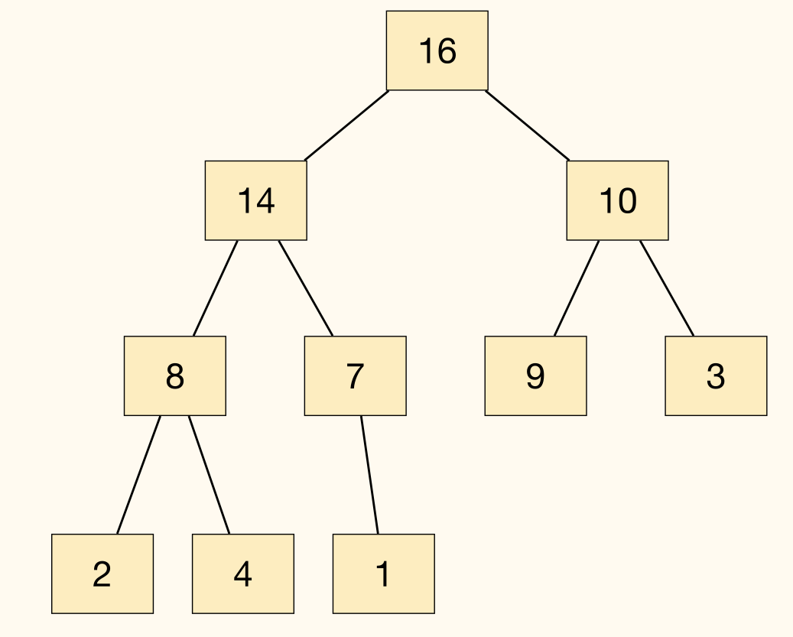
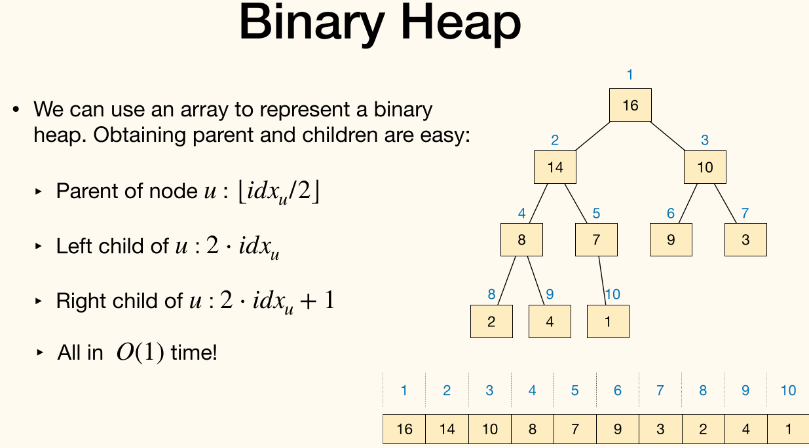

!!! info ""
    In computer science, a **heap**(堆) is data structure which means "a disorganized pile".

In fact, this word has other meanings in computer science, which refers to *heap memory* used for <u>dynamic memory allocation</u>. This topic, however, is unrelated to the data structure in this course.

## Binary Heap

!!! info ""
    A binary heap is a *complete binary tree*(完全二叉树)[^complete_binary_tree], in which each node represents an item.

    [^complete_binary_tree]: A complete binary tree is a binary tree in which every level, except possibly the last, is completely filled, and all nodes in the last level are as far left as possible.

    Values in the nodes satisfy **heap-property**:
    - **Max-heap**: for each node except root, value of that node $\le$ value of its parent.
    - **Min-heap**: for each node except root, value of that node $\ge$ value of its parent.

    

We can use an array to represent a binary heap. Obtaining parent and children are easy:
- Parent of node $u$: $\lfloor \frac{\mathrm{idx}_u}{2} \rfloor$
- Left child of $u$: $2 \cdot \mathrm{idx}_u$
- Right child of $u$: $2 \cdot \mathrm{idx}_u + 1$
- All in $O(1)$ time.



### Common operations

Consider max-heap as an example.

Most common operations:
- `HeapInsert`: insert an element into the heap.
- `HeapGetMax`: Return the item with maximum value.
    - Runtime is $O(1)$, as the maximum value is always at the root.
- `HeapExtractMax`: Remove the item with maximum value from the heap and return it.
- ...

#### `HeapInsert`

Insert an item into a binary max-heap represented by an array:
1. Simply put the item to the end of the array.
2. Along the path to root, compare and swap.

```python
HeapInsert(A, x):
heap_size += 1
A[heap_size] := x
idx := heap_size
while idx > 1 and A[Floor(idx/2)] < A[idx]
    Swap(A[Floor(idx/2)], A[idx])
    idx := Floor(idx/2)
```

Runtime of `HeapInsert` is $O(\log n)$.

#### `HeapExtractMax`

Remove the maximum item from the heap and return it:
1. Remove and return root.
2. Move the last item to the root.
3. Compare with children, swap with bigger one, and do this recursively.

```python
HeapExtractMax(A):
max_item := A[1]
A[1] := A[heap_size--]
MaxHeapify(1, A)
return max_item

MaxHeapify(idx, A):
idx_l := 2 * idx
idx_r := 2 * idx + 1
idx_max := (idx_l <= heap_size and A[idx_l] > A[idx]) ? idx_l : idx
idx_max := (idx_r <= heap_size and A[idx_r] > A[idx_max]) ? idx_r : idx_max
if idx_max != idx
    Swap(A[idx_max], A[idx])
    MaxHeapify(idx_max, A)
```

## Application

### Priority Queue

**Priority queue**: each item associated with a priority, Remove always deletes the item with max (or min) priority.

Use binary heap to implement priority queue:
- `Add(item)`: `HeapInsert(item)`
- `Remove()`: `HeapExtractMax()`
- `GetMax()`, `UpdatePriority(item, val)`

All these operations finish within $O(\log(n))$ time.

Application:
- Scheduling, Event simulation, ...
- Used in more sophisticated algorithms

### HeapSort

```python
HeapSort(I)
heap := BuildMaxHeap(I) # Take an array and make it a max-heap.
for i := n down to 2
    cur_max := heap.HeapExtractMax()
    I[i] := cur_max
```

In each iteration:
- Place one item in the array to its final position.
- This one is the maximum item in current heap
- That is, place $i$-th biggest item to position $n-i+1$.

The loop invariant: The largest $i$ elements are already in their correct position.

Total runtime of these iterations is $O(n \log n)$:
$$
\sum_{i=2}^{n}O(\log i) = O(\log (n!)) = O(n \log n)
$$

How to build a max-heap for an array `I[1...n]`? We can call `HeapInsert` $n$ times, which time complexity is $O(n\log(n))$, but we can do it better.

An observation: each leaf node is a 1-item heap.

Bottom-up approach: Keep merging small heaps into larger one, until a single heap remains.
- Each leaf node is a 1-item heap.
- Go through remaining nodes in index decreasing order
    - At each node, we are merging two heaps.
- Maintain heap property during merging: Use `MaxHeapify`

```python
BuildMaxHeap(A):
heap_size := n
for i := Floor(n / 2) down to 1
    MaxHeapify(i, A)
```

$\Theta(n)$ calls to `MaxHeapify`, each costing $O(\log i)$. But the result is not $O(n \log n)$.

Height of $n$-items heap is $\left\lfloor \log n \right\rfloor$. Any height $h$ has no more than $\left\lceil \frac{n}{2^{h+1}} \right\rceil$ nodes. So cost of all `MaxHeapify` is[^math_technique]
$$
\sum_{h=0}^{\left\lfloor \log n \right\rfloor} \left\lceil \frac{n}{2^{h+1}} \right\rceil \cdot O(h) = O\left(n \cdot \sum_{h=0}^{\left\lfloor \log n \right\rfloor} \dfrac{h}{2^h}\right) = O(n)
$$

[^math_technique]: $\displaystyle \sum^{\infty}_{n=0} \dfrac{1}{x^n} = 1 + \dfrac{1}{x - 1}$ for $|x| > 1$. Differentiate both sides to get $\displaystyle \sum^{\infty}_{n=0} \dfrac{n}{x^{n}} = \dfrac{x}{(x - 1)^2}$. So $\displaystyle \sum_{h=0}^{\left\lfloor \log n \right\rfloor} \dfrac{h}{2^h} \to 2$.

Time complexity of `HeapSort` is $O(n\log(n))$ and extra space required during execution is $O(1)$.
