## The Sorting Problem

The original idea is sorting $n$ numbers into ascending order.

We can actually sort a collection of any type of data, as long as a total order(全序) is defined for that type of data.

That is, for any distinct data items a and b, we compare them, i.e., we can determine: $a < b$ or $b < a$, otherwise $a = b$ where "$<$" is a binary relation.

We can also sort *partially ordered* items.

## Characteristics 

- **In-place**(原地): a sorting algorithm is in-place if $O(1)$ extra space is needed beyond input.
- **Stability**(稳定): a sorting algorithm is stable if numbers with the same value appear in the output array in the same order as they do in the input array.

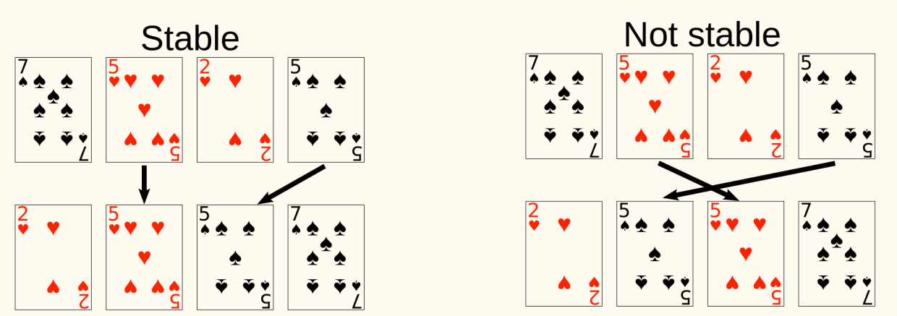

We have learned several sorting algorithms:
- Insertion Sort: gradually increase size of sorted part.
    - $O(n^2)$ time
    - $O(1)$ space
    - In-place
    - Stable
- Merge Sort: example of divide-and-conquer
    - $O(n\log n)$ time
    - $O(n)$ space
    - Not in-place
    - Stable
- Heap Sort: Leverage the heap data structure
    - $O(n\log n)$ time
    - $O(1)$ space
    - In-place
    - Not stable[^counterexample]

[^counterexample]: Consider `[2a, 2b, 1]`, it's already a max-heap. At first `2a` is extracted and placed in the end. Then `2b` is extracted and placed in the end but one index. At last we get `[1, 2b, 2a]`.

## Elementary Sorting

### Selection Sort

!!! info Basic idea
    Pick out minimum element from input, then recursively sort remaining elements, and finally concatenate the minimum element with sorted remaining elements.

```python
SelectionSortRec(A):
if |A| == 1
    return A
else
    min := Min(A)
    A' := A - {min}
    return Concatenate(min, SelectionSortRec(A'))

SelectionSort(A):
for i := 1 to A.length
    min_idx := i
    for j := i + 1 to A.length
        if A[j] < A[min_idx]
            min_idx := j
    Swap(A[i], A[min_idx])
```

Time complexity: $\displaystyle \sum_{i=1}^{n-1} (\Theta(1) + \Theta(n-i)) = \Theta(n^2)$.

Space complexity: $O(1)$ extra space, thus in-space.

It is not stable. Swap operation can mess up relative order.

Consider a counterexample for stability `[2a, 2b, 1]`. It's sorted after the first swap, becoming `[1, 2b, 2a]`.

It's similar to HeapSort. Let `A` get organized as a heap, then it leads to the faster algorithm. Therefore, the choice of data structure affects the performance of algorithms.

### Bubble Sort

!!! info Basic idea
    Repeatedly step through the array, compare adjacent pairs and swaps them if they are in the wrong order. Thus, larger elements "bubble" to the "top".

```python
BubbleSort(A):
for i := A.length down to 2
    for j := 1 to i - 1
        if A[j] > A[j + 1]
            Swap(A[j], A[j + 1])
```

Time complexity: $\Theta(n^2)$.

Space complexity: $O(1)$ extra space, thus in-space.

It is stable. Adjacent elements are swapped only if they are in the wrong order.

When we never swap data items in one iteration, then we are done, the array is sorted.

```python
BubbleSortImproved(A):
n := A.length
repeat
    swapped := false
    for i := 1 to n - 1
        if A[i] > A[i + 1]
            Swap(A[i], A[i + 1])
            swapped := true
    n := n - 1
until swapped == false
```

When the input is mostly sorted, this variant performs much better. Particularly, when the input is sorted, this variant has $O(n)$ runtime.

Nonetheless, the worst case performance is still $\Theta(n^2)$, e.g., when input is reversely sorted.

We can be more aggressive when reducing $n$ after each iteration: in `A[1...n]`, items after the last swap are all in correct sorted position.

```python
BubbleSortImprovedFurther(A):
n := A.length
repeat
    lastSwapIdx := -1
    for i := 1 to n - 1
        if A[i] > A[i + 1]
            Swap(A[i], A[i + 1])
            lastSwapIdx := i + 1
    n := lastSwapIdx - 1
until n <= 1
```

### Comparison of simple sorting algorithms

- Insertion
    - $\dfrac{n(n-1)}{2}$ swaps and $\dfrac{n(n-1)}{2}$ comparisons in worst case.
    - $\dfrac{n(n-1)}{4}$ swaps and $\dfrac{n(n-1)}{4}$ comparisons in average case.
- Selection
    - $n-1$ swaps and $\dfrac{n(n-1)}{2}$ comparisons in worst case.
- Bubble
    - $\dfrac{n(n-1)}{2}$ swaps and $\dfrac{n(n-1)}{2}$ comparisons in worst case.

### Shell Sort

- Insertion sorting is effective when:
    - Input size is small
    - The input array is nearly sorted (resulting in few comparisons and swaps)
- Insertion sorting is ineffective when:
    - Elements must move far in array

So we will
- Allow elements to move large steps
- Bring elements close to final location
    - Make array almost sorted

!!! info Idea
    for some decreasing step size h, e.g. ($\dots, 8, 4, 2, 1$), the sequence must end with $1$ (to ensure the correctness of sorting)
    - For each step, sort the array so elements separated by exactly $h$ elements apart are in order

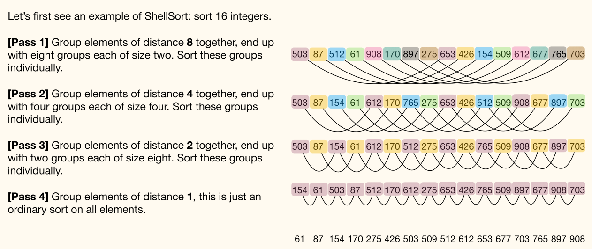

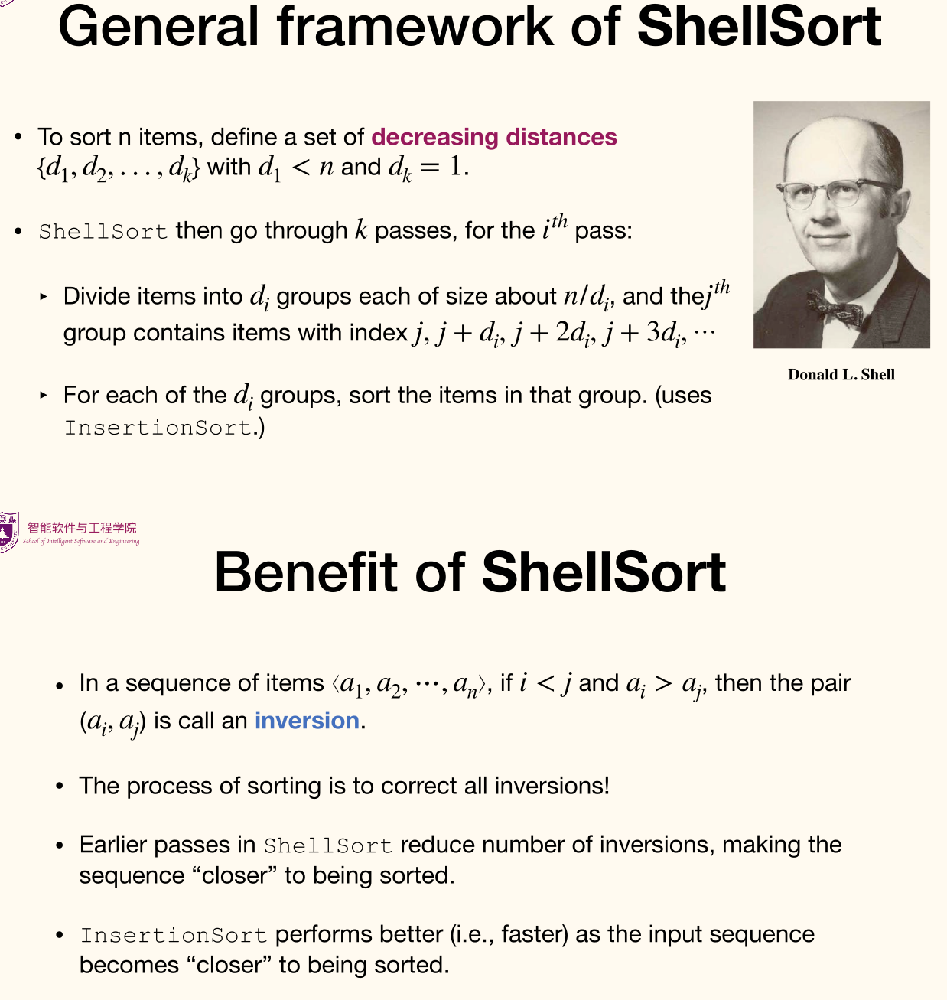

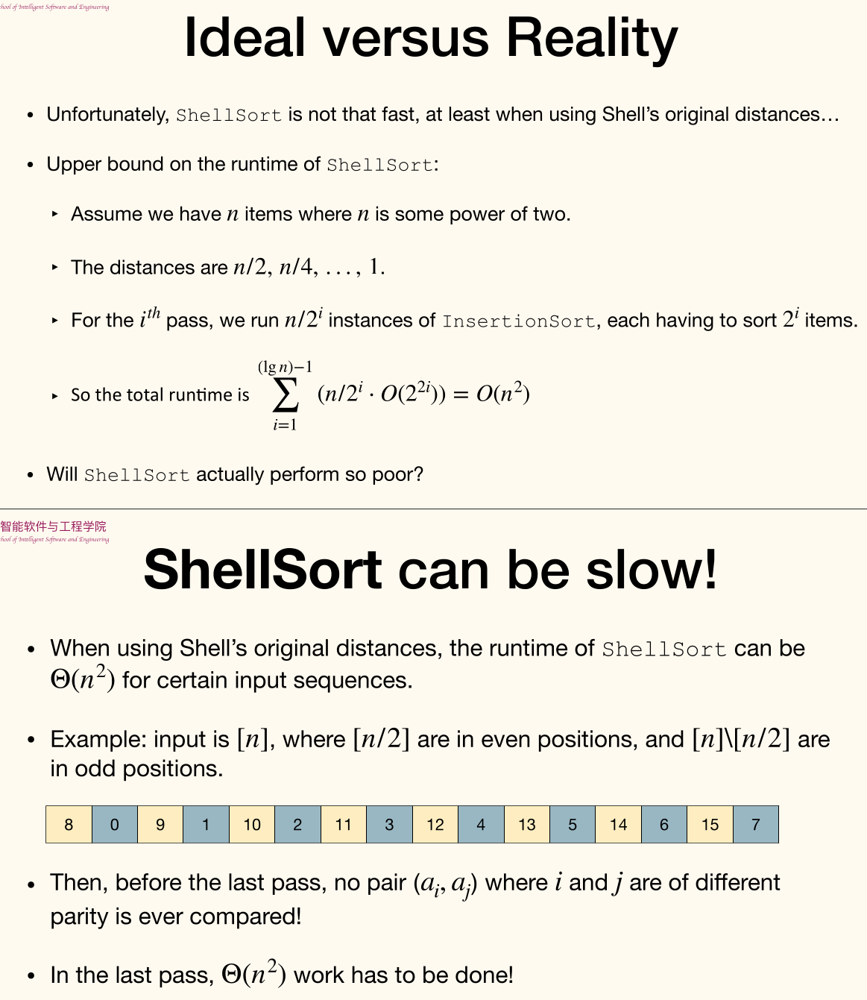

## Quick Sort

Here's a unified view of many sorting algorithms: *Divide* problem into subproblems. *Conquer* subproblems recursively. *Combine* solutions of subproblems.

- Divide the input into size $1$ and size $n-1$.
    - `InsertionSort`: easy to divide, combine needs efforts.
    - `MergeSort`: divide needs efforts, easy to combine.
- Divide the input into two parts each of same size.
    - `MergeSort`: easy to divide, combine needs efforts.
- Divide the input into two parts of *approximately* same size.
    - `QuickSort`: divide needs efforts, easy to combine.

!!! info Basic idea
    Given an array $A$ of $n$ items
    - Choose one item $x$ in $A$ as the **pivot**.
    - Use the pivot to **partition** the input into $B$ and $C$, so that items in $B$ are $\le x$ and items in $C$ are $\ge x$.
    - Recursively sort $B$ and $C$.
    - Output is concatenation of sorted $B$, $x$, and sorted $C$.

```python
QuickSortAbs(A):
x := GetPivot(A)
B, C := Partition(A, x)
return Concatenate(QuickSortAbs(B), x, QuickSortAbs(C))
```

### Choosing the pivot

Ideally the pivot should <u>partition the input into two parts</u> of roughly the same size.

!!! note Median-of-three technique
    Choose median of first, middle, and last element as pivot.

For every simple deterministic method of choosing pivot, we can construct corresponding "bad input".

For now just use the *last item* as the pivot.

### The Partition Procedure

- Allocate array $B$ of size $n$
- Sequentially go through `A[1...(n-1)]`, put small items at the left side of $B$, and large items at the right side of $B$.
- Finally put the pivot in the (only) remaining position

The time complexity is $\Theta(n)$ and space complexity is $\Theta(n)$. And it's unstable.

```python
Partition(A):
x := A[n]
l := 1
r := n
for i := 1 to n - 1
    if A[i] <= x
        B[l] := A[i]
        l := l + 1
    else
        B[r] := A[i]
        r := r - 1
B[l] := x
return <B, l>
```

#### In-place Partition Procedure

!!! note Basic idea
    Sequentially go through $A$, use *swap* operations to move small items to the left part of $A$; thus the right part of $A$ naturally contains large items.

```python
InplacePartition(A, p, r):
i := p - 1
for j := p to r - 1
    if A[j] <= A[r]
        i := i + 1
        Swap(A[i], A[j])
Swap(A[i + 1], A[r])
return i + 1
```

Here's part of in-place partition procedure:

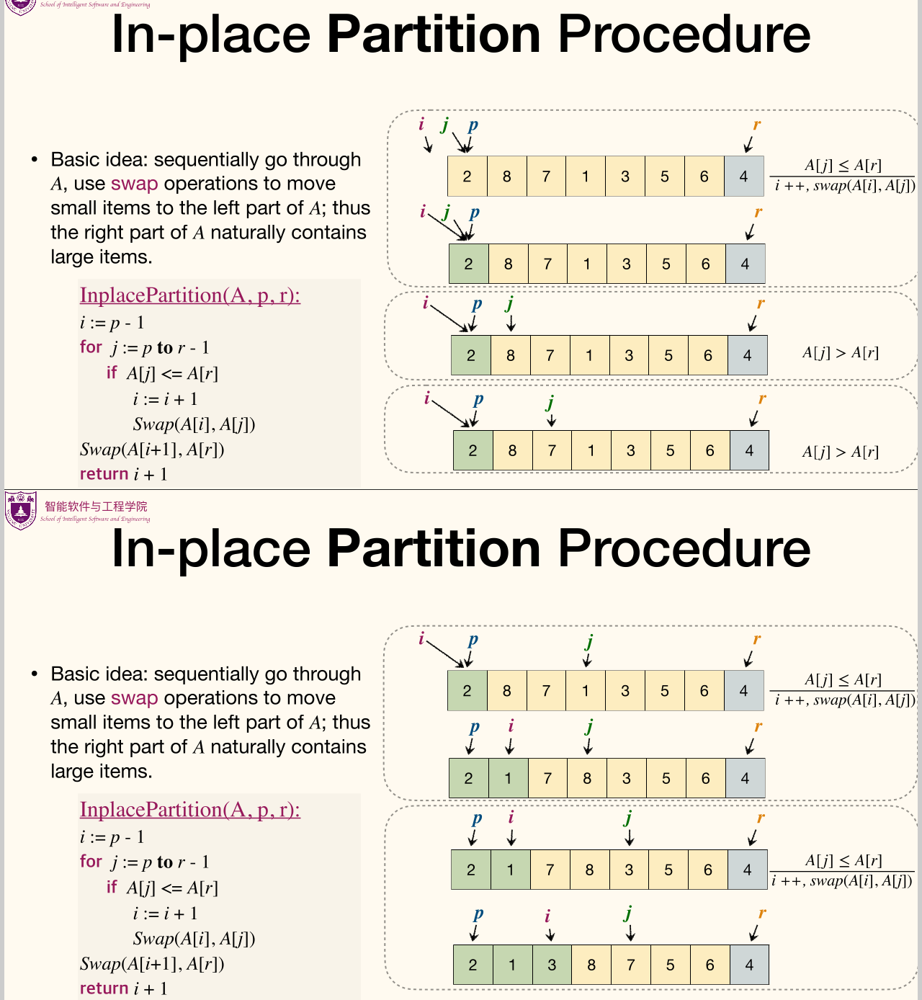

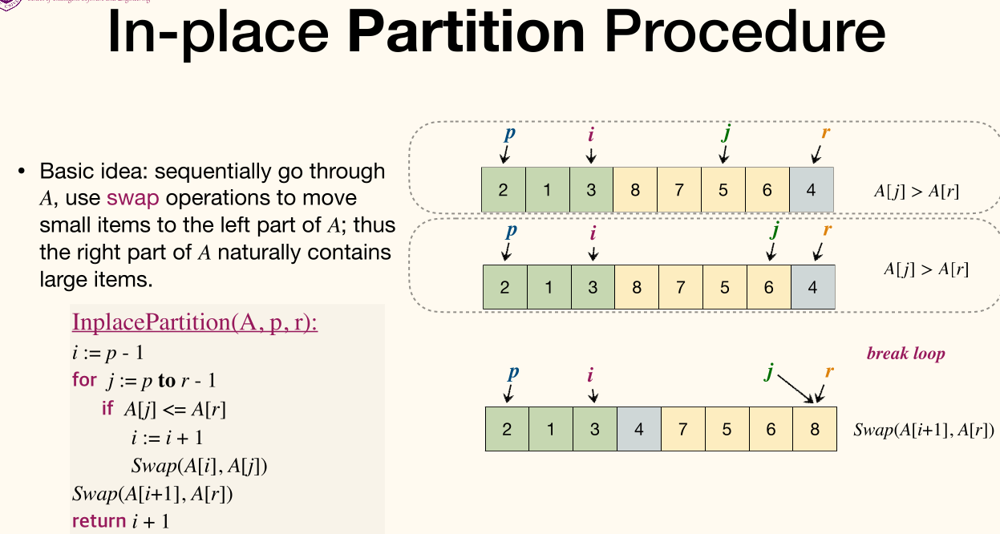

Analysis of In-place Partition Procedure:

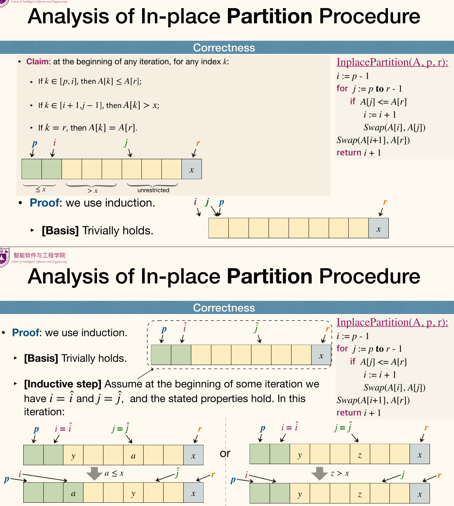

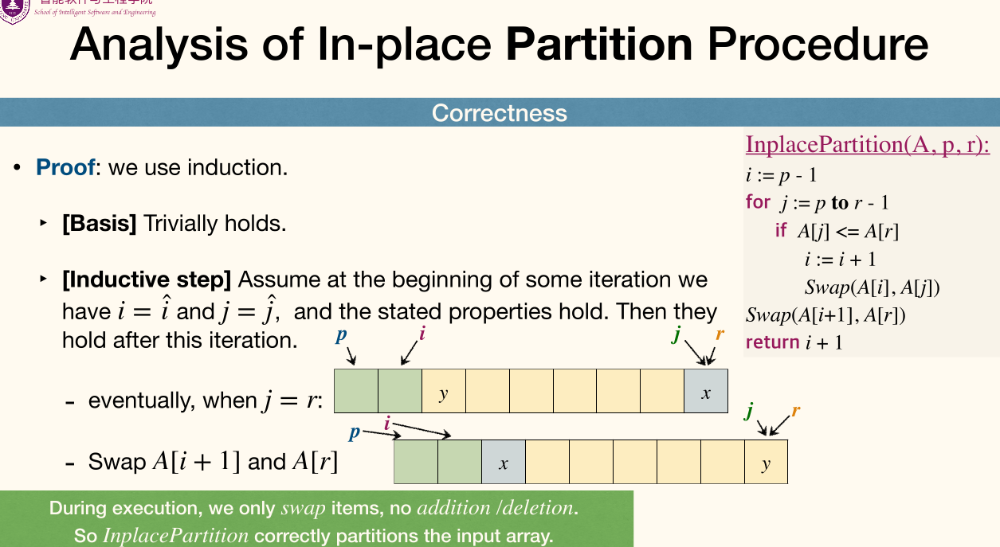

Performance of `InplacePartition`:
- $\Theta(|r - p|)$ time (i.e. linear time)
- $O(1)$ space
- unstable

### Performance

#### Worst-case

Cost at each level is $c_0 (n-m)$, where $m$ is number of pivots removed in lower level `Partition`.

If the partition is balanced, then there will be few levels, and $m$ will increase rapidly.

Recurrence for the worst-case runtime of `QuickSort`:
$$
T(n) = \max_{0 \le q \le n-1} (T(q) + T(n-q-1)) + c_0 n
$$

Guess $T(n) \le c n^2$ and we now verify:
$$
\begin{aligned}
    T(N) &\le \max_{0 \le q \le n-1} (c q^2 + c (n-q-1)^2) + c_0 n\\
    &= c \max_{0 \le q \le n-1} (q^2 + (n-q-1)^2) + c_0 n\\ 
    &\le c(n-1)^2 + c_0n\\
    &= cn^2 - c(2n-1) + c_0n\\ 
    &\le cn^2
\end{aligned}
$$

Thus $T(n) = O(n^2)$.

#### Best-case

Balanced partition gives best case performance. $T(N) \le 2T(\frac{n}{2}) + \Theta(n)$ implies $T(n) = O(n\log n)$.

`Partition` does not need to be perfectly balanced, we only need each split to be constant proportionality. $T(n) \le T(dn) + T((1-d)n) + \Theta(n)$ where $d = \Theta(1)$. It's still $O(n\log n)$.

#### Average-case

Average-case analysis: the expected time of algorithm over all inputs of size $n$: $A(n) = \sum\limits_{x \in \mathscr{X}_n} T(x) \cdot \Pr(x)$.

For `QuickSort`, particular values in the array are not important, instead, the **relative ordering** of the values is what matters (since `QuickSort` is comparison-based).

Therefore, it is important to focus on the permutation of input numbers. A readable assumption is that all permutations of the input numbers are equally likely.

> To make the analysis simple, we also assume that the elements are distinct (duplicate values will be discussed later).

<!-- {{{ Randomized QuickSort -->
<details>
<summary>Randomized QuickSort</summary>

```python
RandQuickSort(A, p, r):
if p < r
    i := Random(p, r)
    Swap(A[r], A[i])
    q := InplacePartition(A, p, r)
    RandQuickSort(A, p, q - 1)
    RandQuickSort(A, q + 1, r)
```

Cost of a call to `RandQuickSort`:
- Choose a pivot in $\Theta(1)$ time;
- Run `InplacePartition`, whose cost is $O(\text{number of comparisons})$;
- Need to call `RandQuickSort` twice, the calling process (not the subroutines themselves) needs $\Theta(1)$ time.

Total cost of `RandQuickSort`:
- Time for choosing pivots is $O(n)$, since each node can be pivot at most once.
- All calls to `InplacePartition` cost $O(\text{total number of comparisons})$.
- Total time for calling `RandQuickSort` is $O(2n)$, since each time a pivot is chosen, two recursive calls are made.

Cost of `RandQuickSort` is $O(n + X)$ where $X$ is a random variable denoting the number of comparisons happened in `InplacePartition` throughout entire execution.

Each of pair of items is compared at most once. Cos items only compare with pivots and each items can be the pivot at most once.

For ease of analysis, we let index the elements of the array `A` by their position in the **sorted** output, rather than their position in the input. For all elements, we refer them to be $z_1 < z_2 < \dots < z_n$.

Let $X_{ij}$ be the indicator random variable that is $1$ if $z_i$ and $z_j$ are compared in `InplacePartition`, and $0$ otherwise. Then we have
$$
\begin{aligned}
    \mathbb{E}[X] &= \mathbb{E}\left[ \sum_{i=1}^{n-1}\sum_{j=i+1}^{n}X_{ij} \right]\\
    &= \sum_{i=1}^{n-1}\sum_{j=i+1}^{n}\mathbb{E}[X_{ij}]\\ 
    &= \sum_{i=1}^{n-1}\sum_{j=i+1}^{n}\Pr(X_{ij} = 1)
\end{aligned}
$$

Let $Z_{ij} = \left\lbrace z \mid z \in A, z_i \le z \le z_{j} \right\rbrace$ where $i \le j$, and $\hat{z}_{ij}$ be the first item in $Z_{ij}$ that is chosen as a pivot.

Then $z_i$ and $z_{j}$ are compared if and only if $\hat{z}_{ij} = z_i$ or $\hat{z}_{ij} = z_j$. Cos items from $Z_{ij}$ stay in the same split until the pivot is chosen from $Z_{ij}$.

Therefore
$$
\begin{aligned}
    \Pr(X_{ij} = 1) &= \Pr(\hat{z}_{ij} = z_i) + \Pr(\hat{z}_{ij} = z_j)\\ 
    &= \dfrac{2}{j - i + 1}
\end{aligned}
$$

Substitute this back to the expectation formula, we get
$$
\begin{aligned}
    \mathbb{E}[X] &= \sum_{i=1}^{n-1}\sum_{j=i+1}^{n}\dfrac{2}{j - i + 1}\\ 
    &= \sum_{i=1}^{n-1}\sum_{k=1}^{n-i}\dfrac{2}{k + 1}\\ 
    &< \sum_{i=1}^{n-1}\sum_{k=1}^n \dfrac{2}{k}\\
    &< 2n H_n\\
    &< 2n(\ln n + 1)\\
    &= O(n\log n)
\end{aligned}
$$

Combined the fact that in the best case, randomized quick sort is $\Theta(n\log(n))$, the expected running time is $\Theta(n\log(n))$.

In fact, runtime of `RandQuickSort` is $O(n\log(n))$ with high probability.

</details>
<!-- }}} -->

Stop recursion once the array is too small.
- Recursion has overhead, `QuickSort` is slow on small arrays.
- Usually using `InsertionSort` for small arrays, resulting in fewer swaps, comparisons or other operations on such small arrays.

### Comparison

- `HeapSort` is non-recursive, minimal auxiliary storage requirement (good for embedded system), but with poor locality of reference, the access of elements is not linear, resulting many caches being missed! It is the slowest among three algorithms.

- In most (not all) tests, `QuickSort` turns out to be faster than `MergeSort`. This is because although `QuickSort` performs 39% more comparisons than `MergeSort`,
but much less movement (copies) of array elements.
- `MergeSort` is a stable sorting, and can take advantage of partially pre-sorted input. Further, `MergeSort` is more efficient at handling slow-to-access sequential media.

## External Sorting\*

External sorting is required when the data being sorted do not fit into the main memory of a computing device and instead they must reside in the slower external memory, usually a disk drive.

Since I/O is rather expensive, the overall execution cost may be far dominated by the I/O, the target of algorithm design is to <u>reduce I/Os</u>.

### External merge sort

!!! info External merge problem
    - Input: 2 sorted lists with $M$ and $N$ pages
    - Output: 1 merged sorted list with $M+N$ pages

We can efficiently (in terms of I/O) merge two lists using a memory buffer of size at least 3 by using only $2(M+N)$ I/Os.

To find an element that is no larger than all elements in two lists, one only needs to compare minimum elements from each list Each time put the current minimum elements back to disk.

Deal with unsorted large files:
1. Split into chunks small enough to sort in memory.
    - each sorted sub-file is called a "run".
2. Merge pairs (or groups) of runs using the external merge algorithm.
3. Keep merging the resulting runs (each time = a "pass") until left with one sorted file.

The 2-way merge algorithm only uses 3 buffer pages
- What if we have more available memory?
    - Use as much of the available memory as possible in every pass
    - Reducing the number of passes reduces I/O

Suppose we have $B \ge 3$ buffer pages available, we can increase length of initial runs.

IO cost becomes $2 N \left(\left\lceil \log_2 \dfrac{N}{B} \right\rceil + 1\right)$(starting with runs of length $B$) from $2 N \left(\left\lceil \log_2 N \right\rceil + 1\right)$(starting with runs of length $1$).

Then, we can perform a $(B-1)$-way merge.

On each pass, we can merge groups of $(B-1)$ runs at a time, instead of merging pairs of runs.

IO cost becomes smaller, $2N(\left\lceil \log_{B-1}\dfrac{N}{B} \right\rceil + 1)$(performing $(B-1)$-way merge).

## Complexity of a problem

### Upper bound and Lower bound

Consider a problem $P$.
- **Upper bound**: how **fast** *can* we solve the problem?
    - 需要多少代价就能解决这个问题？
    - The (worst-case) runtime of an algorithm $A$ on input size $n$ is $T_A(n) = \max\limits_{|I| = n}\left\lbrace \operatorname{cost}_A(I) \right\rbrace$
    - $T_A(n)$ **upper bounds** the complexity of solving problem $P$.
    - Every valid algorithm gives an upper bound on the complexity of $P$.
- **Lower bound**: how **slow** solving the problem *has to be*?
    - 少于多少代价就一定解决不了这个问题？
    - The worst-case complexity of $P$ is the worst-case runtime of the **fastest** algorithm that solves $P$.
    - $T_P(n) = \min\limits_{A \text{ solves }P}\left\lbrace T_A(n) \right\rbrace$
    - $T_P(n)$, usually in the form of $\Omega(f(n))$, **lower bounds** the complexity of solving problem $P$.
    - $T_P(n) = \Omega(f(n))$ means any algorithm has to spend $\Omega(f(n))$ time to solve problem $P$.

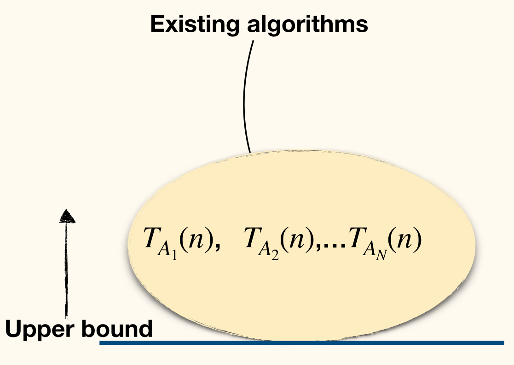

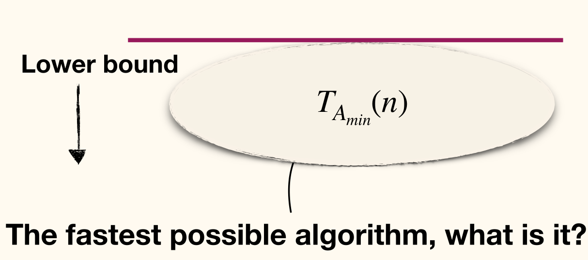

Larger lower bound is a stronger lower bound. (On the other hand, smaller upper bound is better.)

How to prove a lower bound?
- It is usually unpractical to examine all possible algorithms
- Instead, rely on structures/properties of the problem itself

### Trivial Lower Bounds

Lower Bound based on **output** size
- Any algorithm that for inputs of size $n$ has a worst-case output size of $f(n)$ needs to have a runtime of $\Theta(f(n))$.

However, Lower Bound may not based on input size.

Consider output the first element of a $n$-length array, the lower bound is $\Omega(1)$ while its input size is $n$.

The problem with trivial techniques is that it often suggests a lower bound that it is too low.

### Adversary Argument

The lower bound is $T_P(n) = \min\limits_{A \text{ solves }P}\left\lbrace \max\limits_{|I| = n}\left\lbrace \operatorname{cost}_A(I) \right\rbrace \right\rbrace$.

The key is to design the *worst input* for an algorithm, and this algorithm must solve it.

We first have to specify precisely what kinds of algorithms we will consider by using **key operations**. And then devise an **adversary strategy** to construct a worst case input.

#### Key operation

A **key operation** is a step that is representative of the computation overall.

Properties:
- Can be constant-time operations
- Represent or dominate other operations
- Number of key operations should give a function of the input size

A model of computation might be designed around key operations (other computation are omitted)

Examples:
- Access one data item (e.g. query the $i$-th value in an array)
- Compare two categorical items (outcome $=$ or $\ne$)
- Compare two ordinal items (outcome $=, <$ or $>$)
- Determine if two vertices in a graph are adjacent

#### Adversary Strategy

Consider a game similar to $n$-card Monte:
- Suppose we have an array of $n$ bits and we want to determine if *any* of them is a $1$.

Can we do better, without looking at every bit?

Basic idea:
- An all-powerful malicious adversary pretends to choose an input for the algorithm.
- When the algorithm wants checks a bit, the adversary sets that bit to whatever value will make the algorithm **do the most work**.
- If the algorithm does not check enough bits before terminating, then there will be *several different* inputs, each consistent with the bits already checked, and should result in **different outputs**.
- Whatever the algorithm outputs, the adversary can "reveal" an input that is has all the examined bits but contradicts the algorithm's output, and then claim that that was the input that he was using all along.

!!! note ""
    - One absolutely crucial feature of this argument is that <u>the adversary makes absolutely no assumptions about the algorithm</u>.
    - The adversary strategy can’t depend on some predetermined order of examining bits, and it doesn't care about anything the algorithm might or might not do when it's not looking at bits.
    - However, as long as there are *at least two possible answers* to the problem that are **consistent with all answers** given by the adversary, the algorithm cannot be done.

##### Comparison-based sorting

Setup for comparison sorting
- The input to the problem is $n$ elements in some initial order.
- The algorithm knows nothing about the elements.
- The algorithm may compare two elements at a cost of $1$. Particularly, the algorithm can not inspect the values of input items.
- Moving/copying/swapping items is free.
- Assume that the input contains no duplicates.

There are $n!$ different permutations that sorting algorithm must decide between.

The adversary maintains a list $L$ of all of the permutations that are consistent with the comparisons that the algorithm has made so far.

Initially $L$ contains all $n!$ permutations.

The adversary's strategy for responding to the comparison is as follows:
- The adversary answers in such a way to keep $L$ as large as possible. That is, the worst input construction.

!!! tip ""
    有个问题，这像是贪心的，此刻的最大一定能导向未来的最大吗？不过不影响后面的推导。

At least half of the permutations in $L$ remain, and the algorithm can not be done until $|L| = 1$, the number of comparisons required is at least $\left\lceil \log n! \right\rceil$.

Therefore, the lower bound of comparison-based sorting is $\Omega(\log n!) = \Omega(n\log n)$.

### Information-Theoretic Argument

#### The amount of the information

Consider the minimum number $M$ of distinct outputs that a sorting algorithm must be able to produce to be able to sort any possible input of length $n$. Then $M$ must be at least $n!$.

In other words, the algorithm must be capable of outputting at least $M$ different permutations, or there would exist some input that it was not capable of sorting.

The algorithm is deterministic and its behavior is determined entirely by the results of the comparisons.

If a deterministic algorithm makes $c$ comparisons, at most $2^c$ different possible outputs can be produced. This is because one comparison can only has two different outcomes.

Therefore, $2^c \ge n!$, and $c$ is at least $\log n!$.

#### An alternative view: Decision Trees

**Decision Tree**(决策树) can be used to describe algorithms:
- A decision tree is a tree.
- Each internal node denotes a query the algorithm makes on input.
- Outgoing edges denote the possible answers to the query.
- Each leaf denotes an output.

One execution of the algorithm is a path from root to a leaf.

The worst-case time complexity is at least the length of the longest path from root to some leaf, i.e., the height of the tree.

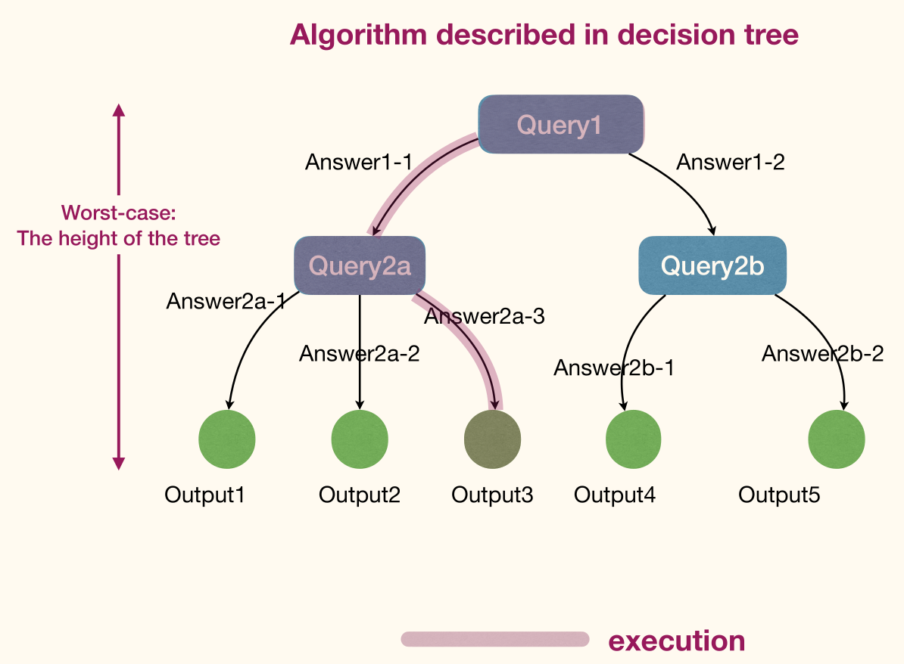

The comparison-based sorting algorithm can be described by a binary comparison tree:
- Each internal node has two outgoing edges
- Each internal node denotes a query of the form $a_i \le a_{j}$

The tree must have $\ge n!$ leaves. The height of the tree must be $\ge \log n!$, which is $\Omega(n \log n)$.

#### Information

!!! info ""
    **Information content**, or **self-information** or **Shannon information** of an event $x$:
    $$
    I(x) \coloneqq - \log \Pr(x)
    $$
    
    or equivalently $I(x) \coloneqq \log \dfrac{1}{\Pr(x)}$.

    It measures the <u>informational value</u> of an event depending on its *surprising*.

    If a highly likely event occurs, it carries very little information. On the other hand, if a highly unlikely event occurs, it is much more informative.

!!! info Information entropy
    Given a discrete random variable $X$, which takes values in the alphabet $\mathscr{X}$ and is distributed according to $\Pr\colon \mathscr{X} \to[0, 1]$, the **entropy**(熵) of a random variable is the <u>avenge level</u> of *information*, *surprise* or *uncertainty* inherent to the variable's possible outcomes.
    $$
    \begin{aligned}
        H(x) &\coloneqq \mathbb{E}[I(x)] \\
        &= \sum_{x \in \mathscr{X}} \Pr(x) \cdot I(x) \\
        &= \sum_{x \in \mathscr{X}} - \Pr(x) \log \Pr(x)
    \end{aligned}
    $$

#### Information-theoretic lower bound

Sorting an array of $n$ size, the entropy of such a random permutation $S$ is $\log n!$ bits.

Since a comparison can give only two results, the maximum amount of information it provides is $1$ bit.

Therefore, after $k$ comparisons, the remaining entropy of the permutation given the results of those comparisons, is at least $\log n! - k$ bits on average.

To perform the sort, complete information is needed, which means the remaining entropy must be $0$. It follows $k$ must be at least $\log n!$ on average.

## Non-comparison-based sorting

### Bucket Sort (桶排序)

!!! info Bucket Sort
    1. Create $d$ empty lists, each list is a **bucket**.
    2. Scan through input. For each item, append it to the end of the corresponding list.
    3. Concatenate all lists.

This algorithm takes $\Theta(n)$ time.

It's not a comparison based algorithm. No comparison between items are made.

```python
BucketSort(A, d):
<L1, L2, ..., Ld> := CreateBuckets(d)
for i := 1 to A.length
    AssignToBucket(A[i])
CombinBuckets(L1, L2, ..., Ld)
```

Total time complexity is $\Theta(n + d)$:
- $\Theta(d)$ time to create buckets.
- $\Theta(n)$ time to assign items to buckets.
- $\Theta(d)$ time to combine buckets.

If the range of items' values is too large, allow each bucket to hold multiple values.

Allocate $k$ bucket each responsible for an interval of size $\dfrac{d}{k}$. 

Now we need to sort each bucket before coming them.

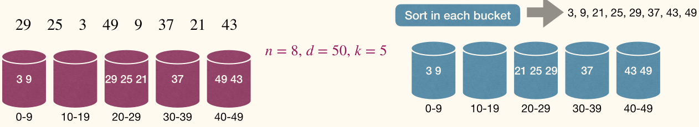

```python
BucketSort(A, k):
<L1, L2, ..., Lk> := CreateBuckets(k)
for i := 1 to A.length
    AssignToBucket(A[i])
for j := 1 to k
    SortWithinBucket(Lj)
CombinBuckets(L1, L2, ..., Lk)
```

Runtime is $\Theta(n + k)$, plus cost for sorting within buckets.

If items are uniformly distributed and we use insertion sort, expected cost for sorting is $O(k (\frac{n}{k})^2) = O(\frac{n^2}{k})$.

Expected total runtime is $O(n + k + \frac{n^2}{k})$, which is $O(n)$ when we have $k \approx n$ buckets.

`BucketSort` can be stable.

### Radix Sort (基数排序)

Assuming we want to sort $n$ decimal integers each of $d$-digits.

Recursive bucket sort:
- Based on most significant bit, assign items to 10 buckets
- Sort recursively in each bucket

`RadixSort` is iterative, starting from *least* significant bit.

```python
RadixSort(A, d):
for i := 1 to d
    use-a-STABLE-SORT-to-sort-A-on-digit-i
```

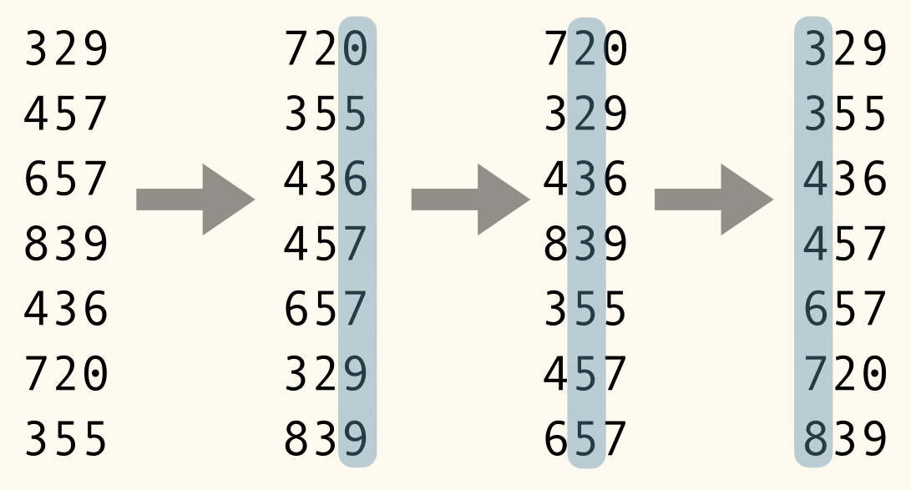

If we use `BucketSort` as the stable sorting method, since we only consider decimal numbers, we need $10 = \Theta(1)$ buckets.

`RadixSort` can sort $n$ decimal $d$-digits numbers in $O(dn)$ time.

### Lower bound for sorting by querying value

Solving the "Sort $n$ integers" problem by querying values of input has a time complexity of $\Omega(n)$.

## Selection

Given a set of $n$ items, the $i$-th **order statistic** (顺序统计量) of it is the $i$-th smallest element of it.

The Selection Problem: given a set $A$ of $n$ distinct numbers and an integer $i$, find the $i$-th order statistic of $A$.

### Find MIN/MAX

Strategy
1. Group items into pairs.
    - The first item becomes a pair if $n$ is odd.
2. For each $\left\lceil \frac{n}{2} \right\rceil$ pairs, find local MIN and MAX.
    - Costing $\left\lfloor \frac{n}{2} \right\rfloor$ comparisons.
3. Among $\left\lceil \frac{n}{2} \right\rceil$ local MIN, find global MIN. Similarly find global MAX.
    - Costing at most $2 \left\lfloor \frac{n}{2} \right\rfloor$ comparisons.

Total number of comparisons is at most $3 \left\lfloor \frac{n}{2} \right\rfloor$.

It's the best way we can do.
- An item has $+$ mark if it can be MAX, and has $-$ mark if it can be MIN.
- Initially each item has both $+$ and $-$.
- An adversary answer queries like "compare $x$ with $y$"
- The adversary can find input such that: at most $\left\lfloor \frac{n}{2} \right\rfloor$ comparisons each remove two marks
    - If in pair $a, b$, $a > b$, then $a$ removes $-$ mark and $b$ removes $+$ mark. It removes two marks in total.
- Each other comparison removes at most one mark.
    - However if in pair $c, d$ having $d > c$, which means $c$ removes $+$ mark and $d$ removes $-$ mark. Then we compare $a$ with $d$ and get $a > d$, we can only remove $d$'s $+$ mark. It removes one mark at most.
- In total need to remove $2n-2$ marks.

So at least $2n-2 -2 \left\lfloor \frac{n}{2} \right\rfloor + \left\lfloor \frac{n}{2} \right\rfloor = 2n-2-\left\lfloor \frac{n}{2} \right\rfloor$ comparisons needed, which can be $3 \left\lfloor \frac{n}{2} \right\rfloor$.

### General Selection Problem

> Find $i$-th smallest element

```python
RndQuickSort(A):
if A.size > 1
    q := RandomPartition(A)
    RndQuickSort(A[1...q-1])
    RndQuickSort(A[q+1...n])
```

Cases:
- What if $i = q$?
    - `A[q]` is what we need.
- What if $i < q$?
    - Find $i$-th order statistic in `A[1...q-1]`
- What if $i > q$?
    - Find $(i-q)$-th order statistic in `A[q+1...n]`

Then we get Reduce-and-Conquer.

```python
RndSelect(A, i):
if A.size == 1
    return A[1]
else
    q := RandomPartition(A)
    if i == q
        return A[q]
    else if i < q
        return RndSelect(A[1...q-1], i)
    else
        return RndSelect(A[q+1...n], i-q)
```

Complexity
- Best case
    - Choosing the answer as the pivot in the first call.
    - $\Theta(n)$
- Worst case
    - Partition reduces array size by one each time.
    - $\Theta(n^2)$
- Average case
    - Analysis will be delivered later.

### Average performance of Randomized Selection

What's unlikely to happen is either get the exactly right pivot or reduces the size just by one.

Instead, what's likely to happen is: partition process reduces problem size by a **constant** factor.

Call a partition *good* if it reduces problem size to at most $\alpha n$ for some constant $\alpha < 1$, says $0.8$.

Let the random variable $C_i$ be the cost since the last good partition to the $i$-th good partition.

Then we have $0.8^{k}n = 1$ and get at most $\log_{1.25} n$ good partitions can occur.
$$
\mathbb{E} [C_i] \le \Theta(1) \cdot 0.8^{i-1}n
$$

The times that we get the first good partition, as a random variable, follows Geometric Distribution.

As we all knows, its expectation has nothing to do but with its probability ($\dfrac{1}{p}$).

As a result, The cost of not good partition can be seen as constant, $\Theta(1)$ above.

Then the total time cost
$$
\begin{aligned}
    \mathbb{E} [T(n)] &\le \mathbb{E} \left[ \sum_{i=1}^{\log_{1.25}n}C_i \right] \\
    &= \sum_{i=1}^{\log_{1.25}n}\mathbb{E}[C_i] \\ 
    &= O(n)
\end{aligned}
$$

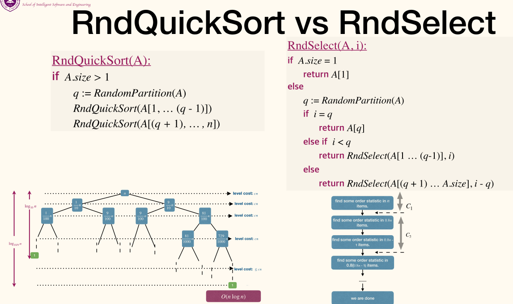

### [Median of medians](https://en.wikipedia.org/wiki/Median_of_medians)

Can we guarantee worst-case runtime of $O(n)$?

The reason that `RndSelect` could be slow is that `RandomPartition` might return an unbalanced partition.

We needs a partition procedure that guarantees to be balanced without using to much time ($O(n)$ time to be specific).

Procedure:
1. Divide elements into $n / 5$ groups, each containing $5$ elements, call these groups $G_1, \dots, G_{n / 5}$.
    - $O(n)$ time
2. Find the medians of these $n / 5$ groups, let $M$ be this set of medians.
    - $\frac{n}{5} \Theta(1) = \Theta(n)$ time
3. Find the median of $M$, call it $m^{*}$. 
    - Use `QuickSelect` recursively

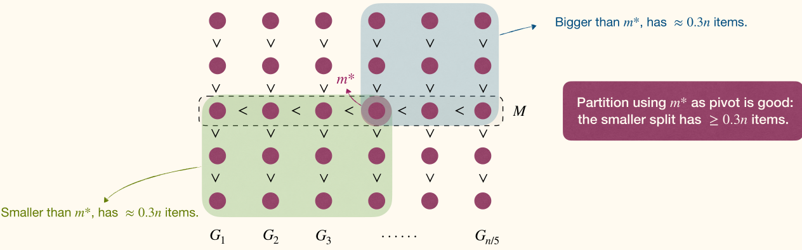

Obviously, $m^{*}$ is not the median of the original array, but it is guaranteed to be between the $30$-th and $70$-th percentile(百分位数) of the original array.

Then we can use $m^{*}$ as the pivot to partition the array.

```python
MedianOfMedian(A):
if A.size == 1
    return A[1]
<G1, ..., Gn/5> := GreateGroups(A)
for i := 1 to n/5
    Sort(Gi)
M := GetMediansFromSortedGroups(G1, ..., Gn/5)
return QuickSelect(M, (n/5)/2)
```

```python
QuickSelect(A, i):
if A.size == 1
    return A[1]
m := MedianOfMedian(A)
q := PartitionWithPivot(A, m)
if i == q
    return A[q]
else if i < q
    return QuickSelect(A[1...q-1], i)
else
    return QuickSelect(A[q+1...n], i-q)
```

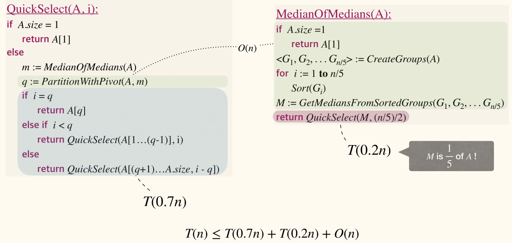

- `QuickSelect` uses O(n) time/comparisons.
- Solving general selection needs at least $n - 1$ comparisons.
- Since finding MIN/MAX needs at least $n - 1$ comparisons.
- So the lower and upper bounds match asymptotically.
- But if we care about constants, needs (much) more efforts, which is not the topic of this course.
