## Tree

!!! memo ""
    本节也许可以参考[《离散数学》——树](/notes/D-discrete-mathematics/18-tree)。

!!! info Recursive definition
    A **tree**(树) is either empty, or has a **root**(根) $r$ that connects to the roots of zero or more non-empty (sub)trees.
    - Root of each subtree is called a **child**(子) of the root of the tree. And $r$ is the **parent**(父) of each subtree's root.
    - Nodes with no children are called **leaves**(叶子).
    - Nodes with same parent are **siblings**(兄弟).
    - If a node $v$ is on the path from $r$ to $u$, then $v$ is an **ancestor**(祖先) of $u$, and $u$ is a **descendant**(后代) of $v$.

    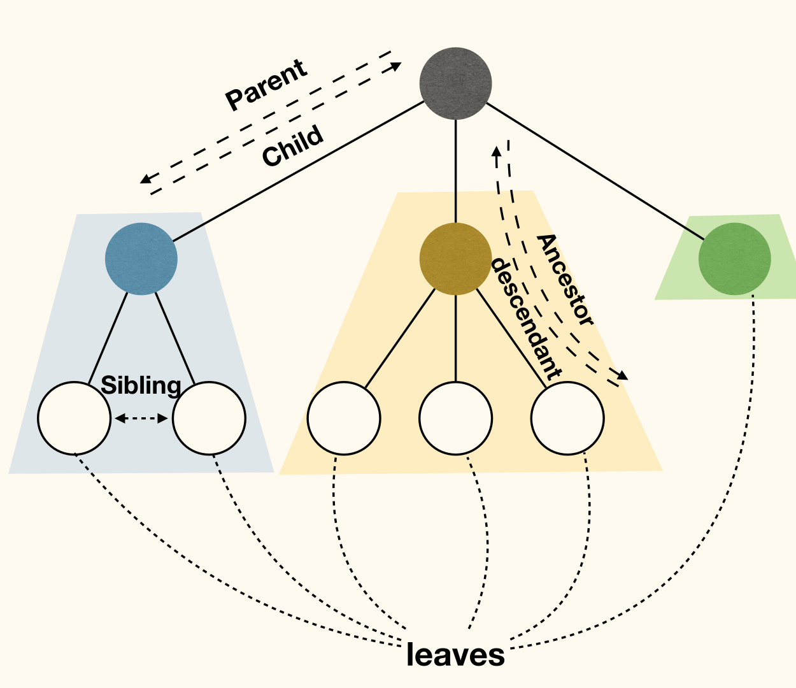

More terminology
- The **depth**(深度) of a node $u$ is the length of the path from $u$ to the root $r$.
- The **height**(高度) of a node $u$ is the length of the longest path from $u$ to one of its descendants.
    - Height of a leaf node is zero.
    - Height of a non-leaf node is the maximum height of its children plus one.

### Binary Trees

A **binary tree**(二叉树) is a tree where each node has at most two children. Often call these children as *left child* and *right child*.


#### Full Binary Trees

A **full binary tree**(满二叉树) is a binary tree where each node has either zero or two children.

A full binary tree is either a single node, or a tree where the two subtrees of the root are full binary trees.

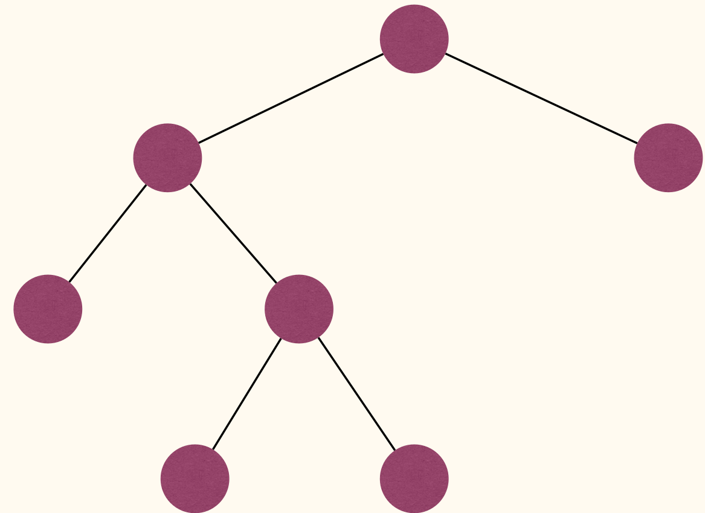

#### Complete Binary Trees

A **complete binary tree**(完全二叉树) is a binary tree where every level, except possibly the last, is completely filled, and all nodes are as far left as possible.

A complete binary tree can be efficiently represented using an array.

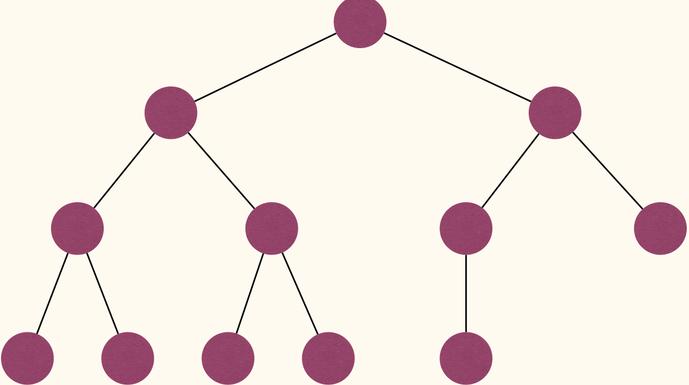

#### Perfect Binary Trees

A **perfect binary tree**(完美二叉树) is a binary tree where all non-leaf nodes have two children and all leaves are at the same level (have same depth).

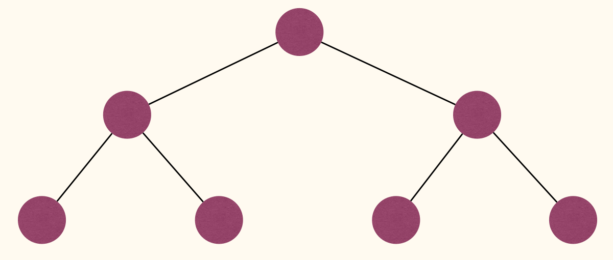

### Representation

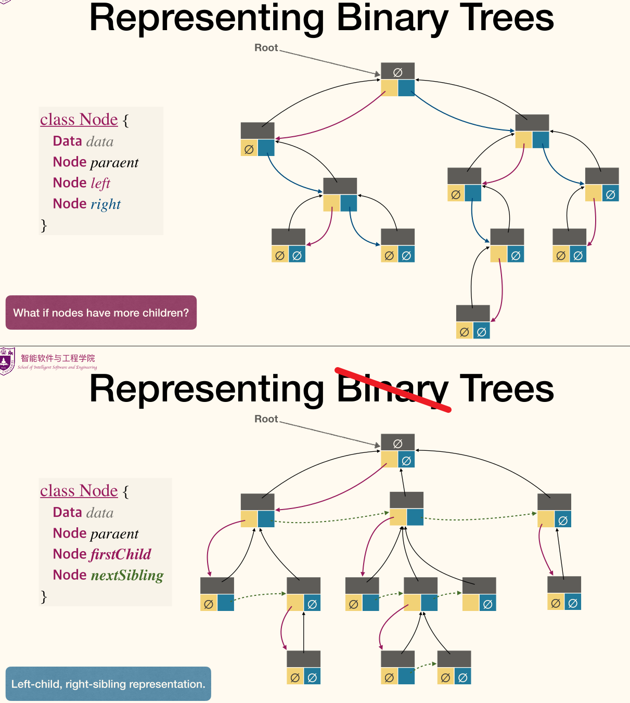

### Traversal

- **Preorder traversal**(先序遍历): given a tree with root $r$, first visit $r$, then visit subtrees rooted at $r$'s children, using preorder traversal.
- **Postorder traversal**(后序遍历): given a tree with root $r$, first visit subtrees rooted at $r$'s children using postorder traversal, then visit $r$.
- **Inorder traversal**(中序遍历): given a *binary* tree with root $r$, first visit subtree rooted at `r.left`, then visit $r$, finally visit subtree rooted at `r.right`.

#### Preorder traversal

```python
PreorderTrav(r):
if r != NULL
    Visit(r)
    for each child u of r
        PreorderTrav(u)
```

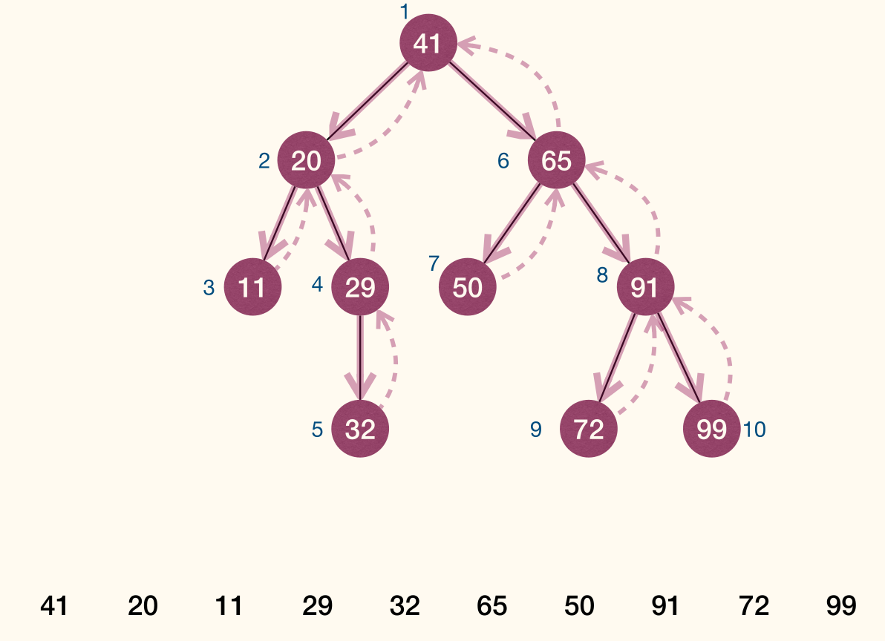

#### Postorder traversal

```python
PostorderTrav(r):
if r != NULL
    for each child u of r
        PostorderTrav(u)
    Visit(r)
```

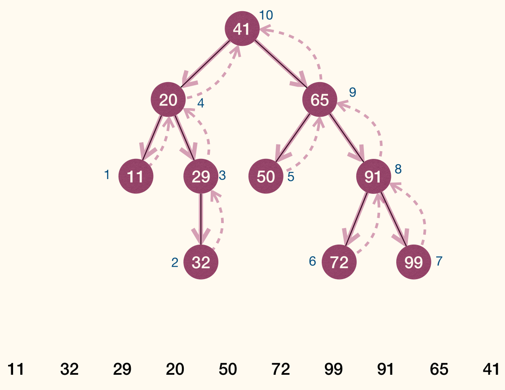

#### Inorder traversal

```python
InorderTrav(r):
if r != NULL
    InorderTrav(r.left)
    Visit(r)
    InorderTrav(r.right)
```

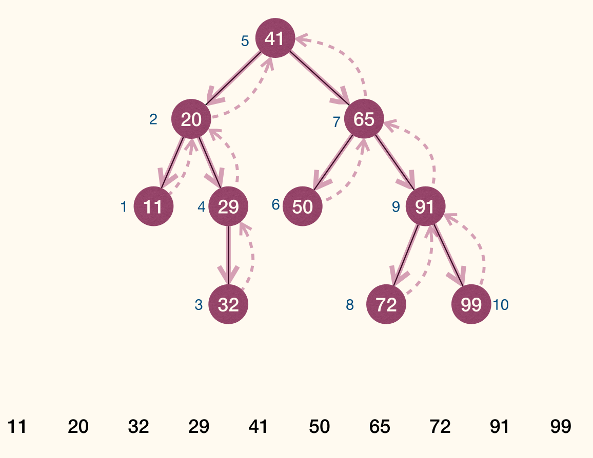

#### Complexity

Complexity
- Time Complexity: $\Theta(n)$ as processing each node takes $\Theta(1)$.
- Space complexity: $O(n)$ as worst-case call stack depth is $\Theta(n)$.

#### Iterative

```java
class Frame {
    Node node
    bool visited
    Frame(Node n, bool v) {
        node := n
        visited := v
    }
}

PreorderTravIter(r):
Stack s
s.push(Frame(r, false))
while !s.empty()
    f := s.pop()
    if f.node != NULL
        if f.visited
            Visit(f.node)
        else
            // Exchange this two lines to get postorder traversal
            for each child u of f.node
                s.push(Frame(u, false))
            s.push(Frame(f.node, true))

InorderTravIter(r):
Stack s
s.push(Frame(r, false))
while !s.empty()
    f := s.pop()
    if f.node != NULL
        if f.visited
            Visit(f.node)
        else
            s.push(Frame(f.node.right, false))
            // Cos Stack is LIFO
            s.push(Frame(f.node, true))
            s.push(Frame(f.node.left, false))
```

Complexity
- Time Complexity: $\Theta(n)$.
- Space Complexity: $O(n)$ in worst-case.

> *Morris Inorder Traversal* is a tree traversal algorithm aiming to achieve a space complexity of $O(1)$ without recursion or an external data structure.

### Level-order traversal

Previous methods are all **depth-first**(深度优先) traversal. And another special kind of traversal is **breadth-first**(广度优先) traversal, which is also called **level-order traversal**.

In a breadth-first traversal, the nodes are visited level-by-level starting at the root and moving down, visiting the nodes at each level from left to right.

```java
LevelorderTrav(r):
if r!= NULL
    Queue q
    q.add(r)
    while !q.empty()
        node := q.remove()
        if node != NULL
            Visit(node)
            for each child u of node
                q.add(u)
```

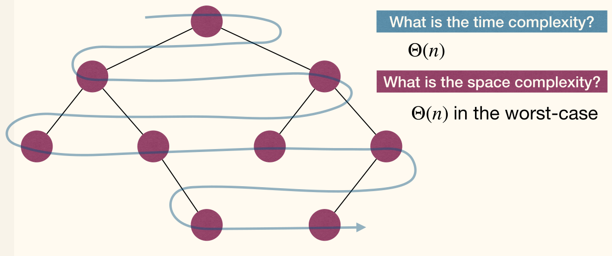

## Search Trees

### The Dictionary ADT

!!! info Dictionary
    A **Dictionary**(字典, also called symbol-table, relation or map) ADT is used to represent a set of elements with (usually distinct) *key* values.

    Each element has a `key` field and a `data` field.

Operations:
- `Search(S, k)`: Find an element in `S` with key value `k`.
- `Insert(S, x)`: Add `x` to `S`.
    - Convention of existence of same key: the new value replaces the old one.
- `Remove(S, x)`: Remove element `x` from `S`, assuming `x` is in `S`.
- `Remove(S, k)`: Remove element with key value `k` from `S`.

In typical applications, keys are from an ordered universe (*Ordered Dictionary*):
- `Min(S)` and `Max(S)`: Find the element in `S` with minimum/maximum key.
- `Successor(S, x)` or `Successor(S, k)`: Find smallest element in `S` that is larger than `x.key` or key `k`.
- `Predecessor(S, x)` or `Predecessor(S, k)`: Find largest element in `S` that is smaller than `x.key` or key `k`.

Efficient implementation of ORDERED DICTIONARY:

|        Operations         | `Search(S, k)` | `Insert(S, x)` | `Remove(S, x)` |
|       :-:        |      :-:       |      :-:       |      :-:       |
|   SimpleArray    |     $O(n)$     |     $O(1)$     |     $O(n)$     |
| SimpleLinkedList |     $O(n)$     |     $O(1)$     |     $O(1)$     |
|   SortedArray    |  $O(\log n)$   |     $O(n)$     |     $O(n)$     |
| SortedLinkedList |     $O(n)$     |     $O(n)$     |     $O(1)$     |
|    BinaryHeap    |     $O(n)$     |  $O(\log n)$   |  $O(\log n)$   |

A data structure implementing all these operations is called efficient, if all these operations cost $O(\log n)$ time.

### Binary Search Tree (BST)

!!! info Binary Search Tree (BST)
    A binary search tree (BST) is a binary tree in which each node stores an element, and satisfies the binary-search-tree property (**BST property**):
    1. For every node `x` in the tree, if `y` is in the left subtree of `x`, then `y.key <= x.key`; if `y` is in the right subtree of `x`, then `y.key >= x.key`.
    2. Given a BST `T`, let `S` be the set of elements stored in `T`, then the sequence of inorder traversal of `T` is elements of `S` in ascending order.

    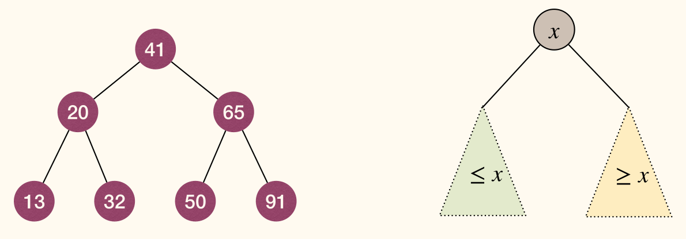

    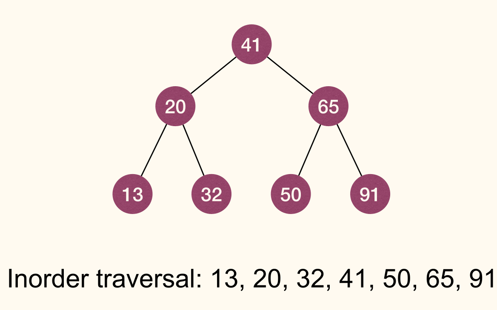

#### Operations

##### Searching

Given a BST root `x` and key `k`, find an element with key `k`:
- If `x.key == k`, then return `x` and we are done.
- If `x.key > k`, then *recurse* into the BST rooted at `x.left`.
- If `x.key < k`, then *recurse* into the BST rooted at `x.right`.

```python
BSTSearch(x, k):
if x == NULL or x.key == k
    return x
else if x.key > k
    return BSTSearch(x.left, k)
else
    return BSTSearch(x.right, k)
```

We can transform tail recursion into iterative version:

```python
BSTSearchIter(x, k):
while x != NULL and x.key != k
    if x.key > k
        x = x.left
    else
        x = x.right
return x
```

Complexity
- Worst-case time complexity
    - $\Theta(h)$ where $h$ is the height of the BST.
- How large can $h$ be in an $n$-node BST?
    - $\Theta(n)$ where the BST is like a path (image below).
- How small can $h$ be in an $n$-node BST?
    - $\Theta(\log n)$ where the BST is well balanced (image below).

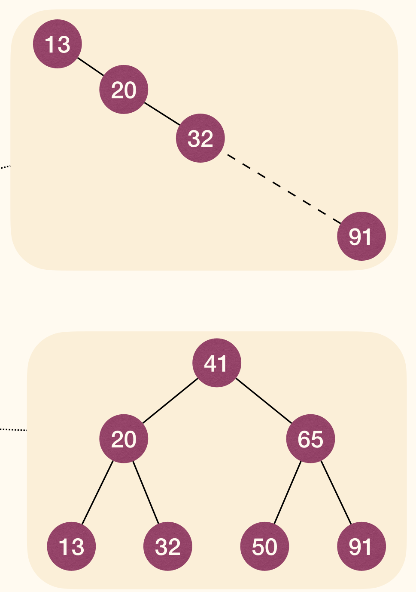

As a result, the height of the BST affects the efficiency of Searching operation.

##### MIN/MAX in BST

Time complexity: $\Theta(h)$ in the worst-case where $h$ is height.

##### Successor in BST

`BSTSuccessor(x)` finds the smallest element in the BST with key value larger than `x.key`.

Inorder traversal of BST lists elements in sorted order.

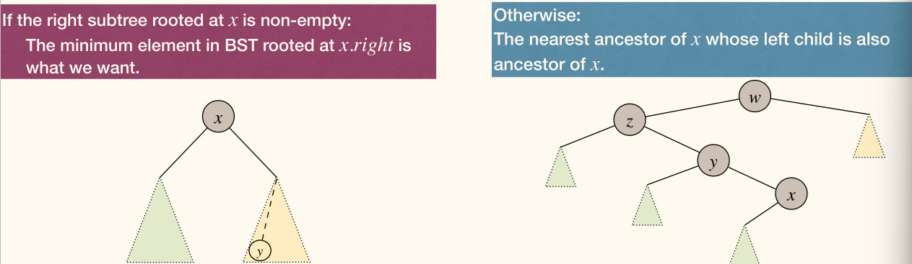

```python
if x.right != NULL
    return BSTMin(x.right)
y := x.parent
while y != NULL and y.right == x
    x := y
    y := y.parent
return y
```

Time complexity of `BSTSuccessor` is $\Theta(h)$ in the worst-case where $h$ is height.

`BSTPredecessor` can be designed and analyzed similarly.

##### Insert in BST

`BSTInsert(T, z)` adds `z` to BST `T`. Insertion should not break the BST property.

Like doing a search in `T` with key `z.key`. This search will fail and end at leaf `y`. Insert `z` as left or right child of `y`.

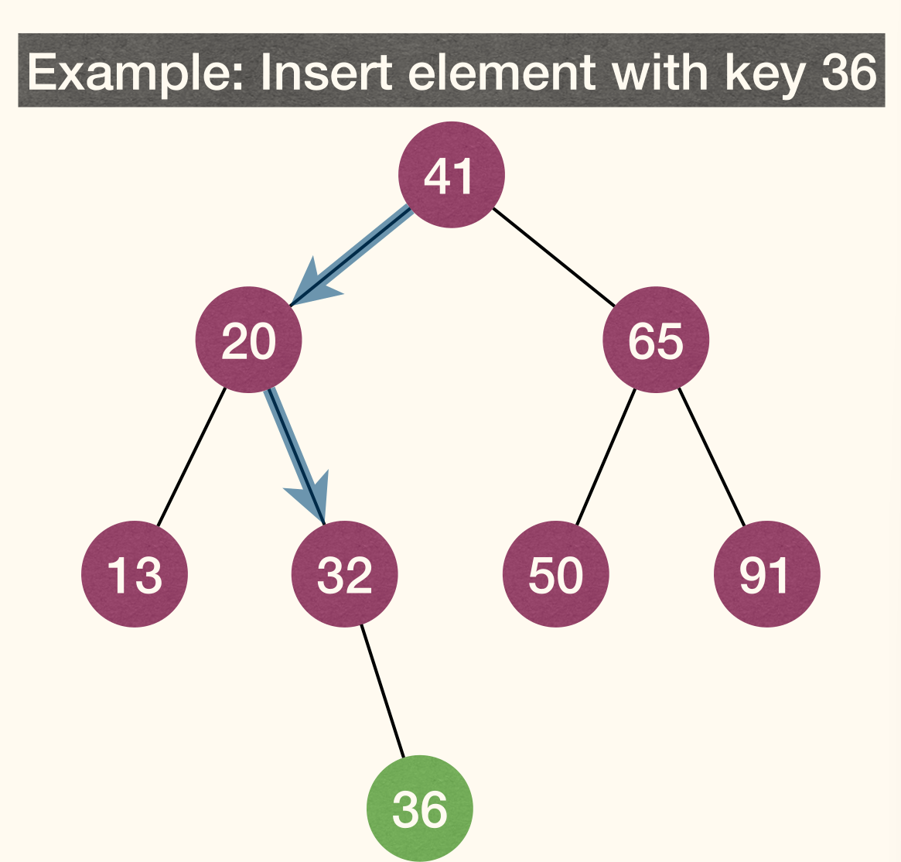

Time complexity: $\Theta(h)$ in the worst-case where $h$ is height.

##### Remove in BST

`BSTRemove(T, z)` removes `z` from BST `T`. There are three cases:
1. `z` has no children
    - 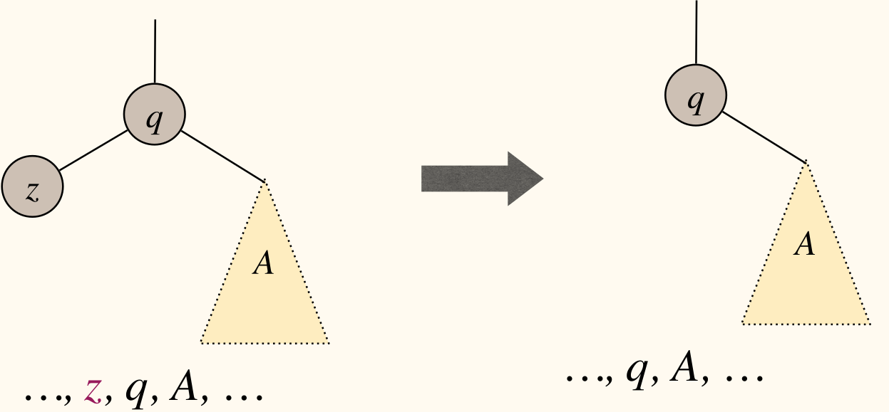
    - We can simply remove `z` from the BST tree
2. `z` has one child
    - 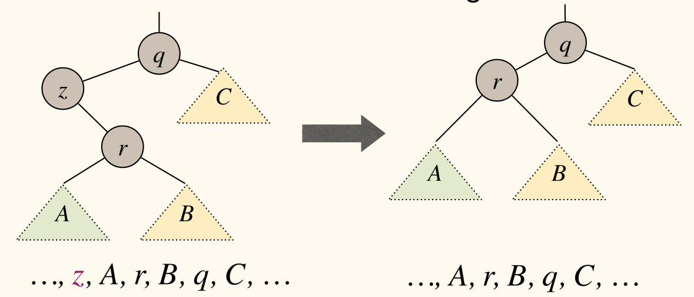
    - We can elevate subtree rooted at `z`'s single child to take `z`'s position.
3. `z` has two children
    - 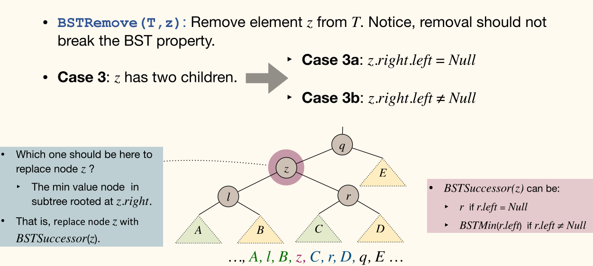
    - 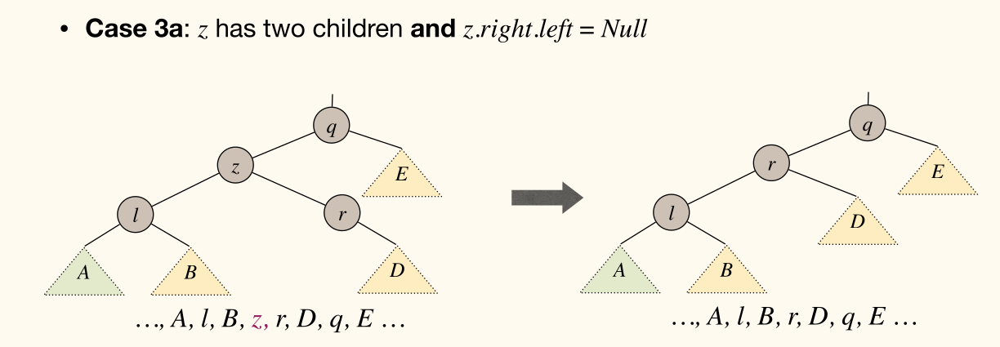
    - 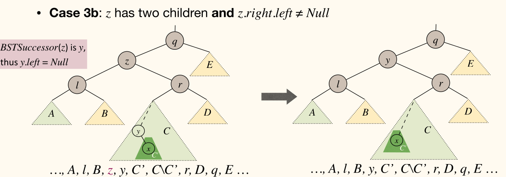

Complexity: $\Theta(h)$ in the worst-case where $h$ is height.

We can update the table:

|    Operations    | `Search(S, k)` | `Insert(S, x)` | `Remove(S, x)` |
|       :-:        |      :-:       |      :-:       |      :-:       |
|   SimpleArray    |     $O(n)$     |     $O(1)$     |     $O(n)$     |
| SimpleLinkedList |     $O(n)$     |     $O(1)$     |     $O(1)$     |
|   SortedArray    |  $O(\log n)$   |     $O(n)$     |     $O(n)$     |
| SortedLinkedList |     $O(n)$     |     $O(n)$     |     $O(1)$     |
|    BinaryHeap    |     $O(n)$     |  $O(\log n)$   |  $O(\log n)$   |
| BinarySearchTree |     $O(h)$     |     $O(h)$     |     $O(h)$     |

BST also supports other operations of ORDERED DICTIONARY in $O(h)$ time. But the height of a $n$-node BST varies between $\Theta(\log n)$ and $\Theta(n)$.

#### Height of BST

Consider a sequence of insert operations given by an adversary, the resulting BST can have height $\Theta(n)$. E.g., insert elements in increasing order.

Build the BST from an empty BST with $n$ insert operations. Each of the $n!$ insertion orders is equally likely to happen.

The expected height of a randomly built BST is $O(\log n)$.

### Treaps

!!! info ""
    A **Treap**(Binary-Search-**Tre**e + H**eap**, 树堆) is a binary tree where each node has a key value, and a priority value (usually randomly assigned).

    The *key values* must satisfy the BST-property:
    - For each node `y` in the left subtree of `x`: `y.key <= x.key`.
    - For each node `y` in the right subtree of `x`: `y.key >= x.key`.

    The *priority values* must satisfy the MinHeap-property:
    - For each descendant `y` of `x`: `y.priority >= x.priority`.

    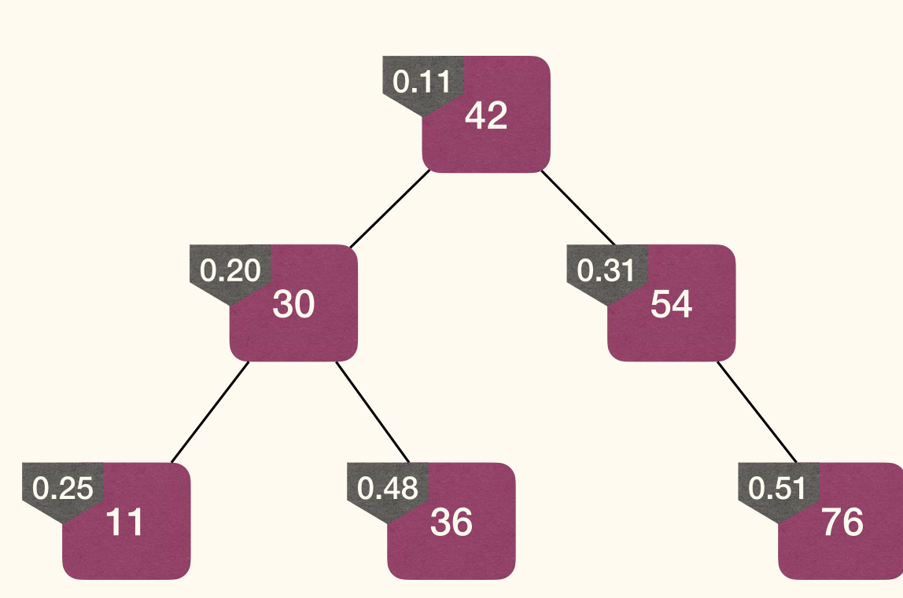

A TREAP is not necessarily a complete binary tree, thus it is not a BinaryHeap.

#### Uniqueness

!!! note ""
    Given a set of $n$ nodes with *distinct* key values and distinct priority values, a **unique** TREAP is determined.

    <!-- {{{ Proof -->
    <details>
    <summary>Proof</summary>
    
    Proof by induction on $n$:
    - Basic: The claim clearly holds when $n = 0$
    - Hypothesis: The claim holds when $n \le n' - 1$

    Inductive Step:
    - - Given a set of $n'$ nodes, let `r` be the node with minimum priority. By MinHeap-property, `r` has to be the root of the final TREAP.
    - Let `L` be set of nodes with key values less than `r.key`, and `R` be set of nodes with key values larger than `r.key`.
    - By BST-property, in the final TREAP, nodes in `L` must in left sub-tree of `r`, and nodes in `R` must in right sub-tree of `r`.
    - By induction hypothesis, nodes in `L` lead to a unique TREAP, and nodes in `R` lead to a unique TREAP.
    
    </details>
    <!-- }}} -->

### Build

Starting from an empty TREAP, whenever we are given a node `x` that needs to be added, we assign a random priority for node `x`, and insert the node into the TREAP.

Here's an alternative view of an $n$-node TREAP: A TREAP is a BST built with $n$ insertions in the order of increasing priorities.

Then, a TREAP is like a randomly built BST, regardless of the order of the insert operations, since we use *random* priorities.

A TREAP has height $O(\log n)$ in expectation. Therefore, all *ordered dictionary* operations are efficient in expectation.

#### Insert

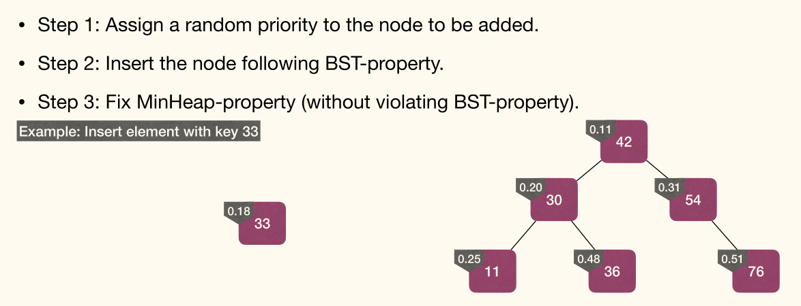

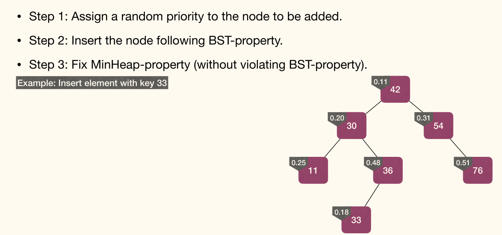

Rotation changes level of `x` and `y`, but preserves BST property:
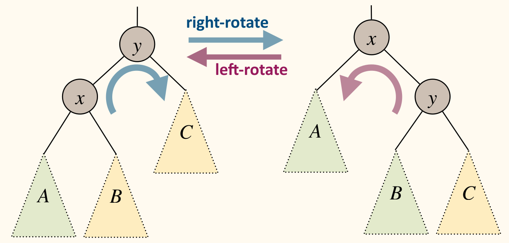

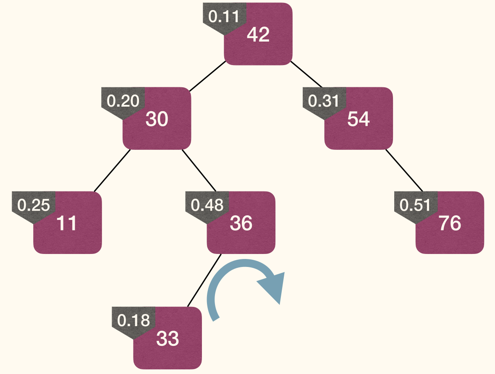

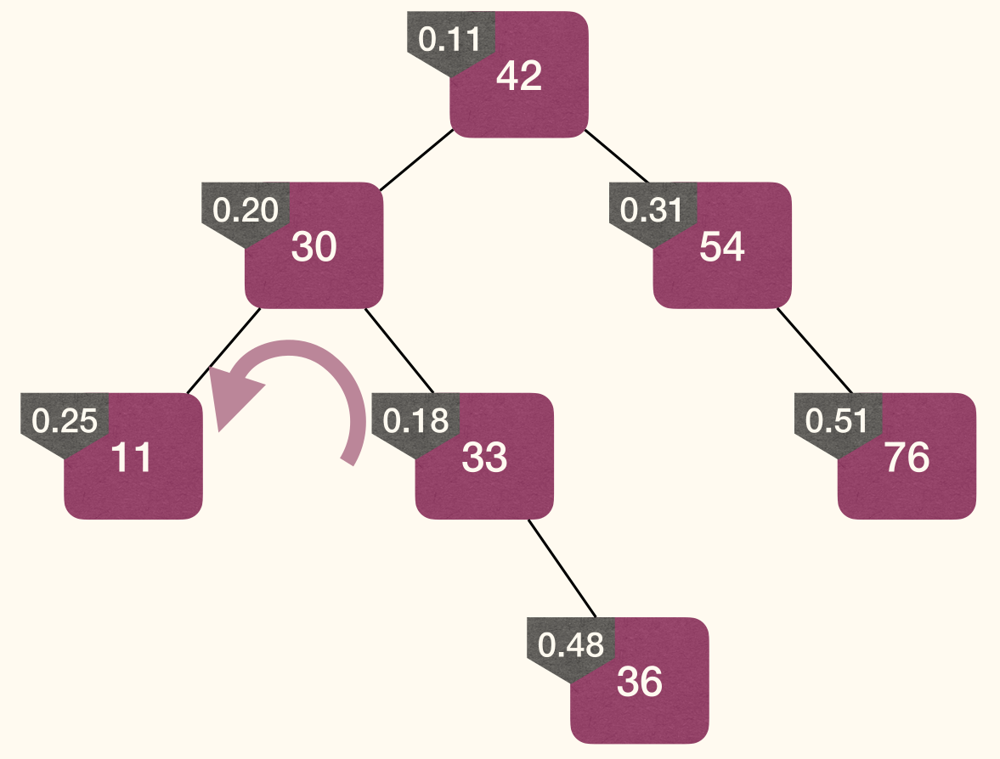

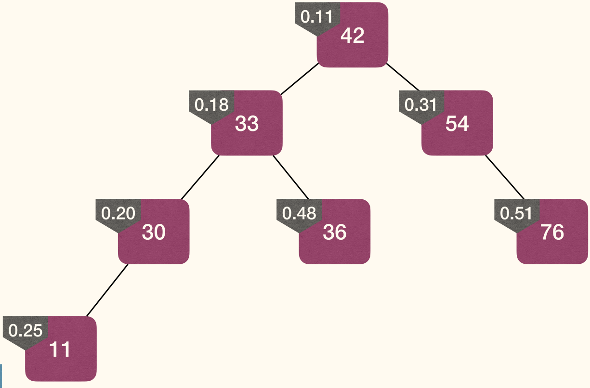

Steps:
1. Assign a random priority to the node to be added.
2. Insert the node following BST-property.
3. Fix MinHeap-property (without violating BST-property).

#### Remove

Steps:
1. Use rotations to push-down the node till it is a leaf.
2. Remove the leaf.

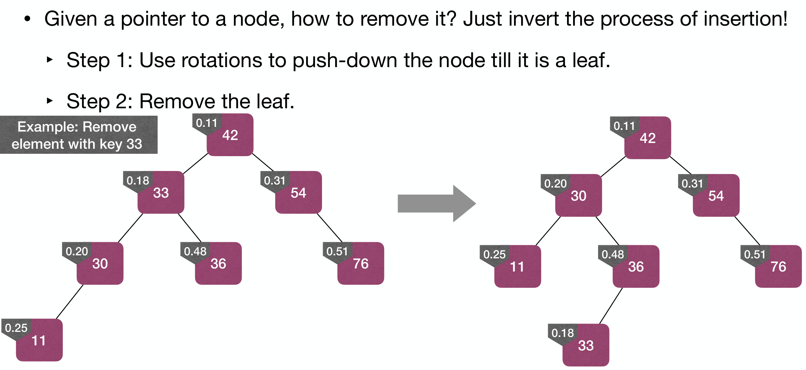

### Red-Black Tree

TREAP is nice, but can we have a DST supporting ordered dictionary operations in $O(\log n)$ time, even in worst-case?

An $n$-node BST is **balanced** if it has height $O(\log n)$.

!!! info Red-Black Tree (RB-Tree)
    A Red-Black Tree (红黑树, RB-Tree) is a BST in which each node has a color, and satisfies es the following properties:
    - Every node is either $\textcolor{red}{\text{red}}$ or $\textcolor{orange}{\text{black}}$.
    - The root is $\textcolor{orange}{\text{black}}$.
    - Every leaf (NIL) is $\textcolor{orange}{\text{black}}$.
    - No red edge: If a node is $\textcolor{red}{\text{red}}$, then both its children are $\textcolor{orange}{\text{black}}$.
    - Black height: For every node, all paths from the node to its descendant leaves contain same number of $\textcolor{orange}{\text{black}}$ nodes.

    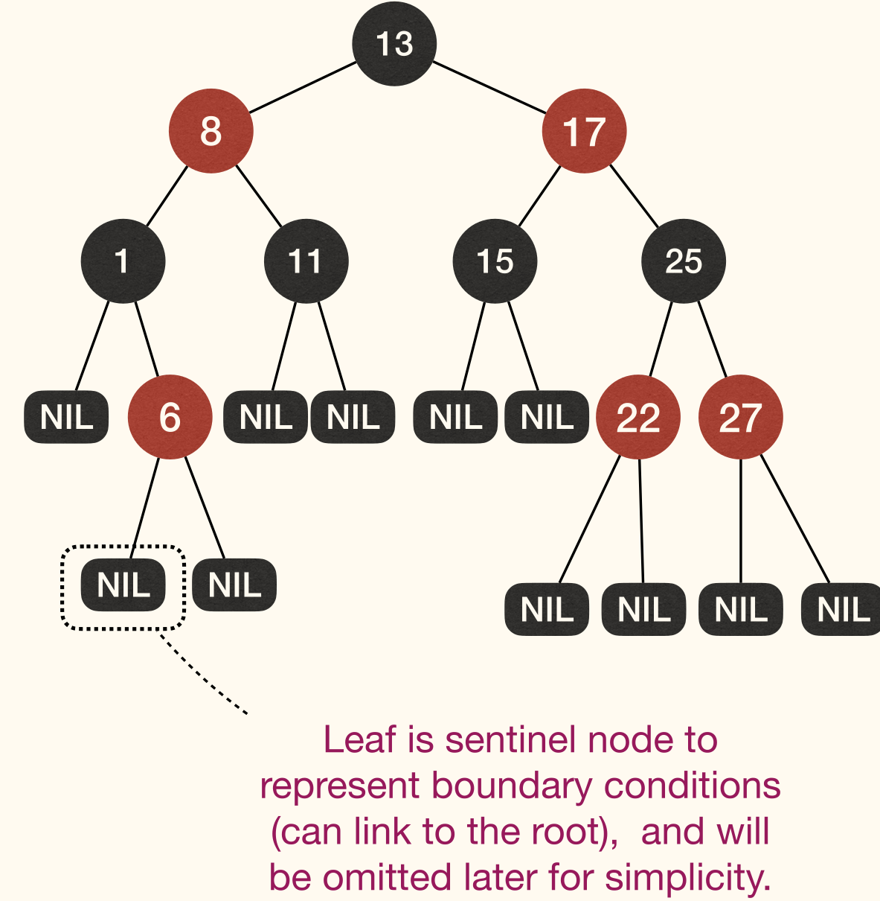

#### Black Height

Call the number of $\textcolor{orange}{\text{black}}$ nodes on any simple path from, but not including, a node `x` down to a leaf the black-height of the node, denoted by `bh(x)`.
- Due to <u>black-height property</u>, from the black-height perspective, RB-Trees are "*perfectly balanced*".
- Due to <u>no-red-edge property</u>, actual height of a RB-Tree does not deviate a lot from its black-height.

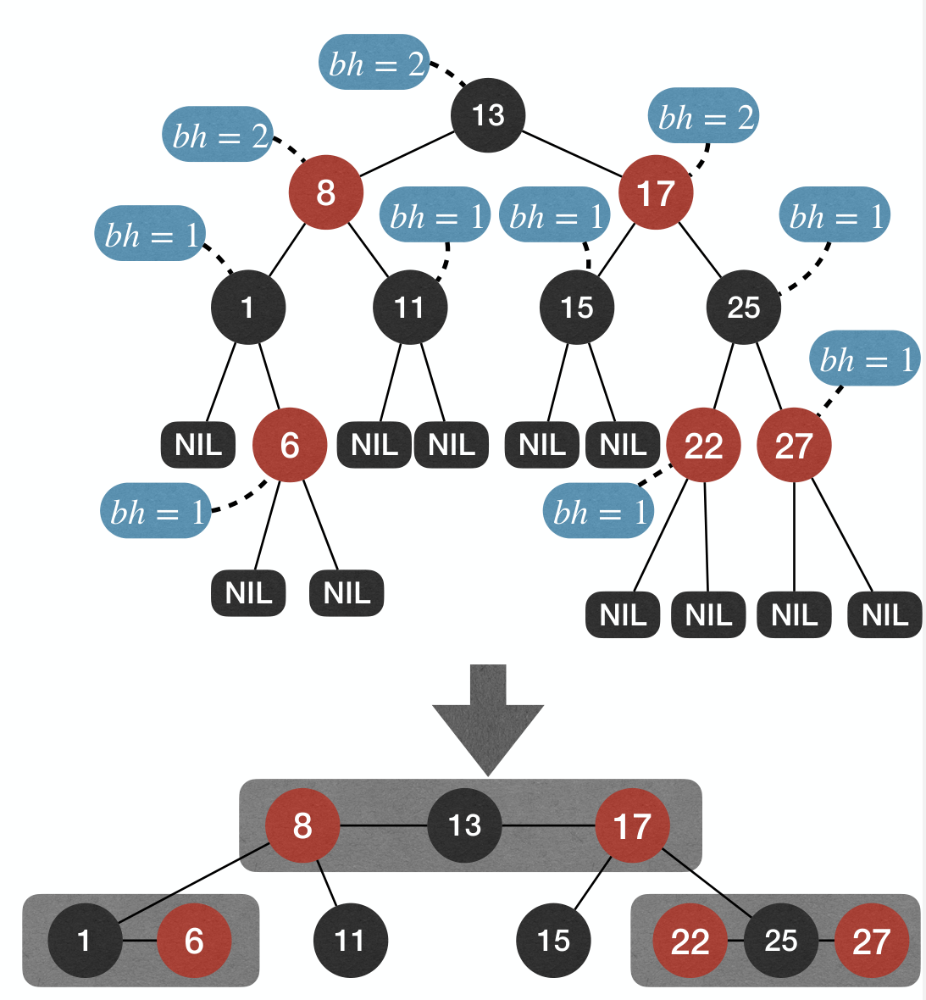

#### Height of RB-Tree

!!! info ""
    In a RB-Tree, the subtree rooted at `x` contains **at least** $2^{\operatorname{bh}(x)} - 1$ internal nodes.

    <!-- {{{ Proof -->
    <details>
    <summary>Proof</summary>
    
    Proof by induction on black-height of `x`:
    - Basic: If `x` is a leaf, $\operatorname{bh}(x) = 0$ and the claim holds.
    - Hypothesis: The claim holds for all nodes with height at most $h-1$.

    Inductive Step: Consider a node `x` with height $h \ge 1$. It must have two children. So the number of internal nodes rooted at `x` is:
    $$
    \begin{aligned}
        &\ge 1 + (2^{\operatorname{bh}(x.\mathrm{left})} - 1) + (2^{\operatorname{bh}(x.\mathrm{right})} - 1) \\ 
        &\ge 1 + (2^{\operatorname{bh}(x)-1} - 1) + (2^{\operatorname{bh}(x)-1} - 1) \\ 
        &= 2^{\operatorname{bh}(x)} - 1
    \end{aligned}
    $$
    
    </details>
    <!-- }}} -->

Due to no-red-edge, $h = \operatorname{height}(\mathrm{root}) \le 2 \operatorname{bh}(\mathrm{root})$.

Therefore, $n \ge 2^{\operatorname{bh}(\mathrm{root})} - 1 \ge 2^{\frac{h}{2}} - 1$ implying that $h \le 2 \log (n+1)$.

Then, the height of an $n$-node RB-Tree is $O(\log n)$. `Search`, `Min`, `Max`, `Predecessor`, `Successor` operations in worst-case is $O(\log n)$ time.

#### Insert

Steps:
1. Colorize `z` as $\textcolor{red}{\text{red}}$ and insert as if the RB-Tree was a BST.
    - The colorization should maintain b-h and fix n-r-e if necessary.
2. Fix any violated properties.
    - No fix is needed if `z` has a $\textcolor{orange}{\text{black}}$ parent. In this case, $\textcolor{red}{\text{red}}$ nodes are few.

*[b-h]: black-height
*[n-r-e]: no-red-edge

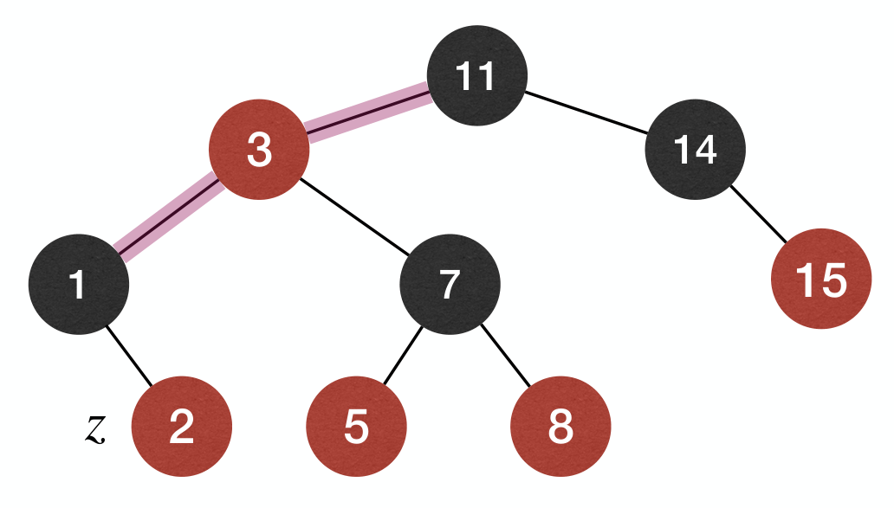

Step two haves some cases.

> Note: with the execution of algorithm, we change our focus of the node: At the beginning, it is the node to be inserted. Later, it is the node that needs to be changed to fix some property ! We refer to <u>the currently focused node</u> as `z`.

Case 0: `z` becomes the root of the RB-Tree.
- Fix: Simply recolor `z` as $\textcolor{orange}{\text{black}}$.


Case 1: `z`'s parent is $\textcolor{red}{\text{red}}$, so `z` has $\textcolor{orange}{\text{black}}$ grandparent and $\textcolor{red}{\text{red}}$ uncle `y`.
- Fix: Recolor `z`'s parent and uncle to $\textcolor{orange}{\text{black}}$ and `z`'s grandparent to $\textcolor{red}{\text{red}}$.

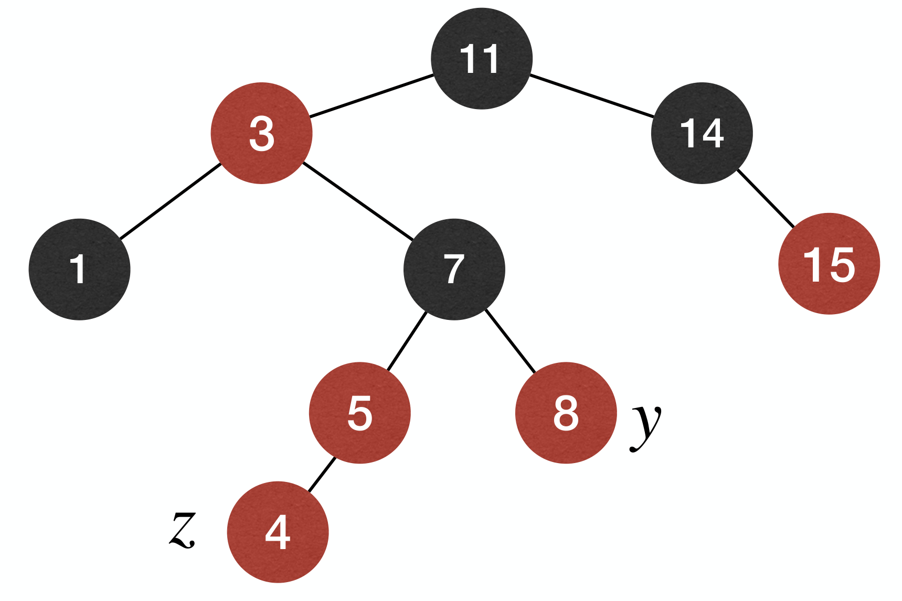

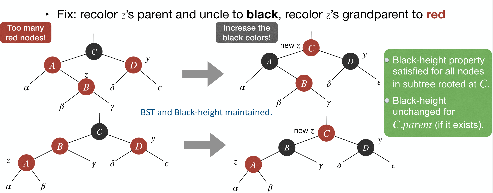

The effect of the fix: b-h property is maintained, and we *push-up* violation of n-r-e property to `z`'s grandparent.

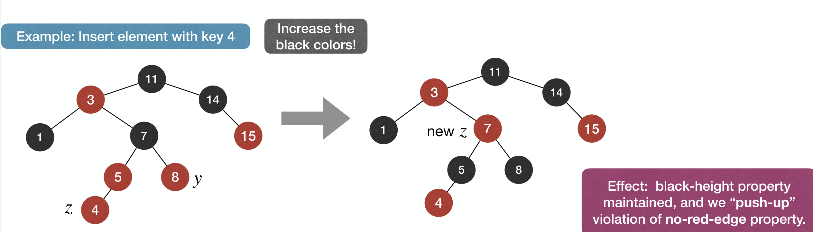

Case 2: `z`'s parent is $\textcolor{red}{\text{red}}$, and has $\textcolor{orange}{\text{black}}$ uncle `y`.
1. `z` is right child of its parent.
2. `z` is left child of its parent.

Case 2(a): `z`'s parent is $\textcolor{red}{\text{red}}$, has $\textcolor{orange}{\text{black}}$ uncle `y`, and `z` is right child of its parent.
- Fix: Left rotate at `z`'s parent, and then turn to Case 2(b).

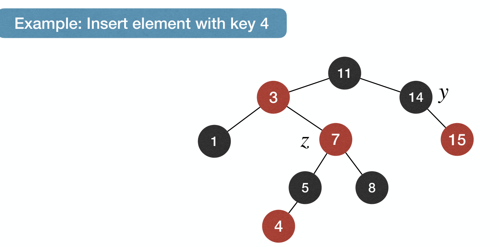

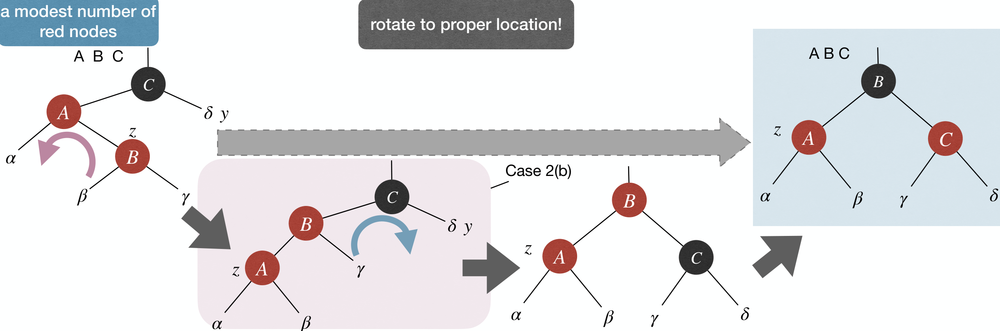

Case 2(b): `z`'s parent is $\textcolor{red}{\text{red}}$, has $\textcolor{orange}{\text{black}}$ uncle `y`, and `z` is left child of its parent.
- Fix: Right rotate at `z`'s grandparent, recolor `z`'s parent and grandparent.

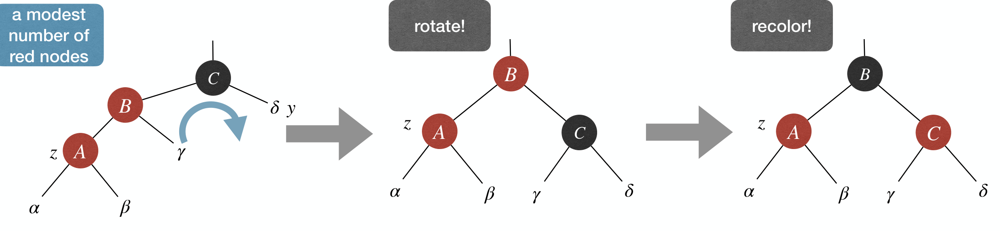

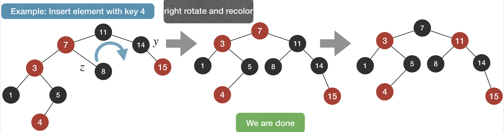

Summary:
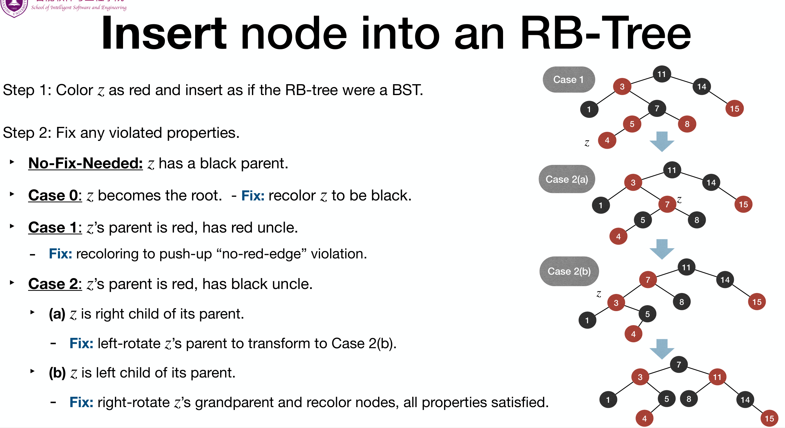

Time Complexity:
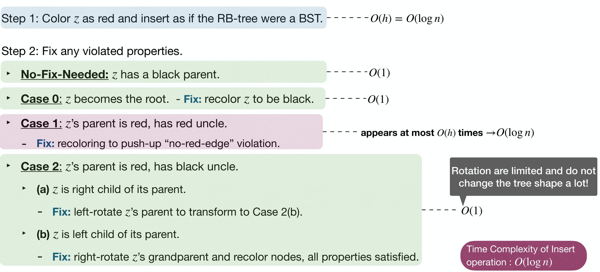

#### Remove

First execute the normal remove operation for BST:
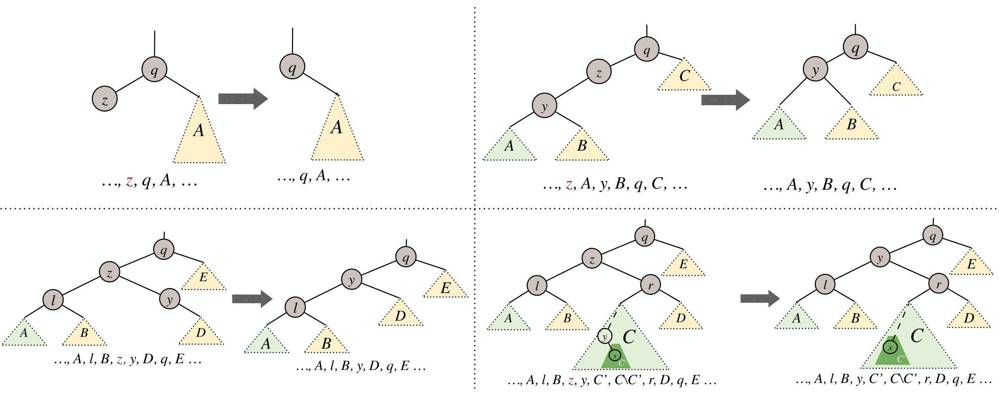

!!! note ""
    We can reduce this 4 cases to 2 cases. Structurally deleted node:
    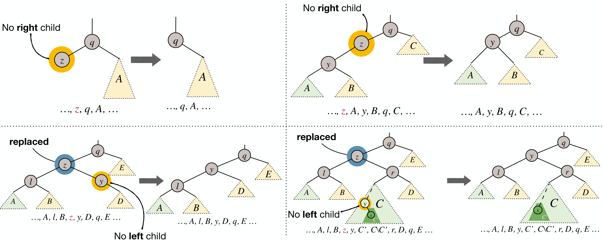

    Cases:
    1. If `z`'s right child is an external node (leaf) , then z is the node to be deleted **structurally**: subtree rooted at `z.left` will replace `z`.
    2. If `z`'s right child is an internal node, then let `y` be the min node in subtree rooted at `z.right`. Overwrite `z`'s info with `y`'s info, and `y` is the node to be deleted **structurally**: subtree rooted at `y.right` will replace `y`.

    Either way, only 1 structural deletion is needed.

    Apply the structural deletion, and repair violated properties.

    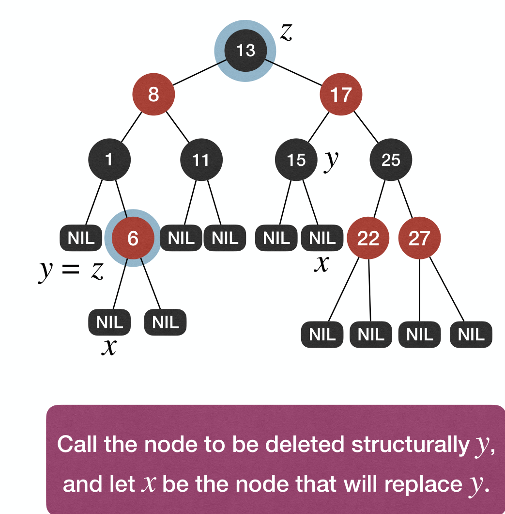

Steps:
1. Identify the node to be deleted structurally.
2. Apply the structural deletion
    - Maintain BST property.
3. Repair violated RB-Tree properties
    1. If `y` is a $\textcolor{red}{\text{red}}$ node:
        - Fix: No violations.
    2. If `y` is a $\textcolor{orange}{\text{black}}$ node and `x` is a $\textcolor{red}{\text{red}}$ node:
        - Fix: Recolor `x` to $\textcolor{orange}{\text{black}}$ and done.
    3. If `y` is a $\textcolor{orange}{\text{black}}$ node and `x` is a $\textcolor{orange}{\text{black}}$ node:
        - Fix: Fix double-$\textcolor{orange}{\text{black}}$ violation. To be introduced later.

Assume $\textcolor{orange}{\text{black}}$ `x` is left child of its parent after taking $\textcolor{orange}{\text{black}}$ `y`'s place. And we focus on fixing b-h property.

Case 1: `x`'s sibling `w` is $\textcolor{red}{\text{red}}$.
- Fix: Rotate and recolor.
- Effect: Change `x`'s sibling's color to black, and transform to other cases.


Case 2: `x`'s sibling `w` is $\textcolor{orange}{\text{black}}$, and both `w`'s children are $\textcolor{orange}{\text{black}}$.
- Fix: Recolor and *push-up* extra blackness in `x`.
- Effect: Either we are done (RB), or we have *push-up* `x` (RR).

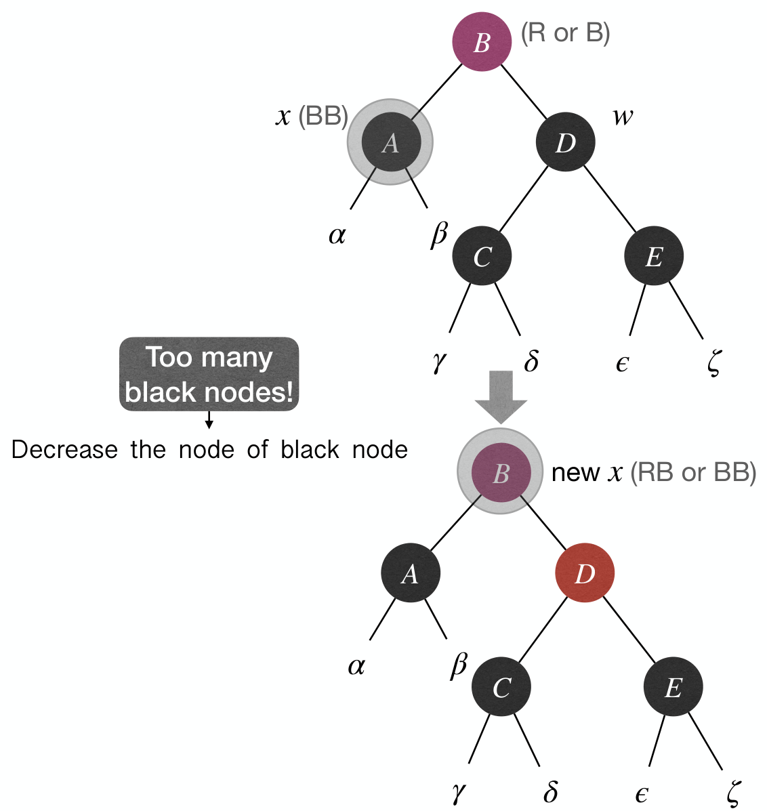

Case 3: `x`'s sibling `w` is $\textcolor{orange}{\text{black}}$, and `w`'s left child is $\textcolor{red}{\text{red}}$ and right child is $\textcolor{orange}{\text{black}}$.
- Fix: Rotate and recolor.
- Effect: `w.right` becomes $\textcolor{red}{\text{red}}$ and transform to Case 4.

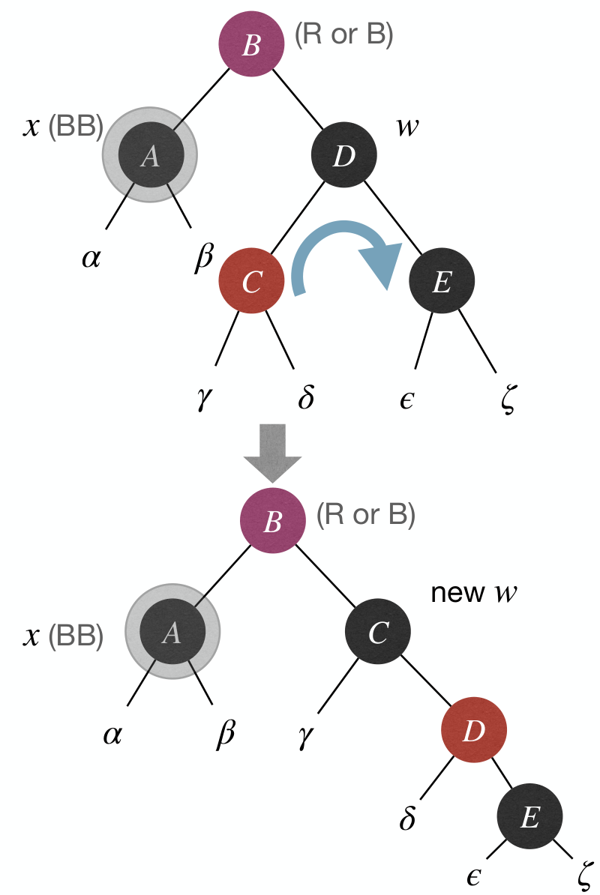

Case 4: `x`'s sibling `w` is $\textcolor{orange}{\text{black}}$, and `w`'s right child is $\textcolor{red}{\text{red}}$.
- Fix: Rotate and recolor.
- Effect: Done.

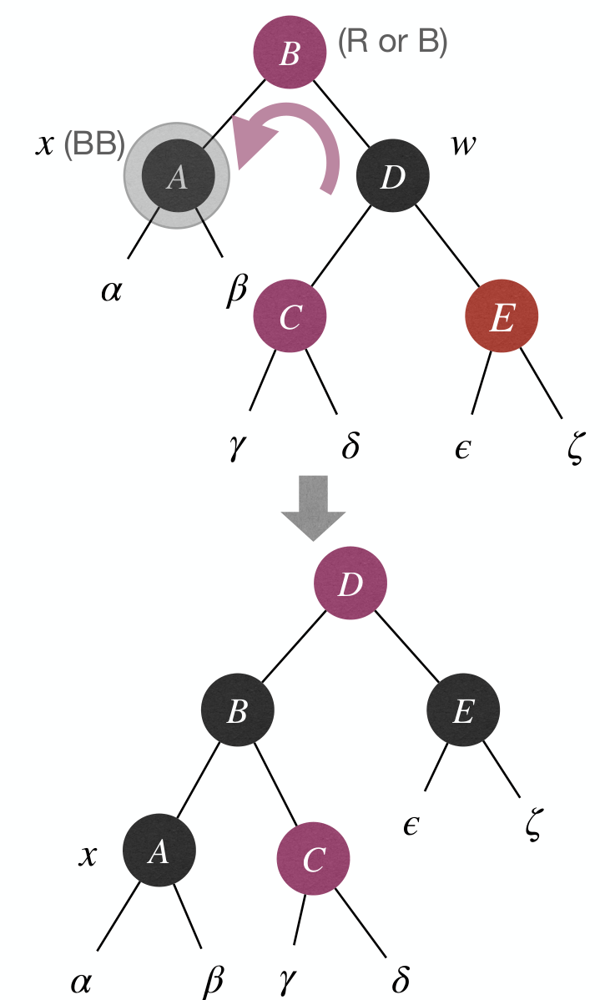

Summary & Time Complexity:
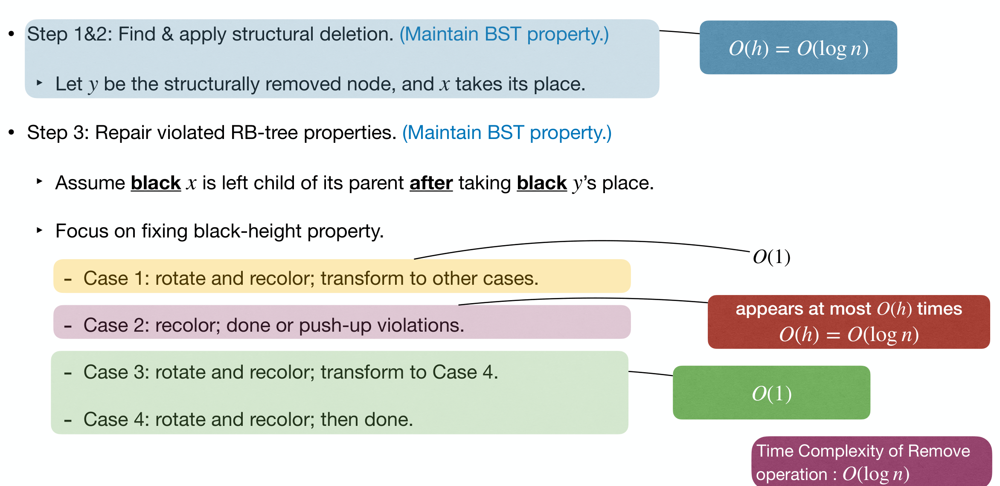

### Skip List (跳表)

Why sorted LinkedList is slow? Because to reach an element, you have to move from current position to the destination one at a time.

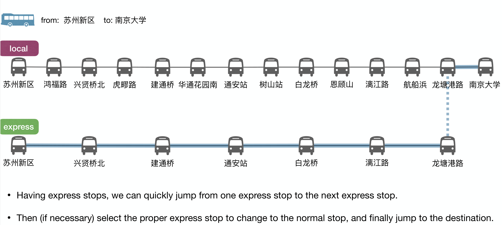

We can represent the ordered LinkedList as two LinkedLists, one for express stops and one for all stops.

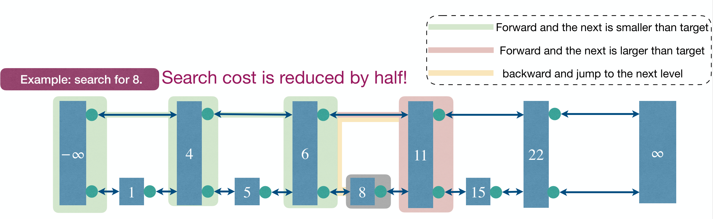

We can build multiple express ways to reduce number of elements by half at each level. This is just binary search, reducing search range by half at each level.

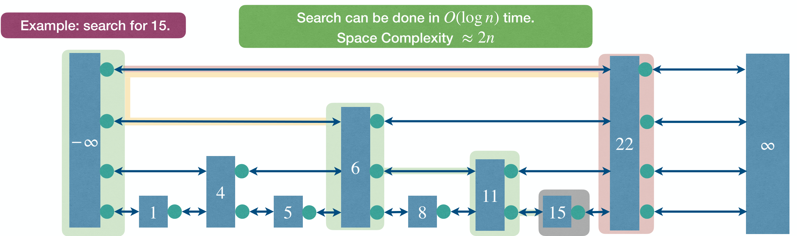

This is efficient, $O(1)$ time at each level and $O(\log n)$ levels in total.


#### Insert

```python
Insert(L, x):
level := 1
done := False
while !done
    Insert x into level k List
    Flip a fair coin:
        With probability 1/2: done := True
        With probability 1/2: level := level + 1
```


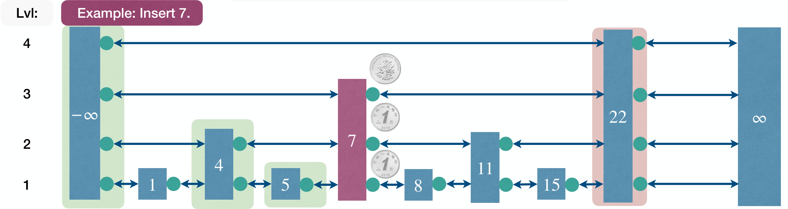

#### Complexity

Time complexity
- $O(1)$ in expectation
- $O(\log n)$ with high probability, i.e., with $p \ge \dfrac{1}{n^{\Theta(1)}}$.

The maximum level of $n$-element SkipList is $O(\log n)$ with high probability.

Consider the *reverse* of the path taken to find $k$. We always move up as we can, because we always enter a node from its topmost level when doing a find.

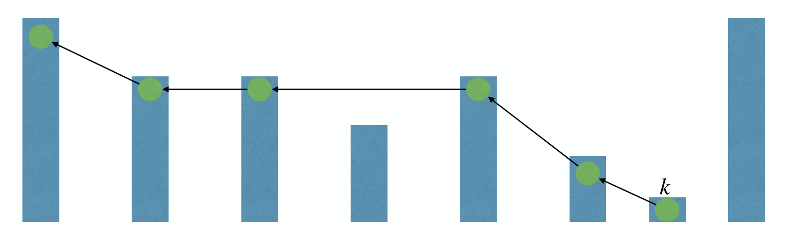

The probability that we can move up at a given step of the reverse walk is $\dfrac{1}{2}$, since the probability of the existence of the next level is $\dfrac{1}{2}$ (we flip a fair coin to determine whether to insert at a higher level).

Steps to go up $i$ levels $C(i)=$
- Make one step, then make either
    1. $C(i-1)$ steps if this step went up
    2. $C(i)$ steps if this step went left

Expected number of steps to walk up $i$ levels is:
$$
C(i) = 1 + \dfrac{1}{2}C(i-1) + \dfrac{1}{2}C(i)
$$

Then we get
$$
C(i) = C(i-1) + 2
$$
and
$$
C(i) = 2i
$$

Since there are $O(\log n)$ levels expected, we have $O(\log n)$ steps expected.

#### Height expectation

For each level $i \in \left\lbrace 1, 2, \dots \right\rbrace$, define the IRV
$$
I_i = \begin{cases}
    0, \text{if the current level } L_i is empty\\ 
    1, \text{otherwise}
\end{cases}
$$

*[IRV]: Indicator Random Variable

The height $h$ of the SkipList is then given by $h = \displaystyle \sum_{i=1}^{\infty} I_i$.

Note that $I_i$ is never more than length of $L_i$ (number of elements), hence $\mathbb{E}[I_i] \le \mathbb{E}[L_i] = \dfrac{n}{2^i}$ where $n$ is the number of elements in the SkipList.

Then we have
$$
\begin{aligned}
    \mathbb{E}[h] &= \sum_{i=1}^{\infty} \mathbb{E}[I_i]\\
    &= \sum_{i=1}^{\left\lfloor \log n \right\rfloor} \mathbb{E}[I_i] + \sum_{i=\left\lfloor \log n \right\rfloor + 1}^{\infty} \mathbb{E}[I_i]\\ 
    &\le \sum_{i=1}^{\left\lfloor \log n \right\rfloor} 1 + \sum_{i=\left\lfloor \log n \right\rfloor + 1}^{\infty} \dfrac{n}{2^i}\\ 
    &= \left\lfloor \log n \right\rfloor + \sum_{i=\left\lfloor \log n \right\rfloor + 1}^{\infty} \dfrac{1}{2^{i-\log n}}\\
    &\le \log n+ \sum_{i=0}^{\infty}\dfrac{1}{2^i}\\
    &= \log n + 2
\end{aligned}
$$

### Summary

Efficient implementation of ORDERED DICTIONARY:

|                  |       `Search(S, k)`       |       `Insert(S, x)`       |       `Remove(S, x)`       |
|       :-:        |            :-:             |            :-:             |    :-:             |
| BinarySearchTree |    $O(h)$ in worst case    |    $O(h)$ in worst case    | $O(h)$ in worst case    |
|      Treap       | $O(\log n)$ in expectation | $O(\log n)$ in expectation |   $O(\log n)$ in expectation |
|     RB-Tree      | $O(\log n)$ in worst case  | $O(\log n)$ in worst case  |   $O(\log n)$ in worst case  |
|     SkipList     | $O(\log n)$ in expectation | $O(\log n)$ in expectation |   $O(\log n)$ in expectation |
